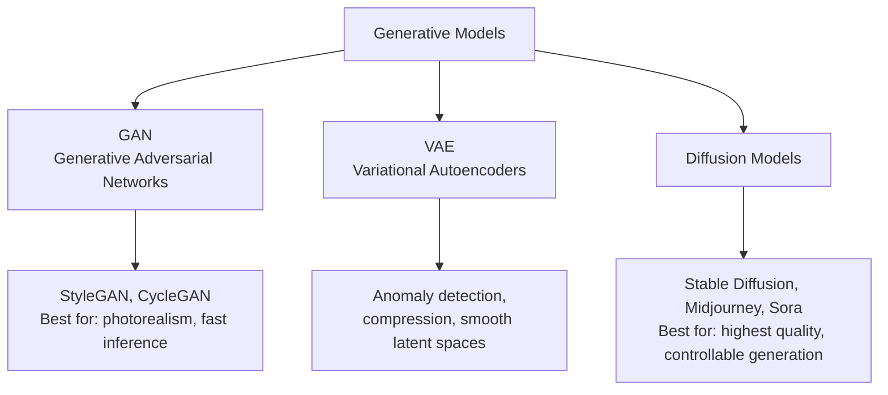

# Generative Models — Why This Matters

**Why models that create — not just classify or predict — became the most economically disruptive area of AI in the 2020s. And why that disruption cuts both ways.**

---

## The Designer, the Researcher, and the Pharmacist

A small fashion studio in Milan has three designers. They need to ship 200 new product variations every week — different fabric textures, different cuts, different color stories — and photograph each in studio. Hiring more designers is not in the budget. Hiring more photographers is not in the budget. Hiring more *anyone* is not in the budget.

In 2024, they trained a generative model on 5,000 of their past products and 50,000 inspiration images. Now they generate variations in seconds. The designers spend their time editing and selecting, not creating from scratch. The studio's output goes from 200 variations to 2,000 variations. Their hit rate per launch goes up because they can A/B-test ten times more concepts. They sell more without hiring anyone.

A researcher in São Paulo studies a rare childhood blood disorder. There are only **47 known patients globally**. To train a diagnostic model, the standard advice — "you need at least 1,000 labeled examples per class" — is impossible. The disease itself does not produce 1,000 patients. So she generates synthetic blood smear images with a diffusion model conditioned on her real samples. The synthetic images are not used for diagnosis. They are used for **training the diagnostic model**. Combined with the 47 real images, the synthetic data lets her hit 94% sensitivity. Without synthetic data, the model would not exist; without the model, hospitals cannot screen.

A pharmacist in rural Wisconsin uses a generative model trained on millions of pill images to verify what is in a patient's hand against the prescription. The model was trained on a database of every approved pill in North America — but real pharmacy lighting, hand positions, and partial views are nothing like the database photos. The training set was *augmented with generated images* — same pills, different lighting, different angles, different hand positions. The model now works in real-world conditions because the training data did.

---

## What Generative Models Actually Do

A discriminative model (everything you have built so far in this playbook series — classifiers, detectors, segmenters) takes input and produces a label. **Cat or dog. Tumor or healthy. Defect or pass.**

A generative model takes random noise (or a text prompt, or a sketch) and produces **a new piece of data that did not exist before.** A new image. A new song. A new molecule. A new training example.

The conceptual shift is fundamental:

| Discriminative | Generative |
|---|---|
| Models `p(y \| x)` — probability of label given data | Models `p(x)` or `p(x \| y)` — probability of data itself |
| "What is this?" | "Show me a new one." |
| Outputs a class or score | Outputs a new sample |
| Trained on (input, label) pairs | Trained on data alone (often unsupervised) |
| Examples: ResNet, BERT, YOLO | Examples: StyleGAN, Stable Diffusion, GPT, Sora |

This shift unlocks use cases discriminative models cannot touch:

- **Synthetic data** for training when real labels are scarce or expensive
- **Content creation** — images, video, audio, 3D, code, text
- **Design exploration** — generating thousands of variations a human can curate
- **Scientific simulation** — generating molecules with desired properties
- **Interactive systems** — chatbots, copilots, agents (which generate text token by token)
- **Restoration** — denoising, super-resolution, missing-frame interpolation

---

## The Three Families of Generative Models

Three architectures dominate. Each solves the "create new data" problem differently.

### GAN (Generative Adversarial Network)

Two networks playing a minimax game.

- **Generator** takes random noise, produces fake data.
- **Discriminator** sees real and fake data, tries to tell them apart.
- They train against each other — generator wants to fool, discriminator wants to catch.
- At convergence, generator produces output the discriminator cannot distinguish from real.

**Strengths.** Fast inference (one forward pass through the generator). Sharp, photorealistic outputs at their best.

**Weaknesses.** Famously unstable to train. Suffers from **mode collapse** (generator finds one output that fools the discriminator and never explores). Hard to evaluate — there is no clean loss curve like a classifier.

**Real-world.** StyleGAN (face generation), CycleGAN (style transfer between domains — horse to zebra), DCGAN (the foundational architecture). Still used in production for fast generation.

### VAE (Variational Autoencoder)

An autoencoder with a probabilistic twist.

- **Encoder** compresses input into a *distribution* (mean + variance) in a latent space.
- **Decoder** samples from that distribution and reconstructs.
- The training objective balances **reconstruction quality** with **a smooth, well-organized latent space**.

**Strengths.** Stable training (unlike GAN). Smooth latent space — you can interpolate between samples meaningfully. Great for compression, anomaly detection, controllable generation.

**Weaknesses.** Outputs are often **blurry** compared to GAN. The probabilistic objective optimizes for "average" reconstruction.

**Real-world.** Anomaly detection (encode normal data; high reconstruction error = anomaly). VQ-VAE inside Stable Diffusion (compresses images before diffusion runs). Hidden in many production pipelines.

### Diffusion Models

Iteratively denoise pure random noise into a sample.

- **Forward process.** Take real data, add tiny amounts of noise step by step until pure noise.
- **Reverse process.** Train a network to undo each noising step. At inference, start with noise and run the network 20-50 times to denoise into a sample.

**Strengths.** Produce the **highest-quality outputs** of any current generative family. Highly controllable — text prompts, sketches, image-to-image conditioning all work. Stable training compared to GANs.

**Weaknesses.** **Slow inference** — 20-50 forward passes per sample (vs 1 for GAN). Compute-expensive to train and serve. Newer architectures (Latent Diffusion, distillation) mitigate but do not eliminate.

**Real-world.** Stable Diffusion, Midjourney, DALL-E 3, OpenAI Sora (video), Adobe Firefly. The dominant architecture for image and video generation in 2026.

---

## Why Now? — The Three Drivers (Generative Edition)

Generative models existed since the 1990s. So why are they reshaping industries now?

### 1. The Architectures Finally Work at Scale

- **2014: Original GAN paper** by Ian Goodfellow. First credible neural generative model.
- **2015: DCGAN** stabilized GAN training enough to be useful.
- **2018: StyleGAN** generated photorealistic faces.
- **2020: DDPM (Denoising Diffusion Probabilistic Models)** put diffusion on the map.
- **2022: Latent Diffusion / Stable Diffusion** made diffusion runnable on consumer GPUs.
- **2023: GPT-4, DALL-E 3, Midjourney v5** — generative quality crossed "indistinguishable from human" for many applications.
- **2024+: Sora, Veo, generative video.**

Each step took years. The 2022 inflection point (Stable Diffusion + ChatGPT) was the moment generative AI became economically real.

### 2. Compute and Data Are Finally There

- Diffusion models train on hundreds of millions of images. Possible because of LAION (5 billion image-text pairs scraped from the web).
- GPUs finally cheap enough that creators can run Stable Diffusion locally on consumer cards.
- Cloud GPU rental ($1-10 per hour) puts model training within reach of small teams.

### 3. Human-AI Collaboration Got Productized

The hardest part of generative AI was never the model. It was the **interface**. ChatGPT-style chat, Midjourney-style prompt iteration, GitHub Copilot's inline suggestions — these UI patterns made generative AI useful to non-experts. Without them, the models would have stayed in research labs.

---

## The Dark Side — And What It Means for Engineering

Every generative capability has a dual use. Engineering teams that build with these tools must think about misuse from day one.

| Capability | Productive Use | Misuse |
|---|---|---|
| Photorealistic faces | Avatars, marketing, training data | Non-consensual deepfakes, harassment |
| Voice cloning | Accessibility, audiobook production, personalized assistants | Phone scams, identity theft |
| Video generation | Film, education, advertising | Disinformation, fake "evidence" |
| Code generation | Productivity, education | Malware, automated phishing |
| Synthetic medical data | Privacy-preserving research | False research findings if used incorrectly |
| Synthetic training data | Solving small-data problems | Models trained on synthetic-only data may fail on real distributions |

**This is not a future problem.** It is a current problem. Every team shipping a generative system in 2026 must:

- Watermark outputs (when feasible — see C2PA standard)
- Filter prompts and outputs for known harm categories
- Provide provenance ("this image was AI-generated, model X, date Y")
- Plan for adversarial use and abuse — not as an afterthought, but as an architecture concern

[Chapter 08 — Quality, Security, Governance](08_Quality_Security_Governance.md) covers what this looks like in practice.

---

## Where Generative Models Fit in Production Systems

Generative models rarely ship alone. They are components of larger systems.

| Component | What It Does | Where Generative Fits |
|---|---|---|
| **Prompt / Input handler** | Sanitizes input, extracts intent | Upstream of the model |
| **Generative model** | **The actual generator (GAN, VAE, Diffusion)** | **The model itself** |
| **Safety filter** | Detects unsafe outputs (NSFW, copyrighted, defamatory) | Downstream of the model |
| **Watermark / provenance** | Embeds detectable mark in generated content | Output post-processing |
| **Storage / CDN** | Caches generated assets | Output distribution |
| **Feedback loop** | User ratings retrain the model or its safety filter | Closes the loop |

A Midjourney-style service is the prompt handler + diffusion model + safety filters + watermark + CDN + payment + community gallery. The model is one of many components. Each is engineering, not just ML.

In our **Production Diagnostic Intelligence System (CSI):**

| Component | How Generative Helps |
|---|---|
| Synthetic incident data | Generate realistic-but-fake error logs to train classifiers when real incidents are rare |
| Documentation generation | LLM generates first-draft runbooks from incident timelines |
| Diagram generation | Diffusion generates architecture diagrams from text descriptions |
| Anomaly synthesis | VAE generates "what would unhealthy look like?" for anomaly detection training |

See the full architecture: [CSI Architecture](../../../systems/continuous-system-intelligence/architecture.md)

---

## What You Will Learn in This Material

| Chapter | What You Learn |
|---|---|
| [01 — Why](01_Why.md) | This page. Why generative matters. The three families. The dark side. |
| [02 — Concepts](02_Concepts.md) | Generator/Discriminator, the minimax game, KL divergence (VAE), forward/reverse process (Diffusion). The math, in plain English. |
| [03 — Hello World](03_Hello_World.md) | SimpleGAN on MNIST in PyTorch. Generate digits in 50 lines. |
| [04 — How It Works](04_How_It_Works.md) | Training instability, mode collapse, evaluation metrics. The diagnostic skills generative training requires. |
| [05 — Building It](05_Building_It.md) | GAN vs VAE vs Diffusion — when to use which. Training recipes. |
| [06 — Production Patterns](06_Production_Patterns.md) | Stable Diffusion, Midjourney, Sora, StyleGAN — real systems, real architectures, real costs. |
| [07 — System Design](07_System_Design.md) | Serving generative models. Latency, prompt handling, batching, caching, GPU economics. |
| [08 — Quality, Security, Governance](08_Quality_Security_Governance.md) | Deepfakes, watermarking, content provenance, copyright, safety filters. |
| [09 — Observability & Troubleshooting](09_Observability_Troubleshooting.md) | Measuring generative quality at scale. FID/CLIP/perceptual metrics in production. |
| [10 — Decision Guide](10_Decision_Guide.md) | "Should I generate or retrieve?" decision table. GAN vs VAE vs Diffusion vs API. |

### Architecture Deep Dives (Coming)

| Doc | When to Read |
|---|---|
| `architectures/gan.md` | When choosing between GAN variants — DCGAN, StyleGAN, CycleGAN, conditional GAN |
| `architectures/vae.md` | When you need controllable latent spaces or anomaly detection |
| `architectures/diffusion.md` | When you need state-of-the-art quality and can pay the inference cost |
| `architectures/style-transfer.md` | When transferring style between images (Gatys-style or fast style transfer) |
| `architectures/u-net.md` | The encoder-decoder backbone — used in segmentation AND diffusion |

### Foundations and Sibling Playbooks

This playbook builds on:

- [Deep Learning](../deep-learning/) — perceptron, backprop, training loop, diagnostics
- [Computer Vision](../computer-vision/) — CNN, transposed convolution (the upsampling primitive in generators)
- [Math for AI](../math-for-ai.md) — derivatives, chain rule, gradient descent, KL divergence

**Hands-on notebook:** [Deep Learning Autoencoders & GANs on Colab](https://colab.research.google.com/github/sunilmogadati/systems-in-production/blob/main/implementation/notebooks/Deep_Learning_Autoencoders_GANs.ipynb) — autoencoder, SimpleGAN, and DCGAN implementations on MNIST.

---

**Next:** [02 — Concepts](02_Concepts.md) — Generator and discriminator, the minimax game, latent spaces, the math behind what you just read.
