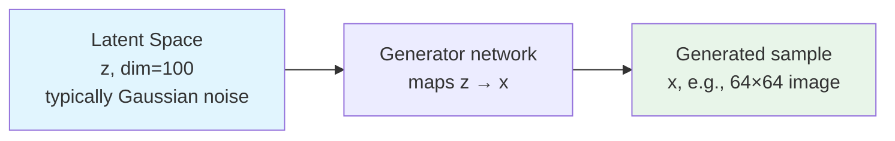
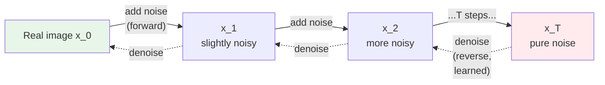

# Generative Models — Concepts and Mental Models

**Generator and discriminator, the minimax game, latent spaces, the math behind GAN/VAE/Diffusion. With worked examples.**

---

> **Build on the foundations.** Backpropagation, the training loop, optimizers, loss curves are universal — see [Deep Learning → Concepts](../deep-learning/02_Concepts.md) and [Math for AI](../math-for-ai.md). This chapter focuses on what is *unique to generation*: adversarial training, latent variables, and iterative denoising.

---

## Discriminative vs Generative — The Mental Shift

Every model you have built so far in this playbook series is **discriminative**. It takes input and outputs a decision.

Generative models flip the question. Same neural-network mechanics underneath. Different objective.

| Aspect | Discriminative | Generative |
|---|---|---|
| **Models** | `p(y \| x)` — probability of label given input | `p(x)` or `p(x \| y)` — probability of data itself |
| **Question it answers** | "What is this?" | "What does data like this look like?" |
| **Output** | A class, a score, a bounding box | A new image, a new sentence, a new molecule |
| **Training data** | (input, label) pairs | Often just data, no labels needed |
| **Examples** | ResNet, BERT classifier, YOLO | StyleGAN, Stable Diffusion, GPT |

A classifier is asked: *"Is this a cat?"*
A generative model is asked: *"Show me what a cat looks like."* — and produces a new cat.

**Why this matters.** Discriminative training is straightforward — a label tells the model when it is wrong. Generative training is harder because there is no obvious "right answer" for a new sample. The three families (GAN, VAE, Diffusion) differ in **how they define what counts as a good generated sample.**

---

## Latent Space — The Universal Trick

Every generative model has a **latent space** — a compressed, structured space that the generator maps from (or to). The latent space is where the *idea* lives; the model translates between latents and the high-dimensional output (image, audio, text).



**Key facts:**

- The latent space is **much smaller** than the output (e.g., 100 dimensions for a 64×64×3 = 12,288-pixel image).
- Each point in the latent space corresponds to one possible output.
- **Smooth movement in the latent space produces smooth changes in output.** Walk from z₁ to z₂ and you see a gradual morph between the two outputs (this is why GAN demos can interpolate faces smoothly).
- **The latent space is learned.** Training organizes it so meaningful axes emerge (e.g., one direction = age, another = smile, another = pose). This is why ControlNet and similar techniques work — they manipulate specific axes.

The three families differ in **what the latent space looks like and how the model reaches it:**

| Family | Latent Space | How |
|---|---|---|
| **GAN** | Sampled directly from random noise | Generator maps noise → output. No encoder. |
| **VAE** | Learned distribution (mean + variance) per input | Encoder maps input → latent distribution. Sample latents, decode. |
| **Diffusion** | Same shape as the output (image-sized) | No compression. Iteratively denoise from full noise to clean output. |

---

## GAN — Two Networks Playing a Minimax Game

A GAN (Generative Adversarial Network) trains two networks at the same time, with opposite objectives.

```mermaid
graph TD
    Z[Random noise z<br/>~ N(0,1), dim 100]
    G[Generator network G]
    Fake[Generated sample G(z)]

    Real[Real sample x<br/>from training set]

    D[Discriminator network D]
    Score[Probability real ∈ [0,1]]

    Z --> G --> Fake
    Real --> D
    Fake --> D
    D --> Score

    Score -.->|"Loss for D: BCE"| D
    Score -.->|"Loss for G: fool D"| G

    style G fill:#E8F5E9
    style D fill:#FFEBEE
```

### The Two Networks

**Generator G** — takes noise, produces fake data.
- Input: random vector `z ~ N(0, 1)`, typically 100-dim
- Output: a fake sample `G(z)` with the same shape as real data (e.g., 28×28 image)
- Goal: produce fakes that fool the discriminator

**Discriminator D** — takes a sample, outputs the probability it is real.
- Input: either a real sample `x` or a fake `G(z)`
- Output: probability ∈ [0, 1] that the input is real
- Goal: assign 1.0 to real, 0.0 to fake

### The Adversarial Objective

The two networks have opposite objectives — written as a single **minimax** equation:

```
min_G max_D  E[log D(x)] + E[log(1 − D(G(z)))]
```

Reading this:

- `max_D` — the discriminator wants to **maximize** this expression: high `log D(x)` (correctly identify real as real) and high `log(1 − D(G(z)))` (correctly identify fake as fake).
- `min_G` — the generator wants to **minimize** the expression: it cannot affect `D(x)` directly, but it can make `D(G(z))` close to 1, which makes `log(1 − D(G(z)))` go to negative infinity. Generator wants the discriminator to *think the fake is real.*

In code, you do not implement this minimax directly. You alternate:
1. Train D for one batch (binary cross-entropy: real → 1, fake → 0)
2. Train G for one batch (binary cross-entropy: pass G(z) through D, pretend the label is 1, backprop into G)

### The Plain-English Analogy

A counterfeiter (generator) makes fake money. A detective (discriminator) tries to spot fakes.

- The counterfeiter starts terrible — fakes are obviously wrong.
- The detective starts terrible — flags everything as fake.
- They play the game over and over.
- The counterfeiter learns from getting caught. The detective learns from missed fakes.
- After enough rounds, the fakes become indistinguishable from real bills.
- The detective is then fired — only the counterfeiter is kept (`G` is the deployed model; `D` is discarded).

### Why Random Noise as Input?

Without noise as input, the generator would have no way to distinguish "the third digit I generate" from "the first digit I generate" — same input, same output, **always the same image.** The 100-dimensional noise vector is a unique "seed" for each generation. Different noise → different output. The generator learns a smooth mapping from noise space to image space.

This is why you can do **latent interpolation** — pick `z₁` (noise that generates a 3) and `z₂` (noise that generates a 7), walk linearly between them, and see digits morph smoothly from 3 → 5 → 7.

### Why Two Networks Instead of One?

You could try a single network: minimize pixel-distance between output and a real image. That gives **blurry averages** — the network minimizes loss by predicting the mean of all real digits. Not a sharp specific digit.

GANs replace pixel-distance with "fool a network that is trying to catch you." A blurry image is *easy* to flag as fake. So the generator is forced to commit to sharp, decisive outputs. **The discriminator's job is to provide a better gradient signal than pixel-distance ever could.**

### Mode Collapse — The Famous Failure Mode

The generator finds *one* output that fools the discriminator pretty well, and stops exploring. It generates only that one output (or a small set of them). The other modes of the data distribution (other digits, other faces, other classes) are never produced.

**The intuition.** A student finds one exam answer that gets partial credit — and writes that same answer for every question. The student "wins" the local game but fails to actually learn the material.

**Symptoms.** Generator output diversity drops. Same image (or a few images) repeats across noise samples.

**Mitigations.** Mini-batch discrimination (let D see batches of fakes — repeated outputs become obvious). Wasserstein loss (replaces minimax with a smoother objective). Progressive growing (start small, grow during training). All these are detailed in [Chapter 04](04_How_It_Works.md).

### Where the Gradients Flow

Important insight that confuses many practitioners.

**When training D:** standard supervised learning. Gradients flow from the BCE loss into `D`'s weights.

**When training G:** the loss is `BCE(D(G(z)), label=1)`. Gradients flow from the loss, *through D's frozen weights*, and into G's weights. The chain rule:

```
∂L_G/∂θ_G = ∂L_G/∂D(G(z)) · ∂D(G(z))/∂G(z) · ∂G(z)/∂θ_G
```

Notice the middle term: **G learns by reading D's gradient.** D acts as a *differentiable judge*. G follows D's gradient to make samples that D would call real. This is why D cannot be too dumb (no useful gradient) and cannot be too smart (gradient saturates at 0). Balance is everything.

---

## VAE — Encoding to a Distribution

A **VAE (Variational Autoencoder)** is an autoencoder with a probabilistic twist.

A standard autoencoder compresses input to a fixed code and reconstructs. A VAE compresses input to a **distribution** (mean + variance), samples from that distribution, then decodes.

```mermaid
graph LR
    X[Input x<br/>e.g., 28×28 image]
    Enc[Encoder network]
    Mu[Mean μ]
    Sigma[Std σ]
    Z[Sampled z<br/>= μ + σ · ε<br/>where ε ~ N(0,1)]
    Dec[Decoder network]
    Xhat[Reconstruction x̂]

    X --> Enc
    Enc --> Mu
    Enc --> Sigma
    Mu --> Z
    Sigma --> Z
    Z --> Dec --> Xhat

    style X fill:#E3F2FD
    style Z fill:#FFF3E0
    style Xhat fill:#E8F5E9
```

### The Two Loss Terms

VAE training has two objectives, summed into one loss:

```
L_VAE = Reconstruction Loss  +  β · KL Divergence
```

| Term | What It Does |
|---|---|
| **Reconstruction loss** | "Decoded output should match the input." MSE or BCE depending on data type. |
| **KL divergence** | "Encoded distribution should be close to a standard normal `N(0, 1)`." This regularizes the latent space. |

### Why the KL Term Matters

Without the KL term, a VAE is just an autoencoder. The encoder learns whatever latent organization is most convenient — usually a sparse, fragmented space where you cannot meaningfully sample new latents.

With the KL term, the encoder is *forced* to map every input to a region near `N(0, 1)` in latent space. Every sample from `N(0, 1)` decodes to something plausible. **This is what makes a VAE generative** — you can sample new latents from `N(0, 1)` and decode them into new outputs.

### The Reparameterization Trick

To sample `z` differentiably, the standard trick:

```
z = μ + σ · ε,   where ε ~ N(0, 1)
```

You sample the random part (`ε`) outside the network. The network outputs `μ` and `σ`. Now `z` is a deterministic function of `μ`, `σ`, and `ε`. Backprop flows through `μ` and `σ` cleanly. Without this trick, you cannot train through a sampling operation.

### VAE vs GAN Tradeoff

| | VAE | GAN |
|---|---|---|
| **Training stability** | Stable | Unstable (mode collapse, vanishing gradients) |
| **Output sharpness** | Often blurry | Sharp |
| **Latent space** | Smooth, semantic, controllable | Less organized but rich |
| **Loss is meaningful** | Yes (you can plot a loss curve) | Not really — adversarial loss is hard to interpret |
| **Mode collapse** | Rare | Common |
| **Best use** | Anomaly detection, controllable generation, compression | Photorealistic generation, fast inference |

In modern systems (Stable Diffusion, etc.), VAE is often used **as a component** — the VAE compresses images to a smaller latent, and a diffusion model operates in that latent space. This is "latent diffusion."

---

## Diffusion — Iterative Denoising

The newest of the three families. Diffusion models are now state-of-the-art for image, video, and audio generation.

The idea: **destroy real data with noise, then learn to undo the destruction.**



### Forward Process (No Learning Required)

Take a real image `x_0`. Add a tiny amount of Gaussian noise. Repeat T times (typically T = 1000). After T steps, the image is pure random noise `x_T` with no structure left.

```
x_t = sqrt(α_t) · x_{t-1} + sqrt(1 − α_t) · ε,    ε ~ N(0, 1)
```

Each step is a simple noisy interpolation. The schedule of `α_t` is fixed before training. No neural network involved in the forward process.

### Reverse Process (The Learned Network)

Train a neural network to predict the noise that was added at each step. Given `x_t`, predict `ε` — the noise component. If you can predict noise accurately, you can subtract it and recover `x_{t-1}`.

```
Loss = || ε − ε_θ(x_t, t) ||²
```

`ε_θ` is the neural network (typically a U-Net). It takes the noisy image and the timestep, predicts the noise. Train on the standard MSE between predicted and actual noise.

### Inference (Sampling)

Start with pure noise `x_T`. Iteratively denoise:

1. Predict the noise in `x_T`. Subtract it. Get `x_{T-1}`.
2. Predict noise in `x_{T-1}`. Subtract. Get `x_{T-2}`.
3. ... repeat for T steps ...
4. End up at `x_0` — a clean, generated sample.

**This is why diffusion is slow.** GAN: 1 forward pass per sample. Diffusion: 50-1000 forward passes per sample (modern techniques like DDIM cut this to 20-50).

### The U-Net Inside Diffusion

The denoising network `ε_θ` is almost always a **U-Net** — an encoder-decoder CNN with skip connections. The U-Net was originally designed for medical image segmentation but turned out to be the perfect architecture for "input image → same-shape output image" tasks like noise prediction.

```
Input image ─→ Encoder (downsample) ─→ Bottleneck ─→ Decoder (upsample) ─→ Output image
                       ╲                                  ╱
                        ╲────skip connections (concat)────╱
```

Skip connections preserve spatial detail through the bottleneck. This is critical for noise prediction — you need to know exactly where each pixel was, not just an averaged latent.

See `architectures/u-net.md` (coming) for the full architecture.

### Latent Diffusion — The Stable Diffusion Trick

Running diffusion in pixel space (e.g., 512×512 = 786,432 dimensions) is enormously expensive. Latent diffusion runs the diffusion process in a **compressed latent space** (e.g., 64×64×4 = 16,384 dimensions) produced by a VAE. The pipeline:

```
Text prompt → text encoder → text embeddings
              ↓
              ↓ (conditioning)
              ↓
Random noise ─[Diffusion U-Net, 50 steps]→ latent → VAE decoder → final image
```

Stable Diffusion runs in latent space; this is why it can run on consumer GPUs while pixel-space diffusion needed massive cloud compute.

### Conditioning — How Text Prompts Work

The diffusion network can be conditioned on extra inputs (text embeddings, class labels, sketches, depth maps). The conditioning is mixed into the U-Net at every layer via cross-attention. This is how "prompt → image" works — the prompt embedding steers the denoising at every step toward the requested concept.

---

## A Worked Example — One Step of GAN Training

Let's see one batch of GAN training, end to end. This makes the abstract math concrete.

**Setup:**
- Generator: random `z` (dim 4) → fake image (3-pixel toy "image")
- Discriminator: 3-pixel image → probability ∈ [0, 1]
- Real data: a single sample `x = [0.8, 0.2, 0.5]`

### Step 1: Generate a Fake

```
z = [0.5, -0.3, 0.1, 0.8]    (random noise)
G(z) = [0.4, 0.3, 0.6]        (generator output — initially random-looking)
```

### Step 2: Discriminator Sees Both

```
D(real x) = D([0.8, 0.2, 0.5]) = 0.6   (D thinks real is 60% real — not great yet)
D(fake)   = D([0.4, 0.3, 0.6]) = 0.55  (D thinks fake is 55% real — also not great)
```

### Step 3: Train Discriminator

The label for real is 1.0; for fake is 0.0. Compute BCE loss on each, sum:

```
L_D_real = -log(0.6) ≈ 0.51        (D should have said 1.0; said 0.6; medium loss)
L_D_fake = -log(1 - 0.55) ≈ 0.80   (D should have said 0.0; said 0.55; bigger loss)
L_D = L_D_real + L_D_fake ≈ 1.31

→ Backprop into D. D's weights update so it's better at telling real from fake.
```

### Step 4: Train Generator

Now we run the fake through the (just-updated) D and pretend the label is 1.0 (G wants D to say "real").

```
D(fake) = 0.55  (or whatever it is after D's update)
L_G = -log(0.55) ≈ 0.60

→ Backprop from L_G, THROUGH D's frozen weights, INTO G's weights.
→ G's weights update so it's better at fooling D.
```

### Step 5: Repeat

Do this for thousands of batches. `D` and `G` get progressively better. After enough training:

- `D(real) → 0.5` and `D(fake) → 0.5` — discriminator cannot tell them apart anymore.
- Generated samples look indistinguishable from real ones.
- Discriminate is discarded; only `G` is deployed.

This is the entire algorithm. Same forward-loss-backward-update loop you have seen since Deep Learning → Concepts. The only difference is **two losses, two networks, alternating updates.**

---

## Training an Autoencoder — Numbers by Hand

Before VAE adds the probabilistic twist, a vanilla autoencoder is just an MLP that learns to reconstruct its input. Forward + reconstruction loss + backward + update — same five-step training loop you have seen since [Deep Learning → Concepts](../deep-learning/02_Concepts.md). The new piece: gradients flow through **two networks** (encoder and decoder) chained together.

This walkthrough mirrors the [GAN worked example](#a-worked-example--one-step-of-gan-training) above. The companion notebook ([Generative Autoencoder From Scratch on Colab](https://colab.research.google.com/github/sunilmogadati/systems-in-production/blob/main/implementation/notebooks/Generative_Autoencoder_From_Scratch.ipynb)) runs the same example with NumPy and verifies against PyTorch autograd.

### The Setup

A 4-dim input compressed to a 2-dim bottleneck and reconstructed back to 4 dims.

```
Input x = [1.0, 0.5, 0.0, 0.5]                (4 numbers)
                ↓ Encoder W₁ (2×4) + b₁
Hidden z₁ = W₁·x + b₁                          (2 numbers, pre-activation)
h = ReLU(z₁)                                   (2 numbers, latent code)
                ↓ Decoder W₂ (4×2) + b₂
Reconstruction x̂ = W₂·h + b₂                   (4 numbers, no activation — regression)
                ↓
Loss L = 0.5 · ||x̂ − x||²                       (MSE)
```

Initial weights:

```
W₁ =  0.5   0.2  -0.3   0.1            b₁ = [0.0, 0.0]
     -0.1   0.3   0.4  -0.2

W₂ =  0.4   0.3                         b₂ = [0.0, 0.0, 0.0, 0.0]
     -0.2   0.5
      0.1  -0.4
      0.3   0.2

α = 0.1
```

Total learnable parameters: `(W₁: 8) + (b₁: 2) + (W₂: 8) + (b₂: 4) = 22`.

### Forward Pass

**Encoder.**

```
z₁ = W₁·x + b₁
   = [0.5·1.0 + 0.2·0.5 + (-0.3)·0.0 + 0.1·0.5,    -0.1·1.0 + 0.3·0.5 + 0.4·0.0 + (-0.2)·0.5]
   = [0.65,  -0.05]

h  = ReLU(z₁) = [0.65, 0.0]
```

The second neuron is dead (`z₁[1] = -0.05 < 0`). It will get zero gradient.

**Decoder.**

```
x̂ = W₂·h + b₂
  = [0.4·0.65 + 0.3·0,    -0.2·0.65 + 0.5·0,    0.1·0.65 + (-0.4)·0,    0.3·0.65 + 0.2·0]
  = [0.26,  -0.13,  0.065,  0.195]
```

**Reconstruction error.**

```
diff = x̂ − x = [-0.74, -0.63, 0.065, -0.305]

L = 0.5 · sum(diff²)
  = 0.5 · (0.5476 + 0.3969 + 0.004225 + 0.093025)
  = 0.5209
```

The reconstruction is poor on the first try (untrained weights). Training will reduce this loss.

### Backward Pass — Through Two Networks

Start at the output and walk the chain backward.

**Step 1.** `∂L/∂x̂`:

Since `L = 0.5 · sum((x̂ − x)²)`:
```
∂L/∂x̂ = x̂ − x = [-0.74, -0.63, 0.065, -0.305]
```

**Step 2 — Decoder gradients.** `x̂[i] = sum_j W₂[i,j]·h[j] + b₂[i]`:

```
∂L/∂W₂[i,j] = ∂L/∂x̂[i] · h[j]      → outer product of (∂L/∂x̂) and h
∂L/∂b₂[i]   = ∂L/∂x̂[i]
```

```
∂L/∂W₂ = ∂L/∂x̂ ⊗ h
       = [-0.74, -0.63, 0.065, -0.305]ᵀ × [0.65, 0]
       = -0.481  0.0
         -0.4095 0.0
          0.0422 0.0
         -0.1982 0.0

∂L/∂b₂ = [-0.74, -0.63, 0.065, -0.305]
```

The right column of `∂L/∂W₂` is zero because `h[1] = 0` (dead ReLU). All decoder weights connecting *from* the dead neuron get zero gradient.

**Step 3 — Pass through to the encoder.** `∂L/∂h = W₂ᵀ · ∂L/∂x̂`:

```
∂L/∂h[0] = (-0.74)·0.4 + (-0.63)·(-0.2) + 0.065·0.1 + (-0.305)·0.3 = -0.255
∂L/∂h[1] = (-0.74)·0.3 + (-0.63)·0.5    + 0.065·(-0.4) + (-0.305)·0.2 = -0.624
```

**Step 4 — Through the encoder ReLU.** `∂h/∂z₁ = 1` if `z₁ > 0`, else `0`:

```
ReLU mask = [1, 0]                                      (only neuron 0 is alive)
∂L/∂z₁[0] = -0.255 · 1 = -0.255
∂L/∂z₁[1] = -0.624 · 0 = 0                              ← dead neuron, no gradient
```

**Step 5 — Encoder gradients.** `z₁[j] = sum_i W₁[j,i]·x[i] + b₁[j]`:

```
∂L/∂W₁[j,i] = ∂L/∂z₁[j] · x[i]      → outer product of (∂L/∂z₁) and x
∂L/∂b₁[j]   = ∂L/∂z₁[j]
```

```
∂L/∂W₁[0,:] = -0.255 · [1.0, 0.5, 0.0, 0.5] = [-0.255, -0.1275, 0, -0.1275]
∂L/∂W₁[1,:] = 0      · [1.0, 0.5, 0.0, 0.5] = [0, 0, 0, 0]               ← dead row

∂L/∂b₁ = [-0.255, 0]
```

The entire bottom row of `∂L/∂W₁` is zero. **Dead ReLU stops the gradient at that neuron — both incoming and outgoing weights stop learning until the neuron revives.** This is why dying ReLU is a problem and why Leaky ReLU exists.

### Update

```
W₁_new[0,:] = [0.5,  0.2,  -0.3, 0.1]   − 0.1·[-0.255, -0.1275, 0, -0.1275]
            = [0.5255, 0.2128, -0.3, 0.1128]
W₁_new[1,:] = unchanged                    (zero gradient)

b₁_new = [0.0, 0.0] − 0.1·[-0.255, 0] = [0.0255, 0.0]

W₂_new (column 0 updated; column 1 unchanged because h[1] = 0):
        0.4 − 0.1·(-0.481)   0.3 − 0.1·0      0.4481  0.3
       -0.2 − 0.1·(-0.4095)  0.5 − 0.1·0   = -0.1591  0.5
        0.1 − 0.1·(0.0422)  -0.4 − 0.1·0      0.0958 -0.4
        0.3 − 0.1·(-0.1982)  0.2 − 0.1·0      0.3198  0.2

b₂_new = [0, 0, 0, 0] − 0.1·[-0.74, -0.63, 0.065, -0.305]
       = [0.074, 0.063, -0.0065, 0.0305]
```

### Cycle 2 — Verify Loss Drops

Run forward with the updated weights:

```
z₁  = [W₁_new] · x + b₁_new
    = [0.5255·1 + 0.2128·0.5 + (-0.3)·0 + 0.1128·0.5 + 0.0255,  -0.1·1 + 0.3·0.5 + 0.4·0 + (-0.2)·0.5 + 0]
    = [0.7152, -0.05]

h   = ReLU(z₁) = [0.7152, 0.0]                    (still dead ReLU on neuron 1)

x̂  = W₂_new · h + b₂_new ≈ [0.394, -0.0505, 0.0619, 0.2588]

L   = 0.5 · ||x̂ − x||² ≈ 0.366                    ← DOWN from 0.521 in Cycle 1
```

**Loss dropped from 0.521 to 0.366 in one step.** The reconstruction is improving. Run 50 more cycles and the loss converges to near-zero (the model memorizes this single example perfectly — it is the "training accuracy" of an autoencoder on one sample).

### Forward + Backward Through Two Networks

```mermaid
graph TD
    X["Input x<br/>4-dim"]
    W1["Encoder W₁"]
    Z1["z₁ = W₁·x + b₁"]
    H["h = ReLU&#40;z₁&#41;<br/>2-dim latent"]
    W2["Decoder W₂"]
    Xhat["x̂ = W₂·h + b₂"]
    Loss["L = 0.5·||x̂ − x||²"]

    X --> Z1
    W1 --> Z1
    Z1 --> H
    H --> Xhat
    W2 --> Xhat
    Xhat --> Loss
    X -.->|"used in MSE"| Loss

    Loss -.->|"∂L/∂x̂ = x̂ − x"| Xhat
    Xhat -.->|"∂L/∂W₂ = (∂L/∂x̂) ⊗ h<br/>∂L/∂b₂ = ∂L/∂x̂"| W2
    Xhat -.->|"∂L/∂h = W₂ᵀ · ∂L/∂x̂"| H
    H -.->|"ReLU mask"| Z1
    Z1 -.->|"∂L/∂W₁ = (∂L/∂z₁) ⊗ x<br/>∂L/∂b₁ = ∂L/∂z₁"| W1

    style X fill:#E3F2FD
    style H fill:#FFF3E0
    style Loss fill:#FFEBEE
    style W1 fill:#E8F5E9
    style W2 fill:#E8F5E9
```



Solid arrows = forward (encode then decode). Dashed arrows = backward (gradients flow back through both networks). The loss touches both `x̂` (the prediction) and `x` (the target — but `x` has no learnable params).

### What's Special About AE Backprop

| Feature | Why It Matters |
|---|---|
| **Gradients flow through TWO networks** | The encoder learns from gradients that traveled through the entire decoder. This is why training the AE end-to-end works — the encoder gets feedback about what makes a *useful* compression, not just any compression. |
| **The bottleneck IS the regularizer** | Forcing data through a 2-dim latent means the encoder must compress essential information; the decoder must reconstruct from it. Information that does not survive the bottleneck is what an AE learns to ignore. |
| **Dying ReLU silences whole subspaces** | A dead neuron in the bottleneck reduces effective dimensionality. With a small bottleneck, this is catastrophic. Use Leaky ReLU or careful initialization. |
| **No labels needed** | The "target" is the input itself. AEs are unsupervised. This is why they are useful when labeled data is scarce. |

### Why This Is the Foundation for VAE, GAN, Diffusion

Every modern generative model uses some version of this **encode-decode pattern with backprop through both networks**:

- **VAE**: same encoder/decoder, plus a KL divergence term that forces the latent to be a tractable distribution (covered earlier in this chapter)
- **GAN**: the *discriminator* plays the role of "is this a valid sample?" instead of an explicit decoder reconstruction loss; gradients flow from D back through G
- **Diffusion**: the U-Net is encoder-decoder with skip connections; backprop flows through the entire denoising network at every timestep

If the math here makes sense, the math at scale makes sense.

---

## When To Use Each Family — Decision Table

| If you need... | Use | Why |
|---|---|---|
| **Photorealistic faces, fast inference** | GAN (StyleGAN family) | One forward pass per sample. Sharp outputs at their best. |
| **Smooth, controllable latent space** | VAE | KL regularization gives meaningful axes. |
| **Anomaly detection** | VAE | Train on normal data; reconstruction error flags anomalies. |
| **Highest quality, controllable generation** | Diffusion | Best output quality available. Worth the compute cost. |
| **Text-to-image / text-to-video** | Latent Diffusion | Stable Diffusion, Sora architecture |
| **Fast image-to-image translation** | CycleGAN or pix2pix | One pass, paired or unpaired data |
| **Synthetic training data when real data is scarce** | Conditional GAN or Diffusion | Quality matters more than speed |
| **Compression with reconstruction** | Autoencoder or VAE | Direct fit |
| **Real-time generation (60+ FPS)** | GAN, distilled diffusion | GAN is one pass; distilled diffusion is 1-4 steps |

---

## Glossary — Quick Reference

### Generative-Specific Terms

| Term | Pronounced | Meaning |
|---|---|---|
| **GAN** | "G-A-N" or "gan" | Generative Adversarial Network — two networks competing |
| **DCGAN** | "D-C-gan" | Deep Convolutional GAN — uses CNN layers instead of MLPs |
| **StyleGAN** | "STYLE-gan" | High-quality face/image GAN by NVIDIA, uses style-based generator |
| **CycleGAN** | "CYCLE-gan" | GAN for unpaired image-to-image translation |
| **VAE** | "V-A-E" | Variational Autoencoder — probabilistic autoencoder |
| **VQ-VAE** | "V-Q-V-A-E" | Vector-Quantized VAE — discrete latent space |
| **DDPM** | "D-D-P-M" | Denoising Diffusion Probabilistic Models — original diffusion paper |
| **DDIM** | "D-D-I-M" | Denoising Diffusion Implicit Models — faster sampling |
| **Latent Diffusion** | — | Diffusion in compressed (VAE) latent space (Stable Diffusion's approach) |
| **U-Net** | "U-net" | Encoder-decoder CNN with skip connections — the standard diffusion backbone |
| **Generator** | — | The network that produces samples (G) |
| **Discriminator** | — | The network that classifies real vs fake (D) |
| **Latent Space** | — | The compressed/structured space the generator maps from |
| **Mode Collapse** | — | GAN failure where generator produces only a few outputs |
| **FID** | "F-I-D" | Fréchet Inception Distance — quality metric for generated images |
| **IS** | "I-S" | Inception Score — older quality metric, less reliable than FID |
| **Reparameterization Trick** | — | Trick to backprop through sampling: `z = μ + σ·ε` |
| **KL Divergence** | "K-L Divergence" | Distance between two distributions, used in VAE loss |
| **Classifier-Free Guidance** | — | Diffusion trick to amplify conditioning signal at inference |

---

**Next:** [03 — Hello World](03_Hello_World.md) — SimpleGAN on MNIST in 50 lines of PyTorch. Generate digits.
