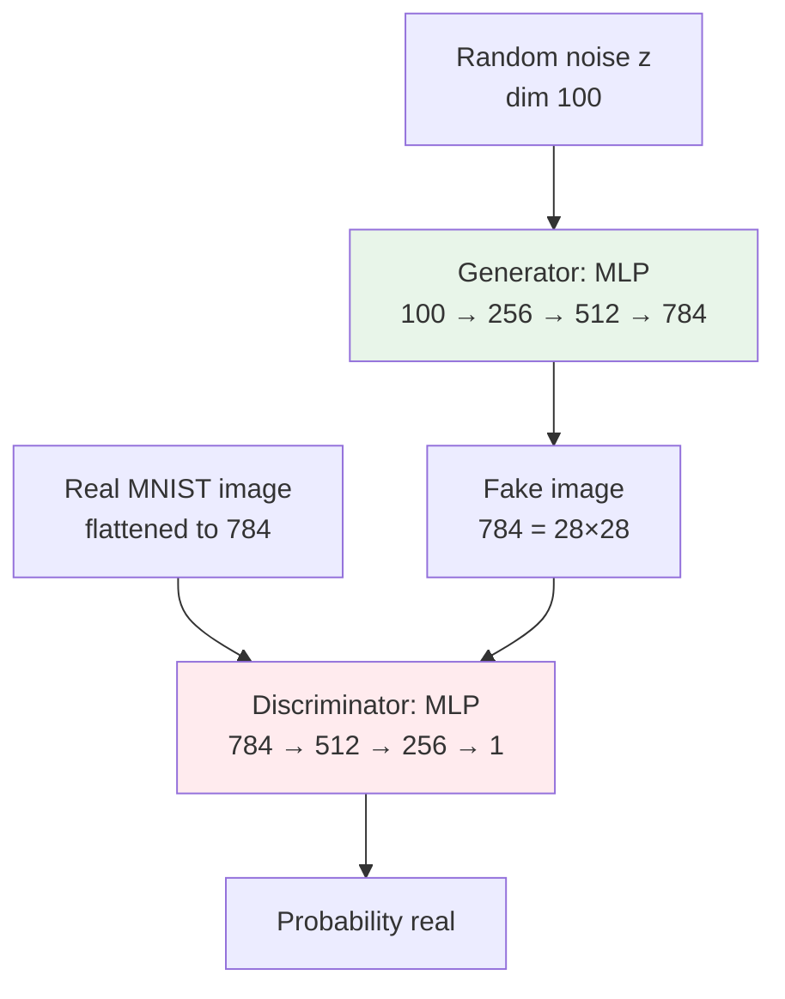

# Generative Models — Hello World

**SimpleGAN on MNIST. Generate handwritten digits in ~60 lines of PyTorch. See the adversarial training loop run before any theory.**

---

## What You Will Build

A SimpleGAN (vanilla MLP-based GAN) that learns to generate MNIST digits.

**At epoch 0:** the generator outputs pure noise.
**At epoch 50:** the generator produces fuzzy digit-shaped blobs.
**At epoch 200:** recognizable handwritten digits.

This is the simplest possible GAN — two MLPs, BCE loss, one Adam optimizer per network. After this, [Chapter 04](04_How_It_Works.md) explains *why* it works (and how to fix it when it does not).

---

## The Architecture



Both networks are MLPs (not CNNs). MNIST is small enough that an MLP-based GAN works. For real images you need DCGAN ([Chapter 05](05_Building_It.md)).

---

## The Code

```python
import torch
import torch.nn as nn
from torch.utils.data import DataLoader
from torchvision import datasets, transforms

# === DATA ===
transform = transforms.Compose([
    transforms.ToTensor(),
    transforms.Normalize((0.5,), (0.5,))   # Scale to [-1, 1] to match generator's tanh
])
dataset = datasets.MNIST('./data', train=True, download=True, transform=transform)
loader  = DataLoader(dataset, batch_size=128, shuffle=True)

# === GENERATOR ===
class Generator(nn.Module):
    def __init__(self, z_dim=100):
        super().__init__()
        self.net = nn.Sequential(
            nn.Linear(z_dim, 256), nn.LeakyReLU(0.2),
            nn.Linear(256, 512),    nn.LeakyReLU(0.2),
            nn.Linear(512, 784),    nn.Tanh()        # Tanh outputs in [-1, 1] — match data range
        )
    def forward(self, z):
        return self.net(z)

# === DISCRIMINATOR ===
class Discriminator(nn.Module):
    def __init__(self):
        super().__init__()
        self.net = nn.Sequential(
            nn.Linear(784, 512), nn.LeakyReLU(0.2), nn.Dropout(0.3),
            nn.Linear(512, 256), nn.LeakyReLU(0.2), nn.Dropout(0.3),
            nn.Linear(256, 1),   nn.Sigmoid()        # Probability ∈ [0, 1]
        )
    def forward(self, x):
        return self.net(x)

# === SETUP ===
device = torch.device('cuda' if torch.cuda.is_available() else 'cpu')
G = Generator().to(device)
D = Discriminator().to(device)

# Two optimizers — one for each network
opt_G = torch.optim.Adam(G.parameters(), lr=2e-4, betas=(0.5, 0.999))
opt_D = torch.optim.Adam(D.parameters(), lr=2e-4, betas=(0.5, 0.999))

# Single loss function used for both
loss_fn = nn.BCELoss()

# === TRAINING LOOP ===
EPOCHS = 50
Z_DIM = 100

for epoch in range(EPOCHS):
    for real_batch, _ in loader:                      # Labels ignored — GAN is unsupervised
        batch_size = real_batch.size(0)
        real = real_batch.view(-1, 784).to(device)

        # Labels for BCE
        real_labels = torch.ones(batch_size, 1, device=device)
        fake_labels = torch.zeros(batch_size, 1, device=device)

        # ─── 1. Train Discriminator ───
        D.zero_grad()

        # Real images → should output 1
        d_real = D(real)
        loss_D_real = loss_fn(d_real, real_labels)

        # Fake images → should output 0
        z = torch.randn(batch_size, Z_DIM, device=device)
        fake = G(z)
        d_fake = D(fake.detach())                    # detach so G's gradients are NOT computed
        loss_D_fake = loss_fn(d_fake, fake_labels)

        # Combined discriminator loss
        loss_D = loss_D_real + loss_D_fake
        loss_D.backward()
        opt_D.step()

        # ─── 2. Train Generator ───
        G.zero_grad()

        # Run fakes through D, but pretend the label is 1 (real)
        # G wants D to be fooled
        d_fake_for_G = D(fake)                       # NOT detached — G needs gradients
        loss_G = loss_fn(d_fake_for_G, real_labels)
        loss_G.backward()
        opt_G.step()

    print(f"Epoch {epoch+1}: D loss={loss_D.item():.4f}, G loss={loss_G.item():.4f}")
```

That is the entire SimpleGAN. **~60 lines.** Two networks, two optimizers, alternating updates.

---

## What You Should See

Loss values in a healthy GAN are **not** monotonically decreasing — they oscillate around an equilibrium. This is normal and is the hardest thing to internalize.

```
Epoch 1:  D loss=1.0234, G loss=0.6512
Epoch 5:  D loss=0.9123, G loss=0.7341
Epoch 10: D loss=0.8201, G loss=0.8456
Epoch 30: D loss=0.7012, G loss=0.9871
Epoch 50: D loss=0.6800, G loss=1.0234
```

Loss values around 0.5-1.5 for both = healthy.
D loss approaching 0 = D is winning, G is stuck.
G loss approaching 0 = G is winning, D is broken.

For a healthy GAN, the generator output evolves like:

| Epoch | What the Generated Images Look Like |
|---|---|
| 0 | Pure noise (uniform random pixels) |
| 5 | Vague structure, blob-like |
| 20 | Digit-shaped, but blurry, sometimes garbled |
| 50 | Recognizable digits, occasional errors |
| 200+ | Indistinguishable from real MNIST (with luck and right hyperparameters) |

---

## Generate Samples

After training, sample from the latent space:

```python
G.eval()
with torch.no_grad():
    z = torch.randn(16, Z_DIM, device=device)        # 16 different noise vectors
    fakes = G(z).view(-1, 28, 28).cpu().numpy()
    # Plot the 16 fakes in a 4x4 grid (matplotlib)
```

Each different `z` produces a different generated digit. Walk linearly between two `z` values and watch one digit smoothly morph into another — **latent interpolation**.

---

## What Just Happened — The Five Steps Per Network

The training loop is the standard 5 steps from [Deep Learning → 02 Concepts → Training Loop](../deep-learning/02_Concepts.md#the-training-loop--five-steps-you-will-use-for-everything), applied **twice per batch** — once for D, once for G:

| Network | Forward | Loss | Zero grads | Backward | Update |
|---|---|---|---|---|---|
| **Discriminator** | `d_real = D(real); d_fake = D(G(z).detach())` | `BCE(d_real, 1) + BCE(d_fake, 0)` | `D.zero_grad()` | `loss_D.backward()` | `opt_D.step()` |
| **Generator** | `d_fake = D(G(z))` (no detach!) | `BCE(d_fake, 1)` (we LIE about the label) | `G.zero_grad()` | `loss_G.backward()` | `opt_G.step()` |

Two things to highlight:

### `.detach()` — A Critical Detail

When training D on fake images, you call `fake.detach()`. This **prevents gradients from flowing into G** during D's update. Without detach, you would update both networks at once, and the math gets confused.

When training G, you do NOT detach. You explicitly want gradients to flow back into G through D.

**The most common SimpleGAN bug**: forgetting `.detach()` when training D, or accidentally using it when training G.

### The Flipped Label

When training G, you tell BCE that the label for fakes is `1.0` — even though they are fake. This is the entire trick. You are computing "how wrong is D about thinking this is fake?" and using *that* gradient to push G toward making D think fakes are real.

---

## Common Bugs

### 1. Both Losses Go to 0

If D loss → 0, D is too strong; G's gradient signal is uninformative; G stops learning. **Fix:** train G more often per batch, or use a smaller D (fewer parameters).

If G loss → 0, G fooled D too easily; D is too weak. **Fix:** train D more, or make D larger.

For balance, use the same learning rate (2e-4) and Adam betas (0.5, 0.999) the original DCGAN paper recommends. These were chosen empirically to stabilize training.

### 2. Generator Output Stays Random Forever

Symptoms: epoch 100, generated images still look like noise.

Common causes:
- **Missing `.detach()`** when training D — D and G are getting tangled gradients
- **Learning rate too high** — both networks oscillate but neither learns
- **Mismatched data range** — generator output is `tanh` (range [-1, 1]) but real data is in [0, 1]. Fix: `transforms.Normalize((0.5,), (0.5,))` to scale data to [-1, 1].
- **Generator activation** — using ReLU on the output instead of Tanh limits the output range

### 3. Mode Collapse

Symptoms: G produces only one or two distinct images regardless of input noise.

Fixes (in order of effort):
- **Add minibatch discrimination** — let D see batches of fakes, not just individual ones (covered in [04 — How It Works](04_How_It_Works.md))
- **Use Wasserstein loss (WGAN-GP)** — replaces BCE with a smoother objective
- **Diversity loss** — explicitly penalize the generator for producing similar outputs from different `z`

---

## Hands-On — Run It Yourself

The full notebook with all the bells and whistles (loss plots, generated image grids over epochs, latent interpolation, mode collapse demonstrations):

**[Deep Learning Autoencoders & GANs on Colab](https://colab.research.google.com/github/sunilmogadati/systems-in-production/blob/main/implementation/notebooks/Deep_Learning_Autoencoders_GANs.ipynb)**

The notebook covers:
- A vanilla autoencoder on MNIST (foundation for VAE)
- This SimpleGAN
- DCGAN (CNN-based, much better quality)

For the **conceptual foundations** — what GAN gradients look like, why two networks:

[Generative → 02 Concepts](02_Concepts.md)

---

## What's Next

You have a working GAN. Now the harder questions:

- **Why does training oscillate?** Is that healthy or broken? — [04 — How It Works](04_How_It_Works.md)
- **What if the generator collapses?** What if loss explodes? — [04 — How It Works](04_How_It_Works.md)
- **Should I use GAN, VAE, or Diffusion for my actual task?** — [05 — Building It](05_Building_It.md) and [10 — Decision Guide](10_Decision_Guide.md)
- **How do I serve this model in production?** — [07 — System Design](07_System_Design.md)

---

**Next:** [04 — How It Works](04_How_It_Works.md) — Training instability, mode collapse, vanishing gradients, evaluation metrics. The diagnostic skills generative training requires.
