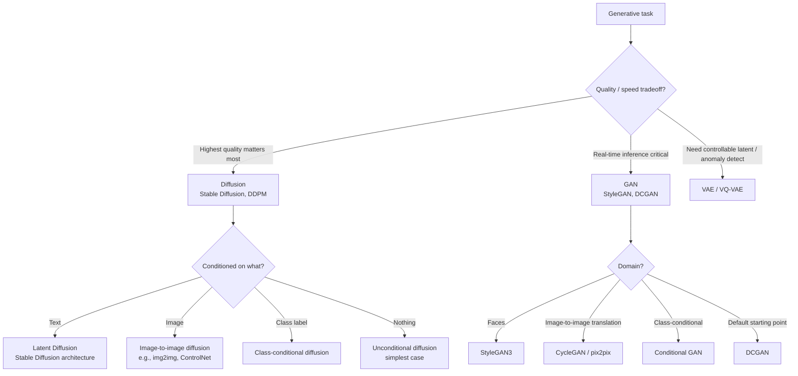

# Generative Models — Building It

**GAN vs VAE vs Diffusion — when to use which. Architecture choices. Training recipes for each family. Style transfer as a special case.**

---

## The Core Decision: Which Family?

Before architecture, before code, decide which generative family fits the problem.



### When Each Family Wins

| Task | Best Family | Why |
|---|---|---|
| Photorealistic faces | **GAN** (StyleGAN3) | Sharpest faces; one-pass inference |
| Text-to-image (creative) | **Latent Diffusion** | Controllability + quality |
| Text-to-video | **Diffusion** | Sora and similar |
| Anomaly detection | **VAE** | Reconstruction error is the anomaly score |
| Image compression | **VAE** or **VQ-VAE** | Designed for it |
| Style transfer (artistic) | **Neural style transfer** (CNN-based) or **Diffusion** | Both work; diffusion is more general |
| Style transfer (unpaired) | **CycleGAN** | Designed for unpaired domain translation |
| Synthetic data when real data is scarce | **Diffusion** or **conditional GAN** | Quality matters; speed less so |
| Real-time avatar generation | **GAN** (StyleGAN3) | <100ms per frame |

---

## GAN — Training Recipe

### The DCGAN Baseline

For most image GAN tasks, DCGAN is the right starting point. The original paper's design rules are still used in 2026:

| Layer | Generator | Discriminator |
|---|---|---|
| Input | Noise z (100-dim) → Reshape to 4×4×512 | 64×64×3 image |
| Body | 4× Transposed Conv stride 2 (8×8 → 16×16 → 32×32 → 64×64) | 4× Conv stride 2 (32×32 → 16×16 → 8×8 → 4×4) |
| Activation | ReLU (every layer except last) | LeakyReLU (slope 0.2, every layer) |
| Normalization | BatchNorm (every layer except last) | BatchNorm (every layer except first) |
| Final activation | Tanh | Sigmoid |
| No fully-connected layers | ✓ | ✓ |
| No pooling layers | ✓ — use strided conv to downsample | ✓ |

### Training Hyperparameters

```python
# Optimizer (DCGAN paper recommendations)
opt_G = torch.optim.Adam(G.parameters(), lr=2e-4, betas=(0.5, 0.999))
opt_D = torch.optim.Adam(D.parameters(), lr=2e-4, betas=(0.5, 0.999))

# Loss
loss_fn = nn.BCELoss()      # Or BCEWithLogitsLoss + remove sigmoid for stability

# Batch size
batch_size = 128            # GAN benefits from larger batches; 128 is the floor

# Training schedule
epochs = 200                # GAN training is slow; budget 200+ epochs

# Data normalization
transforms.Normalize((0.5,)*3, (0.5,)*3)   # to [-1, 1] to match generator's tanh
```

### Stabilization Tricks (Use Them)

In approximate order of effectiveness:

1. **Spectral normalization on D** — constrains D's Lipschitz constant. Single best stabilizer.
2. **Label smoothing** — set "real" target to 0.9 instead of 1.0. Prevents D from being overconfident.
3. **Wasserstein loss with gradient penalty (WGAN-GP)** — entirely different loss; much smoother training.
4. **Mini-batch standard deviation** — concatenate batch-wise std as a feature in D. Helps D detect mode collapse.
5. **TTUR (Two Time-Scale Update Rule)** — different learning rates for G and D (e.g., G: 1e-4, D: 4e-4).

### When to Move to StyleGAN

DCGAN scales to 64×64. Above that, quality degrades. For 256×256+ photorealistic outputs, use StyleGAN architecture:

- Style-based generator (latent z is mapped to "style codes" injected at each layer)
- Progressive growing (start at 4×4, double resolution every N epochs)
- Adaptive Instance Normalization (AdaIN) layers
- Mixing regularization

The official NVIDIA implementation (StyleGAN3) is the production standard.

---

## VAE — Training Recipe

### Architecture

A VAE is two networks plus a sampling step:

```python
class VAE(nn.Module):
    def __init__(self, latent_dim=32):
        super().__init__()
        # Encoder: input → (mu, log_var)
        self.encoder = nn.Sequential(
            nn.Conv2d(1, 32, 3, stride=2, padding=1),    # 28x28 → 14x14
            nn.ReLU(),
            nn.Conv2d(32, 64, 3, stride=2, padding=1),   # 14x14 → 7x7
            nn.ReLU(),
            nn.Flatten(),
        )
        self.fc_mu     = nn.Linear(64*7*7, latent_dim)
        self.fc_logvar = nn.Linear(64*7*7, latent_dim)

        # Decoder: latent → output
        self.fc_dec = nn.Linear(latent_dim, 64*7*7)
        self.decoder = nn.Sequential(
            nn.ConvTranspose2d(64, 32, 3, stride=2, padding=1, output_padding=1),  # 7x7 → 14x14
            nn.ReLU(),
            nn.ConvTranspose2d(32, 1, 3, stride=2, padding=1, output_padding=1),   # 14x14 → 28x28
            nn.Sigmoid(),
        )

    def encode(self, x):
        h = self.encoder(x)
        return self.fc_mu(h), self.fc_logvar(h)

    def reparameterize(self, mu, logvar):
        std = torch.exp(0.5 * logvar)
        eps = torch.randn_like(std)
        return mu + eps * std            # The reparameterization trick

    def decode(self, z):
        h = self.fc_dec(z).view(-1, 64, 7, 7)
        return self.decoder(h)

    def forward(self, x):
        mu, logvar = self.encode(x)
        z = self.reparameterize(mu, logvar)
        return self.decode(z), mu, logvar
```

### The Loss

```python
def vae_loss(recon, x, mu, logvar, beta=1.0):
    # Reconstruction loss
    recon_loss = F.binary_cross_entropy(recon, x, reduction='sum')

    # KL divergence to N(0, 1)
    kl_loss = -0.5 * torch.sum(1 + logvar - mu.pow(2) - logvar.exp())

    return recon_loss + beta * kl_loss
```

### β Tuning — KL Annealing

A common trick: start with `β = 0` (pure autoencoder), gradually increase to `β = 1` over the first few epochs. This avoids posterior collapse (encoder learns to ignore the input).

```python
beta = min(1.0, epoch / warmup_epochs)
```

For controllable latent spaces (β-VAE), use `β > 1` (e.g., 4-10). This forces stronger disentanglement at the cost of reconstruction quality. Useful for downstream control.

---

## Diffusion — Training Recipe

### The Network

For pixel-space diffusion, use a U-Net. For latent diffusion (Stable Diffusion architecture), use a U-Net operating in VAE latent space.

```python
class SimpleDiffusionUNet(nn.Module):
    def __init__(self):
        super().__init__()
        # Time embedding — diffusion U-Net is conditioned on the timestep
        self.time_embed = nn.Sequential(
            nn.Linear(64, 128),
            nn.SiLU(),
            nn.Linear(128, 128),
        )

        # Encoder (downsample)
        self.enc1 = nn.Conv2d(1, 32, 3, padding=1)
        self.enc2 = nn.Conv2d(32, 64, 3, stride=2, padding=1)

        # Bottleneck
        self.mid = nn.Conv2d(64, 128, 3, padding=1)

        # Decoder (upsample) — with skip connections
        self.dec1 = nn.ConvTranspose2d(128, 64, 3, stride=2, padding=1, output_padding=1)
        self.dec2 = nn.Conv2d(64*2, 32, 3, padding=1)   # *2 for skip connection
        self.out  = nn.Conv2d(32*2, 1, 3, padding=1)    # *2 for skip connection

    def forward(self, x, t):
        t_embed = self.time_embed(sinusoidal_embedding(t))
        # Encoder
        e1 = F.relu(self.enc1(x))
        e2 = F.relu(self.enc2(e1))
        # Bottleneck (t conditioning injected here)
        m = F.relu(self.mid(e2)) + t_embed[..., None, None]
        # Decoder with skip connections
        d1 = F.relu(self.dec1(m))
        d2 = F.relu(self.dec2(torch.cat([d1, e2], dim=1)))
        return self.out(torch.cat([d2, e1], dim=1))
```

### The Forward Process (Fixed)

```python
def q_sample(x_0, t, noise=None):
    """Add noise according to the schedule. No learning required."""
    if noise is None:
        noise = torch.randn_like(x_0)
    sqrt_alpha_t  = torch.sqrt(alphas_cumprod[t])
    sqrt_1m_alpha = torch.sqrt(1 - alphas_cumprod[t])
    return sqrt_alpha_t * x_0 + sqrt_1m_alpha * noise
```

`alphas_cumprod` is a precomputed schedule, typically linear or cosine over T = 1000 timesteps.

### Training Loop

```python
for epoch in range(EPOCHS):
    for x_0, _ in loader:
        x_0 = x_0.to(device)

        # Sample a random timestep for each example in the batch
        t = torch.randint(0, T, (x_0.size(0),), device=device)

        # Add noise to get x_t
        noise = torch.randn_like(x_0)
        x_t = q_sample(x_0, t, noise)

        # Predict the noise
        noise_pred = model(x_t, t)

        # MSE loss between predicted and actual noise
        loss = F.mse_loss(noise_pred, noise)

        optimizer.zero_grad()
        loss.backward()
        optimizer.step()
```

That is the entire diffusion training. **No discriminator. No KL term. Just MSE on predicted noise.** The simplicity is why diffusion is so much more stable to train than GAN.

### Sampling

```python
@torch.no_grad()
def sample(n_samples):
    x = torch.randn(n_samples, 1, 28, 28, device=device)   # Start with pure noise
    for t in reversed(range(T)):
        t_batch = torch.full((n_samples,), t, device=device)
        noise_pred = model(x, t_batch)
        x = denoise_step(x, noise_pred, t)        # Standard DDPM update
    return x
```

For DDIM (faster sampling), replace the loop with 50-100 steps using the deterministic DDIM update. For distillation, train a student model to do this in 1-4 steps.

---

## Style Transfer — A Special Case

Style transfer is its own technique. The idea: take a content image and a style image; produce an output that has the content of the first and the style of the second.

### Classical Neural Style Transfer (Gatys 2015)

No GAN, no VAE, no diffusion. Just a pretrained CNN (typically VGG19) used as a feature extractor.

```python
# Pseudocode of the approach
output = init_from_content_image (or random noise)

for step in range(1000):
    # Pass output, content, style through VGG19
    content_features = vgg(content)
    style_features   = vgg(style)
    output_features  = vgg(output)

    # Content loss: output should have similar deep features to content
    content_loss = MSE(output_features[high_layer], content_features[high_layer])

    # Style loss: output should have similar Gram matrices (style statistics) to style
    style_loss = MSE(gram(output_features[low_layers]), gram(style_features[low_layers]))

    total_loss = α * content_loss + β * style_loss

    # Backprop INTO THE OUTPUT IMAGE (not the network) — the image is what's being optimized
    total_loss.backward()
    output -= lr * output.grad
```

**Key idea.** The CNN's intermediate feature maps capture two things: *what* an image contains (deep layers) and *how* it looks (low-layer Gram matrices = texture statistics). Optimize a new image to match both, using a fixed pretrained network.

| Pros | Cons |
|---|---|
| Works without GAN/VAE training | Slow — 1000 optimization steps per output image |
| Simple to implement | One image at a time |
| Beautiful artistic results | Not real-time |

### Fast Style Transfer

Train a feedforward network to do style transfer in one pass. **One model per style.** Run-time is one forward pass (~30ms on a GPU).

| Approach | Training Time | Inference Time | Flexibility |
|---|---|---|---|
| Gatys (classical) | None | Slow (1000 steps) | Any style at runtime |
| Fast (per-style) | Hours | Fast (1 pass) | Single style baked in |
| Universal style | Days | Fast | Any style at runtime |

### Modern Alternative — Diffusion-Based Style Transfer

In 2026, large pretrained diffusion models (Stable Diffusion + ControlNet + IP-Adapter) handle style transfer better than dedicated style transfer networks. Prompt: "[content description] in the style of Van Gogh." For most production use cases, this is the simplest path.

For the deep dive on style transfer architectures, see `architectures/style-transfer.md` (coming).

---

## Cost-of-Training Reality

A practical note. The compute cost of training each family from scratch:

| Model | Parameters | Compute (single GPU) | Compute (cluster) |
|---|---|---|---|
| SimpleGAN MNIST | <1M | 30 min | — |
| DCGAN 64×64 | 5-10M | 2-4 hours | — |
| StyleGAN3 1024×1024 | 30M+ | weeks on 8 V100s | days on cluster |
| VAE MNIST | <1M | 15 min | — |
| VQ-VAE ImageNet | 50M | days | hours on 8 GPU |
| DDPM CIFAR-10 | 35M | 1-2 days on 1 V100 | hours on cluster |
| Stable Diffusion v1.5 | 860M | months on 256 A100s (~$600k) | — |

**The lesson.** Almost no production team trains diffusion or large GAN from scratch. You **fine-tune** a pretrained model on your task. Hugging Face's `diffusers` library makes this one Python script away.

---

## The Production-Ready Recipe (2026)

For most projects, the practical workflow is:

1. **Start with a pretrained model.** Stable Diffusion XL for images. Pre-trained StyleGAN if you need GAN. VAE-encoder of Stable Diffusion if you need a strong image latent.
2. **Fine-tune (LoRA or DreamBooth).** A few hundred labeled images, a few hours on one GPU. Cost: $5-50.
3. **Add controlnets / adapters.** ControlNet for spatial conditioning (poses, depth, edges). IP-Adapter for image conditioning.
4. **Build the safety/filter pipeline** (covered in [08 — QSG](08_Quality_Security_Governance.md)).
5. **Deploy with a serving framework** ([07 — System Design](07_System_Design.md)).

Building from scratch is for research labs. Building from pretrained foundations is what production teams do.

---

**Next:** [06 — Production Patterns](06_Production_Patterns.md) — Stable Diffusion, Midjourney, Sora, StyleGAN. Real systems, real architectures, real costs.
