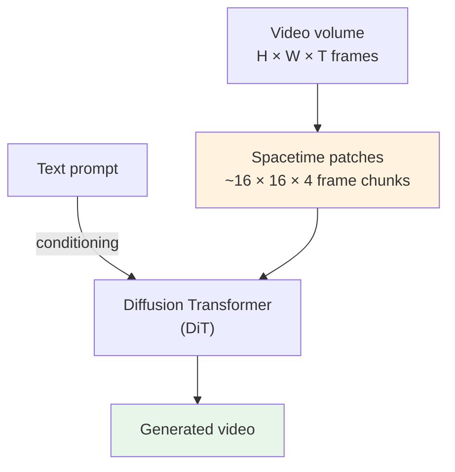
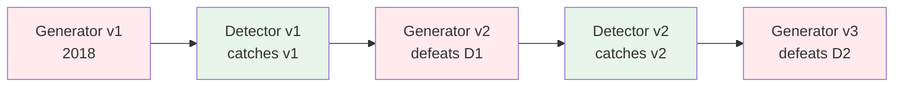

# Generative Models — Production Patterns

**Stable Diffusion, Midjourney, Sora, StyleGAN, Synthesia, deepfake detection. Real systems, real architectures, real production tradeoffs.**

---

## How to Read This Chapter

Each pattern is a real production system, with publicly available technical details. The point is not to copy any single one — it is to see the **shape** of generative AI in production: where the model fits in the larger system, what changes when you go from research to deployed, what tradeoffs every team faces.

---

## Pattern 1: Stable Diffusion — Open Diffusion at Scale

**The problem.** Generate high-quality images from text prompts. Run on consumer hardware. Be open and modifiable.

**The architecture.** Latent diffusion — a VAE compresses images, diffusion runs in the compressed latent space, the VAE decodes the result.

```mermaid
graph TD
    Prompt["User prompt:<br/>'a cat astronaut on the moon'"]
    TextEnc[CLIP text encoder]
    Embed[Text embeddings<br/>(77 × 768)]

    Noise[Random noise<br/>64×64×4 latent]

    UNet[Diffusion U-Net<br/>~860M parameters]

    Latent[Denoised latent<br/>64×64×4]

    VAE[VAE Decoder]
    Image[Generated image<br/>512×512×3]

    Prompt --> TextEnc --> Embed
    Embed -.->|cross-attention conditioning| UNet
    Noise --> UNet
    UNet --> UNet
    UNet --> Latent --> VAE --> Image

    style Prompt fill:#E1F5FE
    style Image fill:#E8F5E9
```

**Why latent space.** Pixel-space diffusion at 512×512 needs 786,432-dim updates per step. Latent space is 4×64×64 = 16,384 dimensions — **48x smaller**. This is what makes Stable Diffusion run on consumer GPUs while DDPM requires data centers.

**The pieces:**

| Component | Size | Role |
|---|---|---|
| **CLIP text encoder** | ~340M params | Maps prompt to embeddings |
| **VAE encoder/decoder** | ~80M | Compress/decompress images |
| **U-Net (the diffusion network)** | ~860M | Iteratively denoise the latent |
| **Scheduler** | none (math only) | DDIM, Euler, etc. — picks the timestep schedule |

**Inference cost (Stable Diffusion XL, 50 steps, 1024×1024):**

- Consumer GPU (RTX 4090): ~5 seconds per image
- T4 cloud GPU: ~15 seconds
- A100: ~3 seconds
- Distilled (SDXL Turbo, 1-4 steps): ~0.5 seconds — at the cost of slightly lower quality

**Lesson.** **Generative models are pipelines, not single networks.** Stable Diffusion is text encoder + diffusion U-Net + VAE + scheduler — all of which are independently optimized, can be swapped, and have their own failure modes. A "Stable Diffusion deployment" is really four-component management.

**Sources.** Stable Diffusion / latent diffusion paper — Rombach, Blattmann, Lorenz, Esser, Ommer, *High-Resolution Image Synthesis with Latent Diffusion Models*, CVPR 2022 ([arXiv:2112.10752](https://arxiv.org/abs/2112.10752)). Stability AI release notes. Hugging Face `diffusers` library documentation.

---

## Pattern 2: Midjourney — Closed Diffusion at Maximum Quality

**The problem.** Generate the highest-possible-quality images. Differentiate via aesthetic quality and ease of iteration.

**The architecture (publicly inferred).** Custom diffusion model, internally trained, not based on Stable Diffusion. Heavy emphasis on:

- Massive curated training data (tens of millions of high-quality, aesthetically-filtered images)
- Multiple model versions concurrent (v5, v6, v7) — users pick or A/B test
- Fast iteration UI — type prompt, get 4 variations, click "remix" or "upscale" or "vary"

**Key production patterns Midjourney pioneered:**

1. **Discord-first UI** — bots, threads, community visibility. Lowered the friction to try generative AI.
2. **Aesthetic-tuned training data.** Midjourney's data is curated for visual quality, not just diversity. The model "knows" what looks good.
3. **Built-in iteration** — every generation has variations, upscale, remix as one click. The interaction shapes the model's competitive moat.
4. **Versioned models in production** — v5 still available when v7 ships. Users do not lose access to a version they trained their prompts for.

**Production constraints:**

- Inference costs at scale: hundreds of GPUs running constantly
- Pricing: $10-60/month subscriptions; high inference cost is hidden behind the subscription model
- Content moderation: extensive — both prompt filtering (no celebrity names, no NSFW prompts) and post-generation filtering

**Lesson.** **The model is the moat — but only if everything around it is built.** Midjourney's quality lead comes from data curation, prompt understanding, and iteration UX. Their model size is in the same ballpark as Stable Diffusion. The difference is the system around the model.

---

## Pattern 3: OpenAI Sora — Text-to-Video Diffusion

**The problem.** Generate coherent video from text prompts — multiple seconds of consistent motion, lighting, identity.

**The architecture.** A diffusion transformer (DiT) operating on **spacetime patches** instead of individual frames or pixels.

**Key innovation.** Treat video as a 3D volume (height × width × time). Split into "spacetime patches" — small 3D cubes of pixels. Process the sequence of patches with a transformer (similar to how ViT processes spatial patches in an image, but extended to time).



**Production realities (publicly known):**

- Generation cost: minutes per video (tens of dollars per minute of generated content at API rates)
- Massive compute requirement: hundreds of A100/H100 GPUs running for inference
- Quality degrades for long videos (>60 seconds) due to memory constraints
- **Limited rollout** — not generally available because cost-per-video is too high for unmetered consumer use

**Open challenges (as of 2026):**

- Long-form coherence (1-minute+ video maintaining identity)
- Audio synchronization (Sora generates silent video; audio added separately)
- Physics consistency (objects passing through each other, fluid behaving wrong)

**Lesson.** **Video generation is not just image generation extended to time.** The architecture, training data (video clips with text descriptions), and inference cost are all fundamentally different from image generation. Most teams that "generate video" today actually generate frames and stitch — true generative video at quality is still the domain of the largest labs.

**Sources.** OpenAI Sora technical report (2024). DiT paper — Peebles & Xie, *Scalable Diffusion Models with Transformers*, ICCV 2023 (arXiv preprint December 2022).

---

## Pattern 4: NVIDIA StyleGAN3 — Photorealistic Faces

**The problem.** Generate photorealistic faces (and other categories — landscapes, anime, etc.) at very high resolution (1024×1024+). One forward pass per sample. Smooth latent interpolation.

**The architecture.** Style-based generator — latent z is mapped to "style codes" injected at every layer, controlling features at different scales (coarse poses to fine details).

**Why GAN over diffusion for this:**

- One forward pass = ~20ms per face on modern GPUs (vs seconds for diffusion)
- The latent space is highly structured — meaningful directions for age, gender, smile, pose, lighting
- For face-specific applications, StyleGAN is still SOTA on FID

**Real deployments:**

- **Synthesia** — AI avatars for corporate video. StyleGAN-style architecture. Used by ~80% of Fortune 100 companies for L&D content.
- **D-ID** — talking avatars from a single photo
- **Lensa AI** — magic avatar generations (uses Stable Diffusion now, but earlier generations used StyleGAN)
- **Game industry** — synthetic NPC faces, character variations

**Production considerations:**

- **Identity persistence** — the same `z` always produces the same face. Useful for avatars but problematic for privacy.
- **Bias from training data** — StyleGAN trained on FFHQ (mostly white, mostly young) — generated faces reflect that bias. Mitigations require diverse training data or post-generation filtering.
- **Detection arms race** — every StyleGAN face has detectable artifacts. Detector models train against new generators continuously.

**Lesson.** **GAN is not dead.** For specific domains (faces, fast inference, structured latent space), GAN beats diffusion. The right tool depends on the task, not the trend.

---

## Pattern 5: Synthetic Data Generation — Industrial Use

**The problem.** Train a defect-detection model when real defective parts are rare (1 in 10,000) and labeling is expensive.

**The pattern.** Generate synthetic defective parts using a generative model. Mix synthetic + real data for training. Validate the trained classifier on **only real data** (synthetic data must not leak into the test set).

**Architecture choices:**

| Domain | Generator |
|---|---|
| Manufacturing defects (visual) | Conditional GAN or diffusion fine-tuned on rare defect types |
| Medical imaging | Diffusion fine-tuned on the modality (X-ray, MRI, CT) |
| Autonomous driving (rare scenes) | NVIDIA DRIVE Sim, or domain-specific GANs |
| Satellite imagery | Domain-specific GAN (e.g., SAR-GAN, hyperspectral GAN) |

**Real deployments:**

- **NVIDIA Omniverse Replicator** — synthetic 3D scenes for training autonomous driving and robotics
- **Datagen** — synthetic faces for training (used by KYC systems, security)
- **Anyverse, Parallel Domain** — synthetic driving scenes
- **Mostly AI, Tonic.ai** — synthetic tabular data (privacy-preserving for ML training)

**Production reality:**

- Synthetic data **augments**, never replaces, real data. A model trained 100% on synthetic fails on real distributions.
- The right ratio is task-specific — typically 10-30% synthetic, 70-90% real.
- Synthetic generation is itself a model that needs maintenance, validation, and bias auditing.

**Lesson.** **Synthetic data is a tool, not a panacea.** It solves the rare-class problem cleanly. It does not solve general data scarcity. The production pattern is "real data + synthetic data + careful evaluation on real-only test sets."

---

## Pattern 6: Deepfake Detection — The Adversarial Reverse

**The problem.** Detect AI-generated content for trust & safety. Used by Twitter/X, Meta, YouTube, news organizations, financial institutions.

**The pattern.** Train a classifier on real images vs known-generated images. The detector is itself a CNN — typically a fine-tuned EfficientNet or ResNet. Deploy in moderation pipelines.

**The arms race:**



**Production realities (2026):**

- Detection accuracy on known generators: 90-99%
- Detection accuracy on unseen / latest generators: 50-70% (often worse than chance for the newest)
- **Detectors need continuous retraining** — Stable Diffusion 3 produces images that v2 detectors do not catch
- C2PA (Content Authenticity Initiative) — cryptographic provenance metadata embedded at generation time. The opposite approach — sign the content, do not detect after the fact.

**Real deployments:**

- **Reality Defender, Sensity AI, Truepic** — commercial detection services
- **Meta, Google, OpenAI** — internal detection in trust & safety pipelines
- **Bank fraud teams** — detection on KYC selfies (preventing GAN-generated identity documents)

**Lesson.** **Detection is fundamentally reactive.** New generators routinely defeat existing detectors within months — every new model release shifts the artifact distribution detectors were trained on. C2PA-style provenance (cryptographic signatures attached at generation time, verified later) is structurally different: it does not try to identify generated content from pixels alone, it tracks *known* generated content forward. Provenance does not solve the problem (unsigned content still exists), but it converts the unwinnable forensics arms race into a tractable supply-chain problem. Build for both.

---

## Common Threads Across All Six

| Theme | Manifestation |
|---|---|
| **The model is 20% of the system** | The other 80% is data, prompt handling, safety filters, watermarking, serving infra, cost management |
| **Pipelines, not single models** | Even "Stable Diffusion" is text encoder + U-Net + VAE + scheduler. Each is independently optimized. |
| **Pretrained + fine-tune wins** | Almost no production team trains generative models from scratch in 2026 |
| **Cost economics dominate decisions** | Diffusion vs GAN vs API choice is often "what can we afford per inference" |
| **Safety / governance is critical-path** | Watermarking, NSFW filtering, copyright filtering, prompt safety — all required for shippable products |
| **Detection is an arms race** | Whatever you generate, someone will need to detect it. Build for both sides. |

---

## What This Means for Your Project

Order of work for shipping a generative system:

1. **Pick the family** based on quality / speed / control needs ([Chapter 05](05_Building_It.md))
2. **Start with a pretrained model** — Stable Diffusion XL, StyleGAN3, GPT-style LLM
3. **Fine-tune on your domain** if needed (LoRA, DreamBooth — a few hundred examples)
4. **Build the prompt / input handler** — sanitize, expand, route to the right model
5. **Build the safety filter** — input filtering, output filtering, NSFW classifier, copyright check
6. **Build watermarking + provenance** — C2PA where possible, invisible watermark fallback
7. **Plan inference infrastructure** — see [07 — System Design](07_System_Design.md) for serving
8. **Plan monitoring** — what does "the model is degrading" look like for your domain?
9. **Plan abuse response** — when (not if) someone misuses your system, what is the kill switch?

Skip steps 5-9 and your generative product will not survive contact with the public.

---

**Next:** [07 — System Design](07_System_Design.md) — Serving generative models, batching, KV-caching, GPU economics for diffusion and LLMs.
