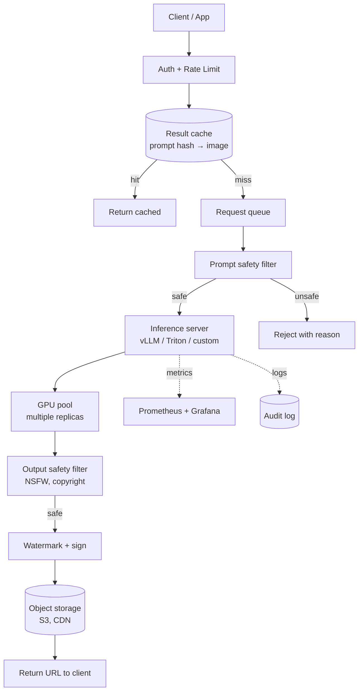
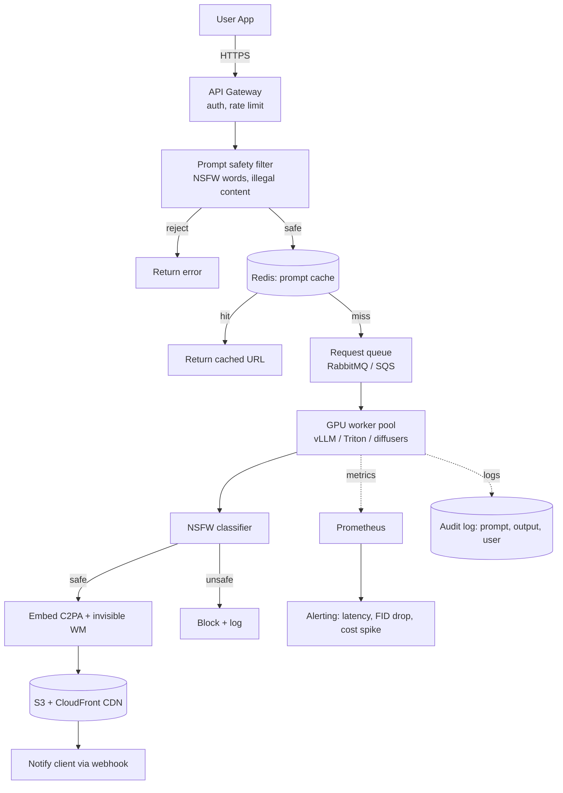

# Generative Models — System Design

**Serving generative models in production. Latency, batching, prompt handling, caching, GPU economics. The infrastructure that turns a model checkpoint into a service handling thousands of generations per second.**

---

## The Generative Serving Stack

A trained model is the start. Production generative AI needs:



Every layer has tradeoffs. Get the stack right, generate at sub-cent costs. Get it wrong, lose money on every inference.

---

## Inference Servers for Generative Models

| Server | Best For | Notes |
|---|---|---|
| **vLLM** | LLM serving (text generation) | Continuous batching, paged attention. The default for LLM inference. |
| **TensorRT-LLM** | Maximum LLM throughput on NVIDIA GPUs | Faster than vLLM but tied to NVIDIA + harder to use |
| **NVIDIA Triton** | Multi-model serving (LLM + diffusion + others) | The default for mixed workloads |
| **TGI (Text Generation Inference)** | LLM serving, simpler than vLLM | Hugging Face's solution. Easier to deploy. |
| **Custom FastAPI + diffusers** | Diffusion serving for small to medium scale | Direct control. Most teams start here. |
| **Replicate, Together AI, Fireworks** | Generation-as-a-service | Skip the infrastructure entirely. Pay per generation. |

> **Default recommendation.** For diffusion at any scale: Triton + diffusers, or custom FastAPI for prototyping. For LLM at any scale: vLLM. For mixed workloads: Triton with model ensembles.

---

## Batching — Different Rules for Generative

### Diffusion Batching

Diffusion is inherently amenable to batching — every step processes the entire batch in parallel. The constraint is **GPU memory** (each image's latent + intermediate activations × T steps).

| Batch Size | Throughput | VRAM (Stable Diffusion 1.5, 512×512) |
|---|---:|---:|
| 1 | 1 img/sec | 4 GB |
| 4 | ~4 img/sec | 8 GB |
| 8 | ~6 img/sec | 14 GB |
| 16 | ~9 img/sec | 24 GB (A100 limit) |

Diminishing returns above 8-16 because the U-Net's compute saturates. Batch 8 on a T4 is the typical sweet spot for cost-effective serving.

### LLM Batching — Continuous Batching

Static batching does not work well for LLMs because outputs have variable length — a request generating 50 tokens blocks the GPU while another finishes generating 500.

**Continuous batching** (vLLM's signature feature): when one request finishes, immediately add a new one to the batch without waiting for the longest request. Throughput increases 2-5x.

```
Static batching:
  [Req 1: 50 tok] [Req 2: 500 tok] [Req 3: 100 tok]
  Batch waits for Req 2 to finish before starting new requests

Continuous batching:
  [Req 1 finishes] → [Req 4 added immediately]
  [Req 3 finishes] → [Req 5 added immediately]
  Throughput maximized
```

Continuous batching + paged attention (vLLM's KV-cache management) → 24x throughput vs naive serving in published benchmarks.

---

## KV-Cache (LLM Specific)

LLMs generate text autoregressively — token by token. Without optimization, each new token re-runs attention over all prior tokens (quadratic cost).

**KV-cache** stores the key and value tensors of all prior tokens. Each new token only computes attention against the cached K/V, not recompute them.

| Without KV-cache | With KV-cache |
|---|---|
| Generation cost: O(N²) where N = output length | Generation cost: O(N) |
| 1024-token generation: 30 seconds | 1024-token generation: 2 seconds |
| Memory: O(1) | Memory: O(N · model_size) |

The tradeoff: KV-cache memory grows linearly with sequence length. For a 70B-parameter model at 4096 context, KV-cache can be **larger than the model weights themselves**. PagedAttention (vLLM's contribution) manages this efficiently.

---

## Prompt Caching

User prompts repeat. Same prompt should produce the same image (or text) without re-running the model.

```python
# Pseudocode
prompt_hash = hash(prompt + model_version + seed)
if cache.exists(prompt_hash):
    return cache.get(prompt_hash)
else:
    result = model.generate(prompt)
    cache.set(prompt_hash, result, ttl=24*hours)
    return result
```

| Cache Layer | Hit Rate | Latency Saved |
|---|---:|---:|
| **In-memory (per replica)** | Low | High (microseconds) |
| **Redis (cluster-wide)** | Medium-high | Low (milliseconds) |
| **CDN (URL-keyed)** | High for hot content | Saves the entire request |

**Hit rates in production:**

- **Image generation services** — 5-20% (long-tail prompt diversity)
- **LLM APIs** — 40-80% (lots of repeated boilerplate prompts)
- **Voice synthesis** — 20-40% (same phrases repeat)

Prompt caching is the single biggest cost reducer in generative serving. Every team building a service should have it from day one.

---

## GPU Economics for Generation

### Cost per Generation (2026 ballpark, cloud GPU)

For a 512×512 image, Stable Diffusion XL, 50 steps:

| GPU | Hourly Cost | Throughput (batch 8) | Cost / Image |
|---|---:|---:|---:|
| **T4** | $0.35 | 0.5 imgs/sec | $0.0002 (0.02¢) |
| **L4** | $0.60 | 1.0 imgs/sec | $0.0002 |
| **A100 40GB** | $3.00 | 3.5 imgs/sec | $0.0002 |
| **H100** | $5.00 | 7 imgs/sec | $0.0002 |

**The flat curve is striking.** Properly batched, all GPUs cost roughly $0.0002 per 512×512 image — **5,000 images per dollar**. Pricing implications:

- Internal use: $5-50/month covers thousands of generations
- B2C SaaS: charge $10-30/month for unlimited usage; margins are still healthy
- API resale: Replicate / Together AI charge ~$0.001-0.005 per image. Margin is the difference between optimized infrastructure and naive infrastructure.

### LLM Cost (2026)

| Model | Input cost / 1M tokens | Output cost / 1M tokens |
|---|---:|---:|
| GPT-4o (API) | $2.50 | $10 |
| Claude Sonnet 4.6 (API) | ~$3 | ~$15 |
| Open-source 70B (self-hosted) | ~$0.30 | ~$0.50 |
| Open-source 7B (self-hosted) | ~$0.05 | ~$0.10 |

The 100x cost difference between API and self-hosted explains why companies above $100k/month in LLM spend often migrate to self-hosted open-source (Llama, Mistral, Qwen). Below that, the engineering cost of self-hosting is more than the cost difference.

---

## Edge Generation — When You Cannot Use the Cloud

For privacy, latency, or offline use cases, generation must happen on-device.

### Image Generation on Mobile

| Model | Size on disk | Inference time on mobile |
|---|---:|---:|
| Stable Diffusion v1.5 (FP32) | ~4 GB | Way too slow |
| Stable Diffusion (INT8 + distilled) | ~1 GB | ~10 seconds per image |
| LCM-LoRA (4-step distilled SD) | ~1.5 GB | ~3 seconds |
| Apple Stable Diffusion (Core ML, ANE) | ~1 GB | ~2 seconds |

Apple's **Stable Diffusion ML package** runs on the Apple Neural Engine. M-series Macs and iPhones can do generation locally. This is what powers on-device generation in iOS 18+.

### LLM on Mobile

The 2025 breakthrough — **Liquid LFM2-2.6B** runs on a smartphone faster than typing speed and outperforms GPT-4 on instruction-following benchmarks. (Mentioned in [Deep Learning → Why](../deep-learning/01_Why.md#the-acceleration-youre-living-through).) The on-device LLM era is here.

| Approach | Where it runs | Use case |
|---|---|---|
| **GGUF quantized 4-bit** | Phone via llama.cpp | Local chatbot, no internet |
| **MLX (Apple)** | Mac's neural engine | Privacy-sensitive Mac apps |
| **TensorFlow Lite** | Android | Mobile apps |
| **WebGPU** | Browser | Demo/educational, not production |

For production mobile generation, the constraints are:

- **Storage** — model + runtime under ~1.5 GB
- **Latency** — under 5 seconds for image, under 1 second for LLM token
- **Battery / heat** — sustained inference can throttle
- **Privacy** — data never leaves device (the main reason for edge generation)

---

## A Reference Architecture for Production Generation

Putting it together — what a real Stable-Diffusion-as-a-service deployment looks like:



**Key design points:**

- **Request queue between API and workers** — handles burstiness, lets you autoscale workers separately
- **Two safety filters** — prompt-side (cheap, blocks early) AND output-side (catches what slips through)
- **Watermarking + C2PA before storage** — every output is signed; provenance is recoverable
- **Audit log** — what was generated, by whom, with what prompt — required for both abuse response and debugging
- **CDN-fronted storage** — once generated, cache forever; serve at CDN cost not GPU cost

---

## Cost Reduction Tactics

In rough order of impact:

1. **Aggressive prompt caching** — 5-50% cost reduction
2. **Batch size tuning** — 2-5x throughput at little quality cost
3. **Distillation** — replace 50-step diffusion with 4-step (LCM, SDXL Turbo) for 10x speedup at slight quality loss
4. **Quantization** — INT8/FP16 for 2-3x speedup at <1% quality loss
5. **Spot / preemptible GPU instances** — 30-60% off on-demand pricing
6. **Multi-tenancy on a single GPU** — Triton's MIG support
7. **Off-peak shifting** — schedule batch jobs at off-peak hours when GPUs are cheap

A team that does all of these well runs at 1/10th the cost of a team that does none.

---

## What's Different About Generative System Design

Compared to classical ML serving:

| Classical ML Serving | Generative Serving |
|---|---|
| Inputs are simple (feature vectors) | Inputs are prompts — need parsing, expansion, sanitization |
| Output is one number / class | Output is image / video / long text — large, needs storage |
| Compute is fast (ms) | Compute is slow (sec to min) — async, queue-based |
| Cache by input | Cache by prompt hash — hit rates 5-80% |
| No safety concerns generally | Heavy safety pipeline required |
| Output is consumed and discarded | Output may be public, requires moderation, watermarking |
| Predictions reproducible | Generations are stochastic — same input ≠ same output (without seed control) |

Plan for these differences from the start — bolting them on after launch is much harder than designing them in.

---

**Next:** [08 — Quality, Security, Governance](08_Quality_Security_Governance.md) — Deepfakes, watermarking, content provenance (C2PA), copyright, NSFW detection, prompt injection.
