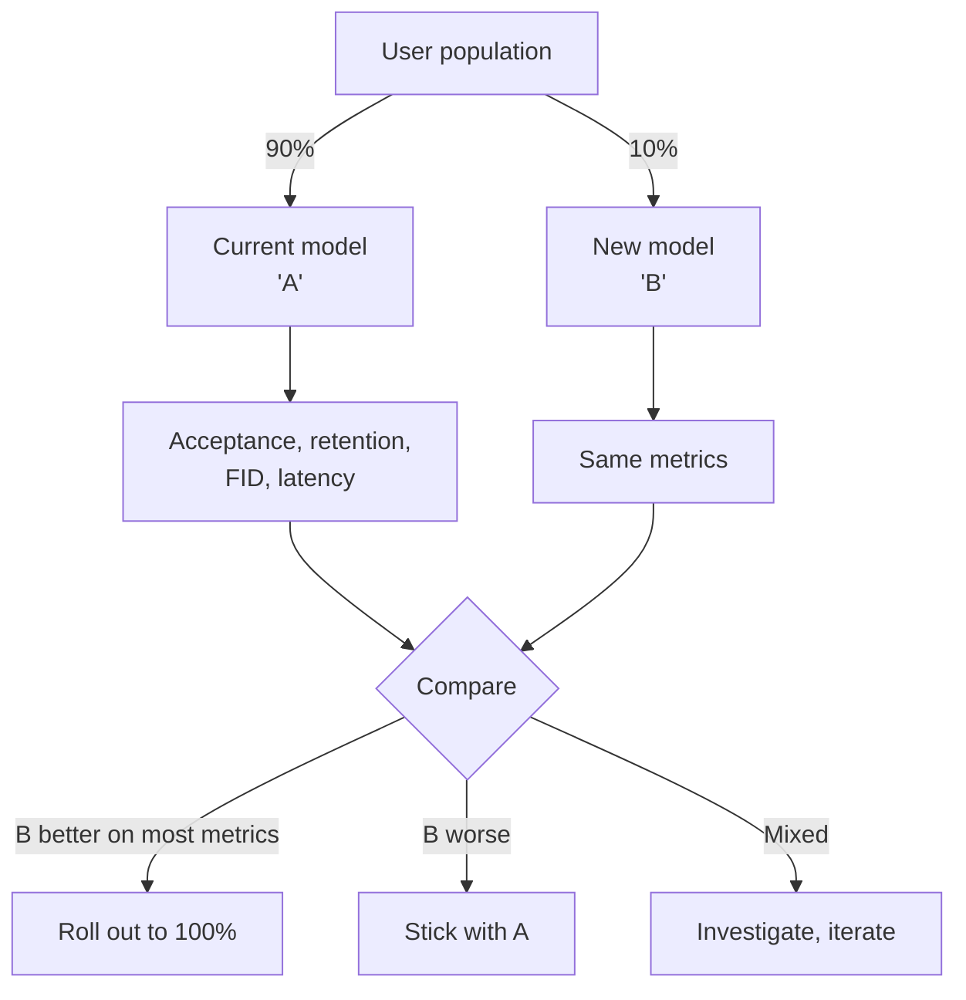
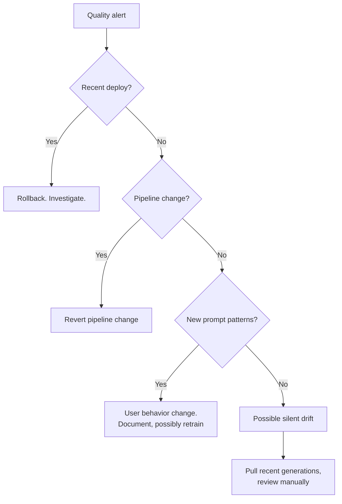
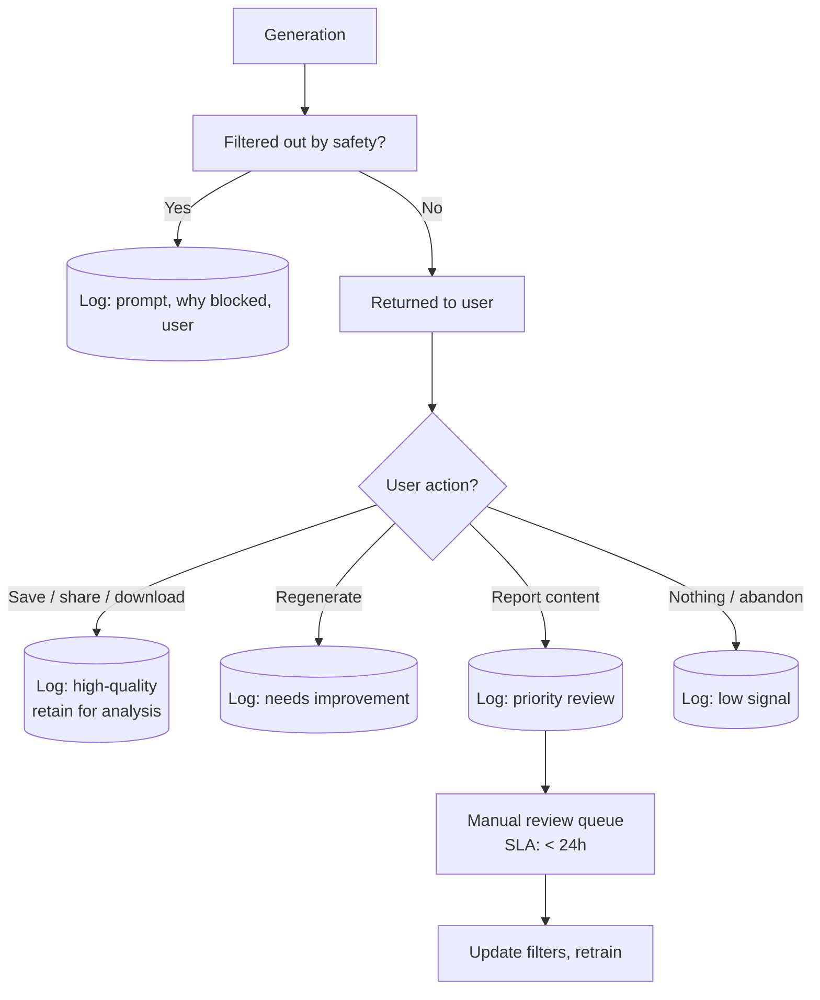

# Generative Models — Observability & Troubleshooting

**Measuring generative quality at scale. The metrics that work in production. What to alert on. Runbooks for the most common failures.**

---

## Why Generative Observability Is Different

Classifier observability (covered in [Computer Vision → 09](../computer-vision/09_Observability_Troubleshooting.md)) measures accuracy, calibration, per-class metrics. The labels are clear; the metrics are clear.

Generative observability has none of that clarity:

- There are no labels — you are creating outputs, not predicting them
- "Accuracy" is undefined
- Quality is partly subjective and partly measurable
- A model that produces *high-FID* output could still be *user-rejected* output

This chapter is the practical guide for monitoring generative systems where the quality bar is "users keep using it."

---

## What to Measure

| Metric | What It Tells You | Frequency |
|---|---|---|
| **FID (Fréchet Inception Distance)** | Distribution-level quality of generated images | Daily on a fixed sample |
| **CLIP score** (text-to-image) | How well outputs match prompts | Per-batch in production |
| **User retention by version** | Are users keeping the new model? | Continuous A/B |
| **Acceptance / regeneration rate** | Do users accept the first generation, or click "regenerate"? | Per-request |
| **Save / share / download rate** | Strong signal that quality met user's bar | Per-request |
| **Latency p50, p95, p99** | User-facing performance | Per-request |
| **Cost per generation** | Resource utilization tracking | Continuous |
| **Safety filter trigger rate** | Are filters firing too much (false positives) or too little (false negatives)? | Continuous |
| **Prompt diversity** | Unusual spike in similar prompts → potential abuse | Continuous |

---

## FID in Production — Subtle Pitfalls

FID is the standard distribution-level quality metric. Two production-specific gotchas:

### Pitfall 1: Sample Size Matters

FID is unstable on small samples.

| Samples | FID Standard Deviation |
|---|---:|
| 100 | ±20 |
| 1,000 | ±5 |
| 10,000 | ±1 |
| 50,000 | ±0.3 |

Below 1,000 samples, FID is too noisy to act on. **Run on at least 5,000-10,000 samples** for production decisions.

### Pitfall 2: FID Drift on Same Model

A deployed model's FID can drift even without retraining — because the **prompts users send change over time**. If users start sending more abstract prompts, FID drops (compared to training distribution); the model has not changed; the inputs have.

**Fix.** Track FID against:
1. A fixed reference set (your eval prompts + reference images) — measures model drift
2. A rolling sample of recent production prompts — measures prompt distribution drift

Compare both over time. Diverging trends mean prompts are shifting.

---

## User-Behavior Metrics — The Real Signal

For consumer-facing generative products, user behavior is the gold standard. Three high-signal metrics:

### Acceptance Rate

For each generation, track: did the user use the result?

```
Acceptance = (user clicked "save", "download", "share", or "edit") / (total generations)
```

| Acceptance Rate | Interpretation |
|---|---|
| > 60% | Excellent. Users like outputs. |
| 30-60% | OK. Typical for creative tools. |
| 10-30% | Quality is below the user's bar. Investigate. |
| < 10% | Something is broken. Revert recent changes. |

### Regeneration Rate

```
Regen rate = (user clicked "regenerate" or "try again") / (total generations)
```

High regeneration rate means users are *not satisfied* with first attempt. For Midjourney-style products this is normal (iteration is the workflow). For "generate logo" services, high regen rate signals quality issues.

### Time-on-Task

How long do users spend in your product per session?

If users disappear quickly, either the product is too easy (they got what they wanted fast — good) or too frustrating (they gave up — bad). Combined with conversion to paid plans, time-on-task tells you which.

---

## A/B Testing for Model Versions

Generative model upgrades are not always improvements. A new model may have higher FID but lower user satisfaction (different aesthetic, breaks existing prompts).

**Always A/B test before full rollout.**



**Run for at least 1 week** to gather meaningful behavioral data. Flag-based gradual rollouts (1% → 10% → 50% → 100%) reduce blast radius if something is wrong.

---

## What to Alert On

### Page-Worthy (P1)

| Signal | Threshold |
|---|---|
| **Latency p99 spike** | > 2x baseline |
| **Acceptance rate drop** | > 10% absolute drop in 1 hour |
| **Cost per generation** | > 50% spike |
| **Service errors** | > 1% requests failing |
| **Safety filter triggering** > 5x baseline | Possible attack or model drift |
| **Specific abuse pattern detected** (e.g., many similar prompts from one user) | Investigate immediately |

### Investigate-Soon (P2)

| Signal | Threshold |
|---|---|
| FID against eval set | > 10% drift |
| User retention drop | Track weekly cohorts |
| Regeneration rate increase | > 20% in a day |
| New prompt patterns appearing | Potential abuse vector |

### Track-Trend (no page)

| Signal |
|---|
| Cost trends |
| Storage growth |
| Model size trends |
| Per-region quality differences |

---

## Runbooks for Common Production Failures

### Failure 1: Sudden Quality Drop

**Symptom.** Acceptance rate dropped 20% overnight. FID also worse.

**Triage flow:**



### Failure 2: Latency Spike

| Cause | How to Check |
|---|---|
| Cache hit rate dropped | Redis metrics |
| GPU pressure | `nvidia-smi`, batch utilization |
| Model accidentally upgraded to bigger version | Deployment manifest |
| Auto-scaler thrashing | Replica count history |
| Network slowness (CDN to client) | CloudWatch / Grafana traces |

### Failure 3: Cost Spike

| Cause | How to Check |
|---|---|
| Cache invalidation (full miss for an hour) | Redis hit rate metrics |
| Prompt complexity spike (longer outputs) | Average tokens / image bytes per request |
| New region deployed without unwind | Cloud billing by region |
| Auto-scaling went wide | Replica count over time |
| Generator stuck in infinite generation | Per-request duration histogram (long tail) |

### Failure 4: Abuse Detected

**Symptom.** Safety filter triggering 100x baseline rate. Or: pattern of similar prompts from one IP / user.

**Action plan:**

1. **Rate limit / temp ban the user(s)** — buy time
2. **Sample the suspicious prompts** — what is being attempted?
3. **Update the input filter** — block the new pattern
4. **Audit recent generations** — was anything generated that shouldn't have been?
5. **Notify legal / trust & safety** — depending on severity
6. **Document the attack** — feeds future filter design

Always log enough to reconstruct the abuse. Without prompt + user + output logs, you cannot respond to abuse you cannot see.

---

## A Failure-Capture Pipeline



**The goal.** Every generation produces signal. Capture acceptance, regenerations, and reports. Use this data to improve filters and retrain the model on patterns the deployed model handles poorly.

---

## A Production Dashboard

The minimum-viable dashboard for a generative service:

```
┌──────────────────────────────────────────────────────┐
│  GENERATIVE SERVICE                                   │
│  Generations/sec: 124    Errors: 0.04%   p99: 8.2s    │
├──────────────────────────────────────────────────────┤
│  QUALITY (last 24h)                                   │
│  Acceptance rate: 62%   ▆▆▇▇▆▇▇▇▇  (stable)          │
│  Regen rate: 23%        ▅▅▅▅▆▅▅▅▅                    │
│  Eval-set FID: 12.3     (baseline: 11.8)             │
├──────────────────────────────────────────────────────┤
│  SAFETY                                               │
│  Input filter triggers: 0.8%                          │
│  Output filter triggers: 0.2%                         │
│  Reports queued: 3 (within SLA)                       │
├──────────────────────────────────────────────────────┤
│  INFRASTRUCTURE                                       │
│  GPUs: 12 active   Cache hit: 31%   Cost: $52/hr    │
├──────────────────────────────────────────────────────┤
│  RECENT EVENTS                                        │
│  • 14:23  Model v2.1 → 2.2 deployed (canary 10%)      │
│  • 09:15  Suspicious prompt pattern from user X       │
└──────────────────────────────────────────────────────┘
```

Build this with Grafana + Prometheus + custom panels. Open it daily. Teams that catch issues early are the teams with this discipline.

---

## The Honest Truth About Generative Observability

It is harder than discriminative ML observability. You cannot fully automate "is the output good?" because the answer is partly subjective. The best teams:

1. Define clear **user-behavior metrics** (acceptance, save/share rates) — these are the ground truth
2. Use **distributional metrics** (FID, CLIP) as early warning, not as primary
3. Maintain a **human-rated eval set** — even 200 prompts hand-rated quarterly catches most issues
4. **Sample real production outputs daily** — the team rotates a "quality lead" who looks at 50 outputs each morning
5. Trust **users' feet** — if they leave, your metrics missed something

Numbers help. People are required.

---

**Next:** [10 — Decision Guide](10_Decision_Guide.md) — "Should I generate or retrieve?" GAN vs VAE vs Diffusion vs API. Production readiness checklist.
