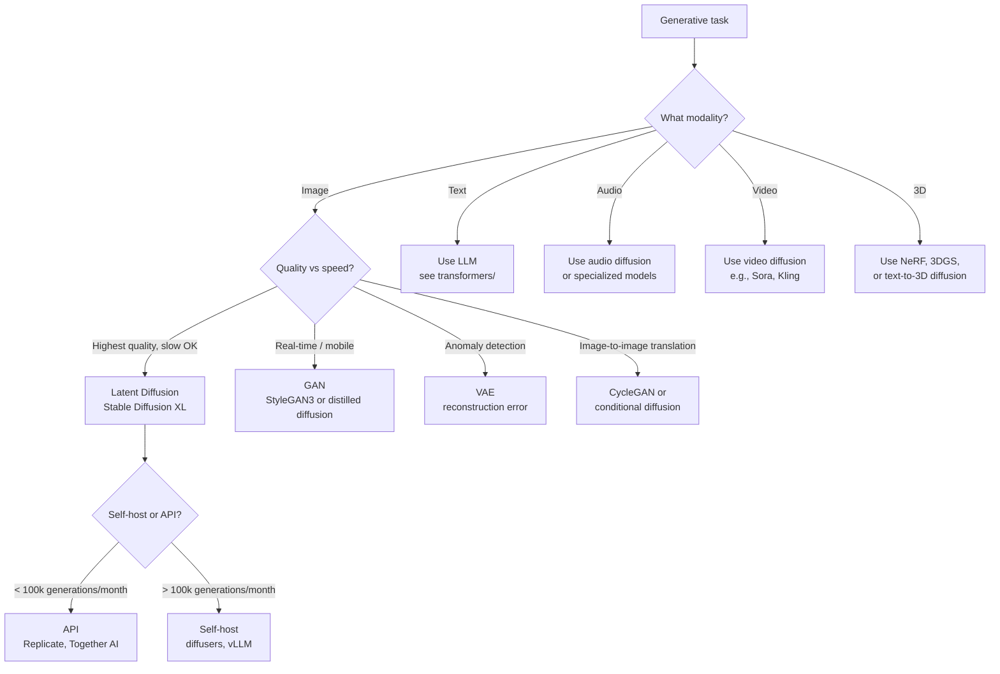

# Generative Models — Decision Guide

**"Should I use generative AI here?" The decision tables that save you from building the wrong thing. GAN vs VAE vs Diffusion vs API. Production readiness checklist.**

---

## The Core Decision: Should You Use Generative AI At All?

| Your Situation | Recommendation |
|---|---|
| Need to retrieve information that exists | **Don't generate. Retrieve.** Use [RAG](../rag/). |
| Need to classify, predict, score | **Don't generate. Classify.** Use [ML](../ml/) or discriminative DL. |
| Need to *create* something that does not exist | **Generate.** This is the right tool. |
| Need to *augment* training data for a rare-event classifier | **Generate.** Synthetic data generation. |
| Need a chatbot / copilot | **Generate** (LLM). See [transformers/](../transformers/) and [agents/](../agents/). |
| Need stylized image content (icons, illustrations, mockups) | **Generate** with diffusion. |
| Need photorealistic faces / avatars | **Generate** with StyleGAN or diffusion. |
| Have privacy constraints (cannot send data to cloud) | **Generate on-device.** Quantized diffusion or small LLMs. |
| Highly regulated (medical diagnostic outputs, legal content) | **Caution.** Generative outputs are uncertified. Use only for non-decision-critical augmentation. |
| Must be 100% truthful / verifiable | **Don't generate.** Or: generate + retrieve + cite. |

---

## Architecture Decision Tree

You decided to generate. Now: which family?

---

## Family Comparison — Side by Side

| Aspect | GAN | VAE | Diffusion |
|---|---|---|---|
| **Output quality** | Sharp (best at peaks: StyleGAN faces) | Often blurry | Highest overall (Stable Diffusion, Sora) |
| **Inference speed** | Fast — 1 forward pass | Fast | Slow — 20-1000 forward passes (faster with distillation) |
| **Training stability** | Hard | Easy | Easy |
| **Mode coverage** | Risk of mode collapse | Good | Excellent |
| **Latent space structure** | Less organized | Smooth, semantic | Image-shaped (no compression by default) |
| **Controllability** | Moderate | High (semantic axes) | Highest (text + image conditioning) |
| **Best Use Cases** | Faces, fast generation, real-time | Anomaly detection, compression | Text-to-image, image-to-image, highest quality |
| **Production maturity (2026)** | Mature | Mature | Mature, dominant for new work |
| **Compute to train from scratch** | Days-weeks (small) to months (StyleGAN3) | Hours-days | Months on clusters |
| **Compute to fine-tune** | Hours | Hours | Hours (LoRA, DreamBooth) |

---

## Build vs Buy

Most production teams should **buy** for generative. Here is when to switch:

| Volume | Recommendation |
|---|---|
| **< 1,000 generations/month** | **Use API (OpenAI, Anthropic, Replicate, Together).** $1-50/month is plenty. Don't build infra for this. |
| **1,000 - 100,000/month** | **API with negotiated pricing OR self-host on cloud GPU.** Break-even depends on usage pattern. |
| **100,000 - 10M/month** | **Self-host.** API costs add up; engineering payoff is large. |
| **> 10M/month** | **Self-host required.** Optimize aggressively. |
| **Privacy / compliance constraints** | **Self-host required.** No exceptions. |
| **Differentiation through the model** | **Self-host + fine-tune.** The model is your moat. |

The 100,000/month break-even is approximate. For Stable Diffusion XL via API at $0.005/image: $500/month. Self-hosting on a T4: ~$250/month + engineering. The math is close until you scale past it.

---

## When NOT To Use Each Family

| Family | Don't Use When |
|---|---|
| **GAN** | You need text conditioning at scale → use diffusion |
| **GAN** | You have an unstable team (training is hard, requires expertise) → use diffusion |
| **VAE** | You need photorealistic output → use diffusion or GAN |
| **VAE** | You need precise text conditioning → use latent diffusion |
| **Diffusion** | You need real-time generation (< 100ms) → use GAN or distilled diffusion |
| **Diffusion** | You have very limited compute → use GAN |
| **All three** | The task is "retrieve information that exists" — use RAG |

---

## Production Readiness Checklist

Before launching any generative product:

### Data
| ✓ | Item |
|---|---|
| ☐ | Training data lineage documented (or: pretrained model + fine-tune dataset) |
| ☐ | License/copyright cleared for training data |
| ☐ | Demographic / representational balance audited |
| ☐ | Sensitive categories filtered (CSAM, prohibited content) before training |

### Model
| ✓ | Item |
|---|---|
| ☐ | Architecture choice justified (GAN/VAE/Diffusion + variant) |
| ☐ | Model card written (intended use, limitations, biases — see [Chapter 08](08_Quality_Security_Governance.md)) |
| ☐ | FID / CLIP / human eval baselines established |
| ☐ | Adversarial robustness considered (prompt injection, jailbreaking) |

### Inference
| ✓ | Item |
|---|---|
| ☐ | Latency p50, p95, p99 measured |
| ☐ | Throughput measured at expected batch size |
| ☐ | Cost per generation calculated and validated |
| ☐ | Distillation / quantization considered if cost / latency is critical |

### Safety / Governance
| ✓ | Item |
|---|---|
| ☐ | Input filter (banned keywords + classifier) deployed |
| ☐ | Output filter (NSFW + copyright + face detection) deployed |
| ☐ | Watermarking / C2PA implemented |
| ☐ | Audit log for all generations (prompt, output, user, model version) |
| ☐ | Abuse response runbook |
| ☐ | Regulatory review (EU AI Act, US executive orders, state laws, sector rules) |
| ☐ | Indemnification policy (B2B) |
| ☐ | Privacy review (data retention, user rights, PII handling) |
| ☐ | Transparency notice (users know they are interacting with AI) |

### Operations
| ✓ | Item |
|---|---|
| ☐ | Monitoring dashboard live (acceptance, FID, latency, cost) |
| ☐ | Alerts on quality drops, latency spikes, abuse patterns |
| ☐ | Failure-capture pipeline for retraining |
| ☐ | Rollback plan if a new model version is bad |
| ☐ | On-call team identified |
| ☐ | A/B testing infrastructure for model upgrades |

If you cannot check most items in **every** category, you are not ready. Generative products that skip steps end up in the news.

---

## Cost Estimation Framework

For a B2B generative product (e.g., AI image tool):

### Initial Build (One-Time)

| Item | Typical Hours / Cost |
|---|---|
| Architecture design + selection | 40-80 hours |
| Pretrained model evaluation | 40 hours |
| Fine-tuning (if needed) | 40-200 hours + $100-2,000 compute |
| Safety filter pipeline | 80-160 hours |
| Watermarking + C2PA | 40-80 hours |
| Serving infrastructure | 80-160 hours |
| Monitoring dashboards | 40-80 hours |
| Regulatory / legal review | 40-200 hours (varies wildly) |

### Ongoing (per Year)

| Item | Typical Cost |
|---|---|
| Inference compute | Volume × $0.0002 - $0.005 per generation |
| Storage / CDN | Generated content × monthly cost / TB |
| Engineering on-call | 0.2-0.5 FTE |
| Filter retraining | $500-5,000/month |
| Continued monitoring infra | $200-2,000/month |

### Total Cost of Ownership Example

A B2B AI image product at 500k generations/month:

| Phase | Cost |
|---|---|
| Year 1 build | ~$300k engineering + $5k initial training compute + $20k legal |
| Year 1 ongoing | ~$1k/month inference + $5k filter retraining |
| Year 2+ ongoing | ~$2k/month all-in |

For a SaaS at $50/user/month with 1,000 customers, breakeven on operating costs is trivial. The engineering investment is the gate.

---

## When to Stop and Reconsider

Generative projects fail. Some signals to pause:

| Signal | What to Do |
|---|---|
| FID will not improve below 50 after 4 weeks of training | Architecture is wrong, or data is too small. Consider transfer / fine-tune. |
| User acceptance < 20% after launch | Output quality below user's bar. Either retrain or rethink the product. |
| Safety filter blocking 30%+ of legitimate requests | Filter too aggressive. Tune. |
| Cost per generation > 10x what's billable | Switch to a smaller model, distill, or kill the feature |
| Regulatory team escalating concerns | **Stop and engage them.** Do not deploy until cleared. |
| Stakeholder says "the model needs to be 100% safe" | Reframe: define acceptable risk, not perfection |
| Many users reporting offensive content | Tighten filters, audit logs, possibly issue refunds — this is a fire |

---

## The Generative-Engineer Mindset

The mental model that distinguishes engineers who ship reliably:

| Mindset | What It Looks Like |
|---|---|
| **Quality is partly subjective** | Always combine quantitative metrics with human eval |
| **Generative AI scales misuse, not just use** | Plan for abuse from week 1; audit logging from day 1 |
| **Pretrained + fine-tune wins** | Don't train diffusion from scratch unless you have ImageNet-scale resources |
| **Pipelines, not models** | Watermarking, filtering, monitoring, retraining are part of the system |
| **Cost economics matter early** | Distillation, quantization, caching aggressively from launch |
| **Provenance > Detection** | C2PA + watermarking is more durable than fighting an arms race with detectors |
| **Feedback loops close the loop** | User actions feed back into training and filter retraining |

---

## What's Next

This playbook covers GAN, VAE, Diffusion, and gives you the foundations. The architecture deep dives expand from here:

| Doc | When to Read |
|---|---|
| `architectures/gan.md` | When choosing between GAN variants — DCGAN, StyleGAN, CycleGAN |
| `architectures/vae.md` | When you need controllable latent spaces or anomaly detection |
| `architectures/diffusion.md` | When you need state-of-the-art quality and can pay the inference cost |
| `architectures/style-transfer.md` | When transferring style between images |
| `architectures/u-net.md` | The encoder-decoder backbone shared by segmentation and diffusion |

And the sibling playbooks:

- [Deep Learning](../deep-learning/) — neural network foundations
- [Computer Vision](../computer-vision/) — vision tasks (CNN, ViT)
- [Transformers](../transformers/) — for LLM and modern attention (coming)
- [RAG](../rag/) — for retrieval-augmented systems
- [Agents](../agents/) — for autonomous AI

---

**Where you started:** [01 — Why](01_Why.md). Read backwards from here to revisit any concept.

**Hands-on companion:** [Deep Learning Autoencoders & GANs on Colab](https://colab.research.google.com/github/sunilmogadati/systems-in-production/blob/main/implementation/notebooks/Deep_Learning_Autoencoders_GANs.ipynb) (autoencoder, SimpleGAN, DCGAN on MNIST).
