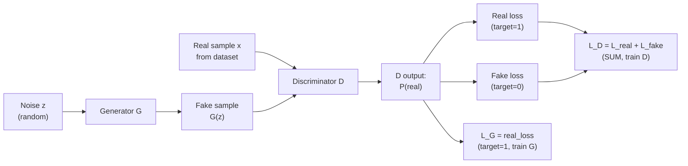
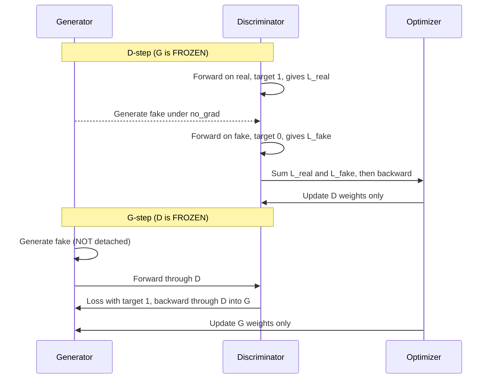

# GAN

This document has four sections: theory (concepts and architecture), code (implementations with commentary), math (formulas and derivations), and Q&A (common questions).

---

# Section 1 — Concepts and Architecture

## 1.1 The problem: why "make something realistic" is hard

Most familiar deep learning is **discriminative** — networks that map an input to a label, with a clear ground truth (the correct answer known in advance) attached. Image classifiers know that this picture is a "7" because a human wrote "7" next to it. The loss function (a single number that measures how wrong the network is) — typically cross-entropy (a standard penalty that grows when predicted probabilities disagree with the true label) against the true label — gives the optimizer an unambiguous direction to move in. (See the reference in Section 3.1 for definitions of *optimizer*, *parameters*, *epoch*, etc.)

**Generative modeling** — the task of producing brand-new examples that look like they could have come from the training set — has no such ground truth. Nothing in the training set is labeled "realistic" with a number from zero to one. There is no oracle to compare a freshly-imagined digit against. So the central question of generative modeling is: *what loss function captures realism?* If realism cannot be defined with an equation, how does the network learn it?

Before GANs, the dominant attempt at this was the **autoencoder** — a single neural network trained to reconstruct its own input through a bottleneck (a narrow layer that forces compression). An autoencoder has two halves wired together: an *encoder* that compresses an input image into a much smaller vector (an ordered list of numbers), often called the "latent code" or "latent representation", and a *decoder* that takes that small vector and tries to rebuild the original image from it. The bottleneck in the middle forces the network to keep only the most important features, like compressing a photo into a thumbnail and then enlarging it back. The training signal is supervised in a peculiar way — the input is also the label. The network's parameters are updated to minimize a *reconstruction loss*, usually the pixel-by-pixel mean-squared error (MSE — average of squared differences between two images) between the input image and the reconstructed image. Over many epochs, the autoencoder learns to produce reconstructions that are close to inputs that resemble its training data.

Autoencoders work, but their generated outputs are notoriously **blurry**. Suppose the training set has a hundred different examples of the digit "7" — some thin, some thick, some slanted. Pixel-wise mean-squared error punishes any deviation from the actual training image equally, regardless of whether the deviation is semantic ("not a 7-shape") or stylistic ("a slightly thicker 7"). Faced with that pressure, the network plays it safe and predicts a *kind of average* "7" — soft, ill-defined, too cautious to commit to a sharp shape. This is the fundamental weakness of MSE-style losses for generation: minimizing pixel-distance to the average is a poor proxy for "looks realistic." The conclusion is that **a fixed mathematical loss cannot capture realism**. Autoencoders are great for reconstruction, but for generating realistic samples, a different approach is needed.

## 1.2 The breakthrough idea: make the loss function itself a neural network

The conceptual leap that makes GANs work is to give up on writing realism as a closed-form equation. Instead, **train another network to recognize realism**, and use that network's verdict as the loss signal. Realism becomes whatever the second network thinks looks real.

This produces a setup with two networks, often described through an analogy. The first network is the **generator** (G), the *forger* — it takes random noise as input and produces fake samples. The second network is the **discriminator** (D), the *detective* — it takes a sample as input and outputs a single number representing how real that sample looks. (Some research papers call D a *critic* instead of a discriminator; the term shifts when the output is a continuous score rather than a probability, as in Wasserstein GANs, but for vanilla GANs "discriminator" is standard.)

A few terms need defining. The **noise vector** (often written $z$) is a list of random numbers fed in as the generator's input. The length of that list is a **design choice** called the *latent dimension* — typically set to 100 in introductory GANs, larger (512, 1024) in production models. The trade-off: too small and there isn't enough room to encode all the variation in the dataset; too large and the network is bloated. One hundred is a common starting point that works well for small datasets like MNIST. The same length is used at training and inference — it is fixed when the architecture is chosen, not redrawn at random.

Each of the hundred numbers is drawn from a fixed probability distribution. The two common choices are:
- **Standard normal distribution** — the familiar bell curve centered at zero. Most samples fall close to zero (within $\pm 1$), with rare values further out. Mean is zero, variance is one. Notation: $\mathcal{N}(0, 1)$.
- **Uniform distribution on $[-1, 1]$** — every value between $-1$ and $+1$ is equally likely; values outside that range are impossible.

Both choices are deliberate, not arbitrary. They produce noise vectors with values clustered near zero, which pairs well with weight matrices initialized near zero. The *same* distribution is used during training and during inference — once the network is trained, drawing a new $z$ from the same distribution produces a new sample in the statistical neighborhood the network learned on. Each distinct $z$ produces a distinct fake sample, but only $z$ values from the training distribution produce in-domain results.

The space those noise vectors live in is called the **latent space**. "Latent" means "hidden" or "underlying" — the hundred dimensions of $z$ are abstract knobs the network learns to use, not pixels or features that are directly visible. Two nearby $z$ vectors produce visually similar images, and a smooth path between two $z$ vectors produces a smooth visual morph. This is what enables the popular GAN demo of slowly morphing one face into another.

A **fake** is any sample produced by G; a **real** sample is one drawn from the actual training dataset. The discriminator's job is to tell these two populations apart.

## 1.3 How they learn together: the adversarial dance

The two networks are trained alongside each other, but with opposite goals — D tries to get better at telling real from fake, and G tries to get better at producing fakes that D cannot distinguish from real. They co-evolve. As G improves, the fakes get harder to spot; D has to sharpen its eye. As D improves, the bar for "fooling the detective" gets higher; G has to refine its forgery. This mutual escalation is the **adversarial dance**.

This is also where GANs get their unusual classification: they are considered **unsupervised** (learning without human-labeled targets) at the task level, even though D is internally doing supervised (learning from human-provided labels) binary classification. The reason is the labels. In a normal supervised setup, a human labels each image (this one is a 7, that one is a 4). In a GAN, the labels — *real = 1, fake = 0* — are generated automatically from the source of each sample. Anything drawn from the dataset gets the label 1; anything produced by G gets the label 0. No human annotates anything. The system labels itself, so the GAN as a whole is unsupervised, even though D's internal loop is mathematically a supervised classifier.

The adversarial dance is also what theorists call a **minimax game** — one player tries to maximize a quantity while the other tries to minimize it. In the GAN's case, the discriminator tries to maximize its accuracy at telling real from fake, and the generator tries to minimize that same accuracy. The compact mathematical form of this game is given in Section 3; here the prose version is enough.

## 1.4 The two networks in detail (SimpleGAN)

The simplest possible GAN — the canonical MNIST (a dataset of 28x28 handwritten digit images) example — uses two **fully-connected** networks (also called multilayer perceptrons or MLPs). A fully-connected layer is the basic feedforward layer where every input neuron (a single output value in a layer) is connected to every output neuron through a learned weight (a tunable multiplier), plus an additive bias term (a learned offset added to each neuron's output). Both G and D in this version are stacks of these layers with nonlinear activations (functions applied to neuron outputs to allow the network to model curves, not just straight lines) between them.

The **generator** in this SimpleGAN starts with a hundred-dimensional noise vector and pushes it through three hidden layers (intermediate layers between input and output) in a *bottleneck-then-expand* pattern. The widths go 100 → 32 → 64 → 128 → 784: the network first compresses the noise vector down to a 32-dimensional summary (the bottleneck), then expands it outward through doubling layers (64, 128, 784). The output width of 784 is **forced** by the problem — MNIST images are 28×28 = 784 pixels, so the final layer must produce exactly that many numbers. The output is then reshaped from a 784-long vector into a one-channel 28×28 image. The intermediate widths (32, 64, 128) are **design choices**: they are not derived from any formula. The implementer picks them based on rules of thumb — start with a narrow summary, then grow gradually by doubling at each step (32 → 64 → 128), and end at the required output size. Other choices (say 64 → 128 → 256 → 784, with no bottleneck at all) would also work; they would produce a network with more parameters and slightly different training behavior. The bottleneck-then-expand pattern is convention rather than law.

The hidden layers use **LeakyReLU** as their activation function rather than the more familiar ReLU (Rectified Linear Unit — passes positive values unchanged, zeros out negative values). Plain ReLU sets all negative inputs to zero, which means any neuron that drifts into the negative region produces zero gradient (the slope of the loss with respect to a parameter — tells the optimizer which direction to nudge) and can stop learning entirely — a "dead neuron." LeakyReLU instead multiplies negative inputs by a small slope (often 0.2), so even when a neuron is in its negative region, a small gradient still flows through. In a network whose training signal is already fragile (because it comes from another network that is itself learning), keeping every neuron alive matters.

The **output activation** of the generator is **Tanh**, the hyperbolic tangent — an S-shaped function that squashes any input number into the range $[-1, +1]$. To understand what this means for an image: each of the 784 outputs of the final layer is one *pixel*. Tanh forces every pixel value into $[-1, +1]$. So the generator's output is literally an image whose pixel intensities live in that range — $-1$ corresponds to black, $+1$ to white, and intermediate values to grays in between. (The exact mapping to a displayable image just rescales $[-1, +1]$ back to the standard $[0, 255]$ at display time.)

Tanh is not a stylistic choice — it is mandatory and tied to a corresponding pre-processing step. Real MNIST images arrive in the $[0, 1]$ range from the dataset and are explicitly rescaled to $[-1, +1]$ before being shown to the discriminator. Both real and fake samples must inhabit the same numerical range, otherwise the discriminator picks up on the range mismatch as a free shortcut: it would learn "anything with a negative pixel must be fake" and the actual content of the images becomes irrelevant.

The **discriminator** is the mirror image of the generator: a pyramid that *contracts* from seven hundred eighty-four (a flattened MNIST image) down through one hundred twenty-eight, sixty-four, thirty-two, and finally to a single scalar (a single number, not a vector or matrix) output. Hidden layers again use LeakyReLU, for the same dead-neuron reason. Crucially, the discriminator's output layer has **no activation function** — it produces a raw "logit," which is simply a real-valued score (any real number; positive means "leans real," negative means "leans fake"). The lower the logit, the more confident D is that the input is fake; the higher, the more confident it is that the input is real. The reason no sigmoid is applied at the output is for numerical stability: a sigmoid (the function that squashes a real number into the zero-to-one range so it can be read as a probability) is normally needed before binary cross-entropy loss, but in PyTorch (a popular Python deep-learning framework) the loss function `BCEWithLogitsLoss` combines the sigmoid and the **BCE loss** (binary cross-entropy — the standard loss for two-class classification problems) into a single fused operation that is more numerically stable than computing them separately. Applying a sigmoid before the loss would cause floating-point underflow (numbers becoming so small they round to zero on the computer) when D becomes confident, leading to NaN (not-a-number) gradients. The discriminator also uses **dropout** between its hidden layers — a technique that randomly zeroes out a fraction of activations (a layer's output values) during training. Dropout makes D weaker on purpose, preventing it from overpowering G in early training when G is still terrible. If D learns too fast, the gradient flowing back to G saturates (flatlines so the loss curve has no slope) and G never gets a chance to improve.

The optimizer for both networks is **Adam** (an adaptive learning-rate optimizer that adjusts step size per parameter) — a popular adaptive optimization algorithm that maintains a running estimate of both the gradient and the squared gradient for each parameter, and uses these to set per-parameter learning rates (the size of each update step). For GANs specifically, Adam is run with a reduced first-moment momentum coefficient (the weight on the running average of past gradients; the standard tweak from the DCGAN paper is to lower it from the default 0.9 down to around 0.5), which calms the oscillations that adversarial training tends to produce. Two **separate** Adam optimizers are constructed — one for G's parameters, one for D's — because the two networks must be updated independently.

## 1.5 The training procedure

Each minibatch (a small group of training examples processed together — e.g., 64 images) of real images triggers a *two-step dance*. First comes the **discriminator step** (the D-step). The optimizer's gradients are zeroed out, then D is shown a batch of real images and its **real loss** is computed — the BCE loss using a target of one. Then a fresh batch of noise vectors is drawn, passed through G to produce fakes, and D is shown those fakes; its **fake loss** is computed using a target of zero. The two losses are then **summed**, not averaged. This sum is treated as the discriminator's total loss for the batch. Backpropagation (the algorithm that walks the chain rule backward through every layer to compute each weight's gradient) runs, and only D's parameters are updated. (G is treated as frozen during this step — typically by wrapping the noise-to-fakes call in a "no gradient" context that tells the framework not to track gradients through G's parameters during this forward pass (computing layer outputs left-to-right through the network).) The reason for the sum rather than the mean is that the discriminator is conceptually solving one binary classification problem on a combined batch of real plus fake samples, and the standard BCE loss for that combined batch is the sum of the two halves' losses — the average would scale the gradient differently and is not what the algorithm specifies.

Second comes the **generator step** (the G-step). The optimizer's gradients are zeroed out again, a new batch of noise is drawn, and fakes are produced. The forward pass itself does not learn anything (forward passes never do — they just compute layer outputs left-to-right). What changes from the D-step is whether the framework *records the connections needed for a backward pass*. During the D-step, the framework was told "do not record the path through G" (the no-gradient context) so that the eventual backward pass would stop at D's input. During the G-step, the framework *does* record that path, because G's parameters need to be reachable from the loss when the backward pass runs.

Those fakes are passed through D, producing logits. The generator's loss is computed using a target of **one** — even though the images are fake. This is the most counterintuitive line in the whole loop. The target is the *goal*, not the *truth*. G's objective is to fool D into classifying its outputs as real, so the loss says "I want D's score on these fakes to push toward one." This is the *non-saturating* form of the generator loss — there is also a saturating form (covered in Section 1.7 and the math in Section 3.5.5). The non-saturating form gives stronger gradients early in training, which is why it is the practical default.

Now backpropagation runs. Here the geometry of the gradient flow matters. G and D are *two separate networks* — different parameters, different optimizers — but during the G-step the data path is G's first layer → ... → G's last layer → D's first layer → ... → D's last layer → loss. For the backward pass, the chain rule walks the same path in reverse: the gradient starts at the loss, propagates backward through D's last layer, through D's middle layers, all the way to D's first layer, and then *crosses the boundary* into G's last layer (because G's output was D's input), and continues backward through G's middle layers to G's first layer. So gradient information physically travels through every layer of D and every layer of G during this single backward pass. D's parameters do receive gradients during this pass — that is unavoidable, since the gradient must traverse D to reach G — but those gradients are simply discarded, because the call to update parameters is made on G's optimizer, which only knows about G's parameters. D's parameters remain unchanged in the G-step. This is why two separate optimizers exist: each updates only the parameters it was constructed with.

That pair of steps is performed for every minibatch, for many epochs (typically a hundred for SimpleGAN on MNIST). With every batch, D gets slightly better at spotting the current G's fakes, and G gets slightly better at fooling the current D.

## 1.6 DCGAN: when convolutions enter

SimpleGAN works on MNIST but it is wasteful. Fully-connected layers connect every input pixel to every output neuron, which means they spend an enormous fraction of their parameters learning that nearby pixels tend to be related — a fact that is *built into* convolutional layers (layers that slide a small filter — the kernel — over the image to detect local patterns) from the start through their local receptive fields (each output sees only a small neighborhood of input) and shared weights (the same filter is reused at every spatial position). For any real image task, FC-only (fully-connected only) generators and discriminators are computationally absurd compared to convolutional alternatives.

**DCGAN** — the Deep Convolutional GAN — is the convolutional rewrite. The original DCGAN paper (Radford, Metz, and Chintala, 2015) laid out five architectural rules that have become canonical. The first rule clarifies a common point of confusion: a typical CNN classifier uses *both* convolution layers (with stride one) *and* pooling layers (a separate, non-learnable shrinking operation). For example, a classic VGG-style block looks like `Conv(stride=1) → ReLU → Conv(stride=1) → ReLU → MaxPool(2)`: convolutions extract features without changing spatial size, then a pool layer shrinks the spatial dimensions in half. DCGAN's rule says: **drop the pooling layer entirely, and instead use a convolution with stride > 1 to do the shrinking**. So a DCGAN discriminator block looks more like `Conv(stride=2) → LeakyReLU` — one operation, both feature extraction and downsampling, no separate pool.

What does it mean to *learn* the downsampling? Pooling is a fixed rule. Max-pool, for instance, always picks the largest value in each 2×2 window — it has no parameters and the rule is the same for every image, every batch, every layer. A strided convolution, by contrast, has a *learnable filter* (a small grid of weights, e.g., 4×4) that slides across the input. As the filter slides, it produces one output value per stride step — and because the stride is greater than one, the output is spatially smaller. The values in that filter are learned during training. As a concrete example: max-pool always reduces a 2×2 patch to the largest value in that window, ignoring the other three. A strided convolution can learn to weight all four pixels — perhaps the filter discovers that emphasizing horizontal edge information leads to a better discriminator, and the weights converge to a pattern like `[+1, -1; +1, -1]` that responds strongly to vertical edges (the column-to-column transitions in pixel intensity). Each downsampling layer ends up tuned to the *kind* of summary that helps the network's task, rather than always taking the maximum.

The opposite operation in the generator is **transposed convolution** (sometimes called a "deconvolution," though that name is misleading). Where strided convolution takes large steps across its *input* to produce a smaller output, transposed convolution takes large steps across its *output* to produce a *larger* output than its input — also with a learnable filter. Together they let the generator grow noise into a full image and the discriminator shrink an image down to a single scalar, with every step of growth and shrinkage governed by learned weights rather than fixed pooling rules. Pooling is non-learnable and discards spatial information; learned strides keep the gradient signal informative.

Second, **use BatchNorm in both networks**, except at the boundaries — G's last layer and D's first layer skip BatchNorm. BatchNorm (short for Batch Normalization) is a layer that re-centers and re-scales activations across the minibatch dimension, so they have mean zero and variance one before being passed to the next layer. This stabilizes training by preventing activations from drifting into ranges where gradients vanish. The reason for skipping it at the boundaries is to avoid distribution collapse — applying BatchNorm to the final generated image or to the raw input of the discriminator can wash out the very statistics the model is trying to learn.

Third, **remove fully-connected hidden layers** in deeper architectures. The whole point of going convolutional is to exploit spatial locality and weight sharing; reintroducing FC layers in the middle of the network defeats that purpose. Fourth, **use ReLU in the generator and LeakyReLU in the discriminator**. The asymmetry is the DCGAN paper's empirical recommendation — ReLU lets G saturate to zero in dead regions which actually helps with sharp output, while D needs the LeakyReLU's living-everywhere gradient to keep learning. Fifth, **initialize weights (set the starting values for the layer parameters before training) from a small zero-mean normal distribution**. Small variance prevents the activations from saturating their nonlinearities at the start of training, which would kill the gradients before learning could begin.

**DCGAN hyperparameters (the explicit numbers).** The DCGAN paper pins down the otherwise-vague "small learning rate" and "reduced momentum" with concrete values: optimizer is `Adam(lr=0.0002, β1=0.5, β2=0.999)` — note that β1 is dropped from the Adam default of 0.9 down to 0.5, which calms the oscillation that adversarial training tends to produce. Conv and ConvTranspose weights are initialized from $\mathcal{N}(0, 0.02^2)$ — a zero-mean normal with standard deviation 0.02. BatchNorm scale parameters $\gamma$ are initialized from $\mathcal{N}(1, 0.02^2)$ (centered at one, the identity scale). These three numbers together — `lr=0.0002`, `β1=0.5`, init std `0.02` — are the canonical DCGAN recipe.

The DCGAN training loop is structurally identical to SimpleGAN's — same alternation, same loss, same two optimizers. Only the network architectures change.

## 1.7 Failure modes

GAN training is famously unstable, and there are three named failure modes worth distinguishing. **Mode collapse** is the most colorful: the generator discovers one (or a small handful of) outputs that consistently fool the current discriminator, and starts producing only those outputs regardless of what noise vector it is given. The diversity of the real data is ignored. The discriminator might eventually learn to spot the trick and force G to find a new output, but that new output then becomes the new monoculture.

**Vanishing gradients** (when the gradient becomes so close to zero that learning effectively halts) strike when the discriminator wins too hard, too early. If D learns to score every fake near zero with high confidence, the gradient flowing back through D into G becomes nearly zero, and G stops learning. This is closely tied to the choice of generator loss form (saturating — meaning the loss flattens so its gradient dies — versus non-saturating, the alternative form whose gradient stays informative; both discussed in Section 3) and to the capacity (the network's ability to represent complex functions, roughly proportional to its parameter count) balance between the two networks. A dropout layer in D, equal learning rates, and roughly equal parameter counts between G and D are all design choices aimed at preventing this.

**Oscillation** is the third pathology — G and D chase each other in cycles without converging. G learns to fool D in one way, D learns to detect that, G shifts strategy, D re-detects, and so on. The two never settle. This is a *moving-target problem*. A subtle point: GAN training overall is **unsupervised** (no human-labeled data — the labels real-vs-fake are auto-generated from the source of each sample), but each individual gradient step is solving a supervised binary classification sub-problem. The instability comes from the fact that the binary classifier (D) is being trained against a target distribution (G's outputs) that is itself changing every step — the loss landscape is non-stationary. In conventional single-network training, whether supervised or unsupervised, the loss surface is fixed once the dataset and loss function are chosen, and the optimizer just descends it. In GAN training, the loss surface for each network is being re-shaped by the other network's updates, so even a stable gradient step can push the model in a direction that no longer makes sense once the opponent has moved.

## 1.8 The end of training

If everything goes well, the GAN converges (settles into a stable state where the loss stops dropping meaningfully) to a **Nash equilibrium** — a stable point in the two-player game where neither player can improve by changing only its own strategy. At equilibrium, the generator's output distribution has matched the real data's distribution, and the discriminator therefore cannot tell them apart — its output collapses to roughly 0.5 for every input it sees. The detective is genuinely stumped, not because it is bad but because the forger has gotten that good. (This does not mean D would output 0.5 for *any* image fed to it — D is only equilibrated against the specific distribution G has converged to. Given a photograph of a dog, the output is meaningless.)

At this point, the discriminator's job is done. **Only the generator is deployed.** D was a teaching device, a piece of training scaffolding whose entire purpose was to provide the gradient signal that taught G. Once G is good, D is discarded, just as a forger discards the textbook on detective tactics once the forgery is convincing. Once convergence happens, the discriminator can be thrown away.

## 1.9 The GAN game in one diagram

The data flow of the game looks like this:



Reading left to right: noise enters G and produces a fake; real samples come from the dataset; both populations are scored by D; D's score is used three ways — once as the real-loss signal (target one), once as the fake-loss signal (target zero), and once again as the generator's loss signal (target one, despite the input being fake). The two-step alternation that handles this — D-step, then G-step — is captured in this sequence:



## 1.10 Connections to convolutional architectures

Two ideas from convolutional networks come back through DCGAN. An ordinary convolution can be written as a matrix multiplication where the underlying matrix has a *Toeplitz* structure — banded sparsity reflecting the fact that each output position is connected only to a small spatial neighborhood of the input. A **transposed convolution** is the matrix-multiplication interpretation that uses the *transpose* of that same Toeplitz matrix. Doing convolution and transposed convolution in sequence does *not* recover the original input exactly — the resulting output has scale mismatches and uneven intensity, because convolution mixes values irreversibly. The DCGAN generator uses transposed convolution precisely *because* perfect inversion is not the goal. Instead, the network *learns* to upsample noise into a meaningful image — the imperfect inversion is a feature, not a bug.

The second connection involves parameter density. SimpleGAN's first fully-connected layer treats the flattened MNIST image as one long vector, with every pixel connected to every output neuron. The underlying weight matrix is fully dense — no Toeplitz structure, no banded sparsity, no spatial inductive bias. This is one reason DCGAN replaces SimpleGAN's FC layers with conv layers: to encode local spatial structure the FC layer would otherwise have to learn from scratch. The same parameter-counting comparison between a CNN and a feedforward network maps directly onto the SimpleGAN-versus-DCGAN comparison.

---

# Section 2 — Code

This section holds the canonical SimpleGAN training loop with line-by-line commentary, plus code-trace and code-fill examples. The conceptual "why" lives in Section 1; the math underpinnings live in Section 3.

## 2.1 Full Code Walkthrough — SimpleGAN Training Loop

This is the canonical SimpleGAN training loop in PyTorch, annotated line-by-line.

**What this does (setup block):** Before the training loop runs even once, this block builds the two networks, picks a loss function, and creates two separate "weight-update machines" (optimizers) — one per network. Think of it as setting up two players, each with their own coach. This implements the design described in Section 1.4 — two networks, mirror-pyramid architectures, with a fused sigmoid+BCE loss for numerical stability — and Section 1.5's requirement that *each network needs its own optimizer* so D is never accidentally updated during the G-step or vice versa. The hundred-dimensional noise size and Adam choice match Section 1.4's defaults. (Hyperparameters are settings chosen by the engineer before training, not learned by the network. The DataLoader is a PyTorch helper that yields the dataset one minibatch at a time. The GPU — graphics processing unit — is the parallel-math chip that runs deep learning much faster than the CPU.)

```python
# ============================================================
# Setup BEFORE the training loop
# ============================================================

# Hyperparameters
z_size = 100               # noise vector dimensionality
batch_size = 64            # samples per minibatch
n_epochs = 100             # passes over the entire MNIST dataset
device = 'cuda' if torch.cuda.is_available() else 'cpu'

# Networks
d = Discriminator(in_features=784, out_features=1).to(device)
g = Generator(in_features=100, out_features=784).to(device)

# Loss — BCEWithLogitsLoss combines sigmoid + BCE for numerical stability
loss_fn = nn.BCEWithLogitsLoss()

# Two SEPARATE optimizers — one for each network
# (SimpleGAN tutorials commonly use 0.002; the DCGAN paper recommends 0.0002 for the convolutional case.)
d_optim = optim.Adam(d.parameters(), lr=0.002)
g_optim = optim.Adam(g.parameters(), lr=0.002)

# Helpers (defined elsewhere) — they construct target tensors and apply BCE:
#   real_loss(logits, ...) → BCE between logits and target=1
#   fake_loss(logits, ...) → BCE between logits and target=0
```

**What this does (training loop):** This is the heart of GAN training. For every minibatch, it does the *two-step dance* described in Section 1.5: first it trains the discriminator (teaches the detective to spot fakes), then it trains the generator (teaches the forger to fool the detective). Each step has the same four-line pattern — clear old gradients, do a forward pass, compute the loss, do a backward pass (computing gradients via backpropagation), apply the update — but each step targets a *different* network. The order matters: D goes first so G is always learning against an up-to-date critic. This is the executable form of the adversarial dance from Section 1.3 and the alternation diagram in Section 1.9. Two terms appear in the code worth defining: a **tensor** is a multi-dimensional array of numbers — the data structure PyTorch uses for images, weights, and gradients alike — and the **computation graph** is the record PyTorch keeps of every operation performed on tensors so it can later walk backward through the operations to compute gradients (this walk is the **chain rule** of calculus applied automatically).

```python
# ============================================================
# Training loop
# ============================================================

for epoch in range(n_epochs):                              # repeat over epochs
    for real_images, _ in dl:                              # mini-batch from MNIST DataLoader
        real_images = real_images.to(device)               # move batch to GPU if available

        # ---------------- D-STEP: train the detective ----------------
        d_optim.zero_grad()
        # (1) Clear out gradients from the previous batch — gradients accumulate
        # in PyTorch by default. Without zero_grad(), each batch's gradient
        # would be added to the previous one, which is WRONG.

        # 1a. Forward pass on REAL images
        real_images = (real_images * 2) - 1
        # (2) Rescale MNIST images from the 0..1 range into the -1..+1 range
        # so they MATCH G's Tanh output range. Without this, D learns the
        # trivial cue "negative pixel = fake" and training collapses.

        d_real_logits_out = d(real_images)
        # (3) D's forward pass on real images. Output shape: (batch_size, 1)
        # — one realness logit per image.

        d_real_loss = real_loss(d_real_logits_out, loss_fn, device)
        # (4) Compute BCE loss treating these as "real" (target = 1).
        # If D predicts close to 1 on real images, this loss is small.

        # 1b. Forward pass on FAKE images (G is FROZEN here)
        with torch.no_grad():                              # ← critical — see (5)
            z = np.random.uniform(-1, 1, size=(dl.batch_size, z_size))
            z = torch.from_numpy(z).float().to(device)
            fake_images = g(z)
        # (5) The torch.no_grad() block tells PyTorch NOT to track gradients
        # for G's parameters during this forward pass. We do this because
        # we're only training D in this step — G's weights should NOT change.
        # Without no_grad(), gradients would still flow into G during
        # d_loss.backward(), but g_optim.step() wouldn't apply them — wasted compute.

        d_fake_logits_out = d(fake_images)
        # (6) D's forward pass on FAKE images. Same shape: (batch_size, 1).

        d_fake_loss = fake_loss(d_fake_logits_out, loss_fn, device)
        # (7) Compute BCE loss treating these as "fake" (target = 0).
        # If D predicts close to 0 on fake images, this loss is small.

        # 1c. COMBINE the two halves into one loss
        d_loss = d_real_loss + d_fake_loss
        # (8) SUM (NOT average) of real + fake losses. Why?
        # The discriminator is solving ONE binary classification problem on
        # a batch of (real samples + fake samples). The standard BCE loss
        # for this combined batch is the sum of the two halves' losses.

        d_loss.backward()
        # (9) Compute gradients of d_loss with respect to D's parameters via
        # backpropagation. PyTorch walks the computation graph backward and
        # populates .grad on each tensor that requires gradients.

        d_optim.step()
        # (10) Apply Adam update to D's parameters. ONLY D updates because
        # d_optim was constructed from d.parameters().

        # ---------------- G-STEP: train the forger ----------------
        g_optim.zero_grad()
        # (11) Clear G's old gradients, just like (1) did for D.

        z = np.random.uniform(-1, 1, size=(dl.batch_size, z_size))
        z = torch.from_numpy(z).float().to(device)
        # (12) Sample a NEW batch of noise. We use new noise (not the noise from
        # the D-step) to avoid the network memorizing specific noise vectors.

        fake_images = g(z)
        # (13) G generates fake images. NOTE: NO torch.no_grad() this time!
        # The gradient must flow back through G during the G-step.

        g_logits_out = d(fake_images)
        # (14) Pass fakes through D. D is "frozen" only in the sense that
        # g_optim won't update D's parameters (g_optim only knows G's params).
        # But D's gradients ARE computed during backward — they're just discarded.

        g_loss = real_loss(g_logits_out, loss_fn, device)
        # (15) THE CRUCIAL LINE: G's loss uses target=1 even though images are fake.
        # WHY: G's GOAL is to fool D into thinking these are real. If we used
        # target=0 (fake_loss), we'd be teaching G to make D classify its outputs
        # as fake — the OPPOSITE of what we want.

        g_loss.backward()
        # (16) KEY MOMENT: gradient flows BACKWARD through D's frozen weights INTO
        # G's parameters. The chain rule propagates the gradient of g_loss with
        # respect to D's output, then through D's weights, into G's weights.
        # D acts as a DIFFERENTIABLE JUDGE — its gradient tells G how to adjust
        # G's output so D scores it closer to "real."

        g_optim.step()
        # (17) Apply Adam update to G's parameters ONLY. Even though D's gradients
        # were computed, g_optim.step() only updates parameters registered with
        # g_optim, which were constructed from g.parameters() — not D's.

# After all epochs: G is trained, can be deployed; D is discarded.
```

### Why this loop works (the big picture)

1. **D learns first** in each batch — given the current G, D figures out how to spot fakes.
2. **G then takes one step** — G adjusts its weights to make slightly better fakes that fool the *current* D.
3. **Repeat** — D adapts to the slightly better fakes, G adapts to the slightly smarter D, and the dance continues.

If the two are well-balanced (similar capacity, similar learning rates), they converge toward Nash equilibrium where D outputs about 0.5 everywhere.

### Common variations

- **Train D more often than G:** if G is pulling ahead, do 2-3 D-steps per G-step.
- **Different learning rates:** the original DCGAN paper uses a small learning rate and reduced momentum — note the lower momentum, which helps stability.
- **Label smoothing:** train D to output 0.9 instead of 1.0 for real samples — discourages overconfidence.
- **Gradient penalty (WGAN-GP):** a more sophisticated alternative to vanilla GAN training; not in scope for this course.

### Critical patterns from this walkthrough

| Pattern | Why it matters |
|---|---|
| `zero_grad → forward → backward → step` (×2) | Two optimizers, two passes per minibatch |
| `with torch.no_grad():` around G in D-step | Efficiency (G frozen), but NOT functionally critical |
| `(real_images * 2) - 1` rescaling | Required to match G's Tanh output range |
| `d_loss = d_real_loss + d_fake_loss` (SUM) | The combined-batch BCE formulation |
| `g_loss = real_loss(g_logits, target=1)` | G's loss target = 1 because G wants to fool D |
| Two separate optimizers `d_optim, g_optim` | Each only updates its own network |

Once this loop can be written from memory, most GAN code-trace problems become manageable.

---

## 2.2 Code-trace and code-fill examples

### 2.2.1 What does `with torch.no_grad():` do during the D-step, and what would happen if it were removed?

**What this does:** This snippet uses G to make fake images, but tells PyTorch not to record the computation — G will not be updated during this step. It implements the "G is frozen" half of the D-step from Section 1.5, where only D's parameters should change.

```python
with torch.no_grad():
    fake_images = G(z)
```

*Theory tie-in for the answer below:* This connects to Section 1.5's rule that during the D-step only D updates — `no_grad()` is the efficiency-tool that enforces "G is frozen here," even though G would not actually be updated regardless because `d_optim` only knows about D's parameters.

**Function:** Tells PyTorch not to build a computation graph through G — i.e., don't track gradients for G's parameters during this forward pass.

**If removed:**
- The forward pass through G would still produce valid output (no error)
- But PyTorch would build the full computation graph through G's parameters
- When `d_loss.backward()` is called, gradients would flow into G's parameters too (computed but not used because `d_optim.step()` only updates D)
- Result: wasted memory and compute, but no functional bug

**Best practice:** Use `with torch.no_grad():` for clarity and efficiency. The block can be omitted without breaking training, but it's a convention.

### 2.2.2 In G's training step, why is `fake_images = G(z)` NOT detached?

**What this does:** This is the full G-step. G makes fakes, sends them through D for scoring, and the loss says "I wanted D to call these real." The crucial design choice is that the path from G's output to the loss must remain *connected* so the gradient can travel back through D into G.

```python
g_optim.zero_grad()
fake_images = G(z)               # NOT detached
g_logits = D(fake_images)
g_loss = real_loss(g_logits, target=1)
g_loss.backward()
g_optim.step()
```

*Theory tie-in for the answer below:* Section 1.5 describes D as a *differentiable judge* during the G-step — its gradient is what tells G how to adjust. Detaching would sever that gradient highway and starve G of a learning signal.

**Reason:** The gradient must flow from `g_loss` BACKWARD through D's frozen weights INTO G's parameters. If `fake_images` were detached (cut away from its gradient history with `.detach()`), the chain would break and G would receive no gradient — it would never learn.

**Mechanism:** When `g_loss.backward()` runs, the chain rule propagates gradient through every operation that produced `g_loss` and tracked gradients. Since `fake_images` is NOT detached, gradient flows through the path `D(G(z))` back into G's weights.

**Why D doesn't update:** Because `g_optim.step()` only updates parameters registered with `g_optim` — i.e., only G's parameters. D receives gradient but it's discarded.

### 2.2.3 What happens if the line `real_images = (real_images * 2) - 1` is removed from the SimpleGAN training loop?

**What this asks about:** This question targets the rescaling line that maps MNIST images from 0-to-1 into the negative-1-to-positive-1 range — the same range G's Tanh outputs occupy.

*Theory tie-in for the answer below:* Section 1.4 explained that "Both real and fake samples must inhabit the same numerical range, otherwise the discriminator picks up on the range mismatch as a free shortcut." This question is the code-level test of that exact principle.

**Setup:** Real MNIST images are in the 0..1 range. The generator's output is in the -1..+1 range (Tanh). The discriminator sees both.

**Without the rescaling:**
- Real images: 0..1 range
- Fake images: -1..+1 range
- D sees two samples with **completely different value ranges**
- D learns the trivial cue: "anything with negative values must be fake"
- G gets no useful gradient about the actual content of images
- Training collapses

**With the rescaling:**
- Both real and fake are in -1..+1
- D must learn semantic differences (shape, content), not a value-range trick
- G receives meaningful gradient

**Conclusion:** Skipping the rescaling silently breaks training. This is a common point of confusion.

### 2.2.4 In `g_loss = real_loss(g_logits, target=1)`, why target=1 if the images are fake?

*Theory tie-in for the answer below:* Section 1.5 called this "the most counterintuitive line in the whole loop" — the target is the goal, not the truth. The generator's purpose from Section 1.3 (the adversarial dance) is to fool D, so target=1 expresses "I want D to call this real."

**Answer:** The generator's goal is to **fool** the discriminator into thinking its fakes are real. So the target used in G's loss is the *goal* (real=1), not the *truth* (fake=0). Minimizing this loss pushes G to produce outputs that D classifies as real.

If target=0 were used, the loop would be telling G to make D classify its outputs as fake — the opposite of G's objective.

### 2.2.5 Trace shapes through SimpleGAN's Discriminator for input `(32, 1, 28, 28)`.

**What this does:** This is D's forward pass. It flattens each 28x28 image into a 784-long vector, then runs it through four fully-connected layers that progressively shrink the representation down to a single number per image — D's "realness" verdict. This is the *contracting pyramid* (784 → 128 → 64 → 32 → 1) described in Section 1.4 — the mirror of G's bottleneck-then-expand path. Dropout and LeakyReLU between layers exist for the reasons explained in Section 1.4 (keep neurons alive, prevent D from overpowering G).

```python
def forward(self, x):
    batch_size = x.shape[0]
    x = x.view(batch_size, -1)         # (32, 784)
    x = self.fc1(x)                    # (32, 128)
    x = leaky_relu(x); x = dropout(x)  # (32, 128) — no shape change
    x = self.fc2(x)                    # (32, 64)
    x = leaky_relu(x); x = dropout(x)  # (32, 64)
    x = self.fc3(x)                    # (32, 32)
    x = leaky_relu(x); x = dropout(x)  # (32, 32)
    return self.fc4(x)                 # (32, 1) — single logit per image
```

*Theory tie-in:* The final layer outputs a *raw logit*, not a probability — this matches Section 1.4's note that no sigmoid is applied at the output because `BCEWithLogitsLoss` fuses sigmoid and BCE for numerical stability.

**Final output shape:** `(32, 1)` — one logit per image in the batch (no sigmoid applied; that's fused into BCEWithLogitsLoss).

### 2.2.6 What does `BCEWithLogitsLoss` do internally that `BCELoss` doesn't?

*Theory tie-in for the answer below:* Section 1.4 explained that PyTorch's `BCEWithLogitsLoss` "combines the sigmoid and the BCE loss into a single fused operation that is more numerically stable than computing them separately" — this question is the direct test of that point.

**Answer:** `BCEWithLogitsLoss` applies the sigmoid INSIDE the loss using a numerically stable log-sum-exp formulation. `BCELoss` requires the caller to apply sigmoid first; this can cause floating-point underflow when sigmoid output is very close to 0 or 1, leading to NaN gradients.

**Equivalent operations:**
- `BCELoss(sigmoid(logits), target)` — two ops, less stable
- `BCEWithLogitsLoss(logits, target)` — one fused op, numerically stable

### 2.2.7 Why does `d_loss = d_real_loss + d_fake_loss` use SUM not MEAN?

*Theory tie-in for the answer below:* Section 1.5 stated this directly — "the discriminator is conceptually solving one binary classification problem on a combined batch of real plus fake samples, and the standard BCE loss for that combined batch is the sum of the two halves' losses."

**Answer:** Both losses are already averaged over their respective batch elements (BCE returns a mean by default in PyTorch). Summing them treats D as one balanced binary classifier on **a batch of 2N samples** (N real + N fake) — which is what it conceptually is. Averaging again would scale the gradient differently and is not what the standard training pseudocode specifies.

### 2.2.8 Identify the bug in this G-step.

**What this does:** This is *almost* a correct G-step, but a single misplaced line ("freeze G") makes the whole step useless. The task is to spot which line breaks the gradient highway.

```python
g_optim.zero_grad()
with torch.no_grad():               # ← BUG
    fake_images = G(z)
g_logits = D(fake_images)
g_loss = real_loss(g_logits, target=1)
g_loss.backward()
g_optim.step()
```

*Theory tie-in for the answer below:* Section 1.5 specified that during the G-step, fakes are produced *without* freezing G "because G needs to learn." Wrapping `G(z)` in `no_grad()` here is the exact violation of that rule.

**Bug:** `with torch.no_grad():` wraps `G(z)`. This blocks gradient flow back into G's parameters. When `g_loss.backward()` runs, no gradient reaches G, and `g_optim.step()` updates nothing meaningful. Generator never learns.

**Fix:** Remove `with torch.no_grad():` from the G-step. (It belongs only in the D-step where G should be frozen.)

### 2.2.9 Fill in the missing line.

**What this does:** This is the G-step skeleton with the loss line redacted. The missing line captures G's objective: "make D classify these fakes as real."

```python
# Generator's training step
g_optim.zero_grad()
fake = G(z)
g_logits = D(fake)
g_loss = ____________________________   # FILL IN
g_loss.backward()
g_optim.step()
```

*Theory tie-in for the answer below:* This tests the same target=1 principle from Section 1.5 — G's loss uses the *goal* target (real=1), not the *truth* target (fake=0). Anything other than target=1 fails to express G's objective from Section 1.3.

**Answer:** `g_loss = real_loss(g_logits, target=1)` — or equivalently `BCEWithLogitsLoss()(g_logits, torch.ones_like(g_logits))`.

The key element: `target=1` (NOT 0).

---

## 2.3 Code patterns / idioms reference

| Code / term | Beginner translation | Why it matters |
|---|---|---|
| `logits` | Raw neural-network scores before sigmoid turns them into probabilities | Section 1.4: D's output layer skips sigmoid for numerical stability — what comes out are logits, not probabilities. |
| `BCEWithLogitsLoss` | Binary cross-entropy plus sigmoid in one stable function | Section 1.4: this fused operation is mandatory because applying sigmoid manually before BCE causes NaN gradients when D becomes confident. |
| `target=1` / `target=0` | Desired answer for the loss: real or fake | Section 1.5: target encodes the *goal* of the loss — for G's step the target is 1 (the goal of fooling D), not 0 (the truth that the image is fake). |
| `zero_grad()` | Clear old gradients before computing new ones | Section 1.5 (D-step / G-step): PyTorch accumulates gradients by default; without zeroing them, each batch's update would compound the previous batch's gradient. |
| `backward()` | Compute gradients by backpropagation | Section 1.5: this is the line that traverses the network in reverse to compute "how much each weight contributed to the loss." |
| `optimizer.step()` | Actually update the network's weights | Section 1.5: each optimizer only updates the parameters it was constructed with — this is *why* two separate optimizers are needed to keep D and G updates independent. |
| `with torch.no_grad():` | Do a forward pass without tracking gradients | Section 1.5: used in the D-step to *freeze G* — efficient way to say "don't bother tracking gradients through G, we're not updating it now." |
| `.detach()` | Cut a tensor away from its gradient history | Section 1.5: an alternative to `no_grad()` for severing the gradient connection — but in the G-step it would be a *bug* because G needs the gradient to flow. |
| `.to(device)` | Move data/model to CPU or GPU | Practical mechanics: not theory-specific, but required so all tensors live on the same device for the forward and backward passes to run. |

---

# Section 3 — Math, Symbols, Formulas, Calculations

This section holds every formula, derivation, parameter count, shape calculation, and reverse-derivation problem. Brief prose appears around each formula for context — the conceptual "why" lives in Section 1, the code lives in Section 2.

## 3.1 Math Notation Reference

If any of the symbols below feel unfamiliar, this table is the decoder.

| Symbol | Meaning | Plain English |
|---|---|---|
| $\mathbb{R}$ | "the real numbers" | Any number (positive, negative, fraction) |
| $\mathbb{R}^n$ | n-dimensional real vector | A list of $n$ numbers, e.g., $[1.2, -0.3, 0.7]$ for $n=3$ |
| $\mathbb{R}^{m \times n}$ | $m \times n$ matrix | A grid of numbers (e.g., a weight matrix in a layer) |
| $\sigma(\cdot)$ | Sigmoid function $\frac{1}{1 + e^{-x}}$ | Squashes any number into $[0, 1]$ — used for probabilities |
| $\tanh(\cdot)$ | Hyperbolic tangent | Squashes into $[-1, 1]$ — used for hidden states |
| $\odot$ | Element-wise multiplication | $[1, 2] \odot [3, 4] = [3, 8]$ (multiply matching positions) |
| $\cdot$ or $@$ | Matrix multiplication / dot product | Standard linear algebra |
| $x \sim p$ | "$x$ is sampled from distribution $p$" | Randomly draw $x$ following the probabilities defined by $p$ |
| $\mathbb{E}_{x \sim p}[f(x)]$ | Expected value of $f(x)$ over distribution $p$ | "On average, what does $f(x)$ equal when $x$ comes from $p$?" |
| $\sum_t$ | Sum across $t$ | Add up over time steps / training examples |
| $\prod_j$ | Product across $j$ | Multiply terms together |
| $\log$ | Natural logarithm (base $e$) | The inverse of $e^x$ |
| $\nabla_\theta L$ | Gradient of $L$ w.r.t. parameters $\theta$ | Direction of steepest increase of $L$ |
| $\partial L / \partial W$ | Partial derivative of $L$ w.r.t. $W$ | "How much does $L$ change if I tweak $W$?" |
| $D(x), G(z)$ | Function notation: $D$ applied to $x$ | Just like $f(x)$ in algebra |
| $\mathcal{L}$ or $L$ | Loss | The number training tries to make smaller |
| $\min_G \max_D$ | Minimize over G, maximize over D | G and D have opposite goals in the game |
| $\to$ | "moves toward" | $D(G(z)) \to 1$ means "push D's fake score closer to real" |
| $\mathcal{N}(0, I)$ | Standard normal distribution | Random noise centered at 0, with independent dimensions |

**Plain-English term glossary (moved out of Section 1 prose).**

| Term | Meaning |
|---|---|
| **Neural network** | A stack of math layers with tunable numbers (called *weights*) inside. |
| **Parameters** | The tunable numbers — weights and biases — that the optimizer adjusts during training. |
| **Optimizer** | The algorithm that updates network weights using gradients (Adam and SGD are common examples). |
| **Epoch** | One full pass through the training data. |
| **Logit** | A neural network's raw real-valued score before any sigmoid or softmax is applied. |

## 3.2 Probability Terms Used in GAN Math

- **Probability distribution $p(x)$:** A function that says how likely each value of $x$ is.
- **Sample from $p$:** Randomly pick one example following $p$'s probabilities. In GANs noise $z$ is sampled from a simple distribution like a standard normal $\mathcal{N}(0, I)$.
- **$p_{\text{data}}$:** The TRUE distribution of real data. It cannot be written down — only samples (training images) are available. The GAN's goal is for $G$ to match this distribution.
- **$p_z$:** A simple distribution under control — usually Gaussian or uniform — that noise is sampled from.
- **$p_G$:** The distribution of fake samples produced by $G$. The goal of training is $p_G \to p_{\text{data}}$.
- **Marginal $p(x)$:** Probability of $x$ ignoring other variables.
- **Conditional $p(y \mid x)$:** Probability of $y$ given that $x$ is known. (This is what discriminative models capture.)
- **Joint $p(x, y)$:** Probability of $x$ AND $y$ together. (Generative models capture this.)

## 3.3 Symbols specific to the GAN training algorithm

- $z \in \mathbb{R}^{100}$ — the noise vector, drawn from $\mathcal{N}(0, I)$ or $\mathcal{U}[-1, 1]$.
- $G(z) \in \mathbb{R}^{784}$ — the generator's fake image (flattened, for SimpleGAN).
- $D(x) \in [0, 1]$ — the discriminator's realness probability after sigmoid.
- $a$ — the discriminator's *raw logit* before sigmoid, so $D(x) = \sigma(a)$.

---

## 3.4 Core Formulas

| Formula | Use | Plain English + Theory tie-in |
|---|---|---|
| $\min_G \max_D \mathbb{E}_{x \sim p_{\text{data}}}[\log D(x)] + \mathbb{E}_{z \sim p_z}[\log(1-D(G(z)))]$ | GAN minimax objective | **Plain English:** Two averages added together — D's score on real data plus one-minus-D's-score on fakes. D wants both terms big; G wants the second term small. **Theory tie-in:** the formal statement of the adversarial dance from Section 1.3. |
| $L_D = -\log D(x) - \log(1-D(G(z)))$ | Discriminator loss, real term + fake term | **Plain English:** Two penalties summed — one when D fails to call a real "real," one when D fails to call a fake "fake." **Theory tie-in:** the loss D minimizes during the D-step in Section 1.5 (the SUM, not mean). |
| $L_G = -\log D(G(z))$ | Non-saturating generator loss | **Plain English:** The penalty G pays when D scores its fakes low — when D says "fake," this loss is big and G feels strong pressure to improve. **Theory tie-in:** the generator's loss from Section 1.5, reformulated to avoid the vanishing-gradient failure mode noted in Section 1.7. |
| Dense params $= (\text{in}+1)\text{out}$ | Fully connected layer with bias | **Plain English:** Each output neuron has one weight per input plus one bias term — that's why it is in+1, not just in. **Theory tie-in:** the basic SimpleGAN building block from Section 1.4 — every layer in SimpleGAN's pyramid uses this count. |
| Transposed conv: $N_{\text{out}}=(N_{\text{in}}-1)s-2p+f$ | DCGAN shape arithmetic | **Plain English:** Given an input of size $N_{\text{in}}$, this gives the output size after the transposed convolution. Note that it is *different* from the regular Conv2d formula. **Theory tie-in:** the upsampling math behind DCGAN's generator from Section 1.6 — the formula that lets the network learn to grow noise into an image. |

## 3.5 Mathematical Derivations

### 3.5.1 The GAN minimax objective function — who maximizes vs minimizes.

**Answer:**
$$\min_G \max_D V(D, G) = \mathbb{E}_{x \sim p_{\text{data}}}[\log D(x)] + \mathbb{E}_{z \sim p_z}[\log(1 - D(G(z)))]$$

**Plain English:** Read inside-out. The expectations are averages over many samples. The first term is D's score on real images; the second is one-minus-its-score on fakes. The discriminator wants both terms big (catch real, reject fake). The generator wants the second term small (fool D). $\min_G \max_D$ means the two players are tugging the same number in opposite directions.

**Theory tie-in:** This is the formal statement of the adversarial game described in Section 1.3 — D maximizes, G minimizes the same quantity. The convergence point ($D(x) = 0.5$, $p_G = p_{\text{data}}$) is the Nash equilibrium discussed in Section 1.8.

- **$D$ maximizes** $V$: pushes $D(x) \to 1$ for real data and $D(G(z)) \to 0$ for fakes.
- **$G$ minimizes** $V$: tries to push $D(G(z)) \to 1$ (fool the discriminator).

The two-player game converges (in theory) at the Nash equilibrium: $D(x) = 0.5$, $p_G = p_{\text{data}}$.

### 3.5.2 Derive D's training loss as a sum of two BCE terms.

**Setup:** Let $D$ output a probability $\in [0, 1]$. Real samples have target $y=1$; fake samples have target $y=0$.

**Real loss (BCE on real with target 1):**
$$\mathcal{L}_{\text{real}} = -\log D(x), \quad x \sim p_{\text{data}}$$

**Plain English:** When D is shown a real image, the penalty is the negative log of D's confidence that it's real. If D is sure it's real ($D(x)$ near 1), the penalty is near zero; if D thinks it's fake ($D(x)$ near 0), the penalty explodes. **Theory tie-in:** the "real loss" half of the D-step in Section 1.5.

**Fake loss (BCE on fake with target 0):**
$$\mathcal{L}_{\text{fake}} = -\log(1 - D(G(z))), \quad z \sim p_z$$

**Plain English:** When D is shown a fake, the penalty is the negative log of how confidently D says "not real." If D correctly says "fake" ($D(G(z))$ near 0, so $1-D(G(z))$ near 1), the penalty is near zero; if D is fooled, the penalty explodes. **Theory tie-in:** the "fake loss" half of the D-step in Section 1.5.

**Total D loss:**
$$\mathcal{L}_D = \mathcal{L}_{\text{real}} + \mathcal{L}_{\text{fake}} = -\mathbb{E}_x[\log D(x)] - \mathbb{E}_z[\log(1 - D(G(z)))]$$

**Plain English:** Add the two penalties. D's overall score for the batch is the sum of its real-side and fake-side mistakes. **Theory tie-in:** Section 1.5 specified this as a SUM not a mean — the discriminator is one classifier on a combined batch of real-plus-fake samples, and BCE on that combined batch is the sum of the two halves.

This is exactly the negative of the $D$-maximization term in the minimax objective. The **sum** (not average) is critical.

### 3.5.3 Show why G's loss uses target=1 mathematically, even though images are fake.

**Goal:** $G$ wants $D$ to classify its outputs as real, i.e., $D(G(z)) \to 1$.

If $G$ used `fake_loss(D(G(z)), target=0)`:
$$\mathcal{L} = -\log(1 - D(G(z)))$$

**Plain English:** This loss rewards G for making D say "fake" — exactly the wrong thing for a forger. **Theory tie-in:** this would directly contradict Section 1.3's adversarial dance, where G's job is to fool D, not satisfy D.

Minimizing this pushes $D(G(z)) \to 0$ — the OPPOSITE of what $G$ wants.

If $G$ uses `real_loss(D(G(z)), target=1)`:
$$\mathcal{L}_G = -\log D(G(z))$$

**Plain English:** This loss rewards G for making D say "real." When D scores the fake near zero, the loss is huge; when D scores the fake near one, the loss is near zero. **Theory tie-in:** this is the non-saturating generator loss recommended in Section 1.7 to avoid vanishing gradients early in training, and it implements the target=1 rule from Section 1.5.

Minimizing this pushes $D(G(z)) \to 1$ — exactly what $G$ wants.

**Conclusion:** $G$'s loss target=1 because $G$'s objective is to fool $D$ into thinking fakes are real. The target is the **goal**, not the **truth**.

### 3.5.4 At Nash equilibrium, prove $D^*(x) = 0.5$.

**Setup:** At the optimum, $p_G = p_{\text{data}}$ (the generator perfectly matches the data distribution).

**Optimal D for fixed G** (Goodfellow 2014 Theorem 1):
$$D^*(x) = \frac{p_{\text{data}}(x)}{p_{\text{data}}(x) + p_G(x)}$$

**Plain English:** For any image $x$, the best D possible says "real" with probability equal to the share of real-data likelihood in the total likelihood (real plus fake combined) at that image. When real and fake distributions disagree at $x$, this fraction is far from a half — D can tell the difference. When they agree, the fraction is exactly half. **Theory tie-in:** the math behind Section 1.8's claim that "at equilibrium D's output collapses to roughly 0.5 for every input."

When $p_G = p_{\text{data}}$:
$$D^*(x) = \frac{p_{\text{data}}(x)}{p_{\text{data}}(x) + p_{\text{data}}(x)} = \frac{1}{2}$$

**Plain English:** Once G perfectly matches the real distribution, the numerator and denominator share the same value, so the ratio collapses to one-half — D is genuinely stumped. **Theory tie-in:** the proof of Section 1.8's "the detective is stumped, not because it is bad but because the forger has gotten that good."

**Interpretation:** The discriminator is reduced to random guessing for every input — it cannot distinguish real from fake.

### 3.5.5 Show why the saturating G loss vanishes early in training.

**Saturating form:** $\mathcal{L}_G = \log(1 - D(G(z)))$

**Plain English:** This is the original GAN paper's first proposed generator loss. It looks symmetric with D's fake loss but has a hidden flaw — it goes flat when G is bad. **Theory tie-in:** the math behind Section 1.7's "vanishing gradients" failure mode.

Early in training, $G$ is bad and $D$ correctly identifies fakes: $D(G(z)) \approx 0$.

So:
$$\mathcal{L}_G = \log(1 - 0) = \log(1) = 0$$

**Plain English:** The loss flatlines at zero when G is at its weakest — exactly when G needs the strongest learning signal. A flat loss has no slope, so the optimizer has nothing to move toward. **Theory tie-in:** the precise mechanism of "vanishing gradients" from Section 1.7.

The gradient problem is easiest to see at the **logit** level. Let $a$ be D's raw score for a fake image, so $D(G(z)) = \sigma(a)$. When D is very confident that the fake is fake, $a \ll 0$ and $\sigma(a) \approx 0$.

For the saturating loss:
$$\frac{\partial}{\partial a}\log(1 - \sigma(a)) = -\sigma(a) \approx 0$$

**Plain English:** The size of G's "nudge" is roughly D's confidence score on the fake — and when G is bad, that score is near zero, so the nudge is near zero. G barely moves. **Theory tie-in:** Section 1.7's connection between G-loss form and the vanishing-gradient failure mode.

That near-zero derivative means almost no learning signal flows back through D into G.

For the non-saturating loss:
$$\frac{\partial}{\partial a}\left[-\log(\sigma(a))\right] = \sigma(a) - 1 \approx -1$$

**Plain English:** With this alternate form, the nudge is roughly minus one whenever G is bad — a strong, near-constant push. G keeps learning even when D is winning. **Theory tie-in:** this is why Section 1.7 (and the core formula table in Section 3.4) flag the non-saturating form $-\log D(G(z))$ as the practical choice.

That is a much stronger signal when G is weak.

**Result:** the saturating form can starve $G$ early; the non-saturating form $-\log D(G(z))$ gives a strong push when $D(G(z)) \approx 0$.

---

## 3.6 Parameter-count formulas and worked examples

### 3.6.1 Per-layer parameter count for a fully-connected layer with bias.

**Layer:** `nn.Linear(in_features, out_features)` with bias.

**Weights:** matrix $W \in \mathbb{R}^{\text{out} \times \text{in}}$ → $\text{in} \times \text{out}$ parameters
**Biases:** vector $b \in \mathbb{R}^{\text{out}}$ → $\text{out}$ parameters

**Total:** $(\text{in} + 1) \times \text{out}$

**Plain English:** Each output neuron has its own weight for every input neuron (that is the "in" part) plus its own single bias term (that is the "+1"). Multiply by the number of output neurons to get the layer's total parameter count. **Theory tie-in:** this is how parameters are counted in a fully-connected layer, which Section 1.4 described as the basic SimpleGAN building block.

This is the core formula for SimpleGAN parameter counting and shows up in many worked examples.

### 3.6.2 Total parameters for SimpleGAN's Generator.

**Plain English:** Apply the dense-layer formula from 3.6.1 to each of G's four layers, then add the results. Notice the final layer holds nearly all of G's parameters — most of G's "knowledge" lives in the last step that maps hidden features to pixel values. **Theory tie-in:** this is the *bottleneck-then-expand* generator described in Section 1.4 (100 → 32 → 64 → 128 → 784 — a 32-dim bottleneck followed by doubling layers out to 784), and the row totals give the parameter budget for the SimpleGAN G.

**Architecture:** $100 \to 32 \to 64 \to 128 \to 784$ (with biases at each layer).

| Layer | Calculation | Params |
|---|---|---|
| fc1 | $(100 + 1) \times 32$ | 3,232 |
| fc2 | $(32 + 1) \times 64$ | 2,112 |
| fc3 | $(64 + 1) \times 128$ | 8,320 |
| fc4 | $(128 + 1) \times 784$ | 101,136 |
| **Total** | | **114,800** |

### 3.6.3 Total parameters for SimpleGAN's Discriminator.

**Plain English:** Same dense-layer formula, applied to D's four layers. D's first layer (784 input → 128 hidden) dominates the budget, mirroring how G's final layer dominates G. **Theory tie-in:** this is the *contracting pyramid* discriminator from Section 1.4 — the mirror of G — which is why the totals come out roughly balanced.

**Architecture:** $784 \to 128 \to 64 \to 32 \to 1$ (with biases at each layer).

| Layer | Calculation | Params |
|---|---|---|
| fc1 | $(784 + 1) \times 128$ | 100,480 |
| fc2 | $(128 + 1) \times 64$ | 8,256 |
| fc3 | $(64 + 1) \times 32$ | 2,080 |
| fc4 | $(32 + 1) \times 1$ | 33 |
| **Total** | | **110,849** |

**Comparison:** D=110,849 vs G=114,800 — roughly balanced because the architectures are mirror pyramids. The architectural reason these are nearly equal is that the layer sizes are mirrored.

### 3.6.4 SimpleGAN G vs. uniform-100 FC network — comparison.

**Plain English:** Compare two G architectures with similar input/output sizes — one with the standard pyramid widening, one with constant 100-wide hidden layers. The pyramid is slightly bigger overall but spends most of its parameters in the final layer; both are still dominated by the cost of producing 784 output pixels. **Theory tie-in:** this is the FC-only baseline that motivates DCGAN's switch to convolutions in Section 1.6 — fully-connected layers waste parameters on the spatial-locality knowledge a CNN gets for free.

**SimpleGAN G:** 100 → 32 → 64 → 128 → 784

| Layer | Params |
|---|---|
| (100+1)·32 | 3,232 |
| (32+1)·64 | 2,112 |
| (64+1)·128 | 8,320 |
| (128+1)·784 | 101,136 |
| **Total** | **114,800** |

**Hypothetical uniform-100 FC:** 100 → 100 → 100 → 100 → 784

| Layer | Params |
|---|---|
| (100+1)·100 | 10,100 |
| (100+1)·100 | 10,100 |
| (100+1)·100 | 10,100 |
| (100+1)·784 | 79,184 |
| **Total** | **109,484** |

**Conclusion:** The SimpleGAN's pyramid has *slightly more* params, but the values are close. Both are dominated by the final layer (output to 784).

The same comparison applies to CNN-vs-feedforward parameter counting more generally — the CNN parameter count is far smaller than a feedforward network doing the same task, because of local connectivity and weight sharing in CNNs.

### 3.6.5 Generator final-layer dominance

SimpleGAN G: $100 \to 32 \to 64 \to 128 \to 784$. The final layer has 101,136 of 114,800 params, so most parameters are spent mapping hidden features to pixels.

---

## 3.7 Shape arithmetic for ConvTranspose2d (DCGAN)

### 3.7.1 Output-shape formula

$$N_{\text{out}} = (N_{\text{in}} - 1) \cdot s - 2p + f$$

**Plain English:** Given an input feature map of side length $N_{\text{in}}$, this formula gives the output side length after the transposed convolution operation. Note that it is *different* from the regular Conv2d formula — the spatial size now *grows* with stride instead of shrinking. **Theory tie-in:** this is the upsampling math behind DCGAN's generator from Section 1.6 — the formula that lets transposed convolution learn to grow noise into a meaningful image, replacing fixed pooling with a learned upsample.

where $s$ = stride, $p$ = padding (extra zero-pixels added around the input edge to control output size), $f$ = kernel size (the side length of the small filter slid over the input).

Apply this — NOT the regular conv formula $\lfloor (N + 2p - f)/s \rfloor + 1$ — for DCGAN's generator.

### 3.7.2 Output shape of DCGAN's first ConvTranspose2d layer.

**Setup:** Input: $z \in \mathbb{R}^{100}$ reshaped to $(100, 1, 1)$. Layer: `ConvTranspose2d(100, 512, kernel_size=4, stride=1, padding=0)`.

**Calculation:** $(1 - 1) \cdot 1 - 0 + 4 = 4$

**Plain English:** With a 1×1 input, kernel size 4, stride 1 and no padding, the formula says the output side becomes 4 — so the spatial map jumps from a single point to a 4×4 grid in one step. **Theory tie-in:** this is the *first* upsampling step of DCGAN's generator pipeline from Section 1.6 — the moment the noise vector starts becoming an image.

**Output shape:** $(512, 4, 4)$ — channels reduced from 100 to 512 (output), spatial expanded from 1×1 to 4×4.

### 3.7.3 Worked example — same formula

Input spatial $1$, kernel $4$, stride $1$, padding $0$:
$$ (1-1)\cdot 1 - 0 + 4 = 4 $$

**Plain English:** Plug in, compute, output side is 4. **Theory tie-in:** the same upsampling step from Section 1.6 — repetition reinforces the contrast between transposed-conv math and regular conv math.

So `(100,1,1)` through `ConvTranspose2d(100,512,k=4,s=1,p=0)` becomes `(512,4,4)`.

---

## 3.8 Numerical examples

### 3.8.1 Dense parameter count example

Layer `Linear(128, 784)` with bias:
$$ (128+1)\times 784 = 101{,}136 $$

**Plain English:** Each of the 784 output pixels has 128 weights plus 1 bias = 129 parameters; multiply by 784 to get the layer total. **Theory tie-in:** this is exactly the dominant final layer in SimpleGAN's G from Section 1.4 — most of the network's parameters live here.

### 3.8.2 G target-label worked example

If $D(G(z))=0.1$:
- fake target $0$ would reward D saying "fake" and teach G the wrong goal
- real target $1$ gives $-\log(0.1)$, a large loss that pushes G to improve

So $\mathcal{L}_G = -\log(0.1) \approx 2.30$ — large loss → strong gradient → G learns fast.

**Plain English:** When D scores G's fake at only 0.1, the natural log of 0.1 is about $-2.30$, so the loss $-\log(0.1)$ is about 2.30 — a sizable penalty that produces a sizable gradient. **Theory tie-in:** the worked example for the non-saturating G loss from Section 1.5 and Section 1.7 — when G is bad, the loss should be big, exactly as it is here.

---

## 3.9 Math-side gotchas (formula-level)

| Confusion | Correct move |
|---|---|
| Applying the regular conv formula $\lfloor (N + 2p - f)/s \rfloor + 1$ to ConvTranspose2d | Use $(N-1)s - 2p + f$ for transposed convolution. |
| Treating $\mathcal{L}_D$ as a mean of real + fake | Use the SUM: $\mathcal{L}_D = \mathcal{L}_{\text{real}} + \mathcal{L}_{\text{fake}}$. |
| Using $\log(1 - D(G(z)))$ for G's loss in practice | Use the non-saturating $-\log D(G(z))$ — stronger gradients early. |
| Forgetting bias in dense param count | Formula is $(\text{in}+1)\text{out}$, not $\text{in}\cdot\text{out}$. |
| Computing $D^*$ without $p_G = p_{\text{data}}$ | Plugging the equilibrium condition into Goodfellow's optimal-D formula gives $\frac{1}{2}$. |

---

# Section 4 — Common Questions and Answers

This section collects question-and-answer style items — beginner FAQs, conceptual answers, comparisons, a quick-recall lookup table, common-confusion tables, and reverse-derivation prompts.

## 4.1 Conceptual Q&A

### 4.1.1 Beginner FAQ — terms and mechanics

**Q1. What's a tensor?**
A multi-dimensional array of numbers — the data structure PyTorch uses for everything. A scalar is a 0-D tensor, a vector is 1-D, a matrix is 2-D, an image batch with shape (64, 1, 28, 28) is 4-D. Think "NumPy array that can run on a GPU."

**Q2. What's the difference between training and inference?**
**Training** = adjusting the network's weights using labeled examples and gradients. Slow, expensive, done once. **Inference** = using the trained network to predict on new inputs. Fast, cheap, done many times. After GAN training, D is discarded and G is used in inference mode to generate new samples.

**Q3. What's a "loss"? Why minimize it?**
A single number that measures how wrong the network is on a batch. Lower training loss usually means better predictions on the training data — but very low training loss doesn't always mean the network generalizes well to new data (that's overfitting). Training adjusts weights to make loss smaller, batch by batch.

**Q4. What's a "gradient"? Why does optimization need it?**
A gradient is a vector that tells the optimizer, for each parameter, *"if this parameter is increased slightly, does the loss go up or down, and by how much?"* Optimization moves parameters in the direction that REDUCES loss — i.e., the negative gradient direction. Backpropagation is the algorithm that efficiently computes these gradients for every parameter.

**Q5. What's an epoch? What's a batch?**
- **Batch (or minibatch):** a small group of training examples processed together (e.g., 64 images). One forward + backward pass per batch.
- **Epoch:** one full pass through the entire training dataset. With 60,000 images and batch size 64, one epoch is roughly 937 batches.
- Networks train for many epochs (e.g., 100) to gradually improve.

**Q6. Why is random noise z fed into the Generator? Why not just zero, or a learned input?**
Without random noise, G would produce the same output every time — no diversity. Different noise vectors map to different generated outputs (different "imagined" digits). The noise is a **random seed**: it gives G's output its variability. Smooth changes in the noise produce smooth changes in the output (this is why "latent space interpolation" works — two faces can be morphed into one another by interpolating their noise vectors $z$).

**Q7. What does "backpropagation" actually do, in one sentence?**
Walks the chain rule of calculus through every layer of the network, computing the gradient of the loss with respect to every weight, so the optimizer knows how to update each one.

**Q8. If D becomes too good, doesn't G just give up?**
Yes — this is the **vanishing gradient problem** for GANs. If D classifies every fake as 0 with 99.9% confidence, the gradient flowing back to G is near zero, and G stops learning. The fix: use the *non-saturating* G loss, which has stronger gradients early in training. Also: train D and G with similar capacity and learning rates to keep them balanced.

**Q9. What's BCE? Cross-entropy? They sound similar.**
- **Cross-entropy** is a general loss for classification — measures the difference between predicted probability distribution and the true (one-hot) distribution.
- **BCE (Binary Cross-Entropy)** is cross-entropy for the special case of 2 classes (binary). For real vs fake (the GAN's case), BCE is the appropriate loss.
- They're the same idea; BCE is just the binary version.

**Q10. Why two networks instead of one big one?**
The two networks have OPPOSITE jobs: G learns to generate, D learns to detect. There ARE architectures where G and D share some weights (a few research variants), but keeping them as two separate networks makes the adversarial objective much cleaner to express and train. The split also lets each network's capacity be tuned independently, which matters for keeping the two well-balanced during training.

**Q11. What does "supervised" actually mean? GANs are called "unsupervised" but D uses labels.**
"Supervised" = humans labeled the training data. "Unsupervised" = no human labels. In GANs, the labels (real=1, fake=0) come **automatically** from the data source (real dataset vs. generator output). No human labels = unsupervised at the task level. But D internally does supervised binary classification on those auto-generated labels.

**Q12. After training, can D be "tricked" into thinking ANY image is real?**
No. At equilibrium, D is "stumped" only between **real training-distribution samples** and **G's fake samples** — it outputs about 0.5 because those two distributions match. That does **not** mean D is a universal image-realism judge. If an MNIST-trained D is fed a photo of a dog, its output would be out-of-distribution and not meaningful. D is equilibrated against G's specific output distribution, not against arbitrary inputs.

### 4.1.2 Conceptual questions on concepts and terminology

**4.1.2.1 What is the difference between a generative model and a discriminative model?**
A generative model captures the joint or marginal distribution of the data — it can create new data instances. A discriminative model captures the conditional distribution of labels given inputs — it can classify or distinguish between data instances but cannot generate new ones.
Few-words version: Generative captures the joint distribution; discriminative captures conditional distribution.

**4.1.2.2 What is the role of the discriminator after GAN training is complete?**
None — it is **discarded**. The discriminator was a means to train the generator (it provided the gradient signal for G's learning). Once G produces realistic samples, only G is needed for inference. Once convergence is done, the discriminator can be discarded.

**4.1.2.3 What is "mode collapse"?**
When the generator finds one (or a few) outputs that fool the discriminator and produces only those, ignoring the diversity of the real data distribution.

**4.1.2.4 Why are GANs considered "unsupervised" even though the discriminator uses labels?**
The labels (real=1, fake=0) come **automatically** from the source of each sample (real dataset vs. generator output) — no human labeling is required. The GAN learns the data distribution without manual supervision.

**4.1.2.5 What is the Nash equilibrium of a GAN?**
The discriminator outputs about 0.5 for every input, and the generator's output distribution matches the real-data distribution. The generator has matched the real-data distribution so the discriminator cannot tell real from fake; its best guess is a coin flip. (Math derivation in Section 3.)

**4.1.2.6 Why is the generator's loss called "non-saturating," and what is the saturating version?**
- **Saturating form:** uses log of (1 minus D's score on fakes). Early in training, D scores fakes near zero, so the log term is near zero, gradients vanish.
- **Non-saturating form (used in practice):** uses negative log of D's score on fakes. Provides strong gradients early in training when G is weak. (Formulas in Section 3.)

**4.1.2.7 Why is Tanh used at the generator's output (not Sigmoid)?**
Tanh outputs in the range -1 to +1, matching the rescaled real images (real pixels are stretched into the same range). Sigmoid would output the range 0 to 1, requiring different normalization and giving worse gradient flow at the extremes.

**4.1.2.8 Why use BCE-with-logits instead of separate sigmoid + BCE?**
BCE-with-logits combines sigmoid and binary cross-entropy into one numerically stable operation (uses log-sum-exp trick). Separating sigmoid and BCE can cause floating-point instability when predictions are very confident, leading to NaN gradients.

**4.1.2.9 What is the role of the noise vector in a GAN?**
It is a random sample from a simple distribution (e.g., standard normal or uniform) that serves as the noise vector for generation. Different points in the latent space map to different generated outputs — this is what gives the generator diversity. Without random input, G would produce the same output every time.

**4.1.2.10 Why is GAN training "unstable" compared to single-network training?**
GAN training is a **moving-target optimization**: the loss landscape each network faces is being re-shaped by the other network's updates. As G improves, D's decision boundary shifts, and as D improves, G's gradient signal changes. (GAN training is unsupervised at the system level — labels are auto-generated — but each gradient step solves a supervised binary classification sub-problem against a non-stationary target.) Three concrete failure modes:
1. **Vanishing gradient** — if D becomes too confident too quickly, G gets no useful gradient.
2. **Mode collapse** — G exploits a narrow region of the data space.
3. **Oscillation** — G and D chase each other without convergence.

Standard supervised learning has a fixed target (the labels), so the optimization landscape is stationary.

**4.1.2.11 Why is the GAN's loss function described as "a learnable neural network"?**
Unlike standard predictors that use a fixed mathematical loss (e.g., cross-entropy against ground-truth labels), GANs use the **discriminator** as the loss signal. The discriminator is itself a neural network being trained alongside G. So the "loss function" evolves during training. This sidesteps the fundamental problem that there is no labeled "ground truth" for what makes a sample realistic — the network learns realism by being judged by another network.

**4.1.2.12 What is mode collapse vs. oscillation vs. vanishing gradient in GANs?**
- **Mode collapse:** G produces too few distinct outputs (lacks diversity).
- **Oscillation:** G and D chase each other in cycles without converging.
- **Vanishing gradient:** D becomes too good early, G receives near-zero gradient and cannot improve.

All three are GAN-specific failure modes. Standard supervised classifiers don't suffer from these because their loss landscape is stationary.

### 4.1.3 Connections to convolutional networks

**4.1.3.1 How does DCGAN's transposed convolution relate to the Toeplitz view of convolution?**
Convolution can be written as matrix multiplication where the matrix has Toeplitz structure. Transposed convolution is the matrix-multiplication interpretation that uses the *transpose* of that same matrix. Doing the two operations in sequence does **not** give back the original input exactly — there's a "scale mismatch, uneven output intensity" because convolution mixes values irreversibly.

**DCGAN connection:** The DCGAN generator uses transposed convolution precisely because perfect reconstruction is **not** the goal. Instead, the network *learns* to upsample noise into a meaningful image. The imperfect inversion is a feature, not a bug — it's *learned* upsampling.

**Summary:** Transposed convolution is mathematically the transpose-of-the-conv-matrix operation — used for learned upsampling because it doesn't perfectly invert convolution. DCGAN's generator uses this primitive to map a low-dimensional noise vector into a high-resolution image, with the network learning the optimal weights through adversarial training.

**4.1.3.2 SimpleGAN's first FC layer vs. a Toeplitz / convolution matrix**
A fully-connected layer applied to a flattened image treats every input pixel as connected to every output neuron — the underlying weight matrix is **fully dense**, with no Toeplitz structure.

In contrast, a Toeplitz matrix has *banded* sparsity reflecting local connectivity (each output position only connects to a small spatial neighborhood of the input). SimpleGAN's FC layers do NOT have this constraint — they have **global** connectivity with no spatial inductive bias.

**Connection:** This is one reason DCGAN replaces SimpleGAN's FC layers with conv layers — to encode local spatial structure that FC layers must learn from scratch.

---

## 4.2 Comparisons

### 4.2.1 Compare SimpleGAN and DCGAN architectures.

| Property | SimpleGAN | DCGAN |
|---|---|---|
| Layer types | Fully-connected (Linear) | 2D convolution in D + 2D transposed convolution in G |
| Image handling | Flatten the 28×28 image into a long vector | Preserve 2D structure throughout |
| Activation hidden | LeakyReLU everywhere | LeakyReLU in D, ReLU in G |
| BatchNorm | None | Yes, in both networks (except boundary layers) |
| Output activation | Tanh in G, no activation in D | Same |
| Pooling | None (FC has no pooling) | None — uses strided convs instead |
| Suited for | MNIST-scale (28×28) | Higher-res images (CIFAR, faces) |
| Parameter count | About 225 thousand total (G+D) | Higher (more params for conv kernels) |

**Why DCGAN works better for images:** Conv layers exploit spatial locality and weight sharing; FC layers ignore image structure.

### 4.2.2 Compare GAN training to autoencoder training.

| Property | Autoencoder | GAN |
|---|---|---|
| Goal | Reconstruct input | Generate new samples |
| Architecture | One network: encoder + decoder | Two networks: G + D |
| Loss | Reconstruction — fixed math formula (e.g., pixel-wise MSE) | Adversarial — another network's output (D's BCE on real vs fake) |
| Supervision source | Input itself (input rebuilt as output) | D's classification (G learns from D's gradient) |
| Decoder / Generator input | Latent code from the encoder applied to the input | Noise vector $z$ drawn from a simple distribution |
| Output character | Blurry (averaged over data) | Sharp (must fool D) |
| Inference use | Compress + reconstruct | Generate from noise |
| Training stability | Stable (fixed loss) | Unstable (moving target) |

**Key insight:** Autoencoders solve a *reconstruction* problem (do I look like X?). GANs solve a *generation* problem (can I make something that looks real?). One way to read the GAN: it took the *decoder half* of an autoencoder, replaced the encoder with a random noise input, and replaced the reconstruction loss with an adversarial loss from a learned critic. This shift from "fixed loss" to "learned loss" is the conceptual heart of GANs.

### 4.2.3 Autoencoder vs GAN — additional summary

See Section 4.2.2 for the consolidated autoencoder-vs-GAN comparison.

### 4.2.4 Compare GAN training to LLM (next-token prediction) training.

| Property | GAN | LLM (e.g., GPT) |
|---|---|---|
| Networks involved | 2 (G + D) | 1 (transformer decoder) |
| Loss | Adversarial BCE (D's output) | Cross-entropy on next token (vs. corpus label) |
| Source of "labels" | Mechanical (real=1, fake=0) | The corpus itself (next word in sequence) |
| Training paradigm | Adversarial / minimax game | Self-supervised / supervised |
| Stochastic input | Random noise vector | Sampling from softmax during inference |
| Two backward passes per step? | Yes (one for D, one for G) | No (one) |

**Why LLMs don't need a discriminator:** Every word in the training corpus IS a "ground truth" label for "what comes next given this context?" There's no need to invent a learnable loss network — the corpus provides supervision automatically.

### 4.2.5 Why nearly equal parameter counts in SimpleGAN matter

D and G have nearly equal parameter counts in SimpleGAN because the architectures are mirror pyramids. (Exact numbers in Section 3.)

**Why balance matters:**
1. **Vanishing gradient avoidance:** if D >> G in capacity, D wins instantly and G gets no useful gradient signal. Training collapses.
2. **Mode collapse avoidance:** if G >> D, G can find narrow exploits that fool a weaker D, leading to mode collapse.
3. **Training stability:** the adversarial dynamics work best when the two networks are well-matched.

**Practical hyperparameters that maintain balance:**
- Equal learning rates (both Adam with the same small learning rate in SimpleGAN)
- Equal batch sizes
- Equal training frequency (one D-step per G-step, sometimes 2:1 if D is too weak)
- Equal architectural capacity (mirror pyramids)

---

## 4.3 Quick-recall lookup table

### 4.3.1 One-line concept bank

| Q | A |
|---|---|
| What kind of model is a GAN? | Generative |
| Two networks in a GAN? | Generator (G), Discriminator (D) |
| What does G map? | Noise → fake sample |
| What does D output? | Probability the input is real |
| GAN training type? | Unsupervised (auto-labeled real=1, fake=0) |
| BCE label for fake images during D-step? | 0 |
| BCE label for fake images during G-step? | **1** (G wants to fool D) |
| SimpleGAN G architecture (sizes)? | 100 → 32 → 64 → 128 → 784, Tanh |
| SimpleGAN D architecture (sizes)? | 784 → 128 → 64 → 32 → 1, no output activation |
| What loss function is used? | BCE-with-logits (sigmoid + BCE fused) |
| Optimizer? | Adam with reduced first-moment momentum, small learning rate, both networks |
| Why Tanh at G output? | Match rescaled real images in the -1 to +1 range |
| What's mode collapse? | G produces narrow output set ignoring data diversity |
| What's the Nash equilibrium? | D outputs about 0.5 everywhere, G's distribution matches the real data |
| What happens to D after training? | Discarded |
| DCGAN replaces FC with? | Strided 2D conv in D and transposed 2D conv in G |
| DCGAN's special regularization? | BatchNorm in both networks (except boundary layers) |
| Why GAN training is unstable? | Moving-target optimization (G and D shift each other) |
| Why use noise input? | Stochastic seed enables diverse outputs and latent space interpolation |
| Why is D's gradient flow back through G important? | D acts as differentiable judge; G learns by following D's gradient |
| Why use BCE-with-logits? | Numerical stability (sigmoid + BCE fused) |
| Saturating G loss problem? | Log of (1 − 0) = 0 → vanishing gradient early |

### 4.3.2 Direct concept-level answers

| Prompt | Two-line answer |
|---|---|
| Generative vs discriminative | Generative models learn the distribution of data and can create samples. Discriminative models learn conditional class probability and classify. |
| What does G do? | G maps random noise to fake samples. It learns to make samples that D calls real. |
| What does D do? | D outputs a realness score/probability for an input. It is trained with real=1 and fake=0. |
| What happens to D after training? | Discard D. Use only G for inference/generation. |
| Mode collapse | G produces too few output types, ignoring data diversity. |
| Nash equilibrium | G's distribution matches the real data and D outputs about 0.5 everywhere; D cannot distinguish real from fake. |
| Why target=1 for G? | The target is G's **goal**, not the truth. G wants D to classify fake images as real. |
| Why Tanh at G output? | Tanh gives the range -1 to +1, matching rescaled real images. |
| Why BCE-with-logits? | It combines sigmoid + BCE in one numerically stable operation. |
| Why unstable? | G and D create a moving-target game; common failures are vanishing gradients, mode collapse, and oscillation. |

---

## 4.4 Common points of confusion

### 4.4.1 Conceptual gotchas

| Confusion | Correct move |
|---|---|
| Saying GAN is supervised because D uses labels | Labels are auto-generated; no human labels, so task is unsupervised/self-labeled. |
| Using target=0 for G-step | Use target=1 because G wants to fool D. |
| Forgetting real image rescaling | Real images must match G's Tanh range -1 to +1. |
| Adding sigmoid before BCE-with-logits | Don't; BCE-with-logits already includes sigmoid. |
| Thinking D is deployed | D is training scaffolding; G is the deployed model. |

### 4.4.2 Math-side gotchas (formula-level)

See Section 3.9 for the formula-level traps.

---

## 4.5 Reverse-derivation Q&A

### 4.5.1 The SimpleGAN Generator's final output is `(batch, 784)` with Tanh. What architecture takes 100-dim noise, compresses it through a bottleneck, then expands it through 3 hidden layers to the 784-dim output?

**Constraint:** noise → bottleneck-then-expand → 784 dim with Tanh.

**Canonical answer:**
- Layer 1: 100 → 32 (LeakyReLU) — the bottleneck
- Layer 2: 32 → 64 (LeakyReLU)
- Layer 3: 64 → 128 (LeakyReLU)
- Layer 4: 128 → 784 (Tanh)

Other valid answers (any progression that respects "bottleneck then expand" and ends at 784):
- 100 → 16 → 64 → 256 → 784
- 100 → 32 → 128 → 256 → 784

### 4.5.2 A DCGAN Discriminator outputs a single scalar (real probability). Working backward from output $(1, 1)$ to MNIST input $(1, 28, 28)$, suggest a layer architecture using strided convolutions.

**Working backward through downsampling:** $1 \to 4 \to 7 \to 14 \to 28$ spatial.

**Possible architecture:**
- Input: $(1, 28, 28)$ — MNIST grayscale
- Conv2d(1, 64, k=4, s=2, p=1) → $(64, 14, 14)$ + LeakyReLU
- Conv2d(64, 128, k=4, s=2, p=1) → $(128, 7, 7)$ + BatchNorm + LeakyReLU
- Conv2d(128, 256, k=3, s=2, p=1) → $(256, 4, 4)$ + BatchNorm + LeakyReLU
- Conv2d(256, 1, k=4, s=1, p=0) → $(1, 1, 1)$ — final logit

**Shape formula used:** $\lfloor (N + 2p - f) / s \rfloor + 1$

(Other valid answers exist; the canonical DCGAN follows this style.)

---

# References

- Goodfellow, I. et al. (2014). *Generative Adversarial Networks*. NeurIPS.
- Radford, A., Metz, L., Chintala, S. (2015). *Unsupervised Representation Learning with Deep Convolutional Generative Adversarial Networks* (DCGAN).
