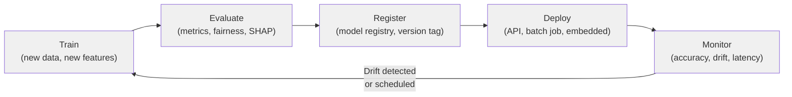
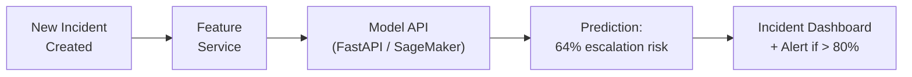
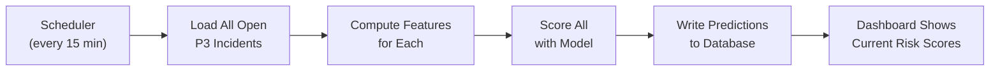
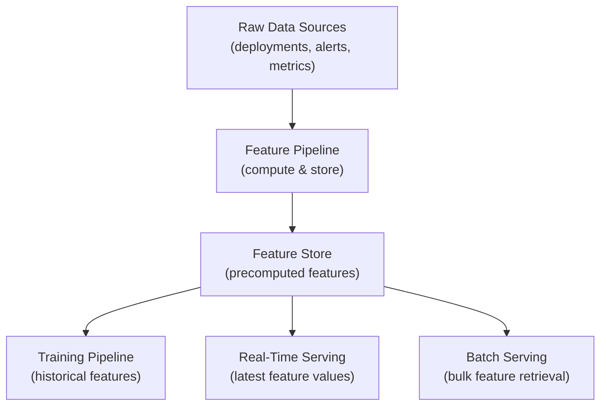
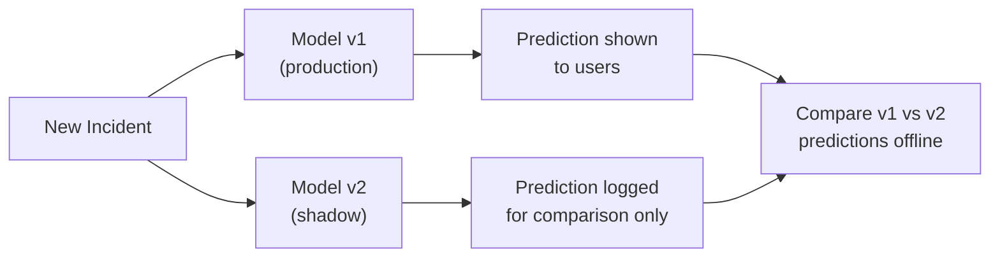
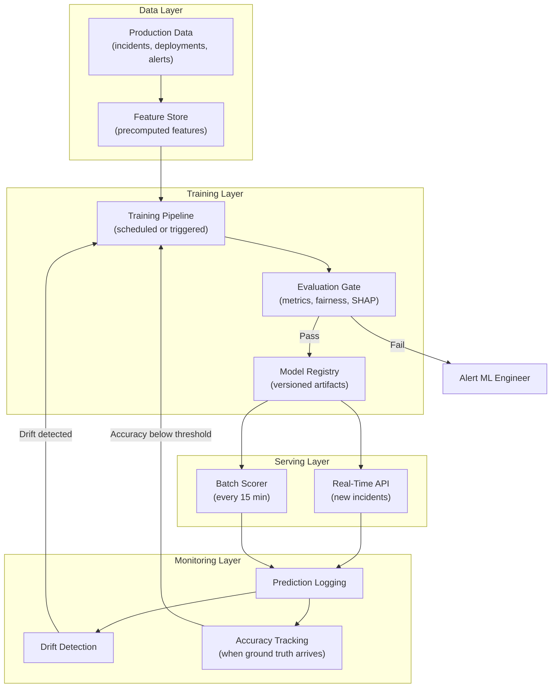

# Machine Learning Fundamentals — Production Patterns

**How ML models actually run in production — not in notebooks.**

---

## The Gap Between Notebook and Production

A model that achieves 83% recall in a notebook is a proof of concept. A model that achieves 83% recall at 2 AM on a Saturday with 200 concurrent requests while the data pipeline is 15 minutes late — that is a production system.

In the Production Diagnostic System, the incident escalation model must:
- Score every new P3 incident within seconds of creation
- Use features that require real-time computation (error rate trend, alert count in the last hour)
- Retrain periodically as the production environment evolves
- Degrade gracefully when a data source is unavailable
- Be replaceable without downtime when a better model is ready

This chapter covers how those requirements are met.

---

## The MLOps Lifecycle — Train, Evaluate, Deploy, Monitor, Retrain

MLOps (Machine Learning Operations, pronounced "M-L-ops") is the discipline of running ML in production. It is to ML what DevOps is to software: the practices, tools, and culture that turn experiments into reliable systems.

| Stage | What Happens | Who Is Responsible | What Can Go Wrong |
|:---|:---|:---|:---|
| **Train** | New model trained on updated data | ML pipeline (automated) or ML engineer (manual) | Stale data, broken features, training on corrupted data |
| **Evaluate** | Model tested against holdout set, compared to current production model | Automated gate with human review for major changes | New model passes metrics but fails on a specific subgroup |
| **Register** | Model artifact stored with version, metadata, metrics | Model registry (MLflow, SageMaker, Vertex AI) | Deploying an unregistered model — no audit trail |
| **Deploy** | Model served via API, batch job, or embedded in pipeline | ML platform / infrastructure team | Wrong model version deployed, missing dependencies |
| **Monitor** | Predictions tracked, drift detected, alerts configured | Observability platform + ML engineer on-call | Silent degradation — model gets worse but nobody notices |
| **Retrain** | Triggered by schedule, drift detection, or new data source | Automated pipeline or manual decision | Retraining too often (waste) or too rarely (stale model) |

---

## Training Pipeline Patterns

### Scheduled Retraining

The simplest pattern. Retrain on a fixed cadence — weekly, biweekly, monthly.

| Aspect | Detail |
|:---|:---|
| **When to use** | Data changes slowly, performance degrades gradually |
| **How it works** | Cron job triggers training pipeline on schedule. New model evaluated against current production model. If it passes, promoted. If not, alert. |
| **Production Diagnostic System** | Retrain monthly. Production incident patterns shift seasonally (holiday freezes, end-of-quarter pushes) but not daily. |
| **Risk** | If data shifts suddenly (major architecture change, new service onboarded), the monthly retrain is too slow |

### Triggered Retraining

Retrain when something measurable changes — data drift exceeds a threshold, accuracy drops below a floor, or a significant new data source becomes available.

| Aspect | Detail |
|:---|:---|
| **When to use** | Data can shift unpredictably, and you have monitoring in place to detect it |
| **How it works** | Monitoring system detects drift or accuracy drop. Triggers retraining pipeline. New model evaluated automatically. Human approves promotion. |
| **Production Diagnostic System** | If the distribution of `deployments_last_24h` shifts by more than 2 standard deviations (the team adopted continuous deployment), trigger retrain. |
| **Risk** | Requires robust monitoring infrastructure. Without it, the trigger never fires. |

### Continuous Learning

The model updates incrementally with every new data point. Not a full retrain — a weight update.

| Aspect | Detail |
|:---|:---|
| **When to use** | High-velocity data, rapid concept drift (fraud detection, recommendation systems) |
| **How it works** | Each new labeled example updates the model parameters. Common with online learning algorithms. |
| **Production Diagnostic System** | Not appropriate here. Incident patterns are stable enough for batch retraining. Continuous learning adds complexity without proportional benefit. |
| **Risk** | Susceptible to noisy labels and adversarial data. A burst of mislabeled examples can degrade the model within hours. |

---

## Serving Patterns — How Predictions Reach the User

### Real-Time Serving (API)

The model sits behind an HTTP endpoint. A request comes in, features are computed, prediction is returned.

| Aspect | Detail |
|:---|:---|
| **Latency** | Must be fast — typically under 100ms end-to-end |
| **When to use** | Decision must happen immediately (incident triage, fraud detection, search ranking) |
| **Production Diagnostic System** | When a new P3 incident is created, the API scores it within 50ms. If escalation probability exceeds 80%, an alert fires immediately. |
| **Scaling** | Horizontal — add more API instances behind a load balancer |
| **Failure mode** | If the API is down, incidents are created without predictions. The system must handle this gracefully (queue and backfill, or fall back to rules). |

### Batch Serving (Scheduled Predictions)

Predictions are computed on a schedule — every 15 minutes, hourly, daily — and written to a database or dashboard.

| Aspect | Detail |
|:---|:---|
| **Latency** | Not critical — minutes to hours is acceptable |
| **When to use** | Predictions are consumed asynchronously (reports, dashboards, overnight processing) |
| **Production Diagnostic System** | Every 15 minutes, re-score all open P3 incidents. The dashboard shows a ranked list: "These 5 incidents are most likely to escalate in the next 4 hours." |
| **Scaling** | Vertical or distributed — process in parallel batches |
| **Failure mode** | If a batch run fails, the dashboard shows stale predictions. Must alert on stale data. |

### Embedded Serving (In the Data Pipeline)

The model is called as a step within an ETL (Extract, Transform, Load) or streaming pipeline. No separate API — the prediction is computed inline.

| Aspect | Detail |
|:---|:---|
| **Latency** | Depends on the pipeline — seconds for streaming, hours for batch ETL |
| **When to use** | The prediction is a transformation step, not a user-facing response |
| **Example** | A data pipeline that enriches every incident record with an `escalation_risk` column before writing to the data warehouse |
| **Scaling** | Scales with the pipeline infrastructure (Spark, Flink, Dataflow) |

### Choosing the Right Serving Pattern

| Factor | Real-Time (API) | Batch (Scheduled) | Embedded (Pipeline) |
|:---|:---|:---|:---|
| **Decision speed needed** | Immediate (milliseconds) | Periodic (minutes to hours) | At data processing time |
| **Infrastructure complexity** | High (API, load balancer, feature service) | Low (cron job + database) | Medium (integrated into existing pipeline) |
| **Cost** | Higher (always-on compute) | Lower (compute only during batch window) | Shared with pipeline cost |
| **Debugging** | Request logs per prediction | Batch output table to inspect | Pipeline logs |

---

## Feature Stores — Compute Once, Serve Everywhere

The incident escalation model needs `deployments_last_24h` as a feature. Computing this at prediction time means querying the deployment database, filtering by service and time window, counting rows — for every single prediction.

A **feature store** precomputes and stores features so they can be:
- Served with low latency for real-time predictions
- Joined into batch prediction jobs
- Reused across multiple models (the escalation model and the root cause classifier both need `deployments_last_24h`)
- Guaranteed to be consistent between training and serving (the same feature computation logic)

| Without Feature Store | With Feature Store |
|:---|:---|
| Training computes features one way, serving computes them differently | Same computation code, same results — training/serving skew eliminated |
| Every model re-implements feature logic | Features shared across models |
| Real-time features require ad-hoc database queries | Features precomputed and cached, served in milliseconds |
| No visibility into feature freshness | Feature store tracks when each feature was last updated |

**Common feature store tools:** Feast (open source, pronounced "feast"), Tecton, SageMaker Feature Store, Vertex AI Feature Store.

---

## A/B Testing — Safely Comparing Models

A new model (v2) achieves better metrics on holdout data. That does not guarantee it performs better in production. A/B testing provides the proof.

| Concept | Detail |
|:---|:---|
| **What it is** | Split production traffic: 90% to the current model (control), 10% to the new model (treatment) |
| **What to measure** | The business metric that matters — not just model recall, but "did the escalation prediction change the response time?" |
| **How long to run** | Until statistically significant — typically 2-4 weeks depending on traffic volume |
| **Production Diagnostic System** | Model v1 flags escalation risks. Model v2 (with new features) is served to 10% of incidents. After 3 weeks, compare: "For flagged incidents, did v2 reduce mean time to acknowledge (MTTA)?" |

### Shadow Mode — Test Without Risk

Before A/B testing, run the new model in **shadow mode**: it scores every incident but its predictions are not shown to users. Both models score the same incidents, and the predictions are compared offline.

Shadow mode answers: "Would the new model have made different predictions? Better ones?" — without any risk to production.

---

## The Full MLOps Pipeline — End to End

---

## Production Anti-Patterns — What Goes Wrong

| Anti-Pattern | What It Looks Like | Consequence | Fix |
|:---|:---|:---|:---|
| **Notebook-to-production copy-paste** | Model code copied from Jupyter into a Flask app with minimal changes | Untestable, unreproducible, breaks on edge cases | Build a proper training pipeline with versioned code and automated evaluation |
| **Training/serving skew** | Features computed differently during training vs serving | Model performs well in evaluation but poorly in production — the features it sees are different | Use a feature store or shared feature computation module |
| **No model registry** | Models deployed by copying files to a server | Cannot roll back, no audit trail, "which model is running?" becomes a mystery | Use MLflow Model Registry, SageMaker, or Vertex AI |
| **Retraining without evaluation** | Automated pipeline retrains and deploys without checking if the new model is better | A bad training run (corrupted data, broken feature) deploys a worse model | Always gate deployment on automated evaluation against the current production model |
| **Monitoring only latency, not accuracy** | API responds in 20ms — must be working fine | The model's predictions are wrong but fast. Nobody notices until business metrics drop weeks later. | Monitor prediction distribution and accuracy (when ground truth is available) |

---

## Quick Links

| Chapter | Title |
|:---|:---|
| [01](01_Why.md) | Why This Matters |
| [02](02_Concepts.md) | Concepts and Mental Models |
| [03](03_Hello_World.md) | Hello World |
| [04](04_How_It_Works.md) | How It Works |
| [05](05_Building_It.md) | Building It |
| **[06](06_Production_Patterns.md)** | **Production Patterns** (this chapter) |
| [07](07_System_Design.md) | System Design |
| [08](08_Quality_Security_Governance.md) | Quality, Security, Governance |
| [09](09_Observability_Troubleshooting.md) | Observability and Troubleshooting |
| [10](10_Decision_Guide.md) | Decision Guide |

---

**Hands-on notebook:** [ML Fundamentals on Colab](https://colab.research.google.com/github/sunilmogadati/systems-in-production/blob/main/implementation/notebooks/ML_Fundamentals.ipynb) — the pipeline that produces the model this chapter deploys.

**Architecture reference:** [Production Diagnostics Architecture](../../systems/production-diagnostics/architecture.md) — the system these patterns serve.

**Next:** [07 — System Design](07_System_Design.md) — The 10-step framework for designing an ML system from requirements to iteration.
