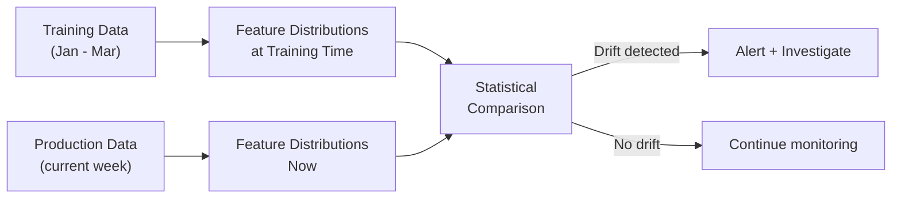
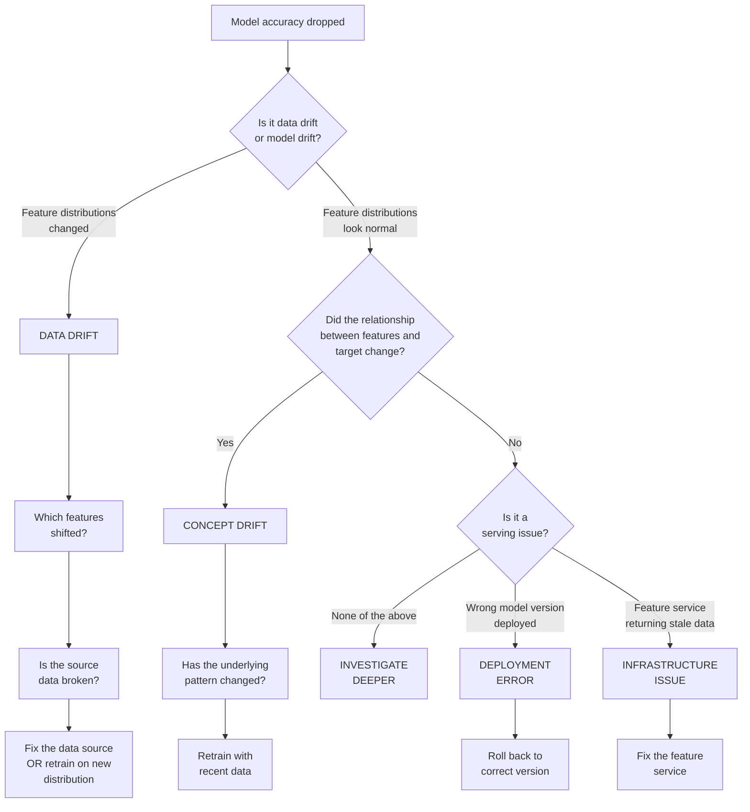
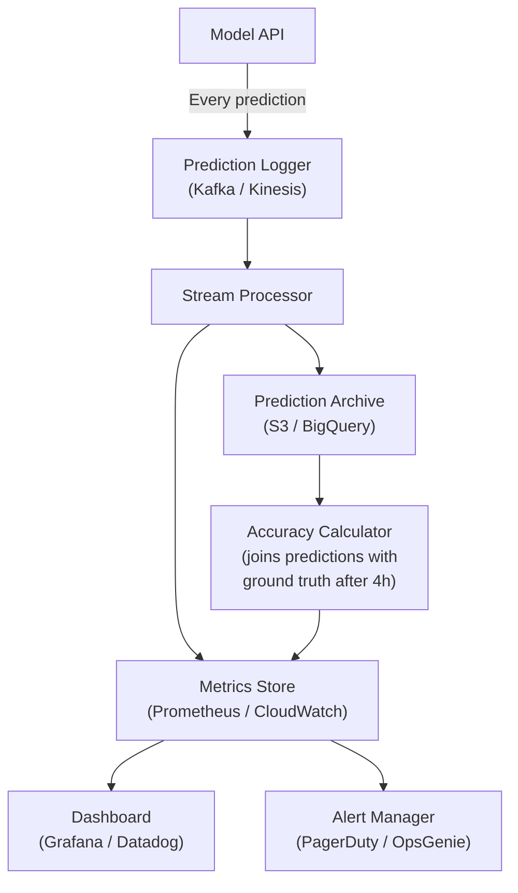

# Machine Learning Fundamentals — Observability and Troubleshooting

**What to monitor in production ML, how to debug accuracy drops, and when to retrain.**

---

## The Silent Failure Problem

Software systems fail loudly. A crashed server returns HTTP 500. A broken database query throws an exception. An OOM (Out of Memory) error kills the process. Alerts fire. Engineers respond.

ML systems fail silently. The model keeps serving predictions. The API returns 200 OK. Latency is normal. But the predictions are wrong — and nobody knows until a business metric drops weeks later.

In the Production Diagnostic System, the incident escalation model could degrade from 83% recall to 55% recall over 6 weeks. During that time, it misses dozens of escalations. On-call engineers lose trust in the system and start ignoring its predictions entirely. By the time someone investigates, the damage is done — not from a crash, but from a model that was confidently wrong.

ML observability exists to catch this failure mode before it reaches the business.

---

## What to Monitor — Five Dimensions

### 1. Prediction Distribution

**What:** Track the distribution of predictions over time. Is the model still predicting the same proportions?

| Signal | What It Means | Alert Threshold |
|:---|:---|:---|
| Percentage of high-risk predictions (>80%) rises from 10% to 30% | The model is flagging everything — either the world changed or the model is broken | >2x baseline rate sustained for 24 hours |
| Percentage drops to near 0% | The model stopped flagging anything — possibly a broken feature or a model that collapsed to the majority class | <2% high-risk predictions sustained for 24 hours |
| Distribution shape changes (bimodal becomes uniform) | The model's internal confidence pattern has shifted | KL divergence (Kullback-Leibler divergence) > 0.1 from training distribution |

**Production Diagnostic System example:** The model normally flags ~10% of P3 incidents as high escalation risk. One Monday, it flags 35%. Investigation reveals: a new service was onboarded over the weekend with incomplete monitoring data. The feature `error_rate_trend` is null for all its incidents. The imputation strategy fills nulls with the training median — which happens to be a high value. The model interprets this as "rising error rate" and flags everything.

### 2. Feature Drift

**What:** Compare the distribution of input features in production to what the model saw during training.



| Feature | Training Mean | Production Mean (this week) | Drift? | Cause |
|:---|:---|:---|:---|:---|
| `deployments_last_24h` | 1.8 | 7.2 | Yes — 4x increase | Team adopted continuous deployment |
| `related_alert_count` | 3.1 | 3.4 | No | Normal variation |
| `error_rate_trend` | 0.02 | 0.01 | No | Normal variation |
| `hour_of_day` | Uniform | Clustered at 2-5 AM | Yes | New automated job creating incidents at night |

**Why this matters:** The model was trained on a world where services deployed ~2 times per day. In the current world, they deploy ~7 times. The model has never seen this range of `deployments_last_24h` values. Its predictions in this region are extrapolation, not interpolation — unreliable.

### 3. Accuracy Drift

**What:** Compare model predictions to actual outcomes (ground truth). In the Production Diagnostic System, ground truth arrives after 4 hours — did the incident actually escalate?

| Metric | Training Evaluation | Last 7 Days | Trend | Action |
|:---|:---|:---|:---|:---|
| Recall | 83% | 78% | Declining 1-2 points per week | Monitor — approaching 75% threshold |
| Precision | 45% | 41% | Stable | No action |
| F1 | 58% | 54% | Declining | Correlates with recall decline |

**The challenge:** Ground truth is delayed. For the escalation model, the label ("did it escalate?") is only known 4 hours after prediction. For some ML systems, ground truth takes days (did the customer churn this month?) or never arrives (did the recommended product match the user's intent?).

| Ground Truth Availability | Strategy |
|:---|:---|
| **Immediate** (fraud detection — was the transaction reversed?) | Track accuracy in real time |
| **Delayed** (escalation — known after 4 hours) | Track accuracy with a lag. Monitor proxy metrics in the meantime (prediction distribution, feature drift). |
| **Very delayed** (churn — known after 30 days) | Rely heavily on prediction distribution and feature drift monitoring. Validate accuracy monthly. |
| **Never available** (recommendation — did the user like it?) | Use proxy metrics: click-through rate, engagement time, conversion rate |

### 4. Latency

**What:** How long does each prediction take, end to end?

| Measurement | What It Includes | Target |
|:---|:---|:---|
| **Feature retrieval** | Time to fetch precomputed features from the feature store | < 50ms |
| **Model inference** | Time for the model to compute a prediction from features | < 10ms (tree-based models) |
| **End-to-end** | Feature retrieval + inference + serialization + network | < 200ms |
| **P99 (99th percentile)** | The slowest 1% of requests | < 500ms |

**Why P99 matters more than average:** Average latency of 30ms looks fine. But if P99 is 2 seconds, 1% of predictions take 2 seconds — and those are often the predictions that matter most (complex incidents with many features, high alert counts, multiple data source lookups).

### 5. Cost

**What:** How much does each prediction cost to compute and serve?

| Cost Component | Measurement | Optimization |
|:---|:---|:---|
| **Compute** | CPU/memory per prediction | Right-size containers. A tree-based model on tabular data does not need a GPU instance. |
| **Feature store queries** | Cost per feature retrieval | Cache frequently accessed features. Batch retrievals where possible. |
| **Storage** | Prediction logs, model artifacts, training data | Set retention policies. Do not store raw features in prediction logs if they can be reconstructed. |
| **Retraining** | Cost per training run | Monthly retraining on 12K rows costs pennies. Daily retraining of a large model on millions of rows costs real money. Right-size the cadence. |

---

## The Drill-Down Debugging Method

When model performance drops, follow this decision tree to isolate the cause:



### Debugging Example: Recall Dropped from 83% to 71%

**Step 1: Is it data drift?**

Check feature distributions against training baselines.

Finding: `deployments_last_24h` shifted from mean 1.8 to mean 7.2. The team adopted continuous deployment 3 weeks ago.

**Step 2: Which predictions are wrong?**

Filter to false negatives (incidents that escalated but the model said they would not).

Finding: 80% of missed escalations are from services with `deployments_last_24h` > 5. The model was trained in a world where >5 deployments per day was rare and did not meaningfully correlate with escalation. Now, high deployment counts are normal and the correlation has changed.

**Step 3: Use SHAP to understand why the model is wrong.**

```python
# Pseudocode — SHAP debugging on false negatives

false_negatives = test_data[(predicted == 0) & (actual == 1)]
explainer = shap.TreeExplainer(model)
shap_values = explainer.shap_values(false_negatives)

# Which features are pushing the prediction DOWN (toward "no escalation")
# when the incident actually escalated?
shap.summary_plot(shap_values, false_negatives, feature_names=feature_names)
```

Finding: SHAP shows that `deployments_last_24h` is the strongest negative contributor for false negatives. The model learned "high deployment count = rare event = not correlated with escalation." In the new world, high deployment count is normal and the model's learned relationship is stale.

**Step 4: Fix.**

Retrain the model on the last 3 months of data, which includes the period after continuous deployment adoption. The new model sees the updated relationship and recall returns to 82%.

---

## SHAP for Production Debugging

SHAP (SHapley Additive exPlanations) is not just for explaining predictions to stakeholders. It is a debugging tool:

| Debugging Use Case | How SHAP Helps |
|:---|:---|
| **Model accuracy dropped** | Compare SHAP values on correct vs incorrect predictions. Which features are driving the errors? |
| **New feature added but accuracy did not improve** | Check SHAP importance for the new feature. If SHAP values are near zero, the feature carries no signal. |
| **Model behaves differently for one subgroup** | Compute SHAP values per subgroup. Different feature importance patterns reveal why the model treats subgroups differently. |
| **Stakeholder does not trust the model** | Show SHAP for cases the stakeholder knows well. If SHAP explanations match domain intuition, trust increases. If they do not, the model may be wrong. |

---

## When to Retrain

| Trigger | How to Detect | Response |
|:---|:---|:---|
| **Scheduled** | Calendar — monthly, biweekly | Retrain on the latest data window. Compare to production model. Promote if better. |
| **Accuracy below threshold** | Accuracy monitoring — recall drops below 75% | Immediate retrain. Investigate root cause. |
| **Feature drift above threshold** | Feature monitoring — KL divergence > 0.1 on any feature | Retrain. If drift is caused by a data source change, also fix the feature pipeline. |
| **Major event** | New service onboarded, architecture change, team restructure | Proactive retrain — the incident landscape has changed and the model's training data no longer represents the current state. |
| **Post-incident finding** | A P1 escalation was missed. Investigation reveals the model was wrong because of a specific feature gap. | Add the missing feature, retrain, evaluate. |

### Retraining Anti-Patterns

| Anti-Pattern | Why It Fails |
|:---|:---|
| **Retrain daily "just in case"** | Adds cost and complexity without proportional benefit. If the data changes slowly, daily retraining produces nearly identical models. |
| **Never retrain** | The world changes. A model trained 12 months ago reflects a 12-month-old reality. |
| **Retrain without evaluation** | Automated retraining that promotes without checking can deploy a worse model if the training data was corrupted or a feature pipeline broke. |
| **Retrain on all historical data** | Includes stale patterns. A model trained on 3 years of data weights historical patterns equally with current ones. Use a rolling window (e.g., 6 months). |

---

## The ML Observability Dashboard

What to show, and what to alert on:

| Panel | Metric | Visualization | Alert |
|:---|:---|:---|:---|
| **Prediction Volume** | Predictions per hour | Time series line | Volume drops to zero (model is down) or spikes 5x (anomalous input) |
| **Prediction Distribution** | % flagged as high-risk | Histogram + time series | >2x or <0.5x baseline rate |
| **Recall (lagged)** | 7-day rolling recall | Line chart with threshold marker | Recall < 75% |
| **Feature Drift** | KL divergence per feature | Heatmap (features x days) | Any feature > 0.1 |
| **Latency** | P50, P95, P99 response time | Time series with percentile bands | P99 > 500ms |
| **Error Rate** | HTTP 5xx rate | Time series | > 1% |
| **Model Version** | Which version is serving | Status badge | Changed unexpectedly |

### The Observability Pipeline



**How it works:**
1. Every prediction is logged (input features, output probability, model version, timestamp)
2. A stream processor computes real-time metrics (volume, distribution, latency)
3. A batch job joins predictions with ground truth (4 hours later for escalation) to compute accuracy
4. Dashboard shows all five dimensions. Alerts fire when thresholds are breached.
5. The prediction archive enables retrospective analysis: "What happened last Tuesday at 3 AM?"

---

## Quick Links

| Chapter | Title |
|:---|:---|
| [01](01_Why.md) | Why This Matters |
| [02](02_Concepts.md) | Concepts and Mental Models |
| [03](03_Hello_World.md) | Hello World |
| [04](04_How_It_Works.md) | How It Works |
| [05](05_Building_It.md) | Building It |
| [06](06_Production_Patterns.md) | Production Patterns |
| [07](07_System_Design.md) | System Design |
| [08](08_Quality_Security_Governance.md) | Quality, Security, Governance |
| **[09](09_Observability_Troubleshooting.md)** | **Observability and Troubleshooting** (this chapter) |
| [10](10_Decision_Guide.md) | Decision Guide |

---

**Hands-on notebook:** [ML Fundamentals on Colab](https://colab.research.google.com/github/sunilmogadati/systems-in-production/blob/main/implementation/notebooks/ML_Fundamentals.ipynb) — SHAP explanations and model evaluation that form the basis of production debugging.

**Architecture reference:** [Production Diagnostics Architecture](../../systems/production-diagnostics/architecture.md) — the system this observability layer monitors.

**Next:** [10 — Decision Guide](10_Decision_Guide.md) — Quick-reference cards for every decision: Do I need ML? Which algorithm? Which metric? Is the model production-ready?
