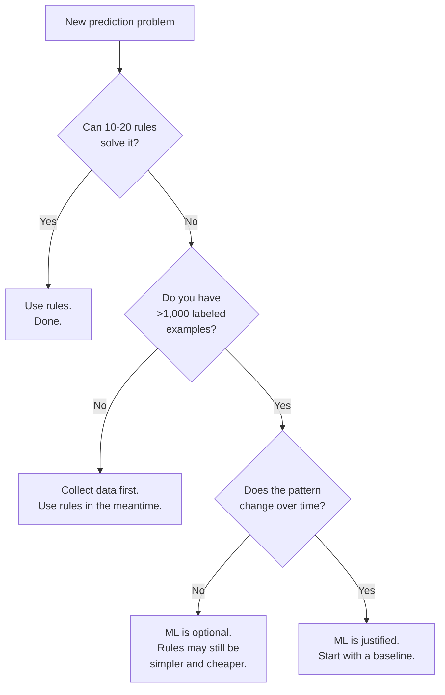
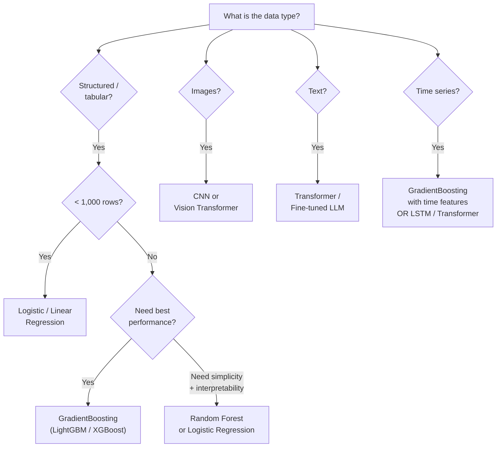
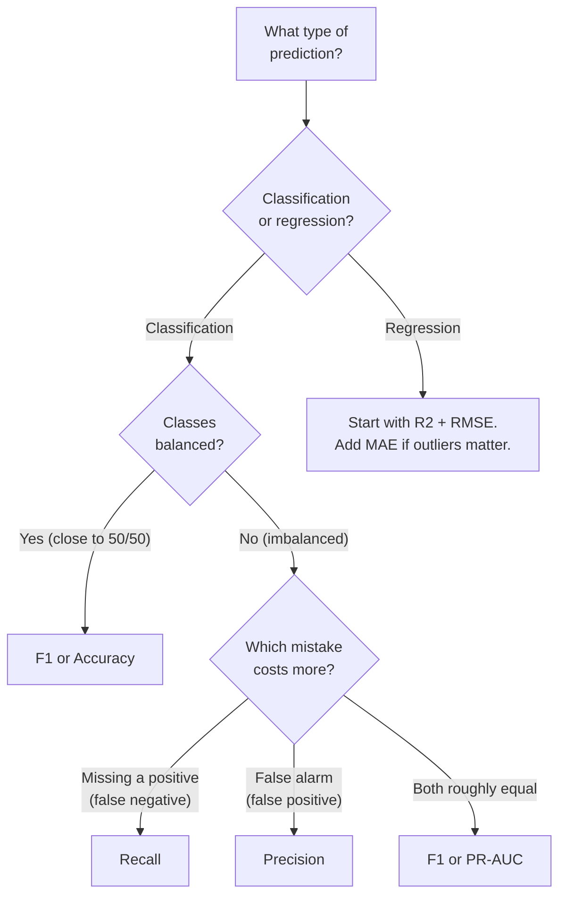

# Machine Learning Fundamentals — Decision Guide

**Quick-reference cards for every ML decision. Print this. Bookmark this. Use this before every project.**

---

## Decision 1: Do I Need ML?

Not every problem needs ML. Rules are cheaper, faster, more interpretable, and easier to maintain. ML is justified when rules break down.

| Signal | Use Rules | Use ML |
|:---|:---|:---|
| **Pattern complexity** | Simple, can be expressed in 10-20 if/else statements | Complex, non-linear, involves interactions between many variables |
| **Pattern stability** | Pattern does not change over time | Pattern shifts — what predicted escalation last quarter may not predict it this quarter |
| **Maintainability** | Rules are manageable — a human can audit the full ruleset | Rules have grown to hundreds or thousands, nobody fully understands them, they contradict each other |
| **Data availability** | Small dataset (<500 rows) or no labeled data | Thousands of labeled examples available |
| **Decision speed** | Deterministic answer needed (compliance, safety-critical) | Probabilistic answer acceptable (ranking, recommendation, triage) |
| **Explainability** | Must explain exact reasoning step by step | "These features contributed most" is sufficient explanation |

### The Decision Flow

**Production Diagnostic System example:** Could rules predict incident escalation?

A first attempt: "If error rate > 5% AND deployment in last 2 hours AND off-hours, then flag as high risk." This catches some escalations. But it misses the interaction effects — a rising error TREND is more predictive than a threshold. The number of related alerts matters, but only in combination with service tier. After writing 40+ rules with diminishing returns, ML is justified.

---

## Decision 2: Algorithm Selection Guide

| Algorithm | Best For | Data Size | Interpretability | Speed | When to Choose |
|:---|:---|:---|:---|:---|:---|
| **Linear Regression** | Predicting a continuous number | Any | High — coefficients show feature impact directly | Very fast | Baseline for regression. Use when relationships are roughly linear. |
| **Logistic Regression** | Binary classification | Any | High — coefficients show feature impact directly | Very fast | Baseline for classification. Always start here. |
| **Ridge / Lasso** | Linear models with regularization | Any | High | Very fast | When Logistic/Linear Regression overfits or when feature selection is needed (Lasso) |
| **Random Forest** | Mixed feature types, non-linear relationships | Medium to large | Medium — feature importance available, individual trees are interpretable | Fast (training), fast (inference) | Good default when the baseline is not enough. Robust to outliers and missing values. |
| **GradientBoosting (XGBoost / LightGBM)** | Tabular data — classification or regression | Medium to large | Medium — SHAP provides per-prediction explanations | Fast (inference), moderate (training) | Best tabular performance in most benchmarks. The go-to for production systems on structured data. |
| **Neural Network (MLP)** | Tabular data with very large datasets | Large (>100K rows) | Low — requires SHAP or LIME for explanation | Slower (training), fast (inference) | Only when tree-based models plateau AND you have enough data to justify the complexity |
| **CNN (Convolutional Neural Network)** | Images, spatial data | Large + image data | Low | Slow (training), moderate (inference) | Image classification, object detection, medical imaging |
| **Transformer / LLM (Large Language Model)** | Text, sequence data | Very large | Low | Slow | NLP (Natural Language Processing), text classification, generation, summarization |

### The Algorithm Decision Tree

---

## Decision 3: Metric Selection Guide

| Metric | When to Use | Business Example | Plain English |
|:---|:---|:---|:---|
| **Accuracy** | Balanced classes (close to 50/50) AND both error types cost about the same | Classifying support tickets as "billing" vs "technical" — misclassifying either way has similar cost | "How often is the model right overall?" |
| **Precision** | False positives are expensive or dangerous | Spam filter — sending a real customer email to spam loses business | "Of the items flagged, how many are actually positive?" |
| **Recall** | False negatives are expensive or dangerous | Cancer screening, fraud detection, incident escalation prediction | "Of all the real positives, how many did the model catch?" |
| **F1** | Both false positives and false negatives are roughly equally costly | Hiring model — rejecting a good candidate and accepting a bad one both have consequences | "Balanced score between precision and recall" |
| **ROC-AUC (Receiver Operating Characteristic — Area Under Curve)** | Comparing models across all thresholds; balanced or moderately imbalanced classes | Choosing between Model A and Model B — which one separates classes better? | "Does the model rank positives higher than negatives?" |
| **PR-AUC (Precision-Recall AUC)** | Heavily imbalanced classes (>95% one class) where ROC-AUC can be misleading | Rare event detection — only 1% of incidents escalate | "How well does the model find the rare positive class?" |
| **R-squared (R2)** | Regression — predicting a continuous number | House prices, revenue forecasting, latency prediction | "What percentage of the variation does the model explain?" |
| **RMSE (Root Mean Squared Error)** | Regression — need error in the same units as the target | House price prediction — RMSE of $50K means "off by about $50K on average" | "Average prediction error, sensitive to large mistakes" |
| **MAE (Mean Absolute Error)** | Regression — want robustness to outliers | Delivery time prediction — one extreme outlier should not dominate the metric | "Average prediction error, not sensitive to outliers" |

### The Metric Decision Flow

---

## Decision 4: Feature Engineering Checklist

Run through this checklist for every ML project:

| Category | Check | Done? |
|:---|:---|:---|
| **Temporal** | Extract: hour of day, day of week, is weekend, is holiday, month, quarter | |
| **Aggregations** | Counts, sums, averages over time windows (last hour, last day, last week) | |
| **Trends** | Slopes, rates of change over sliding windows | |
| **Categoricals** | One-hot encode or label encode categorical features | |
| **Missing values** | Strategy decided per feature: impute, flag, drop, or fail | |
| **Scaling** | Numeric features scaled (StandardScaler or MinMaxScaler) if using linear models or distance-based algorithms | |
| **Derived** | Domain-specific combinations: ratios, differences, interactions | |
| **Text** | Length, keyword flags, TF-IDF (Term Frequency-Inverse Document Frequency) or embeddings if text features exist | |
| **Leakage check** | Every feature is available at prediction time. No future information. | |
| **Correlation check** | Identify highly correlated features (>0.95). Remove or combine to reduce redundancy. | |

---

## Decision 5: Production Readiness Checklist

Before deploying any model to production:

| Category | Requirement | Pass/Fail |
|:---|:---|:---|
| **Performance** | Primary metric (recall, precision, F1, R2) meets the threshold defined in the Architect Checklist | |
| **Performance** | Train-test gap is <10% (no severe overfitting) | |
| **Performance** | Cross-validation scores are stable (low standard deviation across folds) | |
| **Performance** | Holdout set results are within 3 points of development results | |
| **Subgroups** | Performance checked per relevant subgroup (service tier, region, time of day). No subgroup below minimum threshold. | |
| **Explainability** | SHAP summary plot reviewed — top features make domain sense | |
| **Explainability** | SHAP reviewed for 10+ individual predictions — explanations are coherent | |
| **Experiment tracking** | Training run logged in MLflow (parameters, metrics, artifacts, code version) | |
| **Model card** | Completed: purpose, training data, performance, limitations, intended use, out-of-scope use | |
| **Serving** | API endpoint tested: correct input/output format, handles edge cases (missing features, out-of-range values) | |
| **Serving** | Latency meets requirement (P99 under threshold) | |
| **Serving** | Fallback behavior defined: what happens when the model API is unavailable? | |
| **Monitoring** | Prediction logging enabled | |
| **Monitoring** | Drift detection configured (feature distribution + prediction distribution) | |
| **Monitoring** | Accuracy tracking configured (with ground truth join when available) | |
| **Monitoring** | Alerts configured: accuracy drop, drift, latency spike, error rate | |
| **Governance** | Model registered in model registry with version tag | |
| **Governance** | Approval workflow completed (automated gate + human review) | |
| **Governance** | Rollback plan documented: how to revert to the previous model version | |

---

## Decision 6: The 10-Step System Design Framework — Quick Reference

For full application, see [07 — System Design](07_System_Design.md).

| Step | Key Question | Common Mistake |
|:---|:---|:---|
| **1. Requirements** | What is the latency, throughput, and accuracy target? What is the cost of being wrong? | Jumping to model selection without clarifying requirements |
| **2. Data Pipeline** | Where does the data come from? How fresh? How reliable? | Assuming data is clean and available. It never is. |
| **3. Feature Engineering** | What features capture the signal? Are they available at prediction time? | Using raw data without transformation. Including future information (leakage). |
| **4. Model Selection** | Which algorithm fits the data type, size, and interpretability needs? | Choosing the most complex model first instead of starting with a baseline |
| **5. Training Infrastructure** | CPU or GPU? Single machine or distributed? How often retrain? | Over-provisioning — using GPUs for a 10,000-row tabular problem |
| **6. Serving Infrastructure** | Real-time API, batch, or embedded? What is the fallback? | No fallback — model API goes down, entire system fails |
| **7. Monitoring** | What metrics to track? What alerts to set? | Monitoring latency but not accuracy. The model serves fast but wrong. |
| **8. Scaling** | What is the bottleneck as volume grows? | Premature optimization — scaling before there is a scaling problem |
| **9. Governance** | Who approves model changes? How to audit? How to roll back? | No model registry — "which model is running?" becomes a mystery |
| **10. Iteration** | How does the system improve over time? What triggers retraining? | Ship and forget — no plan for the model to evolve with the data |

---

## Quick Reference — All Decision Tables on One Page

### Do I Need ML?
Rules first. ML when rules fail, data is plentiful, and patterns shift.

### Which Algorithm?
Tabular data: Logistic Regression (baseline) then GradientBoosting (production). Images: CNN. Text: Transformer. Start simple.

### Which Metric?
Ask: "What is the cost of a false positive vs a false negative?" If FN is 10x worse, optimize recall. If FP is 10x worse, optimize precision. Roughly equal: F1.

### Am I Ready for Production?
Model passes metrics. Subgroups checked. SHAP makes sense. Experiment tracked. Monitoring configured. Rollback planned.

---

## Quick Links

| Chapter | Title |
|:---|:---|
| [01](01_Why.md) | Why This Matters |
| [02](02_Concepts.md) | Concepts and Mental Models |
| [03](03_Hello_World.md) | Hello World |
| [04](04_How_It_Works.md) | How It Works |
| [05](05_Building_It.md) | Building It |
| [06](06_Production_Patterns.md) | Production Patterns |
| [07](07_System_Design.md) | System Design |
| [08](08_Quality_Security_Governance.md) | Quality, Security, Governance |
| [09](09_Observability_Troubleshooting.md) | Observability and Troubleshooting |
| **[10](10_Decision_Guide.md)** | **Decision Guide** (this chapter) |

---

**Hands-on notebook:** [ML Fundamentals on Colab](https://colab.research.google.com/github/sunilmogadati/systems-in-production/blob/main/implementation/notebooks/ML_Fundamentals.ipynb) — the executable pipeline that these decision guides reference.

**Architecture reference:** [Production Diagnostics Architecture](../../systems/production-diagnostics/architecture.md) — the system these decisions were applied to.

**Back to start:** [01 — Why This Matters](01_Why.md) — the story that frames everything.
