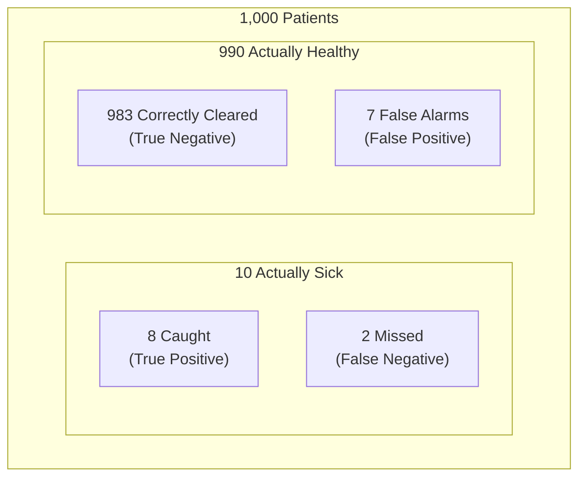
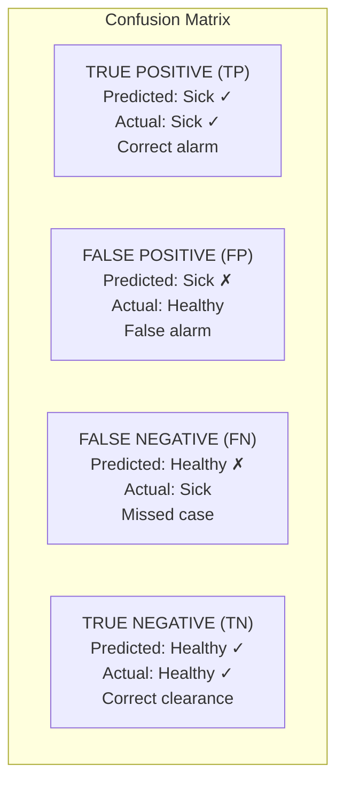
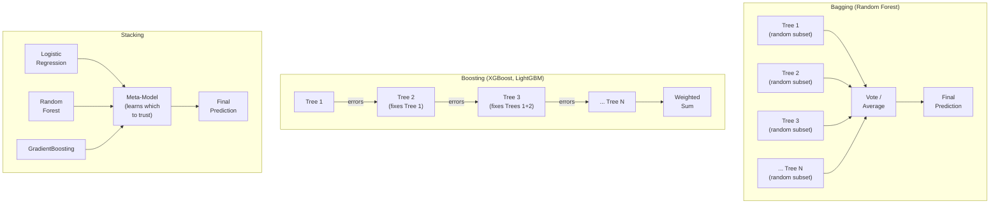

# Machine Learning Fundamentals — How It Works

**Evaluation metrics, confusion matrices, and choosing the right measure for the right problem.**

---

## Why Accuracy Lies

A bank builds a model to predict loan defaults. The dataset: 10,000 loans, 9,500 repaid, 500 defaulted. The model predicts "repaid" for every single loan. Accuracy: 95%.

The model is useless. It caught zero defaults. It is a rubber stamp that says "approved" to everyone. The 95% accuracy is a statistical illusion created by **class imbalance** — when one class (repaid) vastly outnumbers the other (defaulted).

This is not a hypothetical. This is the most common mistake in production ML. A system gets deployed because "95% accurate" sounds impressive. Nobody checks what that number actually means until business metrics tell a different story — months later.

The solution: use metrics that ask the right questions.

---

## The Four Metrics — Through One Scenario

**Scenario:** A hospital screens 1,000 patients for a disease. 10 patients actually have it. 990 are healthy.

The screening test flags 15 patients as positive. Of those 15: 8 actually have the disease. 7 are false alarms. And 2 patients who have the disease were missed — the test said they were healthy.



### Accuracy — "How often is the test right overall?"

```
Accuracy = (8 + 983) / 1000 = 99.1%
```

Sounds excellent. But this number hides the 2 missed patients. If the test said "healthy" to everyone, accuracy would still be 99.0%. Accuracy is dominated by the majority class (healthy patients).

### Precision — "Of those flagged positive, how many actually have it?"

```
Precision = 8 / (8 + 7) = 8/15 = 53%
```

Of the 15 flagged patients, only 8 actually have the disease. The other 7 get scared, undergo unnecessary follow-up tests, and incur costs. Precision answers: **how trustworthy are the alarms?**

### Recall — "Of those who actually have it, how many did we catch?"

```
Recall = 8 / (8 + 2) = 8/10 = 80%
```

Of the 10 patients who actually have the disease, the test caught 8. It missed 2. Those 2 patients walk out of the hospital thinking they are healthy. Recall answers: **how many real cases did we find?**

### F1 Score — "Balance precision and recall in one number"

```
F1 = 2 × (Precision × Recall) / (Precision + Recall)
F1 = 2 × (0.53 × 0.80) / (0.53 + 0.80) = 0.64
```

**Why harmonic mean, not regular average?** The harmonic mean punishes imbalance. If precision is 99% but recall is 1%, a regular average says 50% (looks OK). The harmonic mean says 2% (correctly flags the problem). F1 refuses to let one metric hide the other.

---

## The Confusion Matrix — The Full Picture in One Table

Every prediction falls into one of four categories:



| | **Predicted: Positive** | **Predicted: Negative** |
|:---|:---|:---|
| **Actually Positive** | TP (True Positive) = 8 | FN (False Negative) = 2 |
| **Actually Negative** | FP (False Positive) = 7 | TN (True Negative) = 983 |

From this one table, every metric can be derived:

| Metric | Formula | Reads As |
|:---|:---|:---|
| **Accuracy** | (TP + TN) / Total | "How often right overall" |
| **Precision** | TP / (TP + FP) | "How many alarms are real" |
| **Recall** | TP / (TP + FN) | "How many real cases did we catch" |
| **F1** | 2 × (Precision × Recall) / (Precision + Recall) | "Balanced score" |

> **Memorization trick:** Precision and recall both have TP on top. Precision divides by everything PREDICTED positive (TP + FP). Recall divides by everything ACTUALLY positive (TP + FN). Precision looks at the prediction column. Recall looks at the actual row.

---

## Which Metric Matters — It Depends on the Cost of Being Wrong

There is no universal best metric. The right metric depends on **which mistake costs more:**

| Use Case | Worse Mistake | Priority Metric | Why |
|:---|:---|:---|:---|
| **Cancer screening** | Missing a cancer case (FN) — patient dies | **Recall** | A false alarm means extra tests ($500). A missed case means untreated cancer. The costs are not comparable. |
| **Spam filter** | Sending a real email to spam (FP) — business lost | **Precision** | Missing some spam is annoying. Blocking a contract worth $50K is catastrophic. |
| **Customer churn prediction** | Missing a churner (FN) — lost customer | **Recall** | A false alarm triggers a retention call ($5). A missed churner costs the customer's lifetime value ($2,000+). |
| **Fraud detection** | Missing fraud (FN) — money lost | **Recall** (primarily) + monitor precision | Missing fraud is direct financial loss. But if precision is too low, the fraud team drowns in false alarms and starts ignoring alerts. |
| **Hiring model** | Rejecting a qualified candidate (FN) or accepting an unqualified one (FP) | **F1** or **fairness metrics per subgroup** | Both mistakes are costly. Plus legal/ethical risk if the model discriminates by demographics. |
| **Balanced classes (50/50)** | Neither is clearly worse | **F1** or **ROC-AUC** | No dominant class to exploit. Balanced performance matters. |

> **The question to ask:** "What is the cost of a false positive versus a false negative?" If one is 10x more expensive than the other, optimize for the metric that penalizes it. If they are roughly equal, use F1.

---

## ROC-AUC — The "Does the Model Actually Know the Difference?" Metric

**ROC-AUC (Receiver Operating Characteristic — Area Under Curve, pronounced "rock awk")** answers a different question than precision, recall, or F1. Those metrics depend on the **threshold** — the point where the model switches from predicting "negative" to "positive" (usually 0.5 probability). Change the threshold, and precision/recall change.

ROC-AUC evaluates the model across **ALL possible thresholds at once.** It answers: regardless of where the threshold is set, does the model's ranking make sense? Does it consistently rank positive cases higher than negative cases?

### The Card Sorting Analogy

Imagine sorting a shuffled deck of red and black cards by "how red they look."

- **AUC = 1.0** — Perfect sort. All reds on one side, all blacks on the other. The model perfectly separates the two classes at every threshold.
- **AUC = 0.5** — Random shuffle. Reds and blacks are mixed evenly. The model cannot tell the difference between the two classes. It is guessing.
- **AUC = 0.85** — Good sort. 85% of the time, the model correctly ranks a positive case higher than a negative case. Some overlap in the middle, but the general separation is strong.

### When to Use ROC-AUC

| Situation | Use ROC-AUC? | Why |
|:---|:---|:---|
| Comparing two models on the same dataset | Yes | ROC-AUC is threshold-independent — it compares overall discriminative ability |
| Imbalanced classes (99% negative) | Careful — use **PR-AUC (Precision-Recall AUC)** instead | ROC-AUC can look good even when precision is terrible on imbalanced data |
| Need a single number for "is this model any good?" | Yes | The simplest overall quality indicator |
| Need to explain to a non-technical stakeholder | Use precision/recall/F1 instead | "80% recall" is easier to explain than "0.85 AUC" |

---

## Regression Metrics — When the Target Is a Number, Not a Class

The metrics above are for **classification** (predicting a category: churn/no-churn, spam/not-spam). When predicting a **number** (house price, temperature, revenue), different metrics apply:

| Metric | Full Form | Pronounced | What It Measures | Plain English |
|:---|:---|:---|:---|:---|
| **R²** | R-squared (coefficient of determination) | "R-squared" | What percentage of the variation in the target does the model explain? | R² = 0.80 means the model explains 80% of why house prices differ. The other 20% is noise or missing features. |
| **RMSE** | Root Mean Squared Error | "R-M-S-E" | Average prediction error in the same units as the target | RMSE = $50,000 means the model's predictions are off by about $50K on average |
| **MAE** | Mean Absolute Error | "M-A-E" | Average absolute prediction error — less sensitive to outliers than RMSE | MAE = $35,000. Does not blow up on one extreme outlier the way RMSE does. |

### R² — The Key Number

| R² Value | What It Means | Analogy |
|:---|:---|:---|
| **1.0** | Perfect — model explains all variation | You know the exact recipe — every dish comes out identical |
| **0.80** | Good — model explains 80% | You know the recipe but the oven temperature varies — close but not perfect |
| **0.50** | Mediocre — model explains half | You know some ingredients but are guessing proportions |
| **0.0** | Useless — no better than predicting the average for everything | Guessing the average price for every house — as useless as no model |
| **Negative** | Worse than useless — worse than just predicting the average | The model is actively misleading. Something is broken. |

---

## The Debugging Checklist — When Metrics Look Wrong

| Symptom | Likely Cause | Fix |
|:---|:---|:---|
| Accuracy is 95% but the model is useless | Class imbalance — majority class dominates | Check precision and recall per class. Use class weights or resampling. |
| Precision is high but recall is low | The model is too conservative — only predicts positive when extremely confident | Lower the classification threshold (e.g., from 0.5 to 0.3) |
| Recall is high but precision is low | The model flags everything as positive | Raise the classification threshold or improve feature quality |
| F1 is low but accuracy is high | Imbalanced dataset | Same as #1 — accuracy is lying |
| R² is high on training data, low on test data | Overfitting | Add regularization, more data, or simplify the model |
| R² is negative | Model is worse than the mean | Check for bugs: wrong target variable, data leakage, feature scaling issues |
| All metrics look good but the business does not improve | The model is optimizing the wrong thing | Go back to problem framing — is the target variable aligned with the business outcome? |

---

## Evaluation Terminology — Quick Reference

| Term | Pronounced | What It Means |
|:---|:---|:---|
| **TP** (True Positive) | "T-P" | Correctly predicted positive |
| **FP** (False Positive) | "F-P" | Incorrectly predicted positive (false alarm) |
| **FN** (False Negative) | "F-N" | Incorrectly predicted negative (missed case) |
| **TN** (True Negative) | "T-N" | Correctly predicted negative |
| **Threshold** | "THRESH-old" | The probability cutoff for classifying as positive (usually 0.5) |
| **Class imbalance** | — | When one class is much larger than the other (95% repaid, 5% default) |
| **PR-AUC** | Precision-Recall AUC | "P-R awk" | Like ROC-AUC but focuses on the positive class — better for imbalanced data |
| **Macro average** | — | "MACK-roh" | Average metric across all classes (treats each class equally regardless of size) |
| **Weighted average** | — | — | Average metric weighted by class size (larger classes contribute more) |

---

## Ensemble Methods: Combining Multiple Models

A single model has blind spots. Ensemble methods combine multiple models to reduce those blind spots. The principle: asking 100 people and averaging their answers produces a more reliable answer than asking one person — even if no individual is an expert.

Ensembles are not a separate algorithm family. They are a **strategy** that wraps around base algorithms (usually decision trees). The three strategies are bagging, boosting, and stacking.

### Bagging — Train Many Models on Random Subsets, Average the Answers

**Bagging (Bootstrap AGGregatING)** trains many models independently, each on a random subset of the training data (sampled with replacement). At prediction time, each model votes, and the ensemble takes the majority vote (classification) or average (regression).

**Random Forest** is bagging applied to decision trees — with one addition: each tree also sees only a random subset of features at each split. This double randomization (random data subsets AND random feature subsets) makes the trees diverse. Diverse models that make different mistakes average out to something better than any individual tree.

**Why it works:** Variance reduction. Each individual tree overfits in a different way. Averaging many overfitting trees cancels out the noise, leaving the signal. A single decision tree is a bad predictor. 500 decision trees averaged together are a strong predictor.

### Boosting — Train Models Sequentially, Each One Fixes the Previous Mistakes

Boosting trains models one after another. Each new model focuses on the data points that the previous models got wrong. The ensemble is a weighted sum of all models, with later models correcting earlier errors.

| Boosting Algorithm | Key Idea | When to Use |
|:---|:---|:---|
| **AdaBoost (Adaptive Boosting, pronounced "ADA-boost")** | Increases the weight of misclassified examples so the next model focuses on them | Historical importance. Largely superseded by gradient boosting variants. |
| **GradientBoosting** | Each new tree fits the residual errors (gradients) of the ensemble so far. Sklearn implementation. | Good default. Slower than LightGBM/XGBoost on large data. |
| **XGBoost (eXtreme Gradient Boosting, pronounced "X-G-boost")** | Optimized GradientBoosting with regularization, parallel tree construction, and handling of missing values | Production systems, competitions. The most widely used boosting library. |
| **LightGBM (Light Gradient Boosting Machine, pronounced "light G-B-M")** | Grows trees leaf-wise instead of level-wise. Histogram-based splitting for speed. | Large datasets (millions of rows). Fastest training among boosting libraries. Native categorical feature handling. |
| **CatBoost (Categorical Boosting, pronounced "cat-boost")** | Specialized handling of categorical features using ordered target encoding. Reduces overfitting on categoricals. | Datasets with many categorical features. Requires less preprocessing of categoricals than XGBoost or LightGBM. |

**Why it works:** Bias reduction. Each model is weak (a shallow tree), but the sequential correction process builds a strong ensemble that captures complex patterns. Boosting typically achieves higher accuracy than bagging on tabular data, at the cost of being more sensitive to noisy data.

### Stacking — Train Multiple Different Models, Then Train a Meta-Model

Stacking (stacked generalization) trains several diverse base models (e.g., Logistic Regression, Random Forest, GradientBoosting). Their predictions become the input features for a **meta-model** (often a simple Logistic Regression) that learns how to best combine them.

**Why it works:** Different algorithms capture different patterns. A linear model captures linear trends. A tree-based model captures non-linear interactions. The meta-model learns which base model to trust for which region of the data.

### How They Relate



### Comparison Table

| | **Bagging** | **Boosting** | **Stacking** |
|:---|:---|:---|:---|
| **Training** | Parallel — models are independent | Sequential — each depends on the previous | Two stages: base models (parallel), then meta-model |
| **Speed** | Fast (parallelizable) | Slower (sequential) | Slowest (train multiple models + meta-model) |
| **Accuracy** | Good | Typically highest on tabular data | Can exceed boosting, but marginal gains |
| **Overfitting risk** | Low — averaging reduces variance | Moderate — can overfit noisy data if not regularized | Moderate — risk of overfitting in the meta-model if not cross-validated |
| **Interpretability** | Medium — feature importance available | Medium — SHAP provides per-prediction explanations | Low — predictions come from a combination of diverse models |
| **When to use** | When you want a robust default with low tuning effort | When you need the best tabular performance and are willing to tune | When you have tried multiple algorithms and want to squeeze the last 1-2% |

> **The practical guidance:** Start with Random Forest (bagging). If it does not meet the success metric, move to XGBoost or LightGBM (boosting). Stacking is rarely necessary — it adds complexity for diminishing returns. In the Production Diagnostic System, GradientBoosting (boosting) was the winner because it achieved 83% recall where Random Forest reached only 79%.

---

**Next:** [05 — Decisions](05_Building_It.md) — Model selection, regularization choices, feature engineering strategies, and hyperparameter tuning — the decision framework for ML projects.
