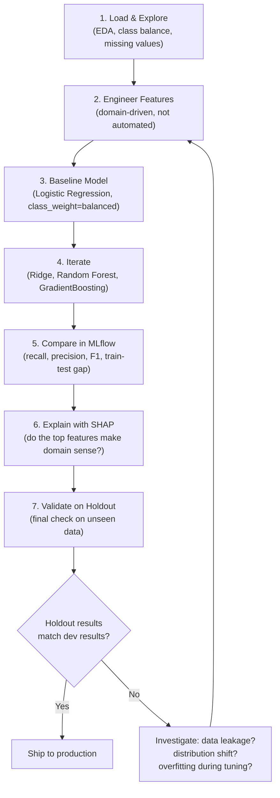
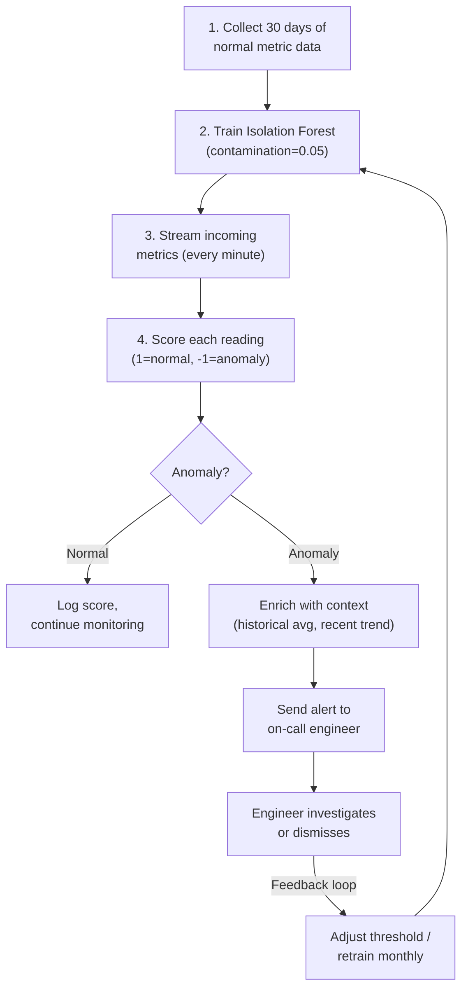

# Machine Learning Fundamentals — Building It

**The complete ML pipeline from raw data to validated model — step by step, decision by decision.**

---

## The Architect Decision Checklist — Before Writing Any Code

Every ML project that skips this checklist wastes weeks. Before opening a notebook, answer these five questions:

| Decision | What to Decide | Example (Production Diagnostic System) |
|:---|:---|:---|
| **1. Target variable** | What exactly is the model predicting? | Binary: "Will this P3 incident escalate to P1 within 4 hours?" (1 = yes, 0 = no) |
| **2. Success metric** | Which metric determines if the model is good enough? | Recall at 80%+ (missing an escalation is far worse than a false alarm) |
| **3. Baseline** | What is the simplest model to beat? | Logistic Regression with 3 features. If a complex model cannot beat this, the problem may not need ML. |
| **4. Features** | What data is available and relevant? | Service name, time of day, recent deployment count, error rate trend, number of related alerts |
| **5. Validation strategy** | How will the model be tested honestly? | Time-based split — train on January through March incidents, test on April. Never random split on time-series data. |

> **Why this order matters:** Deciding the metric BEFORE training prevents the most common failure — building a model, picking a metric that makes it look good, and discovering in production that it optimizes the wrong thing. In the Production Diagnostic System, accuracy would be 92% because most incidents do NOT escalate. But 92% accuracy means catching zero escalations. Recall is the metric that matters.

---

## Step 1: Load and Explore

Before any modeling, understand the data. EDA (Exploratory Data Analysis) answers three questions:

1. **What do I have?** — How many rows, columns, what types, how much is missing?
2. **What does it look like?** — Distributions, outliers, class balance
3. **What smells wrong?** — Duplicates, impossible values, data leakage

```python
# Pseudocode — the notebook has the executable version

# Load incident data
incidents = load_data("production_incidents.csv")

# Shape and types
print(incidents.shape)        # (12,450 incidents, 23 columns)
print(incidents.dtypes)       # service: string, severity: int, error_rate: float ...
print(incidents.isnull().sum())  # Which columns have missing values?

# Class balance — how many escalated?
print(incidents["escalated"].value_counts())
# 0 (did not escalate): 11,205  (90%)
# 1 (escalated to P1):   1,245  (10%)
# => Imbalanced. Accuracy will lie. Must use recall/F1.

# Distribution of key features
plot_histogram(incidents["hour_of_day"])      # Are escalations more common at night?
plot_histogram(incidents["deployment_count"])  # More deploys = more escalations?
```

### What to Look For

| Signal | What It Means | Action |
|:---|:---|:---|
| 90/10 class imbalance | Accuracy is useless as a metric | Use recall, F1, or PR-AUC (Precision-Recall Area Under Curve) |
| 40% missing values in a column | Cannot use this feature reliably | Impute if pattern exists, drop if random noise |
| One service accounts for 60% of escalations | Feature will dominate the model | Verify this is real signal, not a data collection artifact |
| Target variable present as a feature | Data leakage — the model will "cheat" | Remove any feature that would not be available at prediction time |

---

## Step 2: Feature Engineering — Domain-Driven, Not Automated

Feature engineering is where domain knowledge becomes model performance. In the Production Diagnostic System, raw incident data is not useful to a model. Derived features are:

| Raw Data | Engineered Feature | Why It Helps |
|:---|:---|:---|
| Incident timestamp | `hour_of_day`, `is_business_hours`, `day_of_week` | Escalations spike during off-hours when fewer engineers are available |
| Deployment table | `deployments_last_24h` — count of deploys in the 24 hours before the incident | Recent deployments correlate with instability |
| Alert table | `related_alert_count` — number of alerts fired for the same service in the last hour | A burst of alerts suggests systemic failure, not a one-off |
| Error rate time series | `error_rate_trend` — slope of error rate over the last 30 minutes | Rising error rate predicts escalation better than a single snapshot |
| Service metadata | `service_tier` — one-hot encoded (Tier 1, Tier 2, Tier 3) | Tier 1 services escalate faster due to business criticality |
| Incident description | `description_length`, `contains_keyword_outage` | Longer descriptions and certain keywords correlate with severity |

```python
# Pseudocode — domain-driven feature engineering

# Time features
incidents["hour_of_day"] = incidents["created_at"].dt.hour
incidents["is_business_hours"] = incidents["hour_of_day"].between(9, 17).astype(int)
incidents["day_of_week"] = incidents["created_at"].dt.dayofweek

# Aggregation features (computed from related tables)
incidents["deployments_last_24h"] = count_deployments(incidents["service"], window="24h")
incidents["related_alert_count"] = count_alerts(incidents["service"], window="1h")

# Trend features
incidents["error_rate_trend"] = compute_slope(incidents["service"], metric="error_rate", window="30m")

# Encode categorical features
incidents = one_hot_encode(incidents, columns=["service_tier", "region"])

# Scale numeric features to 0-1 range
numeric_cols = ["hour_of_day", "deployments_last_24h", "related_alert_count", "error_rate_trend"]
incidents[numeric_cols] = scale_to_range(incidents[numeric_cols], 0, 1)
```

> **The principle:** A logistic regression with well-engineered features often outperforms a gradient boosting model on raw data. The features do the thinking. The model just draws the boundary.

---

## Step 3: Baseline Model — Always Start Simple

The baseline is not the final model. It is the bar that every subsequent model must beat. If a simple model performs well enough, ship it — simplicity is a production advantage (faster, cheaper, easier to debug).

```python
# Pseudocode — Logistic Regression baseline

from sklearn.linear_model import LogisticRegression
from sklearn.model_selection import cross_val_score

# Train baseline
baseline = LogisticRegression(class_weight="balanced")  # balanced = penalize missed escalations
baseline.fit(X_train, y_train)

# Evaluate with cross-validation
scores = cross_val_score(baseline, X_train, y_train, cv=5, scoring="recall")
print(f"Baseline Recall: {scores.mean():.3f} +/- {scores.std():.3f}")
# Output: Baseline Recall: 0.68 +/- 0.04

# Also check precision — if recall is 100% but precision is 5%, the model flags everything
precision = cross_val_score(baseline, X_train, y_train, cv=5, scoring="precision")
print(f"Baseline Precision: {precision.mean():.3f}")
# Output: Baseline Precision: 0.31
```

**Baseline result:** 68% recall, 31% precision. The model catches 68% of escalations but generates many false alarms. This is the number to beat.

---

## Step 4: Iterate — Ridge, GradientBoosting, Random Forest

Now try more powerful models. Each addresses a different limitation:

| Model | Why Try It | What It Adds Over Baseline |
|:---|:---|:---|
| **Ridge Classifier** (L2-regularized linear model) | Handles correlated features better than plain Logistic Regression | May improve precision without sacrificing recall |
| **Random Forest** | Handles non-linear relationships, robust to outliers | Captures complex interactions (e.g., "nighttime + recent deploy + rising errors" jointly) |
| **GradientBoosting (XGBoost or LightGBM)** | Best tabular performance in most benchmarks | Sequentially corrects errors — each tree fixes what the previous trees got wrong |

```python
# Pseudocode — train multiple models

from sklearn.linear_model import RidgeClassifier
from sklearn.ensemble import RandomForestClassifier, GradientBoostingClassifier

models = {
    "Logistic Regression": LogisticRegression(class_weight="balanced"),
    "Ridge":               RidgeClassifier(class_weight="balanced"),
    "Random Forest":       RandomForestClassifier(n_estimators=200, class_weight="balanced"),
    "GradientBoosting":    GradientBoostingClassifier(n_estimators=200, learning_rate=0.1),
}

results = {}
for name, model in models.items():
    model.fit(X_train, y_train)
    recall = cross_val_score(model, X_train, y_train, cv=5, scoring="recall").mean()
    precision = cross_val_score(model, X_train, y_train, cv=5, scoring="precision").mean()
    f1 = cross_val_score(model, X_train, y_train, cv=5, scoring="f1").mean()
    results[name] = {"recall": recall, "precision": precision, "f1": f1}
```

---

## Step 5: Compare Models Side by Side — MLflow Experiment Tracking

Every training run is logged to MLflow (pronounced "M-L-flow") so nothing is lost and every result is reproducible.

```python
# Pseudocode — MLflow experiment tracking

import mlflow

mlflow.set_experiment("incident-escalation-prediction")

for name, model in models.items():
    with mlflow.start_run(run_name=name):
        model.fit(X_train, y_train)
        predictions = model.predict(X_test)

        # Log parameters
        mlflow.log_param("model_type", name)
        mlflow.log_param("n_features", X_train.shape[1])

        # Log metrics
        mlflow.log_metric("recall", recall_score(y_test, predictions))
        mlflow.log_metric("precision", precision_score(y_test, predictions))
        mlflow.log_metric("f1", f1_score(y_test, predictions))

        # Log the model artifact
        mlflow.sklearn.log_model(model, artifact_path="model")
```

### The Comparison Table

| Model | Recall | Precision | F1 | Train-Test Gap | Verdict |
|:---|:---|:---|:---|:---|:---|
| Logistic Regression | 0.68 | 0.31 | 0.43 | 0.02 (small) | Baseline. Underfits — misses too many escalations. |
| Ridge | 0.70 | 0.33 | 0.45 | 0.02 (small) | Marginal improvement. Still underfitting. |
| Random Forest | 0.79 | 0.42 | 0.55 | 0.08 (moderate) | Good recall jump. Some overfitting. |
| GradientBoosting | 0.83 | 0.45 | 0.58 | 0.06 (moderate) | Best recall. Acceptable precision. Winner candidate. |

> **Reading this table:** The success metric is recall (must be 80%+). GradientBoosting is the only model that clears the bar. Its train-test gap of 0.06 indicates mild overfitting — manageable with regularization tuning. The precision of 0.45 means roughly half the alerts are false alarms. That is acceptable if the cost of reviewing a false alarm is low relative to missing a real escalation.

---

## Step 6: Explain with SHAP — Which Features Matter and Why

The model predicts escalation. The on-call engineer asks: **"Why does the system think this incident will escalate?"**

SHAP (SHapley Additive exPlanations, pronounced "shap") decomposes every prediction into per-feature contributions:

```python
# Pseudocode — SHAP explanation

import shap

explainer = shap.TreeExplainer(best_model)  # GradientBoosting
shap_values = explainer.shap_values(X_test)

# Global: which features matter most across ALL predictions?
shap.summary_plot(shap_values, X_test, feature_names=feature_names)

# Local: why did THIS specific incident get flagged?
shap.force_plot(explainer.expected_value, shap_values[0], X_test[0], feature_names=feature_names)
```

### What SHAP Reveals for the Incident Escalation Model

```
Base prediction (average escalation rate):      10%
+ error_rate_trend = +0.8 (rising fast):       +25%  (strongest signal)
+ deployments_last_24h = 3:                    +15%  (recent instability)
+ is_business_hours = 0 (off-hours):           +12%  (fewer engineers available)
+ related_alert_count = 7:                     +10%  (cascade in progress)
- service_tier = Tier 3 (non-critical):         -8%  (lower-tier services escalate less)
= Final prediction:                             64%  escalation probability
```

**This is actionable.** The on-call engineer sees: "Error rate is climbing, 3 deploys in the last day, 7 related alerts, and it is 2 AM. This incident has a 64% chance of escalating." That context changes the response — from "acknowledge and monitor" to "engage the senior engineer now."

---

## Step 7: Select and Validate the Winner

Selection is not just "highest recall." The winner must pass all production criteria:

| Criterion | GradientBoosting (Winner) | Passes? |
|:---|:---|:---|
| Recall >= 80% | 83% | Yes |
| Precision >= 30% (false alarm tolerance) | 45% | Yes |
| Train-test gap < 10% | 6% | Yes |
| Prediction latency < 100ms | 12ms | Yes |
| SHAP explanations make domain sense | Top features match engineering intuition | Yes |
| Cross-validation stable (low variance across folds) | 0.83 +/- 0.03 | Yes |

### Final Validation on Held-Out Data

The test set used during development is not the final validation. Reserve a separate holdout set — data the model has never seen during any phase of development:

```python
# Pseudocode — final validation

# Holdout set: April incidents (model trained on Jan-Mar, tuned on validation split from Jan-Mar)
holdout_predictions = best_model.predict(X_holdout)
holdout_recall = recall_score(y_holdout, holdout_predictions)
holdout_precision = precision_score(y_holdout, holdout_predictions)
print(f"Holdout Recall: {holdout_recall:.3f}")    # 0.81
print(f"Holdout Precision: {holdout_precision:.3f}")  # 0.43
```

If the holdout results are close to the development results (within 2-3 points), the model generalizes. If they drop significantly, something was overfit during the tuning process.

---

## The Full Pipeline — From Raw Data to Validated Model



---

## Common Mistakes — And How to Avoid Them

| Mistake | What Happens | Prevention |
|:---|:---|:---|
| **Choosing the metric after training** | You pick the metric that makes the model look best, not the one that matters | Decide the metric in the Architect Checklist, before writing code |
| **Using accuracy on imbalanced data** | 92% accuracy while catching zero escalations | Use recall, F1, or PR-AUC for imbalanced problems |
| **Random split on time-series data** | Future data leaks into training; the model looks good but fails in production | Use time-based splits: train on past, test on future |
| **Skipping the baseline** | No way to know if the complex model is actually better | Always train Logistic Regression first. It takes 5 minutes. |
| **Engineering features from the target** | Features that encode the answer directly (e.g., "was_escalated" as a feature) | Only use features available at prediction time |
| **Tuning on the test set** | The test set becomes a second training set; results are optimistic | Use train/validation/holdout: tune on validation, final check on holdout |

---

## Building an Anomaly Detection Pipeline

The pipeline above predicts incident escalation — a supervised classification problem. This section covers a different pattern: **anomaly detection** — finding unusual data points without labeled examples.

### Use Case: Detecting Anomalous Infrastructure Metrics

In the Production Diagnostic System, hundreds of services emit metrics every minute: CPU utilization, memory usage, error rate, request latency, queue depth. Most of the time, these metrics follow predictable patterns. The goal: detect when a metric deviates from its normal pattern — before it triggers an incident.

This is not classification. There are no labels ("this metric reading is anomalous" / "this metric reading is normal"). Labeling thousands of metric readings is impractical. Instead, the model learns what "normal" looks like and flags deviations.

### Step 1: Define "Normal" — Train on Historical Data

Collect 30 days of infrastructure metrics during periods with no known incidents. This becomes the training set — a representation of normal operations.

```python
# Pseudocode — train Isolation Forest on historical metrics

from sklearn.ensemble import IsolationForest

# historical_metrics: DataFrame with columns
# [cpu_pct, memory_pct, error_rate, latency_p99, queue_depth, requests_per_sec]
# 30 days of 1-minute readings, filtered to periods with no known incidents

model = IsolationForest(
    contamination=0.05,  # expect roughly 5% of training data to be borderline
    n_estimators=200,    # number of isolation trees
    random_state=42
)
model.fit(historical_metrics)
```

**Why Isolation Forest:** It works by randomly splitting the data with decision trees. Normal points are surrounded by similar points and require many splits to isolate. Anomalies are different from everything else and are isolated in very few splits. Fast, handles high-dimensional data, requires no labels, and scales to millions of data points.

### Step 2: Score New Data — Anomaly Score Per Observation

Each new metric reading receives a score. Isolation Forest returns `1` for normal and `-1` for anomalous.

```python
# Pseudocode — score incoming metrics

new_metrics = get_latest_metrics(window="5m")  # last 5 minutes of readings

# Predict: 1 = normal, -1 = anomaly
predictions = model.predict(new_metrics)

# Also get the raw anomaly score (lower = more anomalous)
scores = model.decision_function(new_metrics)
```

### Step 3: Set Threshold — A Business Decision

The `contamination` parameter and the raw anomaly score together determine the threshold. This is not a pure math decision — it is a business decision:

| Threshold Setting | Effect | When to Use |
|:---|:---|:---|
| **Aggressive (low contamination, e.g., 0.01)** | Fewer anomalies flagged. Higher precision (fewer false alarms). Lower recall (some real anomalies missed). | Operations team is small — cannot investigate many alerts. False alarms erode trust. |
| **Sensitive (high contamination, e.g., 0.10)** | More anomalies flagged. Lower precision (more false alarms). Higher recall (fewer real anomalies missed). | The cost of missing an anomaly is high (financial systems, safety-critical). Team can handle the alert volume. |
| **Balanced (e.g., 0.05)** | Middle ground. | Default starting point. Adjust based on operational feedback. |

> **In practice:** Start with `contamination=0.05`. Run for one week. Count false alarms and missed anomalies (discovered retrospectively from incident reports). Adjust the threshold until the alert-to-investigation ratio is manageable.

### Step 4: Alert or Act — Flag Anomalies for Investigation

An anomaly score alone is not actionable. Enrich the alert with context:

```python
# Pseudocode — enrich and alert

anomalies = new_metrics[predictions == -1]

for idx, row in anomalies.iterrows():
    alert = {
        "service": row["service_name"],
        "timestamp": row["timestamp"],
        "anomaly_score": scores[idx],
        "metrics": {
            "cpu_pct": row["cpu_pct"],
            "memory_pct": row["memory_pct"],
            "error_rate": row["error_rate"],
            "latency_p99": row["latency_p99"],
        },
        "context": f"Memory at {row['memory_pct']:.1f}% vs 30-day avg of {historical_avg['memory_pct']:.1f}%",
    }
    send_to_alerting_system(alert)
```

### The Full Anomaly Detection Pipeline



### Why Isolation Forest for Production Systems

| Requirement | How Isolation Forest Meets It |
|:---|:---|
| **No labels needed** | Trained on normal data only. No need to manually label thousands of metric readings. |
| **Fast inference** | Prediction is a tree traversal — microseconds per data point. Handles real-time metric streams. |
| **High-dimensional** | Works with 10, 50, or 200 metric dimensions without modification. No curse of dimensionality. |
| **Interpretable enough** | While not as interpretable as a decision tree, the anomaly score provides a continuous severity signal. Combined with feature-level context, engineers can understand WHY a reading was flagged. |
| **Low maintenance** | Retrain monthly on the latest 30 days of normal data. No label collection, no complex retraining pipeline. |

### When Isolation Forest Is Not Enough

| Situation | Better Choice |
|:---|:---|
| Anomalies are defined by local density (normal in one region, anomalous in another) | **LOF (Local Outlier Factor)** — compares each point to its local neighborhood |
| Complex temporal patterns (anomaly is a sequence, not a single point) | **Autoencoders** or **LSTM (Long Short-Term Memory) autoencoders** — learn temporal "normal" and flag sequences with high reconstruction error |
| You eventually DO get labeled anomalies | Switch to **supervised classification** — it will outperform any unsupervised method given enough labeled examples |

---

## Quick Links

| Chapter | Title |
|:---|:---|
| [01](01_Why.md) | Why This Matters |
| [02](02_Concepts.md) | Concepts and Mental Models |
| [03](03_Hello_World.md) | Hello World |
| [04](04_How_It_Works.md) | How It Works |
| **[05](05_Building_It.md)** | **Building It** (this chapter) |
| [06](06_Production_Patterns.md) | Production Patterns |
| [07](07_System_Design.md) | System Design |
| [08](08_Quality_Security_Governance.md) | Quality, Security, Governance |
| [09](09_Observability_Troubleshooting.md) | Observability and Troubleshooting |
| [10](10_Decision_Guide.md) | Decision Guide |

---

**Hands-on notebook:** [ML Fundamentals on Colab](https://colab.research.google.com/github/sunilmogadati/systems-in-production/blob/main/implementation/notebooks/ML_Fundamentals.ipynb) — the executable version of this pipeline with real data and visualizations.

**Architecture reference:** [CSI Architecture](../../../systems/continuous-system-intelligence/architecture.md) — the system this model serves.

**Next:** [06 — Production Patterns](06_Production_Patterns.md) — How ML models actually run in production: training pipelines, serving patterns, feature stores, A/B testing, and the MLOps lifecycle.
