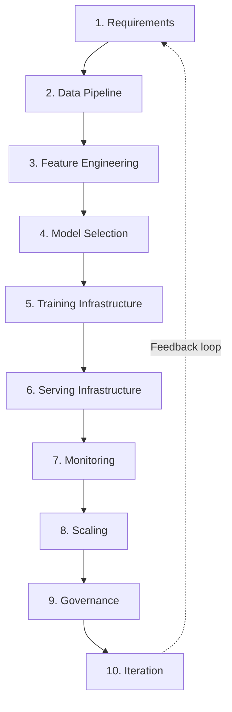
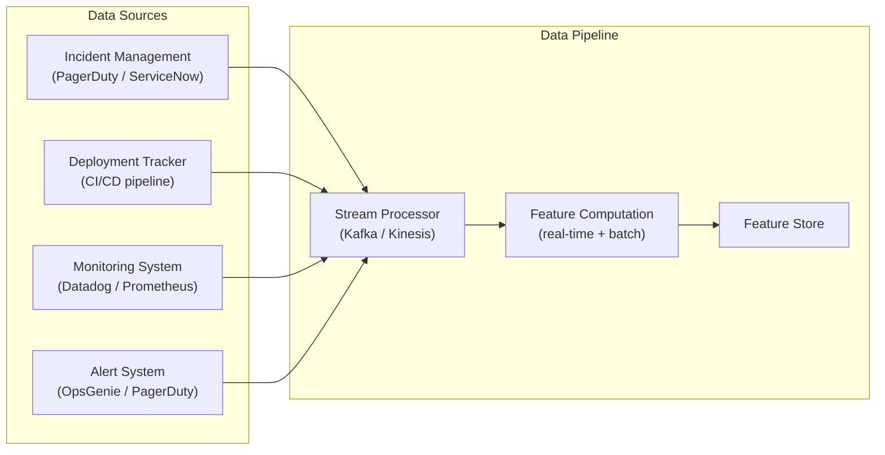
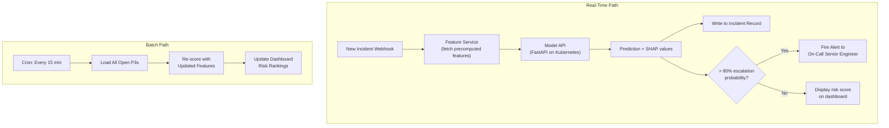
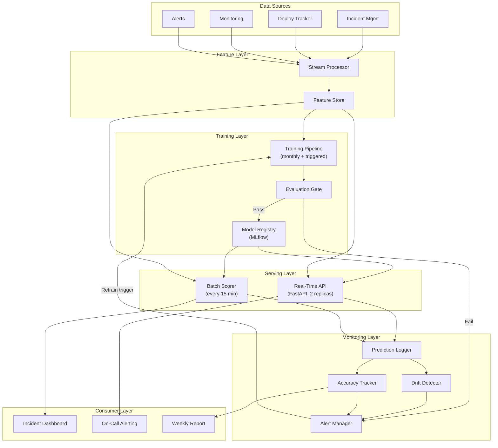

# Machine Learning Fundamentals — System Design

**The 10-step framework for designing an ML system — from requirements to iteration. The same framework used in ML system design interviews.**

---

## Why a Framework Matters

Without a framework, ML system design conversations go one of two ways:

1. **Jump to the model:** "We should use XGBoost." But for what latency? What data? What happens when it is wrong?
2. **Wander through details:** 45 minutes of discussion with no structure, missing critical decisions, no way to evaluate completeness.

The 10-step framework ensures every critical decision is addressed, in order, with clear rationale. It works for production design reviews and for system design interviews — the structure is the same.

---

## The 10-Step Framework

---

## Applied: Design an ML System That Predicts Incident Escalation

The Production Diagnostic System needs to predict which P3 (Priority 3) incidents will escalate to P1 (Priority 1) within 4 hours. Walk through all 10 steps.

---

### Step 1: Requirements

Before anything else — what does the system need to do, and how well?

| Requirement | Decision | Rationale |
|:---|:---|:---|
| **Prediction target** | Binary: escalates (1) or does not (0) within 4 hours | Clear, measurable, time-bounded |
| **Latency** | Under 200ms for real-time scoring; 15-minute batch acceptable for dashboard | Real-time scoring needed for immediate alerting. Dashboard can tolerate batch delay. |
| **Throughput** | ~500 new P3 incidents per day, peak of 50 per hour | Modest volume. No need for GPU-scale serving infrastructure. |
| **Accuracy target** | Recall >= 80%, Precision >= 30% | Missing an escalation (false negative) is more costly than a false alarm (false positive). 80% recall means catching 4 out of 5 escalations. |
| **Explainability** | Required — engineers need to know WHY an incident was flagged | SHAP (SHapley Additive exPlanations) values per prediction. Without explanation, engineers ignore the predictions. |
| **Availability** | 99.9% uptime for the scoring API | Incident management is a critical path. Downtime means missed escalations. |

> **The key question:** "What happens if the model is wrong?" A false positive (flagging a non-escalating incident) triggers unnecessary attention — a $50 cost in engineer time. A false negative (missing an escalation) means a P1 incident runs unchecked for hours — a $50,000+ cost in downtime and customer impact. That 1000x asymmetry drives every subsequent decision toward recall.

---

### Step 2: Data Pipeline

Where does the data come from, how fresh is it, and how reliable?

| Data Source | What It Provides | Freshness | Reliability |
|:---|:---|:---|:---|
| Incident management | Incident metadata: service, severity, description, created time | Real-time (webhook on creation) | High — this is the source of truth |
| Deployment tracker | Recent deployments per service | Near real-time (CI/CD events) | Medium — some teams deploy outside the tracked system |
| Monitoring system | Error rates, latency percentiles, resource utilization | 1-minute granularity | High — but can lag during outages (when data matters most) |
| Alert system | Alert count, alert types, alert timing | Real-time | High |

**Data quality concerns:**
- Incident descriptions vary wildly in quality — some are one word, some are paragraphs
- Deployment tracking has gaps for manual deployments
- Monitoring data can be delayed during the exact incidents the model needs to predict

---

### Step 3: Feature Engineering

Transform raw data into model inputs. Every feature must be answerable at prediction time — no future information.

| Feature | Source | Computation | Why It Matters |
|:---|:---|:---|:---|
| `service_tier` | Service catalog | Categorical: Tier 1 / 2 / 3 | Tier 1 services escalate faster (business criticality) |
| `hour_of_day` | Incident timestamp | Extract hour (0-23) | Off-hours incidents escalate more (fewer responders) |
| `is_weekend` | Incident timestamp | Boolean | Weekend incidents have slower response, higher escalation |
| `deployments_last_24h` | Deployment tracker | Count deploys for this service in prior 24 hours | Recent deployments correlate with instability |
| `error_rate_trend` | Monitoring system | Linear slope of error rate over prior 30 minutes | Rising error rate is the strongest escalation signal |
| `related_alert_count` | Alert system | Count alerts for this service in prior hour | Alert burst indicates cascading failure |
| `p3_incidents_last_7d` | Incident management | Count P3 incidents for this service in prior week | Chronically unstable services escalate more |
| `description_length` | Incident description | Character count | Longer descriptions often indicate more complex issues |
| `has_keyword_outage` | Incident description | Boolean: contains "outage", "down", "unavailable" | Specific keywords correlate with severity |

> **Feature store integration:** Features 4-7 require aggregation queries against multiple data sources. Precompute these in the feature store (Feast, Tecton, or a custom feature service) to keep prediction latency under 200ms.

---

### Step 4: Model Selection

| Candidate | Pros | Cons | Expected Performance |
|:---|:---|:---|:---|
| **Logistic Regression** | Interpretable, fast (sub-millisecond), easy to debug | Cannot capture non-linear interactions | Baseline: ~68% recall |
| **Random Forest** | Handles mixed feature types, robust to outliers | Larger model size, less interpretable than linear | ~79% recall |
| **GradientBoosting (LightGBM)** | Best tabular performance, handles class imbalance well | More hyperparameters to tune, risk of overfitting on small data | ~83% recall |
| **Neural Network** | Can learn arbitrary patterns | Overkill for tabular data with ~10 features, harder to explain | Not recommended for this problem |

**Decision:** Start with Logistic Regression as the baseline. Promote GradientBoosting (via LightGBM, pronounced "light G-B-M") as the production model if it clears the 80% recall threshold. Keep the model interpretable with SHAP — neural networks add complexity without proportional benefit on structured, tabular data.

---

### Step 5: Training Infrastructure

| Decision | Choice | Rationale |
|:---|:---|:---|
| **Compute** | CPU (no GPU needed) | GradientBoosting on 12,000 rows with 10 features trains in under 60 seconds on a single CPU |
| **Distributed vs single** | Single machine | Dataset fits in memory. Distributed training adds complexity for zero benefit. |
| **Training environment** | Docker container on Kubernetes CronJob | Reproducible, scheduled, versioned |
| **Experiment tracking** | MLflow | Logs parameters, metrics, model artifacts, code version |
| **Training frequency** | Monthly scheduled + triggered on drift detection | Incident patterns shift seasonally, not daily |
| **Training data window** | Rolling 6 months | Enough history to capture patterns, recent enough to reflect current infrastructure |

---

### Step 6: Serving Infrastructure

| Decision | Choice | Rationale |
|:---|:---|:---|
| **Primary serving** | Real-time API (FastAPI behind Kubernetes Ingress) | Immediate scoring on incident creation |
| **Secondary serving** | Batch re-scoring every 15 minutes | Features change over time (more alerts arrive, error rate climbs) — re-scoring captures this |
| **Model format** | Serialized with joblib, loaded at API startup | Sub-millisecond inference for tree-based models |
| **Fallback** | If API is down, incidents created without prediction; batch catches up on next run | Graceful degradation — no incident is lost |
| **Replicas** | 2 API replicas (active-active) | Handles peak load of 50 incidents/hour with 99.9% availability |

---

### Step 7: Monitoring

| What to Monitor | How | Alert Threshold |
|:---|:---|:---|
| **Prediction distribution** | Track % of incidents flagged as high-risk per day | If >30% of incidents are flagged (up from typical 10%), something shifted |
| **Feature drift** | Compare feature distributions weekly vs training data | KL divergence (Kullback-Leibler divergence) > 0.1 on any feature |
| **Accuracy** | Compare predictions to actual escalations (ground truth available after 4 hours) | Recall drops below 75% over a 7-day window |
| **Latency** | P99 (99th percentile) API response time | P99 > 200ms |
| **Error rate** | HTTP 5xx rate on the model API | > 1% of requests |
| **Feature freshness** | Time since each feature was last updated in the feature store | Any feature older than 1 hour |

---

### Step 8: Scaling

| Scaling Challenge | Solution |
|:---|:---|
| **More incidents per hour** | Add API replicas horizontally. Tree-based models are stateless — any replica can score any request. |
| **Slower feature computation** | Cache frequently accessed features. Precompute in the feature store instead of computing on-demand. |
| **Larger training dataset** | GradientBoosting handles millions of rows on a single machine. Only consider distributed training if the dataset exceeds 100 million rows. |
| **Model too large for memory** | Not a concern for tree-based models on tabular data. Becomes relevant with deep learning — use model compression (quantization, pruning, distillation). |
| **Multiple models** | If the system expands to include root cause classification, anomaly detection, and escalation prediction — share the feature store and model API infrastructure. Deploy each model as a separate endpoint behind the same load balancer. |

---

### Step 9: Governance

| Governance Aspect | Implementation |
|:---|:---|
| **Model versioning** | Every model registered in MLflow Model Registry with version tag, training date, data window, and metrics |
| **Approval workflow** | New model must pass automated evaluation gate AND human review before promotion to production |
| **Model card** | Documented: what the model does, its limitations, performance per service tier, known failure modes |
| **Bias audit** | Check recall and precision per service tier, per region, per time of day. If recall is 85% for Tier 1 but 60% for Tier 3, investigate. |
| **Audit trail** | Every prediction logged with model version, input features, output probability, and timestamp. Queryable for investigation. |
| **Rollback** | Previous model version always available in registry. Rollback is a configuration change, not a deployment. Takes under 5 minutes. |

---

### Step 10: Iteration

| Trigger | Action |
|:---|:---|
| **Monthly schedule** | Retrain on last 6 months of data. Compare to current production model. Promote if better. |
| **Drift detected** | Feature distribution shifted significantly. Retrain with recent data. Investigate root cause of drift. |
| **New data source** | A new monitoring tool is adopted. Add features from it. Retrain and evaluate. |
| **A/B test result** | Model v2 (with new features) outperforms v1 in shadow mode. Promote v2 after 3-week A/B test. |
| **Post-incident review** | A P1 escalation was missed by the model. Analyze with SHAP — which features were misleading? Add new feature or adjust threshold. |

---

## The Full System Architecture

---

## Using This Framework in System Design Interviews

The 10 steps map directly to what interviewers evaluate:

| Step | What the Interviewer Assesses |
|:---|:---|
| 1. Requirements | Can the candidate clarify ambiguity? Do they ask what metric matters? |
| 2. Data Pipeline | Do they think about data quality, freshness, and availability? |
| 3. Feature Engineering | Do they propose domain-relevant features, not just "use all columns"? |
| 4. Model Selection | Do they justify the choice, not just name an algorithm? |
| 5. Training Infrastructure | Do they right-size the infrastructure (not everything needs GPUs)? |
| 6. Serving Infrastructure | Do they address latency, fallback, and failure modes? |
| 7. Monitoring | Do they think beyond deployment — what happens after launch? |
| 8. Scaling | Can they identify bottlenecks and propose proportional solutions? |
| 9. Governance | Do they consider bias, versioning, and auditability? |
| 10. Iteration | Do they plan for the system to improve over time? |

> **Interview tip:** Spend 2-3 minutes on Step 1 (Requirements) before anything else. Most candidates jump to Step 4 (Model Selection). The strongest candidates start by asking: "What is the latency requirement? What is the cost of a false positive versus a false negative? How much labeled data exists?"

---

## Quick Links

| Chapter | Title |
|:---|:---|
| [01](01_Why.md) | Why This Matters |
| [02](02_Concepts.md) | Concepts and Mental Models |
| [03](03_Hello_World.md) | Hello World |
| [04](04_How_It_Works.md) | How It Works |
| [05](05_Building_It.md) | Building It |
| [06](06_Production_Patterns.md) | Production Patterns |
| **[07](07_System_Design.md)** | **System Design** (this chapter) |
| [08](08_Quality_Security_Governance.md) | Quality, Security, Governance |
| [09](09_Observability_Troubleshooting.md) | Observability and Troubleshooting |
| [10](10_Decision_Guide.md) | Decision Guide |

---

**Hands-on notebook:** [ML Fundamentals on Colab](https://colab.research.google.com/github/sunilmogadati/systems-in-production/blob/main/implementation/notebooks/ML_Fundamentals.ipynb) — the model that this system serves.

**Architecture reference:** [CSI Architecture](../../../systems/continuous-system-intelligence/architecture.md) — the full system context.

**Next:** [08 — Quality, Security, Governance](08_Quality_Security_Governance.md) — Data quality, model fairness, security threats, regulatory requirements, and the governance structures that keep ML systems trustworthy.
