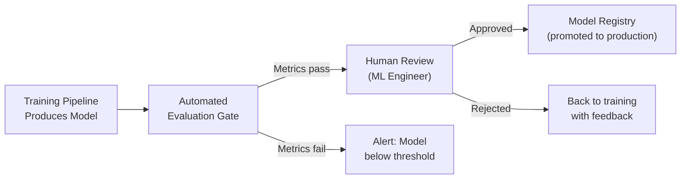

# Machine Learning Fundamentals — Quality, Security, Governance

**Data quality, model fairness, adversarial threats, and the governance structures that keep ML systems trustworthy.**

---

## The Core Question

Before building any governance structure, ask one question:

> **"If this model makes a wrong prediction, what is the worst that happens?"**

That answer determines how much governance the system needs:

| Consequence of Wrong Prediction | Governance Level | Examples |
|:---|:---|:---|
| Minor inconvenience | Light — basic monitoring, periodic review | Product recommendation misses, content ranking errors |
| Financial loss | Moderate — audit trail, approval workflows, drift monitoring | Fraud detection, credit scoring, pricing models |
| Safety or legal liability | Heavy — bias audits, regulatory compliance, model cards, human-in-the-loop | Medical diagnosis, autonomous driving, hiring decisions, loan approvals |

In the Production Diagnostic System, a wrong prediction means either a missed escalation (P3 becomes P1 unnoticed — operational damage) or a false alarm (engineer spends 15 minutes investigating nothing — minor cost). This lands in the **moderate** governance tier: audit trails, monitoring, periodic review, but not regulatory compliance paperwork.

---

## Data Quality — Garbage In, Garbage Out

The phrase is cliche because it is universally true. Every ML failure autopsy eventually traces back to a data quality problem.

### How Bad Data Causes Bad Models — Specific Examples

| Data Quality Issue | What Happens to the Model | Production Diagnostic System Example |
|:---|:---|:---|
| **Duplicate rows** | Model overweights duplicated incidents, skewing predictions | The same incident appears 3 times due to a webhook retry. The model learns that this incident type is 3x more common than it actually is. |
| **Missing values (random)** | Imputation works but introduces noise | 5% of incidents are missing `deployment_count` because the CI/CD system was down. Imputing with the median is reasonable. |
| **Missing values (systematic)** | Imputation introduces bias | ALL Tier 3 services are missing `error_rate` because they lack monitoring. Imputing with zero tells the model Tier 3 services never have errors — systematically wrong. |
| **Label noise** | Model learns incorrect patterns | An incident was labeled "escalated" but was actually resolved at P3 — a status field was set incorrectly. The model learns false escalation patterns. |
| **Data leakage** | Model looks accurate but cheats | A feature `resolution_time` is included — but this is only known AFTER the incident resolves. The model appears perfect during evaluation and fails completely in production. |
| **Distribution shift** | Model trained on one population, serves another | Model trained on incidents from January (post-holiday, low activity). Deployed in March (end-of-quarter push, high activity). Feature distributions do not match. |

### The Data Quality Checklist

Run this before every training pipeline:

| Check | How | Threshold |
|:---|:---|:---|
| **Duplicate rows** | Hash-based deduplication on incident ID | Zero duplicates in training data |
| **Missing values** | Per-column null percentage | Flag columns with >10% missing for investigation |
| **Label accuracy** | Sample 100 labeled incidents, manually verify | >95% label accuracy required |
| **Feature freshness** | Timestamp of most recent data point | Training data must be within 30 days of current date |
| **Distribution match** | Compare feature distributions (training vs recent production data) | KL divergence (Kullback-Leibler divergence) < 0.1 per feature |
| **Leakage check** | Verify no feature uses information from the future | Manual review of every feature's temporal availability |

---

## Feature Quality — Drift, Missing Values, Distribution Shift

Features that were reliable during training can degrade in production. This is the most common cause of silent model degradation.

### Types of Feature Drift

| Drift Type | What Changed | Example | Detection |
|:---|:---|:---|:---|
| **Data drift** | Feature distribution shifted | `deployments_last_24h` averaged 2 during training. After adopting continuous deployment, it averages 15. | Statistical test (KS test, KL divergence) comparing production feature distribution to training distribution |
| **Concept drift** | The relationship between features and target changed | Off-hours incidents used to escalate more (fewer engineers). After implementing a global on-call rotation, the time-of-day effect diminished. | Accuracy tracking — model recall drops even though feature distributions look normal |
| **Upstream data change** | A data source changed format or meaning | The alert system changed severity levels from 1-5 to Low/Medium/High/Critical. The feature `alert_severity` now contains strings instead of integers. | Schema validation on ingestion — catch type mismatches before they reach the model |

### Handling Missing Values in Production

| Strategy | When to Use | Risk |
|:---|:---|:---|
| **Impute with training median** | Feature is missing randomly and rarely (<5%) | Masks systematic data source failures |
| **Flag and impute** | Add a boolean `feature_was_missing` column alongside the imputed value | Model can learn to discount imputed values — safer |
| **Fail the prediction** | Feature is critical and irreplaceable | No prediction is better than a bad prediction. Log the failure and alert. |
| **Use a fallback model** | Primary model requires the feature; fallback model does not | Maintains coverage at reduced accuracy |

---

## Model Quality — The Right Metric for the Right Problem

Covered in depth in [04 — How It Works](04_How_It_Works.md). The summary for governance purposes:

| Metric | When It Matters | Business Translation |
|:---|:---|:---|
| **Precision** | False positives are expensive (spam filter blocking real email) | "Of the incidents we flagged, how many actually escalated?" |
| **Recall** | False negatives are dangerous (missed cancer, missed escalation) | "Of the incidents that actually escalated, how many did we catch?" |
| **F1** | Both types of errors are roughly equally costly | "Balanced performance across both error types" |
| **ROC-AUC (Receiver Operating Characteristic — Area Under Curve)** | Comparing models, threshold-independent evaluation | "Does the model rank risky incidents higher than safe ones?" |
| **PR-AUC (Precision-Recall AUC)** | Imbalanced data where ROC-AUC can be misleading | "How well does the model perform on the minority class specifically?" |

### Performance Per Subgroup

Global metrics hide subgroup failures. A model with 83% overall recall might have:

| Service Tier | Recall | Precision | Incidents in Subgroup |
|:---|:---|:---|:---|
| Tier 1 | 91% | 52% | 3,200 |
| Tier 2 | 82% | 41% | 5,100 |
| Tier 3 | 64% | 28% | 4,150 |

Tier 3 recall is 64% — below the 80% threshold. The model systematically underperforms on lower-tier services. This might be acceptable (Tier 3 escalations have lower business impact) or a problem (Tier 3 services still serve customers). That is a governance decision, not a technical one.

---

## Fairness and Bias

### How Models Discriminate

ML models learn patterns from historical data. If historical data reflects biased decisions, the model automates that bias:

| Bias Source | How It Enters the Model | Example |
|:---|:---|:---|
| **Historical bias** | Training data reflects past discrimination | Loan approval model trained on data where certain zip codes were systematically denied (redlining). Model learns zip code as a predictor of denial. |
| **Representation bias** | Training data underrepresents a group | Medical model trained primarily on data from one demographic. Performs poorly on underrepresented populations. |
| **Measurement bias** | Data collection process is uneven | In the Production Diagnostic System: Tier 1 services have richer monitoring data (more features available). The model is inherently more accurate for Tier 1, not because of the algorithm, but because of data availability. |
| **Feedback loop bias** | Model predictions influence future data | If the model flags an incident as high-risk, engineers respond faster, preventing escalation. The training data then shows "this type of incident does not escalate" — because the model prevented it. The model learns to stop flagging these incidents. |

### Detecting Bias

| Method | What It Measures |
|:---|:---|
| **Subgroup analysis** | Compute recall, precision, F1 for every meaningful subgroup (service tier, region, time of day) |
| **Demographic parity** | Is the prediction rate equal across subgroups? (May not apply to all use cases.) |
| **Equal opportunity** | Is recall equal across subgroups? (More relevant when false negatives are costly.) |
| **Calibration** | When the model says "80% probability," does the event happen 80% of the time — for every subgroup? |

### Mitigating Bias

| Approach | How | Tradeoff |
|:---|:---|:---|
| **Balanced training data** | Oversample underrepresented groups or undersample overrepresented ones | May reduce overall accuracy to improve fairness |
| **Subgroup-aware evaluation** | Set minimum performance thresholds per subgroup, not just overall | A model that meets 80% recall overall but 60% for one subgroup fails the gate |
| **Feature exclusion** | Remove features that encode protected characteristics (zip code as a proxy for race, for example) | May reduce accuracy if the feature carries legitimate signal |
| **Post-processing adjustment** | Apply different thresholds per subgroup to equalize outcomes | Adds complexity and may create legal questions ("treating groups differently") |

---

## Model Cards — Documenting What a Model Does

A **model card** is a structured document that accompanies every production model. It answers the questions that stakeholders, auditors, and future engineers will ask.

| Section | Content |
|:---|:---|
| **Model name and version** | `incident-escalation-v2.3`, deployed 2026-03-15 |
| **Purpose** | Predicts probability that a P3 incident escalates to P1 within 4 hours |
| **Training data** | 12,450 incidents from 2025-10 through 2026-03. Source: incident management system. |
| **Features** | 10 features (listed). Computed via feature store. |
| **Performance** | Overall: Recall 83%, Precision 45%, F1 58%. Per-tier breakdown in appendix. |
| **Limitations** | Underperforms on Tier 3 services (64% recall). Does not account for manual escalations. Does not handle multi-service cascading failures. |
| **Ethical considerations** | No PII (Personally Identifiable Information) used as features. No demographic features. Bias audit completed — no subgroup disparities exceeding 15 percentage points. |
| **Intended use** | Triage aid for on-call engineers. Not a replacement for human judgment. |
| **Out-of-scope use** | Not designed for SLA (Service Level Agreement) violation prediction, capacity planning, or incident root cause analysis. |

---

## Security

### Threat Landscape for ML Systems

| Threat | What It Is | Production Diagnostic System Risk |
|:---|:---|:---|
| **Training data poisoning** | An attacker injects malicious data into the training set to manipulate model behavior | Low risk — training data comes from internal systems, not user input. But a compromised data source could inject false incidents. |
| **Model inversion** | An attacker queries the model repeatedly to reconstruct training data | Low risk for this use case — the training data (incident metadata) is not sensitive PII. High risk for models trained on medical records or financial data. |
| **Adversarial inputs** | Specially crafted inputs that cause the model to make wrong predictions | Medium risk — an attacker could craft incident descriptions designed to lower the escalation score, causing the system to ignore a real escalation. |
| **Model theft** | An attacker extracts the model's behavior by querying the API extensively | Low risk — the model's behavior (incident escalation prediction) is not a competitive secret. High risk for proprietary recommendation or pricing models. |
| **Supply chain attack** | A compromised ML library or pre-trained model contains malicious code | Medium risk — applies to all software. Pin dependency versions, audit third-party packages, use signed model artifacts. |

### Security Controls

| Control | Implementation |
|:---|:---|
| **Input validation** | Validate feature types and ranges before scoring. Reject or flag inputs outside expected bounds. |
| **Rate limiting** | Cap API requests per client to prevent model extraction via mass querying |
| **Access control** | Model API accessible only to authorized internal services (service mesh, mTLS) |
| **Audit logging** | Every prediction logged with input features, output, model version, requesting service, timestamp |
| **Dependency scanning** | Automated scanning of ML library dependencies for known vulnerabilities (Dependabot, Snyk) |
| **Model artifact signing** | Cryptographic signature on model artifacts — verify the model deployed is the model that was evaluated |

---

## Governance Structures

### Model Registry — The Source of Truth

Every production model is registered with:
- Version number
- Training date and data window
- Evaluation metrics (overall and per subgroup)
- Model card
- Code commit hash
- Approval record (who approved promotion to production)

### Approval Workflow



| Gate | What It Checks |
|:---|:---|
| **Automated** | Recall >= 80%, Precision >= 30%, train-test gap < 10%, no subgroup recall below 60% |
| **Human** | SHAP explanations make domain sense, no unexpected feature dominance, model card complete |

### Audit Trail

Every prediction is queryable:

```sql
-- "Show me all predictions for incident INC-45892"
SELECT incident_id, model_version, prediction_probability,
       escalation_actual, features_json, predicted_at
FROM prediction_log
WHERE incident_id = 'INC-45892';
```

This enables post-incident analysis: "The model predicted 35% escalation probability. The incident escalated. Why was the model wrong? Which features were misleading?"

---

## Regulatory Landscape

| Regulation | What It Requires | Relevance to ML |
|:---|:---|:---|
| **GDPR (General Data Protection Regulation)** | Right to explanation — individuals can ask why an automated decision was made. Right to not be subject to solely automated decisions with legal effects. | Models making decisions about people (loans, hiring, medical) must be explainable. SHAP provides the explanation mechanism. |
| **NIST AI RMF (National Institute of Standards and Technology AI Risk Management Framework)** | Voluntary framework for identifying, assessing, and mitigating AI risks. Covers governance, reliability, fairness, transparency. | Useful structure for internal governance even when not legally required. The model card format aligns with NIST transparency requirements. |
| **EU AI Act** | Risk-based classification of AI systems. High-risk systems (hiring, credit, law enforcement) face strict requirements: human oversight, data quality, technical documentation, conformity assessment. | If the ML system makes decisions about people in the EU, it may be classified as high-risk. The Production Diagnostic System (operational predictions, not human decisions) is likely low-risk under the Act. |

> **The practical takeaway:** Even if regulation does not apply to the system today, building with governance in mind (model cards, audit trails, explainability) makes future compliance straightforward. Retrofitting governance onto an ungoverned system is expensive.

---

## Quick Links

| Chapter | Title |
|:---|:---|
| [01](01_Why.md) | Why This Matters |
| [02](02_Concepts.md) | Concepts and Mental Models |
| [03](03_Hello_World.md) | Hello World |
| [04](04_How_It_Works.md) | How It Works |
| [05](05_Building_It.md) | Building It |
| [06](06_Production_Patterns.md) | Production Patterns |
| [07](07_System_Design.md) | System Design |
| **[08](08_Quality_Security_Governance.md)** | **Quality, Security, Governance** (this chapter) |
| [09](09_Observability_Troubleshooting.md) | Observability and Troubleshooting |
| [10](10_Decision_Guide.md) | Decision Guide |

---

**Hands-on notebook:** [ML Fundamentals on Colab](https://colab.research.google.com/github/sunilmogadati/systems-in-production/blob/main/implementation/notebooks/ML_Fundamentals.ipynb) — SHAP explanations, metric evaluation, and the pipeline that governance wraps around.

**Architecture reference:** [Production Diagnostics Architecture](../../../systems/production-diagnostics/architecture.md) — the system these governance structures protect.

**Next:** [09 — Observability and Troubleshooting](09_Observability_Troubleshooting.md) — What to monitor, how to debug accuracy drops, SHAP for production debugging, and when to retrain.
