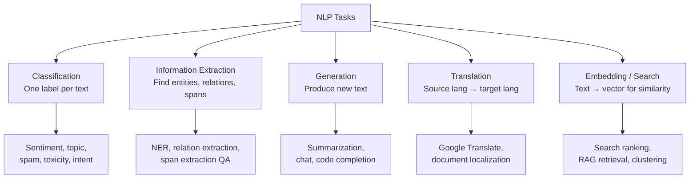
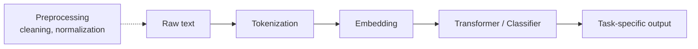

# NLP — Why This Matters

**Why language is the most leveraged interface humans have — and why building systems that read, classify, generate, and translate text is now table stakes for almost every product.**

---

## The Translator, the Support Agent, and the Moderator

A small business owner in rural Vietnam runs a successful online shop selling traditional crafts. Most of her customers are in the United States, Japan, and Germany. She speaks fluent Vietnamese and broken English; she does not speak Japanese or German at all. Before 2020, she lost most international inquiries — by the time she translated, drafted a response, and translated back, the customer had bought elsewhere.

Today, an NLP-powered translation layer in her shop's customer support tool handles inbound messages in 50 languages. Customers write in their language. She reads in Vietnamese. She replies in Vietnamese. They receive in their language. The latency is seconds. The translation quality, especially for languages with abundant training data, matches a professional translator. Her sales tripled. Her business survived a recession her competitors did not.

A help-desk team at a SaaS company processes 50,000 support tickets per month. Eighty percent of them are repetitive — password resets, billing questions, common how-tos. An NLP classification system routes incoming tickets to the right team automatically. An NLP-based assistant drafts the first reply for the agent — pulling from product documentation via RAG. The agent reviews and sends. Mean response time drops from 4 hours to 12 minutes. Agents spend their time on the hard 20% of tickets that genuinely need human judgment, not on the 80% that don't.

A content moderator at a social platform reviews thousands of pieces of content per day for harmful patterns — hate speech, harassment, threats, spam. Burnout rates in content moderation roles are catastrophic. NLP classifiers handle the bulk of obvious cases — auto-removal at high confidence, escalation at moderate confidence. The remaining queue is a fraction of what humans used to see. Quality improves because the humans review *only* the genuinely ambiguous cases, not the obvious ones that wear them down.

---

## What NLP Actually Does

**NLP (Natural Language Processing)** is the field of building computer systems that work with language — text, speech, dialogue. The boundary between NLP and the broader AI stack has blurred since 2020 (transformers, RAG, agents are all "NLP" in some sense), but the **task perspective** is durable. NLP is, at its core, a taxonomy of language-handling problems.



Every modern NLP product is built from these primitives. A chatbot does **classification** (intent), **embedding-based retrieval** (knowledge access), and **generation** (response). A content moderation system does **classification** with multiple labels. A coding assistant does **generation** conditioned on context.

---

## The Modern NLP Pipeline

Almost every NLP system follows this shape:



| Stage | What Happens |
|---|---|
| **Preprocessing** | Lowercase, strip punctuation, handle Unicode, etc. (Less important with modern tokenizers; still matters for some classical methods.) |
| **Tokenization** | Convert text to integer IDs from a fixed vocabulary (BPE, WordPiece, SentencePiece) |
| **Embedding** | Map tokens to vectors via a learned table |
| **Model** | Transformer, classifier, or classical model produces task output |
| **Postprocessing** | Convert model output back to human-readable text or labels |

The transformer-based NLP revolution did not change this pipeline shape — it changed the **model** stage. Classical NLP used SVMs (Support Vector Machines), naive Bayes, or hand-crafted rules. Modern NLP uses transformers. Same shape, different organ.

---

## Classical NLP — Still Useful in 2026

Most NLP coverage focuses on transformer models. But classical NLP techniques remain in production for specific reasons:

| When Classical Wins | Why |
|---|---|
| **Tiny datasets (< 1,000 examples)** | Fine-tuning a transformer overfits; TF-IDF + simple classifier generalizes better |
| **Strict latency / cost requirements** | Naive Bayes runs in microseconds; quantized BERT runs in milliseconds; full LLM in seconds |
| **Highly specific domains with custom vocabularies** | Rule-based + classical can incorporate hand-crafted features that transformers cannot easily |
| **Edge / embedded deployment** | Classical models fit in kilobytes; smallest transformer fits in megabytes |
| **Explainability requirements** | Linear classifiers have inspectable weights; transformers do not |

Common classical techniques still in production:

| Technique | What It Does | Where |
|---|---|---|
| **TF-IDF (Term Frequency-Inverse Document Frequency)** | Convert text to vectors based on word importance | Search ranking baselines, document clustering, simple classifiers |
| **Naive Bayes** | Probabilistic classifier with strong independence assumption | Spam filters, simple text classification |
| **n-grams** | Capture short word sequences (bigrams, trigrams) | Statistical language modeling, autocomplete suggestions |
| **Regex + rules** | Hand-crafted pattern matching | Extracting phone numbers, emails, dates, structured data |

A senior NLP engineer in 2026 knows when to reach for classical methods. The default is transformer-based; the specialist exception is classical.

---

## Modern NLP — The Three Patterns

Almost every modern NLP system uses one of three patterns:

### Pattern 1: Fine-tune a Pretrained Transformer

For tasks where you have labeled data (classification, NER, span extraction), fine-tune a pretrained model:

```
Pretrained BERT → Fine-tune on your task → Deploy
```

Used by: search ranking systems, content moderation, sentiment analysis, NER for specific domains.

Strength: high accuracy with hundreds-thousands of labeled examples.
Cost: a few hundred dollars in compute; hours of training.

### Pattern 2: Prompt a Foundation Model

For tasks where labeled data is scarce or the task is open-ended (summarization, generation, complex reasoning):

```
Foundation LLM (GPT-4, Claude, Llama) → Carefully crafted prompt → Output
```

Used by: customer support chatbots, content drafting, code generation, complex Q&A.

Strength: zero training data needed; works on day 1.
Cost: per-API-call pricing; engineering time on prompt iteration.

### Pattern 3: RAG (Retrieval-Augmented Generation)

For tasks that require knowledge the model does not have (e.g., your company's internal docs):

```
Query → Retrieve relevant docs → Stuff into prompt → LLM generates from those docs
```

Used by: enterprise knowledge search, customer support automation, document analysis.

Strength: grounds responses in actual documents; reduces hallucination.
Cost: embedding storage + retrieval infrastructure + LLM calls.

See the [RAG playbook](../rag/) for the detailed architecture.

In 2026, most production NLP systems combine these three. A customer support chatbot uses Pattern 1 (intent classification), Pattern 3 (RAG over support docs), and Pattern 2 (LLM generation) in a single product.

---

## Why Now? — The Three Drivers (NLP Edition)

NLP has been around since the 1950s. So why did 2018-2026 transform every text-handling product?

### 1. Pretrained Models Made Transfer Cheap

BERT (2018) and GPT-2 (2019) introduced large pretrained models that could be fine-tuned on small datasets. A team with 1,000 labeled examples that previously needed months of feature engineering could fine-tune a pretrained model in hours and beat the classical baseline. The barrier to producing useful NLP collapsed.

### 2. LLMs Productized the "Just Use a Model" Approach

ChatGPT (2022) made it possible to solve many NLP tasks with **zero training** — just ask. Tasks that required dedicated ML systems (sentiment, summarization, classification, generation) became one API call away. The "prompt-then-iterate" workflow displaced the "label data, fine-tune, deploy" workflow for many use cases.

### 3. Multilingual Coverage Caught Up

Pre-2018 NLP was English-centric. Datasets, benchmarks, and pretrained models all favored English. Multilingual models (mBERT, XLM-R, mT5) and later large multilingual LLMs (Llama 3+ multilingual, Aya, Qwen) brought competitive quality to dozens or hundreds of languages. **Production NLP became globally deployable** in a way it had never been.

The combination: any team with a language task can ship something useful in a week, in any major language. That was not true even five years ago.

---

## The Dark Side — and What It Means for Engineering

NLP at scale has dark patterns the engineering team owns:

| Risk | What It Looks Like |
|---|---|
| **Bias in language models** | Models reflect biases in training data — gender, race, culture, religion |
| **Hallucination** | Confident wrong answers — particularly costly in legal, medical, financial domains |
| **Toxicity / safety** | Models trained on internet text learn harmful patterns |
| **Privacy leakage** | Models can memorize and regurgitate training data, including PII |
| **Prompt injection** | Adversarial users override system instructions through crafted inputs |
| **Multilingual fairness** | Quality varies dramatically across languages — low-resource languages get poor service |
| **Misuse for disinformation** | Generated text scales fake content, fake reviews, fake academic papers |
| **Discrimination through automation** | NLP-driven hiring, lending, content moderation can systematize bias |

Every NLP team shipping in 2026 must:
- Test for bias across demographic groups
- Detect and mitigate hallucination (especially in high-stakes domains)
- Document model limitations
- Provide transparency notices ("AI-generated")
- Comply with EU AI Act, sector-specific regulations
- Plan adversarial response

[Chapter 08 — Quality, Security, Governance](08_Quality_Security_Governance.md) covers these in practice.

---

## Where NLP Fits in Production Systems

NLP rarely ships standalone. It is a layer in products.

| Component | Role |
|---|---|
| **Input** (text from user, document, log, etc.) | Upstream of NLP |
| **Preprocessing + tokenization** | First NLP step |
| **NLP model(s)** | Classification, extraction, generation, etc. |
| **Postprocessing + output** | Convert model output to product action |
| **Feedback loop** | User corrections / ratings drive retraining |

In our **Production Diagnostic Intelligence System (CSI):**

| Component | NLP Role |
|---|---|
| Incident ticket triage | Classifier routes new tickets to the right team |
| Log pattern matching | NER + classification on log lines surface anomalies |
| Runbook search | Embedding-based search finds relevant runbooks |
| Auto-summarization | LLM produces stakeholder-friendly incident summaries |
| Diagnostic chat | LLM-powered triage assistant (with RAG over runbooks) |

See the full architecture: [CSI Architecture](../../../systems/continuous-system-intelligence/architecture.md)

---

## What You Will Learn in This Material

| Chapter | What You Learn |
|---|---|
| [01 — Why](01_Why.md) | This page. NLP task taxonomy. Classical vs modern NLP. The three patterns. |
| [02 — Concepts](02_Concepts.md) | Tokenization, embeddings, NLP pipeline, classical foundations (TF-IDF, naive Bayes), with worked examples. |
| [03 — Hello World](03_Hello_World.md) | Build a sentiment classifier two ways: classical (TF-IDF + logistic regression) and modern (BERT fine-tune). |
| [04 — How It Works](04_How_It_Works.md) | Embedding geometry, fine-tune vs prompt vs RAG decision, NLP-specific evaluation metrics. |
| [05 — Building It](05_Building_It.md) | Model selection (BERT/GPT/T5 families), API vs self-host, multilingual, prompt engineering patterns. |
| [06 — Production Patterns](06_Production_Patterns.md) | Google Translate, Copilot autocomplete, customer support, search ranking, content moderation, NER at scale. |
| [07 — System Design](07_System_Design.md) | Serving NLP: classification batching, embedding pipelines, streaming generation, mixed services. |
| [08 — Quality, Security, Governance](08_Quality_Security_Governance.md) | Bias, multilingual fairness, prompt injection, hallucination, regulatory considerations. |
| [09 — Observability & Troubleshooting](09_Observability_Troubleshooting.md) | NLP-specific metrics, drift detection, runbooks. |
| [10 — Decision Guide](10_Decision_Guide.md) | NLP task decision tree. API vs fine-tune vs classical. Production readiness checklist. |

### Foundations and Sibling Playbooks

This playbook builds on:
- [Transformers](../transformers/) — the architecture behind modern NLP
- [Deep Learning](../deep-learning/) — backprop, training mechanics
- [Math for AI](../math-for-ai.md) — derivatives, dot products, softmax
- [Architecture Glossary](../architecture-glossary.md) — terminology

Related playbooks:
- [RAG](../rag/) — for knowledge-grounded NLP
- [Agents](../agents/) — for autonomous NLP systems with tools
- [Sequence Models](../sequence-models/) — for RNN/LSTM (mostly legacy in NLP, still used in streaming)
- [Computer Vision](../computer-vision/) — for multimodal systems (vision + language)

**Hands-on notebook:** [NLP From Scratch on Colab](https://colab.research.google.com/github/sunilmogadati/systems-in-production/blob/main/implementation/notebooks/NLP_From_Scratch.ipynb) — BPE tokenization by hand, TF-IDF + naive Bayes, Word2Vec-style embeddings.

---

**Next:** [02 — Concepts](02_Concepts.md) — Tokenization, embeddings, NLP pipeline. With worked examples for both classical and modern approaches.
