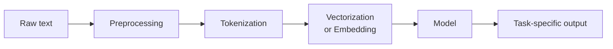

# NLP — Concepts and Mental Models

**Tokenization, embeddings, the NLP pipeline, classical foundations (TF-IDF, naive Bayes). With worked examples.**

---

> **Build on the foundations.** For transformer architecture (attention, multi-head, encoder/decoder), see [Transformers → Concepts](../transformers/02_Concepts.md). For backprop and training, see [Deep Learning → Concepts](../deep-learning/02_Concepts.md). This chapter focuses on what is **unique to NLP**: how text becomes numbers, the language-specific pipeline, and the classical methods that still ship in production.

---

## The NLP Pipeline — Same Shape Across All Modern Systems

Almost every NLP system, classical or modern, follows this pipeline:



The shape stayed the same as NLP went from rule-based → statistical → neural → transformer-based. Only the **model** stage changed dramatically. The infrastructure around it (tokenization, vectorization, postprocessing) is more durable than the model architecture itself.

---

## Tokenization — From Text to Tokens

Text is a sequence of characters; models operate on integer IDs. **Tokenization** is the conversion.

### Three Common Schemes

| Scheme | How It Works | Where Used |
|---|---|---|
| **Word-level** | One token per word; OOV (out-of-vocabulary) handling needed | Classical NLP, simple systems |
| **Character-level** | One token per character | Some specialized models |
| **Subword** (BPE, WordPiece, SentencePiece) | Tokens are pieces of words, learned from data | All modern transformers |

The 2026 default is **BPE (Byte-Pair Encoding)** or its descendants. Word "tokenization" might split into `["token", "ization"]`. Common words become a single token; rare words split into multiple subwords.

### BPE — How It Builds the Vocabulary

BPE starts with characters and iteratively merges the most frequent pair:

1. Start with a vocabulary of all individual characters
2. Count adjacent character pairs across the training corpus
3. Merge the most frequent pair into a new token
4. Repeat until the vocabulary reaches the desired size (typically 30K-200K)

Example:

```
Start:        l, o, w, e, r, n, g, ...
Iteration 1:  most frequent pair = ("l", "o") → merge to "lo"
Iteration 2:  most frequent pair = ("lo", "w") → merge to "low"
Iteration 3:  most frequent pair = ("e", "r") → merge to "er"
...
```

Final tokens for "lower": `["lower"]` (single token after enough merges)
Final tokens for "lowest": `["low", "est"]`
Final tokens for "newer" (less common): `["n", "e", "w", "er"]`

**Why BPE wins.** Vocabulary stays bounded. Rare/new words decompose into known pieces. No OOV (out-of-vocabulary) problem — any text can be tokenized.

The companion notebook ([NLP_From_Scratch.ipynb](https://colab.research.google.com/github/sunilmogadati/systems-in-production/blob/main/implementation/notebooks/NLP_From_Scratch.ipynb)) implements BPE from scratch on a tiny corpus.

### Tokenization Affects Everything Downstream

| Decision | Implication |
|---|---|
| Vocabulary size | Larger = more tokens but better coverage; typical 30K-200K |
| Tokenizer language coverage | English-trained tokenizers split non-English text into many small pieces; multilingual tokenizers handle this better |
| Special tokens | `[CLS]`, `[SEP]` for BERT; `<|endoftext|>` for GPT; bake your specials in correctly |
| Casing | Cased vs uncased tokenizers; matters for entities and proper nouns |

Most projects use the tokenizer that ships with their pretrained model. Don't try to train your own unless you have a reason.

---

## From Tokens to Vectors — Three Approaches

### 1. Bag of Words (BoW)

The simplest. Each document is a vector of token counts:

```
Document: "the cat sat on the mat"
Vocabulary: ["the", "cat", "sat", "on", "mat", "dog"]
Vector:    [2, 1, 1, 1, 1, 0]
```

**Strengths:** trivial to compute; interpretable; works for many tasks.
**Weaknesses:** loses word order; massive sparse vectors for large vocabularies; treats "good" and "great" as completely unrelated.

### 2. TF-IDF (Term Frequency-Inverse Document Frequency)

Improvement on BoW: weight tokens by how distinctive they are.

```
TF-IDF(t, d, D) = TF(t, d) × log(|D| / DF(t))
```

Where:
- **TF(t, d)** = how often term `t` appears in document `d`
- **DF(t)** = how many documents contain term `t`
- **|D|** = total number of documents

The IDF (Inverse Document Frequency) term penalizes words that appear in many documents (like "the", "and") and boosts words distinctive to specific documents.

**Strengths:** captures importance better than raw counts; still simple and fast.
**Weaknesses:** still loses word order and semantic relationships.

**Production reality:** TF-IDF + a simple classifier (logistic regression, naive Bayes, SVM) is the **best baseline** for any text classification task. It is fast, interpretable, and surprisingly hard to beat with small datasets.

### 3. Dense Embeddings — The Modern Approach

Each token (or document) maps to a learned vector in a continuous space, where similar meanings end up near each other.

| Method | Year | What It Produces |
|---|---|---|
| **Word2Vec** | 2013 | One vector per word; learned by predicting context words |
| **GloVe** | 2014 | Word vectors learned from co-occurrence matrices |
| **fastText** | 2016 | Word2Vec + subword info (handles unseen words) |
| **BERT embeddings** | 2018+ | Contextual — same word gets different vectors in different contexts |
| **Sentence-transformers** | 2019+ | Vectors per sentence/paragraph, optimized for similarity |
| **Modern API embeddings** | 2024+ | OpenAI text-embedding-3, Cohere Embed, etc. |

The 2026 default for NLP applications: **use a pretrained sentence-transformer or API embedding** for retrieval/classification, **use BERT/decoder hidden states** for fine-tuning tasks.

### The Word2Vec Insight (Brief)

Word2Vec showed that vectors learned by a simple objective ("predict surrounding words") capture semantic relationships:

```
king − man + woman ≈ queen
Paris − France + Italy ≈ Rome
walking − walked + ran ≈ running
```

The vectors live in a space where directions correspond to semantic concepts. This intuition transferred to all subsequent NLP — **modern embeddings preserve and improve on it**.

---

## A Worked Example — TF-IDF on a Tiny Corpus

Three documents:

```
D1: "the cat sat on the mat"
D2: "the dog sat on the floor"
D3: "cats and dogs are pets"
```

After basic preprocessing (lowercase, remove punctuation):

| Document | Tokens |
|---|---|
| D1 | the, cat, sat, on, the, mat |
| D2 | the, dog, sat, on, the, floor |
| D3 | cats, and, dogs, are, pets |

### Step 1: Build vocabulary

`["the", "cat", "sat", "on", "mat", "dog", "floor", "cats", "and", "dogs", "are", "pets"]` — 12 unique tokens.

### Step 2: Compute Term Frequency (TF)

For each (document, term), count occurrences:

| Term | TF in D1 | TF in D2 | TF in D3 |
|---|---:|---:|---:|
| the | 2 | 2 | 0 |
| cat | 1 | 0 | 0 |
| sat | 1 | 1 | 0 |
| on | 1 | 1 | 0 |
| mat | 1 | 0 | 0 |
| dog | 0 | 1 | 0 |
| floor | 0 | 1 | 0 |
| cats | 0 | 0 | 1 |
| and | 0 | 0 | 1 |
| dogs | 0 | 0 | 1 |
| are | 0 | 0 | 1 |
| pets | 0 | 0 | 1 |

### Step 3: Compute Document Frequency (DF) and IDF

`|D| = 3` documents. For each term:

| Term | DF | IDF = log(3/DF) |
|---|---:|---:|
| the | 2 | log(3/2) ≈ 0.41 |
| cat, mat, dog, floor | 1 each | log(3/1) ≈ 1.10 |
| sat, on | 2 each | 0.41 |
| cats, and, dogs, are, pets | 1 each | 1.10 |

The word "the" appears in 2 documents, so its IDF is low (~0.41) — it carries less information.
The word "cat" appears in 1 document, so its IDF is high (~1.10) — it is more distinctive.

### Step 4: Compute TF-IDF

For each (document, term), multiply TF × IDF:

```
TF-IDF for D1:
  the: 2 × 0.41 = 0.82
  cat: 1 × 1.10 = 1.10
  sat: 1 × 0.41 = 0.41
  on:  1 × 0.41 = 0.41
  mat: 1 × 1.10 = 1.10
  (everything else: 0)

D1 vector = [0.82, 1.10, 0.41, 0.41, 1.10, 0, 0, 0, 0, 0, 0, 0]
```

**Notice.** The "characteristic" words for D1 (cat, mat) get high scores. The word "the" gets a moderate score despite appearing twice — IDF discounts it.

This 12-dim vector now represents D1. Use it as input to a classifier (logistic regression, SVM, naive Bayes), or compute cosine similarity to other documents for retrieval.

The companion notebook runs this exact computation in NumPy, then trains a TF-IDF + LogisticRegression sentiment classifier on a small dataset.

---

## Naive Bayes for Text Classification

The classical baseline for text classification. Surprisingly effective for spam filters, simple sentiment, and topic classification.

### The Idea

Compute, for each class C, the probability `P(C | document) ∝ P(document | C) · P(C)` using Bayes' rule.

The "naive" assumption: words in the document are conditionally independent given the class. This is not true (words depend on each other), but it works empirically.

```
P(C | doc) ∝ P(C) · ∏ P(word_i | C)
```

For each class, compute:
- `P(C)` = fraction of training docs of class C
- `P(word | C)` = (count of word in class-C docs + smoothing) / (total words in class-C docs + smoothing × vocab size)

At inference: compute `P(C | doc)` for every class, pick the highest.

### Worked Example — Spam Detection

```
Training:
  Spam:    ["buy now cheap", "free money click"]
  Not spam: ["meeting tomorrow", "lunch at noon"]

P(Spam) = 2/4 = 0.5
P(Not spam) = 0.5

Vocabulary: [buy, now, cheap, free, money, click, meeting, tomorrow, lunch, at, noon]

Word counts:
  Spam: buy=1, now=1, cheap=1, free=1, money=1, click=1, others=0 (total=6 words)
  Not spam: meeting=1, tomorrow=1, lunch=1, at=1, noon=1, others=0 (total=5 words)

With Laplace smoothing (α=1):
  P("buy" | Spam) = (1 + 1) / (6 + 11) = 2/17 ≈ 0.118
  P("meeting" | Spam) = (0 + 1) / (6 + 11) = 1/17 ≈ 0.059
  ...

New document: "buy cheap meeting"
P(Spam | doc) ∝ 0.5 · P("buy"|S) · P("cheap"|S) · P("meeting"|S)
            ∝ 0.5 · 0.118 · 0.118 · 0.059
            ∝ 4.1e-4

P(Not spam | doc) ∝ 0.5 · P("buy"|NS) · P("cheap"|NS) · P("meeting"|NS)
                 ∝ 0.5 · 0.063 · 0.063 · 0.125
                 ∝ 2.5e-4

Spam wins: classify as spam.
```

In production, work in log space to avoid numerical underflow. The companion notebook implements this end-to-end.

### When To Use Naive Bayes

| Use Case | Why |
|---|---|
| Strong baseline for any text classification | Always run it first; if a transformer beats it by less than 5%, naive Bayes might be the right choice |
| Real-time spam filtering | Microsecond inference |
| Embedded / edge classification | Tiny memory footprint |
| Highly explainable | Each word's contribution is inspectable |

When NOT to use:
- Tasks where word interactions matter (e.g., negation: "not good" should be negative)
- When you have abundant data and modern transformers will outperform

---

## Modern NLP — Where Transformers Fit

Once you have tokens and an embedding mechanism, transformers do the actual understanding/generation.

For the architecture mechanics (attention, multi-head, encoder/decoder), see [Transformers → 02 Concepts](../transformers/02_Concepts.md). The key NLP-relevant takeaways:

| Variant | NLP Task |
|---|---|
| **Encoder-only (BERT family)** | Classification, NER, sentence embeddings, search ranking |
| **Decoder-only (GPT family)** | Generation, chat, code completion, translation via prompts |
| **Encoder-decoder (T5, BART)** | Translation (legacy), summarization (mostly displaced by decoder-only) |

In 2026, **decoder-only models with good prompting handle most NLP tasks**. Encoder-only persists for embeddings and hot-path classification.

---

## Pre-Tokenization Considerations for Multilingual Text

Tokenizers trained on English-dominant data perform poorly on other languages. A Chinese sentence might split into single Chinese characters (one token each), making sequences much longer and more expensive to process.

| Problem | Mitigation |
|---|---|
| English-trained tokenizer chokes on non-English | Use a multilingual tokenizer (mBERT, XLM-R, multilingual LLMs) |
| Tokenizer treats one Chinese character as one token | Use BPE trained on Chinese, or subword-aware models |
| Right-to-left scripts (Arabic, Hebrew) | Most modern tokenizers handle this; verify in practice |
| Unicode normalization | Decide between NFKC (canonical) or other forms; consistent across train/test |

The 2026 production rule for multilingual NLP: **start with a multilingual model**. Don't try to fix monolingual models for non-English use cases.

---

## NLP Evaluation — More Than Accuracy

Different NLP tasks need different metrics. There is no single "is this NLP system good?"

| Task | Standard Metric |
|---|---|
| Classification | Precision, recall, F1 (per-class and macro/micro averaged) |
| NER (Named Entity Recognition) | F1 over entity spans (entity-level, not token-level) |
| Translation | BLEU (Bilingual Evaluation Understudy) — n-gram overlap |
| Summarization | ROUGE (Recall-Oriented Understudy for Gisting Evaluation) |
| Language modeling | Perplexity — exp(average negative log-likelihood per token) |
| Search / retrieval | MRR (Mean Reciprocal Rank), NDCG (Normalized Discounted Cumulative Gain) |
| Question answering (extractive) | Exact match, token-level F1 |
| Open-ended generation | LLM-as-judge, human preference |

For Chapter 04 on evaluation in detail, see [04 — How It Works](04_How_It_Works.md).

---

## Glossary — Quick Reference

### NLP-Specific Terms

| Term | Pronounced | Meaning |
|---|---|---|
| **Token** | — | The smallest unit a model operates on (often a subword) |
| **Tokenization** | — | Converting text to integer token IDs |
| **BPE** | "B-P-E" | Byte-Pair Encoding — subword tokenization scheme |
| **TF-IDF** | "T-F-I-D-F" | Term Frequency × Inverse Document Frequency — classical text vectorization |
| **n-gram** | "N-gram" | Sequence of N consecutive tokens (bigram = 2, trigram = 3) |
| **OOV** | "O-O-V" | Out-Of-Vocabulary — token not seen in training |
| **Embedding** | — | Dense vector representation of a token, sentence, or document |
| **Word2Vec** | "Word-to-vec" | Classical method for learning word embeddings |
| **GloVe** | "glove" | Global Vectors for Word Representation |
| **NER** | "N-E-R" | Named Entity Recognition — find entities (persons, orgs, locations) |
| **POS** | "P-O-S" | Part-Of-Speech tagging |
| **BLEU** | "blue" | Bilingual Evaluation Understudy — translation quality metric |
| **ROUGE** | "rooge" | Recall-Oriented Understudy for Gisting Evaluation — summarization metric |
| **Perplexity** | "per-PLEX-ih-tee" | exp(avg neg log-likelihood); how "surprised" the model is |
| **MRR** | "M-R-R" | Mean Reciprocal Rank — retrieval quality |
| **Stop words** | — | Common words (the, and, of) often removed in classical NLP |
| **Stemming** | — | Reduce words to their stem (running → run) — classical preprocessing |
| **Lemmatization** | — | Reduce words to their lemma (better → good) — more sophisticated stemming |
| **WordPiece** | — | Tokenization scheme used by BERT |
| **SentencePiece** | — | Language-agnostic subword tokenizer |
| **Subword** | — | Token smaller than a word (e.g., "tokenization" → ["token", "ization"]) |

For full cross-architecture glossary, see [Architecture Glossary](../architecture-glossary.md).

---

**Next:** [03 — Hello World](03_Hello_World.md) — Build a sentiment classifier two ways: classical (TF-IDF + logistic regression) and modern (BERT fine-tune).
