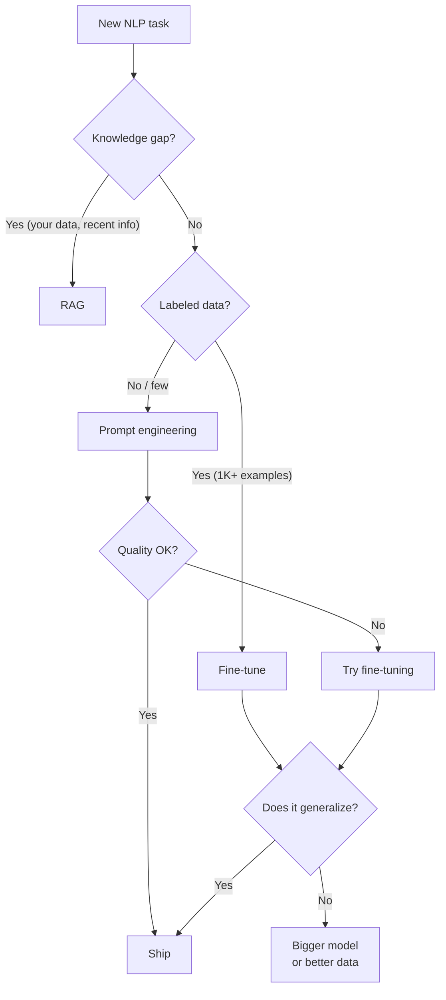

# NLP — How It Works

**Embedding geometry, the fine-tune vs prompt vs RAG decision, NLP-specific evaluation metrics. The patterns that distinguish working NLP systems from broken ones.**

---

## Why Embedding Geometry Matters

Modern NLP runs on vectors in a high-dimensional space. The geometry of that space — **which directions correspond to what concepts** — determines what the model can do.

### What Word2Vec Showed

Word2Vec (2013) demonstrated that simple training objectives produce vectors with surprising structure:

```
king − man + woman ≈ queen
Paris − France + Italy ≈ Rome
walking − walked + ran ≈ running
```

This is not just a curiosity. It means **directions in the space encode semantic concepts**. The "gender" direction is `man → woman`. The "capital city" direction is `country → its capital`. Vector arithmetic does analogical reasoning.

### Modern Embeddings — The Same Idea, Better Vectors

BERT, sentence-transformers, OpenAI text-embedding-3, Cohere Embed all produce vectors with similar geometric properties:
- Semantically similar text → vectors close together
- Different topics → orthogonal directions
- Languages → can share or separate (depending on training)

**For retrieval**, this is the foundation: embed query and documents, compute cosine similarity, return nearest. See [RAG playbook](../rag/) for details.

**For classification**, this is what makes pretrained models so transferable: the embeddings capture general language structure that transfers to any specific task.

---

## Visualizing Embedding Spaces

Embedding spaces have hundreds to thousands of dimensions. To inspect them:

| Technique | What It Does |
|---|---|
| **PCA (Principal Component Analysis)** | Project onto top variance directions; preserves global structure |
| **t-SNE** | Non-linear projection; preserves local clusters; good for visualization |
| **UMAP** | Faster t-SNE alternative; preserves both local and global structure |

In a well-trained space, similar items cluster:
- Movie reviews cluster by sentiment
- News articles cluster by topic
- Product descriptions cluster by category

When clusters look mushy, **the embedding model is wrong for the task**. Switch to a model fine-tuned on more relevant data.

---

## The Fine-tune vs Prompt vs RAG Decision

For any NLP task, you have three main approaches:



### When To Use Each

| Approach | Best For | Cost | Time |
|---|---|---|---|
| **Prompt engineering** | Tasks expressible in natural language; rapid iteration | API costs only | Hours |
| **Few-shot prompting** | When zero-shot isn't quite right | Slightly higher (longer prompts) | Hours |
| **RAG** | Knowledge-grounded Q&A; reduces hallucination | Embedding storage + retrieval + LLM | Days to set up |
| **Fine-tuning (LoRA)** | Custom behavior, format consistency, style | Hundreds of dollars | Days |
| **Full fine-tuning** | When LoRA hits a ceiling | Thousands of dollars | Days to weeks |
| **Pretraining** | Almost never for production teams | Millions of dollars | Months |

The 2026 production pattern: **try prompts first**. Many tasks are solved without any training. If quality plateaus, add RAG (knowledge) or fine-tune (style/format).

---

## Prompt Engineering Patterns

The patterns that consistently improve LLM output quality:

### 1. Few-Shot Examples

Show the model what good output looks like:

```
Classify sentiment of customer reviews. Examples:

Review: "Loved every minute!"  →  positive
Review: "Total waste of money"  →  negative
Review: "It was okay"           →  neutral

Now classify:
Review: "{user_input}"
```

Far more reliable than zero-shot for many tasks. 3-5 examples usually suffice.

### 2. Chain-of-Thought (CoT)

For multi-step reasoning, ask the model to show its work:

```
Question: A bag has 5 red balls and 3 blue balls. Two are drawn at random. What is the probability both are red?

Think step-by-step before answering.
```

Without CoT, the model may guess wrong. With CoT, it reasons through the steps and gets it right more often.

### 3. Structured Output

For machine-consumable outputs, request JSON or specific schemas:

```
Extract the following information from the email:
- recipient: string
- date: ISO 8601 date
- amount: number in USD

Respond with ONLY valid JSON. No explanations.

Email: {email_text}
```

Modern LLMs support this natively. OpenAI has "response_format=json_object" mode; Anthropic has tool use; many open models support similar.

### 4. Role / Persona

Set a persona for consistent voice:

```
You are a senior customer support agent. Tone: empathetic but professional.
Always offer a concrete next step.

User message: {message}
```

### 5. Constrain the Output Space

Especially for classification:

```
Classify the user message as exactly ONE of:
- billing
- technical
- account
- other

Respond with one word, nothing else.
```

This dramatically reduces parsing errors and accidental verbosity.

### Iterating on Prompts

Treat prompts as code. Track them in version control. A/B test changes. Maintain an eval set of test prompts that exercise edge cases — run before every prompt change.

---

## Fine-tuning vs Prompting — When Fine-tune Wins

Fine-tuning is more work than prompting. When does it earn its keep?

| Sign Fine-tuning Is Right | Why |
|---|---|
| Output format must be perfectly consistent | A fine-tuned model learns your format; prompted models drift |
| Voice / style must match brand precisely | Same — fine-tuning embeds the style |
| Latency matters and you cannot use prompts that long | Smaller fine-tuned model > prompted larger model |
| You have abundant labeled data | The labels carry information prompts cannot |
| You need to deploy on-device | Fine-tuned small models can run on phones |

If none of these apply, **prompts are usually sufficient**. Don't fine-tune by default.

---

## NLP-Specific Evaluation

Different NLP tasks need different metrics. Treat each carefully.

### Classification Metrics

For binary or multi-class:

| Metric | Formula | When To Optimize |
|---|---|---|
| Accuracy | (TP+TN) / total | Balanced classes, all errors equal |
| Precision | TP / (TP+FP) | False positives are costly (e.g., spam blocking legitimate mail) |
| Recall | TP / (TP+FN) | False negatives are costly (e.g., missing a fraud case) |
| F1 | Harmonic mean of P and R | Balance both |
| Macro-F1 | Average of per-class F1 | Imbalanced data; treat each class equally |
| Weighted F1 | F1 weighted by class size | Imbalanced data; respect class frequency |

For NER (Named Entity Recognition), use **entity-level F1**: an entity is correct only if its **span and type both match**. Token-level F1 over-credits partial matches.

### Translation: BLEU

**BLEU (Bilingual Evaluation Understudy)** measures n-gram overlap between the model's translation and reference translations.

```
BLEU = brevity_penalty × exp(sum of weighted log n-gram precision)
```

| BLEU Score | Quality |
|---|---|
| < 10 | Almost useless |
| 20-30 | Understandable but with significant errors |
| 30-40 | Solid, with some errors |
| 40-50 | High quality |
| 50+ | Better than human (rare; usually means BLEU is gamed) |

**BLEU caveat**: it penalizes valid paraphrases. For modern translation systems, BLEU is necessary but not sufficient — also use human evaluation.

### Summarization: ROUGE

**ROUGE (Recall-Oriented Understudy for Gisting Evaluation)** measures n-gram overlap between model summary and reference summaries.

| Variant | What It Measures |
|---|---|
| ROUGE-1 | Unigram overlap |
| ROUGE-2 | Bigram overlap |
| ROUGE-L | Longest common subsequence |

ROUGE shares BLEU's caveats — penalizes valid paraphrases. For modern summarizers, supplement with LLM-as-judge or human evaluation.

### Language Modeling: Perplexity

**Perplexity** = exp(average negative log-likelihood per token). How "surprised" the model is by held-out text.

| Perplexity | Quality |
|---|---|
| 1 | Perfect (impossible) |
| < 10 | Excellent for the task |
| 10-30 | Good |
| 30-100 | Mediocre |
| > 100 | Poor |

Perplexity is for language modeling. **It does not measure usefulness or correctness.** A model with 5 perplexity might still be unhelpful for your task. Use it to compare two models on the same data, not as an absolute quality indicator.

### Retrieval: MRR and NDCG

**MRR (Mean Reciprocal Rank)** — for the first relevant result, what is its rank?

```
MRR = mean over queries of (1 / rank_of_first_relevant)
```

If the first relevant result is at rank 1, MRR contribution is 1. If at rank 5, contribution is 0.2.

**NDCG (Normalized Discounted Cumulative Gain)** — credits relevance with diminishing weight by rank. More sophisticated than MRR.

Both are standard for search and retrieval.

### Open-Ended Generation: LLM-as-Judge + Human

For chat, summarization, creative generation, no automated metric is sufficient. The 2026 standard:

1. **Automated metrics** for regression detection (catch when something gets worse)
2. **LLM-as-judge** at scale (sample production traffic, grade with a strong evaluator)
3. **Human evaluation** for high-stakes decisions (model launches, A/B tests)

LLM-as-judge has known biases (prefers longer/more verbose, prefers its own family). Use multiple judges (GPT-4 + Claude + Llama) to triangulate.

---

## Common NLP Failure Modes

### 1. Domain Shift

Training data distribution differs from production. Examples:

- Trained on news articles, deployed on social media (very different style)
- Trained on customer support tickets from 2020, deployed in 2026 (vocabulary drifted)
- Trained on US English, deployed globally

**Mitigation**: collect representative production data; periodic retraining; domain-specific fine-tuning.

### 2. Tokenizer Mismatch in Multilingual

A tokenizer trained on English splits non-English text into many small pieces, dramatically increasing sequence length and reducing quality.

**Mitigation**: use a multilingual tokenizer / model from the start.

### 3. Confidence Miscalibration

Model says "95% confident" but is right only 70% of the time. Downstream confidence-based logic breaks.

**Mitigation**: temperature scaling on the output logits; isotonic calibration.

### 4. Negation and Sarcasm

"This movie was NOT good" — classical models often miss the negation and predict positive. "This movie was 'great'" — sarcasm flips meaning.

**Mitigation**: modern transformers handle negation better; explicit testing for sarcasm; fine-tune on examples that include negations and sarcasm.

### 5. Out-of-Distribution Inputs

Inputs in a language the model wasn't trained on, or in a domain it has no exposure to. Outputs can be confidently wrong.

**Mitigation**: input validation; confidence thresholds; route to human reviewer.

### 6. Length Sensitivity

Model trained on 100-word inputs deployed on 1,000-word documents (or vice versa). Performance degrades.

**Mitigation**: chunk long documents; use models with appropriate context length; truncate consistently between train and inference.

---

## A Debugging Workflow for NLP Systems

When NLP quality is below target:

| # | Check | How |
|---|---|---|
| 1 | **Is the data correct?** | Print 10 raw inputs + their labels. Are the labels right? |
| 2 | **Is the tokenization sensible?** | Print tokenized version of sample inputs. Does it look right for the language/domain? |
| 3 | **Is class balance reasonable?** | `Counter(labels)` — is one class dominating? |
| 4 | **Are there obvious patterns the model misses?** | Look at false positives and false negatives. What did they have in common? |
| 5 | **Is the metric the right one?** | If accuracy looks good but production fails, you're optimizing the wrong metric |
| 6 | **Domain shift?** | Compare embedding distributions for train vs production data |
| 7 | **Calibration off?** | Plot confidence vs accuracy by bucket |
| 8 | **Tokenizer matched the model?** | Verify tokenizer name = model's expected tokenizer |

> **The 100-example audit.** Before any complex debugging, sample 100 production failures and read them. The pattern usually emerges in the first 20.

---

**Next:** [05 — Building It](05_Building_It.md) — Model selection (BERT, GPT, T5 families), API vs self-host, multilingual considerations, prompt engineering patterns at scale.
