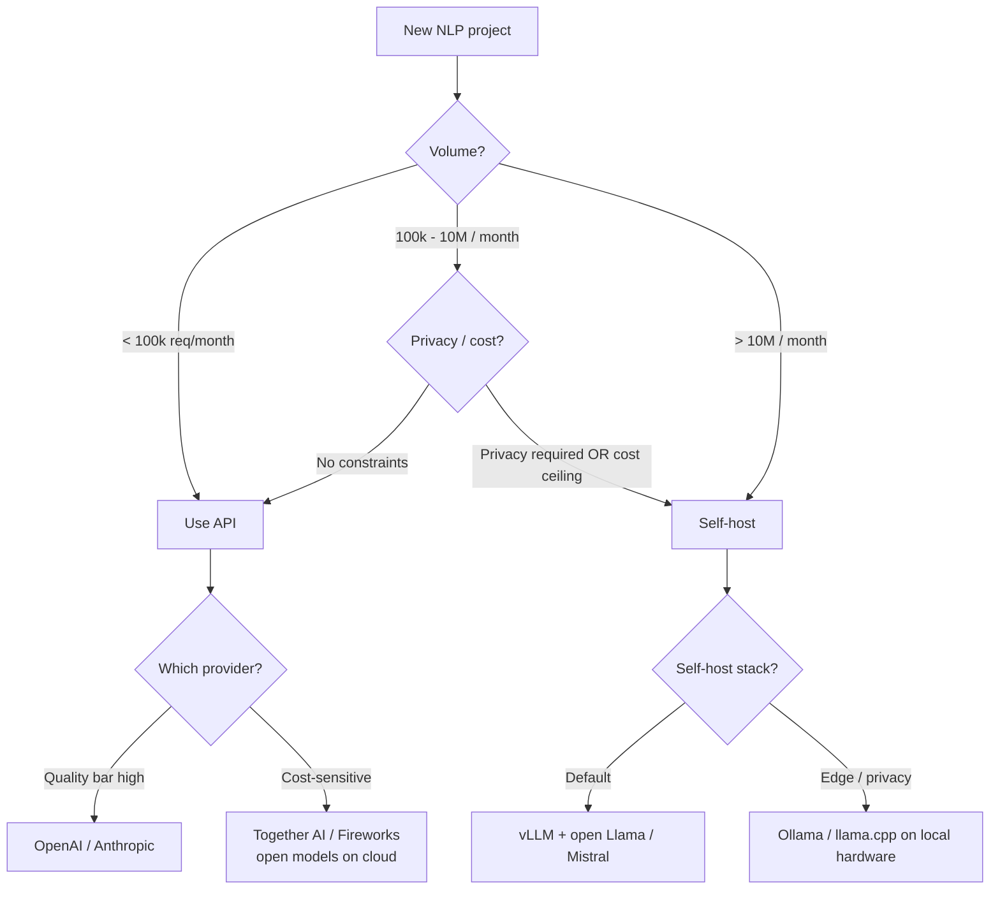

# NLP — Building It

**Model selection (BERT, GPT, T5 families). API vs self-host. Multilingual considerations. Prompt engineering patterns at scale.**

---

## Model Selection in 2026

The NLP model landscape has consolidated into a handful of families, each with a clear use case.

### Encoder-Only Family (BERT and Friends)

For classification, NER, embeddings, retrieval ranking.

| Model | Year | Notes |
|---|---|---|
| **BERT-base** | 2018 | Original; 110M params; the foundation |
| **RoBERTa** | 2019 | Better-trained BERT; usually beats BERT |
| **DistilBERT** | 2019 | 60% size, ~95% performance |
| **DeBERTa-v3** | 2021 | Strong on classification benchmarks |
| **ModernBERT** | 2024 | Updated architecture, longer context, faster |
| **mBERT, XLM-R** | 2018-2019 | Multilingual variants |

For most text classification tasks: **DeBERTa-v3-base or RoBERTa-base** as the starting point. For multilingual: **XLM-R**.

### Decoder-Only Family (GPT and Friends)

For chat, generation, code, agents.

| Model | Year | Notes |
|---|---|---|
| **GPT-4o, Claude 4, Gemini 2** | 2024-2025 | Closed frontier — best quality |
| **Llama 3.1, 3.3** | 2024-2025 | Open; 8B, 70B, 405B variants |
| **Mistral** (various) | 2024+ | Open; competitive small/medium models |
| **Qwen 2.5** | 2024+ | Strong multilingual open model |
| **Phi-3-mini** | 2024 | Tiny (3.8B); on-device |
| **DeepSeek V3, R1** | 2024-2025 | Open; competitive on reasoning |
| **Reasoning models** (o1/o3, Claude w/ thinking) | 2024+ | High-end reasoning at higher cost |

For most generation tasks: **start with GPT-4o-mini or Claude Haiku** (cheap, capable) and only escalate to larger models if quality insufficient. For self-host: **Llama 3.1 8B or 70B** depending on quality needs.

### Encoder-Decoder Family (T5 and Friends)

For seq-to-seq tasks (translation, summarization).

| Model | Year | Notes |
|---|---|---|
| **T5, Flan-T5** | 2019, 2022 | Original encoder-decoder; instruction-tuned variant |
| **BART** | 2019 | Strong on summarization |
| **mT5, NLLB** | 2020-2022 | Multilingual translation |

In 2026, **encoder-decoder is largely displaced** for new work — decoder-only with prompts handles most seq-to-seq. T5/BART persist for narrow specialized use (e.g., NLLB-200 for translation between low-resource languages).

### Sentence Embedding Models (Specialized Encoders)

For retrieval, clustering, similarity.

| Model | Year | Notes |
|---|---|---|
| **all-MiniLM-L6-v2** | 2021 | Tiny, fast, good baseline |
| **BGE (Beijing Academy)** | 2023+ | Strong open embeddings |
| **OpenAI text-embedding-3** | 2024 | API-based; high quality |
| **Cohere Embed v3** | 2023+ | API-based; strong multilingual |
| **gte, e5** | 2023+ | Open competitive alternatives |

For RAG and search: pick BGE or OpenAI text-embedding-3 for English; multilingual-e5 or Cohere for multilingual.

---

## API vs Self-Host — A Decision Framework



### Detailed Cost Crossover

For a sentiment classifier processing 10M requests/month with avg 200 input + 50 output tokens:

| Setup | Cost / Month |
|---|---|
| GPT-4o-mini API | ~$5,500 |
| Claude Haiku API | ~$2,000 |
| Together AI Llama 3.1 8B | ~$1,200 |
| Self-hosted Llama 3.1 8B (cloud GPU) | ~$500-1,500 |
| Self-hosted DistilBERT (single CPU node) | ~$50 |

For pure classification, fine-tuned small models crush LLM API costs. For generation tasks, the gap narrows.

**Rule of thumb**: at 10M req/month, self-hosting becomes seriously worth evaluating. Below that, APIs save engineering time worth more than the inference cost.

---

## Multilingual NLP

If your product serves users in multiple languages, plan for it from day one.

### The Multilingual Spectrum

| Approach | When |
|---|---|
| **English-only model** | Acceptable for English-speaking-only product |
| **Translate-then-process** | Pass non-English text through a translator first; process English version. Loses fidelity. |
| **Multilingual model** (XLM-R, mBERT, Aya, multilingual Llama) | Handles many languages natively. Right answer for most multilingual products. |
| **Per-language models** | Specialized per-language fine-tunes; high quality, high maintenance |

### Multilingual Pitfalls

| Pitfall | Mitigation |
|---|---|
| Quality varies dramatically across languages | Always evaluate per-language; track separately in production |
| Tokenizer biases sequence length | Multilingual tokenizers help; budget for longer sequences in non-Latin scripts |
| Low-resource languages get poor quality | Either accept degradation, route to specialized models, or invest in per-language fine-tuning |
| Cultural context differs | A "polite" tone differs across cultures. Test with native speakers. |
| Right-to-left scripts | Most modern stacks handle this; verify rendering, tokenization, generation |

In 2026, the practical rule: **if your product serves > 5 languages, use a multilingual LLM (Llama 3.1 multilingual, Qwen 2.5, Aya 23) and evaluate per language**.

---

## Prompt Engineering at Production Scale

Beyond the basic patterns from [Chapter 04](04_How_It_Works.md), production prompts have additional concerns:

### 1. Prompt Templates and Versioning

Treat prompts as code. Each prompt is a versioned artifact:

```python
# prompts/sentiment_v3.txt
You are a sentiment classifier. Classify the user message as exactly ONE of:
positive, negative, neutral.

Reply with only the label. No explanation.

User message: {text}
```

Track which prompt version generated each output. A/B test prompt changes. Maintain an eval suite of test inputs that runs before any prompt change.

### 2. Few-Shot Selection — Don't Hardcode

Static few-shot examples baked into a prompt become stale. Modern systems retrieve few-shot examples dynamically based on the input:

```python
def build_prompt(user_message, example_db):
    similar_examples = retrieve_similar(user_message, example_db, k=3)
    examples_text = "\n".join(f"Input: {ex.input}\nOutput: {ex.output}" for ex in similar_examples)
    return f"Examples:\n{examples_text}\n\nNow classify:\nInput: {user_message}\nOutput:"
```

Dynamic few-shot dramatically improves quality on the long tail.

### 3. Constrained Decoding for Reliability

For structured output, use constraint mechanisms:

| Method | How |
|---|---|
| **Function calling / tool use** | Native API feature in OpenAI, Anthropic — model fills a function signature |
| **JSON mode** | Force valid JSON output |
| **Outlines / SGLang** | Open-source libraries that enforce arbitrary grammars |
| **Pydantic + retries** | Parse output as Pydantic; retry on parse failure |

For any system that downstream processes the LLM output as structured data, **always use a constraint mechanism**. Hoping the model produces valid JSON every time is not a strategy.

### 4. Chain-of-Thought Without User Visibility

For complex tasks, ask the model to reason in private, then produce a clean final answer:

```
Think step by step inside <thinking>...</thinking> tags.
Then produce your final answer outside the tags.
```

Strip the thinking tags before showing to users. The user sees a clean answer; the model's reasoning is preserved for logging and debugging.

### 5. Handling Failures Gracefully

When the LLM produces unparseable or absurd output:

```python
def classify_safely(text, max_retries=3):
    for attempt in range(max_retries):
        try:
            output = llm.generate(prompt(text))
            return parse(output)
        except (ValueError, AssertionError):
            continue
    return fallback(text)  # rule-based or "unknown" default
```

Production NLP needs fallbacks. The LLM will eventually return something unexpected.

---

## A Production-Ready Recipe (Decoder-Only Inference Service)

For a typical LLM-powered NLP service:

```python
# Pseudocode — production layout
class NLPService:
    def __init__(self):
        self.llm_client = LLMClient(api_key, model="gpt-4o-mini")
        self.embedder   = SentenceTransformer("all-MiniLM-L6-v2")
        self.classifier = load_pretrained("./bert_sentiment_v3")
        self.cache      = RedisCache()
        self.metrics    = PrometheusClient()

    def process(self, request):
        # 1. Cache check
        key = hash_prompt(request)
        if cached := self.cache.get(key):
            return cached

        # 2. Input validation
        if not is_valid(request.text):
            return {"error": "invalid input"}

        # 3. Safety filter
        if is_unsafe(request.text):
            return {"error": "blocked"}

        # 4. Route to appropriate model
        if request.task == "classify":
            result = self.classifier.predict(request.text)
        elif request.task == "embed":
            result = self.embedder.encode(request.text)
        elif request.task == "generate":
            result = self.llm_client.complete(prompt(request))
        else:
            return {"error": "unknown task"}

        # 5. Output filter
        if is_unsafe_output(result):
            return {"error": "filtered"}

        # 6. Cache + metrics
        self.cache.set(key, result, ttl=24*3600)
        self.metrics.record(request.task, latency)

        return result
```

### What Each Choice Buys

| Choice | Why |
|---|---|
| Multiple model types in one service | Different tasks need different models; LLMs for generation, BERT for classification, sentence-transformers for embedding |
| Prompt cache | Repeated queries don't recompute (RAG queries especially benefit) |
| Input + output filters | Cheap to run; catch obvious misuse early |
| Fallback on parse errors | LLMs occasionally return garbage; have a plan |
| Metrics per task | Understand which task is slow, which is failing |

---

## When to Switch Architectures

| Symptom | Switch To |
|---|---|
| Token cost dominates budget | Smaller model, cache more, fine-tune |
| Latency too high | Smaller model, distillation, edge deployment |
| Quality plateaus on prompting | Try fine-tuning |
| Quality plateaus on fine-tuning | Try a stronger base model OR add RAG |
| Multilingual quality is uneven | Switch to multilingual base; per-language fine-tune for critical languages |
| Format / structure unreliable | Function calling, JSON mode, constrained decoding |
| Model hallucinates | Add RAG; switch to reasoning model for complex tasks |

---

**Next:** [06 — Production Patterns](06_Production_Patterns.md) — Google Translate, Copilot autocomplete, customer support, search ranking, content moderation, NER at scale.
