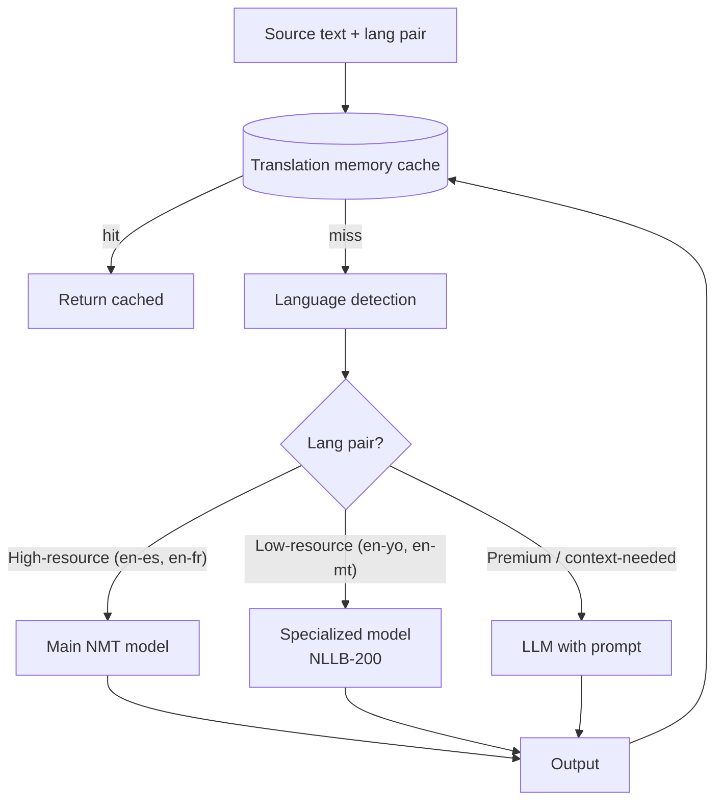
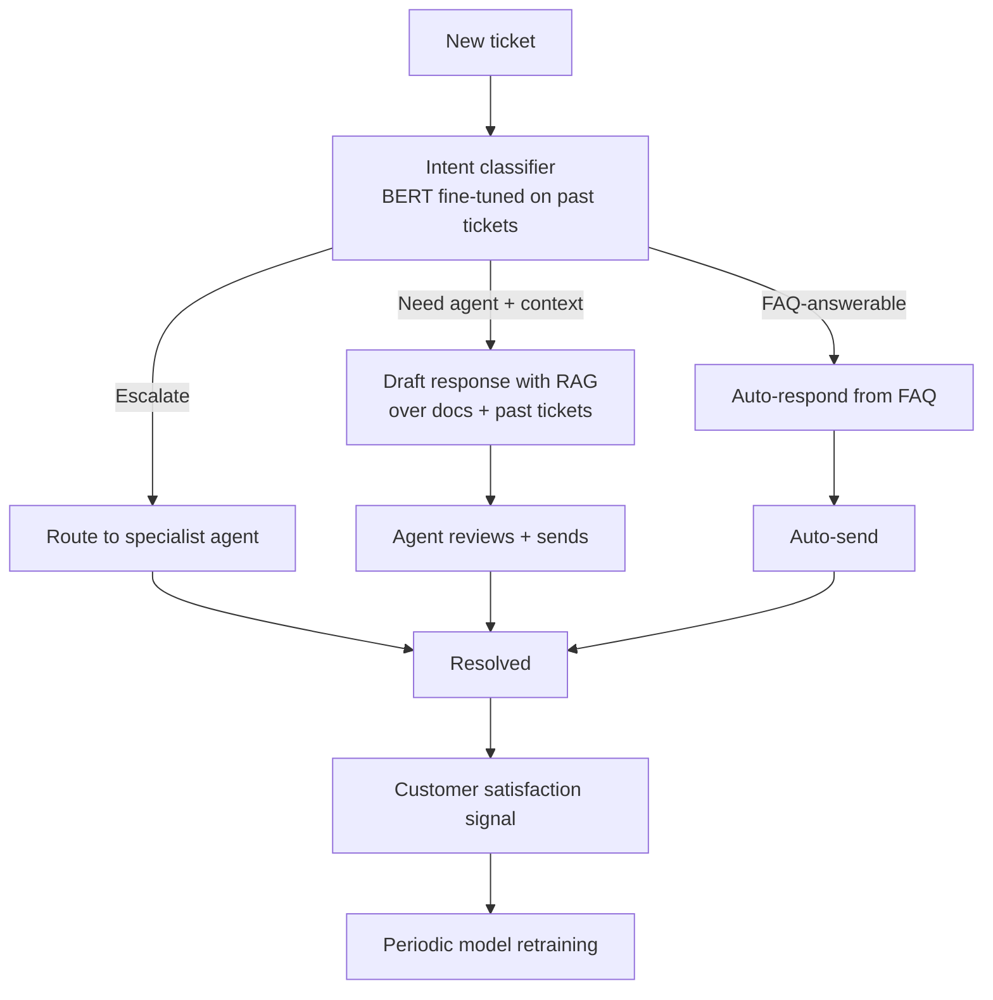
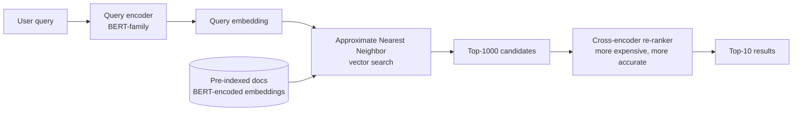
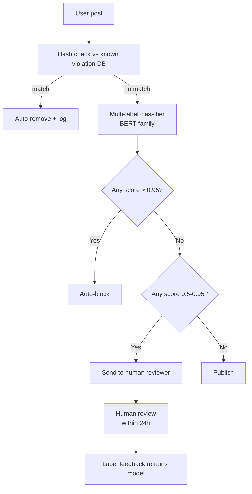

# NLP — Production Patterns

**Google Translate, GitHub Copilot autocomplete, customer support automation, search ranking, content moderation, NER at scale. Real systems, real architectures, real production tradeoffs.**

---

## Pattern 1: Google Translate — Multilingual at Web Scale

**The problem.** Translate any text, between 130+ language pairs, in milliseconds, for billions of queries per day, with reasonable quality across dozens of dialects.

**The architecture (publicly known).** Multiple model variants serving different traffic tiers:
- **Neural Machine Translation (NMT)** with encoder-decoder transformers as the core
- **NLLB-200** (Meta) and similar dedicated multilingual models for low-resource languages
- **LLM-as-translator** for high-quality / context-aware translation tiers
- **Pre-translation memory caches** for common phrases



**Production realities:**
- **Sub-second latency** for most pairs
- **Translation memory** — cache common phrases → "the company" appears in millions of documents, no need to retranslate
- **Domain detection** — legal, medical, technical text routes through specialized models
- **Quality across pairs varies dramatically** — English ↔ Spanish gets near-human; English ↔ Yoruba is significantly worse
- **Continuous evaluation** — humans rate output samples per pair, drives retraining

**Lesson.** **Translation is not "one model." It is a routing system.** The right model for English↔Spanish is not the right model for English↔Maltese. Production translation services manage dozens of model variants and route based on language pair, domain, and quality tier.

---

## Pattern 2: GitHub Copilot — Inline Code Completion

**The problem.** Suggest code completions inline in the IDE. Latency under 300ms. Quality high enough to be useful, not annoying. Privacy-respecting.

**The architecture.** Decoder-only transformer fine-tuned on code (Codex initially, then Code Llama / GPT-4 family). The product layer:

| Component | Role |
|---|---|
| **IDE integration** (VS Code, JetBrains) | Capture cursor context |
| **Context engineering** | Recent edits, current file, related files in repo, language metadata |
| **Latency-optimized inference** | Smaller specialized model for speed; route hard requests to larger model |
| **Acceptance telemetry** | Did the user accept? Edit? Reject? Drives metric for model selection |
| **Privacy controls** | Per-customer data segregation; opt-out flows |

**The non-obvious lesson.** **Context engineering matters more than model size.** GitHub's secret is not "we have a bigger model." It is "we figured out which 4K tokens to include in the context." Recent edits, signatures from related files, the user's coding style — getting these right is more impactful than scaling the model.

**Production realities:**
- **Median latency 100-200ms** for inline completions
- **Acceptance rate** as the north-star metric (~35% acceptance is healthy)
- **Continuous evaluation** — millions of suggestions per day produce a constant signal
- **Model variants** — larger model for "explain this code" requests, smaller for inline

**Lesson.** **For developer tools, latency dominates user experience.** A 50ms-faster suggestion that is 90% as accurate beats a 500ms-faster one that is 95% as accurate, because users abandon slow suggestions.

---

## Pattern 3: Customer Support Automation

**The problem.** A SaaS company with 50,000 support tickets per month. 80% are repetitive. Reduce average response time without hiring more agents.

**The architecture.** A multi-stage NLP pipeline:



**The components:**

| Stage | NLP Used |
|---|---|
| Triage / intent classification | Encoder-only transformer (DistilBERT) fine-tuned on labeled tickets |
| Knowledge retrieval | Sentence embeddings + vector DB; see [RAG playbook](../rag/) |
| Draft generation | LLM with RAG context |
| Sentiment / urgency detection | Classification head on the same embedder |
| Translation (multi-region) | Multilingual encoder-decoder for non-English tickets |

**Production realities:**
- **80% of tickets handled without human intervention** in mature deployments
- **Feedback loop is critical** — agent edits to the AI draft become training data
- **Per-customer customization** — each enterprise customer has their own knowledge base, voice, branding
- **Compliance** — for regulated industries (finance, healthcare), human review remains mandatory

**Real deployments.** Intercom Fin, Zendesk AI, Salesforce Einstein, custom internal tools at every major SaaS company.

**Lesson.** **Customer support automation is a workflow, not a model.** The components individually are well-understood; the integration into a workflow that respects agent autonomy and customer satisfaction is the engineering challenge.

---

## Pattern 4: Search Ranking — BERT in Google

**The problem.** When a user types "best italian restaurant near me," return results that match the *intent*, not just keyword overlap. At billion-query-per-day scale.

**The architecture.** Two-stage retrieval:



**The two stages:**

1. **Retrieval** (cheap): a bi-encoder (query encoder, document encoder) produces independent embeddings. ANN search finds top candidates fast.
2. **Re-ranking** (expensive): a cross-encoder takes (query, document) pairs and produces a fine-grained relevance score. Run only on the top candidates.

This two-stage pattern is standard in production search systems and RAG.

**Production realities:**
- **Google integrated BERT into search ranking in 2019** — affected ~10% of queries
- **Pre-indexing all documents through BERT is expensive** — billions of pages × forward pass
- **Re-ranker is where quality lives** — bi-encoders find candidates, cross-encoders rank them
- **Latency budgets are tight** — milliseconds for the retrieval, tens of milliseconds for re-ranking
- **Distilled variants** (DistilBERT, MiniLM) are common at scale due to cost

**Lesson.** **Encoder-only transformers are still alive.** For retrieval at scale, BERT-family models win on cost-per-prediction over decoder-only LLMs. **Don't reach for an LLM when an encoder is sufficient.**

---

## Pattern 5: Content Moderation at Platform Scale

**The problem.** Detect prohibited content (hate speech, harassment, threats, spam) in user-generated text. Process billions of items per day. Multiple categories per item. Constantly evolving adversarial users.

**The architecture:**



**Production patterns:**

| Pattern | Detail |
|---|---|
| **Multi-label classification** | A piece of content can be both hate speech AND harassment; not mutually exclusive |
| **Confidence-based routing** | High confidence → auto-action; medium → human; low → allow |
| **Per-category models** | Specialized models for different violation types (more accurate than one universal classifier) |
| **Adversarial training** | Periodic retraining on attempted-evasion patterns |
| **Multilingual coverage** | Hate speech in Hindi must be caught the same as in English |
| **Rapid iteration** | New trends emerge daily; retrain weekly or faster |

**Real deployments.** Meta, YouTube, X, Reddit, TikTok all run NLP classifiers at billion-item-per-day scale.

**Lesson.** **Confidence-based routing is more important than the model itself.** A 95% accurate model is fine if you have a human-review queue for the uncertain cases. A 99% accurate model deployed without human-in-the-loop ships incorrectly 1% of the time — at billion-scale, that is 10 million wrong decisions per day.

---

## Pattern 6: NER at Scale — Information Extraction

**The problem.** Extract structured information (people, organizations, locations, dates, monetary amounts) from unstructured text. Used in legal document analysis, financial document processing, medical records, news ingestion.

**The architecture.** Encoder-only transformer fine-tuned for token classification:

```
Input:  "Apple announced a $50 billion stock buyback on March 15."

Output:
  Apple → ORG
  $50 billion → MONEY
  March 15 → DATE
```

The model assigns one of N entity tags (or "O" for "outside") to each token using BIO (Beginning, Inside, Outside) tagging.

**Production realities:**

| Concern | Detail |
|---|---|
| **Domain-specific entities** | Generic NER does not catch domain entities (drug names, gene symbols, ticker symbols). Fine-tune. |
| **Span boundaries are subtle** | "Bank of America" is one entity. "Bank in America" is not. Models often disagree on boundaries. |
| **F1 at the entity level**, not token level | A partially-matched entity should NOT count as success |
| **Active learning loops** | Use the model to pre-label, humans correct, feed corrections back into training |
| **Cross-validation across domains** | Performance varies wildly — financial NER trained on news performs poorly on contracts |

**Real deployments.** Most major legal-tech, fintech, and healthcare-document companies have custom NER models for their domain. Standard libraries (spaCy, Stanza) provide good general-purpose NER; production usage adds domain-specific fine-tuning.

**Lesson.** **NER is one of the highest-ROI NLP applications**. It transforms unstructured text into structured data that downstream systems can act on. The barrier is getting labeled training data — once you have it, fine-tuning produces a high-quality model in days.

---

## Common Threads Across All Six

| Theme | Manifestation |
|---|---|
| **Pretrained + fine-tune wins** | None of these systems trains from scratch |
| **Routing > one big model** | Different inputs → different specialized models |
| **Confidence-based human-in-the-loop** | High confidence → automate; low → humans |
| **Continuous retraining** | Drift is the norm; pipelines must support it |
| **Per-segment metrics** | Overall accuracy hides per-language, per-domain failures |
| **Latency budgets matter** | Real-time use cases force smaller / faster models |
| **Workflow > model** | The integration into a product flow is more work than the model |

---

## What This Means for Your Project

Order of work for shipping an NLP system in production:

1. **Define the task** — classification, extraction, generation, retrieval, or a workflow combining several?
2. **Choose pretrained model** — encoder for classification/extraction/embedding; decoder for generation; multilingual if needed
3. **Collect or label data** — for fine-tuning or for evaluation
4. **Establish baseline** — try a classical method (TF-IDF + classifier) before committing to fine-tuning
5. **Fine-tune or prompt** — depending on data and task ([Chapter 05](05_Building_It.md))
6. **Build the routing layer** — confidence-based routing, fallbacks, human-in-the-loop
7. **Build evaluation** — automated metrics + LLM-as-judge + human review pipeline
8. **Plan inference infrastructure** — see [Chapter 07](07_System_Design.md)
9. **Plan observability + drift detection** — see [Chapter 09](09_Observability_Troubleshooting.md)
10. **Plan abuse / safety response** — see [Chapter 08](08_Quality_Security_Governance.md)

---

**Next:** [07 — System Design](07_System_Design.md) — Serving NLP at scale: classification batching, embedding pipelines, streaming generation, mixed-mode services.
