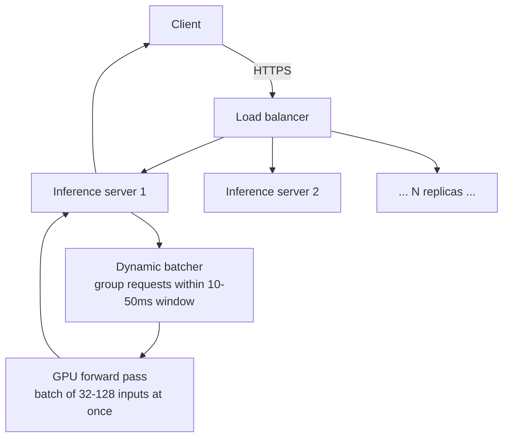
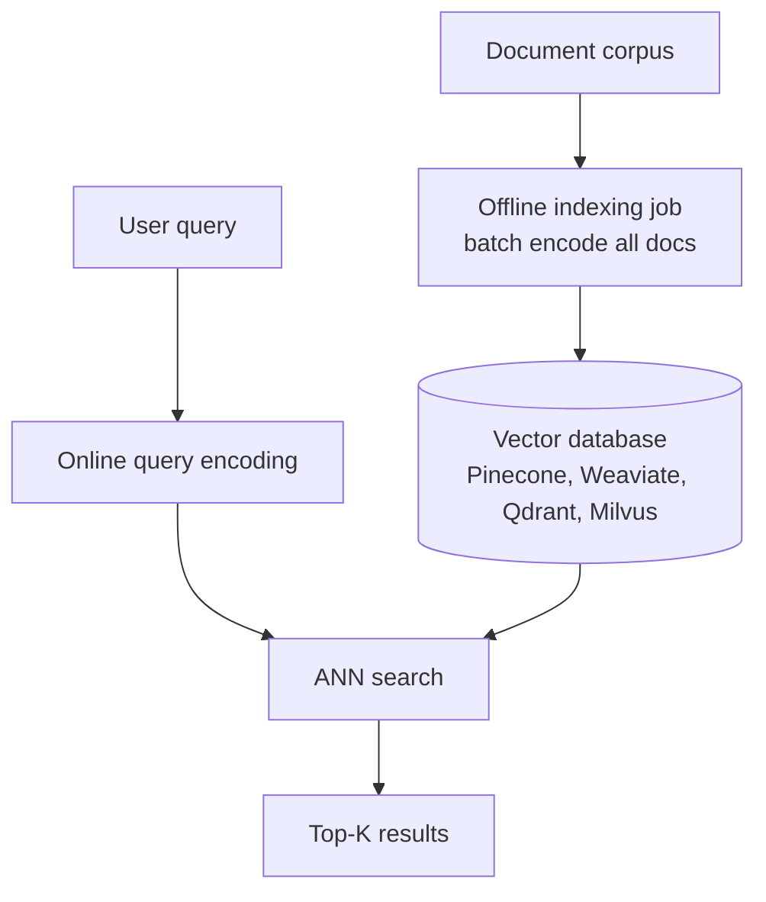
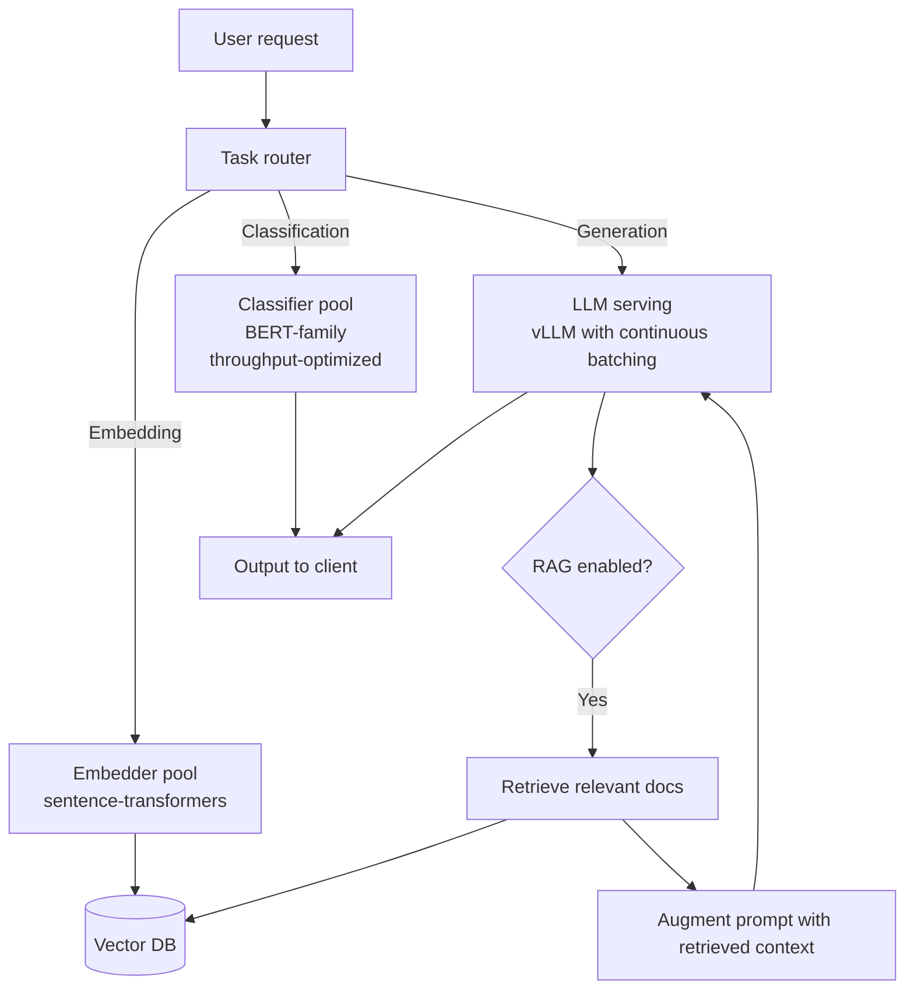
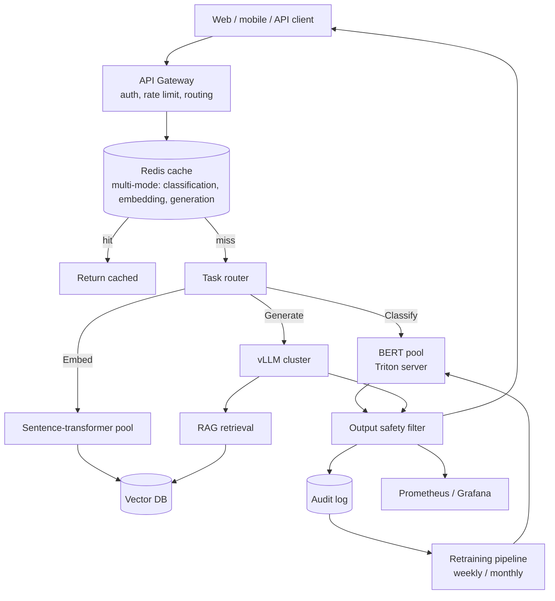

# NLP — System Design

**Serving NLP at scale: classification batching, embedding pipelines, streaming generation, mixed-mode services. The infrastructure that turns NLP models into production services.**

---

## NLP Workloads — Three Inference Modes

Most NLP systems fit one of three modes, each with different infrastructure needs:

| Mode | Examples | Optimization Target |
|---|---|---|
| **Classification / Extraction** | Sentiment, NER, intent | Throughput; latency under 100ms |
| **Embedding** | Search, RAG, clustering | Throughput; offline indexing + online query |
| **Generation** | Chat, completion, translation | Latency per token (streaming); KV-cache memory |

A single NLP product often combines all three. A customer support chatbot does intent classification (mode 1), retrieves relevant docs via embeddings (mode 2), and generates a response (mode 3).

---

## Classification Serving — Throughput-Driven

For classification, the model is small (BERT-base ~110M parameters), latency per inference is low (10-100ms), and throughput is the goal.

### Standard Architecture



**Key optimizations:**

| Optimization | Throughput Impact |
|---|---|
| **Dynamic batching** | 10-50x throughput; minor latency cost |
| **ONNX Runtime / TensorRT** | 2-5x throughput vs PyTorch |
| **INT8 quantization** | 2-4x throughput, ~1% accuracy loss |
| **Distillation** to smaller model | 2-5x throughput, can match accuracy |
| **CPU inference for tiny models** | Sometimes faster than GPU due to data transfer overhead |

### When CPU Inference Wins

For models under 100M parameters at throughput < 1000 requests/sec, **CPU inference can be cheaper than GPU**. The data transfer between CPU and GPU memory dominates for tiny models.

| Model | CPU Latency (single request) | GPU Latency (single request) |
|---|---|---|
| DistilBERT | 20ms | 8ms (after data transfer) |
| ALBERT | 15ms | 6ms |
| BERT-base | 60ms | 15ms |

CPU is ~$0.05/hour. GPU T4 is ~$0.35/hour. For low-throughput services, CPU economics win.

### Inference Server Choices

| Server | Best For |
|---|---|
| **NVIDIA Triton** | GPU serving with multiple model variants |
| **TorchServe** | PyTorch models, simpler than Triton |
| **ONNX Runtime Server** | Cross-platform, light, good CPU performance |
| **FastAPI + transformers** | Simple to start; will not scale past ~100 RPS |
| **Ray Serve** | Multi-stage inference pipelines |

For most teams: start with FastAPI for prototyping, move to Triton or TorchServe at production scale.

---

## Embedding Pipelines — Offline + Online

Embedding-based systems (search, RAG, clustering) split into two phases:



### Offline Indexing

| Concern | Detail |
|---|---|
| **Latency tolerance** | Hours; not user-facing |
| **Throughput target** | High; batch encode tens of thousands of docs at once |
| **Hardware** | Cloud GPU; usually 1-4 GPUs |
| **Scaling** | Linear with corpus size; redundancy for fault tolerance |
| **Update cadence** | Incremental for small changes; full rebuild for major model upgrades |

For a corpus of 10M documents:
- BGE-base or all-mpnet at full precision: ~2-4 hours on a single A100
- Smaller models (all-MiniLM): ~30 minutes
- Cost: $5-20 for the full index

### Online Query

| Concern | Detail |
|---|---|
| **Latency target** | < 100ms total (encode + search) |
| **Encoder** | Same as indexing model (do NOT mix) |
| **ANN library** | FAISS, ScaNN, HNSW |
| **Hardware** | Often CPU sufficient for small index; GPU for billion-doc scale |

### Vector Database Choices (2026)

| DB | Strengths |
|---|---|
| **Pinecone** | Managed; production-ready; pay-per-use |
| **Weaviate** | Open-source; rich query API; built-in BM25 |
| **Qdrant** | Open-source; fast; Rust-based |
| **Milvus** | Open-source; large-scale (billions of vectors) |
| **pgvector** (PostgreSQL extension) | Use existing Postgres; good for moderate scale |
| **Elasticsearch with vector search** | If you already have Elasticsearch |
| **Custom FAISS index** | Maximum control; for advanced teams |

For most teams: **Pinecone for managed simplicity, pgvector if Postgres already in stack, Qdrant or Weaviate for self-hosted open-source**.

---

## Generation Serving — Latency Per Token

Generation uses LLMs and inherits all the infrastructure from [Transformers → System Design](../transformers/07_System_Design.md). The NLP-specific concerns:

### Mixed-Mode Service Architecture

A real NLP product (e.g., customer support assistant) needs all three modes in one service:



**Key design points:**

- **Separate model pools per task type** — different optimization profiles
- **Shared infrastructure where possible** — same Redis, same monitoring, same auth
- **Routing layer that knows task types** — serialization of the request determines which pool handles it
- **Async / streaming for generation** — generation tasks stream tokens; classification returns immediately

---

## Caching Strategies for NLP

Caching opportunities by mode:

| Mode | What to Cache | Hit Rate |
|---|---|---|
| **Classification** | Hash of input text → label | 5-30% (input variation) |
| **Embedding** | Hash of input text → vector | 30-80% (long-tail of unique queries; many queries repeat) |
| **Generation** | Hash of (prompt + system + temp) → response | 5-50% (depends on use case) |
| **RAG** | Per-query: cache retrieval results | 20-50% |
| **RAG + Generation** | (Query, retrieved chunks) → response | 5-30% |

**Embedding caching is particularly impactful** because the same documents are often re-embedded across multiple jobs. A persistent embedding cache (Redis + content hash) saves significant compute.

---

## Streaming Generation in NLP Products

For LLM-powered chat interfaces, **stream tokens as they generate** for perceived latency:

```python
# Pseudocode for streaming via Server-Sent Events
async def stream_generate(prompt, request):
    async for token in llm_client.stream(prompt):
        yield f"data: {json.dumps({'token': token})}\n\n"
    yield "data: [DONE]\n\n"
```

User perceives the response starting in 500ms; full response in 5-30 seconds. Without streaming, the user stares at a blank screen for the full duration.

Modern frontend frameworks (React, Vue) support SSE or WebSocket consumption natively.

---

## Multi-Lingual Service Design

If serving multiple languages:

| Approach | Tradeoff |
|---|---|
| **Single multilingual model** | Simpler operations; quality varies by language |
| **Per-language models** | Best quality per language; operational complexity |
| **Hybrid** (multilingual default + per-language overrides for top languages) | Production sweet spot |

**Per-language metrics are mandatory.** Overall metrics hide per-language failures. Track:

- Per-language acceptance rate
- Per-language MAE / accuracy
- Per-language latency (some languages have longer sequences due to tokenization)
- Per-language cost per request

---

## A Reference Architecture for NLP Production



**Key design principles:**

- **Multi-mode service** — each NLP capability has its own pool, scaled independently
- **Shared cache layer** — different cache strategies per mode
- **RAG integration with embedding pool** — same embedding model for indexing and querying
- **Audit log** — every prediction logged for retraining and compliance
- **Monitoring across modes** — track per-task metrics

---

## Cost Optimization for NLP Production

In rough order of impact:

1. **Cache aggressively** — easily 30-80% cost reduction for repeated queries
2. **Right-size models** — DistilBERT instead of BERT-base often suffices; smaller LLM beats larger one when prompted well
3. **Quantize** — INT8 classification, INT4 generation; 2-4x speedup
4. **Distill** — train a small student to match larger teacher on your specific task
5. **CPU for small models** — for low-throughput classification, CPU is cheaper than GPU
6. **Batch aggressively** — Triton dynamic batching; vLLM continuous batching
7. **Off-peak shifting** — schedule batch indexing jobs at off-peak GPU hours
8. **Spot instances** — 30-60% off on-demand pricing
9. **Self-host vs API** — at high volume (>10M req/month), self-hosting wins
10. **Compress inputs** — for embedding, often 256 tokens suffice; truncate aggressively

A team that does all of these runs at 1/100th the cost of a team that uses GPT-4 API for every task without optimization.

---

**Next:** [08 — Quality, Security, Governance](08_Quality_Security_Governance.md) — Bias, multilingual fairness, prompt injection, hallucination, regulatory considerations.
