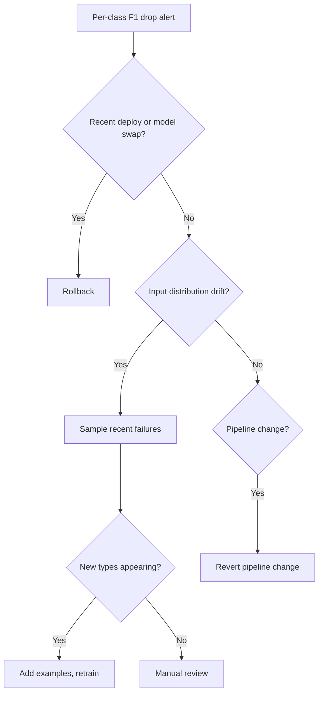

# NLP — Observability & Troubleshooting

**NLP-specific metrics, drift detection for language data, evaluation harnesses, runbooks for the most common failures.**

---

## What NLP Observability Adds

The basics from [Computer Vision → Observability](../computer-vision/09_Observability_Troubleshooting.md) and [Transformers → Observability](../transformers/09_Observability_Troubleshooting.md) apply. NLP-specific concerns:

| Concern | Why It Matters |
|---|---|
| **Per-language quality** | Quality varies dramatically; English-good doesn't mean Hindi-good |
| **Per-task quality in mixed-mode services** | Classification, embedding, generation each need their own metrics |
| **Linguistic drift** | New slang, new acronyms, new domain terms emerge constantly |
| **Confidence calibration** | NLP models often overconfident on adversarial / out-of-distribution input |
| **Hallucination rate** | LLM-specific; not measurable from loss alone |
| **Retrieval quality** (for RAG-based systems) | Bad retrieval breaks the whole pipeline |

---

## What to Measure Per Mode

### Classification / Extraction

| Metric | What It Tells You |
|---|---|
| Per-class precision / recall / F1 | Catches per-class failures hidden by overall accuracy |
| Macro-F1 across classes | Balanced view across imbalanced data |
| Confusion matrix | Where the model gets confused (e.g., negative ↔ neutral) |
| Confidence calibration | Are 90% confidence predictions actually 90% accurate? |
| Drift score | Distribution shift over time |

For NER specifically, track **entity-level F1** (entity correct only if span and type both right), not token-level F1.

### Embedding / Retrieval

| Metric | What It Tells You |
|---|---|
| MRR (Mean Reciprocal Rank) | How quickly the top relevant doc appears |
| NDCG@10 | Quality of top-10 retrieval |
| Recall@K | Of K retrieved docs, how many are relevant? |
| Embedding distribution shift | Are inputs drifting from training distribution? |

For RAG specifically, track **end-to-end** quality: does the retrieved + generated answer match ground truth, regardless of which stage failed?

### Generation

| Metric | What It Tells You |
|---|---|
| User acceptance / regeneration rate | The gold standard for chat/completion |
| LLM-as-judge score | Sampled grading at scale |
| Hallucination rate | Sampled human review |
| Refusal rate | How often does the model decline? |
| Length distribution | Output verbosity over time |
| Cost per request | Resource utilization |

---

## Drift Detection for Language Data

Language drifts. New slang appears, vocabulary evolves, topics shift. Models trained six months ago may already be outdated.

### Three Types of Drift

| Type | Example |
|---|---|
| **Vocabulary drift** | "rizz" enters common usage; older models don't know what to do with it |
| **Topic drift** | A new product launch shifts customer support ticket distribution |
| **Style drift** | Younger users adopt new conversational patterns |
| **Domain drift** | A medical NLP system deployed in pediatrics encounters terminology different from adult medicine |

### Detection Patterns

**1. Embedding distribution monitoring.** Compute embeddings for recent inputs, compare to training-time distribution:

```python
recent_embeds = embedder.encode(recent_inputs)
training_embeds = load_training_embedding_stats()

# Maximum Mean Discrepancy or KS test on each dimension
drift_score = mmd(recent_embeds, training_embeds)
if drift_score > THRESHOLD:
    alert("Input distribution has shifted")
```

**2. OOV (Out-of-Vocabulary) rate.** For tokenizers, track the percentage of input that becomes the unknown token. Spike = drift.

**3. Output distribution monitoring.** Track distribution of model predictions over time. Sudden shift in predicted class distribution may mean drift (or real change in inputs).

**4. User feedback signals.** Thumbs-down rate, regeneration rate, escalation rate. Behavioral signals catch quality drops automated metrics miss.

---

## What to Alert On

### Page-Worthy (P1)

| Signal | Threshold |
|---|---|
| Per-class accuracy drop | > 5% absolute drop |
| Per-language quality drop | > 5% absolute drop |
| Latency p99 spike | > 2x baseline |
| Service errors | > 1% |
| Cost spike | > 50% |
| Drift score | KS p < 0.001 sustained for hours |
| Hallucination flags | > 5x baseline |
| User-reported problems spiking | Negative feedback rate doubles |

### Investigate-Soon (P2)

| Signal | Threshold |
|---|---|
| OOV rate increase | > 2x baseline |
| LLM-as-judge score drop | > 5% absolute |
| Confidence calibration drift | Reliability diagram off |
| Retrieval quality (RAG) | MRR drops > 10% |
| Per-segment metric divergence | Some user segments doing significantly worse |

### Track-Trend (no page)

- Cost per request
- Average input/output length
- Model version distribution
- Per-feature quality trends

---

## Runbooks for Common NLP Production Failures

### Failure 1: Classification Quality Drop

**Symptom.** Per-class F1 drops for the "complaint" class. Customer support tickets misrouted.

**Triage:**



Common root causes:
1. Recent deploy regression — rollback first
2. New customer segment with different language patterns
3. Tokenizer / preprocessing pipeline change
4. Real distribution shift (post-incident, post-product-launch)

### Failure 2: Multilingual Quality Disparity

**Symptom.** English performance excellent. Spanish good. Hindi much worse than expected.

**Action plan:**
1. **Pull recent Hindi failures** — what category of failure?
2. **Check tokenizer** — is Hindi text split into many tokens? (Suggests tokenizer mismatch)
3. **Check training data composition** — was Hindi adequately represented?
4. **Compare with multilingual benchmarks** — is this normal for the model, or a regression?
5. **Per-language fine-tuning** if business needs Hindi quality on par with English
6. **Document the gap** for users — set expectations

### Failure 3: Hallucination Wave

**Symptom.** Multiple users reporting fabricated facts. Citations don't check out.

**Action plan:**
1. **Sample recent flagged outputs** — what category of fabrication?
2. **Check RAG retrieval** — is retrieval returning irrelevant content?
3. **Check prompts** — has the system prompt changed in ways that encourage confidence?
4. **Reduce temperature** — lower temperature = less creative = fewer hallucinations
5. **Add explicit "I don't know" instruction** in system prompt
6. **Switch to a stronger model** for the affected feature
7. **Tighten output filtering** — fact-check before showing

### Failure 4: Prompt Injection Detected

**Symptom.** Safety filter triggering 100x baseline. Pattern of similar prompts from one IP.

**Action plan:**
1. **Rate limit / temp ban** the offending source
2. **Sample the suspicious prompts** — what is being attempted?
3. **Update input filter** to block the new pattern
4. **Audit recent outputs** — did anything escape?
5. **Check audit logs** for full prompt + output history
6. **Notify trust & safety** per company policy
7. **Document the attack** — feeds future filter design

### Failure 5: Cost Spike

**Symptom.** API costs doubled overnight.

**Likely causes:**

| Cause | Check |
|---|---|
| Average input length increased | Are users sending longer prompts? |
| Average output length increased | Did something change in the system prompt? |
| Cache hit rate dropped | Redis health, recent cache eviction |
| New traffic source / spam | Per-IP / per-user analysis |
| Model accidentally upgraded | Model version in deployment manifest |
| Auto-scaling went wide | Replica count over time |

---

## A Production Dashboard for NLP

```
┌─────────────────────────────────────────────────────────┐
│  NLP SERVICE — Mixed Mode                                │
│  Requests/sec: 432    Errors: 0.04%   p99: 1.2s          │
├─────────────────────────────────────────────────────────┤
│  CLASSIFICATION QUALITY                                  │
│  Macro-F1: 0.91   ▆▆▇▆▇▆▆▆▆ (stable)                    │
│  Per-class:                                              │
│    Class A: 0.95  ▇▇▇▇▇▇▇▇▇                              │
│    Class B: 0.92  ▆▆▆▆▆▆▆▆▆                              │
│    Class C: 0.78  ▆▇▆▆▆▇▆▆▇  (DEGRADING ⚠)              │
├─────────────────────────────────────────────────────────┤
│  PER-LANGUAGE (sampled)                                  │
│    English: macro-F1 0.93   ▇▇▇▇▇                        │
│    Spanish: 0.89             ▆▆▆▆▆                        │
│    Hindi:   0.78             ▆▆▅▅▅  (lower, monitored)   │
├─────────────────────────────────────────────────────────┤
│  GENERATION                                              │
│  User thumbs-up: 87%   ▆▆▆▇▇▆▆▆▆                         │
│  LLM-judge avg: 4.2/5  ▆▆▆▆▆▆▆▆▆                         │
│  Hallucination flags: 0.4%                               │
│  Refusal rate: 2.3%                                      │
├─────────────────────────────────────────────────────────┤
│  RETRIEVAL (RAG)                                         │
│  MRR@10: 0.81   ▆▆▆▇▆▆▆▆▆                                │
│  Recall@10: 0.94                                         │
├─────────────────────────────────────────────────────────┤
│  DRIFT                                                   │
│  Input embedding shift: 0.04 (within band)               │
│  OOV rate: 1.2% (was 0.9% — slight increase ⚠)           │
│  Output distribution: stable                             │
├─────────────────────────────────────────────────────────┤
│  COST                                                    │
│  $/hour: $52   $/1k requests: $0.024                     │
├─────────────────────────────────────────────────────────┤
│  RECENT EVENTS                                           │
│  • 14:23  Class C accuracy dropped 4% → investigation    │
│  • 09:15  Suspicious prompt pattern from user X          │
└─────────────────────────────────────────────────────────┘
```

Build with Grafana + Prometheus + custom panels. The per-language and per-class breakdowns catch failures overall metrics hide.

---

## Specialized NLP Observability

| Tool | What It Does |
|---|---|
| **LangSmith** | LLM tracing, evaluation, monitoring |
| **Helicone** | Open-source LLM observability; cost tracking |
| **Phoenix (Arize)** | Open-source with embedding analysis |
| **Datadog with LLM extensions** | Enterprise APM |
| **Custom: Prometheus + Grafana** | Most flexible |

For most teams: a custom dashboard for the metrics that matter for your product, plus one of these tools for trace-level debugging.

---

## The 5-Minute Health Check

Every morning, every team running production NLP services should be able to answer:

1. **Is overall quality stable?** (per-class F1, user feedback, LLM-judge)
2. **Is any segment degrading?** (per-class, per-language, per-user-type)
3. **Are inputs drifting?** (embedding shift, OOV rate)
4. **Are costs in budget?**
5. **Are abuse patterns emerging?** (filter trigger rates, prompt diversity)

Five questions. Five minutes. The teams that catch problems early are the teams with this discipline.

---

**Next:** [10 — Decision Guide](10_Decision_Guide.md) — NLP task decision tree. API vs fine-tune vs classical. Production readiness checklist.
