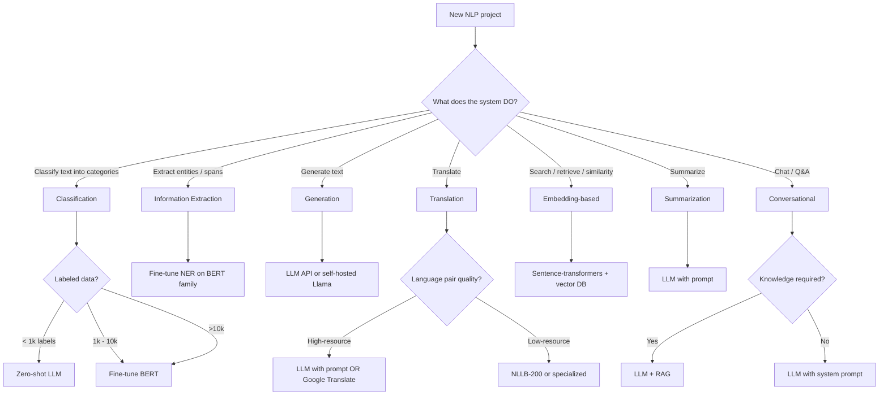

# NLP — Decision Guide

**NLP task decision tree. API vs fine-tune vs classical. Production readiness checklist.**

---

## The Core Decision: What NLP Pattern Fits?

---

## Decision Table by Task

| Task | First Choice | When First Choice Fails |
|---|---|---|
| **Sentiment classification** | TF-IDF + LogReg (small data) or DistilBERT fine-tune | Use LLM with prompt |
| **Topic classification** | DistilBERT or RoBERTa fine-tune | Try larger model or LLM |
| **Spam detection** | Naive Bayes + TF-IDF | Add transformer; ensemble |
| **NER** | spaCy + custom labels OR BERT fine-tune for tokens | Domain-specific fine-tune |
| **Question answering (extractive)** | RoBERTa fine-tuned on SQuAD-style data | LLM with RAG |
| **Question answering (open)** | LLM + RAG | Try larger LLM |
| **Summarization** | LLM with prompt | Fine-tune T5 or BART |
| **Translation (high-resource)** | LLM with prompt OR Google Translate API | Specialized translation model |
| **Translation (low-resource)** | NLLB-200 | Per-language fine-tune |
| **Chat / customer support** | LLM + RAG | Specialized fine-tune |
| **Code completion** | Code Llama or GPT-4 fine-tuned | Specialized model |
| **Multilingual classification** | XLM-R fine-tune | Per-language fine-tune |
| **Search ranking** | Sentence-transformers + cross-encoder re-rank | Domain-specific embedder |
| **Content moderation** | Per-category BERT classifiers | Ensemble + human review |

---

## API vs Self-Host vs Classical

### Volume-Based Decision

| Volume | Approach |
|---|---|
| < 1,000 req/day | **API** for any task. Don't build infra. |
| 1,000 - 100,000 req/day | **API for default**, classical/small-model self-host for hot paths |
| 100,000 - 10M req/day | Self-host smaller models; API for hardest queries |
| > 10M req/day | **Self-host required** for cost; API only for premium tier |

### Privacy-Based Decision

| Constraint | Approach |
|---|---|
| Public web app, no sensitive data | API freely |
| Customer data, US/EU privacy laws | API with strict data terms (verify "no training on customer data") |
| Healthcare (HIPAA), Finance (regulated), Government | **Self-host required** OR strict BAA / DPA with API vendor |
| Air-gapped / classified | **Self-host on-premise required** |

### Quality-Based Decision

| Quality Bar | Approach |
|---|---|
| Standard SaaS quality | API (GPT-4o-mini, Claude Haiku) is enough |
| Best available | API frontier models (GPT-4o, Claude Sonnet/Opus, Gemini Ultra) |
| Domain-specialized | Self-host + fine-tune on your domain |
| Real-time / latency-bound | Self-host with optimized inference (vLLM, TensorRT) |

---

## Production Readiness Checklist

### Data
| ✓ | Item |
|---|---|
| ☐ | Train/test split is appropriate (time-aware for time-sensitive data, group-aware for documents from same authors) |
| ☐ | Class balance documented |
| ☐ | Per-language balance documented (if multilingual) |
| ☐ | PII handling: detection, redaction, retention policies |

### Model
| ✓ | Item |
|---|---|
| ☐ | Architecture choice justified (encoder/decoder/encoder-decoder) |
| ☐ | Pretrained vs fine-tune vs prompt decision tested empirically |
| ☐ | Model card written (capabilities, limitations, training data, biases) |
| ☐ | Bias evaluation across demographic groups |
| ☐ | Per-language quality if multilingual |
| ☐ | Confidence calibration verified |

### Inference
| ✓ | Item |
|---|---|
| ☐ | Latency p50/p95/p99 measured |
| ☐ | Throughput at expected concurrency tested |
| ☐ | Cost per request validated |
| ☐ | Tokenizer matched to model |
| ☐ | Cache strategy implemented |

### Quality / Evaluation
| ✓ | Item |
|---|---|
| ☐ | Eval suite (50-500 examples) passes |
| ☐ | LLM-as-judge sampling configured |
| ☐ | Human evaluation baseline (100+ samples) |
| ☐ | Hallucination detection (for generative tasks) |
| ☐ | RAG enabled if knowledge access needed |

### Safety / Governance
| ✓ | Item |
|---|---|
| ☐ | Input filter (PII detection, banned patterns) deployed |
| ☐ | Output filter (toxicity, PII, copyright) deployed |
| ☐ | Audit log: prompts, outputs, user, model version |
| ☐ | EU AI Act / regulatory review |
| ☐ | Privacy review (data residency, retention) |
| ☐ | Indemnification policy (B2B) |
| ☐ | Transparency notice (where required) |

### Operations
| ✓ | Item |
|---|---|
| ☐ | Monitoring dashboard live (per-task, per-language, drift) |
| ☐ | Alerts on quality drops, drift, cost spikes |
| ☐ | A/B testing infrastructure for changes |
| ☐ | Rollback plan tested |
| ☐ | On-call team trained |
| ☐ | Failure-capture pipeline for retraining |

If you cannot check most items, you are not ready. **NLP failures affect users in deeply personal ways — language is identity-adjacent**.

---

## Cost Estimation Framework

For a typical NLP service (e.g., customer support automation):

### Initial Build (One-Time)

| Item | Typical Hours / Cost |
|---|---|
| Data collection / labeling | 80-200 hours + $5K-50K labeling |
| Model selection + fine-tuning | 80-160 hours |
| Pipeline + integration | 80-200 hours |
| Safety filters + monitoring | 80-120 hours |
| Regulatory / legal review | 40-200 hours |

### Ongoing (Per Year)

| Item | Typical Cost |
|---|---|
| Inference (API) | Volume × $0.5-15 / 1M tokens (depending on task and model) |
| Inference (self-hosted) | Cloud GPU costs; smaller crossover |
| Continuous evaluation | $1K-5K / month for LLM-as-judge sampling |
| Engineering on-call | 0.2-0.5 FTE |

For a B2B customer support automation at 10M support tickets/year, total Year 2+ costs run $30K-$200K depending on architecture choices.

---

## When to Stop and Reconsider

| Signal | Action |
|---|---|
| Prompt iteration plateaus | Try fine-tuning OR larger model |
| Fine-tuning doesn't improve quality | Better data OR different architecture |
| Per-language quality unfixable for some languages | Document the gap; route low-quality languages to humans |
| Hallucination rate stays > 5% on high-stakes outputs | Add stricter RAG; switch to reasoning model; require human review |
| Cost exceeds budget | Smaller model, distillation, classical baseline |
| Regulatory team escalating | Stop and engage them; deploying without clearance is high-risk |
| Bias gap unfixable with available data | Document, route around, or pause feature |

---

## The NLP-Engineer Mindset

| Mindset | What It Looks Like |
|---|---|
| **Classical methods are not dead** | TF-IDF + LogReg is often the right answer; respect baselines |
| **Tokenization affects everything** | Mismatched tokenizer → broken model |
| **Per-language metrics are mandatory** | Overall metrics hide demographic-level failures |
| **Hallucination is the default for LLMs** | Use RAG, structure, refusal — don't trust the model alone |
| **Plan for abuse from week 1** | Audit logs, safety filters, rate limits |
| **Workflow > model** | Routing, fallbacks, human-in-the-loop are 70% of the work |
| **Bias is real and ongoing** | Audit periodically; the data evolves; the bias evolves |
| **Open models are competitive in 2026** | Llama, Mistral, Qwen often suffice; APIs are not always required |

---

## What's Next

This playbook covered NLP as a task domain. The deeper material:

| Doc / Playbook | When to Read |
|---|---|
| [Transformers](../transformers/) | The architecture behind modern NLP |
| [RAG](../rag/) | Knowledge-grounded NLP systems |
| [Agents](../agents/) | Autonomous NLP systems with tools |
| [Sequence Models](../sequence-models/) | RNN/LSTM (legacy NLP, still in some streaming use cases) |
| [Architecture Glossary](../architecture-glossary.md) | Cross-architecture terminology |
| [Architecture Math](../architecture-math.md) | Worked numerical examples |

---

**Where you started:** [01 — Why](01_Why.md). Read backwards from here to revisit any concept.

**Hands-on companion:** [NLP From Scratch on Colab](https://colab.research.google.com/github/sunilmogadati/systems-in-production/blob/main/implementation/notebooks/NLP_From_Scratch.ipynb) — BPE tokenization by hand, TF-IDF + naive Bayes, Word2Vec-style embeddings.
