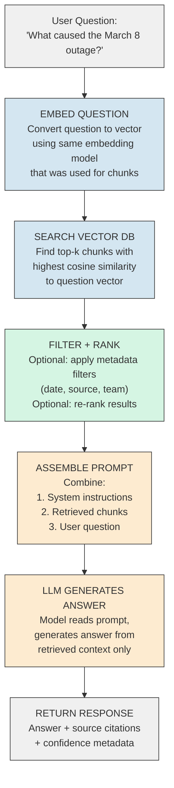
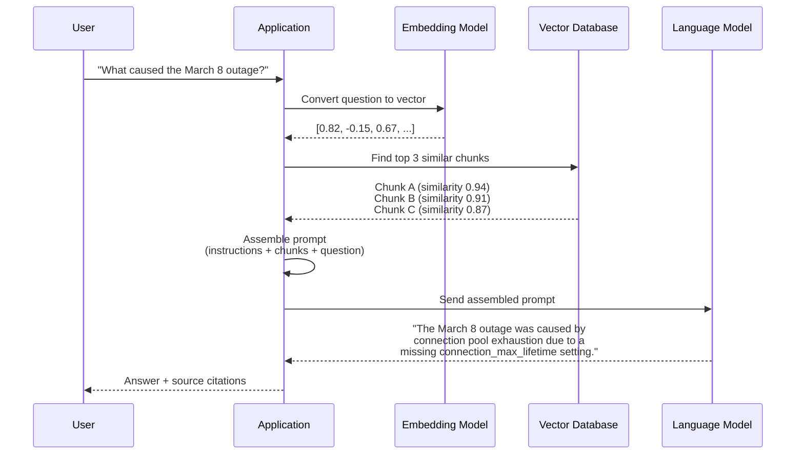

# RAG - How It Works

**Why embeddings capture meaning. How similarity search finds the right chunks. What happens at every stage of the pipeline, and why each step matters.**

---

## Why Embeddings Capture Meaning (Not Just What They Are)

In Chapter 02, we said embeddings convert text to numbers. But WHY do those numbers capture meaning? This is the part most tutorials skip.

Embedding models are neural networks trained on billions of text pairs. During training, the model sees pairs like:

- "The server ran out of memory" and "OOM killed the process" (similar meaning)
- "The server ran out of memory" and "I went to the grocery store" (different meaning)

The model learns to assign similar numbers to texts that appear in similar contexts. After training on billions of these pairs, the model develops an internal representation where **meaning = position in a high-dimensional space**.

**Analogy: The Neighborhood Map.**
Imagine a city map where businesses are placed not by street address, but by what they sell. All coffee shops cluster together. All hardware stores cluster together. A "coffee and pastry shop" would sit between the coffee cluster and the bakery cluster. Embeddings work the same way. "Database connection timeout" sits near "DB pool exhaustion" and "connection limit reached" because they all describe the same neighborhood of meaning.

This is why RAG finds relevant documents even when the question uses completely different words than the document. The embedding model has learned that "Why is the service failing?" and "order-service error root cause" live in the same neighborhood.

**The numbers are not random.** Each dimension in the embedding vector represents some learned aspect of meaning. Dimension 47 might loosely correspond to "technical vs. casual." Dimension 312 might capture "positive vs. negative sentiment." No single dimension is human-interpretable, but together they form a rich, nuanced map of meaning.

---

## How Cosine Similarity Works

When you search for similar chunks, the system compares embedding vectors using **cosine similarity**. Here is the intuition.

**Analogy: Two Arrows on a Whiteboard.**
Draw two arrows from the center of a whiteboard. If both arrows point in the same direction, the texts have similar meaning. If they point in opposite directions, the meanings are unrelated.

Cosine similarity measures the **angle** between two vectors, ignoring how long the arrows are. Two short arrows pointing the same way are just as similar as two long arrows pointing the same way.

```
Cosine similarity = 1.0  → identical direction (same meaning)
Cosine similarity = 0.0  → perpendicular (unrelated)
Cosine similarity = -1.0 → opposite direction (opposite meaning)
```

**Concrete example:**

```
Question:   "What caused the connection pool failure?"  → [0.82, -0.15, 0.67]
Chunk A:    "DB connection limit was exceeded"          → [0.80, -0.13, 0.65]  similarity = 0.99
Chunk B:    "Deploy the new feature flag"               → [-0.22, 0.71, 0.08]  similarity = 0.12
Chunk C:    "Pool config missing max_lifetime"          → [0.79, -0.16, 0.63]  similarity = 0.98
```

Chunks A and C are retrieved because their arrows point in nearly the same direction as the question. Chunk B points in a completely different direction and is ignored.

**Why cosine instead of just measuring distance?** Cosine ignores magnitude. A short document and a long document about the same topic get the same similarity score. Euclidean distance (straight-line measurement) would penalize the shorter one. For text search, you care about WHAT the text is about, not how much text there is.

---

## How Vector Databases Index: ANN (Approximate Nearest Neighbor)

A brute-force search compares your question vector against every single chunk vector in the database. This works for 1,000 chunks. It does not work for 10 million.

Vector databases use ANN (Approximate Nearest Neighbor, pronounced "A-N-N") algorithms. The idea: give up a tiny bit of accuracy to get massive speed improvements.

**Analogy: Finding a Book in a Library.**
Brute-force = walking through every shelf in every aisle, checking every book. ANN = knowing the book is about "databases," so you go directly to the Computer Science section, then the Database shelf, then scan just those 50 books.

### HNSW (Hierarchical Navigable Small World)

HNSW (pronounced "H-N-S-W") builds a multi-layer graph. Think of it like a highway system:

- **Top layer:** A few major highways connecting distant cities (coarse, fast navigation)
- **Middle layers:** State roads connecting towns
- **Bottom layer:** Local streets connecting every house (fine-grained, all vectors)

When you search, you start on the highway, quickly get to the right region, then take progressively smaller roads until you find the nearest neighbors.

| Property | Value |
|---|---|
| Search speed | Very fast (logarithmic) |
| Memory usage | High (stores the graph in memory) |
| Build time | Slow (must construct graph) |
| Accuracy | Very high (usually 95%+) |
| Best for | Real-time search, most production systems |

### IVF (Inverted File Index)

IVF (pronounced "I-V-F") divides the vector space into clusters. Think of it like postal codes:

1. Pre-compute cluster centers (like defining postal code regions)
2. Assign each vector to its nearest cluster
3. When searching, first find the closest cluster centers, then search only within those clusters

| Property | Value |
|---|---|
| Search speed | Fast (only searches relevant clusters) |
| Memory usage | Lower than HNSW |
| Build time | Fast (k-means clustering) |
| Accuracy | Good (depends on number of clusters searched) |
| Best for | Very large datasets, memory-constrained environments |

### Which One to Use?

| Database | Default Algorithm | Notes |
|---|---|---|
| ChromaDB | HNSW | Good for prototypes and small-medium datasets |
| Pinecone | Proprietary (HNSW-based) | Managed, auto-scales |
| Weaviate | HNSW | Supports hybrid (keyword + vector) search |
| pgvector | IVF or HNSW | Choose based on dataset size |
| FAISS | IVF, HNSW, or Product Quantization | Research-grade, maximum flexibility |

---

## The Retrieval Pipeline Step by Step

Here is every stage from question to answer, with what happens at each stage.



### Stage-by-Stage Detail

**Stage 1: Embed the Question**
The user's question is converted to a vector using the SAME embedding model used during ingestion. This is critical. If you embedded your documents with `nomic-embed-text` but embed the question with `text-embedding-3-small`, the vectors live in different spaces and similarity comparisons are meaningless.

**Stage 2: Search the Vector Database**
The question vector is compared against all stored chunk vectors. The database returns the top-k most similar chunks (usually k=3 to k=5). This search uses the ANN algorithms described above, so it takes milliseconds even on millions of chunks.

**Stage 3: Filter and Rank (Optional)**
Raw similarity search might return chunks from the wrong document, the wrong date range, or the wrong team. Metadata filtering narrows results: "only show chunks from runbooks created in 2026." Re-ranking (covered in Chapter 07) uses a more expensive model to reorder the results by true relevance.

**Stage 4: Assemble the Prompt**
The retrieved chunks and the user's question are assembled into a prompt using a template. This is where you control the LLM's behavior.

**Stage 5: LLM Generates the Answer**
The LLM reads the assembled prompt and generates an answer. It does not "search" the chunks. It reads them linearly, like a person reading a page, and formulates a response.

**Stage 6: Return the Response**
The answer goes back to the user, ideally with citations showing which chunks were used. This lets the user verify the answer against the source.

---

## Why Chunk Overlap Matters

When you split a document into chunks, information at the boundary gets cut.

**Example without overlap:**

```
Chunk 1: "...the root cause was a missing connection_max_lifetime"
Chunk 2: "setting in the ORM configuration. When traffic increased..."
```

The critical phrase "connection_max_lifetime setting in the ORM configuration" is split across two chunks. If the user asks about the ORM setting, neither chunk alone contains the full answer.

**Example with 50-character overlap:**

```
Chunk 1: "...the root cause was a missing connection_max_lifetime setting in the ORM"
Chunk 2: "connection_max_lifetime setting in the ORM configuration. When traffic increased..."
```

Now both chunks contain the complete phrase. The overlap creates redundancy at boundaries, ensuring that no important context is lost in the split.

**The tradeoff:**

| Overlap | Benefit | Cost |
|---|---|---|
| 0% | Smallest storage, no duplicate text | Information lost at every boundary |
| 10% | Good boundary coverage | Slight storage increase |
| 20% | Excellent boundary coverage | ~20% more chunks to store and search |
| 50%+ | Almost no boundary loss | Nearly doubles storage and search time |

**The common default:** 10-20% overlap (e.g., chunk_size=500, chunk_overlap=50-100). This handles most boundary cases without significant cost.

---

## How the Prompt Template Shapes LLM Behavior

The prompt is the control surface of your RAG system. Two different prompts, same chunks, same LLM -- completely different answers.

**Minimal prompt (what most tutorials use):**

```
Context: {chunks}
Question: {question}
Answer:
```

This works but gives the LLM no guardrails. It might hallucinate, add information from training data, or ignore the context entirely.

**Production prompt (what you should actually use):**

```
You are a technical support assistant. Answer the user's question
using ONLY the information provided in the context below.

Rules:
1. If the context does not contain enough information to answer,
   say "I don't have enough information to answer this."
2. Do not use any knowledge outside the provided context.
3. Cite which section of the context your answer came from.
4. Keep your answer concise -- under 3 sentences unless the
   question requires more detail.

Context:
{chunks}

Question: {question}

Answer:
```

**What each instruction does:**

| Instruction | Why It Matters |
|---|---|
| "ONLY the information in the context" | Prevents the LLM from mixing in training data |
| "Say I don't have enough information" | Prevents hallucination -- the LLM has a safe exit |
| "Cite which section" | Forces grounding; the user can verify |
| "Keep your answer concise" | Prevents verbose, wandering responses |

The prompt template is not decoration. It is architecture. A well-designed prompt is the difference between a RAG system that works and one that confidently produces wrong answers.

See the prompt engineering patterns in the hands-on notebook: [RAG from Scratch on Colab](https://colab.research.google.com/github/sunilmogadati/systems-in-production/blob/main/implementation/notebooks/RAG_from_Scratch.ipynb)

---

## The Full Query Flow (End to End)



**Latency breakdown for a typical query:**

| Stage | Typical Latency | What Determines It |
|---|---|---|
| Embed question | 10-50 ms | Embedding model size, local vs. API |
| Vector search | 5-50 ms | Database size, ANN algorithm, hardware |
| Metadata filter | 1-5 ms | Filter complexity |
| LLM generation | 500-3000 ms | Model size, answer length, local vs. API |
| **Total** | **~600-3100 ms** | LLM generation dominates |

The LLM generation step accounts for 80-95% of total latency. This is why caching and prompt optimization matter so much in production (covered in Chapter 07).

---

## Key Takeaways

1. **Embeddings capture meaning** because the model was trained on billions of text pairs -- it learned which texts go together.
2. **Cosine similarity** measures direction, not distance. Two arrows pointing the same way = similar meaning.
3. **ANN algorithms** (HNSW, IVF) make vector search fast by organizing vectors into navigable structures, trading a tiny bit of accuracy for massive speed.
4. **Chunk overlap** prevents information loss at boundaries. 10-20% overlap is the standard default.
5. **The prompt template** is not boilerplate. It controls whether the LLM stays grounded in the retrieved context or wanders into hallucination.
6. **LLM generation dominates latency.** Optimize the generation step first.

---

## Quick Links

| Chapter | Topic |
|---|---|
| [01 - Why](01_Why.md) | Why RAG matters |
| [02 - Concepts](02_Concepts.md) | Embeddings, vectors, chunking |
| [03 - Hello World](03_Hello_World.md) | Build a RAG system in 20 lines |
| [04 - How It Works](04_How_It_Works.md) | This page |
| [05 - Building It](05_Building_It.md) | Every tradeoff and choice |
| [06 - Production Patterns](06_Production_Patterns.md) | How production RAG systems work |
| [07 - System Design](07_System_Design.md) | Scaling, caching, hybrid search |
| [08 - Quality, Security, Governance](08_Quality_Security_Governance.md) | Prompt injection, data leakage |
| [09 - Observability & Troubleshooting](09_Observability_Troubleshooting.md) | Measuring quality and cost |
| [10 - Decision Guide](10_Decision_Guide.md) | Decision table and production readiness |

**Hands-on notebook:** [RAG from Scratch on Colab](https://colab.research.google.com/github/sunilmogadati/systems-in-production/blob/main/implementation/notebooks/RAG_from_Scratch.ipynb)

**Production architecture:** [Production Diagnostics Architecture](../../systems/production-diagnostics/architecture.md)
