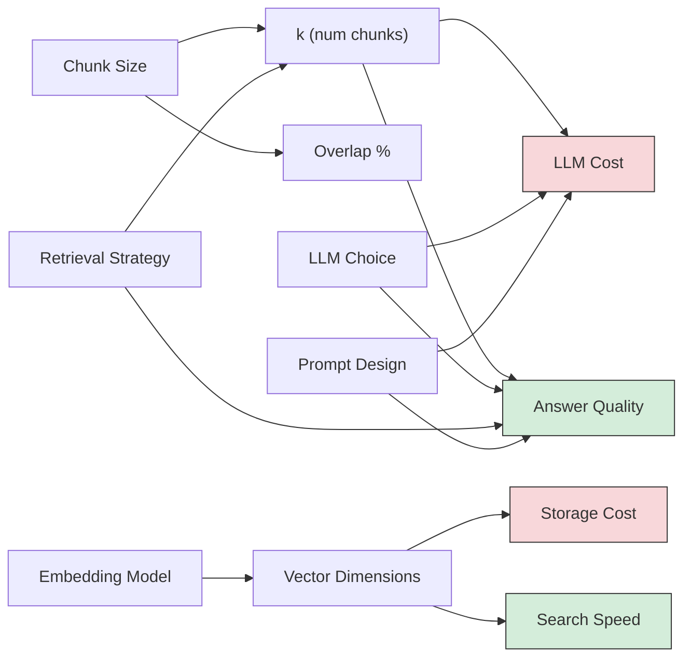

# RAG - Decisions

**Every architectural choice in a RAG system, with tradeoffs, defaults, and guidance on when to deviate from the defaults.**

---

## Why Decisions Matter More Than Code

A RAG system with bad decisions and great code will produce wrong answers. A RAG system with good decisions and simple code will produce great answers. The code is 20 lines (you saw it in Chapter 03). The decisions are everything.

**Analogy: Building a Kitchen.**
The recipe (code) is simple: chop, cook, plate. But choosing the knife (chunk size), the heat level (k value), the ingredients (embedding model), and the seasoning (prompt design) -- those decisions determine whether the meal is edible.

---

## Decision 1: Chunk Size

How many characters or tokens per chunk?

| Chunk Size | What Happens | Best For |
|---|---|---|
| Small (100-200 chars) | Precise retrieval. Each chunk contains one specific fact. But chunks lack surrounding context. | FAQ databases, structured Q&A, short facts |
| Medium (300-800 chars) | Balanced. Enough context to understand the chunk, specific enough for good retrieval. | Most use cases. The default choice. |
| Large (1000-2000 chars) | Rich context per chunk. But retrieval is less precise -- you might retrieve a chunk for one sentence buried in a large paragraph. | Long-form documents where context is critical (legal, medical) |

**Concrete example:**

Document sentence: "The fix was to set connection_max_lifetime=300s."

- **Small chunk (200 chars):** Contains just this sentence. If someone asks "what was the fix?" this chunk is a perfect match. But if they ask "why was this fix chosen?" the explanation is in a different chunk.
- **Medium chunk (500 chars):** Contains this sentence plus the surrounding paragraph explaining WHY. Good for most questions.
- **Large chunk (1500 chars):** Contains the entire incident section. Rich context, but also includes unrelated details about deployment timing and team assignments that dilute the retrieval signal.

**Default:** 500 characters with 50-100 character overlap. Adjust after measuring retrieval quality.

---

## Decision 2: Chunk Overlap

How much text is repeated between adjacent chunks?

| Overlap | Storage Increase | Boundary Coverage | When to Use |
|---|---|---|---|
| 0% (no overlap) | None | Poor -- context split at every boundary | Only when chunks are self-contained (individual FAQ entries) |
| 10% (~50 chars on 500-char chunks) | ~10% | Good -- most boundary phrases captured | Default for most systems |
| 20% (~100 chars on 500-char chunks) | ~20% | Excellent -- nearly all boundary context preserved | Documents with long, flowing sentences (legal, medical) |
| 50%+ | ~50%+ | Near-complete | Almost never. The cost outweighs the benefit. |

**Default:** 10% overlap (chunk_size=500, chunk_overlap=50).

---

## Decision 3: Embedding Model

Which model converts text to vectors?

| Model | Dimensions | Runs Where | Cost | Quality | Latency |
|---|---|---|---|---|---|
| `nomic-embed-text` | 768 | Local (Ollama) | Free | Good | ~10ms/chunk |
| `mxbai-embed-large` | 1024 | Local (Ollama) | Free | Better | ~20ms/chunk |
| `text-embedding-3-small` (OpenAI) | 1536 | API | $0.02/1M tokens | Good | ~5ms/chunk + network |
| `text-embedding-3-large` (OpenAI) | 3072 | API | $0.13/1M tokens | Best | ~10ms/chunk + network |
| `voyage-3` (Anthropic partner) | 1024 | API | $0.06/1M tokens | Excellent for code | ~8ms/chunk + network |

**Higher dimensions = more nuanced meaning representation, but more storage and slower search.**

| Dimensions | Storage per 1M chunks | Search Speed |
|---|---|---|
| 768 | ~3 GB | Fastest |
| 1024 | ~4 GB | Fast |
| 1536 | ~6 GB | Medium |
| 3072 | ~12 GB | Slower |

**The critical rule: use the same embedding model for ingestion and query.** If you embed documents with `nomic-embed-text` (768 dimensions) and then embed queries with `text-embedding-3-small` (1536 dimensions), the vectors are incomparable. Similarity scores will be meaningless.

**Default:** `nomic-embed-text` for learning and prototypes. `text-embedding-3-small` or `voyage-3` for production.

---

## Decision 4: Number of Retrieved Chunks (k)

How many chunks to retrieve per query?

| k Value | What Happens | Tradeoff |
|---|---|---|
| k=1 | One chunk. Very focused. Misses if the answer spans multiple chunks. | Fast but fragile |
| k=3 | Three chunks. Good balance. Usually captures the answer. | Default for most systems |
| k=5 | Five chunks. More context for the LLM. Higher chance of capturing the full answer. | Slightly more noise |
| k=10 | Ten chunks. Broad retrieval. Useful when combined with re-ranking. | More tokens sent to LLM = higher cost and more noise |
| k=20+ | Very broad. Only makes sense with re-ranking to filter down. | Expensive. LLM may get confused by too much context. |

**The cost equation:**
Each additional chunk adds ~100-500 tokens to the LLM prompt. At GPT-4 pricing ($30/1M input tokens), adding 5 extra chunks of 500 tokens each adds ~$0.075 per 1,000 queries. Small per query, significant at scale.

**Default:** k=3 for simple questions, k=5 for complex questions, k=10-20 with re-ranking for production systems.

---

## Decision 5: Retrieval Strategy

How to select which chunks are returned?

| Strategy | How It Works | Pros | Cons |
|---|---|---|---|
| **Similarity search** | Return k chunks with highest cosine similarity | Simple, fast, predictable | May return redundant chunks that all say the same thing |
| **MMR (Maximal Marginal Relevance)** | Return k chunks that are similar to the query BUT different from each other | Diverse results, reduces redundancy | Slightly slower, lambda parameter to tune |
| **Hybrid search** | Combine keyword search (BM25) with semantic search, merge results | Catches both exact keyword matches and semantic matches | More complex to implement, requires score normalization |
| **Metadata filtering + similarity** | Filter by metadata first (date, source, team), then similarity search on filtered set | Precise scoping, respects access control | Requires metadata to be indexed during ingestion |

**MMR in plain English:**
Regular similarity search might return 3 chunks that all describe the same incident from slightly different paragraphs. MMR says: "Give me the most relevant chunk, then the next most relevant chunk that is ALSO different from the first one." This ensures coverage across different aspects of the answer.

The lambda parameter controls the balance: lambda=1.0 means pure similarity (no diversity), lambda=0.0 means pure diversity (ignore relevance). The default lambda=0.5 balances both.

**Default:** Similarity search for prototypes. MMR (lambda=0.5) for production. Hybrid search when your documents contain specific technical terms, product names, or codes that must be matched exactly.

---

## Decision 6: LLM (Large Language Model) Choice

Which model generates the answer?

| Model | Runs Where | Cost per 1M Output Tokens | Quality | Speed |
|---|---|---|---|---|
| Mistral 7B | Local (Ollama) | Free | Good for simple Q&A | ~30 tokens/sec on M-series Mac |
| Llama 3 8B | Local (Ollama) | Free | Good general purpose | ~25 tokens/sec on M-series Mac |
| GPT-4o (OpenAI) | API | ~$15 | Excellent | ~80 tokens/sec |
| GPT-4o-mini (OpenAI) | API | ~$0.60 | Very good | ~100 tokens/sec |
| Claude Sonnet (Anthropic) | API | ~$15 | Excellent, strong at following instructions | ~80 tokens/sec |
| Claude Haiku (Anthropic) | API | ~$1.25 | Good, very fast | ~150 tokens/sec |

**The decision framework:**

| Scenario | Recommended Model |
|---|---|
| Learning and prototyping | Mistral 7B (local, free, no API key needed) |
| Internal tool, moderate quality needs | GPT-4o-mini or Claude Haiku (cheap, fast, good enough) |
| Customer-facing, accuracy critical | GPT-4o or Claude Sonnet (best quality) |
| Air-gapped / no internet / privacy | Llama 3 or Mistral (runs fully local) |
| High volume (10,000+ queries/day) | Haiku or GPT-4o-mini (cost at scale matters) |

**Default:** Mistral 7B for learning. Claude Haiku or GPT-4o-mini for production MVP. Upgrade to Sonnet/GPT-4o only where quality demands justify the cost.

---

## Decision 7: Prompt Design

How to instruct the LLM to use the retrieved context?

| Prompt Style | Example | When to Use |
|---|---|---|
| **Minimal** | "Answer based on: {context}\n\nQuestion: {question}" | Quick prototypes, testing |
| **Guarded** | "Answer ONLY from context. Say 'I don't know' if not found." | Any system where hallucination is dangerous |
| **Chain-of-thought** | "First identify which context sections are relevant. Then reason step by step. Then give the final answer." | Complex questions requiring synthesis across multiple chunks |
| **Structured output** | "Return JSON: {answer, confidence, sources}" | Systems that need machine-readable output |
| **Persona-based** | "You are a senior SRE (Site Reliability Engineer). Answer using operational language." | Domain-specific assistants |

**The hallucination guardrail is non-negotiable.** Every production RAG prompt must include an instruction to say "I don't know" when the context does not contain the answer. Without this, the LLM will confidently generate plausible-sounding wrong answers.

**Default:** Guarded prompt for most systems. Chain-of-thought for complex, multi-part questions.

---

## Decision 8: Metadata Filtering

When to attach and filter on metadata?

**What is metadata?** Extra information stored alongside each chunk: the document source, creation date, author, team, access level, document type.

| Metadata Field | When to Filter | Example |
|---|---|---|
| `source` | Multiple document types in same database | "Only search runbooks, not meeting notes" |
| `date` | Time-sensitive information | "Only search documents from the last 90 days" |
| `team` | Multi-team knowledge bases | "Only search SRE team documents" |
| `access_level` | Multi-tenant systems | "Only return documents this user has permission to see" |
| `document_type` | Mixed content | "Only search incident reports, not design docs" |

**When metadata filtering is essential:**
- Multi-tenant RAG (different users see different documents)
- Time-sensitive domains (medical guidelines, legal regulations)
- Compliance requirements (users must not see documents above their clearance)

**When to skip it:**
- Single-purpose RAG systems (one document set, one user group)
- Prototypes and learning exercises

**Default:** Add metadata during ingestion even if you don't filter on it yet. Retrofitting metadata later requires re-ingesting everything.

---

## Architect Decision Checklist

Use this table when designing a new RAG system. Fill in each row.

| Decision | Options | Your Choice | Why |
|---|---|---|---|
| Chunk size | 100-200 / 300-800 / 1000-2000 chars | | |
| Chunk overlap | 0% / 10% / 20% | | |
| Embedding model | nomic-embed-text / mxbai / text-embedding-3 / voyage-3 | | |
| Vector database | ChromaDB / Pinecone / Weaviate / pgvector / FAISS | | |
| Number of chunks (k) | 1 / 3 / 5 / 10 / 20 | | |
| Retrieval strategy | Similarity / MMR / Hybrid / Metadata + Similarity | | |
| LLM | Mistral / Llama / GPT-4o-mini / GPT-4o / Haiku / Sonnet | | |
| Prompt design | Minimal / Guarded / Chain-of-thought / Structured | | |
| Metadata filtering | None / Source / Date / Team / Access level | | |
| Re-ranking | None / Cross-encoder / Cohere rerank | | |
| Caching | None / Query cache / Embedding cache / Both | | |
| Evaluation | Manual spot-check / RAGAS / Custom metrics | | |

**Fill this out BEFORE writing code.** The notebook lets you experiment with different values: [RAG from Scratch on Colab](https://colab.research.google.com/github/sunilmogadati/systems-in-production/blob/main/implementation/notebooks/RAG_from_Scratch.ipynb)

---

## Decision Interaction Map

Decisions are not independent. Changing one affects others.

**Common interaction patterns:**
- **Smaller chunks + higher k:** Retrieve more small pieces. Good for precise factoid retrieval.
- **Larger chunks + lower k:** Retrieve fewer big pieces. Good for questions needing full context.
- **Cheap LLM + more chunks:** You can afford to send more context to a cheap model.
- **Expensive LLM + fewer chunks:** Keep the prompt short to control cost.
- **Hybrid retrieval + re-ranking:** Retrieve broadly (k=20), re-rank to top 5. Best quality, highest complexity.

---

## The "Start Here" Defaults

If you are building your first RAG system, use these defaults. Optimize later with data.

| Decision | Default Value | Why |
|---|---|---|
| Chunk size | 500 characters | Balanced precision and context |
| Chunk overlap | 50 characters (10%) | Handles most boundary cases |
| Embedding model | `nomic-embed-text` (local) | Free, fast, good quality, no API key |
| Vector database | ChromaDB | Zero config, works locally |
| k | 3 | Good for single-topic questions |
| Retrieval strategy | Similarity search | Simplest, good baseline |
| LLM | Mistral 7B (local) | Free, no API key, runs on laptop |
| Prompt | Guarded (includes "say I don't know") | Prevents hallucination from day one |
| Metadata | None | Add later when you need filtering |

These defaults get you a working system in under an hour. Tune each decision one at a time based on evaluation results.

---

## Quick Links

| Chapter | Topic |
|---|---|
| [01 - Why](01_Why.md) | Why RAG matters |
| [02 - Concepts](02_Concepts.md) | Embeddings, vectors, chunking |
| [03 - Hello World](03_Hello_World.md) | Build a RAG system in 20 lines |
| [04 - How It Works](04_How_It_Works.md) | Deep dive into each step |
| [05 - Building It](05_Building_It.md) | This page |
| [06 - Production Patterns](06_Production_Patterns.md) | How production RAG systems work |
| [07 - System Design](07_System_Design.md) | Scaling, caching, hybrid search |
| [08 - Quality, Security, Governance](08_Quality_Security_Governance.md) | Prompt injection, data leakage |
| [09 - Observability & Troubleshooting](09_Observability_Troubleshooting.md) | Measuring quality and cost |
| [10 - Decision Guide](10_Decision_Guide.md) | Decision table and production readiness |

**Hands-on notebook:** [RAG from Scratch on Colab](https://colab.research.google.com/github/sunilmogadati/systems-in-production/blob/main/implementation/notebooks/RAG_from_Scratch.ipynb)

**Production architecture:** [Production Diagnostics Architecture](../../systems/production-diagnostics/architecture.md)
