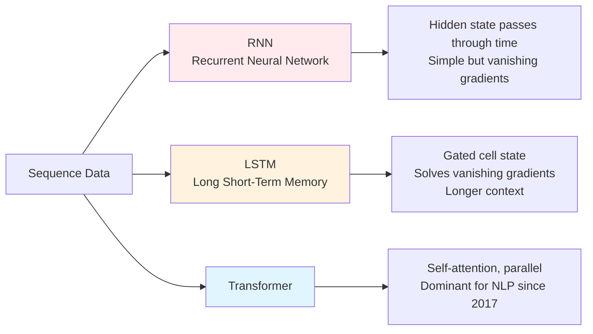

# Sequence Models — Why This Matters

**Why some of the most consequential AI systems in production are still recurrent — and why "sequence" is a richer category than most teams realize.**

---

## The Cardiologist, the Pilot, and the Translator

A cardiologist in Seoul reads ECGs (electrocardiograms — the heart's electrical signal recorded over time) all day. The signal is a stream — fifteen seconds of voltage, sampled hundreds of times per second. A single timestep tells you nothing. Atrial fibrillation reveals itself only as a *pattern over time* — irregular spacing between beats, characteristic distortions in the rhythm. She can read it. Most general practitioners cannot. There are not enough cardiologists, and ECGs are everywhere.

In 2019, a team trained a sequence model on millions of ECG recordings. The model learned the rhythms. Today, deployments of similar models in primary-care clinics flag suspicious ECGs in seconds. The cardiologist still confirms. Patients with silent atrial fibrillation get caught months earlier than they otherwise would have. Strokes prevented.

A pilot's flight data recorder produces a stream of hundreds of measurements per second — altitude, attitude, engine parameters, control surface positions. Maintenance teams must spot anomalies that precede mechanical failure. A single reading tells you nothing; the *trajectory* of readings tells you everything. Sequence models trained on millions of flight hours catch precursors humans miss.

A live human translator processes speech as a stream — words arrive in order, and meaning depends on what came before. *"Bank"* in English means one thing after *"river"* and a different thing after *"interest rate."* Statistical translators that treat each word independently produce nonsense. Translation works when the system understands sequences. The cochlear implant in a deaf child uses a recurrent model to convert audio into nerve stimulation patterns that the brain learns to read as language — the same mathematics that powered the first machine translators.

---

## What Sequence Models Actually Do

**Sequence model** — a network designed to process data where order matters. The same input in a different order means something different.

Examples of sequence data:

| Modality | Example sequence |
|---|---|
| **Text** | Words in a sentence, characters in a name, lines in a poem |
| **Speech / audio** | A waveform sampled at 16,000 samples per second |
| **Time series** | Daily stock prices, hourly server CPU load, monthly sales |
| **Sensor streams** | ECG, accelerometer, IoT (Internet of Things) device telemetry |
| **Video frames** | A clip is a sequence of images |
| **DNA / proteins** | Sequences of nucleotides or amino acids |
| **User actions** | Click streams, in-app behavior over a session |

In every case, **shuffling destroys meaning**. *"The cat sat on the mat"* has nothing in common with *"mat the on sat cat The"* — except the same words. Order *is* the information.

A feedforward network treats inputs as bags of independent features. It cannot tell *"cat sat"* from *"sat cat"*. For sequences, you need an architecture that **carries information forward through time** — a memory that gets updated as new inputs arrive.

That is what RNNs, LSTMs, and (later) Transformers do.

---

## The Three Sequence Architectures — At A Glance

| Architecture | Year | Strength | Weakness |
|---|---|---|---|
| **RNN (Recurrent Neural Network)** | 1986 (Elman) | Simplest recurrent design | Vanishing gradients past ~10 steps |
| **LSTM (Long Short-Term Memory)** | 1997 (Hochreiter, Schmidhuber) | Solves vanishing gradients with gates; remembers longer | Sequential — cannot parallelize across time |
| **GRU (Gated Recurrent Unit)** | 2014 | Simpler than LSTM, similar performance | Same sequential bottleneck |
| **Transformer** | 2017 | Parallel across time, no vanishing gradients | Quadratic memory in sequence length |

This playbook focuses on **RNN, LSTM, and GRU** — the recurrent family. For Transformers, see the [Transformers playbook](../transformers/).

---

## Why Recurrent Models Still Matter in 2026

Transformers replaced RNN/LSTM for most NLP work after 2017. Yet recurrent models remain in production. Three reasons:

### 1. Streaming Inference Is Naturally Recurrent

A streaming application processes data one timestep at a time, in real time, with bounded memory. A speech recognition system on a phone hears audio at 16 kHz; it must produce captions as the user speaks, not after they stop.

For streaming:
- An LSTM keeps a fixed-size hidden state. New input → update state → produce output. Constant memory.
- A Transformer must see the entire sequence so far. Memory grows with sequence length.

For long-running streams (continuous monitoring, live captioning, online trading), an LSTM's stateful efficiency is hard to beat — even in 2026.

### 2. Time-Series Forecasting

When the data is purely numerical (no language semantics) and the sequences are not enormous, LSTMs and GRUs still compete with Transformer-based time-series models like Temporal Fusion Transformers and N-BEATS.

Real production deployments:

- **Uber Forecasting Platform** — initially LSTM-based for fare and demand prediction at city-scale
- **Netflix Capacity Planning** — LSTMs forecast traffic across data centers for autoscaling
- **Energy grid load forecasting** — utilities use LSTMs/GRUs for hourly demand prediction
- **IoT anomaly detection** — manufacturing sensors stream into LSTM-based detectors that flag deviations

When the dataset is small (under ~10,000 sequences), LSTMs often beat Transformers.

### 3. Embedded and Edge Deployments

LSTMs are parameter-efficient. A 100-hidden-unit LSTM trained for a sensor anomaly detector might use 50K parameters total. The equivalent Transformer would use 1M+. For deployment on a microcontroller in a smart meter or on a hearing aid, parameter count is the binding constraint.

This is why you still find LSTMs in:
- Medical devices (continuous glucose monitors, pacemakers)
- Industrial controllers (predictive maintenance on factory floors)
- Cochlear implants and hearing aids
- Embedded language models for ultra-low-power devices

---

## How Recurrence Works (One Paragraph)

A recurrent network has one trick: **a hidden state that persists across time steps**. At each timestep, the network combines the new input with the previous hidden state to produce a new hidden state. The same set of weights is used at every timestep — the network does not have separate weights for "the third word" versus "the seventh word." The hidden state is the network's memory, accumulating across the sequence. This memory is what lets the network's output at timestep 7 depend on what it saw at timestep 1 — provided the gradient signal can flow back that far during training, which is exactly the problem LSTM solves.

The mechanics, with worked numerical examples and BPTT (Backpropagation Through Time), are in [02 — Concepts](02_Concepts.md).

---

## Why Now? — The Three Drivers (Sequence Edition)

Sequence models existed since the 1980s. So why have the last fifteen years been transformative?

### 1. LSTM Made Long-Range Memory Tractable

Plain RNNs cannot remember more than ~10 timesteps because their gradients vanish during training. The LSTM (1997) introduced **gated memory** — explicit "forget" and "input" gates that let the network decide what to keep. LSTMs can capture dependencies hundreds of timesteps apart. Without LSTM, modern speech recognition and machine translation would not have been possible.

### 2. GPUs Made Recurrent Training Practical

Recurrent networks are sequential along the time axis but parallel across batch examples. A batch of 64 sequences can train in parallel. Combined with cuDNN's optimized LSTM kernels, what used to take days on a CPU became hours on a GPU. The 2014-2017 explosion in NMT (Neural Machine Translation) — Google Translate's neural rewrite, end-to-end speech models — depended on this.

### 3. The Transformer Moment Reframed Sequence Models

The 2017 Transformer paper ("Attention Is All You Need") showed that recurrence was not necessary for sequence modeling. For most NLP tasks, attention won. But this did not retire RNN/LSTM — it clarified where each architecture excels. RNN/LSTM became a focused tool for streaming, time-series, and edge use cases. Transformers became the default for batch-mode, high-resource NLP.

The honest reading in 2026: **most new NLP work uses Transformers; most new time-series and streaming work still uses RNN/LSTM/GRU**. Both are alive. The choice depends on the problem.

---

## Where Sequence Models Fit in Production Systems

Recurrent models rarely ship standalone. They are components of larger systems.

| Component | Role |
|---|---|
| **Sensor / data pipeline** | Captures the stream (audio, time-series, sensor) |
| **Preprocessing** | Windowing, normalization, feature extraction |
| **Sequence model** | **The RNN/LSTM/GRU** |
| **Decoder / business logic** | Turns predictions into actions (alerts, transcriptions, forecasts) |
| **Feedback / retraining** | Captures hard cases, retrains periodically |

In our **Production Diagnostic Intelligence System (CSI):**

| Component | How Sequence Models Help |
|---|---|
| Anomaly detection on metrics | LSTM forecasts the next value; large residuals = anomaly |
| Log sequence analysis | LSTM reads recent log lines and flags suspicious patterns |
| Capacity forecasting | LSTM predicts CPU/memory/traffic for autoscaling |

See the full architecture: [CSI Architecture](../../../systems/continuous-system-intelligence/architecture.md)

---

## What You Will Learn in This Material

| Chapter | What You Learn |
|---|---|
| [01 — Why](01_Why.md) | This page. Why sequences matter. The three architectures. Where RNN/LSTM still win. |
| [02 — Concepts](02_Concepts.md) | Recurrence, hidden state, BPTT (Backpropagation Through Time), vanishing gradients, LSTM gates, GRU. The math, in plain English with a worked numerical example. |
| [03 — Hello World](03_Hello_World.md) | Build a working LSTM in 50 lines of PyTorch. |
| [04 — How It Works](04_How_It_Works.md) | Vanishing/exploding gradients in practice. Gradient clipping. Sequence length tradeoffs. Diagnostic patterns. |
| [05 — Building It](05_Building_It.md) | RNN vs LSTM vs GRU vs Transformer — when to use which. Training recipes. |
| [06 — Production Patterns](06_Production_Patterns.md) | Uber demand forecasting, Netflix capacity, IoT anomaly detection, voice assistants, financial trading. |
| [07 — System Design](07_System_Design.md) | Streaming inference, batching variable-length sequences, stateful serving, edge deployment. |
| [08 — Quality, Security, Governance](08_Quality_Security_Governance.md) | Distribution shift in time series, financial regulation, sensor reliability. |
| [09 — Observability & Troubleshooting](09_Observability_Troubleshooting.md) | Monitoring sequence-model quality. Drift over time. What to alert on. |
| [10 — Decision Guide](10_Decision_Guide.md) | "Should I use a recurrent model?" decision table. Production readiness checklist. |

### Architecture Deep Dive

| Doc | When to Read |
|---|---|
| [`architectures/rnn-lstm.md`](architectures/rnn-lstm.md) | The single-doc deep dive. Concepts, code, math, Q&A — all in one reference. Use alongside or after the chapters. |

### Foundations and Sibling Playbooks

This playbook builds on:

- [Deep Learning](../deep-learning/) — backprop, training loop, diagnostics
- [Math for AI](../math-for-ai.md) — chain rule, gradient descent
- [Architecture Glossary](../architecture-glossary.md) — RNN/LSTM terminology, cross-architecture comparisons
- [Architecture Math](../architecture-math.md) — worked parameter-counting examples for RNN/LSTM

**Hands-on notebook:** [Sequence Models From Scratch on Colab](https://colab.research.google.com/github/sunilmogadati/systems-in-production/blob/main/implementation/notebooks/Sequence_Models_From_Scratch.ipynb) — vanilla RNN forward through time + full BPTT by hand, verified against PyTorch autograd.

---

**Next:** [02 — Concepts](02_Concepts.md) — Recurrence, BPTT, vanishing gradients, LSTM gates. The math, in plain English.
