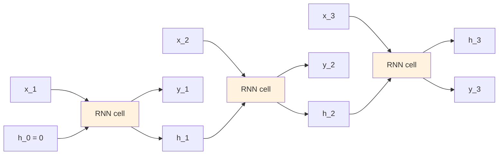
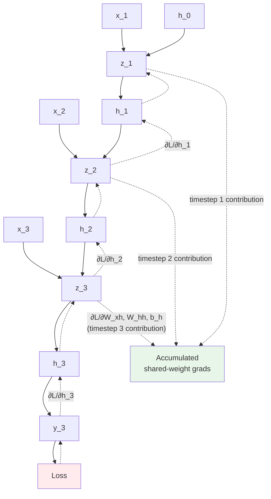

# Sequence Models — Concepts and Mental Models

**Recurrence, hidden state, BPTT (Backpropagation Through Time), vanishing gradients, LSTM gates. With a fully worked numerical example.**

---

> **Build on the foundations.** Backpropagation, training loop, optimizers — see [Deep Learning → Concepts](../deep-learning/02_Concepts.md). For derivatives and chain rule: [Math for AI](../math-for-ai.md). This chapter focuses on what is *unique to sequences*: weight sharing across time, BPTT, and the gating mechanisms that solve vanishing gradients.

---

## The Recurrent Idea — One Network, Reused at Every Timestep

A feedforward network has no memory. Each input is processed independently. To handle sequences, we add **a hidden state that persists across timesteps** — a small vector that gets updated as each new input arrives.



**Key insight: it is the same RNN cell drawn three times.** Same weights. The diagram shows it "unrolled" through time. The hidden state `h_t` carries information forward; the input `x_t` arrives fresh at each step; the output `y_t` may or may not be produced at every step (sometimes only at the final step).

### The Forward Equations (Vanilla RNN)

```
z_t   = W_xh · x_t + W_hh · h_{t-1} + b_h
h_t   = tanh(z_t)
y_t   = W_hy · h_t + b_y
```

| Symbol | Shape | Meaning |
|---|---|---|
| `x_t` | (D,) | Input at timestep t |
| `h_t` | (H,) | Hidden state at timestep t |
| `y_t` | (C,) | Output at timestep t |
| `W_xh` | (H, D) | Input-to-hidden weights (shared across time) |
| `W_hh` | (H, H) | Hidden-to-hidden weights (shared across time) |
| `W_hy` | (C, H) | Hidden-to-output weights |
| `b_h`, `b_y` | (H,), (C,) | Biases |

**Weight sharing is the central feature.** The same `W_xh`, `W_hh`, `b_h` are used at every timestep. This is analogous to CNN's weight sharing across spatial positions, but here weights are shared across **time**. The consequence: their gradients accumulate from every timestep during backprop.

---

## Why Recurrence — What Feedforward Cannot Do

For a feedforward network to handle a sequence, it would need either:
1. **Fixed window** — concatenate the last N inputs into one vector. Bounded memory; arbitrary cutoff; cannot model dependencies past N. This is what was tried before RNN.
2. **Stateless processing** — treat each timestep independently. Loses all temporal structure. Useless for sequences.

Recurrence solves both by routing the network's own output back as input. The network builds a representation that summarizes everything seen so far — in principle, unbounded history.

In practice, vanilla RNNs cannot remember more than ~10 timesteps because gradients vanish. LSTM (covered later in this chapter) fixes that with gating.

---

## A Worked Example — Vanilla RNN by Hand

Three timesteps. Hidden size 2. One scalar input per step. One scalar output (regression). Loss only on the final timestep.

### Setup

```
Input dim D = 1
Hidden dim H = 2
Output dim C = 1
Sequence: x_1 = 1.0, x_2 = 0.5, x_3 = -0.5
Target = 0.5 (we predict only at t=3)

Initial weights:
W_xh = [0.5, 0.3]ᵀ              shape (2, 1)
W_hh = [[0.1,  0.2],
        [-0.1, 0.4]]            shape (2, 2)
W_hy = [0.3, 0.5]               shape (1, 2)
b_h  = [0, 0]
b_y  = [0]

h_0  = [0, 0]                   initial hidden state
α    = 0.1                      learning rate
```

### Forward — Step Through Time

**t=1.** New input `x_1 = 1.0`, previous state `h_0 = [0, 0]`.

```
z_1 = W_xh · 1.0 + W_hh · [0,0] + [0,0]
    = [0.5, 0.3]
h_1 = tanh([0.5, 0.3]) = [0.4621, 0.2913]
y_1 = W_hy · h_1 = 0.3·0.4621 + 0.5·0.2913 = 0.2843
```

**t=2.** New input `x_2 = 0.5`, previous state `h_1 = [0.4621, 0.2913]`.

```
z_2 = W_xh · 0.5 + W_hh · [0.4621, 0.2913] + [0,0]
    = [0.25, 0.15] + [0.1·0.4621 + 0.2·0.2913, -0.1·0.4621 + 0.4·0.2913]
    = [0.25, 0.15] + [0.1045, 0.0703]
    = [0.3545, 0.2203]
h_2 = tanh([0.3545, 0.2203]) = [0.3403, 0.2168]
y_2 = 0.3·0.3403 + 0.5·0.2168 = 0.2105
```

**t=3.** New input `x_3 = -0.5`, previous state `h_2 = [0.3403, 0.2168]`.

```
z_3 = W_xh · (-0.5) + W_hh · [0.3403, 0.2168]
    = [-0.25, -0.15] + [0.0774, 0.0526]
    = [-0.1726, -0.0974]
h_3 = tanh([-0.1726, -0.0974]) = [-0.1709, -0.0970]
y_3 = 0.3·(-0.1709) + 0.5·(-0.0970) = -0.0998
```

### Loss

```
L = 0.5 · (y_3 − target)² = 0.5 · (-0.0998 − 0.5)² = 0.5 · 0.3597 = 0.1799
```

### Backward — BPTT (Backpropagation Through Time)

This is the unique mechanic of recurrent training. The same chain rule from the [Deep Learning playbook](../deep-learning/02_Concepts.md), but applied to an *unrolled* network where weights are shared across timesteps. **Gradients accumulate from every timestep** through which a weight participated.

**Step 1.** Output gradient.

```
∂L/∂y_3 = y_3 − target = -0.0998 − 0.5 = -0.5998

∂L/∂W_hy = ∂L/∂y_3 · h_3   = [-0.5998 · (-0.1709), -0.5998 · (-0.0970)]
                            = [0.1025, 0.0582]
∂L/∂b_y  = ∂L/∂y_3          = -0.5998
```

**Step 2.** Pass to the hidden state at the final timestep.

```
∂L/∂h_3 = W_hyᵀ · ∂L/∂y_3 = [0.3, 0.5]ᵀ · -0.5998 = [-0.1799, -0.2999]
```

**Step 3.** Walk backward through time. At each timestep, compute `∂L/∂z_t`, accumulate gradients into the shared weights, and propagate `∂L/∂h_{t-1}` to the previous timestep.

The tanh derivative is `1 − h²`. So `∂h_t/∂z_t = 1 − h_t²` (element-wise).

**At t=3:**

```
∂L/∂z_3 = ∂L/∂h_3 ⊙ (1 − h_3²)
        = [-0.1799, -0.2999] ⊙ [1 − 0.1709², 1 − 0.0970²]
        = [-0.1799, -0.2999] ⊙ [0.9708, 0.9906]
        = [-0.1747, -0.2971]

# Accumulate into shared-time weights
∂L/∂W_xh += ∂L/∂z_3 · x_3 = [-0.1747, -0.2971] · (-0.5) = [0.0874, 0.1486]
∂L/∂W_hh += outer(∂L/∂z_3, h_2) = outer([-0.1747, -0.2971], [0.3403, 0.2168])
∂L/∂b_h  += ∂L/∂z_3 = [-0.1747, -0.2971]

# Propagate to t=2
∂L/∂h_2 = W_hhᵀ · ∂L/∂z_3
```

**At t=2:**

```
∂L/∂z_2 = ∂L/∂h_2 ⊙ (1 − h_2²) = [0.0108, -0.1465]
# Accumulate again into the same W_xh, W_hh, b_h
# Propagate to t=1
```

**At t=1:**

```
∂L/∂z_1 = ∂L/∂h_1 ⊙ (1 − h_1²) = [0.0124, -0.0517]
# Final accumulation. No further propagation (h_0 was zero, no params).
```

After walking all three timesteps, the **summed** gradients are:

```
∂L/∂W_xh = [0.1051, 0.0236]ᵀ          (sum over all 3 timesteps)
∂L/∂W_hh = [[-0.0544, -0.0347],
            [-0.1688, -0.1071]]        (sum over all 3 timesteps)
∂L/∂b_h  = [-0.1515, -0.4953]          (sum over all 3 timesteps)
```

**This is what makes BPTT different from vanilla backprop.** The shared weights `W_xh`, `W_hh`, `b_h` accumulate gradient contributions from every timestep — exactly analogous to how CNN filter weights accumulate across spatial positions. Weight sharing in time = gradient accumulation in time.

### Update

```
W_xh ← W_xh − α · ∂L/∂W_xh = [0.5, 0.3]ᵀ − 0.1·[0.1051, 0.0236]ᵀ ≈ [0.4895, 0.2976]ᵀ
W_hh ← W_hh − α · ∂L/∂W_hh
W_hy ← W_hy − α · ∂L/∂W_hy ≈ [0.2898, 0.4942]
(... etc.)
```

The companion notebook ([Sequence_Models_From_Scratch.ipynb](https://colab.research.google.com/github/sunilmogadati/systems-in-production/blob/main/implementation/notebooks/Sequence_Models_From_Scratch.ipynb)) runs this entire walkthrough in NumPy and verifies every gradient against PyTorch autograd.

---

## BPTT in One Picture



Solid arrows: forward through time. Dashed arrows: BPTT backward. The unique mechanic is the three "timestep contribution" arrows all flowing into the same accumulated gradient — that is weight sharing in time, expressed as gradient summation.

---

## Why Vanilla RNN Training Is Hard — Vanishing Gradients

Look at the BPTT chain. To get the gradient at timestep 1, the signal must pass backward through:

```
h_3 → h_2 → h_1
```

At each step, the gradient is multiplied by `W_hh` and by `tanh'(z) = 1 − h²`. Two problems:

1. **`tanh'` is at most 1**, and is much less than 1 when `|h|` is close to ±1 (which is almost always for trained tanh activations).
2. **`W_hh` has a spectral radius** that is typically less than 1 in trained networks (or sharply tuned).

So the gradient at timestep 1 is something like:

```
∂L/∂h_1 ≈ ∂L/∂h_3 · W_hh · tanh'(z_2) · W_hh · tanh'(z_1)
        ≈ ∂L/∂h_3 · (small)²
```

Each backward step multiplies by something less than 1. Across 100 timesteps, the gradient becomes effectively **zero** — vanishing gradients. The network cannot learn long-range dependencies because the signal decays.

The opposite problem (**exploding gradients**) happens when `W_hh`'s spectral radius is greater than 1: gradients blow up exponentially and training diverges. Mitigation: **gradient clipping** (cap the gradient norm at some threshold).

The fundamental fix: **LSTM** introduces an additive path that does not multiply by small numbers each step.

---

## LSTM — The Gated Solution

An **LSTM (Long Short-Term Memory, "L-S-T-M")** cell replaces the simple RNN update with **gates** — small networks that decide what to forget, what to remember, and what to output. The cell maintains two states: a **cell state `C_t`** (the long-term memory) and a **hidden state `h_t`** (the short-term, used by the output).

### The Six LSTM Equations

```
f_t = σ(W_f · [h_{t-1}, x_t] + b_f)        ← forget gate
i_t = σ(W_i · [h_{t-1}, x_t] + b_i)        ← input gate
g_t = tanh(W_g · [h_{t-1}, x_t] + b_g)     ← candidate (new info)
o_t = σ(W_o · [h_{t-1}, x_t] + b_o)        ← output gate

C_t = f_t ⊙ C_{t-1} + i_t ⊙ g_t            ← cell state update
h_t = o_t ⊙ tanh(C_t)                       ← hidden state output
```

Where `σ` is sigmoid (squashes to [0, 1] — useful as a gate) and `⊙` is element-wise multiplication.

### What Each Gate Does

| Gate | What It Decides |
|---|---|
| **Forget gate** `f_t` | "How much of the previous cell state to keep?" Values near 1 → remember; near 0 → forget |
| **Input gate** `i_t` | "How much of the new candidate information to write?" |
| **Candidate** `g_t` | "What is the new information?" (tanh, so range -1 to 1) |
| **Output gate** `o_t` | "How much of the cell state to expose as h_t?" |

### Why LSTM Solves Vanishing Gradients

Look at the cell state update:

```
C_t = f_t ⊙ C_{t-1} + i_t ⊙ g_t
```

This is **additive**, not multiplicative. The gradient with respect to `C_{t-1}` is:

```
∂C_t/∂C_{t-1} = f_t
```

If the forget gate `f_t` is open (near 1), the gradient passes through unchanged. **No multiplication by tanh derivatives. No multiplication by small `W_hh`.** The gradient flows back through hundreds of timesteps if the forget gate stays open.

This additive shortcut for gradient flow is the same idea that ResNet used (later, 2015) for depth, and that Transformers use in their residual connections. **Additive shortcuts that preserve gradient flow** is one of the most important architectural ideas in modern deep learning.

### LSTM Cell Diagram

```mermaid
graph TD
    Prev_C[C_{t-1}] --> Mult1["⊙ f_t<br/>(forget)"]
    Mult1 --> Add[+]
    g["g_t (candidate)"] --> Mult2["⊙ i_t<br/>(input gate)"]
    Mult2 --> Add
    Add --> C_new[C_t]
    C_new --> Tanh[tanh]
    Tanh --> Mult3["⊙ o_t<br/>(output gate)"]
    Mult3 --> H_new[h_t]

    style C_new fill:#FFF3E0
    style H_new fill:#E1F5FE
```

The horizontal line `C_{t-1} → · → C_t` is the **cell-state highway**. Modulated only by the forget gate (one multiplication per step) — much gentler than the cascade in vanilla RNN.

---

## GRU — A Simpler Variant

The **GRU (Gated Recurrent Unit)** merges the cell state and hidden state, and uses two gates instead of four. Fewer parameters, similar performance to LSTM on most tasks.

```
r_t = σ(W_r · [h_{t-1}, x_t] + b_r)        ← reset gate
z_t = σ(W_z · [h_{t-1}, x_t] + b_z)        ← update gate
ñ_t = tanh(W_n · [r_t ⊙ h_{t-1}, x_t] + b_n)
h_t = z_t ⊙ h_{t-1} + (1 − z_t) ⊙ ñ_t      ← interpolation
```

| | LSTM | GRU |
|---|---|---|
| Parameters | More (4 gates × 4 weight matrices) | Fewer (2 gates × 3 weight matrices) |
| State | Two: cell `C_t` + hidden `h_t` | One: hidden `h_t` |
| Performance | Slightly better on most tasks | Slightly worse, faster training |
| When to use | Default for production | When parameters or training time matter |

For most production work, LSTM and GRU are interchangeable. Pick GRU if you need fewer parameters; pick LSTM if you have enough compute and want the marginal accuracy gain.

---

## Parameter Counts

For a single recurrent layer with input dim `D` and hidden dim `H`:

| Architecture | Parameter count |
|---|---|
| **Vanilla RNN** | `H · D + H² + H` (W_xh + W_hh + b_h) |
| **LSTM** | `4H · (H + D) + 4H` |
| **GRU** | `3H · (H + D) + 3H` |

LSTM has 4× the parameters of vanilla RNN at the same hidden size (one set per gate). GRU has 3×.

For worked examples with concrete numbers, see [Architecture Math → Type 1: Parameter Counting](../architecture-math.md#type-1-parameter-counting).

---

## When to Use Recurrent Models — Decision Table

| Situation | Recommendation |
|---|---|
| **NLP, large dataset, batch processing** | Use Transformer (see [transformers/](../transformers/)) |
| **Streaming inference (low memory, constant per step)** | Use LSTM or GRU |
| **Time-series forecasting, small dataset** | Use LSTM or GRU; may beat Transformer |
| **Edge / embedded deployment** | Use GRU (fewer parameters) or LSTM |
| **Long sequences (>1000 timesteps), batch mode** | Use Transformer (parallel) or specialized SSM (State Space Model) |
| **Sequential decision making with stateful agents** | Use LSTM/GRU; state-keeping is natural |
| **Anomaly detection on streams** | Use LSTM (forecast next, residual = anomaly) |

---

## Glossary — Quick Reference

### Sequence-Specific Terms

| Term | Pronounced | Meaning |
|---|---|---|
| **Sequence** | — | Ordered data; shuffling destroys meaning |
| **Timestep** | — | One position in the sequence (one word, one frame, one sample) |
| **RNN** | "R-N-N" | Recurrent Neural Network |
| **LSTM** | "L-S-T-M" | Long Short-Term Memory — RNN with gated memory |
| **GRU** | "G-R-U" | Gated Recurrent Unit — simpler LSTM |
| **BPTT** | "B-P-T-T" | Backpropagation Through Time |
| **Hidden state** | — | The vector that carries information forward |
| **Cell state** (LSTM) | — | The long-term memory channel |
| **Gate** | — | A sigmoid-activated network that controls information flow (0=block, 1=pass) |
| **Forget gate** | — | LSTM gate that decides how much of the cell state to keep |
| **Input gate** | — | LSTM gate that decides how much new info to write |
| **Output gate** | — | LSTM gate that decides how much cell state to expose |
| **Vanishing gradients** | — | The problem in vanilla RNNs where gradients shrink to near-zero across many timesteps |
| **Exploding gradients** | — | Gradients grow exponentially; fixed by gradient clipping |
| **Gradient clipping** | — | Capping the gradient norm to prevent explosion |
| **Teacher forcing** | — | Training trick: feed the ground-truth previous output as input instead of the model's own prediction |

For the full cross-architecture glossary, see [Architecture Glossary](../architecture-glossary.md). For the deep dive on RNN/LSTM math and code, see [`architectures/rnn-lstm.md`](architectures/rnn-lstm.md).

---

**Next:** [03 — Hello World](03_Hello_World.md) — Build a working LSTM in 50 lines of PyTorch.
