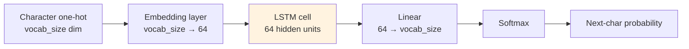

# Sequence Models — Hello World

**Build a working LSTM that predicts the next character in 60 lines of PyTorch.**

---

## What You Will Build

An LSTM that learns to predict the next character given the sequence so far. Trained on a small text corpus, it will generate text in the style of the training data after a few minutes of training.

This is the simplest end-to-end sequence model that matters: a character-level language model. After this, [Chapter 04](04_How_It_Works.md) explains *why* it works (and how to fix it when it does not).

---

## The Architecture



Every step receives one character, updates the LSTM hidden state, and produces a probability distribution over the next character.

---

## The Code

```python
import torch
import torch.nn as nn

# === DATA ===
# Tiny corpus — replace with any text file
text = """to be or not to be that is the question
whether tis nobler in the mind to suffer
the slings and arrows of outrageous fortune
or to take arms against a sea of troubles"""

# Build vocabulary
chars = sorted(set(text))
vocab_size = len(chars)
char_to_idx = {c: i for i, c in enumerate(chars)}
idx_to_char = {i: c for i, c in enumerate(chars)}

# Encode the text as a sequence of integer character IDs
encoded = torch.tensor([char_to_idx[c] for c in text], dtype=torch.long)
SEQ_LEN = 16

# === MODEL ===
class CharLSTM(nn.Module):
    def __init__(self, vocab_size, embed_dim=32, hidden_dim=64):
        super().__init__()
        self.embed = nn.Embedding(vocab_size, embed_dim)
        self.lstm  = nn.LSTM(embed_dim, hidden_dim, batch_first=True)
        self.fc    = nn.Linear(hidden_dim, vocab_size)

    def forward(self, x, hidden=None):
        x = self.embed(x)                  # (B, T) → (B, T, embed_dim)
        out, hidden = self.lstm(x, hidden) # (B, T, hidden_dim)
        return self.fc(out), hidden        # (B, T, vocab_size), (h, c)

# === SETUP ===
device = torch.device('cuda' if torch.cuda.is_available() else 'cpu')
model = CharLSTM(vocab_size).to(device)
optimizer = torch.optim.Adam(model.parameters(), lr=0.005)
loss_fn   = nn.CrossEntropyLoss()

# === TRAIN ===
EPOCHS = 200

for epoch in range(EPOCHS):
    # Build a random batch of (input, target) pairs from the corpus
    starts = torch.randint(0, len(encoded) - SEQ_LEN - 1, (32,))
    inputs  = torch.stack([encoded[s:s+SEQ_LEN]       for s in starts]).to(device)  # (B, T)
    targets = torch.stack([encoded[s+1:s+SEQ_LEN+1]  for s in starts]).to(device)  # (B, T)

    # Forward
    logits, _ = model(inputs)                          # (B, T, vocab_size)

    # Reshape for cross-entropy: predict each timestep's char
    loss = loss_fn(logits.reshape(-1, vocab_size), targets.reshape(-1))

    # Standard 5-step training loop
    optimizer.zero_grad()
    loss.backward()
    optimizer.step()

    if (epoch + 1) % 50 == 0:
        print(f"Epoch {epoch+1}: loss = {loss.item():.4f}")

# === GENERATE ===
def generate(model, start='t', length=80):
    model.eval()
    chars_out = list(start)
    x = torch.tensor([[char_to_idx[c] for c in start]], device=device)
    hidden = None
    for _ in range(length):
        logits, hidden = model(x, hidden)
        next_char_id = torch.multinomial(torch.softmax(logits[0, -1], dim=0), 1).item()
        chars_out.append(idx_to_char[next_char_id])
        x = torch.tensor([[next_char_id]], device=device)
    return ''.join(chars_out)

print("\nGenerated:", generate(model, start='to be'))
```

That is the entire system. **~60 lines for the model + training + generation.**

---

## What You Should See

```
Epoch  50: loss = 2.1453
Epoch 100: loss = 1.4812
Epoch 150: loss = 1.0247
Epoch 200: loss = 0.7384

Generated: to be or not to be that is the questia of nobler in
```

After 200 epochs on the tiny Hamlet corpus, the LSTM has memorized the structure. The output blends real phrases ("to be or not to be") with novel character combinations.

For a real corpus (Shakespeare's complete works, ~1MB), this same model trained for an hour produces text that reads like Shakespearean English at the surface level — same characters, same word lengths, same rhythm. It does not understand meaning, but it captures the *statistics* of the sequence.

---

## What Just Happened — The 5-Step Training Loop, with Sequences

The same training loop from [Deep Learning → Concepts](../deep-learning/02_Concepts.md), but with sequence data:

| Step | Code | What It Does |
|---|---|---|
| **1. Forward** | `logits, _ = model(inputs)` | LSTM reads each character, updates hidden state, produces a probability over next characters |
| **2. Loss** | `loss = loss_fn(logits.reshape(...), targets.reshape(...))` | Cross-entropy at every timestep — the network must predict each next character |
| **3. Zero gradients** | `optimizer.zero_grad()` | Standard |
| **4. Backward** | `loss.backward()` | **PyTorch runs BPTT automatically** — gradients flow back through every timestep |
| **5. Update** | `optimizer.step()` | Weights update; the shared LSTM weights aggregate gradients from every timestep |

**The unique sequence-models thing**: in step 4, `loss.backward()` walks the unrolled network *through time* and accumulates gradients into the shared LSTM weights. This is what we walked through by hand in [Chapter 02 → BPTT](02_Concepts.md#backward--bptt-backpropagation-through-time).

---

## Common Bugs

### 1. Forgetting `batch_first=True`

```python
self.lstm = nn.LSTM(embed_dim, hidden_dim, batch_first=True)  # ✓ inputs are (B, T, D)
self.lstm = nn.LSTM(embed_dim, hidden_dim)                    # default: (T, B, D) — different!
```

PyTorch's default sequence-first convention is `(T, B, D)`. Most modern code uses `batch_first=True` for consistency with other layers. Picking the wrong one causes shape mismatches downstream.

### 2. Hidden State Type Mismatch (LSTM vs RNN/GRU)

LSTM returns `(hidden, (h_n, c_n))` — a TUPLE of hidden state and cell state. Vanilla RNN and GRU return just `(hidden, h_n)`. If you wrote your code for one and switch to the other, the unpacking breaks.

### 3. Detaching Hidden State Across Batches

If you carry hidden state across mini-batches (truncated BPTT), you must detach:

```python
hidden = (hidden[0].detach(), hidden[1].detach())   # for LSTM
```

Without detach, autograd tries to backpropagate through the entire history of all previous batches — quickly running out of memory.

### 4. Exploding Gradients on Long Sequences

If loss goes to NaN after a few epochs, suspect exploding gradients. Add gradient clipping:

```python
torch.nn.utils.clip_grad_norm_(model.parameters(), max_norm=5.0)
```

Place this between `loss.backward()` and `optimizer.step()`. Clipping caps the gradient norm at 5.0 (typical value); training continues stably.

---

## Run It Yourself

The from-scratch notebook walks through the same example with **manual BPTT** (no autograd), so you can see exactly how gradients flow back through time:

**[Sequence Models From Scratch on Colab](https://colab.research.google.com/github/sunilmogadati/systems-in-production/blob/main/implementation/notebooks/Sequence_Models_From_Scratch.ipynb)** — vanilla RNN forward through 3 timesteps, full BPTT backward by hand, every gradient verified against PyTorch autograd.

For the architecture deep dive (more code, more math, more Q&A in one document):

**[`architectures/rnn-lstm.md`](architectures/rnn-lstm.md)** — single-doc reference covering BPTT, vanishing gradients, LSTM gates, training and inference.

---

**Next:** [04 — How It Works](04_How_It_Works.md) — Vanishing/exploding gradients diagnosed in practice. Gradient clipping. Sequence length tradeoffs. Why training oscillates.
