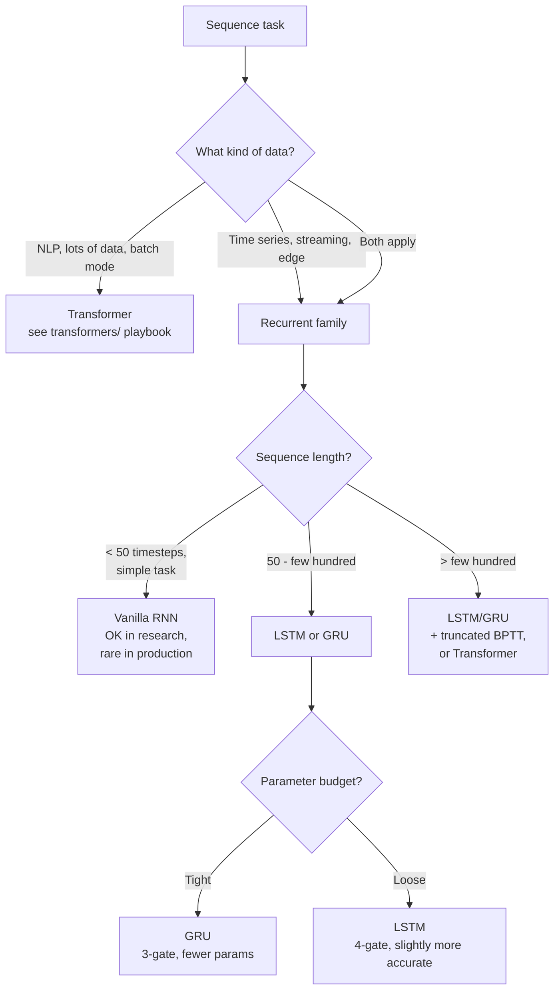
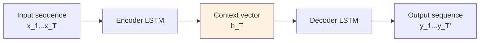

# Sequence Models — Building It

**RNN vs LSTM vs GRU vs Transformer — when to use which. Architecture choices, training recipes, dataset patterns. Hyperparameters that matter.**

---

## The Core Decision: RNN, LSTM, GRU, or Transformer?



### Decision Table

| Situation | Choice |
|---|---|
| **NLP, large dataset, GPU available** | Transformer |
| **Time-series forecasting, < 10k examples** | LSTM or GRU |
| **Streaming inference, constant memory required** | LSTM or GRU |
| **Edge / mobile deployment, < 1MB model** | GRU (often) or quantized LSTM |
| **Sequential agent / online RL** | LSTM or GRU |
| **Research baseline, < 50-step sequences** | Vanilla RNN (educational only) |
| **Anomaly detection on sensor streams** | LSTM (next-value forecast → residual = anomaly) |

In production (2026), **vanilla RNN is rarely used**. LSTM and GRU dominate the recurrent space. Transformers dominate everywhere else.

---

## A Standard Production Recipe (LSTM Time-Series)

For a time-series forecasting LSTM on, say, hourly server load:

```python
import torch
import torch.nn as nn

class LSTMForecaster(nn.Module):
    def __init__(self, input_dim, hidden_dim=64, num_layers=2, output_dim=1, dropout=0.2):
        super().__init__()
        self.lstm = nn.LSTM(
            input_size=input_dim,
            hidden_size=hidden_dim,
            num_layers=num_layers,
            dropout=dropout if num_layers > 1 else 0,    # PyTorch dropout only between layers
            batch_first=True,
        )
        self.fc = nn.Linear(hidden_dim, output_dim)

    def forward(self, x, hidden=None):
        out, hidden = self.lstm(x, hidden)               # (B, T, hidden)
        return self.fc(out[:, -1, :]), hidden            # predict from last timestep
```

### The Training Loop with Production-Grade Pieces

```python
device = torch.device('cuda' if torch.cuda.is_available() else 'cpu')
model = LSTMForecaster(input_dim=10).to(device)

# Apply the forget-gate-bias-1 trick
for name, param in model.named_parameters():
    if 'bias_ih' in name or 'bias_hh' in name:
        n = param.shape[0]
        param.data[n//4 : n//2].fill_(1.0)

optimizer = torch.optim.AdamW(model.parameters(), lr=1e-3, weight_decay=0.01)
scheduler = torch.optim.lr_scheduler.CosineAnnealingLR(optimizer, T_max=NUM_EPOCHS)
loss_fn   = nn.MSELoss()

for epoch in range(NUM_EPOCHS):
    for inputs, targets in train_loader:
        inputs, targets = inputs.to(device), targets.to(device)

        # 1. Forward
        predictions, _ = model(inputs)

        # 2. Loss
        loss = loss_fn(predictions, targets)

        # 3. Backward
        optimizer.zero_grad()
        loss.backward()

        # 4. Gradient clipping — REQUIRED for recurrent models
        torch.nn.utils.clip_grad_norm_(model.parameters(), max_norm=5.0)

        # 5. Update
        optimizer.step()

    scheduler.step()
```

### What Each Choice Buys You

| Choice | Why |
|---|---|
| `num_layers=2` | Stacked LSTM. More representational power than single-layer. Two layers is the standard sweet spot. |
| `dropout=0.2` between layers | Standard LSTM regularization. PyTorch only applies between stacked layers, not within a layer. |
| Forget-gate bias = 1 | Helps training reach long-range dependencies faster |
| `AdamW` over `Adam` | Better weight decay |
| Cosine LR schedule | Modern default for sequence models |
| `clip_grad_norm_(max=5.0)` | **Non-negotiable** for recurrent training |
| Predict from last timestep `out[:, -1, :]` | For forecasting, the final hidden state encodes everything |

This recipe will train stably on most time-series tasks. Tune `hidden_dim`, `num_layers`, and `dropout` for your dataset.

---

## Choosing Hidden Dimension

Rough rules:

| Dataset Size | Hidden Dim | Number of Layers |
|---|---|---|
| Small (<10k sequences) | 32-64 | 1-2 |
| Medium (10k-100k) | 64-256 | 2 |
| Large (100k-1M) | 256-512 | 2-3 |
| Very large (1M+) | 512-1024 | 3+ (consider Transformer) |

**Bigger is not always better** for recurrent models. Larger hidden dims are slower to train (no parallelism) and overfit faster. Most production LSTMs are in the 64-256 range.

For Transformer, the equivalent (`d_model`) is usually 256-1024 for similar tasks. Transformers benefit from scale more than RNNs.

---

## Bidirectional vs Unidirectional

A **bidirectional** RNN runs two passes — one forward through the sequence and one backward — and concatenates the hidden states. Useful when the entire sequence is available at inference time.

```python
self.lstm = nn.LSTM(
    input_size=D,
    hidden_size=H,
    num_layers=2,
    bidirectional=True,    # doubles hidden size in output
    batch_first=True,
)
```

| | Unidirectional | Bidirectional |
|---|---|---|
| Sees future tokens at inference | No | Yes |
| Use for streaming inference | ✓ | ✗ (can't run during streaming) |
| Use for offline analysis | ✓ | ✓ (preferred) |
| Parameters | H | 2H |

If your task is **classification of an entire pre-collected sequence** (e.g., sentiment classification of a tweet, named entity recognition on a document), use bidirectional. If your task is **online prediction as data arrives** (live captions, real-time forecasting), use unidirectional.

---

## Encoding Time and External Features

Real time-series data is rarely just one number per timestep. You typically have:

- The target value (e.g., server load)
- Calendar features (hour-of-day, day-of-week, is_holiday)
- Lag features (value 1 hour ago, 24 hours ago)
- External signals (weather, traffic, marketing campaign on/off)

These all become input dimensions:

```python
# At each timestep, the input is a vector of features
input_dim = 1 (load) + 24 (one-hot hour) + 7 (one-hot day) + 1 (is_holiday)
         + 5 (lag features) + 4 (external signals)
         = 42

model = LSTMForecaster(input_dim=42, hidden_dim=128, num_layers=2)
```

Modern time-series practice augments raw values with rich feature engineering. The LSTM still handles the temporal patterns, but the engineered features give it more to work with than raw values alone.

---

## Sequence-to-Sequence (Seq2Seq)

For tasks where input and output are both sequences (translation, summarization, chatbots in the pre-Transformer era):



The encoder LSTM reads the input and compresses it to a final hidden state. The decoder LSTM reads that hidden state and generates the output sequence.

In 2026, **Seq2Seq with LSTM is mostly legacy** — Transformers (specifically encoder-decoder architectures like T5 and BART) handle this better. Seq2Seq LSTMs still appear in:
- Speech-to-text (some streaming variants)
- Time-series multi-step forecasting
- Specialized NLP applications with low compute budgets

For new Seq2Seq work, default to Transformer.

---

## Attention on Top of LSTM (The Pre-Transformer Era)

Adding attention to LSTM was the bridge between pure recurrence and pure Transformers. The decoder attends to all encoder hidden states, not just the final one. This was the architecture that won at Google Translate from ~2015-2017.

```python
# Pseudocode
encoder_outputs = encoder_lstm(input_seq)        # (T, hidden_dim)
for t in output_seq_steps:
    attention_weights = softmax(decoder_state @ encoder_outputs.T)
    context = attention_weights @ encoder_outputs
    decoder_state = decoder_lstm(input + context, decoder_state)
```

In 2026, you would not start a new project with this architecture (use Transformer). But understanding it helps when you read older papers or maintain legacy systems.

---

## Cost-of-Training Reality

Recurrent models train **slower per epoch** than Transformers with similar parameter counts because they cannot parallelize across time. But they often converge faster and need less data.

| Model | Parameters | Compute | Training Time (rough) |
|---|---|---|---|
| Small LSTM (1 layer, 64 hidden, 100K params) | ~100K | Sequential | Minutes-hours on a GPU for ~10K sequences |
| Medium LSTM (2 layer, 256 hidden, 1M params) | ~1M | Sequential | Hours on a GPU for ~100K sequences |
| Production-scale LSTM | ~10M | Sequential | Day or two on a GPU |
| Equivalent-task Transformer | ~10x more | Parallel across time | Hours on a GPU; faster wall-clock for the same data |

**The rule:** for small data, LSTM trains faster (less data means less time-axis parallelism gain for Transformer). For large data, Transformer wins on wall-clock time.

---

## Production-Ready Recipe (2026)

The practical workflow for shipping a recurrent model:

1. **Pick LSTM or GRU** based on parameter budget
2. **Standard architecture**: 2 stacked layers, 64-256 hidden dim, 0.2 dropout
3. **Apply training tricks**: forget-gate bias = 1, gradient clipping (max_norm=5.0)
4. **Optimizer**: AdamW at 1e-3 with cosine schedule
5. **Engineer features**: lag features, calendar features, external signals
6. **Validate on held-out time periods** — never random shuffle for time-series
7. **Plan deployment**: see [System Design](07_System_Design.md) for streaming serving
8. **Monitor**: drift detection over time-of-deployment ([Observability](09_Observability_Troubleshooting.md))

For most time-series and streaming production work in 2026, this recipe ships reliably.

---

**Next:** [06 — Production Patterns](06_Production_Patterns.md) — Uber demand forecasting, Netflix capacity, IoT anomaly detection, voice assistants, financial trading.
