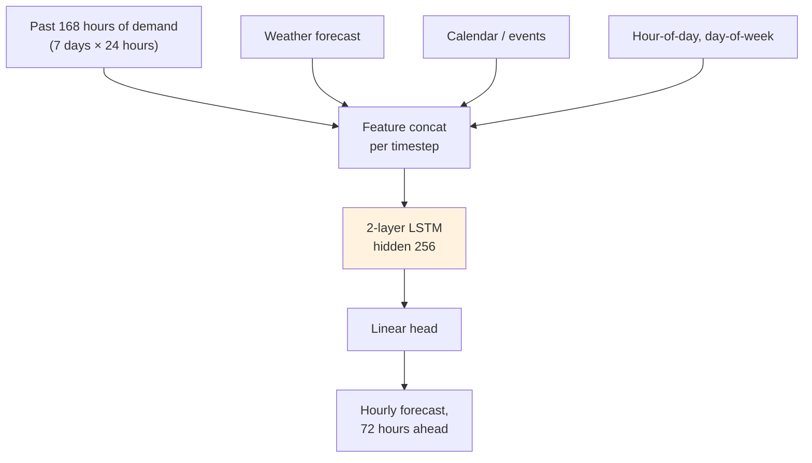

# Sequence Models — Production Patterns

**Real systems built on RNN, LSTM, and GRU. Time-series forecasting at Uber, capacity planning at Netflix, IoT anomaly detection, voice assistants, financial trading. The architectures, the constraints, the lessons.**

---

## Pattern 1: Uber Demand Forecasting — LSTM at City-Scale

**The problem.** Forecast rider demand for every neighborhood of every city, every 15 minutes, days into the future. Used for driver positioning, surge pricing, ETA estimates.

**The architecture (publicly disclosed).** Uber's Forecasting Platform initially used **multi-layer LSTM with autoregressive multi-step prediction**, augmented by external features (weather, events, holidays, time-of-day). They later evolved toward Temporal Fusion Transformers (TFT) for some use cases, but LSTMs remained for many.



**Why LSTM works here.** The data has strong daily and weekly seasonality, plus rich exogenous features. LSTM handles the temporal structure; the engineered features handle the exogenous signals. Training data is large but per-city models are smaller — LSTM's parameter efficiency pays off.

**Production realities.**
- **Per-city training** — one global model would not handle local patterns; one model per city would not generalize. Compromise: shared encoder + city-specific decoder heads, or ensemble of regional models.
- **Drift handling** — demand patterns shift (post-COVID, post-rideshare-policy-changes). Models retrain weekly with rolling-window evaluation.
- **Forecast horizon vs accuracy** — 1-hour-ahead is highly accurate; 72-hour-ahead is much harder. Multi-step error compounds.
- **Real-time serving** — forecasts pre-computed; updated continuously as new data arrives.

**Lesson.** **Time-series production is more about features and operations than the model.** The LSTM is straightforward; the data engineering, retraining cadence, and per-city handling are where the real work lives.

**Sources.** Uber Engineering blog posts on Forecasting Platform, M4 forecasting competition write-ups.

---

## Pattern 2: Netflix Capacity Planning — Predicting Traffic for Autoscaling

**The problem.** Predict traffic to every microservice across the Netflix platform so the autoscaler can pre-provision capacity. Underprovisioning causes outages; overprovisioning costs millions per year.

**The architecture.** LSTM-based time-series forecasters running per-service. Inputs include:

- Historical traffic (requests per second, per-minute aggregated)
- Time-of-day, day-of-week features
- Show release schedule (a popular new show drops → spike)
- Active subscriber count
- Calendar events (Super Bowl Sunday, holidays)

The output is a forecast of next-hour, next-day traffic with confidence intervals.

**Production patterns:**

| Pattern | Detail |
|---|---|
| **Hierarchical forecasting** | Forecast at the service level, aggregate up to the cluster level. Hierarchical reconciliation makes them consistent. |
| **Probabilistic outputs** | Not just point forecasts — quantile forecasts (e.g., 95th percentile traffic) drive autoscaling decisions |
| **Continuous retraining** | Models retrain daily on the latest 60-90 days of data; concept drift is the norm |
| **A/B testing on capacity** | New forecast model rolled out to a subset of services first; cost / outage tradeoff measured |

**Lesson.** **For capacity planning, bias toward overforecast.** A forecast that runs slightly hot wastes some compute but never causes an outage. A forecast that runs slightly cold can take the service down. Adjust the loss function to penalize underprediction more heavily than overprediction (asymmetric loss).

---

## Pattern 3: IoT Anomaly Detection — LSTM as a "Forecast-and-Compare" System

**The problem.** Streaming sensor data from thousands of factory floor devices. Detect anomalies that precede equipment failure. Per-device LSTMs make custom training expensive; one global model needs to handle device variety.

**The pattern: forecast-and-compare.**

```mermaid
graph TD
    Stream[Sensor stream<br/>1 sample/sec]
    Window[Sliding window<br/>last 100 samples]

    Stream --> Window
    Window --> LSTM[LSTM<br/>predict next sample]
    LSTM --> Pred[Predicted next value]

    NewSample[Actual next sample]
    Pred --> Diff[Compute residual<br/>actual − predicted]
    NewSample --> Diff

    Diff --> Norm[Normalize by<br/>recent residual std]
    Norm --> Threshold{|residual| > 3σ?}
    Threshold -->|Yes| Alert[Anomaly alert]
    Threshold -->|No| Normal[Normal — keep monitoring]

    style LSTM fill:#FFF3E0
    style Alert fill:#FFEBEE
```

The LSTM is trained to forecast the next sample given the recent history. **At inference time, large forecast errors indicate anomalies** — the LSTM has learned what "normal" looks like, and deviations from "normal" stand out.

**Why this works.**
- No labeled anomaly data required (rare anomalies are by definition rare)
- One LSTM can be fine-tuned per device class quickly
- The "what counts as anomalous" threshold is naturally adaptive (3σ over recent residuals)

**Real deployments.**
- **Predictive maintenance** in manufacturing (Siemens, GE, Bosch)
- **Server health monitoring** in data centers
- **Smart grid load anomalies** for utilities
- **Pipeline pressure monitoring** in oil & gas

**Lesson.** Anomaly detection via forecasting is one of the highest-ROI uses of LSTMs in production. **You do not need labeled anomaly data**, which is the usual blocker for supervised approaches. The LSTM learns the patterns of normal operation from raw stream data.

---

## Pattern 4: Voice Assistants — Streaming Speech Recognition

**The problem.** Convert audio to text in real time. The system hears audio at 16 kHz; it must produce text as the user speaks, not after they finish.

**The architecture (modern, ~2020-2024).** Streaming models commonly use a hybrid: convolutional front-end + LSTM (or Transformer) acoustic model + CTC (Connectionist Temporal Classification) or RNN-T (RNN-Transducer) decoder.

The LSTM (or its modern alternatives) is what enables **streaming** — the network produces partial results as audio arrives, without seeing the full utterance.

| Component | Role |
|---|---|
| Mel-spectrogram features | Audio → frequency representation |
| 1D-Conv front-end | Local acoustic patterns |
| LSTM acoustic model | Sequence-level understanding, streaming |
| RNN-T decoder | Aligns audio frames with output text without explicit segmentation |
| Output | Word/character predictions |

**Why LSTM matters for streaming speech.**
- Constant memory per timestep — does not grow with utterance length
- Naturally produces incremental output
- Low enough latency for real-time captioning

**Modern alternatives.** OpenAI Whisper uses a Transformer, but it processes 30-second chunks — not truly streaming. Production streaming systems still rely heavily on RNN-T-style architectures (Google, Apple Siri, Amazon Alexa). **In streaming speech, recurrence is alive and well.**

**Lesson.** **Streaming use cases are recurrent models' home turf.** When the constraint is "produce output as data arrives, with bounded memory," LSTM/GRU/RNN-T are hard to beat in 2026.

---

## Pattern 5: Financial Trading — LSTMs Predict the Next Tick

**The problem.** Predict the next price movement in a financial instrument from order book data and recent price history. Used by quantitative trading firms for high-frequency and medium-frequency strategies.

**The architecture (where publicly disclosed).** LSTM-based models that ingest:

- Order book features (bid/ask spreads, depth at each level)
- Recent trade history (volume, prices, time-since-last-trade)
- Cross-asset signals (correlated instruments)
- Time-of-day features (open, close, lunch)

The output is a probability distribution over next-tick movements (up, down, flat) or a regression on next-N-second return.

**Production realities.**

- **Latency is everything** — predictions must arrive faster than competitors. Microseconds matter.
- **Models are tiny** — small LSTMs (under 100K parameters) for sub-millisecond inference
- **Continuous retraining** — markets shift; models retrain daily or even hourly
- **Risk controls override** — model signals are gated by risk-management overlays
- **Backtesting carefully** — survivorship bias, look-ahead bias, transaction costs are all critical

**Lesson.** **LSTMs work for trading not because they are sophisticated but because they are fast.** A small LSTM can produce a prediction in microseconds on a CPU. Transformer alternatives often cannot meet the latency bar in HFT contexts. (For lower-frequency strategies, Transformers are increasingly competitive.)

---

## Pattern 6: Embedded Sequence Models — Cochlear Implants and Hearing Aids

**The problem.** Real-time audio processing on a tiny battery-powered device worn by humans 16+ hours a day. Power budget under 1mW for sustained audio processing. Storage budget under 1MB.

**The pattern.** Tiny GRU or LSTM (often quantized to INT8 or even INT4) embedded in DSP (Digital Signal Processor) firmware. Processes audio in real time, applying noise suppression and speech enhancement.

**Why GRU/LSTM, not Transformer.**
- Constant per-step memory — fits in tens of KB of RAM
- Naturally streaming
- Efficient on DSPs (limited matrix-multiplication throughput)
- Quantizable without big accuracy loss

**Real deployments.**
- **Cochlear implants** (Cochlear Ltd., Advanced Bionics) use GRU-style models for noise suppression
- **Hearing aids** (Phonak, Oticon, Starkey) increasingly include ML-based audio processing
- **Earbuds with active noise cancellation** (AirPods Pro and competitors) use small recurrent networks

**Lesson.** **For ultra-low-power embedded inference, parameter-efficient recurrent models still dominate.** Transformers' parallelism advantage does not apply when the device has one or two compute units; their parameter overhead is a serious cost.

---

## Common Threads

Across these six patterns:

| Theme | Manifestation |
|---|---|
| **Recurrent models excel at streaming** | Forecasting, speech, IoT, trading — all benefit from constant per-step memory |
| **The model is 10-30% of the system** | Feature engineering, retraining cadence, monitoring, edge deployment all matter more |
| **Time-series often wants overforecast bias** | Asymmetric loss when underforecast is more costly (capacity planning, anomaly detection) |
| **Drift is the norm, not the exception** | Continuous retraining is required for production deployments |
| **LSTM and GRU are still the workhorses** | Despite Transformer's NLP dominance, recurrent models are alive in 2026 |
| **Tiny models can be transformative** | A 100K-parameter LSTM can power a hearing aid; a 1M-parameter LSTM can route Uber drivers in a city |

---

## What This Means for Your Project

If you are building a sequence-model production system, the order of work that ships:

1. **Confirm streaming or batch.** Streaming → LSTM/GRU. Batch with abundant data → Transformer.
2. **Feature engineering first.** Lag features, calendar features, exogenous signals matter more than architecture.
3. **Standard recipe** ([Chapter 05](05_Building_It.md)) — 2-layer LSTM, 64-256 hidden, gradient clipping, AdamW, cosine schedule.
4. **Train/val split by time, never by random shuffle** — this catches future-leakage that destroys deployed models.
5. **Hierarchical or per-segment models** if your data has natural clusters (city, device class, instrument).
6. **Continuous retraining pipeline** — drift will happen.
7. **Asymmetric loss** if over- and under-prediction have different costs.
8. **Monitor per-segment metrics** in production — overall metrics hide segment-level failures.

For details on serving, see [Chapter 07](07_System_Design.md). For monitoring, [Chapter 09](09_Observability_Troubleshooting.md).

---

**Next:** [07 — System Design](07_System_Design.md) — Streaming inference, batching variable-length sequences, stateful serving, edge deployment.
