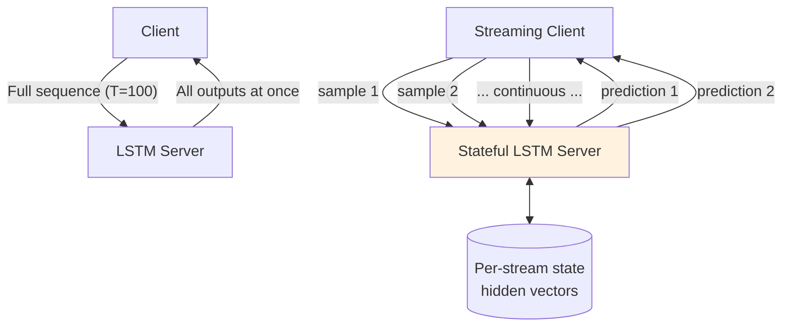
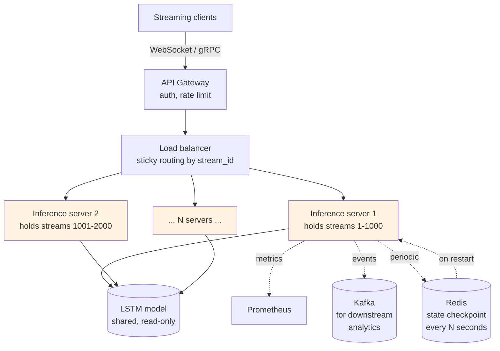

# Sequence Models — System Design

**Streaming inference, batching variable-length sequences, stateful serving, edge deployment. The infrastructure that turns a recurrent model into a service handling continuous streams.**

---

## What's Different About Serving Recurrent Models

Compared to feedforward / CNN serving:

| Feedforward / CNN | Recurrent |
|---|---|
| Stateless: one request → one prediction | **Stateful**: hidden state carries between requests in streaming use cases |
| Variable-shape inputs are trivial (just batch) | **Variable-length** sequences require padding, masking, or per-stream processing |
| Throughput-driven | Often **latency-driven** (real-time streaming) |
| Cache by input | Sometimes cache by **session** (carry hidden state) |
| Run-to-completion | **Continuous** — service runs as long as the stream lasts |

These differences shape every infrastructure decision.

---

## Two Modes — Batch and Streaming

**Batch inference**: the entire sequence is available up front. The server runs the LSTM forward through the whole sequence, produces all outputs, and returns. Standard request/response.

**Streaming inference**: data arrives one timestep at a time over a long-running connection. The server maintains hidden state per stream and updates it with each new timestep, producing incremental output.



**Most production sequence models do one or the other, rarely both.** A time-series forecaster that runs every hour is batch. A real-time captioning service is streaming.

---

## Batch Mode — Variable-Length Sequences

If your sequences have different lengths (most do — sentences vary in word count, time-series have different histories), you need to handle this in batching.

### Two Standard Approaches

**Padding.** Pad short sequences to match the longest in the batch. Use a mask to ignore padded positions in loss/attention.

```python
from torch.nn.utils.rnn import pad_sequence, pack_padded_sequence

# sequences = list of tensors with varying lengths
padded = pad_sequence(sequences, batch_first=True)    # (B, T_max, D)
lengths = torch.tensor([len(s) for s in sequences])
packed  = pack_padded_sequence(padded, lengths, batch_first=True, enforce_sorted=False)
output, hidden = lstm(packed)
output, _ = pad_packed_sequence(output, batch_first=True)
```

PyTorch's `pack_padded_sequence` handles padding correctly inside the LSTM — only real timesteps update the hidden state.

**Bucketing.** Group sequences by length so each batch has similar lengths. Less padding, less wasted compute, but more orchestration.

For most workloads, padding + masking is sufficient. Bucketing matters at scale.

---

## Streaming Mode — The Core Pattern

A streaming server keeps **hidden state per stream** in memory:

```python
# Pseudocode for a streaming inference server
streams: dict[stream_id, hidden_state]

def on_new_sample(stream_id, sample):
    hidden = streams.get(stream_id, initial_hidden())
    logits, hidden = model(sample, hidden)
    streams[stream_id] = hidden          # save for next call
    return logits
```

**Key properties:**

- **Constant memory per timestep** — no matter how long the stream, memory is bounded by hidden_dim × num_layers
- **Latency-bounded** — single forward step is fast (microseconds for small LSTMs, milliseconds for large)
- **No batching across timesteps** — but you can batch ACROSS streams

### Batching Across Streams

If you have N concurrent streams, you can batch them at each timestep:

```python
# Collect one sample from each active stream
samples = [streams[id].current_sample for id in active_streams]
hiddens = [streams[id].hidden          for id in active_streams]

# Stack and batch-forward
batched_samples = torch.stack(samples)        # (N, D)
batched_hiddens = stack_hiddens(hiddens)      # (num_layers, N, hidden_dim)

logits, new_hiddens = model(batched_samples.unsqueeze(1), batched_hiddens)

# Distribute results back to streams
for i, id in enumerate(active_streams):
    streams[id].hidden = unstack_hiddens(new_hiddens, i)
```

This is how Google's RNN-T speech recognition serves thousands of concurrent streams on shared GPUs.

---

## State Management Strategies

| Strategy | When to Use | Tradeoff |
|---|---|---|
| **In-memory state** | Single-process server, short streams | Simple. Lost on restart. |
| **Redis / external store** | Multi-process, multi-region, long streams | Network latency per timestep. State persists. |
| **Sticky routing** | Many short streams, in-memory state | Routing logic complexity. State stays where it was created. |
| **Stateless reset on every call** | Streams are actually batch-mode | Simplest. Loses long-range context. |

For voice assistants (short utterances), in-memory state with sticky routing is the norm. For long-running monitoring streams, Redis-backed state is more common.

---

## Latency Budgets

Sequence-model inference is sensitive to model size in a way that other model types are not:

| Hidden Dim, Layers | Latency per timestep (CPU) | Latency per timestep (GPU) |
|---|---:|---:|
| 64, 1 layer LSTM | < 1ms | < 0.5ms |
| 128, 2 layers | 1-5ms | < 1ms |
| 256, 2 layers | 5-15ms | 1-2ms |
| 512, 3 layers | 20-50ms | 2-5ms |

For real-time use cases (voice, trading, online detection), latency per step matters more than throughput.

**Optimizations:**

- **CPU inference for tiny LSTMs** — under 100K parameters, CPU is often faster than GPU due to data transfer overhead
- **ONNX export + INT8 quantization** — 2-4x speedup with minimal accuracy loss
- **Operator fusion** — TorchScript or ONNX can fuse the LSTM operations into a single optimized kernel
- **Batch across streams** — described above; major throughput win at slight latency cost

---

## Edge Deployment — Sequence Models on the Device

For voice-on-device, IoT sensors, hearing aids, mobile apps that process audio:

| Constraint | Implication |
|---|---|
| **Power budget** | < 100mW for sustained inference (often << 1mW for hearing aids) |
| **Memory** | < 1MB for weights and runtime combined |
| **Latency** | < 20ms for voice; < 1ms for trading; < 100ms for IoT |
| **Battery** | Every joule counts |

### Edge Runtimes

| Runtime | Platforms | Strengths for RNN/LSTM |
|---|---|---|
| **TensorFlow Lite** | Android, iOS, microcontrollers | Mature LSTM support |
| **ONNX Runtime Mobile** | Cross-platform | Smaller footprint than TFLite |
| **Core ML** | iOS / macOS | Optimized for Apple Neural Engine |
| **CMSIS-NN** | ARM microcontrollers | For ultra-low-power MCU deployment |

### Edge-Specific Tricks

- **Quantize to INT8 (or INT4)** — 4-8x smaller, 2-4x faster, ~1% accuracy hit
- **Pruning** — remove low-magnitude weights, sparse runtimes
- **Knowledge distillation** — train a small student LSTM to mimic a large teacher
- **Use GRU instead of LSTM** — fewer parameters at similar accuracy
- **Reduce hidden dim** — often 32-64 hidden units suffices for embedded tasks

A quantized GRU with 32 hidden units and 1 layer can run on a $5 microcontroller, processing audio at 10ms latency, on a coin-cell battery for months. This is what powers smart-home sensors and hearables.

---

## A Reference Architecture for a Streaming Service

Putting it together — what a real streaming LSTM service looks like:



**Key design points:**

- **Sticky routing** — each stream is bound to one server, keeping its hidden state in memory
- **Periodic state checkpointing to Redis** — survive server restarts without losing context
- **Shared read-only model** — all servers serve the same model
- **Kafka downstream** — predictions go to a stream consumer for monitoring, alerting, business logic
- **Metrics per stream + per server** — latency, throughput, hidden-state size, drift

---

## Cost Reality

Recurrent inference is often **cheaper than Transformer inference** for streaming workloads because:

- Smaller models (GRU/LSTM at 100K-1M params vs Transformer at 100M+)
- CPU is sufficient for many recurrent inference workloads
- No KV-cache memory pressure (the bottleneck for long-context Transformer serving)

Rough cost ranges (2026, cloud):

| Workload | Cost per 1M predictions |
|---|---:|
| LSTM on CPU (small) | $0.01-0.10 |
| LSTM on GPU T4 (medium) | $0.05-0.50 |
| LSTM on GPU A100 (large, batched) | $0.20-2.00 |
| Equivalent Transformer | $1.00-20.00 (often 10x more) |

For streaming, the recurrent advantage is real and persistent.

---

## What's Different About Sequence-Model System Design

Summarizing across this chapter:

| Sequence Model Specific | Why It Matters |
|---|---|
| **State per stream** | Keep hidden state in memory; route streams sticky |
| **Variable-length batching** | Padding + masking for batch mode; per-stream for streaming |
| **Constant per-step memory** | The big advantage over Transformers for long streams |
| **Latency-driven for streaming** | Optimize per-step latency, not throughput |
| **Continuous retraining** | Drift is the norm; pipelines must support it |
| **Edge-first design** | Many recurrent deployments are embedded — design for that from day one |

---

**Next:** [08 — Quality, Security, Governance](08_Quality_Security_Governance.md) — Distribution shift in time series, financial regulation, sensor reliability.
