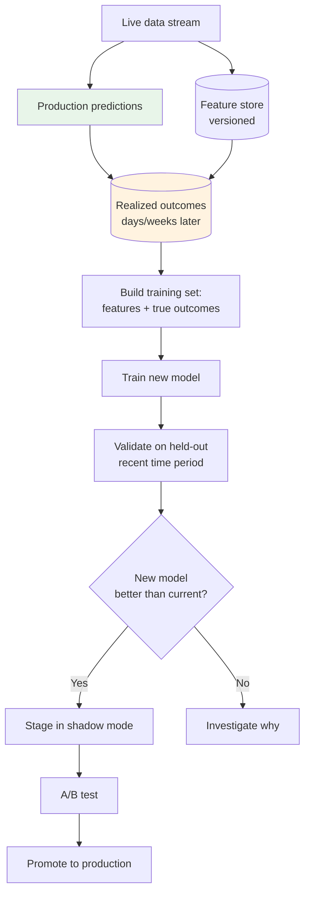

# Sequence Models — Quality, Security, Governance

**Distribution shift in time series, financial regulation, sensor reliability, adversarial sequences. The risks specific to sequence models — and what to do about them.**

---

## Why This Chapter Exists

Sequence models are deployed in some of the highest-stakes contexts in production AI: **financial trading** (where errors lose millions in seconds), **medical devices** (where errors harm patients), **autonomous systems** (where errors cause crashes), **infrastructure forecasting** (where errors take down services). The risks are real, and most are sequence-specific.

A classifier that fails affects one prediction. A streaming sequence model that fails affects every prediction until detected — minutes or hours of bad output before someone notices.

---

## Distribution Shift Is the #1 Risk

Time-series and streaming data are **non-stationary**. The distribution at training time is rarely the distribution at deployment time. Months later, the data has drifted, and the model's predictions degrade silently.

Documented cases:

| System | Drift Source |
|---|---|
| Demand forecasting at ride-share companies | COVID-19 pandemic shifted demand patterns globally; pre-pandemic models were unusable for months |
| Server load forecasting | Major product launch shifts traffic distribution overnight |
| Financial models | Fed policy changes, market regime shifts (2020 SPAC boom, 2022 rate hike cycle) |
| Speech recognition | Accent and vocabulary drift in user base over time |
| IoT anomaly detection | New equipment versions change the "normal" patterns |

### Three Types of Drift

| Type | What It Is | Detection |
|---|---|---|
| **Covariate shift** | Input distribution changes (e.g., new sensor model, new user demographic) | Compare input feature distributions over time |
| **Label shift** | Target distribution changes (e.g., demand baseline doubled) | Track output distribution over time |
| **Concept drift** | The relationship between input and target changes | Track residual / loss on rolling labeled samples |

### Detecting Drift in Production

Three monitoring patterns:

**1. Forecast residuals (for forecasting models).** When actual values arrive, compute the residual `actual − predicted`. Track:

- Mean residual (should stay near 0 — drift if it shifts away)
- Residual standard deviation (should stay similar to training-time)
- Residual distribution (KS test against training distribution)

A persistent positive bias (model underpredicts consistently for weeks) means concept drift.

**2. Output distribution monitoring.** Track the distribution of model predictions over time. A classifier that previously predicted class A 30% of the time and now predicts it 50% of the time is either right (class shift in the world) or wrong (drift).

**3. Hidden state monitoring.** For LSTMs, the hidden state distribution at the end of typical sequences should be stable over time. Significant shifts in mean / variance across hidden dimensions can signal upstream feature drift.

---

## Continuous Retraining — The Only Sustainable Defense

For production sequence models, **assume you will retrain every few weeks**. Bake this into the system from day one.

| Cadence | When |
|---|---|
| **Daily** | Highly volatile domains (financial, ad bidding, real-time recommendations) |
| **Weekly** | Most production time-series (forecasting, capacity planning) |
| **Monthly** | Stable domains (industrial sensors, slow-moving demand) |
| **Quarterly** | Regulated domains where retraining requires re-validation |

A retraining pipeline includes:



The biggest mistake teams make: **train once, deploy, forget**. The model degrades silently. Six months in, the system is producing bad predictions and no one has the infrastructure to catch it.

---

## Train/Test Splitting — Time-Aware

The cardinal sin of time-series ML: **random shuffle for train/test split**.

If you randomly shuffle, a sample from December ends up in your training set and a sample from January in your test set. The model sees future data during training. Test accuracy is artificially high. Production performance is much worse.

**Always split by time:**

```python
# Time series of length N
train_end   = int(N * 0.7)      # 70% for training (earliest 70%)
val_end     = int(N * 0.85)     # next 15% for validation
# Last 15% for test

train = data[:train_end]
val   = data[train_end:val_end]
test  = data[val_end:]
```

For multi-step forecasting validation, use **walk-forward validation**: train on the first N timesteps, predict the next K, advance the window, repeat. This simulates how the model will be used in production.

---

## Adversarial Inputs

Sequence models can be attacked too:

| Attack | Where It Matters |
|---|---|
| **Adversarial speech** (specially crafted audio) | Trick voice authentication; bypass voice command security |
| **Time-series spoofing** | Insert fake patterns to trigger trading model action; falsify sensor readings to mask anomalies |
| **Sequential prompt injection** | For LLM agents (Transformer-based) — out of scope for this playbook, see [Agents](../agents/) |

Defenses:

- **Anomaly detection on inputs themselves** — if an input sequence is statistically improbable, flag it
- **Adversarial training** — train on slightly perturbed sequences
- **Confidence thresholding** — reject predictions when input is unusual
- **Defense in depth** — multiple models with diverse architectures, vote

For high-stakes systems (financial trading, biometric authentication), assume adversarial inputs and design accordingly.

---

## Regulatory Considerations

### Financial Services

Models used in trading, lending, or fraud detection face heavy regulation in most jurisdictions:

| Requirement | Implication |
|---|---|
| **Model risk management (SR 11-7 in US, similar elsewhere)** | Documented model lifecycle, validation, monitoring; auditable |
| **Backtesting requirements** | Out-of-sample performance must be documented and replicable |
| **Explainability** | Even though LSTMs are black boxes, regulators increasingly require explanations for material model decisions |
| **Discrimination prevention** | Models in lending must be tested for disparate impact across protected classes |

If you are building a trading or lending sequence model, engage compliance from week 1.

### Medical Devices

For sequence models in medical contexts (ECG analysis, continuous monitoring, etc.):

- FDA 510(k) clearance or De Novo classification required
- Continuous performance monitoring required after clearance
- Specific validation requirements for time-series in medical devices
- Strict change-control: any retraining triggers a new submission

### Autonomous Systems

For sequence models in autonomous vehicles, drones, robotics:

- ISO 26262 (automotive functional safety)
- Traceability requirements (every prediction → version of model + training data)
- Deterministic behavior required (especially difficult with floating-point recurrence)

---

## Privacy in Streaming Data

Streaming data often includes privacy-sensitive content:

- **Voice** — tied to identity, requires consent for processing/retention
- **Health metrics** (heart rate, glucose, sleep) — HIPAA, GDPR-sensitive
- **Location time-series** — highly identifiable
- **User behavior streams** — purchase history, app usage

### Best Practices

| Practice | How |
|---|---|
| **On-device inference when possible** | Streaming voice → on-device LSTM, raw audio never leaves |
| **Federated learning** | Train across distributed devices, never centralize raw data |
| **Differential privacy** | Add calibrated noise to training data or gradients |
| **Aggregation only** | If centralizing, aggregate to non-identifying features |
| **Strict retention** | Define and enforce retention windows; delete after |

The Apple Neural Engine running an on-device LSTM for voice activity detection is the gold standard: voice never leaves the device, the LSTM lives in the Secure Enclave equivalent, and there is no cloud roundtrip.

---

## Sensor Reliability

Streaming sequence models are often deployed downstream of physical sensors that fail:

| Failure Mode | Impact |
|---|---|
| **Sensor offline / connectivity loss** | Stream gaps; LSTM may extrapolate incorrectly |
| **Sensor drift / calibration** | Distribution shift in input features |
| **Sensor poisoning** (attacker physically tampers) | Adversarial inputs |
| **Multiple sensors out-of-sync** | Stream alignment issues |

### Defenses

- **Heartbeat monitoring** on the stream — alert if data stops arriving
- **Input sanity checks** — reject obviously broken values (out of physical range)
- **Sensor cross-validation** — if multiple sensors should agree, flag disagreement
- **Graceful degradation** — fall back to simpler heuristic when LSTM input is unreliable

For industrial / IoT systems, sensor reliability often dominates model accuracy as a quality concern.

---

## A Pre-Deployment Checklist for Sequence-Model Systems

Before launching a recurrent production system:

| ✓ | Item |
|---|---|
| ☐ | Train/test split is **time-based**, not random shuffle |
| ☐ | Walk-forward validation used for forecasting models |
| ☐ | Drift detection instrumented (residual monitoring, output distribution) |
| ☐ | Continuous retraining pipeline functional (not just planned) |
| ☐ | Asymmetric loss applied if over- vs under-prediction have different costs |
| ☐ | Gradient clipping enabled |
| ☐ | Model card written: training data window, input features, refresh cadence, known limitations |
| ☐ | Sensor / input reliability monitoring (where applicable) |
| ☐ | Privacy review: data retention, on-device vs cloud, consent |
| ☐ | Regulatory review (financial, medical, automotive as applicable) |
| ☐ | Failure-capture pipeline (failed predictions feed retraining) |
| ☐ | Rollback plan: how to revert to a previous model in < 1 hour |
| ☐ | Stream state recovery: what happens when a streaming server restarts |
| ☐ | On-call team identified and trained |

If you cannot check most items, you are not ready. **Streaming production failures compound** — every minute of bad predictions affects every active stream.

---

**Next:** [09 — Observability & Troubleshooting](09_Observability_Troubleshooting.md) — Monitoring sequence-model quality. Drift over time. What to alert on.
