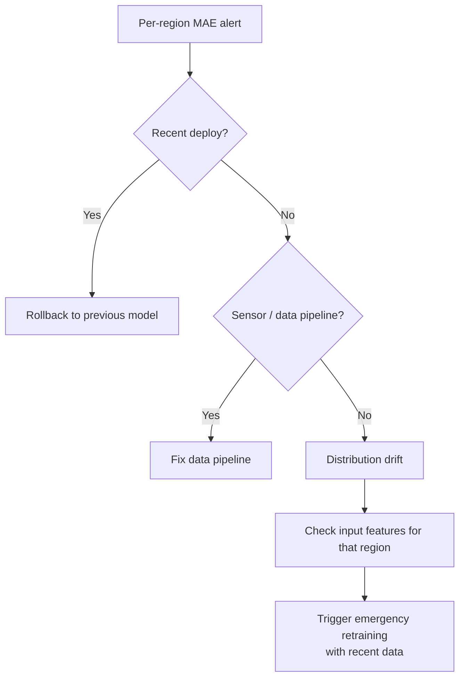

# Sequence Models — Observability & Troubleshooting

**Monitoring sequence-model quality in production. Drift detection, residual analysis, what to alert on, runbooks for common failures.**

---

## What Sequence-Model Observability Adds

The basics from [Computer Vision → Observability](../computer-vision/09_Observability_Troubleshooting.md) apply (per-class metrics, calibration, alert thresholds). Sequence models add:

| Sequence-Specific Concern | Why |
|---|---|
| **Forecast accuracy degrades with horizon** | 1-hour-ahead forecasts are easy; 24-hour ahead is much harder. Track per-horizon. |
| **Drift over deployment time** | The world changes; the model does not. Track temporal drift. |
| **Per-stream variance** | Different streams (cities, devices, users) have different baselines. Monitor by segment. |
| **Hidden state health** | The LSTM's internal state can become degenerate; monitor distribution. |
| **Stream gap handling** | What does the model do when a stream stops arriving? Track gaps. |

---

## What to Measure

| Metric | What It Tells You | Frequency |
|---|---|---|
| **Forecast residual (per horizon)** | Bias and variance of predictions | Continuous |
| **Mean absolute error (MAE), per segment** | Overall accuracy by stream/region/device | Continuous |
| **Prediction interval coverage** | Probabilistic forecasts: do 95% prediction intervals actually contain 95% of actuals? | Continuous |
| **Distribution shift (input features)** | Are inputs drifting from training? | Daily |
| **Output distribution shift** | Are predictions drifting? | Daily |
| **Hidden state distribution** | Are LSTM hidden states healthy? | Weekly spot-check |
| **Stream gap frequency** | How often does data stop arriving? | Continuous |
| **Latency p50/p95/p99 per timestep** | User-facing performance | Continuous |
| **Cost per stream-hour** | Resource utilization | Continuous |

---

## Forecast-Specific Metrics

For forecasting models, track residuals carefully:

```python
# When actuals arrive (could be hours/days after the forecast)
residual = actual - predicted
abs_error = abs(residual)
relative_error = abs_error / (abs(actual) + 1e-6)

# Track over time
metrics.residual.append({
    'forecast_time': forecast_time,
    'actual_time': actual_time,
    'horizon': horizon_hours,        # how far ahead was this forecast?
    'segment': city,                  # what stream?
    'predicted': predicted,
    'actual': actual,
    'residual': residual,
})
```

### Per-Horizon Decomposition

Forecast quality varies dramatically with horizon. Track separately:

| Horizon | Typical MAPE (Mean Absolute Percentage Error) for Demand Forecasting |
|---|---:|
| 1 hour | 5-10% |
| 6 hours | 8-15% |
| 24 hours | 15-25% |
| 7 days | 25-40% |

Tracking by horizon catches "overall MAPE looks fine" issues that hide degraded long-horizon performance. A model that has stopped capturing weekly seasonality might still get 1-hour-ahead right but fail at 7-day forecasts.

### Calibration of Probabilistic Forecasts

For models that output prediction intervals (e.g., "10th percentile = X, 90th percentile = Y"):

- **Coverage** — fraction of actuals that fall within the interval. A 95% interval should contain ~95% of actuals.
- **Sharpness** — width of the interval. Tighter is better, conditional on coverage.

If coverage is far from nominal (e.g., 95% interval contains only 70% of actuals), the model is under-estimating uncertainty. Time to retrain.

---

## Drift Detection Patterns

Three complementary tools:

### 1. Residual Tracking (the gold standard)

When real outcomes arrive, compare to predictions. Track:

- Mean residual over a rolling window (should be ~0)
- Standard deviation of residuals (should be similar to training)
- Distribution of residuals (KS test against training distribution)

**A persistent positive bias** (model underpredicts on average for weeks) is concept drift. Retrain.

### 2. Input Feature Distribution Monitoring

Track each input feature's distribution over time:

```python
for feature_name in feature_names:
    current_dist = compute_histogram(recent_inputs[feature_name])
    training_dist = histograms[feature_name]
    drift_score = ks_test(current_dist, training_dist).pvalue

    if drift_score < 0.001:
        alert(f"{feature_name} distribution has shifted significantly")
```

Catches sensor drift, demographic shift, new product variants.

### 3. Output Distribution Monitoring

Track distribution of predictions over time. A classifier that previously predicted class A 30% of the time and now predicts it 50% is either right (real shift) or wrong (drift). Either way, investigate.

For forecasting: track distribution of point forecasts; track distribution of forecast intervals.

---

## Hidden State Health

A subtle, sequence-specific monitoring pattern: track the **distribution of LSTM hidden states** in production:

```python
# Periodically sample hidden states from the running model
sampled_states = []
for stream_id in random.sample(active_streams, 100):
    sampled_states.append(streams[stream_id].hidden)

# Check distribution
mean_per_dim = sampled_states.mean(axis=0)
std_per_dim  = sampled_states.std(axis=0)
saturation_per_dim = (abs(sampled_states) > 0.95).mean(axis=0)
```

Red flags:
- **Many dimensions saturated at ±1** — tanh saturation, gradient flow problem
- **Many dimensions stuck at 0** — dead units, capacity wasted
- **Distribution far from training** — drift in inputs causing different state regions to be visited

These won't crash the model, but they precede performance degradation.

---

## What to Alert On

### Page-Worthy (P1)

| Signal | Threshold |
|---|---|
| Forecast MAE spike | > 2x baseline for any segment, sustained > 1 hour |
| Stream gap | Any stream with no data for > 5 minutes |
| Latency p99 | > 2x baseline |
| Service errors | > 1% requests failing |
| Per-segment accuracy collapse | > 10% absolute drop in any segment |

### Investigate-Soon (P2)

| Signal | Threshold |
|---|---|
| Drift detected (input distribution) | KS test p-value < 0.001 sustained for hours |
| Calibration drift | 95% interval coverage drops below 90% |
| Residual bias | Mean residual moves more than 1 standard deviation from zero |
| Hidden state saturation | > 30% of dimensions saturated |

### Track-Trend (no page)

- Cost per stream-hour
- Model size trends
- Retraining cycle duration

---

## Runbooks for Common Production Failures

### Failure 1: Sudden Forecast Quality Collapse

**Symptom.** MAE spiked 5x for one region. Customer complaints. Other regions OK.

**Triage flow:**



Common causes (rough order):
1. Recent deploy regression — rollback first
2. Data pipeline issue (a feature suddenly all NaN, or stuck at default)
3. Real distribution shift (new product launch, weather event)
4. Sensor failure for that region

### Failure 2: NaN Predictions

**Symptom.** Production stream returns NaN for a few outputs, then recovers.

**Likely causes:**

| Cause | Check |
|---|---|
| NaN in input | Did input pipeline produce a NaN value? |
| Exploding gradient at training time | Was the deployed model trained without gradient clipping? |
| Numerical instability (rare but possible) | Is the input far outside training distribution? |

**Mitigation:** Add input sanity checks. If input contains NaN, replace with imputed value or skip the timestep, do not pass to model.

### Failure 3: Stream State Loss

**Symptom.** Server restart caused loss of hidden state for thousands of active streams. Predictions are bad for ~10 minutes after restart.

**Mitigation:**
- Periodic state checkpointing (every 30 seconds, to Redis)
- On startup, restore state from checkpoint
- If checkpoint not available, mark first N predictions as "low confidence" while state warms up

### Failure 4: Drift Detected, No Recent Retrain

**Symptom.** Drift detector firing for several days. Forecast quality slowly degrading.

**Action plan:**
1. **Identify what is drifting.** Inputs? Outputs? Residuals?
2. **Pull training data** for the appropriate window (typically last 60-90 days)
3. **Retrain** with the same architecture and recipe
4. **Validate on a held-out recent window**
5. **Shadow-deploy** alongside the current model
6. **A/B test** if metrics allow
7. **Promote** when new model is consistently better

The full retraining cycle should be < 1 week. Faster if the drift is severe.

---

## A Production Dashboard for Sequence Models

```
┌─────────────────────────────────────────────────────┐
│  STREAMING LSTM SERVICE                              │
│  Active streams: 18,432    p99 latency: 4.2ms        │
├─────────────────────────────────────────────────────┤
│  FORECAST QUALITY (last 7 days)                      │
│  Overall MAE: 0.073                                  │
│  By horizon:                                         │
│    1h:   0.045   ▆▆▆▆▆▆▆  (stable)                   │
│    6h:   0.071   ▆▆▆▆▆▆▆                             │
│    24h:  0.122   ▆▆▆▇▇▆▆  (slight increase ⚠)        │
│    7d:   0.234   ▆▇▇▇▆▇▇                             │
│  Per region:                                         │
│    NYC:    0.052  ▆▆▆▆▆▆▆                            │
│    SF:     0.068  ▆▆▆▆▆▆▆                            │
│    Tokyo:  0.094  ▆▆▆▇█▇▇  (DEGRADING ⚠)             │
├─────────────────────────────────────────────────────┤
│  DRIFT                                               │
│  Input features: 1 / 42 features showing drift       │
│  (event_count_24h: KS p=0.0008)                      │
│  Output dist: stable                                 │
│  Hidden state: 3% saturated (healthy)                │
├─────────────────────────────────────────────────────┤
│  INFRASTRUCTURE                                      │
│  Servers: 12   GPU memory: 67%   Cost: $9.20/hour   │
└─────────────────────────────────────────────────────┘
```

Build with Grafana + Prometheus + custom panels. The MAE-by-horizon and MAE-by-region matrices catch the segment-level failures that overall metrics miss.

---

## The 5-Minute Health Check

Every morning, every team running production sequence models should be able to answer:

1. **Is overall MAE stable?**
2. **Is any segment degrading?**
3. **Are any features drifting?**
4. **Are streams losing connection?**
5. **When was the last successful retraining cycle?**

If you cannot answer these in 5 minutes, your dashboards are wrong. Fix the dashboards first, then everything else.

---

**Next:** [10 — Decision Guide](10_Decision_Guide.md) — RNN vs LSTM vs GRU vs Transformer decision tree. Production readiness checklist.
