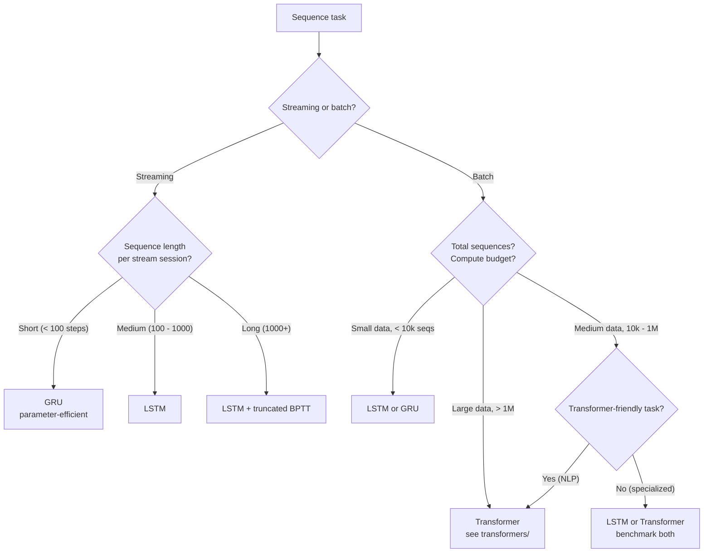

# Sequence Models — Decision Guide

**"Should I use a recurrent model?" RNN vs LSTM vs GRU vs Transformer. Production readiness checklist.**

---

## The Core Decision: Should You Use a Recurrent Model At All?

| Your Situation | Recommendation |
|---|---|
| Task involves a single fixed-size input (one image, one text snippet) | **Don't.** Use feedforward / CNN / Transformer encoder. |
| Task involves a sequence with order-sensitive meaning | **Yes** — sequence model required |
| NLP, batch processing, > 100k examples | **Use Transformer.** See [transformers/](../transformers/) |
| Streaming inference required (continuous, low memory) | **Use LSTM or GRU.** Their home turf. |
| Time-series forecasting, < 10k examples | **Use LSTM or GRU.** Often beats Transformer at this scale. |
| Edge / embedded with parameter constraints | **Use GRU** (or quantized LSTM) |
| Real-time agent / online RL | **Use LSTM/GRU.** State-keeping is natural. |
| Anomaly detection on streams | **Use LSTM** (forecast-and-compare) |

---

## Architecture Decision Tree

---

## Family Comparison — Side by Side

| Aspect | Vanilla RNN | LSTM | GRU | Transformer |
|---|---|---|---|---|
| **Year** | 1986 | 1997 | 2014 | 2017 |
| **Long-range memory** | Poor (~10 steps) | Good (100s of steps) | Good (similar to LSTM) | Excellent (parallel attention) |
| **Training stability** | Poor (vanishing gradients) | Good (with gates) | Good | Very good |
| **Streaming inference** | ✓ | ✓ | ✓ | ✗ (state grows with sequence) |
| **Parallel training** | ✗ (sequential) | ✗ (sequential) | ✗ (sequential) | ✓ (parallel across time) |
| **Parameters per layer** | H·D + H² + H | 4H·(H+D) + 4H | 3H·(H+D) + 3H | 12·d_model² |
| **Production maturity (2026)** | Rare | Mature | Mature | Mature, dominant for NLP |
| **Best use cases** | Educational | Forecasting, streaming, edge | Mobile, embedded | NLP, large-data sequences |

---

## When NOT to Use Each Architecture

| Architecture | Don't Use When |
|---|---|
| **Vanilla RNN** | Production. Use LSTM or GRU instead. |
| **LSTM** | NLP with abundant data → Transformer wins on accuracy and parallelism |
| **LSTM** | Truly long sequences (10K+) without truncated BPTT → Transformer or specialized SSM |
| **GRU** | When you need the marginal accuracy of LSTM and have parameter budget |
| **Transformer** | Streaming with constant-memory requirement |
| **Transformer** | Tiny edge devices (< 1MB model) |
| **Transformer** | < 1000 training examples → recurrent models often win |

---

## Build vs Buy

For most production sequence-model needs:

| Volume / Use Case | Recommendation |
|---|---|
| **Sentiment analysis, text classification** | **Use API** (OpenAI, Anthropic, Cohere) — cheaper than training your own |
| **Speech-to-text** | **Use API** (Whisper, Deepgram, Google Speech) for batch; build custom only for specialized streaming |
| **Time-series forecasting** | **Build.** No good API for domain-specific time-series. Use Prophet, Nixtla's libraries, or custom LSTM/GRU. |
| **Anomaly detection on sensor streams** | **Build.** Domain-specific patterns; APIs do not exist for most use cases. |
| **Custom voice assistant** | **Hybrid.** Use Whisper or Deepgram for STT; build custom downstream logic. |

The 2026 landscape: sequence-model APIs handle the broad cases (general NLP, transcription); custom builds handle the long tail (your specific time-series, your specific sensors, your specific domain).

---

## Production Readiness Checklist

Before launching a recurrent production system:

### Data
| ✓ | Item |
|---|---|
| ☐ | Train/val/test split is **time-based**, not random shuffle |
| ☐ | Walk-forward validation for forecasting models |
| ☐ | Engineering features done (lag, calendar, exogenous) |
| ☐ | Feature store / data pipeline versioned |

### Model
| ✓ | Item |
|---|---|
| ☐ | Architecture choice justified (LSTM / GRU / Transformer) |
| ☐ | Model card written (input features, training window, refresh cadence, known limitations) |
| ☐ | Per-segment metrics evaluated, not just overall |
| ☐ | Calibration verified (for probabilistic forecasts) |
| ☐ | Sequence length appropriate for the architecture |

### Training
| ✓ | Item |
|---|---|
| ☐ | Gradient clipping enabled (`max_norm=5.0`) |
| ☐ | Forget-gate bias initialization trick applied (LSTM) |
| ☐ | Hyperparameters documented and reproducible |
| ☐ | Asymmetric loss applied if costs differ |

### Inference
| ✓ | Item |
|---|---|
| ☐ | Latency p50/p95/p99 measured |
| ☐ | Throughput measured at expected concurrent stream count |
| ☐ | Hidden state management strategy (in-memory, Redis, sticky routing) |
| ☐ | Stream gap handling defined |
| ☐ | Failover plan for stateful servers |

### Operations
| ✓ | Item |
|---|---|
| ☐ | Monitoring dashboard live (per-segment, per-horizon, drift) |
| ☐ | Alerts on quality drops, drift, latency spikes |
| ☐ | Continuous retraining pipeline functional |
| ☐ | Rollback plan tested |
| ☐ | On-call team trained |

### Governance
| ✓ | Item |
|---|---|
| ☐ | Regulatory review (financial, medical, automotive as applicable) |
| ☐ | Privacy review (data retention, on-device vs cloud) |
| ☐ | Audit log: predictions tied to model version + input features |
| ☐ | Bias / fairness evaluation for high-stakes decisions |

If you cannot check most items, you are not ready. Recurrent production failures compound — every stream gets bad predictions until detected.

---

## Cost Estimation Framework

For a typical sequence-model project (e.g., per-city demand forecasting):

### Initial Build (One-Time)

| Item | Typical Hours |
|---|---|
| Feature engineering + data pipeline | 80-160 |
| Model architecture design + tuning | 40-80 |
| Training infrastructure setup | 40-80 |
| Validation framework (walk-forward) | 40 |
| Serving infrastructure (streaming or batch) | 80-160 |
| Monitoring and drift detection | 40-80 |

### Ongoing (Per Year)

| Item | Typical Cost |
|---|---|
| Inference compute | Volume × $0.01-0.50 per million predictions |
| Continuous retraining | Weekly retrains at $5-50 per cycle |
| Engineering on-call | 0.1-0.3 FTE |
| Monitoring infra | $200-1000/month |

For a typical mid-scale forecasting deployment (10s of millions of predictions/month), Year 2 ongoing costs run $30K-$100K per year — much of which is on-call engineering, not compute.

---

## When to Stop and Reconsider

Some signals to pause:

| Signal | What to Do |
|---|---|
| MAE / accuracy will not improve below threshold despite tuning | Architecture or features wrong. Try different features. Try Transformer. |
| Drift is constant; retraining cannot keep up | The world is too non-stationary. Reconsider the problem framing. |
| Stream state management is consuming all engineering | Use a managed streaming service (Kafka, Kinesis) instead of homegrown |
| Latency target unmet | Smaller model, quantization, CPU vs GPU, edge deployment |
| Regulatory team escalating concerns | **Stop and engage them.** Do not deploy until cleared. |
| Per-segment analysis shows segment-level catastrophes hidden by overall metrics | Either build per-segment models or rebuild architecture |

---

## What's Next

This playbook covers RNN, LSTM, GRU and gives you the foundations. The deeper material:

| Doc | When to Read |
|---|---|
| [`architectures/rnn-lstm.md`](architectures/rnn-lstm.md) | Single-doc reference covering BPTT, vanishing gradients, LSTM gates, code patterns, math |

And the sibling playbooks:

- [Deep Learning](../deep-learning/) — neural network foundations
- [Transformers](../transformers/) — the architecture that replaced RNN/LSTM for most NLP
- [NLP](../nlp/) (coming) — text-task playbook

---

**Where you started:** [01 — Why](01_Why.md). Read backwards from here to revisit any concept.

**Hands-on companion:** [Sequence Models From Scratch on Colab](https://colab.research.google.com/github/sunilmogadati/systems-in-production/blob/main/implementation/notebooks/Sequence_Models_From_Scratch.ipynb) — vanilla RNN forward + full BPTT by hand, verified against PyTorch autograd.
