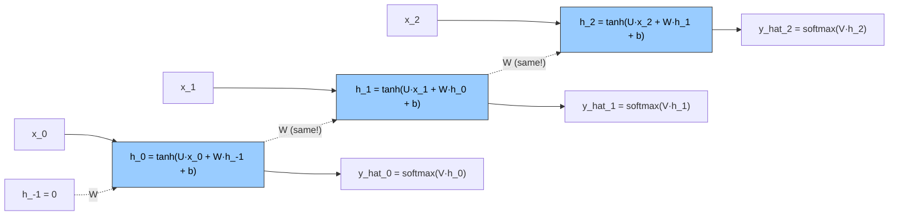
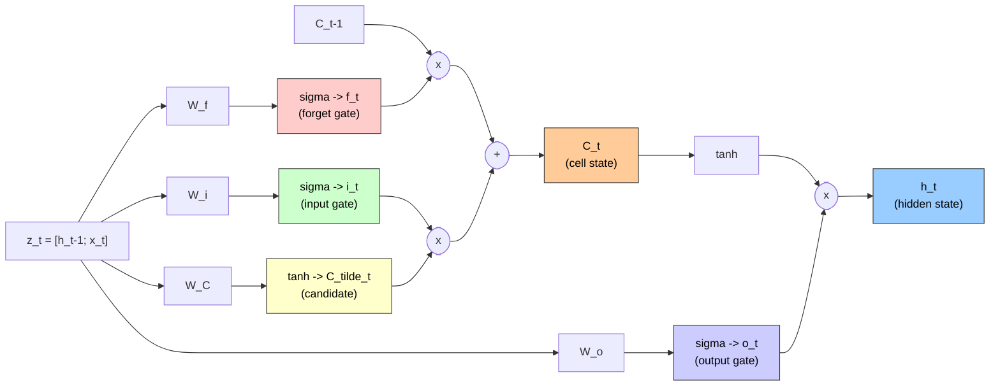

# Recurrent Neural Networks

This reference covers Recurrent Neural Networks (RNNs), Backpropagation Through Time (BPTT), and Long Short-Term Memory (LSTM) networks. Section 1 is the conceptual narrative. Section 2 is reference code. Section 3 is the math. Section 4 is a question-and-answer companion.

---

# Section 1 — Concepts and Architecture

## 1.1 Why recurrence is needed

The starting point is the **feedforward neural network** (an arrangement in which information flows once from the input layer, through one or more hidden layers, to the output layer, with no cycles and no memory of previous inputs). Each input is processed independently. If the same network is asked to classify a thousand images of handwritten digits, every image is a fresh story — there is no notion of "what came before."

That assumption breaks the moment the data is a sequence. Consider the sentence *"The cat sat on the mat."* If each word were fed into a feedforward network independently, the network would have no way to know that *"sat"* came after *"cat"*; it would treat *"The cat sat on the mat"* and *"mat the on sat cat The"* identically. The order, which carries almost all the meaning, would be lost. The same problem appears whenever the data is intrinsically ordered — words in a sentence, daily stock prices in a time series, and many other kinds of streams. In every case there is a temporal axis, and a feedforward network is blind to it.

What is missing is **memory** — a way for the network to keep a running summary of everything it has read so far and let that summary influence how it interprets the next input. The architecture that supplies this memory is the recurrent neural network.

## 1.2 The recurrent idea

A **recurrent neural network** (an RNN — a network whose hidden layer feeds its own previous output back into itself, alongside the next input) earns its name from one small but consequential change. Instead of processing the entire input as a single vector, the RNN reads the sequence one piece at a time, and at every position it carries forward a small running summary called the **hidden state** (a fixed-size vector that summarizes everything the network has seen so far). The hidden state is the network's memory.

A walk through one **time step** (one position in the input sequence — for a sentence with one word per step, position zero is the first word, position one is the second, and so on) makes the picture concrete. At each step, the network has two things in hand: the new input arriving at that step, and the hidden state produced at the previous step. It mixes these two by applying one weight matrix (a learnable grid of numbers used to linearly transform an input vector) to the input, another to the previous hidden state, adding a bias (a learnable offset added after the matrix multiply), and squashing the result through a tanh nonlinearity (a smooth S-shaped function that maps any real number into the range -1 to 1). The output of that mixing is the new hidden state. From that new hidden state the network may also produce an external prediction (for example, a probability distribution over the next character or class). Then it moves on to the next time step, and the new hidden state becomes the next step's "previous hidden state." A useful intuition is that the hidden state is the network's *thinking* and the output is its *speaking*; the thinking persists across steps, the speaking happens at each step.

The first step has no previous hidden state to consult, so the convention is to initialize it to zero. From there the recurrence does the rest of the work, propagating information forward through time.

## 1.3 Weight sharing across time

This is the deep idea, and it is the reason the architecture works at all. The same weight matrices are reused at every time step. The matrix that maps input to hidden, the matrix that maps the previous hidden state to the new one, the matrix that reads out the prediction — all three are identical at step zero, step one, step seventeen, and step five hundred. This is **weight sharing across time**, and it is the temporal analogue of the spatial weight sharing that makes a convolutional neural network efficient (the same kernel — a small grid of weights slid across the input to detect a local pattern — is applied at every spatial position of an image).

Two consequences fall out immediately. First, the parameter count of the network is independent of sequence length: a recurrent network can be trained on sentences of any length without growing the model. Second, the network learns a single rule for processing input that applies uniformly across positions, which encodes a useful inductive bias — the rule for reading a noun should not depend on whether the noun appears in position three or position thirty.

## 1.4 Training a recurrent network — BPTT

Training a recurrent network means computing gradients of the loss (the error number that measures how far the prediction is from the truth) with respect to the parameters (the learnable weights and biases) and using those gradients to update the weights. The technique is called **Backpropagation Through Time** (BPTT — backpropagation, the standard reverse-mode algorithm for computing gradients in a neural network, applied to the recurrent network's *unrolled* graph, in which the network is conceptually expanded into a deep feedforward network whose depth equals the sequence length). The picture is exactly what it sounds like: take the recurrent network, draw it out as a long chain in which each time step is its own copy of the layer, then run regular backpropagation on that long chain. The forward pass walks the chain left to right; the backward pass walks the chain right to left, applying the chain rule (the calculus rule for differentiating a composition of functions, multiplying derivatives stage by stage) at every step. The phrase "back through time" does not mean the model predicts the past; it means gradients flow backward through the unrolled time axis during training.

There is a price to be paid. The unrolled network is as deep as the sequence is long. For a hundred-token sentence the backward pass traverses a hundred layers; for a thousand-token document it traverses a thousand. Memory grows linearly with sequence length because every hidden state along the way must be retained for the backward pass to use. A practical compromise is **truncated BPTT** (running the backward pass over only the last few time steps — typically four or five — rather than the entire sequence). Truncation caps memory and compute and stabilizes training, at the cost of cutting off long-range gradient flow. The hidden state itself can still carry information forward across the truncation boundary; only the gradient is cut. Truncated BPTT is the practical training compromise; the architectural fix for long-range memory is the LSTM, introduced shortly.

A second consequence of weight sharing is that the gradient with respect to the recurrent weight matrix is a *sum* over all time steps, not a single value. Because the same matrix is used at every step, the chain rule produces one contribution per step, and those contributions are added together to form the total gradient. This is the reason BPTT code accumulates with `+=` rather than overwriting with `=`.

## 1.5 Why RNN training is hard

Building on Section 1.4: because the same recurrent matrix appears at every backward step, the gradient signal from a faraway time step is multiplied by that one matrix's transpose once per step on its way back. Each multiplication is also accompanied by a tanh-derivative factor (a number bounded by one and typically much smaller). A hundred-step sequence therefore stacks roughly a hundred such factors in a row — a geometric setup that a feedforward network with independent per-layer matrices does not have.

Two failure modes follow from this repeated multiplication. The **vanishing gradient problem** appears when the per-step factor's magnitude is below one: the gradient shrinks exponentially with depth and the learning signal from a faraway time step disappears entirely. After twenty multiplications by one half, the gradient is roughly one in a million — effectively zero, and the network cannot learn to associate events more than a handful of steps apart. The **exploding gradient problem** is the mirror image: when the per-step factor's magnitude is above one, the gradient grows without bound and a single bad update can produce NaN values (Not-a-Number — a floating-point error code that appears once a computation overflows or divides by zero) that destroy weeks of training.

The exploding side has a simple partial fix called **gradient clipping** (rescaling the gradient when its norm — the overall magnitude or length of a vector — exceeds a chosen threshold so that no single update becomes too large). Clipping is applied to every gradient before the parameter update; a typical threshold is plus or minus five. It prevents one bad batch from blowing up the model. The vanishing side, however, cannot be fixed by clipping — a vanished gradient cannot be made to reappear by rescaling. The fix for vanishing gradients requires a new architecture, and that architecture is the LSTM.

## 1.6 The LSTM solution

**Long Short-Term Memory** (LSTM — a recurrent architecture introduced by Hochreiter and Schmidhuber in 1997 that adds a separate memory channel and a set of gates to the basic recurrent layer) keeps the recurrent skeleton of the RNN but replaces the simple "tanh of a linear mix" hidden update with something more elaborate. The big idea is to introduce a second state vector called the **cell state** (a long-term memory channel that flows through time mostly untouched, distinct from the hidden state that the layer exposes to the next layer). Where the vanilla RNN tries to use one vector for both jobs — long-term memory and immediate output — the LSTM separates the two. The cell state is the memory highway; the hidden state is the gated output.

The flow along the cell state is mostly additive rather than multiplicative, and that is the change that solves the vanishing gradient problem. Instead of squashing the previous memory through a nonlinearity at every step, the LSTM lets the previous cell state pass forward almost unchanged, with only an element-wise multiplication by a learned filter (the forget gate) and an addition of newly proposed content (the candidate, scaled by the input gate). The gradient that flows backward along this path is multiplied only by the forget gate, not by a tanh derivative, so when the forget gate is near one the gradient passes through cleanly.

The mechanism of control along this highway is the **gate** (a sigmoid-activated vector whose values lie between zero and one and that scales another signal element-wise — values close to one let information through, values close to zero block it). A gate is exactly an interpretable filter; its job is to ask "what fraction of this signal should we keep?" and the answer is a per-element percentage. The LSTM uses three such gates and one auxiliary candidate vector.

## 1.7 The four parts of an LSTM, in prose

A full walkthrough of one LSTM time step, without equations, makes the architecture concrete. The previous hidden state and the current input are concatenated into a single vector — call it the joint context — and that joint context feeds into four separate parallel computations: the forget gate, the input gate, the output gate, and the candidate.

The **forget gate** (a sigmoid-activated filter that decides what fraction of the previous cell state to keep) is computed first conceptually: it asks, for each component of the previous cell state, "should we hold on to this, or has it become stale?" An output near one means *keep*; an output near zero means *discard*. The forget gate is what gives the network a way to clear obsolete memory — a critical capability, because without it the cell state would grow without bound as new content is added.

The **input gate** (a sigmoid-activated filter that decides what fraction of the new candidate to write into the cell state) plays the complementary role. It asks "of the new content being proposed, how much actually matters?" An input gate near zero means *don't bother writing anything new*; near one means *commit fully*. Together with the candidate, the input gate gives the network a controlled write channel into memory.

The **candidate** (a tanh-activated vector that proposes new content to add to the cell state, with values in the symmetric range from negative one to positive one) is the *content* that might be written. The forget gate and input gate decide how much of what; the candidate decides what specifically. Tanh is used for the candidate so that the proposed content can be either positive or negative, with bounded magnitude.

The **cell state update** combines all three. The new cell state equals the previous cell state scaled element-wise by the forget gate (what fraction of the old to keep), plus the candidate scaled element-wise by the input gate (what fraction of the new to commit). Crucially, this is an *additive* update: there is no nonlinearity squashing the recurrent path between the previous cell state and the new one. That additivity is what gives gradients an unobstructed road back through time.

The **output gate** (a sigmoid-activated filter that decides what part of the cell state to expose as the new hidden state) controls what the layer reveals to the outside world at this step. Memory and exposure are intentionally separated: the cell state may hold detailed long-term context, but only a filtered, bounded view of it leaves the cell as the hidden state. The new hidden state is the output gate applied element-wise to a tanh of the new cell state — the tanh keeping the magnitude bounded, the output gate selecting which components are externally visible.

## 1.8 Why LSTM solves vanishing gradients

A short conceptual comparison clarifies why the architecture works. In a vanilla RNN, the gradient that flows from the new hidden state back to the previous hidden state passes through the recurrent weight matrix and through the tanh derivative; both are typically below one in magnitude, and the gradient is multiplied by this small factor at every step. After many steps the gradient has been multiplied by a small number many times, and it vanishes.

In an LSTM, the gradient that flows from the new cell state back to the previous cell state passes through only the forget gate — an element-wise multiplication by a vector of values between zero and one. When the network has learned to keep the forget gate near one (which is what the forget-gate-bias-of-one initialization encourages), this multiplication is approximately the identity, and the gradient passes backward unchanged. The cell state thus acts as a *gradient highway*: the additive update gives the gradient a path through time that is not squashed at every step. This is the formal reason LSTM mitigates vanishing gradients while a vanilla RNN does not. Truncation, capacity, and sequence length still impose practical limits, so LSTM helps but does not eliminate every long-range issue.

## 1.9 Activations: sigmoid for gates, tanh for candidates

The choice of activation function (the nonlinear squashing applied after a linear weight-and-bias transform) for each part of the LSTM is not arbitrary. Gates are *fractions* — they need to live between zero and one so they can be interpreted as "keep this much." The sigmoid function (which maps any real number to a value between zero and one) is the natural choice. Sigmoid for gates means the network can express a smooth continuum from "completely forget" to "completely keep" and learn the right point on that continuum from data.

The candidate and the output filter on the cell state, by contrast, are *values* — they can be positive or negative, and they need a bounded magnitude to keep the cell state from growing without limit. The tanh function (which maps any real number to a value between negative one and positive one) supplies exactly that: a symmetric, bounded range that allows new content to push the cell state in either direction without exploding. This is also the reason the vanilla RNN uses tanh for the hidden state rather than ReLU (Rectified Linear Unit — an activation that outputs the input if positive and zero otherwise, with no upper bound); ReLU is unbounded and can let a hidden state grow without limit through repeated multiplications by the recurrent matrix, whereas tanh keeps the hidden state in a controlled range.

## 1.10 Training, optimizer, regularization

The optimizer (the algorithm that uses gradients to update parameters) most commonly paired with LSTMs in modern practice is **Adam** (an adaptive learning-rate optimizer — where "learning rate" is the scalar that controls how big each update step is — that maintains exponential moving averages of both the gradient and the squared gradient, and uses those averages to give each parameter its own effective step size). Adam adapts per-parameter step sizes the way AdaGrad does but does not suffer from AdaGrad's monotonic shrinkage of the effective learning rate, because its averages can decrease as well as increase.

A simpler alternative often used in pedagogical implementations is **AdaGrad** (an adaptive optimizer that scales the step size for each parameter by the square root of an accumulated sum of past squared gradients). AdaGrad gives each parameter its own effective learning rate by dividing by a per-parameter accumulated-squared-gradient term; parameters that have received large gradients in the past take smaller steps going forward. This is useful for sparse data — for instance, embedding rows (rows of a learned lookup table that turn each token into a dense vector) for rare words that are updated infrequently keep a relatively larger effective learning rate. The downside is that the accumulator only grows, so the effective learning rate eventually shrinks toward zero and progress can stall in long training runs. Adam is the modern default; AdaGrad is the simpler teaching choice.

Regularization (techniques that discourage overfitting, such as adding noise or shrinking weights) through dropout (randomly zeroing a fraction of unit activations during training so the network does not over-rely on any single one) requires care in a recurrent network. The standard rule is to apply dropout only on **non-recurrent connections** — input-to-hidden and hidden-to-output — and never on the time-direction recurrent connection itself. Dropping units along the recurrent path destroys the temporal signal the LSTM is trying to preserve: the cell state and hidden state are supposed to flow from one step to the next, and randomly zeroing components of that flow severs the memory the architecture exists to maintain. (Variational or recurrent dropout uses a fixed dropout mask across time steps and is a more careful alternative for the recurrent direction, but naive dropout is forbidden there.)

A small detail worth knowing is that the LSTM's forget-gate bias is typically initialized to one rather than zero. A bias of zero means a sigmoid of zero, which is one half — meaning the forget gate sits near "keep about half" early in training, so the cell state decays by roughly half at every step before the gates have learned to do their job. Initializing the forget-gate bias to one shifts the early sigmoid output to roughly 0.73, putting the forget gate near "remember mostly everything" mode from the start. The cell state is preserved early on and the network can learn long-range dependencies without first having to overcome a forgetting prior.

## 1.11 Inference is sequential

Both training and inference (running the trained model on new inputs to produce predictions) in a recurrent network are intrinsically sequential along the time axis. To compute the hidden state at step seventeen, all sixteen previous hidden states must already be computed; nothing about step seventeen can begin until step sixteen has finished. There is no way to parallelize across time the way a feedforward network parallelizes across a batch (a group of training examples processed together in one forward and backward pass). On modern hardware optimized for parallel matrix multiplication, this is a real cost: the time taken to process a sequence scales linearly with sequence length and cannot be hidden by GPU (Graphics Processing Unit — a chip with thousands of cores optimized for parallel matrix math) parallelism.

This sequential bottleneck is the practical reason transformers have replaced LSTMs for most large-scale language modeling. Transformers replace recurrence with self-attention (a mechanism where every token computes weighted similarities to every other token, in parallel), which lets every position attend to every other position in parallel through a single matrix multiplication, enabling the entire sequence to be processed at once and trained efficiently on GPUs and TPUs (Tensor Processing Units — Google's custom AI accelerator chips). The sequential nature of recurrent training is what motivates that next architectural leap.

## 1.12 Diagrams

The following two Mermaid diagrams capture the architecture visually. The first shows a vanilla RNN unrolled over three time steps, with the dashed `W` arrows highlighting that the same recurrent weight matrix appears at every position. The second shows the inside of a single LSTM cell, with the four parallel gate computations, the additive cell-state update, and the gated hidden output.





The path from the previous cell state through the forget-gate multiplication and the additive combination into the new cell state is the gradient highway. There is no nonlinearity squashing it, only an element-wise multiplication by the forget gate. That is the architectural sentence on which long-range memory hinges.

## 1.13 Connections to CNN weight sharing

Weight sharing connects RNNs directly to convolutional networks. A CNN reuses the same kernel at every spatial position of an image; an RNN reuses the same recurrent matrix at every temporal position of a sequence. The mechanism is identical — reuse the same weights — and the inductive bias is parallel: the rule for detecting a feature should not depend on position. The axis of sharing is the only difference: CNN shares across the spatial axes, RNN shares across the temporal axis. The same parameter-efficiency argument (local connectivity plus weight sharing reduces parameter count compared to a fully connected baseline) applies, with "temporal" substituted for "spatial."

The unrolled RNN looks superficially like a deep feedforward network — same chain of layers, same backprop. The crucial difference is that the unrolled RNN's layers share weights, whereas a deep feedforward network has independent weights per layer. That sharing is what enables the vanishing-gradient pathology at scale: the same Jacobian (the matrix of partial derivatives of one vector with respect to another) gets multiplied many times in a row, so any geometric decay compounds. A deep feedforward network with independent weights per layer is less prone to this exact failure because its per-layer Jacobians are different matrices and do not produce the same compounding effect.

---

# Section 2 — Code

This section presents executable artifacts and standard PyTorch (an open-source deep-learning framework providing automatic differentiation and prebuilt neural-network layers) idioms. It begins with a fully commented vanilla-RNN BPTT loop, followed by code-trace questions and a short PyTorch reference.

## 2.1 Vanilla RNN BPTT — full walkthrough

The following is a complete BPTT loop for a vanilla RNN (`VanillaRNN.forward_backward`), implemented directly in NumPy. It is the canonical from-scratch reference for tracing how a recurrent network is trained.

**What the class does, phase by phase:**

- **Constructor (`__init__`).** Creates the three weight matrices (input-to-hidden $U$, hidden-to-hidden $W$, hidden-to-output $V$), two biases, and per-parameter AdaGrad accumulators. This implements the parameter inventory from Section 1.2 (the three matrices that mix input and previous hidden state into a new hidden state) and the AdaGrad bookkeeping from Section 1.10. There is exactly one $W$ — it will be reused at every time step, which is the weight-sharing claim of Section 1.3.
- **Forward pass over the sequence (the first `for t in range(len(inputs))` loop).** Walks left to right through the input sequence. At each step the code one-hot encodes (turns a category label into a vector with a single 1 at that label's index and zeros elsewhere) the current input, computes the new hidden state from the current input and the previous hidden state, applies the output projection plus softmax (an activation that turns a vector of real numbers into a probability distribution that sums to one) to get a probability distribution, and accumulates a cross-entropy loss term (the standard classification loss — minus the log of the probability the model assigned to the correct class). This is the recurrent update from Section 1.2 executed in a loop, with weight sharing from Section 1.3 baked in (the same $U$, $W$, $V$ are reused at every $t$).
- **Loss accumulation across time steps.** The line `loss += -np.log(...)` adds one cross-entropy term per step into a running total. This implements the "total loss is the sum of per-step losses" rule from Section 1.4 — each time step contributes one term to the loss the parameters are trained against.
- **Backward pass (BPTT — the `for t in reversed(...)` loop).** Walks right to left through the time axis, applying the chain rule at every step. Each iteration computes the gradient flowing into the hidden state at step $t$ from two sources (the current step's output and the gradient passed back from step $t+1$), pushes it through the tanh derivative, and ADDS its contribution into the running gradient totals for $U$, $W$, $V$. This is the unrolled-graph backprop described in Section 1.4. The `+=` is the explicit code form of "the gradient with respect to a shared weight is a sum over time steps" — the result Section 1.4 derives at the end.
- **Gradient clipping.** After the backward pass, every gradient is clipped to $[-5, +5]$ element-wise. This implements the partial fix for exploding gradients from Section 1.5 — it does not address vanishing gradients (Section 1.5 also explains why clipping cannot fix the vanishing case).
- **Parameter update (`update`).** Applies AdaGrad: each parameter's effective step size is divided by the square root of its accumulated squared-gradient history. This is the AdaGrad rule from Section 1.10 — parameters that have received large gradients in the past take smaller steps going forward.

```python
class VanillaRNN:
    def __init__(self, vocab_size, hidden_size, lr=0.1):
        # ============================================================
        # Store constructor arguments as instance attributes so that
        # forward_backward() and update() can reference them later.
        # ============================================================
        self.vocab_size = vocab_size
        self.hidden_size = hidden_size
        self.lr = lr

        # ============================================================
        # PARAMETERS — three weight matrices and two biases
        # ============================================================
        self.U = np.random.randn(hidden_size, vocab_size) * 0.01
        # (1) U maps INPUT (vocab_size) -> HIDDEN (hidden_size). Shape (H, C).
        # Initialized small (* 0.01) so initial activations are near zero.

        self.W = np.random.randn(hidden_size, hidden_size) * 0.01
        # (2) W is the RECURRENT weight: hidden state at t-1 -> hidden state at t. Shape (H, H).

        self.V = np.random.randn(vocab_size, hidden_size) * 0.01
        # (3) V maps HIDDEN -> OUTPUT (vocab_size again, for next-token prediction). Shape (C, H).

        self.bh = np.zeros((hidden_size, 1))   # hidden bias, shape (H, 1)
        self.by = np.zeros((vocab_size, 1))    # output bias, shape (C, 1)

        # ============================================================
        # AdaGrad memory — accumulates squared gradients per parameter.
        # Used in the update step to scale per-parameter learning rate.
        # ============================================================
        self.mU  = np.zeros_like(self.U)
        self.mW  = np.zeros_like(self.W)
        self.mV  = np.zeros_like(self.V)
        self.mbh = np.zeros_like(self.bh)
        self.mby = np.zeros_like(self.by)

    def forward_backward(self, inputs, targets, h_prev):
        # ============================================================
        # STORAGE for forward pass (needed in the backward pass)
        # ============================================================
        xs, hs, ps = {}, {}, {}
        hs[-1] = np.copy(h_prev)         # (4) hs[-1] is the hidden state from the END of the previous batch
        loss = 0.0

        # ============================================================
        # FORWARD PASS — process each time step left to right
        # ============================================================
        for t in range(len(inputs)):
            # 1a. One-hot encode the current input character
            xs[t] = np.zeros((self.vocab_size, 1))
            xs[t][inputs[t]] = 1
            # (5) xs[t] is a "1 at index inputs[t], 0 elsewhere" vector.
            # E.g., for vocab_size=256 (bytes) and inputs[t]=65 ('A'),
            # xs[t] is shape (256, 1) with 1 at row 65.

            # 1b. RNN recurrence: compute new hidden state
            hs[t] = np.tanh(self.U @ xs[t] + self.W @ hs[t-1] + self.bh)
            # (6) THIS is the RNN forward equation in code:
            # input projection + recurrent projection + bias, all squashed by tanh.

            # 1c. Compute output (logits, then softmax for probabilities)
            y = self.V @ hs[t] + self.by
            y -= np.max(y)                        # (7) subtract max for numerical stability
            ps[t] = np.exp(y) / np.sum(np.exp(y))  # softmax over vocabulary

            # 1d. Cross-entropy loss for this time step
            loss += -np.log(ps[t][targets[t], 0] + 1e-12)
            # (8) Cross-entropy = -log(probability of correct class).
            # Total loss is SUM across time steps (NOT averaged).
            # 1e-12 is added to avoid log(0).

        # ============================================================
        # BACKWARD PASS — walk backward through time (BPTT)
        # ============================================================
        # Initialize gradient accumulators to zero
        dU = np.zeros_like(self.U)
        dW = np.zeros_like(self.W)
        dV = np.zeros_like(self.V)
        dbh = np.zeros_like(self.bh)
        dby = np.zeros_like(self.by)
        dh_next = np.zeros_like(hs[0])
        # (9) dh_next will carry gradient from time step t+1 back to time step t.

        for t in reversed(range(len(inputs))):
            # (10) NOTE THE "reversed()" — walking BACKWARD through time.
            # Without this, BPTT wouldn't work — the gradient at step t depends
            # on dh_next from step t+1, which must be computed first.

            # 2a. Gradient at the output: probs - one_hot(target)
            dy = np.copy(ps[t])
            dy[targets[t]] -= 1
            # (11) For softmax + cross-entropy loss, the gradient simplifies to
            # (predicted_probs - one_hot_truth). This is a standard result.

            # 2b. Gradient w.r.t. V — only depends on the current step's hidden state
            dV += dy @ hs[t].T
            dby += dy
            # (12) NOTE THE += — V is shared across time, so V's gradient is the
            # SUM of contributions from each step. Same for the other params.

            # 2c. Gradient flowing into the hidden state at time t
            dh = self.V.T @ dy + dh_next
            # (13) Two sources contribute to dh:
            #   (1) "self.V.T @ dy" — gradient from the current step's output
            #   (2) "dh_next"       — gradient flowing backward from time step t+1
            # Sum them because the hidden state h_t affects BOTH the current
            # step's output AND the next step's hidden state.

            # 2d. Push gradient through the tanh nonlinearity
            dh_raw = (1 - hs[t] * hs[t]) * dh
            # (14) Chain rule applied to tanh.
            # The derivative of tanh(z) is (1 - tanh^2(z)).
            # Since hs[t] = tanh(...), use (1 - hs[t]^2) directly.
            # Element-wise multiplication * not matmul.

            # 2e. Accumulate gradients for U and W (and the hidden bias)
            dbh += dh_raw
            dU += dh_raw @ xs[t].T
            dW += dh_raw @ hs[t-1].T
            # (15) THE LOAD-BEARING LINE:
            # "dW += dh_raw @ hs[t-1].T"
            # The += is critical. W is shared across all time steps, so its
            # gradient is the SUM of contributions from each step.
            # Common conceptual question:
            #   "Why += and not =?"
            # Answer: "Because W is shared across time steps; gradients
            #          accumulate across all steps."

            # 2f. Pass gradient to the previous time step
            dh_next = self.W.T @ dh_raw
            # (16) The "passing the baton" line. The gradient that needs
            # to flow back to time step t-1 is computed here. On the next
            # iteration of the loop (t-1), this becomes part of dh.

        # 3. Gradient clipping — prevents exploding gradients
        for d in [dU, dW, dV, dbh, dby]:
            np.clip(d, -5, 5, out=d)
        # (17) EVERY gradient gets clipped to [-5, 5] BEFORE the parameter update.
        # Why? RNN gradients can grow unboundedly through the BPTT chain.
        # One bad batch could NaN-out the weights without clipping.

        return loss, dU, dW, dV, dbh, dby, hs[len(inputs) - 1]
        # (18) Returns:
        #   - loss: scalar
        #   - dU, dW, dV, dbh, dby: gradients (shape matches the parameters)
        #   - hs[T-1]: final hidden state, to be carried into the next batch

    def update(self, dU, dW, dV, dbh, dby):
        # ============================================================
        # AdaGrad parameter update
        # ============================================================
        for param, dparam, mem in [
            (self.U,  dU,  self.mU),
            (self.W,  dW,  self.mW),
            (self.V,  dV,  self.mV),
            (self.bh, dbh, self.mbh),
            (self.by, dby, self.mby),
        ]:
            mem += dparam * dparam
            # (19) Accumulate squared gradients per parameter.
            # AdaGrad's idea: parameters that get large gradients should
            # take smaller steps (the squared sum keeps growing).

            param += -self.lr * dparam / np.sqrt(mem + 1e-8)
            # (20) Update: standard SGD scaled by 1/sqrt(accumulated_sq_grads).
            # The 1e-8 prevents division by zero.
```

### Key questions about this walkthrough

1. *"Trace the gradient flow at time step t=3 through this code. What is dh at step 3?"*
   - Answer: `dh = self.V.T @ dy + dh_next` (where `dh_next` was computed at step 4).
2. *"Why is the loop reversed?"*
   - Answer: BPTT propagates gradient backward in time; the gradient at step t depends on `dh_next` from step t+1.
3. *"Why does dW use `+=` instead of `=`?"*
   - Answer: W is shared across all time steps; gradients accumulate.
4. *"What does `(1 - hs[t] * hs[t])` compute?"*
   - Answer: The derivative of tanh, used in the chain rule.
5. *"Why `np.clip(d, -5, 5)`?"*
   - Answer: Prevents exploding gradients.

Math questions about this code (with full equations) appear in Section 3.

---

## 2.2 Code-trace questions

### C1. Why use `for t in reversed(range(len(inputs)))` in the BPTT loop?

**Answer:** BPTT walks backward through time. The gradient at step t depends on the gradient at step t+1 (via `dh_next`). The iteration must therefore go from the last time step backward to the first to compute gradients in the right order.

**Theory tie-in:** This is the right-to-left traversal of the unrolled graph from Section 1.4 — gradients flow backward through time, opposite the direction of the forward pass.

### C2. Why is `dW += dh_raw @ hs[t-1].T` written with `+=` and not `=`?

**Answer:** Because the recurrent weight is **shared across all time steps**, its total gradient is the **sum** of contributions from every time step. Each iteration of the BPTT loop computes the contribution from one time step and ADDS it to the running total. Using `=` would overwrite previous contributions, leaving only the last step's gradient.

A compact phrasing of the same point:

> *"Why use `+=` instead of `=` when computing dW in BPTT?"*

**Answer:** Because W is shared across time steps; gradients must accumulate across all steps.

**Theory tie-in:** This is the direct code expression of the summed-gradient identity from Section 1.4 — weight sharing (Section 1.3) makes the total gradient with respect to $W$ a sum of per-step contributions.

### C3. What does `dh_next = self.W.T @ dh_raw` compute?

**Answer:** The gradient flowing from time step t backward to time step t-1 via the recurrent connection. At the next iteration of the loop (one step earlier in time), this becomes part of the new `dh` (combined with the gradient from that step's output).

It's the chain-rule "passing the baton" backward through time.

**Theory tie-in:** This is one factor in the per-step Jacobian product from Section 1.4 — the same recurrent matrix $W$ multiplies the gradient at every backward step, which is the geometric setup that produces vanishing or exploding gradients (Section 1.5).

### C4. What does `np.clip(d, -5, 5)` do, and what does it prevent?

**Answer:** Clamps each element of gradient `d` to the range −5 to +5 — applied to all gradients (`dU`, `dW`, `dV`, `dbh`, `dby`) before the parameter update.

**Prevents:** the **exploding gradient** problem. RNN gradients can grow unboundedly through the BPTT chain; clipping bounds them so a single large gradient doesn't NaN-out the weights.

**Theory tie-in:** This is the "simple partial fix" for the exploding side of the failure mode described in Section 1.5 — and Section 1.5 also explains why it cannot rescue the vanishing case (a vanished gradient cannot be made to reappear by rescaling).

### C5. An LSTM uses a combined gate matrix `Wx`. Why this shape?

**What this asks about:** how the LSTM forward pass packs the four parallel gate computations from Section 1.7 (forget, input, output, candidate) into a single weight matrix for speed.

**Answer:** It stacks all four gate matrices into one. Computing all four gate preactivations (the raw linear outputs before any activation function is applied) becomes a SINGLE matmul (matrix multiplication). Slice the result into four sections to extract each gate's preactivation.

**Speed advantage:** one matmul vs. four separate matmuls. Faster on modern hardware due to better memory locality and BLAS (Basic Linear Algebra Subprograms — highly optimized low-level math libraries) optimization.

**Slice pattern:**

- `a[0:H]`     → input gate preactivation
- `a[H:2H]`    → forget gate preactivation
- `a[2H:3H]`  → output gate preactivation
- `a[3H:4H]`  → candidate preactivation

*Note on order:* the code slice order here is `[i, f, o, c]` (PyTorch's `nn.LSTM` follows a similar `[i, f, g, o]` convention), even though Section 1.7's prose introduces the gates as forget → input → output (and then the candidate). The mathematical content is identical — only the layout of the four blocks inside the combined matrix differs.

**Theory tie-in:** Each slice corresponds to one of the four parallel computations in Section 1.7 — the slices that become $i_t$, $f_t$, $o_t$ are passed through sigmoid (gate fractions, Section 1.9), the candidate slice is passed through tanh (bounded signed value, Section 1.9).

### C6. What does the gradient-check function compare, and what threshold defines PASS?

**What this does:** compares two independent estimates of the same gradient — the analytical one produced by the BPTT backward pass and a numerical one obtained by nudging a parameter up and down by a tiny $\epsilon$ and measuring the change in loss. If they agree to within a tight tolerance, the BPTT implementation is verified correct.

**Theory tie-in:** This is the practical safety net for the BPTT derivation in Section 1.4 — BPTT bugs are notoriously hard to spot by inspection, so a numerical sanity check protects the entire training loop.

**Code:**

```python
num_grad = (loss(theta + eps) - loss(theta - eps)) / (2 * eps)   # numerical
ana_grad = backprop_gradient(theta)                              # analytical
rel_err = abs(num_grad - ana_grad) / (abs(num_grad) + abs(ana_grad) + 1e-12)
```

**PASS threshold:** `rel_err < 1e-3` (i.e., 0.001).

**Why this matters:** if the analytical (backprop) gradient matches the numerical estimate to within 0.1 percent, the backprop implementation is verified correct. This is critical for catching subtle bugs in BPTT — they're hard to spot otherwise.

### C7. Identify the bug in this BPTT loop.

**What this does:** tests whether a one-character mistake that breaks weight-shared gradient accumulation can be spotted. The loop looks correct at a glance — only the assignment to `dW` is wrong.

**Theory tie-in:** This is a direct test of the summed-gradient rule from Section 1.4 (and its origin in Section 1.3 weight sharing). The fix turns the assignment back into accumulation, restoring the sum-over-time-steps that the math requires.

```python
for t in reversed(range(len(inputs))):
    dy = np.copy(ps[t])
    dy[targets[t]] -= 1
    dV += dy @ hs[t].T
    dh = self.V.T @ dy + dh_next
    dh_raw = (1 - hs[t] * hs[t]) * dh
    dW = dh_raw @ hs[t-1].T              # <-- BUG
    dh_next = self.W.T @ dh_raw
```

**Bug:** Line `dW = dh_raw @ hs[t-1].T` uses `=` instead of `+=`.

**Effect:** Only the last time step's contribution to the gradient with respect to W survives — earlier steps are overwritten. Training fails because W's gradient is severely under-counted.

**Fix:** Change to `dW += dh_raw @ hs[t-1].T`.

### C8. Trace the LSTM forward pass for one time step.

**What this does:** runs a single LSTM time step end to end — concatenating previous hidden state with current input, computing the four gate preactivations in one matmul, splitting them with the right activations, and producing the new cell state and hidden state.

**Theory tie-in:** This implements the full Section 1.7 walkthrough in code. The cell-update line `cs[t] = f_s[t] * cs[t-1] + i_s[t] * g_s[t]` is the additive memory update that gives gradients an unobstructed road back through time (Section 1.6, Section 1.8). The hidden-state line is the gated, bounded view that the layer exposes outward (Section 1.7's output gate).

```python
zs[t] = np.vstack([hs[t-1], xs[t]])           # concat: shape (H+D, 1)
a = self.Wx @ zs[t] + self.b                  # (4H, 1)
i_s[t] = sigmoid(a[0:H])                      # input gate
f_s[t] = sigmoid(a[H:2*H])                    # forget gate
o_s[t] = sigmoid(a[2*H:3*H])                  # output gate
g_s[t] = np.tanh(a[3*H:4*H])                  # candidate
cs[t] = f_s[t] * cs[t-1] + i_s[t] * g_s[t]    # cell update
hs[t] = o_s[t] * np.tanh(cs[t])               # hidden state
```

**Key points:**

1. Concatenate the previous hidden state and the current input into a single vector.
2. ONE matmul produces all four gate preactivations.
3. Slice into four gates with different activations (sigmoid for gates, tanh for candidate).
4. The cell update is **mostly linear** (no nonlinearity squashing the recurrent path).
5. The hidden state is the gated cell state.

### C9. Fill in the missing line for the BPTT gradient flow into the previous time step.

**What this does:** asks for the single line that hands the current step's gradient back to the previous time step through the shared recurrent matrix.

**Theory tie-in:** The missing line is one factor of the BPTT product from Section 1.4 — and the line that, repeated $T$ times in a row, produces the geometric decay or growth analyzed in Section 1.5.

```python
dh_raw = (1 - hs[t] * hs[t]) * dh
dW += dh_raw @ hs[t-1].T
dh_next = ___________________________      # FILL IN
```

**Answer:** `dh_next = self.W.T @ dh_raw`

This passes the gradient backward through the recurrent connection, becoming part of `dh` at time step t-1.

---

## 2.3 PyTorch RNN / LSTM API patterns (reference)

**What this does:** shows the production-grade equivalents of the from-scratch loop. PyTorch's `nn.RNN` (a built-in vanilla-RNN layer) and `nn.LSTM` (a built-in LSTM layer) modules wrap up the recurrence, weight sharing, and BPTT internally. The forward call returns both the per-step outputs and the final hidden state.

**Why it matters:** the hidden state is returned alongside the output because a subsequent forward call may want to continue the sequence — this is how Section 1.11's "sequential inference" is actually implemented. For LSTM the state is a tuple of $(h, c)$ because the architecture has two state vectors (Section 1.6 — the cell state $c$ is the long-term memory channel, the hidden state $h$ is the gated output).

```python
import torch
import torch.nn as nn

# Vanilla RNN — built-in module
rnn = nn.RNN(input_size=D, hidden_size=H, num_layers=1, batch_first=True)
# x has shape (batch, seq_len, D); hidden has shape (num_layers, batch, H)
output, hidden = rnn(x)

# LSTM — same pattern, but state is a (h, c) tuple
lstm = nn.LSTM(input_size=D, hidden_size=H, num_layers=1, batch_first=True)
output, (h_n, c_n) = lstm(x)

# Loss for next-token classification
criterion = nn.CrossEntropyLoss()
loss = criterion(logits, targets)
```

**Gradient-clipping idiom (after `loss.backward()`, before `optimizer.step()`):**

**What this does:** rescales the gradient vector if its overall norm exceeds the threshold, so that no single update can blow up the weights.

**Why it matters:** this is the same exploding-gradient defense from Section 1.5, applied at the norm level rather than element-wise. PyTorch supplies the operation as a single call.

```python
torch.nn.utils.clip_grad_norm_(model.parameters(), max_norm=5.0)
```

**Key code-level translations:**

| Code / term | Translation |
|---|---|
| `inputs`, `targets` | The current sequence items and the correct next items |
| `hs[t]` | Stored hidden state at time step `t` |
| `+=` | Accumulate; add this step's gradient into the total gradient |
| `@` | Matrix multiplication in Python / NumPy / PyTorch |
| `.T` | Matrix transpose |
| `reversed(range(...))` | Walk backward through time for BPTT |
| `np.clip(d, -5, 5)` | Limit gradient values to prevent exploding gradients |
| Gradient check | Compare backprop's gradient to a numerical finite-difference estimate |

---

# Section 3 — Math

This section gathers the symbolic equations, derivations, parameter-count formulas, numerical examples, and reverse-derivation problems. Each formula here corresponds to a prose statement in Section 1; together the two views form the full conceptual picture.

## 3.1 Math notation reference

| Symbol | Meaning | Plain English |
|---|---|---|
| $\mathbb{R}^n$ | n-dimensional real vector | A list of $n$ numbers |
| $\mathbb{R}^{m \times n}$ | $m \times n$ matrix | A grid of numbers (e.g., a weight matrix) |
| $\sigma(x)$ | Sigmoid: $\frac{1}{1+e^{-x}}$ | Squashes any input into $[0, 1]$ — used for LSTM gates |
| $\tanh(x)$ | Hyperbolic tangent | Squashes into $[-1, 1]$ — used for hidden states and the candidate cell |
| $\odot$ | Element-wise multiplication | Multiply each matching position: $[1,2] \odot [3,4] = [3,8]$ |
| $\cdot$ or $@$ | Matrix multiplication | Standard linear algebra |
| $[a; b]$ | Concatenate vectors $a$ and $b$ | If $a \in \mathbb{R}^3, b \in \mathbb{R}^2$, then $[a;b] \in \mathbb{R}^5$ |
| $\sum_t$ | Sum across time steps | Add up over $t = 1, 2, \ldots, T$ |
| $\prod_j$ | Product across $j$ | Multiply $j = 1, 2, \ldots$ together |
| $\partial L / \partial W$ | Partial derivative of $L$ with respect to $W$ | "If $W$ is tweaked, how much does $L$ change?" |
| $W^T$ | Matrix transpose of $W$ | Flip rows and columns |
| $h_t$ | Hidden state at time step $t$ | The RNN's "memory" at this moment (same symbol as the LSTM hidden state) |
| $C_t$ | Cell state at time step $t$ (LSTM only) | The "long-term memory conveyor belt" |
| $f_t, i_t, o_t$ | Forget, input, output gates at time $t$ (LSTM) | Sigmoid filters in $[0, 1]$ |
| $\tilde{C}_t$ | Candidate cell content (LSTM) | New memory proposal (tanh, in $[-1, 1]$) |
| $U, V, W$ | RNN parameter matrices | $U$: input-to-hidden, $V$: hidden-to-output, $W$: hidden-to-hidden (recurrent) |
| $\hat{y}_t$ | Prediction / output at time $t$ (vanilla RNN) | The model's guess for the next item or class. Reserved separately from $o_t$, which always denotes the LSTM output gate. |
| $E_t$ or $L$ | Loss | Error number that training tries to reduce |
| $T$ | Sequence length | Number of time steps |
| $C, H, D$ | Common dimensions | Vocabulary / classes, hidden size, input dimension |
| $\mathrm{diag}(\cdot)$ | Diagonal matrix | Put vector values on the diagonal of a square matrix |
| $\epsilon$ | Tiny step size | Used in numerical gradient checking |

---

## 3.2 Vanilla RNN forward equations (with shapes)

$$h_t = \tanh(U \cdot x_t + W \cdot h_{t-1} + b_h)$$

**Plain English:** The new hidden state is a non-linear blend of the current input and the previous hidden state. Two weight matrices do the blending — one for the input ($U$), one for the previous state ($W$) — and a bias is added. The tanh squashes the result into $[-1, +1]$ so the values stay bounded.

**Theory tie-in:** This is the recurrent update from Section 1.2. The same $W$ is reused at every time step (Section 1.3, weight sharing across time), and tanh is chosen because its bounded range prevents the hidden state from growing without limit through repeated multiplications (Section 1.9).

$$\hat{y}_t = \mathrm{softmax}(V \cdot h_t + b_y)$$

**Plain English:** The hidden state is read out into a probability distribution over the vocabulary. $V$ projects the hidden state to a vector with one entry per class, then softmax turns those numbers into probabilities that sum to one. (We use $\hat{y}_t$ here, not $o_t$ — the symbol $o_t$ is reserved for the LSTM output gate in Section 3.3.)

**Theory tie-in:** This is the "speaking" half of the Section 1.2 split between thinking (the persistent hidden state) and speaking (the per-step external output). $V$ is also shared across time (Section 1.3).

with $h_{-1}$ initialized to zeros. Tanh is the hidden-state activation; softmax produces a distribution over the vocabulary for next-token prediction.

**Architecture parameters and shapes:**

| Parameter | Shape | Role |
|---|---|---|
| $U \in \mathbb{R}^{H \times D}$ | input-to-hidden | Maps the input vector to the hidden space |
| $W \in \mathbb{R}^{H \times H}$ | hidden-to-hidden | The shared recurrent weight |
| $V \in \mathbb{R}^{C \times H}$ | hidden-to-output | Reads the hidden state out into class logits (raw, unnormalized scores fed into softmax) |
| $b_h \in \mathbb{R}^{H}$, $b_y \in \mathbb{R}^{C}$ | biases |   |

**Cross-entropy loss for an RNN trained on a sequence:**

- Per-step: $E_t(y_t, \hat{y}_t) = -y_t \log \hat{y}_t$ (one-hot target vs softmax output).
- Total loss across the sequence: $E = \sum_{t=1}^{T} E_t$ (sum across time steps, NOT averaged).

**Plain English:** At each step the loss is "minus the log of the probability the model assigned to the correct next token." Across the whole sequence, those per-step losses are added up.

**Theory tie-in:** This is the loss-accumulation phase from Section 1.4 — the BPTT backward pass will compute gradients of this summed loss with respect to the shared parameters.

For a sentence of $T$ words, the total loss is the sum of per-word cross-entropies.

---

## 3.3 LSTM forward equations (all six)

Let $z_t = [h_{t-1}; x_t]$ (concatenation of the previous hidden state and the current input).

**Plain English:** $z_t$ is just the previous hidden state and the current input glued end-to-end into one tall vector. All four gate computations will read from this same joint vector.

**Theory tie-in:** This is the "joint context" from Section 1.7 — the single shared input that all four parallel computations consume.

| Gate / Update | Equation |
|---|---|
| Forget | $f_t = \sigma(W_f z_t + b_f)$ |
| Input | $i_t = \sigma(W_i z_t + b_i)$ |
| Candidate | $\tilde{C}_t = \tanh(W_C z_t + b_C)$ |
| **Cell update** | $C_t = f_t \odot C_{t-1} + i_t \odot \tilde{C}_t$ |
| Output | $o_t = \sigma(W_o z_t + b_o)$ |
| Hidden | $h_t = o_t \odot \tanh(C_t)$ |

**Plain English (line by line):**

- $f_t$: a vector of values between 0 and 1, one per cell-state slot. Each value says "what fraction of the previous cell state should be kept at this slot?" — close to 1 means keep, close to 0 means forget.
- $i_t$: a vector of values between 0 and 1 saying "of the new candidate content, what fraction should actually be written into memory?"
- $\tilde{C}_t$: the new content being proposed for memory, with values in $[-1, +1]$ so it can push the cell state up or down.
- $C_t$ (cell update): the new long-term memory equals the previous memory filtered by the forget gate, plus the new candidate filtered by the input gate. No nonlinearity sits between $C_{t-1}$ and $C_t$ — just an element-wise multiply and an add.
- $o_t$: a vector in $[0, 1]$ saying "of the cell state, what fraction should be exposed to the outside world right now?"
- $h_t$: the hidden state — a bounded ($\tanh$) view of the cell state, filtered by the output gate.

**Theory tie-in:** These six lines are the equations behind Section 1.7's prose walkthrough — forget gate, input gate, candidate, cell update, output gate, hidden state. The sigmoid choice for $f_t$, $i_t$, $o_t$ and the tanh choice for $\tilde{C}_t$ and the cell-state read-out come straight from Section 1.9 (gates are fractions, content is bounded signed values). The additive nature of the cell update is the gradient-highway claim from Section 1.6 and Section 1.8.

The cell-update equation is the single most important equation in the LSTM — the additive memory update is the architectural core.

**Shapes (per gate):** each weight matrix is $\mathbb{R}^{H \times (H + D)}$ (because it multiplies the concatenated vector $z_t$); each bias is $\mathbb{R}^{H}$. The cell state and hidden state each live in $\mathbb{R}^{H}$.

**Why no vanishing gradient (formal):**

$$\frac{\partial C_t}{\partial C_{t-1}} = \mathrm{diag}(f_t)$$

**Plain English:** The amount the new cell state changes when the previous cell state is nudged is just the forget gate — element-wise. There is no weight matrix and no nonlinearity in this Jacobian.

**Theory tie-in:** This is the formal reason the LSTM dodges the vanishing-gradient pathology described in Section 1.5. When the forget gate is near 1 (which the forget-gate-bias-of-one initialization from Section 1.10 encourages), this Jacobian is approximately the identity — exactly the "gradient highway" claim of Section 1.8.

When $f_t \approx 1$, this Jacobian is approximately the identity — gradients pass backward through time without geometric decay. By contrast, the vanilla RNN has

$$\frac{\partial h_j}{\partial h_{j-1}} = W^T \cdot \mathrm{diag}(1 - \tanh^2(\cdot))$$

**Plain English:** In the vanilla RNN, the same recurrent matrix $W$ multiplies the gradient at every backward step, accompanied by a tanh-derivative factor whose values are bounded by 1 and typically much smaller. Both factors compound multiplicatively across time.

**Theory tie-in:** This is the per-step Jacobian from Section 1.5 — the geometric setup that produces vanishing gradients (when the factor's magnitude is below 1) or exploding gradients (when above 1).

which decays geometrically.

---

## 3.4 BPTT chain-rule derivation

### Derive the BPTT gradient for $W$ at time step 3.

**Setup:** $E_3$ is the loss at time step 3; $W$ is the recurrent weight matrix shared across all time steps.

Because $W$ appears at every step, by the chain rule:

$$\frac{\partial E_3}{\partial W} = \sum_{k=0}^{3} \frac{\partial E_3}{\partial \hat{y}_3} \cdot \frac{\partial \hat{y}_3}{\partial h_3} \cdot \frac{\partial h_3}{\partial h_k} \cdot \frac{\partial h_k}{\partial W}$$

**Plain English:** The total effect of $W$ on the step-3 loss is a sum of contributions from every time step $k$ from 0 to 3 — because $W$ was used to produce $h_k$ at each of those steps, and each $h_k$ in turn influenced $h_3$ and therefore the loss.

**Theory tie-in:** This is exactly the summed-gradient identity from Section 1.4 — and the reason the BPTT code uses `+=` on the gradient accumulator (Section 1.3 weight sharing forces the sum, Section 1.4 makes it explicit).

The middle term unrolls further:

$$\frac{\partial h_3}{\partial h_k} = \prod_{j=k+1}^{3} \frac{\partial h_j}{\partial h_{j-1}}$$

**Plain English:** The sensitivity of $h_3$ to a far-away state $h_k$ is a product of one Jacobian per time step in between. The further back $k$ sits, the more factors get multiplied.

**Theory tie-in:** This product is the "many multiplications by the same matrix" structure from Section 1.5 — the geometric mechanism that causes vanishing or exploding gradients in long sequences.

So the full expression includes an explicit product of time-step Jacobians. The longer the sequence (larger $t$), the more factors in this product.

### Why this product term causes vanishing gradients.

Each factor:

$$\frac{\partial h_j}{\partial h_{j-1}} = W^T \cdot \mathrm{diag}(1 - \tanh^2(\cdot))$$

**Plain English:** Each per-step Jacobian is the recurrent weight matrix times a diagonal matrix whose entries are the tanh derivatives. Tanh derivatives are at most 1 and usually well under 1.

**Theory tie-in:** This is the same per-step Jacobian named in Section 1.5 — the "single matrix multiplied into the gradient at every backward step" the section warns about.

The diagonal term has values bounded by 1 (the tanh derivative). For typical values, this is often much less than 1 (e.g., 0.5).

For a sequence of length $t$ with each factor's norm bounded by 0.5:

$$\left|\prod_{j=1}^{t} \frac{\partial h_j}{\partial h_{j-1}}\right| \le 0.5^t$$

**Plain English:** Multiply a number around 0.5 by itself $t$ times and the product collapses fast — by step 20 it is essentially zero.

**Theory tie-in:** This is the quantitative form of Section 1.5's vanishing-gradient claim — and the reason Section 1.5 says clipping cannot fix it (rescaling a vanished gradient does not bring it back).

After 10 steps: $0.5^{10} \approx 0.001$. After 20 steps: roughly $10^{-6}$. The gradient effectively disappears.

### Summed-gradient identity for the shared recurrent weight

$$\frac{\partial L}{\partial W} = \sum_{t=1}^{T} \frac{\partial L_t}{\partial W}$$

**Plain English:** The total gradient with respect to the shared recurrent matrix is the sum of the per-time-step gradient contributions. One term per step, all added together.

**Theory tie-in:** This is the formal expression of Section 1.4's "gradient with respect to a shared weight is a sum over time steps" — the result that forces the BPTT code to use `+=` rather than `=`.

This summation is exactly what the `+=` accumulator in the code (Section 2) implements.

### Numerical gradient (central difference)

$$\frac{\partial L}{\partial \theta} \approx \frac{L(\theta + \epsilon) - L(\theta - \epsilon)}{2 \epsilon}$$

**Plain English:** To estimate the gradient at a parameter $\theta$, nudge it up by a tiny $\epsilon$, nudge it down by $\epsilon$, measure how much the loss changed, and divide by $2\epsilon$. This is finite-difference calculus.

**Theory tie-in:** This is the numerical sanity check that verifies the analytical BPTT gradient from Section 1.4 — Section 1.4 derives the formula, this estimates it independently, and the gradient-check function (Section 2.2 C6) compares them.

Forward difference (less accurate):

$$\frac{\partial L}{\partial \theta} \approx \frac{L(\theta + \epsilon) - L(\theta)}{\epsilon}$$

**Plain English:** Same idea, but using a one-sided nudge instead of a symmetric one — easier to compute but less accurate.

**Theory tie-in:** Same purpose as the central form (verifying BPTT correctness from Section 1.4), but the asymmetry means the leading error term shrinks more slowly with $\epsilon$.

**Why central:** truncation error is $O(\epsilon^2)$ for the central difference but $O(\epsilon)$ for the forward difference. For the same step size $\epsilon$, the central form is much more accurate — critical for catching small backprop bugs.

---

## 3.5 Parameter-count formulas

### Vanilla RNN parameter count (with worked example)

**Formula:** $2HC + H^2$ (no biases) or $2HC + H^2 + H + C$ (with biases). *Vanilla RNN parameters $\approx 2HC + H^2$ assumes input dim $D$ equals output vocab $C$, as in character-level models. The general form is $H(D + C) + H^2$.*

**Plain English:** Two of the three weight matrices — the input-to-hidden and the hidden-to-output — each have $H \times C$ entries (giving the $2HC$ term). The recurrent matrix is $H \times H$ (giving the $H^2$ term). That is the entire weight count when input dimension equals output vocabulary.

**Theory tie-in:** This count is independent of sequence length, exactly as Section 1.3 promises — the same parameters are reused at every time step (weight sharing), so adding more steps does not add more weights.

**Worked example: $C = 8000$, $H = 100$.**

Without biases:

- $U \in \mathbb{R}^{H \times C}$: $100 \times 8000 = 800{,}000$
- $W \in \mathbb{R}^{H \times H}$: $100 \times 100 = 10{,}000$
- $V \in \mathbb{R}^{C \times H}$: $8000 \times 100 = 800{,}000$
- **Total: 1,610,000**

With biases: add $H + C = 100 + 8000 = 8{,}100$ for **1,618,100**.

### LSTM parameter count for $H = 100$, $D = 256$.

**Assumption:** a character-level model where $D = 256$ is both the input dimension and the output vocabulary size. If input size and output vocabulary differ, use separate names like $D_{\text{in}}$ and $C_{\text{out}}$.

**Combined gate matrix `Wx`:** shape $(4H, H+D) = (400, 356)$

$$\text{Wx params} = 400 \times 356 = 142{,}400$$

**Gate biases `b`:** shape $(4H,) = (400,)$

$$\text{biases} = 400$$

**Output projection $V$:** shape $(D, H) = (256, 100)$

$$\text{V params} = 256 \times 100 = 25{,}600$$

**Output bias $b_y$:** shape $(D,) = (256,)$

$$\text{by params} = 256$$

**Total:** $142{,}400 + 400 + 25{,}600 + 256 = 168{,}656$ parameters.

**Memorize the formula:**

$$\text{LSTM params} = 4H(H+D) + 4H + DH + D$$

**Plain English:** Four gate weight matrices, each operating on the concatenated $(H+D)$-dimensional input, give the $4H(H+D)$ term. Their biases give the $+4H$ term. The output projection contributes $DH$ for the matrix and $+D$ for its bias.

**Theory tie-in:** The factor of 4 traces directly back to Section 1.7 — there are four parallel gate computations (forget, input, output, candidate), each with its own weight matrix. Since LSTM also reuses these matrices at every time step (Section 1.3 weight sharing carries over), this count too is independent of sequence length.

For the gates alone (the dominant term for large $H$): roughly $4H(H+D)$.

### Vanilla RNN vs LSTM — parameter scaling

| Model | Parameter formula |
|---|---|
| Vanilla RNN | $\approx 2HC + H^2$ |
| LSTM | $\approx 4H(H+D) + 4H + DH + D$ |

For comparable $H$ and $D$, LSTM has roughly four times the parameter count of vanilla RNN.

---

## 3.6 Numerical examples (forward-step computations)

**Example 1 — Vanilla RNN parameter count.** For vocab $C = 5000$, hidden $H = 100$, no biases:

$$2HC + H^2 = 2(100)(5000) + 100^2 = 1{,}010{,}000$$

**Example 2 — LSTM combined matrix shape.** If $H = 128$, $D = 64$:

$$W_x \text{ shape} = (4H, H+D) = (512, 192)$$

Params in `Wx`: $512 \times 192 = 98{,}304$.

**Example 3 — Vanishing-gradient intuition.** If each time-step factor is about 0.5:

$$0.5^{10} \approx 0.001, \quad 0.5^{20} \approx 0.000001$$

The faraway learning signal essentially disappears.

**Example 4 — LSTM cell update.** Given $f_t = 0.8$, $C_{t-1} = 0.5$, $i_t = 0.2$, $\tilde{C}_t = 0.6$:

$$C_t = 0.8 (0.5) + 0.2 (0.6) = 0.4 + 0.12 = 0.52$$

**Plain English:** Keep 80 percent of the old memory (0.4) and add 20 percent of the new candidate (0.12), for a new cell state of 0.52. The forget gate decides how much of the past survives; the input gate decides how much of the new content gets written.

**Theory tie-in:** This is the additive cell-state update from Section 1.7, in arithmetic form. The fact that the operation is "scaled-old plus scaled-new" — with no nonlinearity in between — is exactly the gradient-highway property from Section 1.6 and Section 1.8.

### Worked LSTM forward step. Compute $C_t$ and $h_t$.

**What this example does:** runs every Section 1.7 equation in order on a single set of scalar inputs to produce both the new cell state and the new hidden state.

**Theory tie-in:** Each row of the table corresponds to one part of the four-part LSTM walkthrough in Section 1.7 — sigmoid for the gates and tanh for the candidate are the activation choices justified in Section 1.9.

**Given:**

- $h_{t-1} = 0.1$, $x_t = 0.5$, $C_{t-1} = 0.2$
- All gate weight pairs $(W_h, W_x)$ are $(1.0, 1.0)$
- Biases: $b_f = 0.1$, $b_i = 0.05$, $b_C = 0$, $b_o = 0.1$

**Compute:**

| Step | Calculation | Result |
|---|---|---|
| Forget | $f_t = \sigma(1.0 \cdot 0.1 + 1.0 \cdot 0.5 + 0.1) = \sigma(0.7)$ | $\approx 0.668$ |
| Input | $i_t = \sigma(1.0 \cdot 0.1 + 1.0 \cdot 0.5 + 0.05) = \sigma(0.65)$ | $\approx 0.657$ |
| Candidate | $\tilde{C}_t = \tanh(1.0 \cdot 0.1 + 1.0 \cdot 0.5 + 0) = \tanh(0.6)$ | $\approx 0.537$ |
| Cell | $C_t = 0.668 \cdot 0.2 + 0.657 \cdot 0.537$ | $\approx 0.487$ |
| Output | $o_t = \sigma(1.0 \cdot 0.1 + 1.0 \cdot 0.5 + 0.1) = \sigma(0.7)$ | $\approx 0.668$ |
| Hidden | $h_t = 0.668 \cdot \tanh(0.487)$ | $\approx 0.301$ |

**Plain English:** The forget and output gates land near 0.67 ("keep about two-thirds"), the input gate near 0.66, and the candidate proposes about 0.54 of new content. The cell update keeps about two-thirds of the old cell state ($f_t \approx 0.67$ times $C_{t-1} = 0.2$, contributing $\approx 0.134$) and adds approximately two-thirds (more precisely, $i_t \approx 0.66$) of the candidate value $\tilde{C}_t \approx 0.54$, giving a contribution of about $0.36$ to the new cell state. The two contributions sum to $C_t \approx 0.487$. The hidden state is then $o_t \approx 0.67$ times $\tanh(0.487)$, or about $0.3$.

---

## 3.7 Reverse-derivation problems

### F1. An LSTM's combined gate matrix `Wx` has shape $(400, 356)$. Find $H$ and $D$.

**Setup:** `Wx` has shape $(4H, H+D)$.

- $4H = 400 \Rightarrow H = 100$
- $H + D = 356 \Rightarrow D = 356 - 100 = 256$

**Answer:** Hidden size $H = 100$, input dimension $D = 256$ (could be byte-level vocabulary).

### F2. A vanilla RNN has 1.6M parameters with $H = 100$ hidden. Find the vocabulary size $C$.

**Formula:** $\text{params} = 2HC + H^2$ (no biases).

Solving for $C$:

$$1{,}600{,}000 = 2 \cdot 100 \cdot C + 100^2$$
$$1{,}600{,}000 = 200C + 10{,}000$$
$$C = (1{,}600{,}000 - 10{,}000) / 200 = 7{,}950$$

**Answer:** $C \approx 7950$ (rounding gives 8000).

### F3. Given a vanilla RNN forward pass that produces a 5,000-dimensional probability distribution at the output, and the matrix $W$ has 16,384 parameters, find the hidden size $H$.

**Setup:** $W \in \mathbb{R}^{H \times H}$, so $H^2 = 16{,}384$.

$$H = \sqrt{16{,}384} = 128$$

**Answer:** Hidden size $H = 128$. (And vocabulary $C = 5{,}000$.)

---

## 3.8 Formula reference

The full table of vanilla-RNN, LSTM, BPTT, and parameter-count formulas lives in the **Quick-reference formula bank** below — see Section 3 quick-reference. This subsection is intentionally a short pointer to avoid duplication.

### Quick-reference formula bank

| Quantity | Value |
|---|---|
| Vanilla RNN forward (hidden) | $h_t = \tanh(U x_t + W h_{t-1} + b_h)$ |
| Vanilla RNN forward (output) | $\hat{y}_t = \mathrm{softmax}(V h_t + b_y)$ |
| Vanilla RNN params (no bias) | $2HC + H^2$ (assumes $D = C$, e.g., character-level; general form is $H(D + C) + H^2$) |
| BPTT vanishing-gradient product | $\partial h_3 / \partial h_k = \prod_{j=k+1}^{3} \partial h_j / \partial h_{j-1}$ |
| LSTM forget gate | $f_t = \sigma(W_f [h_{t-1}; x_t] + b_f)$ |
| LSTM input gate | $i_t = \sigma(W_i [h_{t-1}; x_t] + b_i)$ |
| LSTM candidate | $\tilde{C}_t = \tanh(W_C [h_{t-1}; x_t] + b_C)$ |
| LSTM output gate | $o_t = \sigma(W_o [h_{t-1}; x_t] + b_o)$ |
| LSTM combined gate params | $4H(H+D) + 4H$ (with biases) |
| LSTM gate count | 3 (forget, input, output) plus the candidate |
| LSTM cell update | $C_t = f_t \odot C_{t-1} + i_t \odot \tilde{C}_t$ |
| LSTM hidden state | $h_t = o_t \odot \tanh(C_t)$ |
| Numerical gradient (central) | $\partial L / \partial \theta \approx (L(\theta+\epsilon) - L(\theta-\epsilon)) / (2\epsilon)$ |
| Sigmoid range | $[0, 1]$ (gate filters) |
| Tanh range | $[-1, 1]$ (candidate values) |
| Cross-entropy summed | $E = \sum_t E_t$ |
| Combined gate-matrix shape | $(4H, H+D)$ |
| Forget-bias init | 1.0 (sigmoid → 0.73, "remember" mode) |
| Truncated-BPTT length | 4–5 time steps |
| Typical gradient-clip threshold | $\pm 5$ |
| Gradient-check pass threshold | rel_err < $10^{-3}$ |
| Pedagogical optimizer | AdaGrad |
| Modern default optimizer | Adam |

---

# Section 4 — Common Questions and Answers

This section is a question-and-answer companion to the material above. Section 1 supplies the narrative, Sections 2 and 3 supply the artifacts; Section 4 reinforces the key points.

## 4.1 Conceptual Q&A

### A1. What is the difference between a feedforward neural network and an RNN?

**Answer:** Feedforward networks process inputs independently with no memory of past inputs and parameters are NOT shared across time steps. RNNs maintain a hidden state that persists across time steps and share the same parameters at every step.

### A2. Why does an RNN share parameters across time steps?

**Answer:** Parameter sharing means the model learns a single rule (e.g., how to handle a noun) that applies regardless of position in the sequence. This (a) keeps the parameter count independent of sequence length, and (b) enables generalization across positions.

### A3. What is the hidden state in an RNN?

**Answer:** A fixed-size vector that summarizes everything the network has seen up to the current time step. It serves as the network's "memory." See Section 3.2 for the exact recurrence equation, and the Beginner-FAQ entry "What is the difference between hidden state and output?" below for the contrast with the per-step output.

### A4. What is BPTT (Backpropagation Through Time)?

**Answer:** Backpropagation applied to the unrolled RNN. Because the same recurrent weight matrix is used at every time step, gradients are summed across all time steps when computing the gradient of the loss with respect to that weight matrix.

### A5. Why does a vanilla RNN suffer from vanishing gradients?

**Answer:** During BPTT, the gradient of a faraway hidden state with respect to an earlier hidden state becomes a product of many factors, one for each time step crossed. Each factor involves the tanh derivative, which is bounded by one (often much smaller). Multiplying many sub-1 numbers shrinks the product exponentially toward zero. As a result, the gradient signal from distant time steps vanishes, and the network cannot learn long-range dependencies.

### A6. How does an LSTM solve the vanishing-gradient problem?

**Answer:** LSTM introduces a separate **cell state** with a linear (un-squashed) update path: the new cell state equals the old cell state scaled by the forget gate plus the candidate scaled by the input gate. The gradient flows through this path multiplied only by the forget gate. If the network learns a forget gate near one, the gradient passes backward through time unchanged — no exponential decay. This is the "gradient highway."

### A7. What is the role of the forget gate in LSTM?

**Answer:** Decides what fraction of the old cell state to retain at the current time step. The sigmoid output between zero and one acts element-wise: zero means "forget," one means "remember." The forget gate is the architectural feature that distinguishes the LSTM's controlled memory from a vanilla RNN's continuously overwritten hidden state.

### A8. What is truncated BPTT?

**Answer:** Backpropagation limited to a few time steps (e.g., 4–5). The hidden state is carried across minibatches but gradients are NOT — they're cut off after the chosen window. Trades long-range learning for compute efficiency and avoids the worst of vanishing gradients.

### A9. What's the difference between cell state and hidden state in LSTM?

**Answer:** The **cell state** is the long-term memory carried with minimal modification across time steps (the gradient highway). The **hidden state** is the gated short-term output exposed to the next layer at each step.

### A10. What is gradient clipping and what problem does it solve?

**Answer:** Bounding each gradient's magnitude before applying the update. Solves the **exploding gradient** problem — gradients can grow unboundedly through the BPTT chain, causing NaN values or unstable training.

### A11. What is gradient checking and why is it useful?

**Answer:** Compares the gradient computed by backpropagation (analytical) to a numerical estimate using finite differences. If the relative error is below a threshold (typically one part in a thousand), backprop is verified correct. It's a sanity-check routine — a debugging tool rather than a training technique.

### A12. Why use sigmoid for LSTM gates and tanh for the candidate?

**Answer:**

- **Sigmoid for gates:** outputs between zero and one, acting as filters or percentages. A zero blocks information; a one passes it through. This is exactly what gates need.
- **Tanh for candidate:** outputs between negative one and positive one, allowing the candidate cell content to be either positive or negative. This zero-centered output gives stronger gradient flow than sigmoid would.

Different roles, different activation functions.

### A13. Why initialize the LSTM forget-gate bias to one?

**Answer:** A sigmoid of one is roughly 0.73, so the forget gate starts in "remember mostly everything" mode. Without this trick, random initialization gives a sigmoid of zero (which is one half), meaning the LSTM forgets half its memory at every step early in training — making it hard to learn long-range dependencies before the gates have learned to remember.

### A14. AdaGrad versus Adam — what is the practical difference?

**Answer:**

- **AdaGrad:** adapts the learning rate per parameter by accumulating squared gradients. The effective learning rate shrinks monotonically — good for convex problems but can stall in deep networks.
- **Adam:** uses exponential moving averages for both gradient and squared gradient, with bias correction. Doesn't suffer from the learning-rate-shrinkage problem; better default for deep learning.

AdaGrad is often used in pedagogical implementations to keep the code simple; Adam is the modern default in production.

### Beginner-FAQ Q&A

The following short Q&A covers the most common questions that arise while working through the theory.

**Q: What is a "sequence" exactly?** An ordered list where the order matters. Examples: words in a sentence, characters in a name, daily stock prices, frames in a video, notes in a song. The key word is **ordered** — shuffling destroys meaning.

**Q: What is a "time step"?** One position in the sequence. For "The cat sat" with one word per step, position 0 is "The", position 1 is "cat", position 2 is "sat". The RNN processes one time step at a time, in order.

**Q: What is tokenization? Are tokens words or letters?** Tokenization breaks raw text into discrete units (tokens). Choices: character-level (small vocabulary, long sequences), word-level (large vocabulary, shorter sequences), or subword (modern, used by BERT/GPT).

**Q: What is one-hot encoding? Why use it?** A way to represent a discrete category as a vector. For vocabulary size 256, character "A" (byte value 65) becomes a 256-dimensional vector with a 1 at position 65 and 0s everywhere else. Neural networks operate on numbers, not on raw category labels. (Embeddings, covered in the Transformers topic, replace one-hot with dense vectors.)

**Q: What is the difference between hidden state and output?** The hidden state is the network's internal "memory" — used to compute the next step's hidden state. The output is what the network predicts at this step (e.g., a probability distribution over the next character) — computed from the hidden state. In the standard training pass, only the hidden state loops back into the recurrence.

**Q: What does "shared parameters across time" mean?** The same weight matrices are used at EVERY time step. Different from a feedforward network, where each layer has its own separate weights. Why share? It encodes the assumption that the rule for processing input does not depend on which time step is being processed.

**Q: What is a Jacobian (mentioned in the vanishing-gradient discussion)?** A matrix of partial derivatives describing how one vector depends on another. In BPTT, many of these Jacobians are multiplied together — and that is where vanishing gradients come from.

**Q: Why does multiplying small numbers cause "vanishing"?** One half times one half is one quarter; one half cubed is one eighth. After 20 multiplications by one half, the product is roughly one in a million — essentially zero. The gradient signal from a faraway time step has been multiplied by many sub-1 numbers and shrinks to nothing.

**Q: What is AdaGrad? How is it different from plain SGD?** SGD (Stochastic Gradient Descent — the basic optimizer that subtracts a fixed-size scaled gradient from each parameter at every update) subtracts a fixed-size step from each parameter. AdaGrad scales the step size per parameter by an accumulated-gradient term (parameters with large past gradients get smaller effective steps). Adam (modern default) uses an exponential moving average instead of a cumulative sum, so it does not suffer from monotonic shrinkage.

**Q: Truncated BPTT — does it lose information?** See A8 above for the full answer. Short version: yes, it trades long-range gradient flow for compute efficiency.

**Q: What does "next-token prediction" actually train?** At every position the network sees all tokens up to that position and predicts what comes next. The loss is cross-entropy between prediction and actual next token. Trained on millions of sequences this way, the network learns the statistical structure of language.

**Q: Cell state vs hidden state — why does LSTM have TWO state vectors?** See A9 above for the full answer.

---

## 4.2 Comparisons (RNN vs LSTM, RNN vs FFN)

### RNN vs LSTM — side-by-side

| Aspect | Vanilla RNN | LSTM |
|---|---|---|
| State per step | One vector (hidden state only) | Two vectors (cell state + hidden state) |
| Activation | Tanh | Sigmoid (gates) plus tanh (candidate, output filter) |
| Vanishing gradient | **Severe** for long sequences | **Mitigated** by additive cell update plus forget gate near one |
| Long-range memory | Poor (under roughly ten steps) | Strong (one hundred or more steps in practice) |
| Training speed | Faster per step (fewer operations) | Slower per step (four gates) |
| Use cases | Short sequences, simple language models | Almost any sequence task pre-transformer |

(The corresponding parameter-count formulas are in Section 3.)

### LSTM vs GRU (brief)

**Similarities:** Both are gated RNN architectures designed to solve vanishing gradients. Both maintain a running memory.

**Differences:**

- **LSTM:** three gates (forget, input, output) plus a cell state separate from the hidden state.
- **GRU (Gated Recurrent Unit):** two gates (reset, update) — combines forget and input gates; cell state and hidden state are merged.

**GRU has roughly twenty-five percent fewer parameters and is slightly faster.** LSTM is still the more common default; GRU is preferred when compute is tight or for shorter sequences.

### RNN/LSTM vs feedforward training

| Property | Feedforward | RNN / LSTM |
|---|---|---|
| Input sequence length | Fixed | Variable |
| Backward pass | One pass, layer by layer | BPTT through time, summed across steps |
| Parameter sharing | None across layers | Recurrent weights shared across time steps |
| Memory | None | Hidden state (and cell state for LSTM) |
| Vanishing gradient | Mild | Severe (vanilla RNN) — solved by LSTM |

### How is BPTT different from regular backprop in a feedforward network?

**Both:** apply the chain rule to compute gradients of the loss with respect to parameters.

**Differences:**

| Property | Feedforward | RNN BPTT |
|---|---|---|
| Network depth | Fixed (number of layers) | Variable (number of time steps) |
| Parameter sharing | None — each layer has its own weights | Recurrent weights shared across all time steps |
| Gradient computation | Independent per layer | The gradient with respect to the recurrent weight is a SUM across all time steps |
| Vanishing-gradient risk | Manageable in moderate-depth networks | Severe for long sequences (exponential decay) |

**Key insight:** BPTT is regular backprop applied to the unrolled RNN — but because of parameter sharing, gradients accumulate across the unrolling.

### How does RNN parameter sharing differ from CNN parameter sharing?

**RNN parameter sharing:** the same recurrent weight matrix is used at every TIME step. Reflects the assumption that "the rule for processing input does not depend on position in the sequence."

**CNN (Convolutional Neural Network) parameter sharing:** the same kernel is applied at every SPATIAL position. Reflects the assumption that "the rule for detecting features does not depend on position in the image."

**Both:** reduce parameter count vs. a fully-connected baseline.

**Difference:** RNN shares across the temporal axis; CNN shares across the spatial axes. The mechanism is identical (reuse the same weights), but the axis of sharing differs.

### The unrolled RNN has the same shape as a deep feedforward network. Why isn't this just a deep feedforward problem?

**Answer:** Because the layers in the unrolled RNN **share weights** — every "layer" uses the same recurrent matrix. A deep feedforward network has independent weights per layer.

This sharing is what enables the vanishing-gradient problem at scale: the same unstable Jacobian gets multiplied many times in a row. Independent weights in a deep FFN are less prone to this exact failure.

### Why are transformers replacing LSTMs for language modeling?

**Answer:** LSTMs are sequential — to process token one thousand, all earlier tokens must be processed first. No parallelism. Transformers replace recurrence with self-attention, which lets every token attend to every other in parallel via a single matrix multiplication. Trains much faster on GPUs/TPUs.

---

## 4.3 Quick-recall lookup

| Likely prompt | Concise answer |
|---|---|
| FFN vs RNN | FFN processes fixed inputs independently. RNN keeps a hidden state and shares weights across time. |
| Hidden state | The RNN's memory after reading the current input; it summarizes previous context. |
| BPTT | Backpropagation through the unrolled time steps of an RNN. Gradients flow from later steps back to earlier steps. |
| Why vanishing gradients? | BPTT multiplies many Jacobians (tanh derivatives); repeated sub-1 factors shrink the gradient exponentially. |
| How LSTM helps | LSTM adds a cell state with gated additive updates, giving gradients a better path across time. |
| Forget gate | Decides how much of the old cell state to keep. |
| Cell vs hidden state | Cell state is long-term memory; hidden state is the gated output exposed to the next step or layer. |
| Truncated BPTT | Backprop only a few steps to save compute and stabilize training; the hidden state may continue, but gradients are cut. |
| Gradient clipping | Cap gradient values to prevent exploding gradients. |
| Gradient checking | Compare the analytical backprop gradient to a numerical finite-difference gradient. |

---

## 4.4 Common pitfalls

| Pitfall | Correct understanding |
|---|---|
| Saying BPTT means the model predicts backward | The forward pass reads left to right; training gradients flow backward through the unrolled steps. |
| Forgetting that BPTT gradients accumulate | Shared weights receive contributions from all time steps, so gradients must be added together. |
| Mixing up cell state and hidden state | Cell state is long-term memory; hidden state is the gated output. |
| Saying LSTM eliminates all long-range issues | LSTM helps, but truncation, capacity, and sequence length still matter. |
| Confusing clipping and checking | Clipping prevents exploding gradients; checking verifies the gradient implementation. |
| Using sigmoid for the candidate memory | The candidate uses tanh so it can propose positive or negative content. |

---

## 4.5 Reverse-derivation Q&A

### Q. An LSTM's combined gate matrix `Wx` has shape $(400, 356)$. Find $H$ and $D$.

**Setup:** `Wx` has shape $(4H, H+D)$.

- $4H = 400 \Rightarrow H = 100$
- $H + D = 356 \Rightarrow D = 356 - 100 = 256$

**Answer:** Hidden size $H = 100$, input dimension $D = 256$.

### Q. A vanilla RNN has 1.6M parameters with $H = 100$ hidden. Find the vocabulary size $C$.

**Formula:** $\text{params} = 2HC + H^2$ (no biases).

$$1{,}600{,}000 = 200C + 10{,}000 \Rightarrow C = 7{,}950$$

**Answer:** $C \approx 7950$ (rounding gives 8000).

### Q. A vanilla RNN forward pass produces a 5,000-dimensional probability distribution at the output, and the matrix $W$ has 16,384 parameters. Find the hidden size $H$.

**Setup:** $W \in \mathbb{R}^{H \times H}$, so $H^2 = 16{,}384 \Rightarrow H = 128$.

**Answer:** Hidden size $H = 128$. (And vocabulary $C = 5{,}000$.)

---

# References

- Hochreiter, S., and Schmidhuber, J. (1997). *Long Short-Term Memory.* Neural Computation, 9(8), 1735–1780.
- Werbos, P. J. (1990). *Backpropagation through time: what it does and how to do it.* Proceedings of the IEEE, 78(10), 1550–1560.
- Rumelhart, D. E., Hinton, G. E., and Williams, R. J. (1986). *Learning representations by back-propagating errors.* Nature, 323, 533–536.
- Bengio, Y., Simard, P., and Frasconi, P. (1994). *Learning long-term dependencies with gradient descent is difficult.* IEEE Transactions on Neural Networks, 5(2), 157–166.
- Pascanu, R., Mikolov, T., and Bengio, Y. (2013). *On the difficulty of training recurrent neural networks.* ICML.
- Cho, K., et al. (2014). *Learning phrase representations using RNN encoder-decoder for statistical machine translation* (introduces GRU).
- Olah, C. *Understanding LSTM Networks.* colah.github.io/posts/2015-08-Understanding-LSTMs.
- Kingma, D. P., and Ba, J. (2015). *Adam: A method for stochastic optimization.* ICLR.
- Duchi, J., Hazan, E., and Singer, Y. (2011). *Adaptive subgradient methods for online learning and stochastic optimization* (AdaGrad). JMLR.
