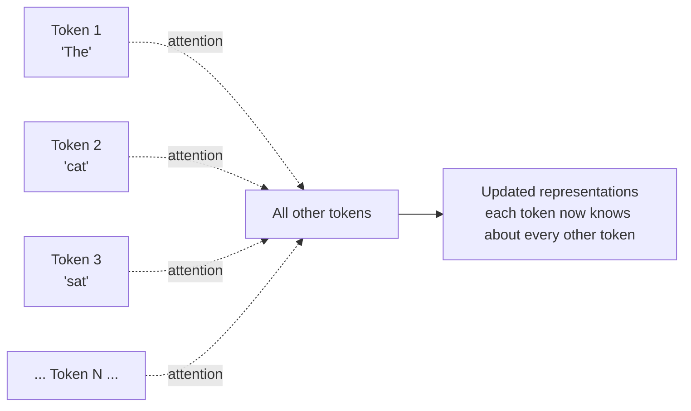
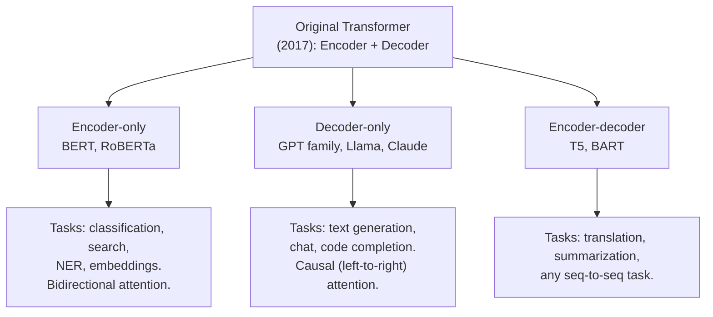

# Transformers — Why This Matters

**Why a single architectural idea — self-attention — became the substrate for almost every modern AI system: ChatGPT, Claude, GitHub Copilot, Google Translate, image generation, code completion, and the foundation models powering everything else.**

---

## The Translator, the Doctor, and the Teacher

A diaspora family in Toronto speaks Tagalog at home. The grandmother knows only her native tongue; the grandkids speak only English. The middle generation translates everything — appointments, bills, casual conversation — and they are exhausted. Translation services exist, but they are expensive and unavailable at 2 a.m. when grandmother needs to describe a chest pain to the on-call nurse.

In 2024, a sequence-to-sequence transformer trained on 100 languages — running on the family's phone — translated the conversation in real time, both directions, with a few seconds of latency per sentence. The grandmother described her symptoms. The nurse heard them in English. The model handled medical terminology, idioms, and emotional nuance without supervision. The grandmother got accurate care at 2 a.m. for the first time in fifteen years of immigration. The middle generation slept.

A doctor in a rural hospital in Mozambique manages 400 patients per day. She has no time to read the latest research literature. New treatment protocols arrive monthly. By the time she reads any single paper, ten more have been published. A transformer-based medical literature assistant — an LLM (Large Language Model) trained on every published medical paper — answers her clinical questions in plain Portuguese. "Latest evidence on cerebral malaria treatment in children under five." Three seconds. Citations included. Decision-support quality matches the best urban specialists.

A teacher in São Paulo teaches a class of 35 high school students. Every student is at a different level. She cannot tutor each one individually. A transformer-based tutoring system — instructed in Portuguese, conversational, patient — sits beside each student during homework. It explains polynomial factoring in seven different ways until the right one clicks. It catches mistakes. It does not get frustrated. The teacher's role evolves from individual instruction to architecting the curriculum and resolving things the AI cannot. Class outcomes improve.

---

## What Transformers Actually Do

A **transformer** is a neural network architecture introduced in 2017 (Vaswani, Shazeer, Parmar, Uszkoreit, Jones, Gomez, Kaiser, Polosukhin — *Attention Is All You Need*, NeurIPS 2017, [arXiv:1706.03762](https://arxiv.org/abs/1706.03762)) that replaced recurrence with **self-attention** — a mechanism where every position in a sequence directly computes weighted similarities to every other position, in parallel.

This single change unlocked:

- **Parallelism in training** — every position can be processed simultaneously, where RNNs were sequential. GPUs (Graphics Processing Units, "G-P-U") scale enormously.
- **Long-range dependencies** — attention reaches across a sequence in one step. RNN/LSTM struggled past hundreds of timesteps; transformers handle hundreds of thousands.
- **Universal architecture** — the same backbone now powers text, code, image, audio, and video generation. Specialized architectures for each modality are the exception, not the rule.

By 2026, the transformer is the substrate for almost every important AI system in production:

| System | Transformer Variant |
|---|---|
| ChatGPT, Claude, Gemini, Llama | Decoder-only (autoregressive generation) |
| Google Search ranking | Encoder-only (BERT family) |
| Google Translate, summarizers | Encoder-decoder (T5, BART) |
| GitHub Copilot, Code Llama | Decoder-only fine-tuned on code |
| Whisper (speech-to-text) | Encoder-decoder on audio |
| GPT-4V, Claude 3 (multimodal) | Decoder-only with image encoder front-end |
| Stable Diffusion's text encoder | Encoder-only conditioning on prompts |
| Vision Transformer (ViT) | Encoder-only on image patches |

---

## The Core Idea — Self-Attention

A token (word, image patch, audio frame) needs context from other tokens to be understood. *"Bank"* means one thing after *"river"* and another after *"interest rate."* In language, in vision, in audio, **what something means depends on what surrounds it**.

Self-attention solves this directly:

For each token, the network computes:
- **Q (Query)** — "what am I looking for?"
- **K (Key)** — "what do I represent?"
- **V (Value)** — "what should I contribute if attended to?"

Every position queries every other position's keys, gets a similarity score, applies softmax to get weights, then mixes values weighted by those scores. Done in parallel. Mathematically, it is one matrix multiplication followed by a softmax followed by another matrix multiplication.

The mechanics, with worked numerical examples, are in [02 — Concepts](02_Concepts.md).

---

## Why This Replaced Recurrence

| Concern | RNN / LSTM | Transformer |
|---|---|---|
| **Long-range memory** | Vanishes past 100s of timesteps | Direct attention, no decay |
| **Training parallelism** | Sequential along time axis | Parallel across all positions |
| **Training speed** | Slow per epoch | Much faster (when GPU memory allows) |
| **Wall-clock time on large data** | Hours-days for moderate models | Hours for the same models |
| **Inference per token (autoregressive generation)** | O(1) per step (constant) | O(N) per step (or O(1) with KV-cache) |
| **Streaming inference** | Native | Requires KV-cache, more complex |
| **Memory at long context** | O(1) per timestep | O(N²) without optimization, O(N) with paged attention |

For batch-mode NLP and any task with abundant training data, transformers won decisively after 2017-2018. For streaming inference and small data, recurrent models still compete (see [Sequence Models](../sequence-models/)).

---

## The Three Architectural Variants

Transformers come in three configurations, each optimized for a different task:

| Variant | Attention Direction | Best For | Famous Examples |
|---|---|---|---|
| **Encoder-only** | Bidirectional (sees all tokens) | Understanding tasks: classify, search, embed | BERT, RoBERTa, DistilBERT |
| **Decoder-only** | Causal (only past tokens) | Generation tasks: chat, code, completion | GPT-2/3/4, Claude, Llama, Mistral |
| **Encoder-decoder** | Bidirectional encoder + causal decoder | Translation, summarization, seq-to-seq | T5, BART, Flan-T5 |

The 2026 production landscape is dominated by **decoder-only** models because chat / generation became the dominant interface. Encoder-only still powers search and embeddings; encoder-decoder is the backbone of translation services.

---

## Why Now? — The Three Drivers (Transformer Edition)

Transformers existed since 2017. Yet 2022-2026 was when they reshaped industries.

### 1. Scale Worked — and Kept Working

The 2020 paper "Scaling Laws for Neural Language Models" (Kaplan et al.) showed that transformer loss decreases predictably with more parameters, more data, more compute. Doubling the model gives a measurable accuracy gain. **No diminishing returns at the scales tried**. This unleashed the race: GPT-2 (1.5B), GPT-3 (175B), GPT-4 (~1.7T inferred), Claude, Gemini.

### 2. Hardware Caught Up — Then Was Built For It

NVIDIA H100, H200, B100 GPUs are designed specifically for transformer workloads. Tensor cores accelerate the matrix multiplications attention is built on. FlashAttention (Dao et al.) and other algorithmic improvements squeezed an additional 2-5x out of attention-heavy workloads. Training a model that would have cost $10M in 2020 costs $1M in 2026.

### 3. The Interaction Patterns Productized

The transformer alone is not a product. ChatGPT (2022) packaged GPT into a conversational interface. GitHub Copilot (2021) packaged Codex into autocomplete. RAG (Retrieval-Augmented Generation) packaged transformers + retrieval into knowledge systems. Each interaction pattern unlocked a market:

- **Chat** → consumer assistants, customer support automation
- **Inline completion** → developer productivity, writing assistants
- **RAG** → enterprise knowledge access, customer-specific Q&A
- **Agent** → autonomous task completion, tool use

Without these interaction patterns, the transformer would have remained a research curiosity.

---

## Where Transformers Fit in Production Systems

Transformers rarely ship standalone. They are components of larger systems.

| Component | Role |
|---|---|
| **Tokenizer** | Convert text to token IDs (BPE, WordPiece, SentencePiece) |
| **Embedding layer** | Convert token IDs to vectors |
| **Transformer stack** | **The encoder/decoder layers** |
| **Output projection / decoder** | Convert hidden states to output tokens |
| **Sampling / search** | Greedy, top-k, top-p, beam search — turn distributions into sequences |
| **Safety / filters** | Block harmful outputs, detect prompt injection |
| **System prompt / context** | Steer the model's behavior |
| **Retrieval** (for RAG) | Bring in relevant documents at inference time |
| **Tools** (for agents) | Let the model call functions, search, run code |

A "ChatGPT" deployment is the model plus all of these. The model alone produces tokens; the system around it produces a product.

In our **Production Diagnostic Intelligence System (CSI):**

| Component | How Transformers Help |
|---|---|
| Incident triage assistant | Decoder-only LLM reads incident timeline, drafts diagnosis |
| Runbook search | Encoder-only embeddings + vector search find the right runbook |
| Auto-summarization | Encoder-decoder summarizes long incident reports for stakeholders |
| Code generation for fixes | Decoder-only LLM proposes patches given the bug context |

See the full architecture: [CSI Architecture](../../../systems/continuous-system-intelligence/architecture.md)

---

## What You Will Learn in This Material

| Chapter | What You Learn |
|---|---|
| [01 — Why](01_Why.md) | This page. Why transformers matter. The three variants. Where they sit in production. |
| [02 — Concepts](02_Concepts.md) | Embeddings, Q/K/V, scaled dot-product attention, multi-head, positional encoding, encoder/decoder blocks. With worked numerical examples. |
| [03 — Hello World](03_Hello_World.md) | Build a working transformer-based language model in 80 lines of PyTorch. |
| [04 — How It Works](04_How_It_Works.md) | Layer norm placement (Pre-LN vs Post-LN), warmup schedules, gradient flow, attention patterns. |
| [05 — Building It](05_Building_It.md) | Encoder vs decoder vs encoder-decoder choice. Pretraining vs fine-tuning. LoRA, QLoRA, parameter-efficient fine-tuning. |
| [06 — Production Patterns](06_Production_Patterns.md) | ChatGPT, Claude, GPT-4o, BERT for search, GitHub Copilot, Whisper, vision transformers. Real architectures, real costs. |
| [07 — System Design](07_System_Design.md) | KV-cache, paged attention, vLLM, continuous batching, FlashAttention, latency vs throughput. |
| [08 — Quality, Security, Governance](08_Quality_Security_Governance.md) | Prompt injection, jailbreaking, hallucination, copyright, EU AI Act, model evaluation. |
| [09 — Observability & Troubleshooting](09_Observability_Troubleshooting.md) | Token-level metrics, perplexity, hallucination detection, evaluation harnesses. |
| [10 — Decision Guide](10_Decision_Guide.md) | "API or self-host?" "Fine-tune or prompt?" Decision tables. Production readiness checklist. |

### Architecture Deep Dive

| Doc | Description |
|---|---|
| [`architectures/transformer.md`](architectures/transformer.md) | Single-doc reference covering embeddings, attention math, multi-head decomposition, encoder/decoder blocks, three variants. Concepts + code + math + Q&A. |

### Foundations and Sibling Playbooks

This playbook builds on:

- [Deep Learning](../deep-learning/) — backprop, training loop, residual connections
- [Sequence Models](../sequence-models/) — RNN/LSTM (the predecessors)
- [Math for AI](../math-for-ai.md) — derivatives, chain rule, dot products, softmax
- [Architecture Glossary](../architecture-glossary.md) — Q/K/V, attention, multi-head terminology
- [Architecture Math](../architecture-math.md) — parameter counts for transformer blocks

### Cross-Cutting Sibling Playbooks

| Playbook | When |
|---|---|
| [RAG](../rag/) | Building knowledge-grounded systems on top of transformers |
| [Agents](../agents/) | Building autonomous systems that use transformer LLMs as the core reasoning engine |
| [Computer Vision](../computer-vision/) | For Vision Transformers (ViT), multimodal systems |
| [NLP](../nlp/) (coming) | Task-domain entry point for NLP applications |

**Hands-on notebook:** [Transformer From Scratch on Colab](https://colab.research.google.com/github/sunilmogadati/systems-in-production/blob/main/implementation/notebooks/Transformer_From_Scratch.ipynb) — self-attention computed by hand in NumPy: Q/K/V projection, scaled dot-product, softmax, multi-head split. Verified against PyTorch.

---

**Next:** [02 — Concepts](02_Concepts.md) — Embeddings, attention, multi-head. The math, in plain English with worked numerical examples.
