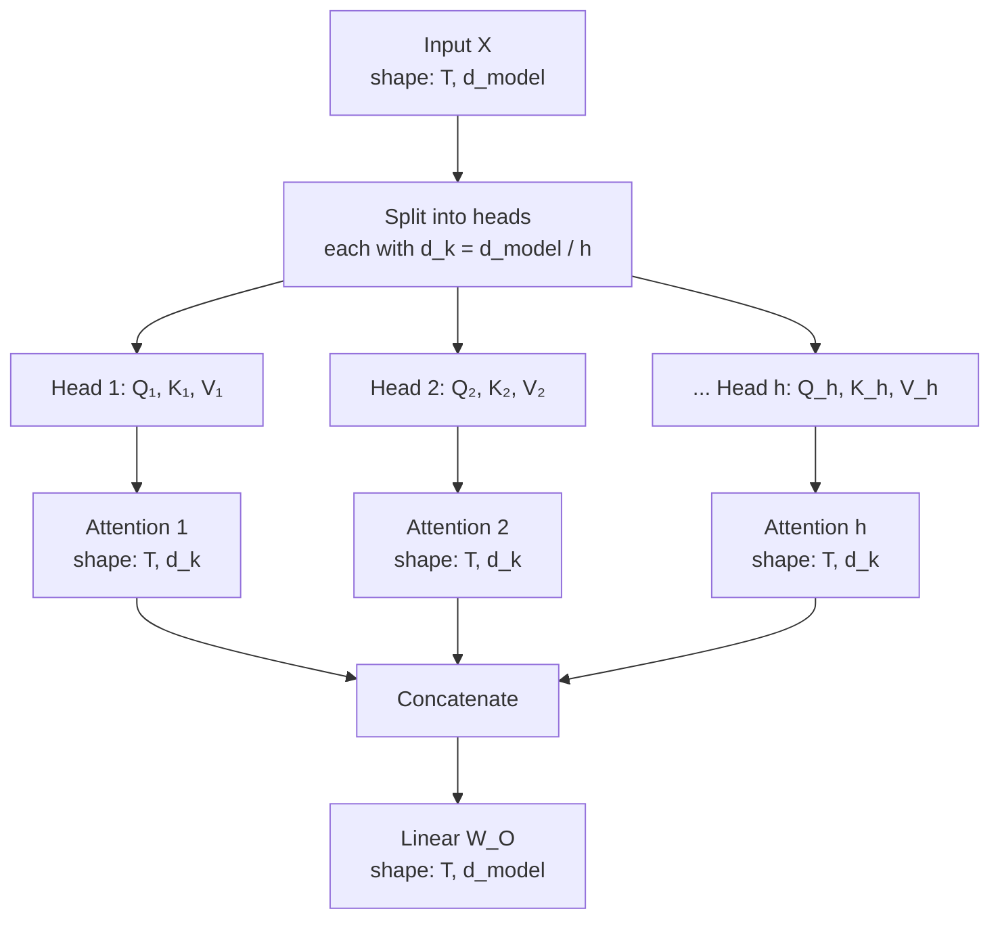
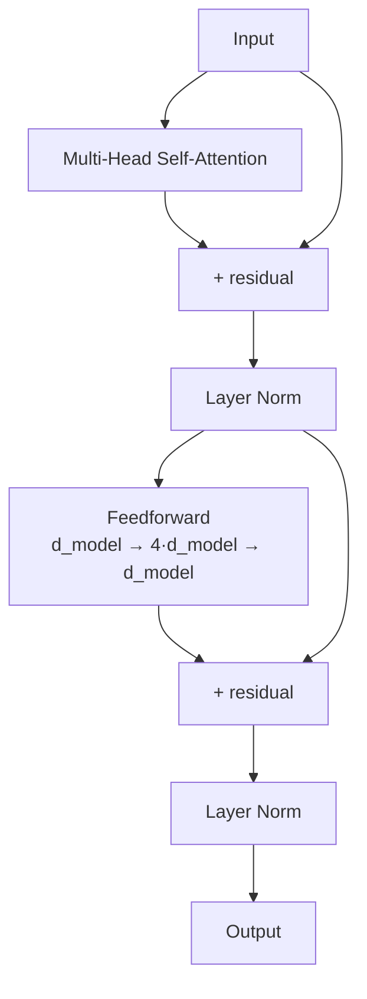

# Transformers — Concepts and Mental Models

**Embeddings, Q/K/V, scaled dot-product attention, multi-head attention, positional encoding, encoder/decoder blocks. With worked numerical examples.**

---

> **Build on the foundations.** Backpropagation, training loop — see [Deep Learning → Concepts](../deep-learning/02_Concepts.md). Dot products and matrix multiplication — see [Math for AI](../math-for-ai.md). This chapter focuses on what is *unique to transformers*: the attention mechanism, why it is parallel, and how it is composed into encoder/decoder blocks.

---

## From Tokens to Meaning — Two Layers Before Attention

Two things happen before any attention. Both matter.

### 1. Tokenization

Text is converted to integer IDs from a vocabulary. Three common schemes:

| Tokenizer | How | Used By |
|---|---|---|
| **BPE (Byte-Pair Encoding)** | Merge frequent character pairs iteratively | GPT family, RoBERTa |
| **WordPiece** | Similar to BPE, slight variant | BERT, DistilBERT |
| **SentencePiece** | Unicode-aware, language-agnostic | T5, multilingual models |

The vocabulary is typically 30K-200K tokens. A token is *not* always a word — common words become a single token, rare words split into multiple tokens. *"Tokenization"* might be `["token", "ization"]`.

### 2. Token Embedding

Each token ID is mapped to a learned vector — a **token embedding**. If `vocab_size = 30,000` and `d_model = 512`, the embedding table is a `(30,000, 512)` matrix. Token ID 1234 retrieves row 1234, a 512-dimensional vector.

Embeddings are **learned during training**. Tokens that play similar roles in the data end up with similar embeddings — *"Paris"* and *"Berlin"* land near each other; verbs cluster together. This was the breakthrough of Word2Vec (2013); transformers inherit and refine it.

The transformer operates on a sequence of these embedding vectors, not on raw token IDs.

---

## The Position Problem

Self-attention is **permutation-invariant** by default — the network would not be able to tell *"cat sat"* from *"sat cat"* because attention treats all positions equally. We must add positional information.

### Two Approaches

**Sinusoidal positional encoding** (original Transformer paper). At position `pos` and dimension `i`:

```
PE(pos, 2i)   = sin(pos / 10000^(2i/d_model))
PE(pos, 2i+1) = cos(pos / 10000^(2i/d_model))
```

Different frequencies across dimensions, so the network can attend to "3 positions ahead" or "5 positions ahead" by combining frequencies. Added to token embeddings before the first attention layer.

**Learned positional embeddings**. A trainable embedding table indexed by position. Used by GPT-2/3, BERT.

Modern alternatives (RoPE, ALiBi) are increasingly common in 2026 — see `architectures/transformer.md` for details. For this playbook, the key concept: **the network needs to know where each token sits in the sequence**, and positional encoding is how.

---

## Self-Attention — The Core

The transformer's central operation. Three roles per token, all derived from the same input vector by linear projection.

```
For each input vector x_i:
   q_i = x_i · W_Q          ← Query: "what am I looking for?"
   k_i = x_i · W_K          ← Key:   "what do I represent?"
   v_i = x_i · W_V          ← Value: "what should I contribute?"
```

`W_Q`, `W_K`, `W_V` are learned matrices, each of shape `(d_model, d_k)` for queries and keys, `(d_model, d_v)` for values. Typically `d_k = d_v = d_model / num_heads`.

### The Scaled Dot-Product Attention Equation

```
Attention(Q, K, V) = softmax(Q · Kᵀ / √d_k) · V
```

This is the entire operation. Step by step:

1. **`Q · Kᵀ`** — every query dot-products with every key, producing an `(N, N)` similarity matrix where `N` is sequence length. Each row is one token's attention scores over all tokens.
2. **`/ √d_k`** — scale down to prevent the dot products from becoming too large (which would push softmax into saturation, killing the gradient).
3. **`softmax(...)`** — normalize each row to a probability distribution. Each token's attention weights sum to 1.
4. **`... · V`** — weighted average of the value vectors using those attention weights.

The output is `(N, d_v)` — one updated vector per token, where each vector is a weighted combination of all the value vectors based on how relevant each was.

### Why "Self" Attention

The same input is used to derive Q, K, and V. The sequence is attending **to itself**. Every position learns about every other position. Contrast with **cross-attention** (used in encoder-decoder transformers), where Q comes from the decoder and K, V come from the encoder.

---

## A Worked Example — Self-Attention by Hand

Three tokens, `d_model = 4`. Compute self-attention end-to-end.

### Setup

```
Embeddings X (3, 4):
   x_1 = [1, 0, 1, 0]
   x_2 = [0, 1, 0, 1]
   x_3 = [1, 1, 0, 0]

W_Q (4, 4):                    W_K (4, 4):                   W_V (4, 4):
  0.1  0.2  0.0  0.0             0.0  0.3  0.0  0.2            0.5  0.0  0.0  0.0
  0.0  0.0  0.3  0.4             0.4  0.0  0.1  0.0            0.0  0.5  0.0  0.0
  0.5  0.0  0.0  0.0             0.0  0.2  0.5  0.0            0.0  0.0  0.5  0.0
  0.0  0.0  0.0  0.5             0.3  0.0  0.0  0.4            0.0  0.0  0.0  0.5
```

### Step 1: Compute Q, K, V

```
Q = X · W_Q = [[0.6, 0.2, 0.0, 0.0],
               [0.0, 0.0, 0.3, 0.9],
               [0.1, 0.2, 0.3, 0.4]]

K = X · W_K = [[0.0, 0.5, 0.5, 0.2],
               [0.7, 0.0, 0.1, 0.4],
               [0.4, 0.3, 0.1, 0.2]]

V = X · W_V = [[0.5, 0.0, 0.5, 0.0],
               [0.0, 0.5, 0.0, 0.5],
               [0.5, 0.5, 0.0, 0.0]]
```

### Step 2: Attention Scores `Q · Kᵀ`

```
Q · Kᵀ:
  q_1 · k_1 = 0.6·0 + 0.2·0.5 + 0·0.5 + 0·0.2 = 0.10
  q_1 · k_2 = 0.6·0.7 + 0.2·0 + 0·0.1 + 0·0.4 = 0.42
  q_1 · k_3 = 0.6·0.4 + 0.2·0.3 + 0·0.1 + 0·0.2 = 0.30
  ... (and so on for q_2, q_3)

Full score matrix:
  [[0.10, 0.42, 0.30],
   [0.33, 0.39, 0.21],
   [0.33, 0.26, 0.21]]
```

Each row tells how strongly that token's query matches each token's key. Row 1 is "what does token 1 attend to?" Token 1's strongest match is token 2 (score 0.42).

### Step 3: Scale by `√d_k`

`d_k = 4`, so `√d_k = 2`. Divide:

```
Scaled scores:
  [[0.050, 0.210, 0.150],
   [0.165, 0.195, 0.105],
   [0.165, 0.130, 0.105]]
```

**Why scale?** Without scaling, dot products of high-dimensional vectors grow large. After softmax, large inputs become near-1 (one position) and near-0 (others), which kills the gradient. Scaling by `√d_k` keeps the input distribution well-behaved.

### Step 4: Softmax (Row-wise)

```
Attention weights:
  [[0.305, 0.358, 0.337],
   [0.336, 0.347, 0.317],
   [0.344, 0.332, 0.324]]
```

Each row sums to 1. These are the weights — how much each token's value contributes to the updated representation.

### Step 5: Weighted Sum `weights · V`

```
Output:
  [[0.321, 0.348, 0.153, 0.179],
   [0.327, 0.332, 0.168, 0.173],
   [0.334, 0.328, 0.172, 0.166]]
```

This is the self-attention output — three updated representations (one per input token), each a context-aware mixture of all three value vectors.

The companion notebook ([Transformer_From_Scratch.ipynb](https://colab.research.google.com/github/sunilmogadati/systems-in-production/blob/main/implementation/notebooks/Transformer_From_Scratch.ipynb)) runs this exact example in NumPy and verifies against PyTorch.

---

## Multi-Head Attention — Multiple Perspectives at Once

Single-head attention has a fixed mixing scheme. **Multi-head attention** runs multiple attention computations in parallel, each with its own `W_Q, W_K, W_V`, giving the network multiple "perspectives" on relationships.



**The split.** If `d_model = 512` and `num_heads = 8`, each head operates on `d_k = d_v = 64` dimensions. The projection matrices `W_Q, W_K, W_V` produce `(T, 512)` outputs that get reshaped to `(T, 8, 64)` and treated as 8 independent attention computations.

**Why multiple heads.** Different heads can attend to different patterns. One might track syntactic agreement; another, coreference; another, long-range dependencies. The model learns these specializations during training. Empirically, multi-head consistently beats single-head.

The total parameter count is the same as single-head with `d_model = d_model`: each head has `d_model · d_k` per `W_*`, and there are `h` heads, so `h · d_model · d_k = d_model²` per matrix. The output projection `W_O` adds another `d_model²`.

For our worked example with `d_model = 4, h = 2`, each head operates on `d_k = 2`. The notebook shows the multi-head decomposition explicitly.

---

## The Transformer Block — Putting It Together

A single transformer block stacks:

1. **Multi-head self-attention** (with residual connection + layer norm)
2. **Feedforward network (FFN)** — typically two linear layers with a non-linearity (ReLU or GELU). Inner dimension is usually 4× `d_model`.
3. Another residual connection + layer norm



Modern transformers stack many of these blocks. GPT-2 small has 12 blocks; GPT-3 has 96; GPT-4 is rumored to have ~120.

### Pre-LN vs Post-LN

The original 2017 paper put layer norm AFTER the residual addition (Post-LN). Modern transformers almost universally put it BEFORE (Pre-LN), because Pre-LN stabilizes training and removes the need for learning-rate warmup in many cases.

```
Post-LN: y = LayerNorm(x + Sublayer(x))         ← original
Pre-LN:  y = x + Sublayer(LayerNorm(x))         ← modern default
```

Use **Pre-LN for new models**. Post-LN appears only in legacy code (BERT, original transformer).

### The Residual Stream

Every block adds to a running representation through residual connections — the **residual stream**. Information flows through the residual stream from layer to layer, with each block adding its contribution. This is the same idea as ResNet's residual connections — and the reason transformers can stack 100+ layers without vanishing gradients.

---

## The Three Architectural Variants

The original transformer was an encoder-decoder for translation. Three variants emerged.

### Encoder-Only (BERT Family)

```
Input tokens → Embeddings → [Encoder Block] × N → Output (one vector per token)
```

- Bidirectional attention: every token attends to every other token (no masking)
- Trained with masked language modeling: predict masked words from context
- Used for: classification, NER (Named Entity Recognition), embeddings, search ranking
- Examples: BERT, RoBERTa, DistilBERT, all-MiniLM (sentence embeddings)

### Decoder-Only (GPT Family)

```
Input tokens → Embeddings → [Decoder Block (causal)] × N → Output (next-token logits)
```

- Causal (autoregressive) attention: each token attends only to itself and earlier tokens
- Trained with next-token prediction
- Used for: text generation, chat, code completion, agents
- Examples: GPT-2/3/4, Claude, Llama, Mistral, Gemini

### Encoder-Decoder (T5, BART)

```
Input → Encoder Blocks → encoded representation
                            ↓ (cross-attention)
Output → Decoder Blocks → generated output
```

- Encoder is bidirectional; decoder is causal
- Decoder uses **cross-attention** to attend to encoder's output
- Used for: translation, summarization, any seq-to-seq task
- Examples: T5, BART, Flan-T5, mT5

In 2026 production:
- **Decoder-only dominates** because chat/generation became the primary interface
- **Encoder-only** is the default for embeddings and ranking
- **Encoder-decoder** is mostly displaced by decoder-only with prompts (e.g., "translate this:")

---

## Causal Masking — The Decoder's Constraint

For autoregressive generation, the model must NOT see future tokens. **Causal masking** zeros out the attention weights for future positions:

```
Mask matrix (4 tokens):
  1  0  0  0      ← token 1 attends to itself only
  1  1  0  0      ← token 2 attends to tokens 1, 2
  1  1  1  0      ← token 3 attends to 1, 2, 3
  1  1  1  1      ← token 4 attends to all previous
```

Implemented by adding `−∞` (or a very large negative number) to scores at masked positions before softmax — the masked entries become 0 after softmax.

This is what lets a decoder generate one token at a time at inference: position N's representation depends only on positions 1...N, so we can produce token N+1 by appending it and re-running attention only on the new position (with KV-cache, see [System Design](07_System_Design.md)).

---

## Parameter Counts

For a transformer block with `d_model = D` and FFN inner dim `d_ff = 4D`:

| Component | Parameters |
|---|---|
| Multi-head attention (Q, K, V, O) | `4D²` |
| Feedforward network | `8D²` |
| Layer norm × 2 | `4D` (negligible) |
| **Per block** | **≈ 12D²** |

For BERT-base (`D = 768, N = 12 blocks`):
- Per block: `12 · 768² = 7.07M`
- 12 blocks: ~85M
- Plus embedding (`30K · 768 ≈ 23M`): total ~110M parameters

For more worked examples, see [Architecture Math → Type 1: Parameter Counting](../architecture-math.md#type-1-parameter-counting).

---

## Why Transformers Replaced RNN/LSTM

| Concern | RNN/LSTM | Transformer |
|---|---|---|
| Long-range dependencies | Vanishing gradients past 100s | One-step attention to any position |
| Training parallelism | Sequential along time | Parallel across all positions |
| Inductive bias for spatial structure | None (sequential) | None (permutation-invariant + positional encoding) |
| GPU efficiency | Limited (sequential) | High (matrix multiplications) |
| Memory at long context | O(1) per step | O(N²) without optimization, O(N) with paged attention |
| Streaming inference | Native | Requires KV-cache |

For batch-mode work with abundant data, transformers won. For streaming and tiny-data, RNN/LSTM still compete (see [Sequence Models](../sequence-models/)).

---

## Glossary — Quick Reference

### Transformer-Specific Terms

| Term | Pronounced | Meaning |
|---|---|---|
| **Self-attention** | — | Mechanism where every position attends to every other position in the same sequence |
| **Cross-attention** | — | Decoder attends to encoder's output (used in encoder-decoder models) |
| **Q / K / V** | "Q", "K", "V" | Query, Key, Value — three projections of the input |
| **d_model** | "D-model" | Embedding/hidden dimension of the transformer (typically 256-2048) |
| **d_k, d_v** | "D-K", "D-V" | Per-head dimension of keys and values |
| **Multi-head attention** | — | Multiple parallel attention computations, concatenated |
| **Causal mask** | — | Mask preventing attention to future tokens (decoder-only) |
| **Positional encoding** | — | Information about token position added to embeddings |
| **RoPE** | "rope" | Rotary Position Embedding — modern alternative to sinusoidal |
| **ALiBi** | "alibi" | Attention with Linear Biases — another modern alternative |
| **Layer norm (LN)** | "layer norm" | Normalization within each token's vector (separate from BatchNorm) |
| **Pre-LN / Post-LN** | — | Where layer norm sits relative to residual addition |
| **Residual stream** | — | The running representation that flows through the residual connections |
| **FFN (Feedforward Network)** | "F-F-N" | The two-linear-layer per-position network in each block |
| **GELU** | "GEE-loo" | Gaussian Error Linear Unit — activation used in transformer FFNs |
| **BPE / WordPiece / SentencePiece** | — | Tokenization schemes |
| **Encoder-only / Decoder-only / Encoder-decoder** | — | The three architectural variants |
| **Attention head** | — | One of the parallel attention computations in multi-head |
| **KV-cache** | "K-V cache" | Cached keys and values from previous tokens, for fast autoregressive inference |
| **FlashAttention** | — | Memory-efficient attention algorithm — same math, faster, less memory |

For full cross-architecture glossary, see [Architecture Glossary](../architecture-glossary.md). For the deep dive in one document, see [`architectures/transformer.md`](architectures/transformer.md).

---

**Next:** [03 — Hello World](03_Hello_World.md) — Build a working transformer-based language model in 80 lines of PyTorch.
