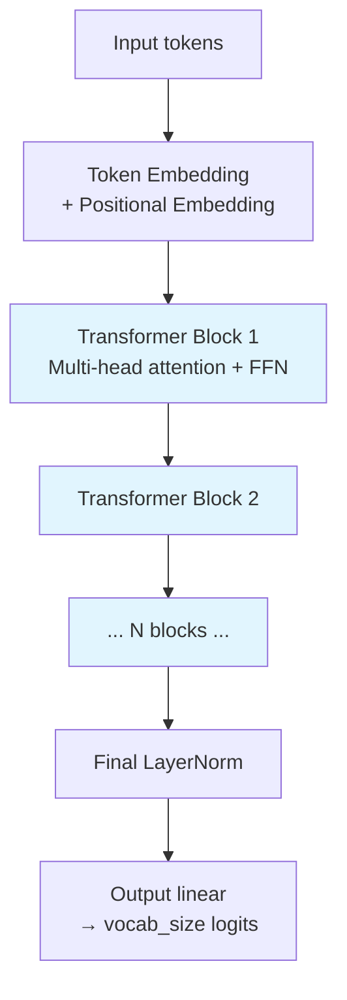

# Transformers — Hello World

**Build a working transformer-based language model in 80 lines of PyTorch.**

---

## What You Will Build

A small **decoder-only transformer** that learns to predict the next character. Trained on a tiny corpus, it generates text in the style of the training data after a few minutes.

This is the simplest end-to-end transformer that matters: a character-level GPT-style model. After this, [Chapter 04](04_How_It_Works.md) explains the training dynamics; [Chapter 05](05_Building_It.md) explains how to make architectural choices.

---

## The Architecture



Each block: **Pre-LN → Multi-head attention with causal mask → residual → Pre-LN → FFN → residual**.

---

## The Code

```python
import math
import torch
import torch.nn as nn
import torch.nn.functional as F

# === DATA ===
text = """to be or not to be that is the question
whether tis nobler in the mind to suffer
the slings and arrows of outrageous fortune
or to take arms against a sea of troubles"""

chars = sorted(set(text))
vocab_size = len(chars)
char_to_idx = {c: i for i, c in enumerate(chars)}
idx_to_char = {i: c for i, c in enumerate(chars)}

# Encode the text
encoded = torch.tensor([char_to_idx[c] for c in text], dtype=torch.long)
SEQ_LEN = 32
D_MODEL = 64
N_HEADS = 4
N_BLOCKS = 2

# === MODEL ===
class TransformerBlock(nn.Module):
    def __init__(self, d_model, n_heads):
        super().__init__()
        self.ln1 = nn.LayerNorm(d_model)
        self.attn = nn.MultiheadAttention(d_model, n_heads, batch_first=True)
        self.ln2 = nn.LayerNorm(d_model)
        self.ffn = nn.Sequential(
            nn.Linear(d_model, 4 * d_model),
            nn.GELU(),
            nn.Linear(4 * d_model, d_model),
        )

    def forward(self, x, attn_mask):
        # Pre-LN architecture
        attn_out, _ = self.attn(self.ln1(x), self.ln1(x), self.ln1(x),
                                attn_mask=attn_mask, need_weights=False)
        x = x + attn_out                       # residual
        x = x + self.ffn(self.ln2(x))          # residual + FFN
        return x

class CharTransformer(nn.Module):
    def __init__(self, vocab_size, d_model=64, n_heads=4, n_blocks=2, seq_len=32):
        super().__init__()
        self.token_embed = nn.Embedding(vocab_size, d_model)
        self.pos_embed   = nn.Embedding(seq_len, d_model)
        self.blocks = nn.ModuleList([
            TransformerBlock(d_model, n_heads) for _ in range(n_blocks)
        ])
        self.final_ln = nn.LayerNorm(d_model)
        self.head = nn.Linear(d_model, vocab_size)
        self.seq_len = seq_len

    def forward(self, x):
        B, T = x.shape
        positions = torch.arange(T, device=x.device).unsqueeze(0)

        # Embeddings: token + position
        h = self.token_embed(x) + self.pos_embed(positions)

        # Causal mask: token at position i cannot see positions j > i
        mask = torch.triu(torch.ones(T, T, device=x.device), diagonal=1).bool()

        # Stack of blocks
        for block in self.blocks:
            h = block(h, mask)

        # Final norm + output projection
        h = self.final_ln(h)
        return self.head(h)                    # (B, T, vocab_size)

# === SETUP ===
device = torch.device('cuda' if torch.cuda.is_available() else 'cpu')
model = CharTransformer(vocab_size, D_MODEL, N_HEADS, N_BLOCKS, SEQ_LEN).to(device)
optimizer = torch.optim.AdamW(model.parameters(), lr=3e-4, weight_decay=0.01)
loss_fn = nn.CrossEntropyLoss()

# === TRAIN ===
EPOCHS = 200

for epoch in range(EPOCHS):
    starts = torch.randint(0, len(encoded) - SEQ_LEN - 1, (32,))
    inputs  = torch.stack([encoded[s:s+SEQ_LEN]      for s in starts]).to(device)
    targets = torch.stack([encoded[s+1:s+SEQ_LEN+1] for s in starts]).to(device)

    logits = model(inputs)
    loss = loss_fn(logits.reshape(-1, vocab_size), targets.reshape(-1))

    optimizer.zero_grad()
    loss.backward()
    torch.nn.utils.clip_grad_norm_(model.parameters(), max_norm=1.0)
    optimizer.step()

    if (epoch + 1) % 50 == 0:
        print(f"Epoch {epoch+1}: loss = {loss.item():.4f}")

# === GENERATE ===
def generate(start='to', length=80):
    model.eval()
    out = list(start)
    x = torch.tensor([[char_to_idx[c] for c in start]], device=device)
    for _ in range(length):
        # Crop to the last seq_len characters
        x_cond = x[:, -SEQ_LEN:]
        logits = model(x_cond)
        probs = F.softmax(logits[0, -1], dim=0)
        next_id = torch.multinomial(probs, 1).item()
        out.append(idx_to_char[next_id])
        x = torch.cat([x, torch.tensor([[next_id]], device=device)], dim=1)
    return ''.join(out)

print("\nGenerated:", generate('to', 80))
```

That is the entire system. **~80 lines for the model + training + generation.**

---

## What You Should See

```
Epoch  50: loss = 1.6234
Epoch 100: loss = 0.9874
Epoch 150: loss = 0.5612
Epoch 200: loss = 0.3429

Generated: to be or not to be that is the question whether tis nobler in the mind to
```

After 200 epochs on the tiny Hamlet corpus, the model has memorized the structure. On a real corpus (Shakespeare's complete works, ~1MB), the same 2-block transformer trained for an hour produces text that reads like Shakespeare at the surface level.

---

## What Just Happened — The 5-Step Loop, Transformer-Style

The same 5 steps from [Deep Learning → Concepts](../deep-learning/02_Concepts.md), with three transformer-specific bits:

| Step | Code | Transformer-specific |
|---|---|---|
| **1. Forward** | `logits = model(inputs)` | Token + positional embeddings → stacked self-attention blocks → output projection. **Causal masking** prevents attention to future tokens. |
| **2. Loss** | Cross-entropy at every position | The model predicts each next character |
| **3. Zero gradients** | Standard | — |
| **4. Backward** | Standard backprop | Gradients flow back through every block via the **residual stream** |
| **5. Update** | AdamW + gradient clipping | Gradient clipping (`max_norm=1.0`) is standard for transformer training stability |

**The unique transformer thing**: in step 1, every position attends to every previous position in parallel. The whole sequence is processed in one forward pass. Unlike RNN/LSTM, there is no time loop in PyTorch — it's all matrix multiplication.

---

## Common Bugs

### 1. Forgetting the Causal Mask

Without the mask, training "works" — loss goes down — but the model has been cheating: it sees future tokens during training. At generation time, it has nothing to attend to from the future, and quality collapses.

**Always include a causal mask** for decoder-only / autoregressive models:

```python
mask = torch.triu(torch.ones(T, T, device=x.device), diagonal=1).bool()
```

### 2. Wrong Position-Embedding Scope

Position embeddings must match the maximum sequence length. If you pre-allocate for `seq_len = 256` and try to feed a sequence of 512 at inference, you'll index out of bounds.

For long-context use, switch to RoPE or ALiBi which generalize better than learned embeddings.

### 3. Pre-LN vs Post-LN Confusion

Older code (BERT, original Transformer) uses Post-LN: `LayerNorm(x + Sublayer(x))`. Modern code uses Pre-LN: `x + Sublayer(LayerNorm(x))`. Mixing them in the same network breaks training.

The above code uses **Pre-LN** (the modern default).

### 4. Forgetting Gradient Clipping

Transformer training is more stable than RNN training, but gradient clipping is still standard:

```python
torch.nn.utils.clip_grad_norm_(model.parameters(), max_norm=1.0)
```

Place between `loss.backward()` and `optimizer.step()`. Skipping it occasionally produces NaN losses, especially early in training.

### 5. Learning Rate Too High Without Warmup

Transformers historically required learning rate warmup (start low, ramp up). With Pre-LN architecture, this is less critical, but a learning rate of `3e-4` (this code) is conservative. If your loss explodes early, lower the learning rate or add warmup. See [Chapter 04](04_How_It_Works.md).

---

## Run It Yourself

The from-scratch notebook walks through self-attention with all the math computed by hand:

**[Transformer From Scratch on Colab](https://colab.research.google.com/github/sunilmogadati/systems-in-production/blob/main/implementation/notebooks/Transformer_From_Scratch.ipynb)** — Q/K/V projection, scaled dot-product attention, multi-head split, all in NumPy. Verified against PyTorch.

For the architecture deep dive (encoder-only / decoder-only / encoder-decoder, positional encoding variants, modern code patterns):

**[`architectures/transformer.md`](architectures/transformer.md)** — single-doc reference with concepts, code, math, Q&A.

---

**Next:** [04 — How It Works](04_How_It_Works.md) — Pre-LN vs Post-LN, learning rate warmup, attention patterns, gradient flow through deep transformers.
