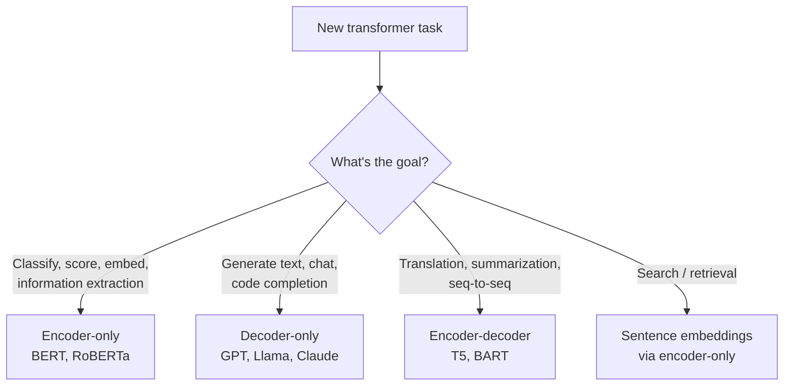
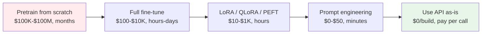

# Transformers — Building It

**Encoder vs decoder vs encoder-decoder choice. Pretrain vs fine-tune vs prompt. LoRA, QLoRA, parameter-efficient fine-tuning. Scaling laws.**

---

## The Core Decision: Which Variant?



### Decision Table

| Task | Variant | Why |
|---|---|---|
| Sentiment classification | Encoder-only | Bidirectional context, single forward pass |
| Named entity recognition | Encoder-only | Each token gets a label |
| Sentence embeddings (for search) | Encoder-only | Pool the encoder's output to a fixed vector |
| Question answering (extractive) | Encoder-only | Find span boundaries in the passage |
| Text generation, chat | Decoder-only | Autoregressive next-token prediction |
| Code completion | Decoder-only | Same as text generation |
| Agent / tool use | Decoder-only | Generates tool calls, reasoning, responses |
| Translation | Encoder-decoder OR decoder-only with prompts | Encoder-decoder is more efficient; decoder-only with prompts is more flexible |
| Summarization | Encoder-decoder OR decoder-only | Same |
| Image generation | Encoder (text) + Diffusion (image) | The transformer encodes the prompt; diffusion generates the image |

In 2026, **decoder-only is dominant** for new general-purpose work because the prompt-based interface generalizes to many tasks. Encoder-only persists for embeddings and dedicated classification.

---

## Pretrain vs Fine-tune vs Prompt — The Production Spectrum

Before architecture, decide where you sit on the modification spectrum:



### Almost No One Pretrains From Scratch

Pretraining a foundation transformer from scratch is the domain of OpenAI, Anthropic, Google, Meta, Mistral, and a few others. Costs are millions to hundreds of millions of dollars. **This is rarely the right choice for a production team.**

### Most Production Work Is Fine-tuning or Prompting

| Approach | Cost | When |
|---|---|---|
| **Use API as-is** (GPT-4, Claude, Gemini) | Pay per call ($1-30 per 1M tokens) | Fastest path; prompt engineering carries you far |
| **Prompt engineering** | Free except API calls | Most projects start here; can solve 60-80% of needs |
| **Few-shot / RAG** | API + embeddings cost | Adds knowledge without training; see [RAG playbook](../rag/) |
| **PEFT (LoRA, QLoRA, adapters)** | Hundreds to a few thousand $ | Custom behavior on small data |
| **Full fine-tune** | Thousands to tens of thousands $ | When PEFT is insufficient |
| **Pretrain + fine-tune** | Millions $ | Only for foundation model providers |

The **2026 production playbook**: start with API-as-is + prompts; if quality insufficient, add RAG; if still insufficient, fine-tune via LoRA; rarely escalate beyond.

---

## Parameter-Efficient Fine-Tuning (PEFT)

Full fine-tuning updates every weight in a 7B-70B parameter model — expensive in compute and storage. PEFT trains a tiny number of additional parameters while freezing the base model.

### LoRA (Low-Rank Adaptation)

The most popular PEFT technique. Instead of updating a weight matrix `W` directly, learn a low-rank update:

```
W_effective = W + α · A · B
```

Where `A` is `(d, r)` and `B` is `(r, d)` — low-rank matrices with `r = 4-64`. Only `A` and `B` are trained; `W` is frozen.

**Storage**: a 7B model fine-tuned with LoRA `r=8` adds ~10MB of trainable parameters instead of 28GB. You can have 100 different LoRA adapters for the same base model and switch between them at inference.

```python
# Pseudocode using Hugging Face PEFT
from peft import LoraConfig, get_peft_model

config = LoraConfig(
    r=8,                    # rank
    lora_alpha=16,          # scaling
    target_modules=["q_proj", "v_proj"],  # which weights get LoRA
    lora_dropout=0.1,
    bias="none",
)
peft_model = get_peft_model(base_model, config)
peft_model.print_trainable_parameters()
# → trainable: 4M, total: 7B (0.05% trainable)
```

### QLoRA

LoRA + 4-bit quantization of the frozen base model. Allows fine-tuning a 70B model on a single 24GB consumer GPU. The quality cost is small (~1-3% on most benchmarks).

### Other PEFT Methods

| Method | What It Does |
|---|---|
| **Adapter** | Insert small trainable modules between layers; freeze the rest |
| **Prefix tuning** | Prepend learnable "soft prompt" tokens to the input |
| **Prompt tuning** | Like prefix tuning but only at the input embedding |
| **IA3** | Multiplicative scaling of activations; very few parameters |

LoRA is the safest default. Pick others if LoRA underperforms or you have specific constraints.

---

## Choosing a Base Model in 2026

| Use Case | Recommended Base Model |
|---|---|
| English chat / general | Llama 3+, Mistral 7B+ (open) or Claude/GPT-4 (API) |
| Code | Code Llama, DeepSeek Coder, GPT-4 (API) |
| Multilingual | Llama 3 (decent), Qwen 2.5, Aya |
| Embeddings / search | sentence-transformers, OpenAI text-embedding-3, Cohere Embed |
| Classification | RoBERTa, DeBERTa-v3 — encoder-only is still best for many classification tasks |
| Chat with reasoning | GPT-4 reasoning models (o1+), Claude 3.7+ |
| Vision-language | GPT-4V, Claude 3+, LLaVA (open), Qwen-VL |
| On-device | Phi-3-mini, Gemma 2B, TinyLlama, Liquid LFM2 |

**The rule**: pick the smallest model that achieves your quality bar. Open models (Llama, Mistral, Qwen, Phi) are competitive for most tasks; APIs (GPT-4, Claude) are competitive for the hardest tasks.

---

## Scaling Laws — How To Think About Size

Empirically (Kaplan et al. 2020, Hoffmann et al. "Chinchilla" 2022):

- **More parameters** → better, with diminishing returns
- **More data** → better, with diminishing returns
- **More compute** → better, distributed between params and data

The Chinchilla finding: at fixed compute, **train smaller models on more tokens** than was previously practiced. Optimal token count is approximately `20 × parameters` for pretraining.

For practitioners:

| Model Size | Pretraining Tokens (Chinchilla-optimal) | Fine-tuning Data Required |
|---|---|---|
| 1B params | 20B tokens | ~1K-10K examples |
| 7B params | 140B tokens | ~1K-100K examples |
| 70B params | 1.4T tokens | ~1K-100K examples (but PEFT) |

You will not pretrain. The relevant takeaway: **when fine-tuning, more high-quality examples almost always beats more parameters**. A 7B model fine-tuned on 50K good examples beats a 70B model fine-tuned on 5K mediocre ones.

---

## A Production-Ready Fine-Tuning Recipe (LoRA)

For most fine-tuning tasks in 2026:

```python
from transformers import AutoTokenizer, AutoModelForCausalLM, TrainingArguments, Trainer
from peft import LoraConfig, get_peft_model
from datasets import Dataset
import torch

# 1. Base model + tokenizer
base_model = AutoModelForCausalLM.from_pretrained(
    "meta-llama/Llama-3-8B",
    torch_dtype=torch.bfloat16,
    device_map="auto",
)
tokenizer = AutoTokenizer.from_pretrained("meta-llama/Llama-3-8B")

# 2. LoRA config
lora_config = LoraConfig(
    r=16,
    lora_alpha=32,
    target_modules=["q_proj", "k_proj", "v_proj", "o_proj"],
    lora_dropout=0.05,
    bias="none",
    task_type="CAUSAL_LM",
)
model = get_peft_model(base_model, lora_config)

# 3. Training data — list of dicts with "text" field
train_data = Dataset.from_list([{"text": "Q: ... A: ..."} for q, a in your_data])

def tokenize(examples):
    return tokenizer(examples["text"], truncation=True, max_length=2048, padding="max_length")

train_data = train_data.map(tokenize, batched=True)

# 4. Training arguments
args = TrainingArguments(
    output_dir="./output",
    num_train_epochs=3,
    per_device_train_batch_size=4,
    gradient_accumulation_steps=4,
    learning_rate=1e-4,
    warmup_ratio=0.03,
    lr_scheduler_type="cosine",
    bf16=True,
    logging_steps=10,
    save_strategy="epoch",
    gradient_checkpointing=True,
    optim="adamw_torch",
)

# 5. Train
trainer = Trainer(model=model, args=args, train_dataset=train_data)
trainer.train()
```

Training a 7B model with LoRA on a few thousand examples takes a few hours on a single A100, costs ~$10-50, produces a model that excels at your specific task.

### What Each Choice Buys You

| Choice | Why |
|---|---|
| LoRA `r=16` on attention modules | Sweet spot for most tasks; balance capacity and parameter count |
| `lora_alpha=32` | Scaling factor; usually `2 × r` |
| BF16 precision | Stable, half the memory of FP32 |
| Cosine LR with 3% warmup | Modern default for fine-tuning |
| Gradient checkpointing | Trades compute for memory; lets larger batches fit |
| AdamW optimizer | Fine-tuning default |

---

## Hyperparameter Reference for Fine-Tuning

| Hyperparameter | Pretraining (rare for production) | Fine-tuning | LoRA Fine-tune |
|---|---|---|---|
| Learning rate | 1e-4 to 6e-4 | 1e-5 to 5e-5 | 1e-4 to 1e-3 |
| Warmup ratio | 1-2% | 3-10% | 3-10% |
| Total epochs | varies, often 1 | 1-3 | 3-5 |
| Batch size | 1024+ | 1-32 (with grad accum) | 1-32 |
| LR schedule | Cosine or inverse-sqrt | Cosine | Cosine |
| Weight decay | 0.01-0.1 | 0.0-0.01 | 0.0-0.01 |
| Gradient clipping | 1.0 | 1.0 | 1.0 |

These are starting points. Tune for your specific task.

---

## When To Stop Fine-tuning and Use a Larger Model

Some tasks fundamentally require capability that smaller models lack:

- **Multi-step reasoning** (chains of dependent inferences) — usually needs 70B+
- **Long-context understanding** (100K+ tokens) — needs models trained for it
- **Multilingual coverage** beyond major languages — usually needs the largest models
- **Strict format adherence** (JSON, specific schemas) — modern reasoning models or careful fine-tuning
- **Math / code with edge cases** — usually needs reasoning models

If after a serious fine-tuning attempt the model still falls short, the answer is rarely "more fine-tuning" — it is "use a bigger model" or "use a reasoning model."

---

## Building Multimodal Transformers

For text + image input (Vision-Language models like GPT-4V, Claude 3+, LLaVA):

| Component | Role |
|---|---|
| Vision encoder (typically ViT or CLIP) | Encode image into a sequence of "image tokens" |
| Projection layer | Map vision tokens to text-token embedding space |
| Decoder-only transformer | Process the combined sequence |

Most production multimodal work uses pretrained vision encoders frozen, training only the projection layer + (LoRA on) the LLM. Cheap, effective.

For audio (Whisper-style):

| Component | Role |
|---|---|
| Mel-spectrogram extractor | Audio → frequency representation |
| Transformer encoder | Encode audio features |
| Transformer decoder | Generate text autoregressively |

Whisper is open-source and covers 100+ languages. For most STT (speech-to-text) production needs, use Whisper or its derivatives — fine-tune only if you have a specific accent/domain shift.

---

**Next:** [06 — Production Patterns](06_Production_Patterns.md) — ChatGPT, Claude, GPT-4o, BERT for search, GitHub Copilot, Whisper. Real architectures, real costs.
