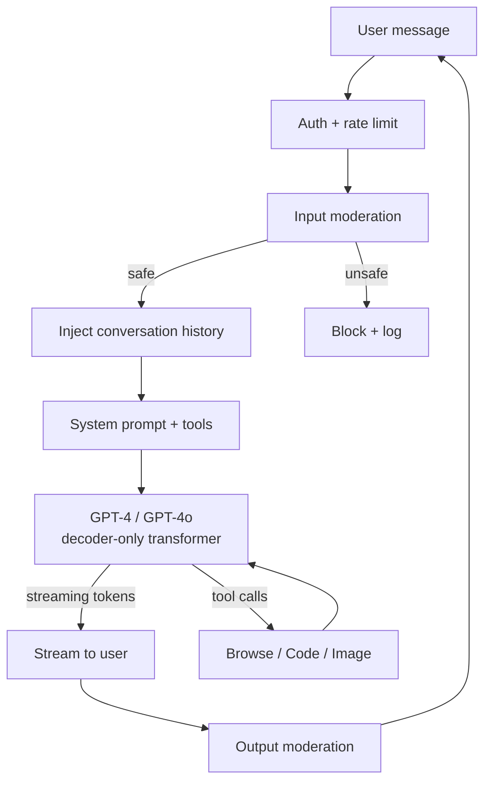
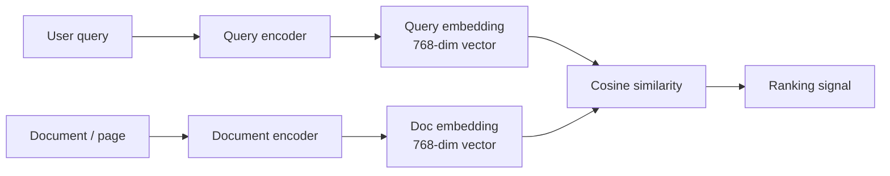
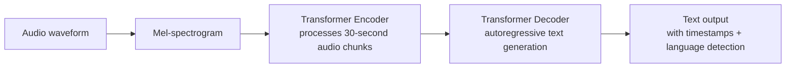
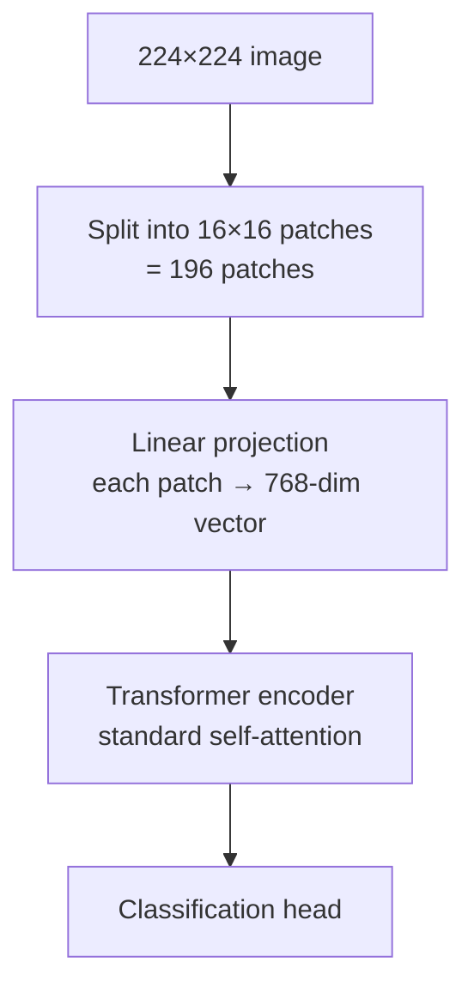

# Transformers — Production Patterns

**ChatGPT, Claude, GPT-4o, BERT in search, GitHub Copilot, Whisper, Vision Transformers. Real architectures, real costs, real production tradeoffs.**

---

## How to Read This Chapter

Each pattern is a real production system, with publicly available technical details. Each illustrates a different way transformers are deployed: chat assistants, search/embeddings, code completion, speech, vision. The point is not to copy any single one — it is to see the full **shape** of transformer-based products in production.

---

## Pattern 1: ChatGPT — Conversational Decoder-Only LLM at Scale

**The problem.** Build a conversational AI that hundreds of millions of users interact with daily. Sub-second response latency. Sustained quality across thousands of domains.

**The architecture.** Decoder-only transformer (GPT family), with extensive RLHF (Reinforcement Learning from Human Feedback) post-training. The ChatGPT product layer adds:

- System prompt that primes the model's persona
- Conversation history management with truncation strategies
- Tool use (browsing, code execution, image generation, file analysis)
- Memory across sessions (post-2024)
- Safety filters (input + output)
- Plugin / GPT customization layer

**Production realities (publicly known):**

- **Inference cost** — token pricing changes frequently across model variants; see `openai.com/pricing` for current rates. Consumer ChatGPT (free tier) is heavily subsidized relative to API token cost.
- **Routing** — different model variants serve different traffic tiers (GPT-3.5 for free users, GPT-4 for plus, custom routing for specific tasks)
- **Latency** — ~1-3 seconds time-to-first-token; streaming hides perceived latency
- **Scale** — billions of conversations / day at peak (2023+)
- **Fine-tuning for the product** — ChatGPT is GPT-4 fine-tuned through RLHF specifically for conversation; the underlying base model is more general

**Lesson.** **The transformer is 30% of the system.** The other 70%: routing, prompt engineering, safety, tool integration, RLHF post-training, conversation management, billing, monitoring. ChatGPT-the-product is a substantial engineering system on top of GPT-the-model.

---

## Pattern 2: Claude — A Different Conversational Approach

**The problem.** Same as ChatGPT — conversational AI at scale — but with different design choices around safety and "Constitutional AI."

**The architecture.** Decoder-only transformer (Claude family). Differentiating features:

- **Constitutional AI** — a training methodology where the model self-critiques outputs against a set of principles
- **Long context** — Claude routinely supports 200K+ token contexts; useful for document analysis
- **Tool use** with structured outputs (function calling)
- Anthropic's specific safety training (different emphasis than OpenAI's)

**Production realities:**

- **Long-context inference is expensive** — KV-cache memory grows linearly with context length (see [System Design](07_System_Design.md))
- **Pricing tiers** — Sonnet for general use, Opus for hardest tasks, Haiku for cost-sensitive. Different parameter counts.
- **Enterprise focus** — Anthropic's positioning emphasizes safety guarantees, indemnification, and enterprise privacy
- **Reasoning models** (Claude 3.7+ "extended thinking") — additional inference compute for harder tasks

**Lesson.** **Different vendors make different tradeoffs.** ChatGPT optimizes for breadth and consumer accessibility; Claude optimizes for long-context understanding and enterprise safety. **For production, evaluate multiple LLMs on your specific task** — performance varies more than benchmarks suggest.

---

## Pattern 3: BERT in Production — Search Ranking and Embeddings

**The problem.** Improve search ranking. When a user types "best italian restaurant near me," return results that match the *intent*, not just keyword overlap.

**The architecture.** Encoder-only transformer (BERT or descendants). For search:

**Production realities:**

- **Google integrated BERT into search ranking in 2019** — affected ~10% of queries
- **Indexing all documents through BERT is expensive** — pre-compute embeddings, store in vector database, query at search time
- **Two-tower architecture** — query and document encoders (often the same weights) produce embeddings independently for fast retrieval
- **Re-ranking** — top candidates from cheap retrieval are re-scored with a more expensive cross-encoder
- **Distilled variants** (DistilBERT, MiniLM) — smaller, faster, used at scale

**Lesson.** **Encoder-only transformers are still alive.** For embeddings, search, and classification at scale, BERT-family models win on cost-per-prediction over decoder-only LLMs. **Don't reach for an LLM when an encoder is sufficient.**

---

## Pattern 4: GitHub Copilot — Code Generation as Inline Completion

**The problem.** Suggest code completions as developers type. Latency under 200ms. Quality high enough to be helpful, not annoying. Privacy-respecting (don't leak code from one user's repo to another).

**The architecture.** Decoder-only transformer fine-tuned on code (Codex initially, then Code Llama / GPT-4 family). The product layer:

- IDE integration (VS Code, JetBrains)
- Context window management — recent edits, current file, related files in the repo
- Latency-optimized inference — small enough to respond quickly, large enough to be useful
- Telemetry for improvement (with privacy controls)

**Production realities:**

- **Median latency 100-200ms** for inline completions
- **Context engineering matters more than model size** — a smaller model with the right context outperforms a larger model with poor context
- **Suggestions are continuously evaluated** — acceptance rate, edit-after-accept rate, time-to-first-keystroke
- **Privacy** — Microsoft / GitHub's contractual guarantees about code data are extensive

**The deeper lesson on context engineering.** GitHub Copilot's "secret sauce" is not the model — it is what context to give the model. Recent edits, current cursor position, signatures from related files, the user's coding style. Getting this right is more impactful than scaling the model.

**Lesson.** **For developer tools, latency dominates.** A 50ms-faster suggestion that is 90% as accurate beats a 500ms-faster suggestion that is 95% as accurate, because users abandon slow suggestions.

---

## Pattern 5: Whisper — Speech-to-Text via Encoder-Decoder

**The problem.** Convert speech to text in 100+ languages. Robust to accents, noise, music. Open source.

**The architecture.** Encoder-decoder transformer. Audio → mel-spectrogram → encoder → decoder generates text autoregressively.

**Production realities:**

- **Released open-source by OpenAI (2022)** — instantly became the standard
- **Trained on 680,000 hours of multilingual audio** — far more diverse than prior STT systems
- **Multiple sizes** — tiny (39M), base (74M), small (244M), medium (769M), large (1.5B). Latency vs accuracy tradeoff.
- **Zero-shot multilingual** — works on languages it never explicitly fine-tuned on
- **Standard production usage** — replaced most legacy speech-to-text APIs in many companies

**Real deployments:**

- **Otter, Rev, Descript** — transcription products built on Whisper or its derivatives
- **Deepgram, AssemblyAI** — commercial STT APIs (often using their own models, but Whisper is the open baseline)
- **Direct in-product** — many companies run Whisper themselves to avoid per-call API costs

**Lesson.** **A well-released open-source model can reset an entire industry.** Whisper made commercial STT pricing visibly inflated overnight. The strategic lesson for any AI product: an open competitor that's "good enough" can disrupt entire pricing models.

---

## Pattern 6: Vision Transformers in Production

**The problem.** Image classification, segmentation, multimodal understanding. Replace CNN-based models with transformer-based ones for higher accuracy.

**The architecture.** ViT (Vision Transformer) splits an image into patches, treats each as a token, applies a standard transformer encoder.

**Production realities:**

- **ViT excels at very large data** — needs 14M+ images to outperform CNNs. Below that scale, ResNet/EfficientNet often win.
- **Massive pretrained models** — DINOv2, CLIP, EVA, MAE — released open-source and used for transfer learning
- **Multimodal foundation** — CLIP (image + text) is the basis for Stable Diffusion, image search, zero-shot classification
- **Hybrid architectures** — many production systems combine CNN front-ends (for cheap spatial features) with transformer back-ends (for global reasoning)

**Real deployments:**

- **Modern image classification** — ViT or DINOv2 backbones, fine-tuned on the task
- **Image search** — CLIP embeddings + vector index
- **Stable Diffusion's text encoder** — CLIP text tower
- **Multimodal LLMs** (GPT-4V, Claude 3+) — vision encoders as front-end to a text-decoder transformer

**Lesson.** **ViT did not kill CNNs.** It complements them. For most production vision tasks, fine-tuning a pretrained ViT or CNN produces similar quality. The choice depends on dataset size, hardware target, and team familiarity. For pretraining at scale, ViT now dominates. See [Computer Vision playbook](../computer-vision/) for more.

---

## Pattern 7: Specialized Reasoning Models

**The problem.** Multi-step reasoning, math, complex coding, scientific problem-solving. Standard chat models often hallucinate or skip steps.

**The architecture.** Standard decoder-only transformer, but with extensive **inference-time compute** — the model is encouraged to "think" via chains of internal reasoning before producing the final answer. Examples: OpenAI o1/o3, DeepSeek-R1, Claude 3.7+ extended thinking.

**What's different:**

- The model produces "thinking tokens" (often hidden from the user) before the final answer
- More inference compute per query (sometimes 10-100x normal)
- Trained with reinforcement learning on reasoning trajectories
- Significantly better at math, coding, and multi-step problems

**Production realities:**

- **Cost** — much higher per query than normal chat models
- **Latency** — can take 30-300 seconds for hard problems
- **Use cases** — research assistance, complex analysis, hard math/coding, agent tasks that require planning
- **NOT for**: short conversational tasks where speed matters

**Lesson.** **Reasoning models are a separate product tier.** Use them when the task genuinely requires multi-step thought. For routine chat, the cost-latency overhead is wasted. The 2026 production pattern: route easy queries to fast models, escalate hard ones to reasoning models — based on query classification or user choice.

---

## Common Threads Across All Seven

| Theme | Manifestation |
|---|---|
| **Pretrained + adapted wins** | Almost no production system pretrains. Fine-tune, prompt, or use-as-API. |
| **Context engineering > model size** | Getting the right context to the model matters more than the model's parameter count |
| **System eng dominates** | Routing, safety, tools, monitoring, A/B testing, prompt evolution — these are 70% of the work |
| **Latency vs cost tradeoffs** | Different models for different tiers (free/paid; fast/quality) |
| **Open vs closed** | Open models (Llama, Mistral, Whisper) are competitive for most tasks; closed models (GPT-4, Claude) win on hardest |
| **Multi-modal is the future** | Vision-language, audio-language are increasingly the default |
| **Reasoning is the new frontier** | o1-style models opened a new tier; standard models below them |

---

## What This Means for Your Project

Order of work for shipping a transformer-based system:

1. **Define the task precisely** — chat, classify, generate, embed, transcribe?
2. **Pick a starting point** — API as-is is the right default for most teams
3. **Prompt-engineer first** — many tasks are solved with no training
4. **Add RAG** if knowledge access is the gap (see [RAG playbook](../rag/))
5. **Fine-tune via LoRA** if quality is still insufficient (see [Building It](05_Building_It.md))
6. **Build the safety / tool layer** — input filtering, output filtering, tool integrations
7. **Plan inference infrastructure** ([System Design](07_System_Design.md)) — KV-cache, batching, vLLM
8. **Plan monitoring** ([Observability](09_Observability_Troubleshooting.md)) — perplexity is not enough; quality requires evaluation harnesses
9. **Plan abuse response** — when (not if) someone misuses the system, what is the kill switch?

The teams that ship reliably do these eight steps in order. Teams that build the model first and figure out the rest later struggle.

---

**Next:** [07 — System Design](07_System_Design.md) — KV-cache, paged attention, vLLM, continuous batching, FlashAttention, latency vs throughput.
