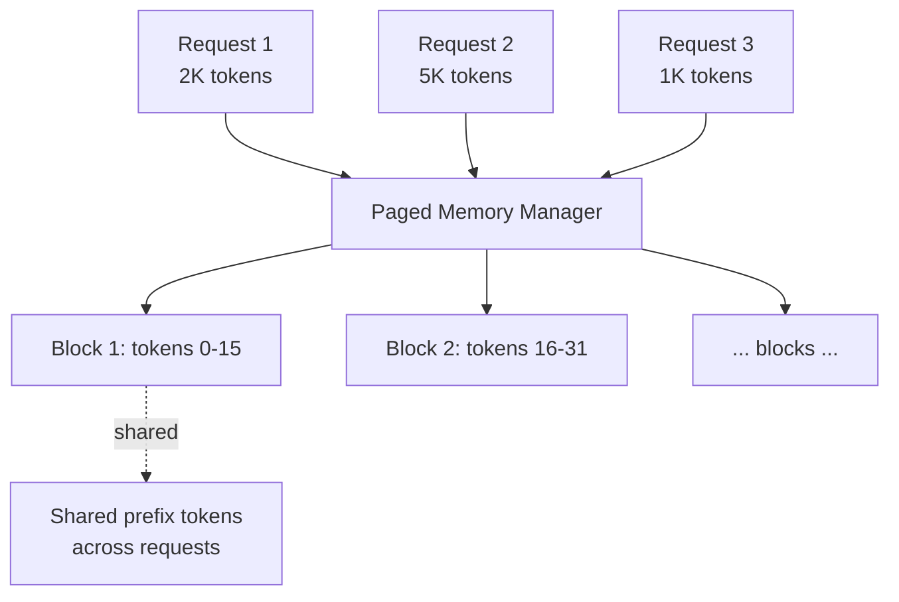
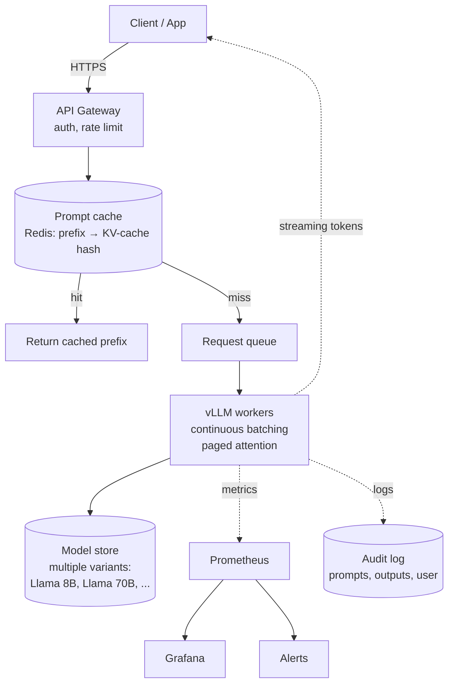

# Transformers — System Design

**KV-cache, paged attention, vLLM, continuous batching, FlashAttention, latency vs throughput. The infrastructure that turns a Transformer checkpoint into a service handling thousands of concurrent users.**

---

## What's Different About Serving Transformers

Compared to other model types:

| Other Models | Transformers (especially decoder-only) |
|---|---|
| Inputs are fixed shape | Inputs are variable-length sequences |
| One forward pass per request | **Many forward passes** for autoregressive generation (one per output token) |
| Memory bounded by model size | Memory grows with sequence length (KV-cache) |
| Static batching works | **Dynamic / continuous batching** essential for throughput |
| Cache by input | Cache the **prefix** (KV-cache reuse) |
| Latency per request | Latency per token + queuing |

The two biggest differences: **autoregressive decoding** (sequential token-by-token generation) and **KV-cache memory pressure** (the cache grows linearly with context length).

---

## KV-Cache — The Single Most Important Optimization

Without optimization, generating each new token re-runs attention over all prior tokens. The cost is `O(N²)` for an N-token sequence.

**KV-cache** stores the keys and values from prior tokens. New tokens compute attention against the cache instead of recomputing.

```
Without KV-cache:
  Token N+1: re-run all of Q, K, V for N+1 tokens. O(N²) total work.

With KV-cache:
  Token N+1: compute Q, K, V for ONLY token N+1. Use cached K, V from prior tokens.
             O(N) work per token, O(N) total during generation.
```

| Configuration | Generate 1024 Tokens (no cache) | Generate 1024 Tokens (KV-cache) |
|---|---|---|
| Compute | O(1024²) ≈ 1M operations | O(1024) ≈ 1K operations |
| Wall-clock | Minutes for a small model | Seconds |
| Memory | Bounded | KV-cache grows with sequence length |

**KV-cache size is significant.** For a 70B model with `d_model = 8192, num_layers = 80, num_kv_heads = 8`:

```
Per token: 80 layers · 8 heads · 128 dim · 2 (K + V) · 2 bytes (BF16)
         = ~325 KB per token

At 4096 context: ~1.3 GB per request just for KV-cache
At 32K context:  ~10 GB per request
```

This is why long-context inference is **memory-bound, not compute-bound**.

---

## Paged Attention — vLLM's Big Idea

Allocating contiguous memory for each request's KV-cache is wasteful — like contiguous memory allocation in operating systems pre-paging. **PagedAttention** (Kwon et al., 2023, the basis of vLLM) breaks the KV-cache into fixed-size pages, allocated on-demand.



**Benefits:**

- **No contiguity requirement** — pages allocated as needed, freed when done
- **Sharing** — multiple requests can share blocks if they have a common prefix (e.g., system prompt). Saves enormous memory at scale.
- **Memory efficiency** — typical 2-4x more requests per GPU than naive serving

vLLM is the de-facto open-source LLM inference server in 2026. For self-hosted LLM deployment at any scale, vLLM is the default.

---

## Continuous Batching

Static batching is bad for LLMs because **output lengths vary**. A request generating 50 tokens blocks the GPU while a parallel request generates 500.

**Continuous batching** (vLLM's other key feature) immediately swaps in a new request when one finishes generating, without waiting for the longest in the batch.

```
Static batching:
  [R1: gen 50] [R2: gen 500] [R3: gen 100]
  Batch waits for R2 to finish (500 tokens) before starting new requests.

Continuous batching:
  [R1: gen 50] → [R4: starts immediately when R1 finishes]
  [R2: still going]
  [R3: gen 100] → [R5: starts when R3 finishes]
  Throughput maximized.
```

Combined with paged attention, continuous batching gives 5-25x throughput vs naive serving in published benchmarks.

---

## FlashAttention

Standard attention computes the full `(N, N)` attention matrix in memory. For long sequences, this is the dominant memory cost.

**FlashAttention** (Dao et al., 2022) computes the same attention output with `O(N)` memory instead of `O(N²)`, by tiling the computation cleverly. It's **not an approximation** — produces exactly the same output as standard attention, just faster and with less memory.

| Sequence Length | Standard Attention Memory | FlashAttention Memory |
|---|---|---|
| 1K | ~4 MB | ~1 MB |
| 4K | ~64 MB | ~4 MB |
| 16K | ~1 GB | ~16 MB |
| 32K | ~4 GB | ~32 MB |

**For long-context training and inference, FlashAttention is mandatory in 2026.** It's built into PyTorch (`scaled_dot_product_attention`), Hugging Face Transformers, vLLM, and most modern stacks.

---

## Inference Servers in 2026

| Server | Best For | Notes |
|---|---|---|
| **vLLM** | Self-hosted LLMs at any scale | Default; PagedAttention + continuous batching |
| **TGI (Text Generation Inference)** | LLM serving, simpler than vLLM | Hugging Face's solution; often easier to deploy |
| **TensorRT-LLM** | Maximum throughput on NVIDIA | Faster than vLLM but harder to use, NVIDIA-locked |
| **NVIDIA Triton + TensorRT-LLM backend** | Multi-model serving | When you need LLMs alongside other models |
| **Llama.cpp** | Edge / consumer GPU / CPU | C++ implementation, GGUF quantization, runs on Mac/iPhone/Android |
| **Ollama** | Easy local LLM serving | Wraps llama.cpp; great for development |
| **SGLang** | Structured output / fast prefix sharing | Good for agents and complex prompting |

For most teams: **vLLM in production, Ollama / llama.cpp on dev**.

---

## Latency vs Throughput Tradeoffs

Two different optimization targets, requiring different infrastructure:

### Latency-Optimized (Interactive Use)

Goal: minimize time-to-first-token (TTFT) and time-per-token (TPT).

| Choice | Latency Impact |
|---|---|
| Smaller model | Lower latency |
| FP16/BF16 over FP32 | 2x faster |
| INT8 quantization | Another 1.5-2x faster |
| INT4 quantization (AWQ, GPTQ) | Another 1.3-2x; small quality cost |
| Dedicated GPU (no multi-tenancy) | Lower variance |
| Streaming output | Hides perceived latency |
| Speculative decoding | 2-3x speedup for "easy" generations |
| Distillation | Smaller student model trained from larger teacher |

**Typical latency targets** (in 2026):
- Time to first token: 200-500ms
- Time per token: 20-50ms (sustained)

### Throughput-Optimized (Batch Use)

Goal: maximize tokens/sec across all concurrent users.

| Choice | Throughput Impact |
|---|---|
| Larger batch sizes | More tokens per forward pass |
| Continuous batching | Major throughput win |
| Paged attention | Memory efficiency → larger batches fit |
| Multi-GPU sharding | More throughput per dollar |
| Tensor parallelism (large models) | Required for >70B models |

For batch use (background processing, evaluation, document analysis), throughput matters more than per-request latency.

---

## Quantization for Inference

Reducing precision is the single biggest cost-reduction lever for transformer inference:

| Format | Memory | Speed | Quality |
|---|---|---|---|
| **FP32** | 100% | 1x | Reference |
| **FP16 / BF16** | 50% | 2x | Negligible loss |
| **INT8 (W8A8)** | 25% | 3-4x | Small loss (~0.5-1%) |
| **INT4 (AWQ, GPTQ)** | ~12% | 4-6x | 1-3% loss; needs careful calibration |
| **INT3 / INT2** | < 10% | Faster but quality drops noticeably | Research only |

For modern open-source LLMs, **INT4 quantization with AWQ or GPTQ is standard**. A 70B model quantized to INT4 fits on a single 24GB consumer GPU.

```python
# Pseudocode using AutoAWQ / similar
from awq import AutoAWQForCausalLM, AutoTokenizer

model = AutoAWQForCausalLM.from_pretrained("path/to/awq_model")
tokenizer = AutoTokenizer.from_pretrained("path/to/awq_model")

# Inference is now ~4x faster, model fits in 1/4 the memory
```

---

## Speculative Decoding

A clever trick: run a small model to generate K tokens at a time speculatively, then verify with the large model in one forward pass. If the large model agrees, all K tokens are accepted; if it disagrees, accept up to the disagreement and continue.

**Effect**: 2-3x speedup for "easy" generations (where the small model often agrees), at no quality loss (the large model's distribution is always preserved).

Used in production at OpenAI, Anthropic, and others. Becoming standard in vLLM and other inference servers.

---

## A Reference Architecture for LLM Serving



**Key design points:**

- **vLLM is the inference server** — paged attention + continuous batching baked in
- **Prompt prefix caching** — if many requests share a system prompt, cache the KV computation for that prefix
- **Streaming output** — Server-Sent Events (SSE) or gRPC streaming to client; user sees first tokens within 500ms
- **Audit logging** — required for compliance, debugging, and abuse response
- **Multiple model sizes** — route by complexity / latency requirement (small = fast, large = high quality)

---

## Cost Economics in 2026

Self-hosted LLM inference costs (approximate, cloud GPU):

| Model | Setup | Tokens/sec/$1 |
|---|---|---|
| Llama 3.1 8B (BF16, A100) | Single GPU | ~150 tokens/sec/$1 |
| Llama 3.1 8B (INT4, T4) | Single GPU, quantized | ~400 tokens/sec/$1 |
| Llama 3.1 70B (INT4, A100) | 4-GPU sharded | ~30 tokens/sec/$1 |
| Llama 3.1 405B (INT4, H100 cluster) | 8-GPU+ | ~5 tokens/sec/$1 |

API pricing (2026 ballpark):

| Provider | Model | Input cost / 1M tokens | Output cost / 1M tokens |
|---|---|---:|---:|
| OpenAI | GPT-4o | $2.50 | $10 |
| OpenAI | GPT-4o-mini | $0.15 | $0.60 |
| Anthropic | Claude Sonnet 4.6 | $3 | $15 |
| Anthropic | Claude Haiku | $0.25 | $1.25 |
| Together AI | Llama 3.1 70B | ~$0.90 | ~$0.90 |
| Self-hosted Llama 70B | INT4 on cloud GPU | ~$0.20 | ~$0.50 |

**Crossover for self-hosting**: roughly 50K-500K queries/day, depending on average tokens. Below that, APIs are cheaper after engineering costs. Above that, self-hosting wins on $/token.

---

## Edge LLM Inference

Modern open models can run on consumer hardware:

| Model | Size on Disk (Q4) | Hardware Floor | Tokens/sec |
|---|---|---|---|
| Llama 3.1 8B Q4 | ~4.5 GB | 8GB Mac, 16GB Linux | 30-60 |
| Phi-3-mini Q4 | ~2.5 GB | 6GB phone, 8GB Mac | 40-100 |
| Liquid LFM2-2.6B | ~1.5 GB | iPhone 14 Pro+ | 30-50 |
| Whisper Large Q5 | ~1.5 GB | M1+ Mac | Real-time |

**Edge LLM tools:**

- **llama.cpp** — C++ inference engine. Foundation for most edge LLM work.
- **MLX (Apple)** — optimized for Apple Silicon. Excellent on Mac.
- **Ollama** — easy desktop inference (wraps llama.cpp)
- **GGUF format** — quantized model file standard
- **WebLLM** — runs LLMs in the browser via WebGPU

For privacy-sensitive applications, on-device LLM is increasingly viable. The Apple Intelligence stack (announced 2024, deployed 2025+) is the most prominent example.

---

## Cost Reduction Tactics

In rough order of impact:

1. **Use a smaller model** — biggest lever; choose a 7B model that's good enough vs a 70B that's marginally better
2. **Quantize to INT4** — 4x memory reduction, 4-6x speedup
3. **Use continuous batching (vLLM)** — 5-25x throughput vs naive
4. **Prompt prefix caching** — 30-80% cost reduction when system prompts repeat
5. **Speculative decoding** — 2-3x speedup
6. **Distillation** — train a small student that matches your specific task quality
7. **Spot / preemptible instances** — 30-60% off cloud GPU costs
8. **Right-size context** — most prompts don't need 128K context; truncate aggressively

A team that does all of these runs at 1/100th the cost of a team using GPT-4 API for everything without optimization.

---

**Next:** [08 — Quality, Security, Governance](08_Quality_Security_Governance.md) — Prompt injection, jailbreaking, hallucination, copyright, EU AI Act, model evaluation.
