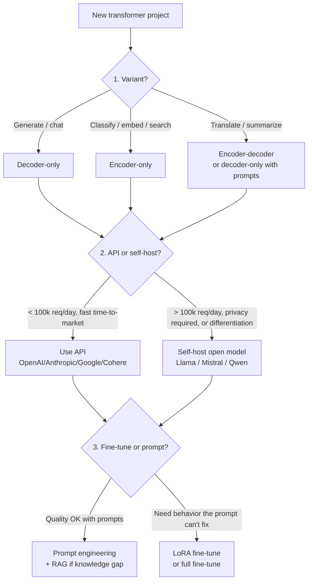
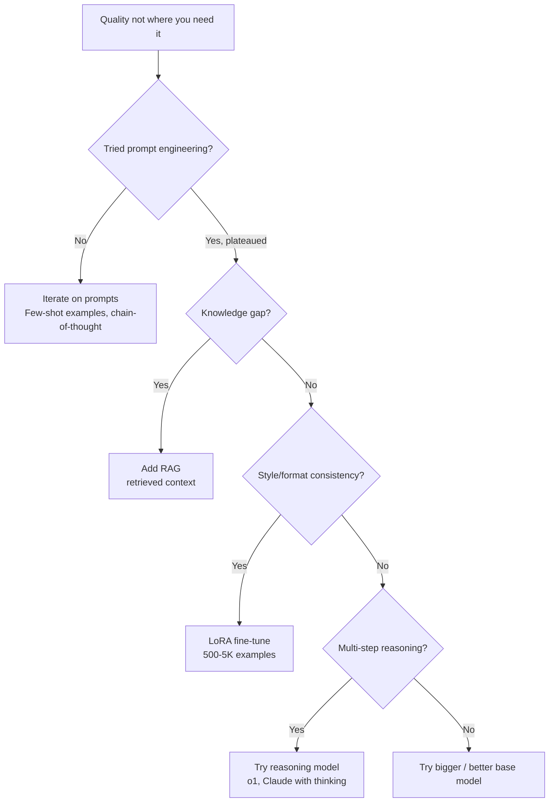

# Transformers — Decision Guide

**"API or self-host?" "Fine-tune or prompt?" "Encoder, decoder, or encoder-decoder?" Decision tables. Production readiness checklist.**

---

## The Three Big Decisions

Most production LLM projects come down to three orthogonal choices:

---

## Decision 1: Which Variant?

| Task | Variant | Real Examples |
|---|---|---|
| **Chat / conversation** | Decoder-only | ChatGPT, Claude.ai |
| **Code completion** | Decoder-only | GitHub Copilot |
| **Text generation / writing** | Decoder-only | Notion AI, Sudowrite |
| **Search ranking / semantic search** | Encoder-only | Google search, vector DBs |
| **Sentence embeddings** | Encoder-only | OpenAI text-embedding-3, Cohere Embed |
| **Classification / NER** | Encoder-only | Spam filters, document classification |
| **Translation** | Encoder-decoder OR decoder-only | Google Translate uses both; LLM-as-translator works well |
| **Summarization** | Encoder-decoder OR decoder-only | Modern systems use decoder-only with prompts |
| **Multimodal (text + image)** | Decoder-only with vision encoder | GPT-4V, Claude 3+, LLaVA |
| **Speech-to-text** | Encoder-decoder | Whisper |
| **Image generation prompts** | Encoder-only as conditioning | Stable Diffusion's text encoder |

**The pattern in 2026**: decoder-only dominates new generation work. Encoder-only persists for embeddings/search. Encoder-decoder is mostly displaced by decoder-only with prompts.

---

## Decision 2: API or Self-Host?

| Volume / Use Case | Recommendation |
|---|---|
| **< 1,000 req/day** | API. Self-hosting is over-engineering. |
| **1,000 - 100,000 req/day** | API for default; self-host if cost matters or privacy requires it |
| **100,000 - 10M req/day** | Lean self-host; API for hardest queries |
| **> 10M req/day** | Self-host required for cost; API only for premium tier |
| **Privacy / compliance constraints** | Self-host required (or use API with strict contractual data terms) |
| **Differentiation through the model** | Self-host + fine-tune; the model is part of your moat |

### When API Wins

- Time-to-market matters (zero infra setup)
- Quality requirements demand the absolute frontier (GPT-4, Claude Opus 4.7, Gemini Ultra)
- Engineering team is small
- Volume is low
- The task is general-purpose enough that frontier models excel

### When Self-Host Wins

- Volume is high (cost crossover above ~50K req/day for many tasks)
- Data cannot leave your network
- Latency requirements are strict (no internet round-trip)
- You need a custom fine-tune that you can iterate on freely
- Vendor lock-in is unacceptable
- The base model is differentiated for your use case (e.g., a code-specialized model)

### Hybrid Patterns (Common)

- **API for premium / hard tasks; self-host for common / easy tasks** — route by complexity
- **API for production; self-host for batch background processing**
- **Self-host the base model; use API for specific premium features**

---

## Decision 3: Fine-Tune or Prompt?

### The Honest Hierarchy

For quality improvement, in order of cost and effort:

1. **Iterate on prompts** ($0, hours) — usually solves 60-80% of issues
2. **Few-shot examples in the prompt** ($0, hours) — solves another 10-15%
3. **Chain-of-thought / step-by-step prompting** ($0, hours) — for reasoning tasks
4. **Add RAG** ($100-500, days) — if the model needs knowledge you can retrieve
5. **LoRA fine-tune** ($100-1000, days) — for stylistic / format consistency
6. **Switch to a bigger / better model** (variable) — if quality fundamentally requires it
7. **Reasoning model** (10x cost) — for multi-step problems
8. **Full fine-tune** ($1K-10K, weeks) — rarely necessary outside research
9. **Pretrain from scratch** ($1M+, months) — almost never the right answer

**The rule**: don't escalate before exhausting the previous step. Most projects that "need fine-tuning" actually have prompt-engineering room left.

---

## Build vs Buy — Total Decision Matrix

| Volume | Privacy | Quality Bar | Recommendation |
|---|---|---|---|
| Low | None | Standard | **API** (OpenAI/Anthropic/Google) |
| Low | Strict | Standard | **API with strict data terms** OR small self-host |
| Low | None | Frontier | **API** (GPT-4 / Claude Opus / Gemini Ultra) |
| Medium | None | Standard | **API** for now; plan self-host migration |
| Medium | Strict | Standard | **Self-host open model** (Llama, Mistral, Qwen) |
| Medium | None | Frontier | **API for premium tier**, self-host for bulk |
| High | None | Standard | **Self-host** (cost) |
| High | Strict | Any | **Self-host required** |
| High | None | Frontier | **Hybrid**: self-host bulk, API for hardest |

---

## Production Readiness Checklist

### Model Choice
| ✓ | Item |
|---|---|
| ☐ | Variant matches task (encoder/decoder/encoder-decoder) |
| ☐ | Model size justified by quality vs cost analysis |
| ☐ | API vs self-host decision documented |
| ☐ | Fine-tune vs prompt decision tested empirically |

### Infrastructure
| ✓ | Item |
|---|---|
| ☐ | Inference server chosen (vLLM, TGI, API) |
| ☐ | KV-cache memory budget sized |
| ☐ | Continuous batching enabled (if self-hosted) |
| ☐ | Quantization considered (INT4 / INT8 / BF16) |
| ☐ | Latency budget met (TTFT, TPT) |
| ☐ | Throughput tested at expected concurrency |
| ☐ | Cost per request calculated and validated |
| ☐ | Failover / scaling plan documented |

### Quality
| ✓ | Item |
|---|---|
| ☐ | Eval suite (50-500 examples) passes |
| ☐ | LLM-as-judge baseline established |
| ☐ | Human evaluation baseline (100+ samples) collected |
| ☐ | Hallucination detection / mitigation in place |
| ☐ | RAG enabled if knowledge access is needed |
| ☐ | Output structure / format reliability verified |

### Safety / Governance
| ✓ | Item |
|---|---|
| ☐ | Prompt injection threat model documented |
| ☐ | Input filter (banned patterns, classifier) deployed |
| ☐ | Output filter (toxicity, PII, copyright) deployed |
| ☐ | Tool-use confirmation flows for sensitive tools |
| ☐ | Audit log: prompts, outputs, user, model version |
| ☐ | EU AI Act / regulatory review completed |
| ☐ | Privacy review (data residency, retention, consent) |
| ☐ | Indemnification policy (B2B) |
| ☐ | Transparency notice ("AI-generated") where required |
| ☐ | Abuse response runbook |

### Operations
| ✓ | Item |
|---|---|
| ☐ | Monitoring dashboard live (latency, quality, cost, safety) |
| ☐ | Alerts on quality drops, cost spikes, abuse patterns |
| ☐ | A/B testing infrastructure for model upgrades |
| ☐ | Rollback plan tested |
| ☐ | On-call team trained |
| ☐ | Failure-capture pipeline for retraining |

If you cannot check most items, you are not ready. **LLM products fail publicly** — every wrong output can be screenshot and shared.

---

## Cost Estimation Framework

For a typical B2B LLM product (e.g., a customer support assistant):

### Initial Build (One-Time)

| Item | Typical Cost / Hours |
|---|---|
| Prompt engineering + system design | 80-160 hours |
| RAG indexing infrastructure (if needed) | 80-120 hours |
| Fine-tuning experiments (if needed) | 40-200 hours + $100-2K compute |
| Safety pipeline (input/output filters) | 80-160 hours |
| Monitoring + observability | 80-120 hours |
| Regulatory / legal review | 40-200 hours |

### Ongoing (Per Year)

| Item | Typical Cost |
|---|---|
| Inference (API) | Volume × $1-10 / 1M tokens (input + output) |
| Inference (self-hosted) | Volume × $0.1-1 / 1M tokens (smaller crossover) |
| Continuous evaluation | $1-5K / month for LLM-as-judge sampling |
| Embedding storage (RAG) | $100-1K / month for vector DB |
| Engineering on-call | 0.2-0.5 FTE |

### TCO Example

A B2B chatbot at 100K queries/day, average 500 input + 300 output tokens:

| Phase | Cost |
|---|---|
| Year 1 build | ~$300K engineering + $30K compute + $20K legal |
| Year 1 ongoing (API: GPT-4o-mini) | ~$10K/month inference + $5K/month other |
| Year 1 ongoing (self-host Llama 8B INT4) | ~$2K/month compute + $5K/month other |
| Year 2+ ongoing (self-host) | ~$80K all-in |

For a SaaS at $100/seat/month with 1000 customers, breakeven on operating costs is trivial. The engineering investment is the gate.

---

## When to Stop and Reconsider

| Signal | What to Do |
|---|---|
| Quality plateaus after weeks of prompt iteration | Try fine-tuning OR larger model — prompt budget exhausted |
| API costs growing unsustainably | Self-host or distill to smaller model |
| Hallucinations frequent and material | Switch to reasoning model OR add stricter RAG with citations |
| Users routinely ask questions the model declines | System prompt too restrictive, OR genuine safety boundary; assess |
| Per-task quality varies wildly | Domain-specific fine-tune OR routing per task type |
| Latency target unmet | Smaller model, distillation, quantization, dedicated GPU |
| Stakeholder says "the model needs to be 100% reliable" | False requirement. Reframe: define acceptable failure rate |
| Many users reporting offensive/harmful content | Tighten filters; this is a fire |

---

## The Transformer-Engineer Mindset

The mental model that distinguishes engineers who ship reliably:

| Mindset | What It Looks Like |
|---|---|
| **Quality is partly subjective** | Combine quantitative + LLM-judge + human eval |
| **Prompt engineering is the first lever** | Don't fine-tune until prompts are exhausted |
| **Context engineering matters more than model size** | The right context to a 7B model often beats a poorly-prompted 70B |
| **Plan for abuse from day 1** | Audit logs, safety filters, rate limits |
| **Costs scale with output length** | Encourage concise outputs; cache aggressively |
| **Hallucinations are the default** | Use RAG, tools, structure to suppress them |
| **Vendor APIs change silently** | Monitor for quality drift on every endpoint |
| **Open models are a hedge** | Even if you use APIs, validate that an open alternative exists |
| **Eval is hard but mandatory** | Build the evaluation infrastructure before you need it |

---

## What's Next

This playbook covered transformer architecture. The deeper material:

| Doc | When to Read |
|---|---|
| [`architectures/transformer.md`](architectures/transformer.md) | Single-doc reference covering embeddings, attention math, multi-head, encoder/decoder blocks, three variants |

And the sibling playbooks:

- [Deep Learning](../deep-learning/) — neural network foundations
- [Sequence Models](../sequence-models/) — RNN/LSTM (the predecessors)
- [RAG](../rag/) — retrieval-augmented generation patterns
- [Agents](../agents/) — autonomous AI systems built on transformers
- [Computer Vision](../computer-vision/) — Vision Transformers, multimodal
- [NLP](../nlp/) (coming) — task-domain entry point for NLP

---

**Where you started:** [01 — Why](01_Why.md). Read backwards from here to revisit any concept.

**Hands-on companion:** [Transformer From Scratch on Colab](https://colab.research.google.com/github/sunilmogadati/systems-in-production/blob/main/implementation/notebooks/Transformer_From_Scratch.ipynb) — self-attention computed by hand: Q/K/V projection, scaled dot-product, multi-head split. Verified against PyTorch.
