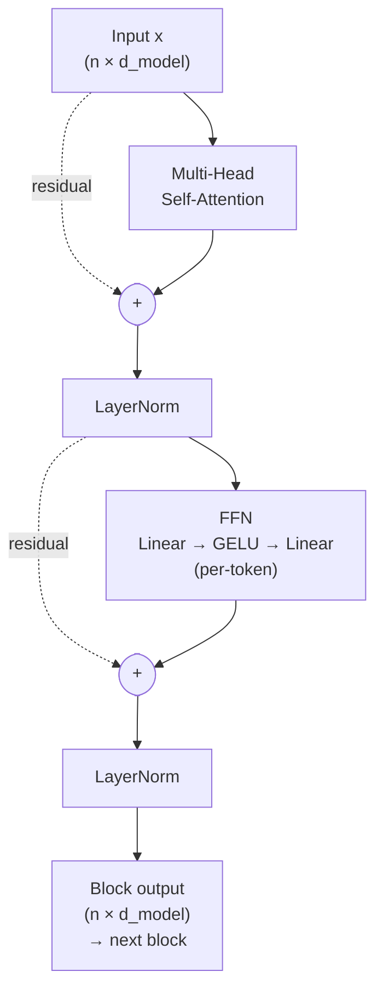
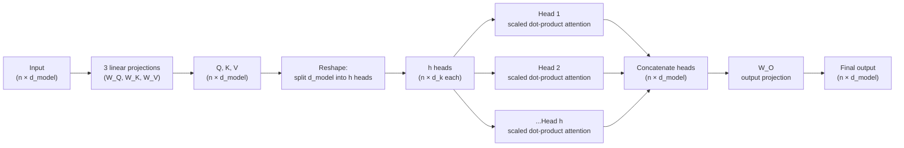

# Embeddings, Attention, and Transformers

This reference covers embeddings, attention, self-attention, and the transformer architecture. Section 1 presents the concepts and architecture. Section 2 contains the implementation in code. Section 3 contains the mathematical formulations and parameter counts. Section 4 organizes the material as common questions and answers.

---

# Section 1 — Concepts and Architecture

### Section 1 mini-glossary

A handful of terms recur throughout this section. They are defined here once so the prose can stay readable.

- **GPU** — graphics processing unit. Parallel-math chip originally built for graphics, now the default hardware for neural network training.
- **TPU** — tensor processing unit. Google's custom chip built for neural network math.
- **Parallel matrix multiplication** — computing many entries of a matrix product at once on parallel hardware, instead of one entry at a time.
- **Dot product** — multiply matching entries of two vectors and sum the results; yields a single number reflecting alignment between the two vectors.
- **Projection** — multiplying a vector by a learned matrix to map it into a new space.

## 1.1 The problem of representing words

A neural network is a function from numbers to numbers. It cannot consume the string `"cat"` directly; before any learning can happen, the input must be converted into vectors of real numbers. The first step of every language model is therefore **tokenization** — the process of splitting a stream of text into discrete units called tokens. A token is sometimes a whole word, sometimes a subword piece, sometimes a single character. Modern systems like BERT and GPT use subword tokenization, where common stems and suffixes are kept as separate units (the word `"running"` becomes the two tokens `"run"` and `"##ning"`). Subword tokenization keeps the **vocabulary** — the fixed set of distinct tokens the model knows — manageable at around 30,000 to 50,000 entries, while still letting the model handle rare or new words by composing them from familiar pieces.

Once the text has been split into tokens, each token must be mapped to a vector. The most naive way to do this is **one-hot encoding**, in which the vocabulary of size *V* is converted into vectors of length *V* where the slot corresponding to the chosen token holds a 1 and every other slot holds a 0. A vocabulary of 50,000 words yields 50,000-dimensional vectors that are 49,999 zeros and one solitary 1. Two problems make this representation unusable in practice. First, the vectors are absurdly sparse and expensive to store and multiply. Second, and more important, one-hot vectors carry no notion of similarity. The vectors for `"cat"` and `"dog"` are exactly as different from each other as the vectors for `"cat"` and `"airplane"` — every pair of distinct one-hot vectors has the same Euclidean distance and the same (zero) dot product. The geometry contains no information that could be useful for a downstream model trying to generalize.

## 1.2 The embedding solution

The fix is the **word embedding**, a learned dense vector for each word in the vocabulary, where similar words end up with similar vectors. Instead of allocating one dimension per word, the model maps every token to a fixed-size vector — typically 100 to 1,024 numbers — and learns the entries of those vectors during training. Concretely, the embedding is a learnable lookup table: a matrix of shape *(vocabulary size, embedding dimension)* in which row *i* is the vector for the *i*-th token. To embed a token, the network looks up its row. Because the matrix is just another parameter of the model, gradient descent shapes its rows so that words used in similar ways end up near each other in the vector space. After training, the vector for `"king"` lies close to the vector for `"queen"`, the vector for `"cat"` lies close to the vector for `"dog"`, and the vectors for unrelated words (`"table"` and `"river"`, say) point in essentially unrelated directions. Distance in embedding space corresponds, roughly, to semantic distance.

**Three senses of "embedding" — pinned down once.** The word "embedding" gets used three different ways in this material; the rest of the document uses the labeled forms when ambiguous.
- *Token embedding* — the dense vector representing a single token (one row of the lookup table).
- *Embedding layer* — the learnable lookup table itself (the full matrix).
- *Contextual embedding* — the output of a transformer layer for one token; a token embedding refined by attention so that its meaning depends on the surrounding context.

Early embedding methods like **Word2Vec** (Google's predict-from-context training method) and **GloVe** (Stanford's matrix-factorization-on-co-occurrence method) produced *static embeddings* (one fixed vector per word, regardless of sentence): a single fixed vector per word, computed once and used everywhere. Static embeddings were a gigantic step up from one-hot vectors and powered an entire generation of NLP systems. But they have a hard limitation that took a few years to fully appreciate.

## 1.3 Why static embeddings aren't enough

The English word `"bank"` means very different things in `"river bank"` and `"savings bank"`. A static embedding gives `"bank"` exactly one vector regardless of which sentence it appears in, which means the surrounding words `"river"` versus `"savings"` cannot bend the meaning of `"bank"` itself. We need representations that depend on the surrounding context — vectors that are computed on the fly from the entire sentence rather than read out of a frozen lookup table. A **contextual embedding** is exactly this: a vector for a token that is produced by looking at the token *and* its neighbors together, so that `"bank"` next to `"river"` gets a different vector than `"bank"` next to `"savings"`. Producing high-quality contextual embeddings is the central job of every modern transformer.

## 1.4 What RNN and LSTM did, and where they hit a wall

The first serious attempts at contextual representations used recurrent neural networks. A recurrent neural network (RNN) and its more sophisticated cousin the long short-term memory network (LSTM), covered in the companion RNN/LSTM document, read a sequence one token at a time and maintain a running summary in a *hidden state*. At step *t*, the network combines the new token's embedding with the hidden state carried over from step *t-1* to produce a fresh hidden state. By the time the network reaches the end of the sequence, the hidden state encodes — in principle — everything seen so far.

Two problems prevented recurrent networks from scaling. The first is **sequential computation**. To compute the hidden state at position 100, the network must first compute positions 1 through 99 in strict order; no step can be skipped, because each step's input depends on the previous step's output. Modern accelerators (GPUs and TPUs — see glossary) are built to perform massive parallel matrix multiplications, and a strictly sequential operation leaves most of that hardware idle. Training a single LSTM on a 1,000-token document requires 1,000 sequential steps — slow, and worse, the slowness *does not go away* with more hardware. The second problem is **long-range dependency degradation**. Even with the LSTM's clever cell-state highway, signals from token 1 must squeeze through hundreds of gating operations to influence the prediction at token 1,000. Information leaks. Gradients shrink. Long-range coreference (`"the cat... it..."` across many intervening clauses) becomes unreliable. There is also an **encoder-decoder bottleneck** specific to RNN-based machine translation: the encoder compresses the entire source sentence into a single fixed-size context vector, and the decoder must generate the translation from that one bottleneck — a brutal compression that loses information for long sentences.

By 2016 it was clear that something better was needed.

## 1.5 The attention idea

The breakthrough was **attention**, a mechanism that lets each position in a sequence look directly at every other position and decide how much each one matters. Instead of forcing information to flow through a long chain of recurrent updates, attention computes, in one parallel step, a score for every pair of positions and uses those scores to mix information across the whole sequence at once. The 2017 paper *Attention Is All You Need* by Vaswani and colleagues showed a surprising result: a sufficiently powerful attention mechanism removes the need for recurrence entirely. The RNN can be discarded. Attention alone — applied repeatedly in a stack of layers — produces better contextual representations than any LSTM, trains far faster because every position is processed in parallel, and scales gracefully to enormous data and model sizes.

The single sentence to take away is this: a transformer lets every token look directly at every other token, decide what matters, and build a context-aware meaning in parallel.

## 1.6 Q, K, V — the three roles

To make attention work, each token plays three different roles, and the model learns three different ways of representing the same input. A clean analogy is a library search. A patron arrives with a **query** (a question — what is being looked for). Each book on the shelf has a **key** (a catalog entry that advertises what the book is about). When a query matches a key well, the patron reads the book and extracts its **value** (the actual content the book delivers). Attention runs that same protocol over the tokens of a sentence. For each token, the model computes a query vector that says *"what am I looking for?"*, a key vector that says *"what do I represent?"*, and a value vector that says *"what should I contribute when attended to?"*. The query of one token is matched against the keys of every token; the matches determine which values get blended into the output. The three roles in shorthand: **query asks, key advertises, value delivers**.

Mechanically, the three roles are produced by three different learned weight matrices applied to the input embeddings. The same input embedding gets projected three times — once into a query vector, once into a key vector, once into a value vector. The three projections are learned independently so each can specialize: the query matrix learns to highlight features that make a token a *good asker*, the key matrix learns to highlight features that make a token *easy to find*, and the value matrix learns to highlight features that should *propagate* if the token is attended to.

## 1.7 Self-attention, step by step

Putting Q, K, and V together, **self-attention** — the variant of attention used inside a transformer where queries, keys, and values all come from the *same* sequence — proceeds in five steps. First, for every pair of tokens (*i*, *j*), the model computes a *similarity score* by taking the dot product of token *i*'s query with token *j*'s key. A high score means token *i*'s query is well-matched to token *j*'s key, which means token *j* is worth attending to from *i*'s perspective. Second, the model divides each score by a fixed scaling factor (discussed in detail below). Third, the scaled scores for token *i* are passed through the **softmax** function — a function that takes a vector of arbitrary real numbers and turns it into a probability distribution by exponentiating each entry and dividing by the sum of the exponentials, so that the resulting numbers are non-negative and sum to one. Fourth, those probabilities are used as weights to take a weighted average of the value vectors of every token. Fifth, the resulting blended vector becomes the new representation for token *i*. The output is a new sequence the same length as the input, where each position has been enriched with information drawn from every other position in proportion to how relevant they were.

Notice what self-attention does *not* do. It does not pass information through a chain of time steps. It does not compute things one token at a time. Every token's new representation is computed in parallel, in a single round of matrix multiplications, and every token has direct access to every other token through exactly one round of multiplication.

## 1.8 Why scale by the square root of d_k

The scaling step in attention has a specific purpose. When the key and query vectors live in a high-dimensional space, the dot product of two random vectors of dimension *d_k* has a standard deviation that grows like the square root of *d_k*. For a per-head dimension of 64, raw dot products have a standard deviation of about 8 — comfortably large in absolute terms. When numbers that large are fed into softmax, the function saturates: one entry becomes nearly 1 and all the others nearly 0, because softmax is exponential and exponentiation amplifies large gaps. In the saturated regime, the gradient of softmax is essentially zero, which means no learning signal flows back through the attention weights and the model cannot improve. Dividing the scores by the square root of *d_k* before the softmax brings the variance back to roughly 1 regardless of dimension, keeping softmax in a useful range and gradients flowing. In one sentence: **scaling prevents softmax saturation**.

## 1.9 Multi-head attention

A single attention computation, no matter how big, can only learn one *kind* of relationship at a time — its query and key matrices have to settle on one set of features that mark "what to look for." But language has many simultaneous structures: subjects pair with verbs, pronouns pair with their antecedents, modifiers pair with what they modify, and so on. **Multi-head attention** is the mechanism that lets the model learn many of these at once. Instead of running one big attention computation over the full embedding dimension, the model splits the dimension into several smaller pieces — eight in the original Transformer, twelve in BERT-base, more in larger models — and runs an independent attention computation in each piece. Each piece is called an **attention head**, with its own query, key, and value projections. Different heads can specialize: one head might attend to the immediately preceding token (a syntactic neighbor), another might attend to the most semantically similar token elsewhere in the sentence (a semantic match), another might attend to the closest pronoun-antecedent pair. After every head has produced its own output, the outputs are concatenated end to end and passed through one final learned projection (called *W_O*) that combines the heads' contributions back into a single vector of the original dimension. The *Q/K/V* parameter count is the same as a single full-dimension attention block — the per-head projections are just slices of the same total budget — and multi-head additionally has the *W_O* output-projection matrix, giving a total of $4 d_{\text{model}}^2$ parameters. The expressive power is much greater than a single attention head because the model gets multiple parallel "views" of the same sequence.

## 1.10 The position problem and positional encoding

Self-attention has a property that is at first surprising: it is **permutation-invariant**. Shuffling the tokens of the input sequence and then running self-attention produces the same sequence of output vectors as before, just shuffled the same way. Nothing inside the attention computation depends on the order in which the tokens appear — every pairwise score is computed independently of the others, and there is no notion of "earlier" or "later" baked into the equations. This is unacceptable for language. The sentences `"dog bites man"` and `"man bites dog"` consist of the same multiset of tokens but mean very different things; a model with no sense of order cannot tell them apart.

The fix is **positional encoding**: a vector that depends on a token's position in the sequence, added to the token's embedding before self-attention sees it. Each position in the sequence gets a unique vector (position 0 gets one vector, position 1 gets a different vector, etc.), and that vector is summed element-wise with the token's word embedding. The combined input to the first attention layer therefore carries both the *identity* of the token and a fingerprint of *where* it sits, and the network can learn to use both. The original Transformer paper used a fixed pattern of sine and cosine waves at varying frequencies — different dimensions of the position vector oscillate at different rates, so each absolute position has a unique signature and pairs of nearby positions have similar signatures. Modern transformers replace sinusoidal encodings (sine/cosine-based, fixed not learned) with learned positional embeddings (a trainable vector per position, BERT, GPT-2), rotary positional embeddings (RoPE — rotates query/key vectors by an angle that depends on position, used by Llama), or attention-bias schemes (ALiBi — adds a distance-based penalty directly to attention scores). All of them solve the same problem: telling the otherwise order-blind attention mechanism where each token sits.

## 1.11 The encoder block

A **transformer encoder block** is the basic building unit of an encoder-only model like BERT. Each block consists of two sub-blocks stacked one after the other. The first sub-block is multi-head self-attention, which mixes information across tokens. The second sub-block is a **position-wise feed-forward network** (FFN) — two linear layers with a nonlinearity (originally ReLU — rectified linear unit, the function max(0, x); more commonly GELU — Gaussian error linear unit, a smoother version of ReLU, in modern variants) between them, applied independently to each token's vector. The FFN does not mix information across tokens at all; it transforms each token's representation in isolation. The two sub-blocks divide the labor cleanly: attention shuffles information *between* tokens, the FFN reshapes the information *within* each token. The FFN is also where most of the parameters live — its inner layer is typically four times wider than the model dimension, so an FFN sub-block carries about twice the parameter count of an attention sub-block.

Each sub-block is wrapped in two stabilization mechanisms. The first is a **residual connection** — the input to the sub-block is added to its output, so the sub-block only has to learn a *delta* on top of its input rather than a full new representation. Residuals provide a direct path for gradients to flow from the top of the network back to the input, without having to squeeze through every sub-block in series. They also let early-training sub-blocks fall back to the identity if they haven't learned anything useful yet. The second is **LayerNorm**, a normalization that operates per-token across the feature dimension — it computes the mean and standard deviation of one token's vector (across its features) and rescales that token to have zero mean and unit variance, then applies a learned scale and shift. LayerNorm is distinct from BatchNorm, which normalizes across the batch dimension (per feature, across the batch). For sequence models LayerNorm is the right choice because sequences in a batch have variable lengths, BatchNorm's batch statistics are unstable in that regime, and LayerNorm's per-token statistics don't depend on other tokens or on batch size at all. A transformer encoder is a stack of *N* such blocks; the original paper used *N* = 6, BERT-base uses 12, GPT-3 uses 96.



**Post-LN vs Pre-LN.** The diagram above shows *post-LN*, where LayerNorm is applied *after* the residual addition (`LayerNorm(x + Sublayer(x))`). This is the original 2017 design. Modern transformers (GPT-2 onward, Llama, Mistral, etc.) use *pre-LN*, where LayerNorm is applied *before* the sub-block on the residual branch (`x + Sublayer(LayerNorm(x))`). Pre-LN is more stable for deep stacks because the residual stream is never normalized away — gradients flow cleanly from the loss back to the input embedding. The two designs are not interchangeable: pre-LN typically does not need a learning-rate warmup, while post-LN does.

## 1.12 The decoder block and masking

A **decoder** block has the same general shape as an encoder block but with two important differences. First, its self-attention is **masked**: each position is prevented from looking at any position later than itself in the sequence. The mechanism is a **causal mask**, an upper-triangular pattern added to the raw attention scores that pushes the scores for "future" positions to a very large negative number; after softmax those positions get essentially zero weight, so no information from future tokens can leak into the current token's representation. Causal masking is necessary because at *generation* time the future tokens don't exist yet — the model is producing them one at a time — so the model must learn to predict each token using only what came before. Second, in encoder-decoder models the decoder block contains a third sub-block sandwiched between its masked self-attention and its feed-forward network: a **cross-attention** sub-block in which the queries come from the decoder (the partial output sequence being generated) and the keys and values come from the encoder's final output (the source sequence being conditioned on). Cross-attention is how a translation model lets each output token look back at the source sentence to decide what to produce next — it solves the encoder-decoder bottleneck that crippled RNN-based translation systems.

## 1.13 Three architecture variants

Transformers are deployed in three main configurations, each suited to a different family of tasks.

The **encoder-only** variant — the BERT family — uses only encoder blocks and applies bidirectional self-attention, meaning every token attends to every other token in the sequence (both directions, no masking). Encoder-only models are trained with objectives like masked language modeling (predict words that have been hidden in the input), and they're used for tasks where the full input is available up front and the goal is *understanding*: text classification, named entity recognition, question answering over a passage. Famous examples include BERT, RoBERTa, and DistilBERT.

The **decoder-only** variant — the GPT family — uses only decoder blocks with causal masking, so each token attends only to itself and the tokens before it. Decoder-only models are trained with next-token prediction (given the sequence so far, predict what comes next) and are used for *generation*: chat, completion, code generation. They produce text one token at a time by repeatedly predicting the next token, sampling from the resulting probability distribution, appending the sampled token to the sequence, and predicting again. Famous examples include GPT-2, GPT-3, GPT-4, Llama, Mistral, and Claude.

The **encoder-decoder** variant — the original Transformer, T5 (Google's text-to-text transformer), BART (Facebook's denoising encoder-decoder for generation tasks) — pairs an encoder (bidirectional, processing the source) with a decoder (causal self-attention plus cross-attention into the encoder's output). This configuration is used for sequence-to-sequence tasks where one full sequence must be transformed into another: translation (English to French), summarization (long document to short summary), text-to-text tasks of all kinds.

## 1.14 Why transformers replaced RNNs

Transformers won the language modeling competition for three concrete reasons. First, **parallelism in training**: every position in the sequence is processed in the same matrix multiplication, with no sequential dependencies, so the entire forward pass can saturate a modern GPU. RNNs cannot. Second, **direct long-range access**: any two tokens, no matter how far apart, are connected by a single attention computation — there is no decay of information with distance, no repeated multiplication by gating values. RNNs decay over time. Third, **better scaling properties**: transformer performance keeps improving as data, parameters, and compute are scaled up, in a way that has held remarkably consistent from BERT-base (110M parameters) through GPT-4 and beyond. RNNs hit a ceiling much earlier. Together these three advantages explain why every state-of-the-art language model since 2018 — and every multi-billion-parameter system in wide use — is a transformer.

## 1.15 The multi-head split, visualized



The picture is the same as the prose: project, split, run attention per head in parallel, concatenate, project once more. Each head sees a smaller slice of the total dimension and learns its own kind of pattern; the output projection at the end is what mixes the heads back together. Because the per-head dimension equals the model dimension divided by the number of heads, the *Q/K/V* parameter count is the same as a single full-dimension attention block; the *W_O* output projection adds one more $d^2$ matrix, giving the total $4 d^2$ summarized in Section 3. Multi-head is therefore strictly more expressive than single-head at essentially the same parameter cost.

## 1.16 Connections to matrix multiplication and parameter counting

Several pieces of mental machinery from convolutional networks transfer directly. Matrix-multiplication shape arithmetic is the same — the rule that an *(m, k)* matrix times a *(k, n)* matrix produces an *(m, n)* matrix is exactly what determines every shape in the attention pipeline. Parameter counting is the same — count the entries in each weight matrix and add them up — so the same method that answers "how many parameters in this convolutional layer?" answers "how many parameters in this multi-head attention layer?" (Section 3 has the formulas, but the *method* is unchanged.) The reasoning about *why convolutional layers have fewer weights than fully-connected layers* generalizes too: weight sharing is the key. In a convolution, the same kernel is reused at every spatial position. In multi-head attention, the same Q, K, V projection matrices are reused at every token position; the parameter count depends on the model dimension, not on the sequence length. Compute and memory depend on sequence length; parameter count does not. This is a common point of confusion — getting it right is a matter of remembering which axis the parameters sit on and which axis the work scales with.

---

# Section 2 — Code

This section contains the Python and PyTorch implementations. Each block has inline comments explaining what each line does and why. Section 1 covers the conceptual intuition, Section 3 covers the math, and this section covers the implementation.

---

## 2.1 Scaled dot-product attention — full code walkthrough

This is the canonical attention implementation. It is the single most important code pattern in modern language models — every transformer-based system (ChatGPT, Claude, Gemini, BERT, GPT-3/4) uses some variant.

**What this does:** This function takes three matrices (queries, keys, values) and produces, for each query, a blended summary built from the values — weighted by how well that query matches each key. It is the entire five-step recipe (score, scale, mask, softmax, weighted sum) wrapped in one function. This is the executable form of the five-step procedure described in Section 1.7, with the scaling step justified in Section 1.8 and the optional mask drawn from Section 1.12.

**Step-by-step theory mapping (read alongside the code below):**
- `Q @ K.transpose(-2, -1)` is the dot-product similarity between every query and every key — `transpose` flips a matrix's rows and columns so the matrix multiply lines up — the core of self-attention from Section 1.7. A high entry says "this query matches this key well."
- `/ math.sqrt(d_k)` is the scaling step from Section 1.8 — without it, large dot products would push softmax into saturation and gradients would vanish.
- `scores.masked_fill(mask == 0, float('-inf'))` is the causal mask from Section 1.12 — pushing future-position scores to negative infinity makes them zero after softmax, so no information leaks from future tokens.
- `F.softmax(scores, dim=-1)` is the probability-distribution step from Section 1.7 — it turns raw similarity scores into non-negative weights that sum to 1 across keys.
- `attention_weights @ V` is the weighted-sum-of-values step from Section 1.7 — each query's output is a blend of the value vectors, weighted by how much attention that query paid to each key.

```python
import torch
import torch.nn as nn
import torch.nn.functional as F
import math


# ============================================================
# CORE: Scaled Dot-Product Attention
# ============================================================
def scaled_dot_product_attention(Q, K, V, mask=None):
    """
    The fundamental attention operation.

    Args:
        Q: (n_q, d_k) — queries (one row per "asking" token)
        K: (n_k, d_k) — keys (one row per "potentially attended-to" token)
        V: (n_k, d_v) — values (one row per "potentially attended-to" token)
        mask: optional, for causal/decoder attention

    Returns:
        output: (n_q, d_v) — context-aware representation per query
    """
    d_k = Q.shape[-1]
    # WHAT: d_k is the dimension of each query/key vector.
    # WHY: We need this for scaling. For BERT-base, d_k = 64.

    # ============================================================
    # Step 1: Compute attention scores
    # ============================================================
    scores = Q @ K.transpose(-2, -1)
    # WHAT: Q @ K^T computes pairwise dot products.
    # Shapes: (n_q, d_k) × (d_k, n_k) = (n_q, n_k)
    # Each entry scores[i, j] = "how similar is query i to key j?"
    # WHY .transpose(-2, -1) instead of .T:
    # In batched cases we may have additional dimensions (batch, head).
    # The -2/-1 means "transpose the last two dimensions",
    # which is exactly what we want regardless of tensor rank.

    # ============================================================
    # Step 2: SCALE by sqrt(d_k) — the central design choice
    # ============================================================
    scores = scores / math.sqrt(d_k)
    # WHY divide by sqrt(d_k):
    # Without scaling, the variance of QK^T grows with d_k.
    # For d_k = 64, raw dot products have std ~ 8 (large).
    # Softmax of large values is "saturated": one entry ~ 1.0,
    # others ~ 0. Gradient is near zero -> no learning.
    # Dividing by sqrt(d_k) keeps scores std ~ 1, regardless of dim.
    # Summary: scaling prevents softmax saturation.

    # ============================================================
    # Step 3: Apply mask (optional, for causal/decoder attention)
    # ============================================================
    if mask is not None:
        scores = scores.masked_fill(mask == 0, float('-inf'))
        # WHAT: -inf in softmax becomes 0 in the output probabilities.
        # WHY: For causal attention (GPT-style), the mask is upper-triangular:
        # token i can only attend to tokens 1, 2, ..., i (not future).
        # mask = torch.tril(torch.ones(n, n)) -> 1s in lower triangle, 0s upper.

    # ============================================================
    # Step 4: Softmax — convert scores to probabilities
    # ============================================================
    attention_weights = F.softmax(scores, dim=-1)
    # WHAT: softmax along dim=-1 (the keys axis).
    # Each row's values now sum to 1.0 — each query has a probability
    # distribution over which keys to attend to.
    # WHY dim=-1 (not dim=0 or dim=1):
    # dim=-1 always means "the last dim" regardless of tensor rank.
    # For attention scores of shape (n_q, n_k), the last dim is keys.
    # We want each query's row to sum to 1 across keys.

    # ============================================================
    # Step 5: Weighted sum of values
    # ============================================================
    output = attention_weights @ V
    # WHAT: Multiply attention probabilities by V.
    # Shapes: (n_q, n_k) × (n_k, d_v) = (n_q, d_v)
    # WHY: For each query i, output[i] is:
    #     sum over j of (attention_weights[i, j] * V[j])
    # i.e., weighted average of all values, weighted by attention.

    return output
```

The five-step recipe in plain English: project to Q/K/V, compute scores, scale, softmax, weighted sum of values. The matching formula version is in Section 3.

---

## 2.2 Multi-head attention — full code walkthrough

**What this does:** This class wires up several attention computations to run side by side, each on a smaller slice of the embedding, so the model can pick up on many different kinds of token relationships at once instead of just one. After each "head" produces its own output, the class glues all the head outputs back together and runs them through one final linear layer. This is the executable form of multi-head attention from Section 1.9.

**Step-by-step theory mapping (read alongside the code below):**
- The four `nn.Linear` layers (PyTorch's fully-connected layer — applies a learned weight matrix and bias) `W_Q, W_K, W_V, W_O` create the three role-specific projections from Section 1.6 (query asks, key advertises, value delivers) plus the output recombination projection (W_O — final linear layer that mixes the head outputs back together) from Section 1.9. Each input embedding gets projected three different ways so each role can specialize.
- `x.view(batch, seq_len, h, d_k).transpose(1, 2)` is the multi-head split from Section 1.9 — instead of one big attention head, the embedding is sliced into h smaller heads that can each specialize in a different pattern (subject-verb pairing, pronoun-antecedent, modifier links, and so on).
- `(Q @ K.transpose(-2, -1)) / math.sqrt(self.d_k)` is the same scaled-dot-product score step from Sections 1.7 and 1.8, just applied per-head in a 4D tensor.
- The mask line is again the causal/padding mask from Section 1.12.
- `head_outputs.transpose(1, 2).contiguous().view(batch, seq_len, d_model)` is the multi-head concatenation from Section 1.9 — gluing the heads' outputs back into one vector per token.
- `self.W_O(concat)` is the output projection from Section 1.9 — one final learned linear layer that mixes the heads' contributions back together.

```python
# ============================================================
# Multi-Head Attention (MHA)
# ============================================================
class MultiHeadAttention(nn.Module):
    """
    Multi-head attention: run h parallel attention heads,
    each in d_k = d_model/h dimensions, then concat and project.
    """
    def __init__(self, d_model=512, h=8):
        super().__init__()
        assert d_model % h == 0, "d_model must be divisible by h"
        self.d_model = d_model
        self.h = h
        self.d_k = d_model // h
        # WHAT: Per-head dim: d_k = d_model / h.
        # For d_model=512, h=8: d_k=64.
        # WHY note: "d_k = d_model / h" — the standard relationship between per-head and model dimension.

        # Four projection matrices, each d_model × d_model.
        # The Q/K/V projections combine all h heads' projections into one matmul.
        self.W_Q = nn.Linear(d_model, d_model, bias=False)
        self.W_K = nn.Linear(d_model, d_model, bias=False)
        self.W_V = nn.Linear(d_model, d_model, bias=False)
        self.W_O = nn.Linear(d_model, d_model, bias=False)
        # WHAT: Total params: 4 × d_model^2.
        # For d_model=512: 4 × 512^2 = 1,048,576 ~ 1.05M per layer.
        # WHY only 4 matrices for h heads: the multi-head split is a reshape,
        # not h separate matrices — one big projection covers all heads.

    def forward(self, x, mask=None):
        # x.shape = (batch, seq_len, d_model)
        batch, seq_len, d_model = x.shape

        # ============================================================
        # Step 1: Project x to Q, K, V (all (batch, seq, d_model))
        # ============================================================
        Q = self.W_Q(x)
        K = self.W_K(x)
        V = self.W_V(x)
        # WHAT: Each projection is a linear layer applied per token.
        # Output shapes: (batch, seq_len, d_model)
        # WHY three projections: Q, K, V serve different roles
        # (asking, advertising, delivering) and must be free to specialize.

        # ============================================================
        # Step 2: Reshape to split into h heads
        # ============================================================
        # Trick: reshape (batch, seq, d_model) -> (batch, seq, h, d_k)
        #        -> transpose to (batch, h, seq, d_k)
        Q = Q.view(batch, seq_len, self.h, self.d_k).transpose(1, 2)
        K = K.view(batch, seq_len, self.h, self.d_k).transpose(1, 2)
        V = V.view(batch, seq_len, self.h, self.d_k).transpose(1, 2)
        # WHAT: Now shape: (batch, h, seq_len, d_k)
        # WHY: The "h" dimension is now in position 1 — this lets us run
        # all h heads' attention in parallel via tensor batching.

        # ============================================================
        # Step 3: Run attention for each head (in parallel via batching)
        # ============================================================
        # scores: (batch, h, seq_len, seq_len)
        scores = (Q @ K.transpose(-2, -1)) / math.sqrt(self.d_k)
        # WHAT: dot products per head, scaled.
        # WHY transpose(-2, -1): in this 4D tensor we want to flip
        # the last two dims (seq_len and d_k) of K so the matmul works.

        if mask is not None:
            scores = scores.masked_fill(mask == 0, float('-inf'))
            # WHY: prevent attention to forbidden positions
            # (future tokens for causal mask, padding tokens for pad mask).

        weights = F.softmax(scores, dim=-1)
        # WHAT: probabilities over keys per (batch, head, query) row.
        # WHY dim=-1: last dim is the keys axis in (batch, h, seq, seq).

        head_outputs = weights @ V
        # WHAT: Shape: (batch, h, seq_len, d_k)
        # Each head's attention has been computed.

        # ============================================================
        # Step 4: Concat heads and project output
        # ============================================================
        # Reshape back: (batch, h, seq, d_k) -> (batch, seq, h, d_k) -> (batch, seq, d_model)
        concat = head_outputs.transpose(1, 2).contiguous().view(batch, seq_len, d_model)
        # WHAT: bring head axis back next to d_k, then merge them.
        # WHY .contiguous(): .transpose() doesn't physically reorder memory —
        # .view() requires contiguous memory layout.

        # Final output projection
        output = self.W_O(concat)
        # WHAT: W_O learns to combine information across all h heads.
        # Output shape: (batch, seq_len, d_model) — same as input shape!

        return output


# ============================================================
# Example usage
# ============================================================
if __name__ == "__main__":
    # A canonical example: predict what "it" refers to in
    # "The animal didn't cross the road because it was tired."
    tokens = ["The", "animal", "didn't", "cross", "the", "road",
              "because", "it", "was", "tired"]
    n = len(tokens)
    d_k = 4

    # Random Q for "it" (1 query)
    Q = torch.rand(1, d_k)
    # Random K for all tokens
    K = torch.rand(n, d_k)
    # V can be any per-token feature, here also random
    V = torch.rand(n, d_k)

    # Compute attention
    output = scaled_dot_product_attention(Q, K, V)
    # output shape: (1, d_k) — the context-aware representation of "it"

    # This can be visualized as a heatmap showing which tokens
    # "it" attends to most strongly.
```

### Why this code is the foundation of modern AI

Every modern AI system that processes language uses this pattern:

| System | What it does with this code |
|---|---|
| **BERT** | Stack 12 layers of MHA + FFN; bidirectional attention; pretrained for understanding |
| **GPT-2/3/4** | Stack 12-96 layers of MHA + FFN; CAUSAL attention (masked); pretrained for generation |
| **Claude / Gemini** | Same architecture, different scale and training |
| **Vision Transformers** | Apply this to image patches (each patch is a "token") |
| **AlphaFold** | Apply to amino acid sequences for protein folding |

Same code, different domains.

---

## 2.3 Code-trace examples

### C1. Trace shapes through this attention code

**What this does:** A stripped-down attention call for a single query — score against every key, scale, softmax, weighted sum of values. This is exactly the five-step procedure from Section 1.7 in three lines, with the scaling factor from Section 1.8.

```python
def attention_step(q, K, V, d_k):
    scores = q @ K.T / math.sqrt(d_k)
    weights = F.softmax(scores, dim=-1)
    return weights @ V
```

For `q.shape = (1, 64)`, `K.shape = (10, 64)`, `V.shape = (10, 32)`, with `d_k = 64`:

| Operation | Shape |
|---|---|
| `q @ K.T` | `(1, 64) × (64, 10) = (1, 10)` |
| `/ math.sqrt(64) = / 8` | `(1, 10)` — unchanged |
| `F.softmax(..., dim=-1)` | `(1, 10)`, row sums to 1 |
| `weights @ V` | `(1, 10) × (10, 32) = (1, 32)` |

**Final output:** `(1, 32)` — same shape as input V's row dim, with one query.

### C2. Why `F.softmax(scores, dim=-1)` and not `dim=0` or `dim=1`?

**Answer:** `dim=-1` always means "the last dimension" regardless of tensor rank. For attention scores of shape (n_q, n_k), the last dim is the keys axis. Softmax along this dim makes each query's attention weights sum to 1 across all keys.

Using a numeric dim could break if the tensor rank changes (e.g., adding a batch dim).

**Theory bridge:** Section 1.7 calls for a probability distribution over keys per query — that is exactly what softmax over the last dim produces.

### C3. Trace the SentimentRNN forward method

**What this does:** Sets up an old-school RNN sentiment classifier — embed each token, run an LSTM over the sequence, then classify using only the final hidden state. This is the recurrent-network baseline from Section 1.4, which transformers eventually replaced for the reasons spelled out in Section 1.14.

```python
class SentimentRNN(nn.Module):
    def __init__(self, vocab_size=10000, embed_dim=128, hidden_dim=64, output_dim=3):
        super().__init__()
        self.embedding = nn.Embedding(vocab_size, embed_dim)
        self.rnn = nn.LSTM(embed_dim, hidden_dim, batch_first=True)
        self.fc = nn.Linear(hidden_dim, output_dim)

    def forward(self, x):
        x = self.embedding(x)
        output, (h, c) = self.rnn(x)
        return self.fc(h[-1])
```

For input shape `(batch=8, seq_len=20)`:

| Step | Shape | Note |
|---|---|---|
| Input | `(8, 20)` | Token IDs |
| `self.embedding(x)` | `(8, 20, 128)` | Each token to 128-dim |
| `self.rnn(x)` returns `output` | `(8, 20, 64)` | LSTM hidden at every step |
| `(h, c)` returned | `h: (1, 8, 64)`, `c: (1, 8, 64)` | Final hidden, final cell |
| `h[-1]` | `(8, 64)` | Final hidden state per batch |
| `self.fc(h[-1])` | `(8, 3)` | 3 classification logits |

**Why `h[-1]` not `output`?** For sentence-level classification, we want one prediction per sentence. The final hidden state summarizes the entire sequence — one fixed-size vector per batch.

### C4. What does `output_attentions=True` give in BERT?

**What this does:** Loads BERT and asks it to also return its internal attention weight matrices — the per-head, per-layer probability distributions over keys. This exposes the trained model's internal weights and reveals which tokens it learned to attend to, providing empirical confirmation of the multi-head specialization claim from Section 1.9.

```python
model = AutoModel.from_pretrained("bert-base-uncased", output_attentions=True)
outputs = model(**inputs)
attentions = outputs.attentions   # list of tensors, one per layer
```

**Answer:** Returns the attention weights from every layer of the BERT model. Each element of the list is a tensor of shape `(batch, num_heads, seq_len, seq_len)`.

**Use case:** Visualization. The attention weights reveal which tokens BERT is "looking at" when processing each position. A common observation is that "IT" attends strongly to "cat" — coreference resolution emerges from training without explicit annotation.

### C5. Identify the bug

**What this does:** A broken version of attention that skips the divide-by-sqrt(d_k) step. The point of the question is to spot the missing scaling — which Section 1.8 explains is what keeps softmax out of the saturated regime where gradients die.

```python
def scaled_attention(Q, K, V, d_k):
    scores = Q @ K.T                           # missing scaling!
    weights = F.softmax(scores, dim=-1)
    return weights @ V
```

**Bug:** Missing the scaling by sqrt(d_k).

**Effect:** For d_k = 64, raw dot products have std around 8. Softmax exponentiates these, producing extreme values where one entry dominates. The softmax saturates — gradients become near-zero, and the model can't learn effectively. Training is unstable or fails.

**Fix:** `scores = Q @ K.T / math.sqrt(d_k)`

### C6. Multi-head attention reshape pattern

**What this does:** The full multi-head attention pipeline as a function — project to Q/K/V, split each into h heads, run scaled dot-product attention per head in parallel, glue the heads back together, and finish with one output projection. This is the executable picture of the multi-head split from Section 1.9.

```python
def multi_head_attention(x, d_model, h):
    # x.shape = (batch, seq, d_model)
    d_k = d_model // h

    Q = self.W_Q(x)   # (batch, seq, d_model)
    K = self.W_K(x)   # (batch, seq, d_model)
    V = self.W_V(x)   # (batch, seq, d_model)

    # Reshape to split into h heads:
    Q = Q.view(batch, seq, h, d_k).transpose(1, 2)   # (batch, h, seq, d_k)
    K = K.view(batch, seq, ____, ____).transpose(1, 2)   # FILL IN
    V = V.view(batch, seq, ____, ____).transpose(1, 2)   # FILL IN

    # Now scaled dot-product per head:
    scores = (Q @ K.transpose(-2, -1)) / math.sqrt(d_k)
    weights = F.softmax(scores, dim=-1)
    output = weights @ V
    # output shape: (batch, h, seq, d_k)

    # Concatenate heads back:
    output = output.transpose(1, 2).contiguous().view(batch, seq, d_model)

    return self.W_O(output)
```

**Blanks:** `h, d_k` (both for K and V).

**Why this pattern:** Each linear projection takes `(batch, seq, d_model)` to `(batch, seq, d_model)`. We then split the last dim into h heads of size d_k = d_model / h. The transpose puts the head dimension second so attention computation works per head in parallel.

**Theory bridge:** This split is what allows the "multiple specialized views" described in Section 1.9 — different heads can latch on to different kinds of relationships.

### C7. Why use `nn.Embedding(V, d)` instead of `nn.Linear(V, d)` on one-hot vectors?

**What this does:** Compares two ways of turning a token ID into a vector. The point is that an embedding lookup is just a row-pick from a learned matrix — the same learned lookup table introduced in Section 1.2.

**Mathematically equivalent:** Both produce the same result for one-hot input.

**Why Embedding wins:**
1. **Faster:** No multiplication by V-dim sparse vector — just lookup row i of the matrix.
2. **Memory efficient:** Don't construct the V-dim one-hot vector at all.
3. **Cleaner code:** One line vs. constructing one-hot tensors first.

For vocab size 10,000+ and embed dim 300+, the speedup is significant.

### C8. Compute parameters in `nn.Embedding(num_embeddings=10000, embedding_dim=300)`

**What this does:** Counts the parameters in a single embedding layer. The embedding is the (vocab × dim) lookup table from Section 1.2, so the parameter count is simply the matrix size.

**Setup:** Embedding matrix of shape (V, d) = (10000, 300).

**Total params:** V × d = 10,000 × 300 = 3,000,000 = 3M.

**Note:** Often the LARGEST single parameter group in NLP models. For BERT-base (vocab 30k, d = 768), embedding alone is ~23M params.

---

## 2.4 PyTorch attention API + masking idiom

### 2.4.1 PyTorch built-in MHA

**What this does:** Calls PyTorch's built-in multi-head attention layer instead of writing the math by hand. Same five-step procedure underneath, just hidden behind one library call.

**Why it matters:** This is the production-grade version of the multi-head attention from Section 1.9 — fused kernels make it much faster, but the conceptual contents are identical.

```python
# Built-in, batteries-included MHA layer.
# Uses fused kernels under the hood (FlashAttention when available).
mha = nn.MultiheadAttention(embed_dim=512, num_heads=8, batch_first=True)

# Forward pass:
# query, key, value: (batch, seq, embed_dim) when batch_first=True
out, attn_weights = mha(query, key, value, attn_mask=None, key_padding_mask=None)
# out:          (batch, seq, embed_dim)
# attn_weights: (batch, seq, seq) — averaged across heads by default
```

### 2.4.2 Causal mask idiom (GPT-style)

**What this does:** Builds an upper-triangular boolean matrix that marks every "future" position as forbidden, then hands it to attention so each token can only see itself and earlier tokens.

**Why it matters:** This is the causal mask from Section 1.12 — required for decoder-only / GPT-style generation, where the model must learn to predict the next token using only the past.

```python
# Build a causal (look-only-backwards) mask for sequence length n.
# True at forbidden positions; PyTorch interprets this as "block this attention".
n = seq_len
causal_mask = torch.triu(torch.ones(n, n, dtype=torch.bool), diagonal=1)
# Shape: (n, n). True in the upper triangle (future positions).

# Pass it to nn.MultiheadAttention:
out, _ = mha(query, key, value, attn_mask=causal_mask)
```

**Note on mask polarity:** PyTorch's `nn.MultiheadAttention` `attn_mask` parameter blocks where the mask is `True` (or `-inf` for additive masks). The manual implementation in Section 2.1 uses the opposite convention: a 1 in the mask *allows*, and `-inf` is filled where mask `== 0`. When copy-pasting between manual and built-in implementations, always verify polarity — silent bugs from inverted masks are common.

Manual version (when implementing attention yourself):

**What this does:** Same causal-mask logic but applied directly to the score matrix inside a hand-written attention function — set forbidden positions to negative infinity before softmax so they collapse to zero weight.

**Why it matters:** This is the explicit implementation of the causal-masking idea from Section 1.12 — the negative-infinity trick is what makes "no attention to future" exact rather than approximate.

```python
# Inside scaled-dot-product, after computing scores:
n = scores.size(-1)
causal = torch.triu(torch.ones(n, n, dtype=torch.bool, device=scores.device), diagonal=1)
scores = scores.masked_fill(causal, float('-inf'))
# WHY -inf: after softmax, exp(-inf) = 0, so masked positions get zero weight.
weights = F.softmax(scores, dim=-1)
```

### 2.4.3 Padding mask idiom

**What this does:** Builds a per-batch mask that flags positions which are just padding tokens (used to make batched sequences the same length) so attention ignores them.

**Why it matters:** Padding has no real meaning, but without a mask, attention would still compute scores against it and dilute the real signal. This is a practical extension of the masking idea from Section 1.12 — same mechanism, different reason.

```python
# When sequences in a batch have different real lengths and are padded,
# we want attention to ignore the padding tokens.
# key_padding_mask shape: (batch, seq). True at padded positions.
key_padding_mask = (input_ids == pad_token_id)
out, _ = mha(query, key, value, key_padding_mask=key_padding_mask)
```

### 2.4.4 einsum patterns (advanced)

**What this does:** Rewrites the QK^T and weighted-sum-of-values steps using `einsum`, where named axes (`b`, `h`, `q`, `k`, `d`) make the contraction explicit.

**Why it matters:** Same operations as Section 1.7 (similarity scores and weighted sum of values), just written in a notation that scales cleanly to higher-rank tensors with batch and head dimensions.

```python
# Q: (B, H, T, D)  K: (B, H, T, D)  V: (B, H, T, D)
# Compute scores via einsum (same as Q @ K.transpose(-2, -1)):
scores = torch.einsum("bhqd,bhkd->bhqk", Q, K)
# WHY einsum: explicit about which axes contract; readable for higher-rank tensors.

# Weighted sum: weights (B, H, Q, K) × V (B, H, K, D) -> (B, H, Q, D)
out = torch.einsum("bhqk,bhkd->bhqd", weights, V)
```

---

## 2.5 Common code-trace questions (recap)

See Sections 2.3 (C1–C8) for worked code-trace questions on shapes, softmax dimension, masking, $W_O$, and parameter counts. Being able to write the code in 2.1 and 2.2 from memory and explain why each line exists corresponds to a working command of the foundation of modern language models.

---

# Section 3 — Math

This section contains the equations, formulas, derivations, parameter counts, and numerical examples. Brief prose context is included where it aids reading. The matching code lives in Section 2; the matching conceptual intuition lives in Section 1.

---

## 3.1 Math notation reference

| Symbol | Meaning | Plain English |
|---|---|---|
| $\mathbb{R}^{n \times d}$ | $n \times d$ matrix | E.g., $n$ tokens × $d$-dim embedding |
| $Q, K, V$ | Query, Key, Value matrices | The three attention matrices |
| $d_k$ | Dimension of each Q/K/V head | E.g., 64 for BERT-base ($d_{\text{model}}/h$) |
| $d_{\text{model}}$ | Total model dimension | E.g., 512 (orig Transformer), 768 (BERT-base) |
| $h$ | Number of attention heads | E.g., 8 (orig), 12 (BERT-base) |
| $W^O$ | Output projection matrix in MHA | Concatenation of all heads → $W^O$ → output |
| $K^T$ | Transpose of $K$ matrix | For computing dot products $QK^T$ |
| $\sqrt{d_k}$ | Square root of $d_k$ | The scaling factor in scaled dot-product attention |
| $\mathrm{softmax}(\cdot)$ | Normalize to probability distribution | Each row sums to 1 |
| $E$ (embedding matrix) | $V \times d$ matrix | Vocab size × embed dim; row $i$ = vector for token $i$ |
| $\mathrm{PE}(\text{pos}, i)$ | Positional encoding | Function of position $\text{pos}$ and dim $i$ |
| $\cos(u, v)$ | Cosine similarity | $u \cdot v / (\|u\| \|v\|)$ — measures angle between vectors |
| $n$ | Sequence length | Number of tokens being processed |
| $n_q, n_k$ | Number of queries/keys | Rows in Q and K/V; often both equal $n$ in self-attention |
| $d_v$ | Value dimension | Width of each value vector |
| $W_Q, W_K, W_V$ | Projection matrices | Learned layers that create Q, K, V from embeddings |
| $-\infty$ mask value | Blocked attention score | Becomes 0 probability after softmax |
| $O(n^2 d)$ | Big-O time complexity | Work grows with every token pair times vector width |

---

## 3.2 Scaled dot-product attention — formula and derivation

### 3.2.1 The formula

$$\text{Attention}(Q, K, V) = \mathrm{softmax}\!\left(\frac{Q K^T}{\sqrt{d_k}}\right) V$$

**Plain English:** Read right-to-left. Q dotted with K-transpose gives a similarity score for every (query, key) pair. Divide by sqrt(d_k) to keep the magnitudes reasonable. Softmax turns the scores into a probability distribution over keys. Multiply by V to get a weighted average of the value vectors.

**Theory tie-in:** This is the formal statement of self-attention from Section 1.7 — "each token looks at every other token and computes a weighted average of their values." The square-root scaling is justified in Section 1.8.

Where:
- $Q \in \mathbb{R}^{n_q \times d_k}$ (queries)
- $K \in \mathbb{R}^{n_k \times d_k}$ (keys)
- $V \in \mathbb{R}^{n_k \times d_v}$ (values)
- $d_k$ is the per-head dimension (used for scaling)

**Read aloud:** *"The output is: take Q dotted with K transpose (gives an n×n score matrix), divide by sqrt of d_k (scaling), apply softmax to get probabilities, then multiply by V (weighted sum of values)."*

This is the most important formula in the topic.

### 3.2.2 Shape progression through scaled dot-product attention

Given $Q, K, V$ of shapes $(n, d_k)$ each (assume $d_v = d_k$):

| Operation | Shape |
|---|---|
| $QK^T$ | $(n, d_k) \times (d_k, n) = (n, n)$ |
| Divide by $\sqrt{d_k}$ | $(n, n)$ — unchanged |
| Softmax along last dim | $(n, n)$ — unchanged, rows sum to 1 |
| $\times V$ | $(n, n) \times (n, d_k) = (n, d_k)$ |

**Final output:** $(n, d_k)$ — same shape as input $Q$.

---

## 3.3 Multi-head attention — formula

$$\text{MultiHead}(X) = \text{Concat}(\text{head}_1, \ldots, \text{head}_h) \cdot W^O$$

**Plain English:** Run several attention computations in parallel — each "head" gets its own slice of the dimensions and its own learned projections — then glue all the head outputs together end to end and apply one final linear layer.

**Theory tie-in:** This is multi-head attention from Section 1.9 — different heads can specialize in different kinds of relationships (subject-verb, pronoun-antecedent, modifier-modified, and so on), and the final $W^O$ projection mixes their contributions back together.

where each head is

$$\text{head}_i = \mathrm{softmax}\!\left(\frac{Q_i K_i^T}{\sqrt{d_k}}\right) V_i$$

**Plain English:** Each head is just one regular scaled-dot-product attention computation, but on its own smaller slice of the embedding (size $d_k$, not $d_{\text{model}}$).

**Theory tie-in:** This per-head formula is the same five-step procedure from Section 1.7, applied independently per head as described in Section 1.9.

with $Q_i = X W_Q^{(i)}$, $K_i = X W_K^{(i)}$, $V_i = X W_V^{(i)}$, and per-head dimension

$$d_k = d_v = \frac{d_{\text{model}}}{h}.$$

**Plain English:** The full embedding width gets divided evenly across heads — if there are 8 heads and the embedding is 512-wide, each head works in 64 dimensions.

**Theory tie-in:** This is the "free in parameter terms but strictly more expressive" property called out in Section 1.9 — the heads share the total budget but get parallel views.

In practice the per-head projections are combined into single matrices $W_Q, W_K, W_V \in \mathbb{R}^{d_{\text{model}} \times d_{\text{model}}}$ and the multi-head split is a reshape, not separate matmuls.

---

## 3.4 Positional encoding (sinusoidal, Vaswani et al.) — formula

$$\text{PE}(\text{pos}, 2i) = \sin\!\left(\frac{\text{pos}}{10000^{2i/d_{\text{model}}}}\right)$$
$$\text{PE}(\text{pos}, 2i+1) = \cos\!\left(\frac{\text{pos}}{10000^{2i/d_{\text{model}}}}\right)$$

**Plain English:** A position-dependent vector built from sine and cosine waves at varying frequencies. Different positions in the sequence get different vectors; nearby positions get similar vectors; far-apart positions get very different vectors.

**Theory tie-in:** This is the positional encoding from Section 1.10 — without it, self-attention has no notion of word order ("dog bites man" would look identical to "man bites dog"). The encoding is added to the token embedding so the same input carries both identity and position.

**Properties:**
- Different frequencies at different dimensions (low frequencies in high dimensions).
- Sinusoidal PE has a useful linearity property: $\text{PE}(\text{pos} + k)$ can be written as a fixed linear function of $\text{PE}(\text{pos})$ (specifically, a rotation by an angle that depends on $k$). This means the network can attend to *relative* positions even though only absolute positions were encoded.
- Generalizes (in principle) to longer sequences than seen during training.

**How combined with embeddings:** $X = \text{Embed}(\text{tokens}) + \text{PE}$ — same shape, addition keeps dimensions unchanged.

---

## 3.5 Position-wise feed-forward network — formula

$$\text{FFN}(x) = \max(0,\, x W_1 + b_1)\, W_2 + b_2$$

**Plain English:** Apply a linear layer that widens the vector (typically 4x), pass it through a ReLU (or GELU) nonlinearity, then apply another linear layer that brings it back to the original width. Done independently per token — no mixing across positions.

**Theory tie-in:** This is the second sub-block of the encoder block from Section 1.11 — attention shuffles information *between* tokens, the FFN reshapes information *within* each token. Section 1.11 also notes that the FFN is where most of the parameters live (the 4x inner expansion is what makes it about twice the parameter count of the attention sub-block).

with $W_1 \in \mathbb{R}^{d_{\text{model}} \times d_{\text{ff}}}$, $W_2 \in \mathbb{R}^{d_{\text{ff}} \times d_{\text{model}}}$, and standard inner expansion $d_{\text{ff}} = 4 \cdot d_{\text{model}}$.

Modern variants replace $\max(0, \cdot)$ (ReLU) with GELU.

---

## 3.6 Parameter counts

### 3.6.1 MHA parameter count — `4 d^2`

**Plain English:** Multi-head attention uses four square weight matrices — one each for queries, keys, values, and the output recombination. Each is d-by-d. So the total count is 4 times d-squared.

**Theory tie-in:** The four matrices are the three role-specific projections (Q, K, V) from Section 1.6 plus the output recombination $W^O$ from Section 1.9. The fact that the parameter count depends only on $d_{\text{model}}$ (not on the number of heads or sequence length) is the weight-sharing property called out in Section 1.16.

For $d_{\text{model}} = 512$, $h = 8$:

**Per-head dimension:** $d_k = d_{\text{model}} / h = 512 / 8 = 64$

**Parameters (no biases):**
- $W_Q$: $d_{\text{model}} \times d_{\text{model}} = 512^2 = 262{,}144$
- $W_K$: same $= 262{,}144$
- $W_V$: same $= 262{,}144$
- $W_O$: same $= 262{,}144$

**Total:** $4 \cdot d^2 = 4 \cdot 262{,}144 = 1{,}048{,}576 \approx 1.05$M.

**Standard formula:** $\text{MHA params} = 4\, d_{\text{model}}^2$.

### 3.6.2 FFN parameter count, 4× inner expansion — `8 d^2`

**Plain English:** The FFN has two linear layers — the first expands the vector to 4x its width, the second shrinks it back. Both layers are roughly d-by-4d, so each contributes $4 d^2$ parameters, for a total of $8 d^2$.

**Theory tie-in:** Section 1.11 notes that the FFN is where most of the parameters live — the 4x inner expansion is the reason. With 8d² for the FFN versus 4d² for MHA, the FFN sub-block alone holds about twice the parameter weight of attention.

FFN: $\text{FFN}(x) = \mathrm{ReLU}(x W_1 + b_1) W_2 + b_2$.

For $d_{\text{model}} = 512$, $d_{\text{ff}} = 4 \cdot 512 = 2048$:
- $W_1$: $(512, 2048) \to 1{,}048{,}576$
- $W_2$: $(2048, 512) \to 1{,}048{,}576$
- Biases: $\sim 2{,}560$ (negligible)

**Total:** $\approx 2 \cdot d \cdot 4d = 8\, d^2 = 8 \cdot 262{,}144 \approx 2.10$M.

**Standard formula:** $\text{FFN params} = 8\, d_{\text{model}}^2$.

### 3.6.3 Total parameters per transformer encoder layer

**Plain English:** Add the MHA count (4d²) and the FFN count (8d²) to get roughly 12d² parameters per encoder layer. LayerNorm and biases add a tiny correction.

**Theory tie-in:** This is the parameter accounting for the encoder block from Section 1.11 — two sub-blocks (MHA + FFN), each wrapped in residual connections and LayerNorm.

For $d_{\text{model}} = 512$:
- MHA: $4 d^2 = 4 \cdot 262{,}144 \approx 1.05$M
- FFN: $8 d^2 = 8 \cdot 262{,}144 \approx 2.10$M
- LayerNorm: tiny ($2d$ params each, twice $= 4d = 2{,}048$)
- **Total per layer:** $\approx 12 d^2 + \text{LayerNorm} \approx 3.15$M

**For BERT-base** ($L = 12$, $d_{\text{model}} = 768$, $h = 12$):
- Per layer: $\approx 12 \cdot 768^2 = 7{,}077{,}888 \approx 7.08$M
- Total layer params: $\approx 12 \cdot 7.08 = 84.96$M
- Plus embedding ($V \cdot d$ for vocab $V \approx 30{,}000$): $\approx 23$M
- **Grand total:** ~110M (matches BERT-base's reported size).

### 3.6.4 Embedding parameter count

$$\text{Embedding params} = V \cdot d$$

**Plain English:** The embedding is just a (vocab × dim) lookup table. Multiply vocab size by embedding dimension to get the parameter count.

**Theory tie-in:** This is the learned lookup table from Section 1.2 — one row per token in the vocabulary, each row a dense vector. For large vocabularies it is often the single largest parameter group in the whole model.

E.g., $V = 10{,}000, d = 300$: params $= 3{,}000{,}000 = 3$M.

---

## 3.7 Why $\sqrt{d_k}$ scaling — variance derivation

**Plain English:** Adding up many small random products gives a number whose typical size grows as $\sqrt{d_k}$ — so dot products of high-dimensional vectors tend to be large. Without scaling, those large numbers feed into softmax and push it into a saturated regime where one weight is near 1 and the rest are near 0. Dividing by $\sqrt{d_k}$ shrinks the numbers back to normal size and keeps softmax responsive.

**Theory tie-in:** This is the variance argument behind the scaling step in Section 1.8 — without scaling, softmax saturates and gradients die, so the model can't learn its attention weights.

**Setup.** Suppose each component of $q, k \in \mathbb{R}^{d_k}$ is independent with mean 0 and variance 1.

**Dot product:**
$$q \cdot k = \sum_{i=1}^{d_k} q_i k_i$$

**Variance of the dot product:**
$$\mathrm{Var}(q \cdot k) = \sum_{i=1}^{d_k} \mathrm{Var}(q_i k_i) = d_k \cdot 1 = d_k$$
$$\Rightarrow\ \mathrm{std}(q \cdot k) = \sqrt{d_k}$$

For $d_k = 64$, the standard deviation is 8 — large enough to push softmax into saturation.

**Effect of scaling:**
$$\frac{q \cdot k}{\sqrt{d_k}}\ \text{has variance } 1\ \text{independent of } d_k$$

**Why this matters for softmax:** As inputs to softmax grow, one entry approaches 1 and the rest approach 0. The Jacobian of softmax in that regime is near zero, so gradients vanish and the network stops learning attention weights.

**Conclusion:** Dividing by $\sqrt{d_k}$ keeps the pre-softmax magnitudes around 1 regardless of dimension, keeping softmax in its useful gradient range.

In one sentence: **prevents softmax saturation.**

---

## 3.8 Complexity analysis

**Plain English:** Self-attention compares every token to every other token, so the work scales with the *square* of the sequence length. This is why transformers are extremely fast on short inputs (where the parallelism wins) but get expensive on very long ones (where the n-squared term dominates).

**Theory tie-in:** This is the trade-off behind Section 1.14 — transformers replaced RNNs because every position is processed in parallel and any two tokens are connected by a single attention computation, but the same n-squared cost is the main reason transformers struggle on very long inputs and motivates ongoing research into linear-attention alternatives.

**Time complexity of self-attention:** $O(n^2 \cdot d)$ where $n$ is sequence length, $d$ is dimension.

Reason: $QK^T$ is the bottleneck — multiplies $(n, d) \times (d, n)$ giving an $(n, n)$ matrix in $O(n^2 d)$ operations.

**Memory complexity:** $O(n^2)$ — must store the attention matrix.

**Compare LSTM:** $O(n d^2)$ time but **sequential** ($O(n)$ depth even on infinite parallel hardware).

**Self-attention vs RNN vs CNN — formal table:**

| Layer type | Time per layer | Sequential ops | Max path length |
|---|---|---|---|
| Self-attention | $O(n^2 \cdot d)$ | $O(1)$ | $O(1)$ |
| Recurrent | $O(n \cdot d^2)$ | $O(n)$ | $O(n)$ |
| Convolutional | $O(k \cdot n \cdot d^2)$ | $O(1)$ | $O(\log_k n)$ |

**Self-attention vs convolution — formal:**

| Property | Convolution | Self-attention |
|---|---|---|
| Parameters | $O(k^2 \cdot c^2)$ per layer | $O(d^2)$ per layer (independent of seq length) |
| Compute | $O(n \cdot k^2 \cdot c)$ | $O(n^2 \cdot d)$ |

---

## 3.9 Worked numerical examples

### Example 1 — Attention shape

If $Q = (1, 64)$, $K = (10, 64)$, $V = (10, 32)$:
$$QK^T = (1, 10),\quad (1, 10) \cdot V = (1, 32)$$

### Example 2 — Softmax weights

Scores $[0.5, 0, 1.0]$:
$$e^{0.5} = 1.649,\ e^{0} = 1,\ e^{1.0} = 2.718,\ \text{sum} = 5.367$$
Weights $\approx [0.307, 0.186, 0.506]$.

### Example 3 — MHA parameter count

For $d = 512$:
$$4 d^2 = 4 \cdot (512^2) = 1{,}048{,}576$$

### Example 4 — FFN parameter count

For $d = 512$, inner dim $= 2048$:
$$512 \cdot 2048 + 2048 \cdot 512 \approx 2.10\text{M}$$

### Example 5 — Per-head dimension

For BERT-base $d_{\text{model}} = 768$, $h = 12$:
$$d_k = 768 / 12 = 64$$

### Example 6 — Worked attention computation

**Setup:** $q = [1, 0, 0, 1]$ (one query). $K$ has 3 rows: $k_1 = [1, 0, 0, 0]$, $k_2 = [0, 1, 0, 0]$, $k_3 = [1, 0, 0, 1]$. Use $d_k = 4$.

**Step 1:** Raw scores $q \cdot k_i^T$:
- $q \cdot k_1 = 1$
- $q \cdot k_2 = 0$
- $q \cdot k_3 = 2$

**Step 2:** Scale by $\sqrt{4} = 2$: scores $= [0.5, 0.0, 1.0]$

**Step 3:** Softmax:
- $e^{0.5} = 1.649$
- $e^{0.0} = 1.000$
- $e^{1.0} = 2.718$
- Sum: $5.367$
- Probabilities: $[0.307, 0.186, 0.506]$

**Result:** Most attention to $k_3$ (50.6%), which matches $q$ exactly. Least attention to $k_2$ (18.6%), which is most different.

---

## 3.10 Reverse-derivation problems

### F1. Find $d_k$ given $d_{\text{model}}$ and $h$

$d_{\text{model}} = 768$, $h = 12$. Find $d_k$.

**Answer:** $d_k = d_{\text{model}} / h = 768 / 12 = 64$.

(These are the BERT-base settings. The standard relation is $d_k = d_{\text{model}} / h$.)

### F2. Reverse from MHA params

A multi-head attention layer has $1{,}048{,}576$ parameters (no biases). Find $d_{\text{model}}$.

**Setup:** $\text{MHA params} = 4 d_{\text{model}}^2$.

**Solve:**
$$d_{\text{model}}^2 = 1{,}048{,}576 / 4 = 262{,}144$$
$$d_{\text{model}} = \sqrt{262{,}144} = 512$$

**Answer:** $d_{\text{model}} = 512$ (original Transformer dimensions).

### F3. From a SentimentRNN's parameter count, derive the embedding dim

**Setup:** A PyTorch SentimentRNN has vocab $= 5000$, hidden $= 16$, output $= 2$, total params $= 41{,}698$. Compute embed_dim.

**Param breakdown:**
- Embedding: $5000 \cdot d_e$
- LSTM input weights: $4 H \cdot d_e = 64 d_e$
- LSTM recurrent weights: $4 H \cdot H = 64 \cdot 16 = 1024$
- LSTM biases: PyTorch stores two bias vectors, so $8 H = 128$
- Output FC: $(16 + 1) \cdot 2 = 34$

**Sum:**
$$5000 d_e + 64 d_e + 1024 + 128 + 34 = 5064 d_e + 1186 = 41{,}698$$
$$5064 d_e = 40{,}512$$
$$d_e = 8$$

**Answer:** $d_e = 8$.

---

## 3.11 Key formulas — quick reference

### 3.11.1 Formula reference

| Topic | Formula / answer |
|---|---|
| Scaled dot-product attention | $\mathrm{softmax}(Q K^T / \sqrt{d_k}) V$ |
| Multi-head attention | $\text{Concat}(\text{head}_1, \ldots, \text{head}_h) W^O$ |
| Per-head dimension | $d_k = d_{\text{model}} / h$ |
| MHA params | $4 d_{\text{model}}^2$ |
| FFN params (4× inner) | $8 d_{\text{model}}^2$ |
| Per-layer total (no LN) | $\sim 12 d_{\text{model}}^2$ |
| Embedding params | $V \cdot d$ |
| Self-attention time | $O(n^2 d)$ |
| Self-attention memory | $O(n^2)$ |
| Sinusoidal PE (even) | $\sin(\text{pos} / 10000^{2i/d})$ |
| Sinusoidal PE (odd) | $\cos(\text{pos} / 10000^{2i/d})$ |
| FFN | $\max(0, x W_1 + b_1) W_2 + b_2$ |
| LayerNorm + residual | $x_{\text{out}} = \mathrm{LN}(x_{\text{in}} + \text{Sublayer}(x_{\text{in}}))$ |
| Causal mask | upper-triangular $-\infty$ added before softmax |

### 3.11.2 Shape and parameter reference

| Formula / shape | Use |
|---|---|
| $QK^T : (n, d_k)(d_k, n) = (n, n)$ | Attention score matrix |
| Attention output: $(n, n)(n, d_v) = (n, d_v)$ | Weighted sum of values |
| $d_k = d_{\text{model}} / h$ | Per-head dimension |
| MHA params $\approx 4 d_{\text{model}}^2$ | Q, K, V, O projections, no biases |
| FFN params $\approx 8 d_{\text{model}}^2$ | 4× expansion then projection back |
| Transformer layer params $\approx 12 d_{\text{model}}^2$ | MHA + FFN, ignoring small LayerNorm/biases |
| Self-attention time $O(n^2 d)$ | All token pairs interact |
| Embedding params $= V d$ | Vocabulary size times embedding dimension |

---

## 3.12 Training recipe (Vaswani 2017)

**Optimizer:** Adam with $\beta_1 = 0.9$, $\beta_2 = 0.98$, $\varepsilon = 10^{-9}$.

Note that these are the Vaswani 2017 paper-specific values. Standard Adam in most other settings uses $\beta_2 = 0.999$. The lower $\beta_2$ in the original Transformer was tied to the warmup schedule below.

**Learning-rate schedule:** linear warmup followed by inverse-square-root decay.

$$\text{lr} = d_{\text{model}}^{-0.5} \cdot \min\!\left(\text{step}^{-0.5},\ \text{step} \cdot \text{warmup\_steps}^{-1.5}\right)$$

with $\text{warmup\_steps} = 4000$.

**Plain English:** Start with a tiny learning rate, ramp it up linearly for the first 4000 steps, then decay it as one over the square root of the step count. The $d_{\text{model}}^{-0.5}$ factor scales the peak learning rate down for larger models.

**Modern default:** AdamW (Adam with decoupled weight decay) is now the standard optimizer for transformer training. AdamW separates weight decay from the gradient update, which fixes a subtle interaction between L2 regularization and the per-parameter learning-rate scaling in plain Adam.

---

# Section 4 — Common Questions and Answers

This section presents the material as questions and answers, organized for quick reference and concept checks. Sections 1, 2, and 3 cover the same content from the conceptual, code, and math angles respectively.

---

## 4.1 Conceptual Q&A

### Q1. What's a "token" — is it always a word?
**Answer:** Not always.
- **Word-level:** "running" = one token
- **Character-level:** "running" = 7 tokens (r, u, n, n, i, n, g)
- **Subword (modern, used by BERT/GPT):** "running" = ["run", "##ning"] — common stems and suffixes are split.

Subword strikes a balance: vocabulary stays manageable (~50,000 tokens), but the model handles rare/new words by composing them from common pieces.

### Q2. What does "context" mean?
**Answer:** All the surrounding tokens that the model considers when processing a current position. For "The cat sat on the **mat** because **it** was tired" — when processing "it", the context is the entire preceding (and possibly following) sentence. Self-attention lets the model use the full context to figure out that "it" refers to "cat" (or maybe "mat").

### Q3. What does "attend to" actually mean physically?
**Answer:** Take a weighted average of values, where the weights are determined by how much the current query "matches" each key. If "it" attends to "cat" with weight 0.6 and to "mat" with weight 0.3, the output for "it" is 0.6 × cat's value vector + 0.3 × mat's value vector + (small contributions from others). The attention weights show "where the model looked" when computing the output.

### Q4. What does "self" in self-attention mean?
**Answer:** Q, K, V all come from the SAME input sequence. Every token attends to every token in the same sequence (including itself). The "self" emphasizes that the network is enriching tokens with information from THEIR OWN sequence — not from a separate sequence (which would be cross-attention).

### Q5. Why are there THREE matrices (Q, K, V) and not just one?
**Answer:** Each matrix learns to represent the input differently for different roles:
- $W_Q$ turns the input into "queries" (what the token is asking)
- $W_K$ turns the input into "keys" (what the token offers)
- $W_V$ turns the input into "values" (the actual content to retrieve)

There are efficient transformer variants that share or partially share these projections (grouped-query attention, multi-query attention), so using three independent matrices isn't strictly required. But three independent projections is the standard choice that gives the network maximum flexibility to specialize each role.

### Q6. Why divide attention scores by a scaling factor?
**Answer:** **Prevents softmax saturation.** See Section 1.8 for the intuition and Section 3.7 for the variance derivation.

### Q7. What is positional encoding really doing?
**Answer:** Adding a position-dependent vector to each token's embedding before attention sees them. Without it, self-attention treats the input as an unordered set — the same set of token vectors produces the same set of output vectors regardless of order. So "dog bites man" and "man bites dog" would be processed as the same multiset, and the model couldn't learn that subject-verb-object order matters. The positional encoding "stamps" each token with its position so the network can tell first from last.

### Q8. Encoder-only vs Decoder-only — what's the practical difference?
**Answer:**
- **Encoder-only (BERT):** every token attends to every other (bidirectional). Used for **understanding** — given a sentence, classify it / extract info.
- **Decoder-only (GPT):** each token attends to itself and previous tokens only (causal/masked). Used for **generation** — given the start of a sentence, predict the next token, then the next, etc.

BERT is not designed for left-to-right free-text generation; it is designed for understanding/fill-in-the-blank style tasks. GPT is not bidirectional in its attention mask; it is designed to generate by looking only backward. Different jobs, different attention masks.

### Q9. What does "causal" or "masked" attention mean?
**Answer:** During training, we PREVENT each token from seeing future tokens. We achieve this by adding a large negative number to the attention scores at "future" positions BEFORE softmax. After softmax, those positions become essentially zero attention, so future information doesn't leak. This lets the model learn to predict next-tokens without "cheating" by peeking ahead.

### Q10. What's "next-token prediction" in plain English?
**Answer:** Given a sequence so far, predict what token comes next. Repeat: predict, append, predict, append. That's how ChatGPT writes. The model outputs a probability distribution over the entire vocabulary (e.g., 50,000 tokens), and at each step it samples (or picks the most likely) one.

### Q11. Why is multi-head attention better than a single big attention?
**Answer:** Different heads can specialize. One head might learn to attend to syntactic relationships (subject ↔ verb), another to coreference (it ↔ cat), another to semantic similarity (synonyms). Splitting into multiple smaller heads gives the model multiple lower-dimensional "views" of the same data, then combines them. The point is not that one large attention is impossible; multi-head attention makes it easier to represent several relationship types in parallel.

### Q12. How does ChatGPT generate a sentence?
**Answer:** It's a decoder-only transformer doing iterated next-token prediction:
1. User types: "Once upon a"
2. Model outputs probability distribution over next token. Picks "time" (highest probability or sampled).
3. Now context is "Once upon a time". Model predicts next token. Picks "there".
4. Now "Once upon a time there". Predicts next. Picks "was".
5. Continue until end-of-sentence token or max length.

At each step, the final layer produces one score per vocabulary token; softmax turns those scores into probabilities. The intelligence is in how the transformer computes those scores from the context.

### A1. What is a word embedding?

**Answer:** A learned dense vector representation of a word. Each word in the vocabulary maps to a fixed-size vector (e.g., 100 or 300 dimensions) where semantically similar words have similar vectors.

### A2. What is the difference between static and contextual embeddings?

**Answer:**
- **Static** (Word2Vec, GloVe): Each word has ONE fixed vector regardless of context. "Bank" gets the same vector in "river bank" and "savings bank."
- **Contextual** (BERT, GPT): Each word's vector is computed *on-the-fly* by a transformer based on surrounding context. "Bank" in "river bank" gets a different vector than "bank" in "savings bank."

### A3. What does GloVe similarity tell us about word vectors?

**Typical observations:** king–queen are highly similar (royalty + gender), man–woman are highly similar (gender), cat–dog are similar (animal-ness), table–river are nearly unrelated.

**Conclusion:** Embeddings encode meaningful semantic structure that downstream networks can leverage. Distance in embedding space corresponds roughly to semantic distance.

### A4. What is attention in deep learning?

**Answer:** A mechanism that lets a network dynamically focus on relevant parts of its input when producing each output. Computes a weighted sum of input representations where the weights are learned based on a query.

A useful summary: a network does not process all tokens of a sequence equally; attention allocates focus to the parts of the input that matter most for the current output.

### A5. What are Q, K, V in attention?

**Answer:**
- **Q (Query):** What am I looking for? (the current token's information request)
- **K (Key):** What information do I represent? (each token's offering)
- **V (Value):** What should I contribute if attended to? (the actual content to retrieve)

Q matches against all K to produce attention scores; softmax converts scores to probabilities; the weighted sum of V is the output.

### A6. Why scale dot-product attention?

**Answer:** **Prevents softmax saturation.** See Section 1.8 (intuition) and Section 3.7 (variance derivation).

### A7. What is self-attention?

**Answer:** Attention where Q, K, V all come from the SAME input sequence. Every token attends to every other token (and itself), producing context-aware representations.

In contrast, **cross-attention** has Q from one sequence and K, V from another (e.g., decoder attending to encoder).

### A8. What is multi-head attention?

**Answer:** Run h independent self-attention heads in parallel, each in a smaller per-head dimension, then concatenate outputs and project with an output matrix.

**Why multi-head:** Different heads can learn to attend to different relationships:
- One head learns syntactic roles
- Another learns semantic similarity
- Another learns long-range coreference

Single-head attention captures only one type of relationship; multi-head captures many.

### A9. Why is positional encoding needed in Transformers?

**Answer:** Self-attention is **permutation-invariant** — shuffle the input tokens and the output reorders identically with no other change. Without position info, "dog bites man" and "man bites dog" are indistinguishable to the model. Positional encoding (sinusoidal or learned) is added to token embeddings to inject order information before the attention sees them.

### A10. Compare encoder-only, decoder-only, and encoder-decoder transformers.

| Variant | Examples | Attention type | Use case |
|---|---|---|---|
| **Encoder-only** | BERT, RoBERTa | Bidirectional self-attention (every token sees every other) | Understanding (classification, NER, QA) |
| **Decoder-only** | GPT, GPT-2/3/4, Llama, Claude | Masked/causal self-attention (token sees only previous) | Generation (autoregressive text — generated one token at a time, each new token conditioned on all previous ones) |
| **Encoder-decoder** | T5, BART, original Transformer | Encoder bidirectional, decoder masked + cross-attention | Translation, summarization |

### A11. Why have transformers replaced LSTMs for language modeling?

**Answer:**
1. **Parallelism:** LSTMs are sequential — to compute the hidden state at step 1000, the previous 999 must be computed first. Self-attention computes all token relationships in one parallel matrix multiplication.
2. **Long-range dependencies:** LSTMs decay information through their gates. Self-attention has direct constant-distance access between any two tokens via the attention matrix.
3. **GPU/TPU scaling:** Parallel matmuls scale with hardware. Sequential RNN does not.
4. **Larger datasets / models possible:** Faster training enables training on larger corpora (GPT-3 = 175B params).

The 2017 "Attention Is All You Need" paper changed the field by demonstrating these advantages.

### A12. Why does the FFN sub-block exist in a Transformer encoder layer?

**Answer:** Self-attention is good at *mixing* information across tokens but can't transform individual token representations independently. The FFN sub-block (a two-layer MLP applied PER TOKEN) provides this transformation. Without it, transformers would just be permuting + averaging — no per-token nonlinear computation.

It's a feedforward (fully-connected) sub-module inside each transformer layer.

### A13. What is layer normalization in Transformers?

**Answer:** A normalization technique that normalizes activations across the **feature dimension** (per token), independent of batch size. Different from BatchNorm which normalizes across the batch.

Applied AROUND each sub-block (multi-head attention and FFN) together with a residual connection. Critical for training deep transformers — without it, gradients are too unstable.

### A14. What is the causal mask in a decoder transformer?

**Answer:** An upper-triangular mask added to attention scores BEFORE softmax that prevents tokens from attending to future positions. The mask sets future-position scores to a very large negative number; after softmax, those positions have essentially zero attention weight.

This is what makes GPT-style models generate one token at a time without "cheating" by looking ahead.

### D1. The FFN sub-block in a Transformer is what kind of network?

**Answer:** A **feedforward neural network** (FFN / MLP / fully-connected). It applies two linear layers with a nonlinearity (ReLU or GELU) between them, applied per-token independently.

This is the same baseline architecture used in standard multi-layer perceptrons.

### D3. Why is the LSTM's vanishing gradient problem (gradients shrink toward zero as they pass through many layers, halting learning) not a concern in Transformers?

**Answer:** Transformers don't have a gradient chain through time. Self-attention provides direct constant-distance access between any two tokens via the attention matrix — gradients flow through one matmul per layer, not through hundreds of sequential time-step computations.

LSTMs partially solved vanishing gradients with the cell state highway. Transformers solved it more thoroughly by eliminating the recurrence entirely.

---

## 4.2 Comparisons

### 4.2.1 Compare BERT to GPT

| Property | BERT | GPT |
|---|---|---|
| Architecture | Encoder-only | Decoder-only |
| Attention | **Bidirectional** (every token sees every other) | **Masked / causal** (each token sees only previous) |
| Training objective | Masked language model (predict masked tokens) | Next-token prediction (predict next from previous) |
| Use case | Understanding (classification, QA, NER) | Generation (text completion, conversation) |
| Tokenization | WordPiece | Byte-pair encoding (BPE) |
| Famous variants | RoBERTa, ALBERT, DistilBERT | GPT-2, GPT-3, GPT-4, ChatGPT |

**Why both exist:** BERT is great at understanding (because each token sees ALL context). GPT is great at generation (because it must predict next token without seeing future).

### 4.2.2 Compare LSTM to Transformer

| Property | LSTM | Transformer |
|---|---|---|
| Sequential dependency | Yes — must process step by step | No — all positions in parallel |
| Long-range deps | Cell-state path helps but still degrades | Direct constant-distance via attention |
| Parameters per layer | Roughly four times the hidden size times (hidden + input) | Roughly twelve times the model width squared (MHA + FFN) |
| Memory | Linear in sequence length | Quadratic in sequence length |
| Parallelism | Poor (sequential) | Excellent |
| GPU/TPU efficiency | Low | High |
| Best for | Streaming, very long sequences | Anything that fits memory |

### 4.2.3 Compare self-attention and cross-attention

| Property | Self-attention | Cross-attention |
|---|---|---|
| Q source | Same sequence | One sequence |
| K, V source | Same sequence | DIFFERENT sequence |
| Use case | Encoder layers, decoder masked layers | Decoder attending to encoder (translation, summarization) |

**Example in encoder-decoder transformer:**
- Encoder block: self-attention over source language tokens
- Decoder block:
  1. Self-attention over target language tokens (masked)
  2. Cross-attention: Q from target, K and V from encoder output

### 4.2.4 Self-attention vs RNN vs CNN (conceptual complexity table)

| Layer type | Time per layer | Sequential operations | Maximum path length (long-range deps) |
|---|---|---|---|
| Self-attention | Quadratic in sequence length | Constant | Constant |
| Recurrent (RNN/LSTM) | Linear in sequence length | Linear in sequence length | Linear in sequence length |
| Convolutional | Linear in sequence length, with kernel-size factor | Constant | Logarithmic in sequence length |

**Takeaway:** Transformers win on **sequential ops** (parallelizable) and **path length** (every token sees every other directly). They pay for it in memory (quadratic in sequence length). The exact big-O formulas appear in Section 3.

### 4.2.5 Self-attention vs convolution (conceptual)

| Property | Convolution | Self-attention |
|---|---|---|
| Receptive field | Local (kernel size) | **Global** (every token sees every other) |
| Weight sharing | Across spatial positions | Across positions (Q/K/V matrices reused) |
| Inductive bias | Spatial locality + translation equivariance | None — must learn order via positional encoding |
| Compute (concept) | Linear in sequence length, scaled by kernel size | Quadratic in sequence length |
| Best for | Spatial data (images) | Sequences with long-range deps |

**Key insight:** Convolution has spatial locality bias built in (good for images). Self-attention is bias-free (must learn order) but more flexible.

### 4.2.6 Common problem patterns

The following problem types frequently appear when reasoning about embeddings, attention, and transformers:

| Pattern | Form |
|---|---|
| Compute scaled dot-product attention | Apply $\mathrm{softmax}(QK^T/\sqrt{d_k})V$ to given matrices |
| Compute attention weights | Given Q and K, compute softmax over scaled dot products |
| Explain the role of $\sqrt{d_k}$ scaling | Prevents softmax saturation as dimension grows |
| Parameter counting | MHA = $4d^2$; FFN = $8d^2$; per-block total $\approx 12d^2$ |
| Shape arithmetic | Trace tensor shapes through a self-attention layer |
| Reverse derivation | Given $d_{\text{model}}$ and $h$, find $d_k$; given MHA params, find $d_{\text{model}}$ |
| Architectural comparison | Why transformers replaced LSTMs for language modeling |

---

## 4.3 Quick-recall lookup (1-minute concept bank)

| Q | A |
|---|---|
| Scaled dot-product attention | $\mathrm{softmax}(Q K^T / \sqrt{d_k}) V$ |
| Why $\sqrt{d_k}$? | Prevents softmax saturation. See Section 1.8 / 3.7. |
| Per-head dim | $d_k = d_{\text{model}} / h$ |
| MHA params | $4 d^2$ |
| FFN params (4× inner) | $8 d^2$ |
| Per-layer total (no LN) | $\sim 12 d^2$ |
| Self-attention complexity | $O(n^2 d)$ time, $O(n^2)$ memory |
| Q, K, V roles | Query asks, Key represents, Value contributes |
| Self vs cross attention | Self: same seq for QKV; Cross: different |
| Permutation invariant? | Yes — needs positional encoding |
| Sinusoidal PE | $\sin(\text{pos} / 10000^{2i/d}),\ \cos(\text{pos} / 10000^{2i/d})$ |
| Encoder-only example | BERT |
| Decoder-only example | GPT |
| Encoder-decoder example | T5, original Transformer |
| Causal mask shape | Upper triangular $-\infty$ |
| Why FFN per token? | Self-attention mixes; FFN transforms each token |
| LayerNorm + residual | Around each sub-block |
| Modern PE | Learned `nn.Embedding(max_len, d)` |
| GPT family attention | Causal/masked |
| Embedding param count | $V \cdot d$ |
| FFN inner dim | $d_{\text{ff}} = 4 \cdot d_{\text{model}}$ |
| Why transformers replaced LSTMs | Parallelism + long-range deps |
| Adam $\beta_2$ in transformer (Adam: adaptive optimizer that scales the learning rate per parameter using running averages of gradients) | $0.98$ (not $0.999$) |
| BERT-base $d$ | 768 |
| BERT-base layers | 12 |
| BERT-base heads | 12 (so $d_k = 64$) |
| BERT-base params | ~110M |

---

## 4.4 Common subtle distinctions

| Subtle distinction | Correct move |
|---|---|
| Forgetting $\sqrt{d_k}$ | Always scale scores before softmax: $QK^T / \sqrt{d_k}$. |
| Softmax over wrong dimension | Use last dim (keys axis) so each query's weights sum to 1. |
| Forgetting positional encoding | Add PE before block 1; self-attention has no built-in order. |
| Mixing self-attention and cross-attention | Self: same source for Q/K/V. Cross: Q from decoder, K/V from encoder. |
| Saying GPT can see future tokens | Decoder-only causal mask blocks future tokens with $-\infty$. |
| Forgetting output projection $W_O$ | Concatenated heads must be mixed back into model dimension. |
| Parameter count depends on number of tokens | MHA parameters depend on $d$, not sequence length; compute/memory depend on $n$. |

---

## 4.5 Reverse-derivation questions

See Section 3.10 for reverse-derivation problems (find $d_k$ from $d_{\text{model}}$ and $h$, recover $d_{\text{model}}$ from MHA parameter count, derive embedding dim from total RNN parameters).

---

# References

- Vaswani et al. 2017, ["Attention Is All You Need"](https://arxiv.org/abs/1706.03762) — original Transformer paper.
- Devlin et al. 2018, ["BERT: Pre-training of Deep Bidirectional Transformers for Language Understanding"](https://arxiv.org/abs/1810.04805) — encoder-only family.
- Radford et al. 2019, ["Language Models are Unsupervised Multitask Learners"](https://cdn.openai.com/better-language-models/language_models_are_unsupervised_multitask_learners.pdf) — GPT-2, decoder-only family.
- Jay Alammar, ["The Illustrated Transformer"](https://jalammar.github.io/illustrated-transformer/) — visual walkthrough.

The transformer architecture is the foundation of every modern large-scale language model, including BERT, GPT-3/4, Claude, and Gemini.
