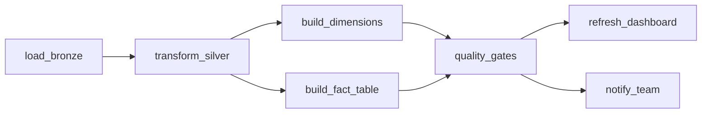
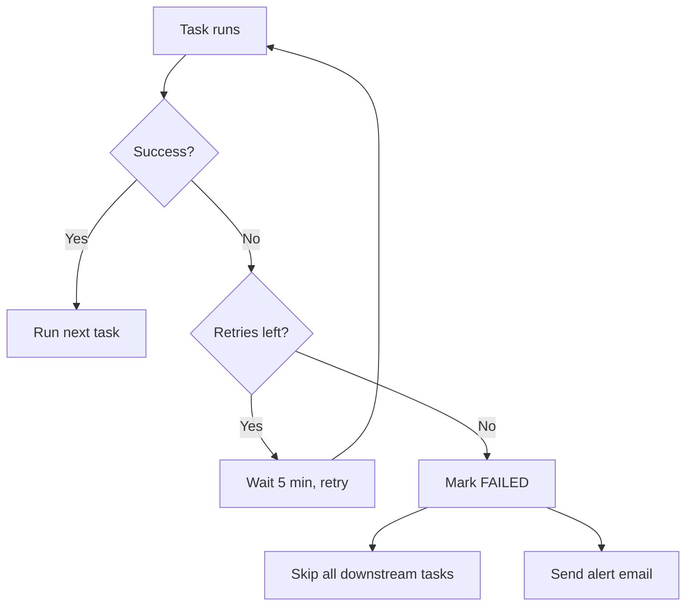
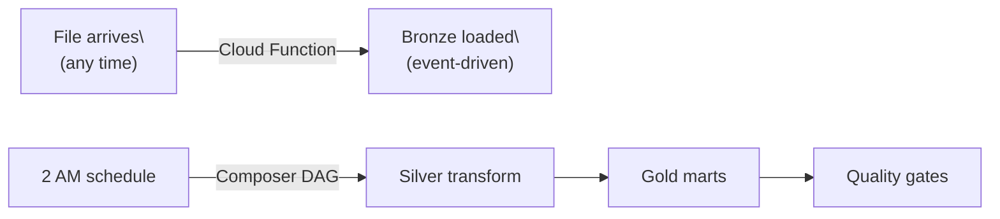

# Cloud Data Pipelines - Orchestration

**How to run pipeline steps in the right order, handle failures, and make it all repeatable.**

> These concepts apply to any cloud (GCP, AWS, Azure). Examples use GCP as the primary, with AWS equivalents noted. The hands-on notebooks are cloud-specific: [GCP Pipeline](../../../implementation/notebooks/GCP_Full_Pipeline.ipynb) | AWS Pipeline (coming soon).

---

## The Problem

Your pipeline has 5 steps:
1. Load new files into Bronze
2. Run Silver transform (dedup, clean)
3. Build Gold dimensions
4. Build Gold fact table
5. Run quality gates

If step 2 fails, steps 3-5 should NOT run (they would use stale data).
If step 4 fails, step 5 should NOT run (fact table is incomplete).
If step 2 fails, you want to retry it twice, then alert the team.

Running these manually, you handle this with your brain. In production, you need software that handles it for you.

---

## What Is Orchestration?

A system that:
- Runs tasks in a defined order
- Knows which tasks depend on which
- Retries failed tasks
- Skips downstream tasks when upstream fails
- Alerts humans when things need attention
- Keeps a log of every run

**Analogy:** A factory foreman. The foreman doesn't operate the machines. The foreman makes sure machine A finishes before machine B starts, that the quality check happens after assembly, and that someone gets called if the line stops.

---

## The Tool: Apache Airflow (Cloud Composer on GCP)

Apache Airflow is the industry standard for pipeline orchestration. Cloud Composer is Google's managed version (they run Airflow for you).

**Why Airflow?**
- Most common orchestrator in data engineering (appears in 80%+ of job postings)
- Python-based (you define workflows in Python, not YAML or XML)
- Visual UI showing every run, every task, every failure
- Built-in retry, alerting, scheduling, dependency management

---

## The Core Concept: DAG

A **DAG** (Directed Acyclic Graph, pronounced "dag") is a workflow definition.

- **Directed**: Tasks flow in one direction (A before B before C)
- **Acyclic**: No loops (A never goes back to A)
- **Graph**: Tasks connected by dependencies



This DAG says:
- `load_bronze` runs first
- `transform_silver` runs after bronze succeeds
- `build_dimensions` and `build_fact_table` run in parallel after silver
- `quality_gates` waits for BOTH dimensions and fact table
- `refresh_dashboard` and `notify_team` run after gates pass

---

## What a DAG Looks Like in Python

```python
# dags/pipeline_dag.py
from airflow import DAG
from airflow.providers.google.cloud.operators.bigquery import BigQueryInsertJobOperator
from airflow.operators.python import PythonOperator
from datetime import datetime, timedelta

# DAG definition
dag = DAG(
    'call_center_pipeline',
    description='Bronze to Silver to Gold pipeline',
    schedule_interval='0 2 * * *',   # Run at 2 AM every day
    start_date=datetime(2026, 3, 1),
    catchup=False,                    # Don't backfill missed runs
    default_args={
        'retries': 2,                # Retry failed tasks twice
        'retry_delay': timedelta(minutes=5),
        'email_on_failure': True,
        'email': ['oncall@company.com'],
    },
)

# Task 1: Load new files into Bronze
load_bronze = BigQueryInsertJobOperator(
    task_id='load_bronze',
    configuration={
        'load': {
            'sourceUris': ['gs://my-pipeline/bronze/calls/*.json'],
            'destinationTable': {'projectId': 'my-project', 'datasetId': 'raw', 'tableId': 'calls'},
            'sourceFormat': 'NEWLINE_DELIMITED_JSON',
            'writeDisposition': 'WRITE_APPEND',
            'autodetect': True,
        }
    },
    dag=dag,
)

# Task 2: Silver transform
transform_silver = BigQueryInsertJobOperator(
    task_id='transform_silver',
    configuration={
        'query': {
            'query': open('sql/silver_calls.sql').read(),
            'useLegacySql': False,
        }
    },
    dag=dag,
)

# Task 3: Build dimensions
build_dimensions = BigQueryInsertJobOperator(
    task_id='build_dimensions',
    configuration={
        'query': {
            'query': open('sql/gold_dimensions.sql').read(),
            'useLegacySql': False,
        }
    },
    dag=dag,
)

# Task 4: Build fact table
build_fact = BigQueryInsertJobOperator(
    task_id='build_fact_table',
    configuration={
        'query': {
            'query': open('sql/gold_fact_calls.sql').read(),
            'useLegacySql': False,
        }
    },
    dag=dag,
)

# Task 5: Quality gates
def run_quality_gates():
    """Check data quality. Raise exception if checks fail."""
    from google.cloud import bigquery
    client = bigquery.Client()
    
    # Gate 1: No duplicates in fact table
    result = client.query("""
        SELECT call_id, COUNT(*) as cnt
        FROM gold.fact_calls
        GROUP BY call_id
        HAVING cnt > 1
    """).result()
    dupes = list(result)
    if dupes:
        raise ValueError(f"QUALITY GATE FAILED: {len(dupes)} duplicate call_ids in fact_calls")
    
    print("All quality gates passed.")

quality_gates = PythonOperator(
    task_id='quality_gates',
    python_callable=run_quality_gates,
    dag=dag,
)

# Dependencies (the arrows in the DAG)
load_bronze >> transform_silver
transform_silver >> [build_dimensions, build_fact]
[build_dimensions, build_fact] >> quality_gates
```

The `>>` operator means "runs after." That's the entire dependency graph.

---

## Scheduling

| Schedule | Cron Expression | Meaning |
|---|---|---|
| Every day at 2 AM | `0 2 * * *` | Most common for daily pipelines |
| Every hour | `0 * * * *` | Near-real-time reporting |
| Every Monday at 6 AM | `0 6 * * 1` | Weekly aggregation |
| Every 15 minutes | `*/15 * * * *` | High-frequency ingestion |

---

## Failure Handling

What happens when something breaks?



**This is why orchestration matters.** Without it, a failure at 2 AM means stale dashboards at 8 AM and nobody knows why until someone checks manually.

---

## Event-Driven vs Schedule-Driven

| Pattern | How It Works | When to Use |
|---|---|---|
| **Schedule** | DAG runs at fixed times (every day at 2 AM) | Batch pipelines, daily reports |
| **Event** | Cloud Function detects file, triggers DAG | Real-time or near-real-time |
| **Hybrid** | Event triggers Bronze load, schedule triggers Silver/Gold | Most common in production |

The hybrid pattern:



Bronze loads happen throughout the day as files arrive. The heavy transforms (Silver, Gold) run once on a schedule.

---

## Cloud Composer vs Self-Managed Airflow

| Factor | Cloud Composer | Self-Managed Airflow |
|---|---|---|
| Setup | Click a button | Install, configure, maintain servers |
| Cost | ~$300-500/month (smallest environment) | Server costs + your time |
| Upgrades | Google handles it | You handle it |
| Scaling | Automatic | Manual |

**Cloud Composer is expensive for learning.** For development, use Airflow locally (Docker) or Astronomer's free dev tool. Deploy to Composer only for production.

---

## The AWS Equivalent

| GCP | AWS | What It Does |
|---|---|---|
| Cloud Composer | MWAA (Managed Airflow) | Managed Airflow |
| BigQueryInsertJobOperator | RedshiftSQLOperator | Run warehouse queries |
| GCS sensor | S3KeySensor | Wait for a file to arrive |

The DAG code is nearly identical. Only the operator names change.

---

## Quick Links

| Chapter | Topic |
|---|---|
| [01 - Why](01_Why.md) | Why pipelines matter |
| [02 - Concepts](02_Concepts.md) | Cloud services in plain English |
| [03 - Hello World](03_Hello_World.md) | Upload, query, see a result |
| [04 - Automation](04_Automation.md) | Event-driven triggers |
| [05 - Orchestration](05_Orchestration.md) | This page |
| [06 - Scale](06_Scale.md) | Spark, distributed compute, ETL vs ELT |
