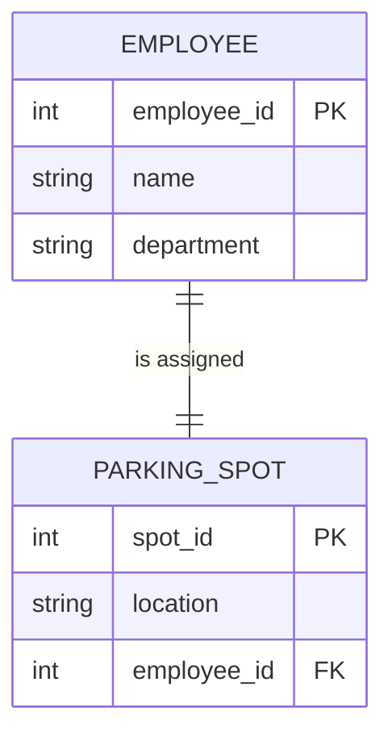
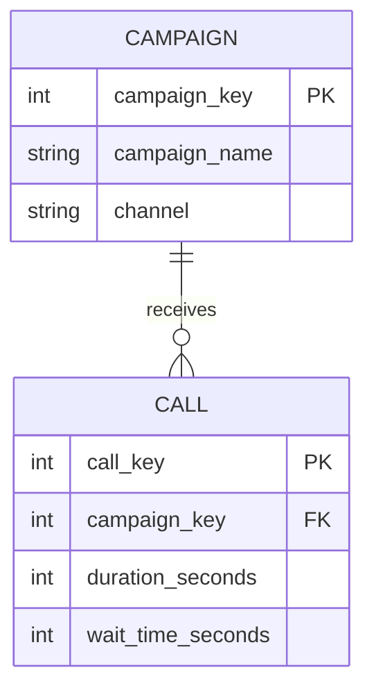
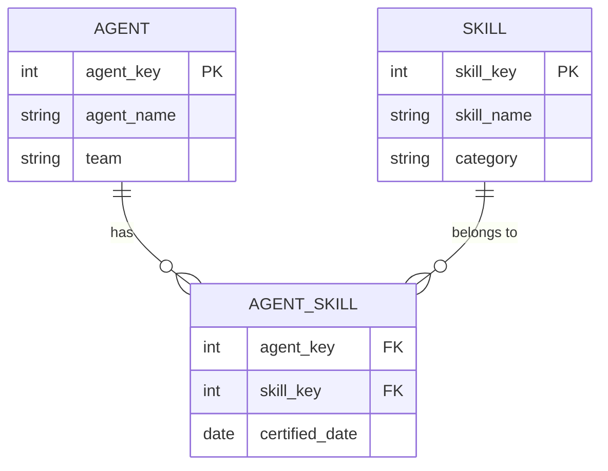
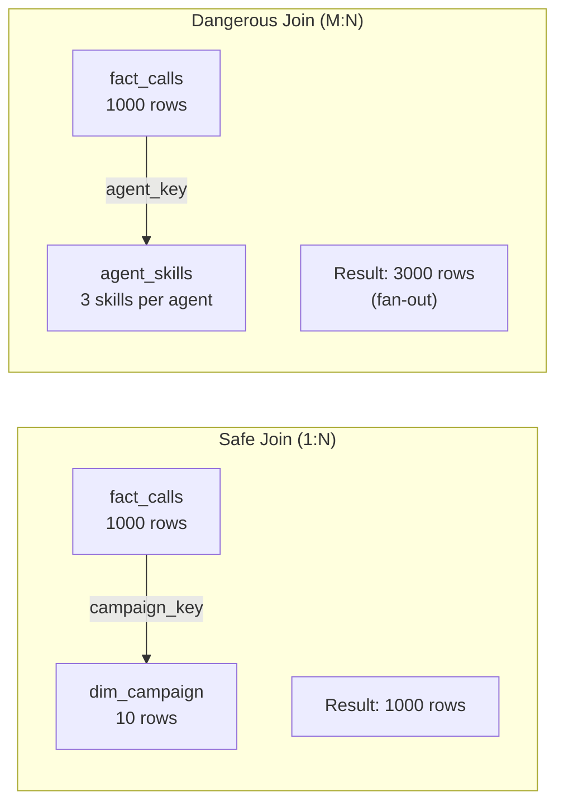
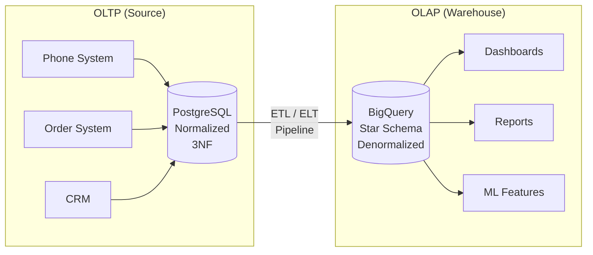

# Data Modeling — How It Works

**The mechanics of data modeling: entities, relationships, normalization, keys, and the fundamental split between transactional and analytical systems.**

---

## The Modeling Process

Data modeling is not a creative exercise. It is a structured process with repeatable steps. Every production data model — whether for a call center, a hospital, a logistics network, or a financial platform — follows the same sequence.

| Step | What You Do | What You Produce |
|:---|:---|:---|
| 1. Understand the business | Talk to stakeholders. What questions do they need answered? What decisions depend on data? | A list of business questions the model must support |
| 2. Identify entities | What are the "things" in this domain? Calls, agents, campaigns, products, orders. | Entity list |
| 3. Define relationships | How do the entities connect? An agent handles many calls. A call belongs to one campaign. | Relationship map |
| 4. Choose a schema pattern | Star schema? Snowflake? Data vault? Depends on the use case. | Schema pattern decision |
| 5. Implement | Write the DDL (Data Definition Language, pronounced "D-D-L" — the SQL statements that create tables). Load data. Validate. | Working tables with data |

The rest of this chapter covers steps 2 through 4 in detail. Step 5 is covered in [05 — Building It](05_Building_It.md).

---

## Entity-Relationship Modeling

An **entity** is a thing the business cares about. An **attribute** is a property of that entity. A **relationship** is how entities connect to each other.

| Term | Definition | Call Center Example |
|:---|:---|:---|
| **Entity** | A distinct object or concept in the domain | Call, Agent, Campaign, Product, Order |
| **Attribute** | A property that describes the entity | Call: duration, wait_time, outcome. Agent: name, team, hire_date. |
| **Relationship** | A connection between two entities | An agent handles calls. A call belongs to a campaign. |

### Relationship Types

There are three fundamental relationship types. Every data model is built from combinations of these three.

#### One-to-One (1:1)

One entity maps to exactly one of another. Rare in practice.



**Example:** One employee is assigned one parking spot. One parking spot belongs to one employee.

**When you see it:** Employee-to-badge, order-to-invoice (when there is always exactly one invoice per order), user-to-profile.

**Modeling decision:** In 1:1 relationships, you can often merge the two entities into one table. A separate table is only justified when one side is optional (not every employee has a parking spot) or when access patterns differ (the parking system queries spots, the HR system queries employees).

#### One-to-Many (1:N)

One entity maps to many of another. The most common relationship in data modeling.



**Example:** One campaign receives many calls. Each call belongs to exactly one campaign.

**When you see it:** Campaign-to-calls, agent-to-calls, customer-to-orders, department-to-employees. This is the bread and butter of data modeling.

**Modeling decision:** The "many" side gets a foreign key pointing to the "one" side. In the call center, `fact_calls` has a `campaign_key` column that points to `dim_campaign`.

#### Many-to-Many (M:N)

One entity maps to many of another, and vice versa.



**Example:** An agent has many skills (billing, tech support, Spanish). A skill belongs to many agents. The **bridge table** (also called a junction table or associative table) `AGENT_SKILL` connects them.

**When you see it:** Students-to-courses, products-to-categories, users-to-roles.

**Modeling decision:** Many-to-many relationships always require a bridge table. The bridge table contains foreign keys to both sides plus any attributes of the relationship itself (such as `certified_date` — the date the agent was certified in that skill).

---

## Normalization — Organizing Data to Eliminate Redundancy

**Normalization** is the process of organizing tables to reduce data redundancy and prevent update anomalies. It was formalized by Edgar Codd in the 1970s as a set of progressive rules called **normal forms**.

**The analogy:** Think of normalization like organizing a filing cabinet. First Normal Form says "no folders inside folders" (flat structure). Second Normal Form says "every document in a folder must be about that folder's subject." Third Normal Form says "no document should contain information that belongs in a different folder."

### First Normal Form (1NF)

**Rule:** Every column contains a single value. No repeating groups. No arrays in cells.

| Before (violates 1NF) | After (1NF) |
|:---|:---|
| call_id=1, skills="billing, tech, Spanish" | call_id=1, skill="billing" |
| | call_id=1, skill="tech" |
| | call_id=1, skill="Spanish" |

**Why it matters:** You cannot query "find all agents with the billing skill" if skills are stored as a comma-separated string inside one column. You would need string parsing (LIKE '%billing%'), which is slow, fragile, and cannot use indexes.

### Second Normal Form (2NF)

**Rule:** Every non-key column depends on the **entire** primary key, not just part of it. Only applies to tables with composite (multi-column) primary keys.

| Before (violates 2NF) | Problem |
|:---|:---|
| PK: (order_id, product_id), columns: quantity, product_name, product_category | `product_name` and `product_category` depend only on `product_id`, not on the full key `(order_id, product_id)` |

**Fix:** Move `product_name` and `product_category` to a separate `products` table keyed by `product_id`.

### Third Normal Form (3NF)

**Rule:** Every non-key column depends on the primary key and nothing else. No **transitive dependencies** — where column A determines column B, and column B determines column C.

| Before (violates 3NF) | Problem |
|:---|:---|
| agent_id (PK), agent_name, team_id, team_name, team_manager | `team_name` and `team_manager` depend on `team_id`, not on `agent_id` |

**Fix:** Move `team_name` and `team_manager` to a separate `teams` table keyed by `team_id`.

### When Normalization Helps and When It Hurts

| Context | Normalize? | Why |
|:---|:---|:---|
| OLTP (transactional system — the phone system recording calls) | **Yes, to 3NF** | Prevents update anomalies. Change the team name once, it updates everywhere. |
| OLAP (analytical system — the star schema for reporting) | **No — deliberately denormalize** | Analytical queries need speed, not write safety. Joining 8 tables for one question is too slow. |
| Small reference tables (< 1000 rows) | Usually not worth splitting further | The overhead of extra joins outweighs the benefit of reduced redundancy |

> **The key insight:** Normalization protects data integrity in write-heavy systems. Analytics databases are read-heavy. The priorities are opposite.

---

## Denormalization — Breaking the Rules on Purpose

Denormalization is the deliberate introduction of redundancy to improve read performance. In a star schema, the `dim_campaign` table contains `campaign_name`, `client_name`, and `channel` all in one table — even though a strict 3NF model would split them into separate tables.

**Why this is acceptable in analytics:**

1. **Dimension tables are small.** The `campaigns` table has 10 rows. The storage cost of duplicating `client_name` across those 10 rows is negligible.
2. **Reads vastly outnumber writes.** The star schema is loaded once per ETL run (nightly, hourly). It is queried thousands of times between loads. Optimize for the common case.
3. **Simpler queries.** `SELECT dc.client_name FROM fact_calls f JOIN dim_campaign dc ON f.campaign_key = dc.campaign_key` is one join. The normalized version would be `fact_calls → dim_campaign → dim_client` — two joins, for zero practical benefit.

**When denormalization goes wrong:** If a denormalized value changes and you fail to update all copies, the data is inconsistent. This is why denormalization belongs in the **Gold layer** (read-optimized, controlled updates) and not in the **Bronze layer** (raw, append-only).

---

## Keys — The Glue That Holds the Model Together

### Natural Keys

A **natural key** is a business identifier that exists in the real world: a phone number (DNIS), a product SKU, a Social Security Number, an email address.

**The problem with natural keys as join keys:**

| Issue | Example |
|:---|:---|
| They change | A campaign DNIS gets reassigned to a different campaign |
| They are strings | Joining on `'8005551234'` is slower than joining on `42` |
| They have format inconsistencies | `'800-555-1234'` vs `'8005551234'` vs `'+18005551234'` |
| They can be null | A call comes in with no DNIS (system error) — now the join drops the row |
| They can be reused | Phone numbers get recycled. SKU codes get reused after product retirement. |

### Surrogate Keys

A **surrogate key** is an auto-incrementing integer (or UUID) with no business meaning. It exists solely to be a fast, stable join key.

```sql
-- Surrogate key in a dimension table
CREATE TABLE dim_campaign (
    campaign_key INT64 NOT NULL,   -- Surrogate key: 1, 2, 3, ...
    dnis STRING,                    -- Natural key: '8005551234'
    campaign_name STRING,
    client_name STRING,
    channel STRING
);
```

**Why surrogate keys win in warehouses:**

| Property | Natural Key | Surrogate Key |
|:---|:---|:---|
| Join performance | String comparison (slow) | Integer comparison (fast) |
| Stability | Can change (business renames things) | Never changes |
| Uniqueness | Can have edge cases (reuse, nulls) | Guaranteed unique |
| Size | Variable (5-200 bytes) | Fixed (4-8 bytes) |
| SCD Type 2 support | Breaks (same natural key, two rows) | Works perfectly (new surrogate key per version) |

> **The rule:** Every dimension table has a surrogate key as its primary key. The natural key is stored as a regular column for ETL matching and human readability. All joins between fact and dimension tables use surrogate keys.

---

## Cardinality — How Relationships Affect Joins

**Cardinality** (pronounced "kar-dih-NAL-ih-tee") describes how many rows on one side of a join match rows on the other side.

| Join Type | Row Behavior | Example | Risk |
|:---|:---|:---|:---|
| One-to-one | Row count stays the same | fact_calls JOIN dim_date (one date_key per call, one row per date_key in dim_date) | None — safe |
| One-to-many | Row count stays the same (when joining from the "many" side to the "one" side) | fact_calls JOIN dim_campaign (many calls per campaign, but each call has one campaign) | None — safe |
| Many-to-many | **Row count multiplies** (fan-out) | If an agent has 3 skills and you join calls to agents to skills, each call row appears 3 times | Inflated counts, wrong aggregates |



**How cardinality affects query results:**

- `SELECT COUNT(*) FROM fact_calls` returns 510.
- `SELECT COUNT(*) FROM fact_calls JOIN dim_campaign USING (campaign_key)` returns 510 (one-to-many, safe).
- If you join to a bridge table without aggregating first, the count inflates. This is the #1 source of wrong numbers in data models. See [09 — Observability and Troubleshooting](09_Observability_Troubleshooting.md) for detection techniques.

---

## OLTP vs OLAP — Two Worlds, Two Models

Everything in this chapter leads to one fundamental distinction: transactional systems and analytical systems require different data models because they serve different purposes.

| Property | OLTP (Transactional) | OLAP (Analytical) |
|:---|:---|:---|
| **Purpose** | Record individual events as they happen | Answer aggregate questions across many events |
| **Users** | Applications (the phone system, the order system) | Analysts, dashboards, ML models |
| **Optimization** | Write speed, data integrity, concurrency | Read speed, query flexibility, scan efficiency |
| **Schema** | Normalized (3NF) — many small tables, many joins | Denormalized (star/snowflake) — fewer tables, fewer joins |
| **Row count per query** | 1 (insert this call) to 100 (show recent calls) | 10,000 to 50,000,000 (aggregate all March calls by campaign) |
| **Update pattern** | Frequent small updates (one row at a time) | Bulk loads (nightly ETL, hourly refresh) |
| **Example** | PostgreSQL recording each call as it comes in | BigQuery star schema answering "average wait by campaign by hour" |
| **Key type** | Natural keys are common (phone number, email) | Surrogate keys are standard (integer join keys) |
| **Redundancy** | Eliminated (normalization) | Deliberately introduced (denormalization) |



The data engineer's core job is building the pipeline between these two worlds — and the data model is the architecture of the OLAP side.

---

## Summary — The Mechanics at a Glance

| Concept | What It Does | Default Choice |
|:---|:---|:---|
| Entity-Relationship modeling | Identifies the "things" and how they connect | Start every model here |
| 1:1, 1:N, M:N relationships | Determines table structure and join patterns | 1:N is the workhorse |
| Normalization (1NF, 2NF, 3NF) | Eliminates redundancy in transactional systems | 3NF for OLTP |
| Denormalization | Introduces controlled redundancy for read speed | Star schema for OLAP |
| Surrogate keys | Fast, stable integer join keys | Always, for dimension tables |
| Natural keys | Business identifiers kept as regular columns | Keep for ETL and readability |
| Cardinality | How many rows match across a join | Verify before any join to prevent fan-out |
| OLTP vs OLAP | Two different systems with opposite optimization goals | Never use one for both |

---

**Hands-on notebook:** [Data Modeling on Colab](https://colab.research.google.com/github/sunilmogadati/systems-in-production/blob/main/implementation/notebooks/Data_Modeling.ipynb)

**Deep dive on star schema:** [Star Schema Design](../star-schema/)

---

### Quick Links — All Chapters

| Chapter | Title |
|:---|:---|
| [01](01_Why.md) | Why This Matters |
| [02](02_Concepts.md) | Concepts and Mental Models |
| [03](03_Hello_World.md) | Hello World |
| [04](04_How_It_Works.md) | How It Works |
| [05](05_Building_It.md) | Building It |
| [06](06_Production_Patterns.md) | Production Patterns |
| [07](07_System_Design.md) | System Design |
| [08](08_Quality_Security_Governance.md) | Quality, Security, Governance |
| [09](09_Observability_Troubleshooting.md) | Observability and Troubleshooting |
| [10](10_Decision_Guide.md) | Decision Guide |
