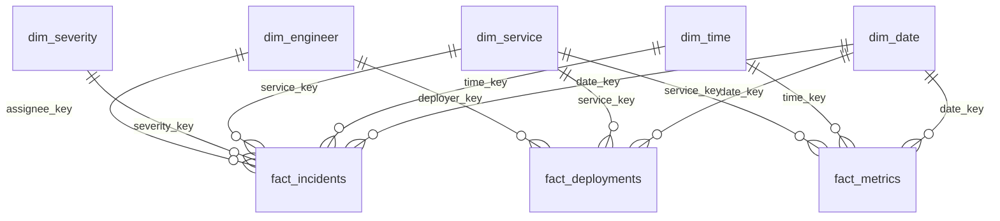
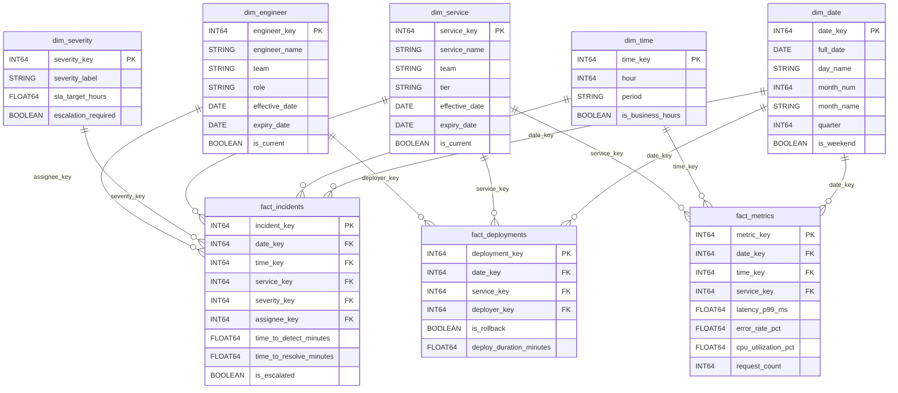

# Data Modeling — Building It

**Build a complete analytical data model from scratch. Seven steps from raw data to a queryable star schema.**

---

## The Dataset — Production Diagnostics

This chapter models a **production support system** — incidents, services, deployments, and metrics for a software platform. The same seven-step process applies to any domain: call centers, e-commerce, healthcare, logistics. The steps do not change. Only the entities change.

**Source tables (raw, unmodeled):**

| Table | Description | Sample Columns |
|:---|:---|:---|
| incidents | Production incidents as they happen | incident_id, service_name, severity, reported_at, resolved_at, assignee, root_cause |
| services | The software services being monitored | service_name, team, tier, language, deploy_frequency |
| deployments | Every deployment to production | deploy_id, service_name, deployed_by, deployed_at, version, rollback_flag |
| metrics | Performance metrics snapshots | metric_id, service_name, timestamp, latency_p99, error_rate, cpu_pct |

---

## Step 1: Identify the Grain

The **grain** (also called "granularity") is the answer to: **what does one row in the fact table represent?**

This is the single most important decision in data modeling. Get it wrong, and every query built on the model produces misleading results. Get it right, and the model answers questions you have not thought of yet.

| Possible Grain | One Row = | Supports These Questions |
|:---|:---|:---|
| One incident | A single production incident | "How many P1 incidents this month?" "Average resolution time by service?" |
| One deployment | A single deployment event | "How many deployments per week per service?" "Rollback rate by team?" |
| One metric snapshot | A single performance measurement at a point in time | "Average p99 latency by service by hour?" "Error rate trend over 30 days?" |
| One incident per hour | Aggregated — incidents bucketed by hour | Loses individual incident detail. Not recommended as the base grain. |

**Decision:** Build three fact tables, each with a different grain.

| Fact Table | Grain | Why |
|:---|:---|:---|
| fact_incidents | One row per incident | Incident analysis: severity trends, resolution time, root cause patterns |
| fact_deployments | One row per deployment | Deployment velocity, rollback rate, change failure rate |
| fact_metrics | One row per metric snapshot per service | Performance trends, SLA compliance, capacity planning |

> **Rule:** Choose the finest grain that supports the business questions. You can always aggregate up (daily from hourly) but you cannot drill down below the grain you stored.

---

## Step 2: Identify Dimensions (Who, What, When, Where)

Dimensions provide the context that makes fact table numbers meaningful. For each fact table, ask: **by what axes do stakeholders slice and filter?**

| Dimension | What It Answers | Used By |
|:---|:---|:---|
| dim_date | When did it happen? Day name, month, quarter, is_weekend. | All three fact tables |
| dim_time | What time of day? Hour, period (business hours vs off-hours). | fact_incidents, fact_metrics |
| dim_service | Which service? Team, tier (critical/standard), language, deploy frequency. | All three fact tables |
| dim_severity | How bad? P1/P2/P3/P4, SLA target hours, escalation required flag. | fact_incidents |
| dim_engineer | Who was involved? Name, team, role (on-call, deployer, reviewer). | fact_incidents, fact_deployments |



**dim_date and dim_service are conformed dimensions** — shared across all three fact tables. This means you can query across fact tables using the same dimension: "show me services with both high incident counts AND high rollback rates" uses the same `dim_service` for both joins.

---

## Step 3: Identify Facts (What Happened, How Much, How Many)

Facts are the measurements — the numbers that stakeholders aggregate, average, sum, and compare.

### fact_incidents

| Column | Type | Description |
|:---|:---|:---|
| incident_key | INT64 (PK) | Surrogate key |
| date_key | INT64 (FK) | When the incident was reported |
| time_key | INT64 (FK) | Hour of day when reported |
| service_key | INT64 (FK) | Which service was affected |
| severity_key | INT64 (FK) | P1/P2/P3/P4 |
| assignee_key | INT64 (FK) | Who was assigned |
| incident_id | STRING | Degenerate dimension — the original incident ID from the source system |
| time_to_detect_minutes | FLOAT64 | Measure: minutes from issue start to detection |
| time_to_resolve_minutes | FLOAT64 | Measure: minutes from detection to resolution |
| is_escalated | BOOLEAN | Measure: was the incident escalated? |
| root_cause_category | STRING | Degenerate dimension: code_bug, config_change, infra_failure, dependency |

### fact_deployments

| Column | Type | Description |
|:---|:---|:---|
| deployment_key | INT64 (PK) | Surrogate key |
| date_key | INT64 (FK) | Deployment date |
| service_key | INT64 (FK) | Which service was deployed |
| deployer_key | INT64 (FK) | Who deployed |
| deploy_id | STRING | Degenerate dimension |
| version | STRING | Degenerate dimension |
| is_rollback | BOOLEAN | Measure: was this deployment rolled back? |
| deploy_duration_minutes | FLOAT64 | Measure: time from deploy start to healthy |

### fact_metrics

| Column | Type | Description |
|:---|:---|:---|
| metric_key | INT64 (PK) | Surrogate key |
| date_key | INT64 (FK) | Date of the snapshot |
| time_key | INT64 (FK) | Hour of the snapshot |
| service_key | INT64 (FK) | Which service |
| latency_p99_ms | FLOAT64 | Measure: 99th percentile latency in milliseconds |
| error_rate_pct | FLOAT64 | Measure: error rate as a percentage |
| cpu_utilization_pct | FLOAT64 | Measure: CPU utilization as a percentage |
| request_count | INT64 | Measure: total requests in this snapshot window |

---

## Step 4: Define Surrogate Keys

Every dimension table gets a surrogate key. The fact table stores only surrogate keys as foreign keys — never the natural key.

| Dimension | Surrogate Key | Natural Key (kept as column) |
|:---|:---|:---|
| dim_date | date_key (INT64, format YYYYMMDD) | full_date (DATE) |
| dim_time | time_key (INT64, 0-23) | hour (INT64) |
| dim_service | service_key (INT64, auto-increment) | service_name (STRING) |
| dim_severity | severity_key (INT64, auto-increment) | severity_label (STRING: 'P1', 'P2', 'P3', 'P4') |
| dim_engineer | engineer_key (INT64, auto-increment) | engineer_email (STRING) |

**The unknown member row:** Every dimension table should include a row with surrogate key = -1 (or 0) representing "unknown." When a fact record has no matching dimension (a call with no campaign, an incident with no assignee), the foreign key points to the unknown member instead of being NULL. This prevents dropped rows in queries with INNER JOINs.

```sql
-- Unknown member in dim_service
INSERT INTO dim_service (service_key, service_name, team, tier)
VALUES (-1, 'Unknown', 'Unknown', 'Unknown');
```

---

## Step 5: Handle Slowly Changing Dimensions

Dimension data changes over time. The decision for each attribute: does history matter?

| Dimension | Attribute | SCD Type | Reasoning |
|:---|:---|:---|:---|
| dim_service | service_name | Type 1 (overwrite) | Renaming a service is a correction, not a historical event |
| dim_service | team | **Type 2 (versioned)** | If a service transfers teams, historical incident reports should show the team at the time of the incident |
| dim_service | tier | **Type 2 (versioned)** | If a service is upgraded from standard to critical, historical SLA calculations need the tier at the time |
| dim_engineer | engineer_name | Type 1 (overwrite) | Name corrections are not historical |
| dim_engineer | team | **Type 2 (versioned)** | Team transfers matter for historical reporting |
| dim_engineer | role | **Type 2 (versioned)** | Promotion from junior to senior affects analysis of incident handling |
| dim_severity | sla_target_hours | Type 1 (overwrite) | SLA targets are policy — when they change, the new target applies retroactively |

**Type 2 columns in dim_service:**

| service_key | service_name | team | tier | effective_date | expiry_date | is_current |
|:---|:---|:---|:---|:---|:---|:---|
| 1 | payment-api | Platform | standard | 2025-01-01 | 2026-02-15 | N |
| 14 | payment-api | Platform | **critical** | 2026-02-15 | 9999-12-31 | Y |

The `payment-api` service was upgraded to critical tier on 2026-02-15. Incidents before that date join to service_key=1 (standard tier). Incidents after join to service_key=14 (critical tier). Historical SLA compliance reports are accurate.

---

## Step 6: Write the DDL

```sql
-- ============================================================
-- Production Diagnostics Star Schema
-- ============================================================

CREATE SCHEMA IF NOT EXISTS prod_diagnostics;

-- DIMENSION: dim_date
CREATE OR REPLACE TABLE prod_diagnostics.dim_date AS
SELECT
    CAST(FORMAT_DATE('%Y%m%d', d) AS INT64) AS date_key,
    d AS full_date,
    FORMAT_DATE('%A', d) AS day_name,
    EXTRACT(MONTH FROM d) AS month_num,
    FORMAT_DATE('%B', d) AS month_name,
    EXTRACT(QUARTER FROM d) AS quarter,
    EXTRACT(YEAR FROM d) AS year,
    CASE WHEN EXTRACT(DAYOFWEEK FROM d) IN (1, 7) THEN TRUE ELSE FALSE END AS is_weekend
FROM UNNEST(GENERATE_DATE_ARRAY('2025-01-01', '2027-12-31')) AS d;

-- DIMENSION: dim_time
CREATE OR REPLACE TABLE prod_diagnostics.dim_time AS
SELECT
    hour AS time_key,
    hour,
    CASE
        WHEN hour BETWEEN 6 AND 11 THEN 'Morning'
        WHEN hour BETWEEN 12 AND 17 THEN 'Afternoon'
        WHEN hour BETWEEN 18 AND 21 THEN 'Evening'
        ELSE 'Night'
    END AS period,
    CASE
        WHEN hour BETWEEN 9 AND 17 THEN TRUE
        ELSE FALSE
    END AS is_business_hours
FROM UNNEST(GENERATE_ARRAY(0, 23)) AS hour;

-- DIMENSION: dim_service (SCD Type 2)
CREATE OR REPLACE TABLE prod_diagnostics.dim_service (
    service_key INT64 NOT NULL,
    service_name STRING,
    team STRING,
    tier STRING,
    language STRING,
    deploy_frequency STRING,
    effective_date DATE,
    expiry_date DATE,
    is_current BOOLEAN
);

-- DIMENSION: dim_severity
CREATE OR REPLACE TABLE prod_diagnostics.dim_severity (
    severity_key INT64 NOT NULL,
    severity_label STRING,
    sla_target_hours FLOAT64,
    escalation_required BOOLEAN,
    description STRING
);

-- DIMENSION: dim_engineer (SCD Type 2)
CREATE OR REPLACE TABLE prod_diagnostics.dim_engineer (
    engineer_key INT64 NOT NULL,
    engineer_name STRING,
    engineer_email STRING,
    team STRING,
    role STRING,
    effective_date DATE,
    expiry_date DATE,
    is_current BOOLEAN
);

-- FACT: fact_incidents
CREATE OR REPLACE TABLE prod_diagnostics.fact_incidents (
    incident_key INT64 NOT NULL,
    date_key INT64,
    time_key INT64,
    service_key INT64,
    severity_key INT64,
    assignee_key INT64,
    incident_id STRING,
    time_to_detect_minutes FLOAT64,
    time_to_resolve_minutes FLOAT64,
    is_escalated BOOLEAN,
    root_cause_category STRING
)
PARTITION BY RANGE_BUCKET(date_key, GENERATE_ARRAY(20250101, 20271231, 100))
CLUSTER BY service_key, severity_key;

-- FACT: fact_deployments
CREATE OR REPLACE TABLE prod_diagnostics.fact_deployments (
    deployment_key INT64 NOT NULL,
    date_key INT64,
    service_key INT64,
    deployer_key INT64,
    deploy_id STRING,
    version STRING,
    is_rollback BOOLEAN,
    deploy_duration_minutes FLOAT64
)
PARTITION BY RANGE_BUCKET(date_key, GENERATE_ARRAY(20250101, 20271231, 100))
CLUSTER BY service_key;

-- FACT: fact_metrics
CREATE OR REPLACE TABLE prod_diagnostics.fact_metrics (
    metric_key INT64 NOT NULL,
    date_key INT64,
    time_key INT64,
    service_key INT64,
    latency_p99_ms FLOAT64,
    error_rate_pct FLOAT64,
    cpu_utilization_pct FLOAT64,
    request_count INT64
)
PARTITION BY RANGE_BUCKET(date_key, GENERATE_ARRAY(20250101, 20271231, 100))
CLUSTER BY service_key;
```

---

## Step 7: Write the Load SQL

The load process transforms raw source data into the star schema. This is the "T" in ETL or the transform step in ELT.

```sql
-- ============================================================
-- Load dim_service from raw services table (initial load)
-- ============================================================
INSERT INTO prod_diagnostics.dim_service
SELECT
    ROW_NUMBER() OVER (ORDER BY service_name) AS service_key,
    service_name,
    team,
    tier,
    language,
    deploy_frequency,
    CURRENT_DATE() AS effective_date,
    DATE '9999-12-31' AS expiry_date,
    TRUE AS is_current
FROM raw.services;

-- ============================================================
-- Load fact_incidents (joins raw incidents to dimension keys)
-- ============================================================
INSERT INTO prod_diagnostics.fact_incidents
SELECT
    ROW_NUMBER() OVER (ORDER BY i.reported_at) AS incident_key,
    CAST(FORMAT_DATE('%Y%m%d', DATE(i.reported_at)) AS INT64) AS date_key,
    EXTRACT(HOUR FROM i.reported_at) AS time_key,
    COALESCE(ds.service_key, -1) AS service_key,
    COALESCE(dsev.severity_key, -1) AS severity_key,
    COALESCE(de.engineer_key, -1) AS assignee_key,
    i.incident_id,
    TIMESTAMP_DIFF(i.detected_at, i.started_at, MINUTE) AS time_to_detect_minutes,
    TIMESTAMP_DIFF(i.resolved_at, i.detected_at, MINUTE) AS time_to_resolve_minutes,
    i.is_escalated,
    i.root_cause
FROM raw.incidents AS i
LEFT JOIN prod_diagnostics.dim_service AS ds
    ON i.service_name = ds.service_name AND ds.is_current = TRUE
LEFT JOIN prod_diagnostics.dim_severity AS dsev
    ON i.severity = dsev.severity_label
LEFT JOIN prod_diagnostics.dim_engineer AS de
    ON i.assignee_email = de.engineer_email AND de.is_current = TRUE;
```

**Key patterns in the load SQL:**

| Pattern | What It Does | Why |
|:---|:---|:---|
| `COALESCE(ds.service_key, -1)` | Uses the unknown member key when no match is found | Prevents NULLs in foreign key columns. Every fact row joins to a dimension row. |
| `ds.is_current = TRUE` | Joins to the current version of SCD Type 2 dimensions | The load always assigns new facts to the current dimension version |
| `LEFT JOIN` (not INNER JOIN) | Keeps fact rows even when dimension lookup fails | Source data may have values not yet in the dimension table. Better to load with unknown key than drop the row. |
| `ROW_NUMBER() OVER (...)` | Generates surrogate keys for fact rows | Fact table needs a unique identifier for each row |

---

## The Complete Model — ER Diagram



---

## Validation Queries

After loading, verify the model before anyone queries it.

```sql
-- 1. Row count reconciliation
SELECT 'raw_incidents' AS source, COUNT(*) AS rows FROM raw.incidents
UNION ALL
SELECT 'fact_incidents', COUNT(*) FROM prod_diagnostics.fact_incidents;
-- These should match. If fact has fewer rows, the load dropped records.

-- 2. Unknown member check
SELECT COUNT(*) AS unknown_service_incidents
FROM prod_diagnostics.fact_incidents
WHERE service_key = -1;
-- If this is high, the dimension lookup is failing. Investigate the join condition.

-- 3. Orphan check — fact keys that do not exist in dimensions
SELECT f.service_key, COUNT(*) AS orphan_count
FROM prod_diagnostics.fact_incidents AS f
LEFT JOIN prod_diagnostics.dim_service AS ds ON f.service_key = ds.service_key
WHERE ds.service_key IS NULL
GROUP BY f.service_key;
-- Should return zero rows. If not, the dimension table is missing entries.

-- 4. Grain check — no duplicate incident_ids in fact table
SELECT incident_id, COUNT(*) AS cnt
FROM prod_diagnostics.fact_incidents
GROUP BY incident_id
HAVING cnt > 1;
-- Should return zero rows. Duplicates mean the load ran twice or the dedup logic failed.
```

---

**Hands-on notebook:** [Data Modeling on Colab](https://colab.research.google.com/github/sunilmogadati/systems-in-production/blob/main/implementation/notebooks/Data_Modeling.ipynb)

**Deep dive on star schema:** [Star Schema Design](../star-schema/)

---

### Quick Links — All Chapters

| Chapter | Title |
|:---|:---|
| [01](01_Why.md) | Why This Matters |
| [02](02_Concepts.md) | Concepts and Mental Models |
| [03](03_Hello_World.md) | Hello World |
| [04](04_How_It_Works.md) | How It Works |
| [05](05_Building_It.md) | Building It |
| [06](06_Production_Patterns.md) | Production Patterns |
| [07](07_System_Design.md) | System Design |
| [08](08_Quality_Security_Governance.md) | Quality, Security, Governance |
| [09](09_Observability_Troubleshooting.md) | Observability and Troubleshooting |
| [10](10_Decision_Guide.md) | Decision Guide |
