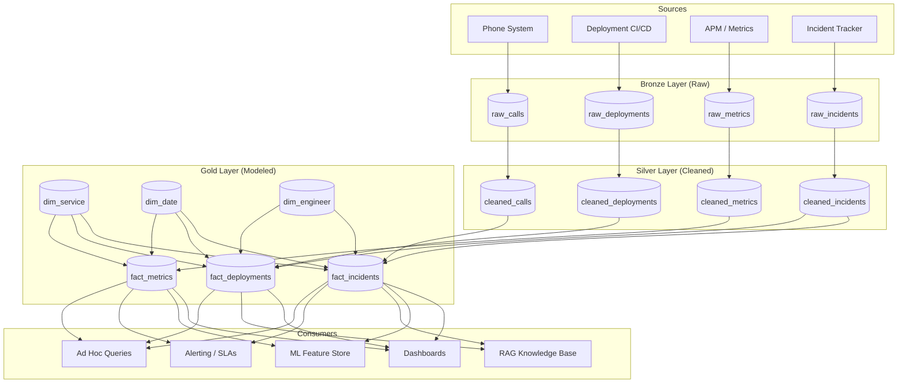

# Data Modeling — System Design

**How the data model fits into the broader production system: pipelines, ML features, RAG, reporting, and the architectural decisions that connect them.**

---

## Where the Data Model Sits

The data model is not an isolated artifact. It is the structural layer that connects pipelines (which produce data) to consumers (which read data). Every downstream consumer — dashboards, ML models, RAG systems, alerts — depends on the model being correct.



**How the model connects to each consumer:**

| Consumer | What It Reads | What the Model Provides |
|:---|:---|:---|
| **Dashboards** | Aggregate queries on fact + dimension tables | Pre-joined context (dim_service.team), pre-computed date attributes (dim_date.is_weekend), consistent grain |
| **ML Feature Store** | Aggregated features: incidents_last_7d, avg_latency_p99, rollback_rate | Reliable grain (one row per incident) so aggregations are correct. Conformed dimensions so features from different fact tables align. |
| **RAG Knowledge Base** | Incident summaries, root cause patterns, service descriptions | Structured data that feeds document generation. "Service X had 12 P1 incidents in Q1, 8 caused by config changes." |
| **Alerting / SLAs** | Real-time or near-real-time metric thresholds | SLA targets in dim_severity. Threshold comparisons against fact_metrics. |
| **Ad hoc queries** | Anything — this is the analyst exploring | Clean, documented schema with clear naming. The model makes exploration possible. |

---

## The 10-Step Framework: Design the Data Model for a Production Diagnostic System

This framework structures the system design interview question or the real-world design session. The steps are sequential — each depends on the previous.

### Step 1: Clarify Requirements

**Ask:** What questions must this system answer?

- "Which services have the highest incident rate this quarter?"
- "What is the average time-to-resolve by severity and team?"
- "Is there a correlation between deploy frequency and incident rate?"
- "Which engineers handle the most P1 incidents?"
- "What is the p99 latency trend for critical-tier services?"

These questions define the dimensions (service, severity, team, engineer, date) and the measures (incident count, time-to-resolve, latency, deploy count).

### Step 2: Identify Source Systems

| Source | Data It Provides | Update Frequency |
|:---|:---|:---|
| PagerDuty / Incident tracker | Incidents, severity, assignee, timestamps | Real-time events |
| CI/CD pipeline (GitHub Actions, Jenkins) | Deployments, versions, rollback flags | Per deployment |
| APM (Datadog, New Relic, CloudWatch) | Latency, error rate, CPU, request count | Every 1-5 minutes |
| Service registry | Service metadata, team ownership, tier | On change (infrequent) |

### Step 3: Define the Grain

Three fact tables, three grains (as designed in [05 — Building It](05_Building_It.md)):
- fact_incidents: one row per incident
- fact_deployments: one row per deployment
- fact_metrics: one row per metric snapshot per service

### Step 4: Design Dimensions

Conformed dimensions shared across fact tables: dim_date, dim_time, dim_service, dim_engineer. Fact-specific dimension: dim_severity (only for incidents).

### Step 5: Design Facts

Measures identified from the requirements in Step 1. Surrogate keys for all foreign keys. Degenerate dimensions for source IDs (incident_id, deploy_id).

### Step 6: Choose Physical Layout

| Table | Partition By | Cluster By | Rationale |
|:---|:---|:---|:---|
| fact_incidents | date_key | service_key, severity_key | Most queries filter by date range and service |
| fact_deployments | date_key | service_key | Deploy analysis is always time-bounded |
| fact_metrics | date_key | service_key | Metric queries are always time-series by service |
| dim_service | Not partitioned | — | < 1000 rows. Full scan is trivial. |
| dim_date | Not partitioned | — | 1095 rows (3 years). Full scan is trivial. |
| dim_engineer | Not partitioned | — | < 500 rows. Full scan is trivial. |

### Step 7: Define SCD Strategy

(Covered in [05 — Building It](05_Building_It.md), Step 5.)

### Step 8: Define the Refresh Schedule

| Layer | Refresh Frequency | Method |
|:---|:---|:---|
| Bronze | Near-real-time (streaming) or every 15 minutes (micro-batch) | Pub/Sub to GCS, or scheduled API pull |
| Silver | Every 15-60 minutes | Scheduled SQL transformation (dbt, Dataform, or Airflow task) |
| Gold (star schema) | Hourly or daily, depending on SLA | Scheduled SQL or dbt models |
| Aggregate tables | After Gold refresh | Dependent task in the same pipeline |

### Step 9: Define Aggregate Tables

Not every question should hit the base fact table. Pre-computed aggregates reduce query cost and latency.

### Step 10: Document and Validate

Data dictionary, column descriptions, grain documentation, validation queries (covered in [08 — Quality, Security, Governance](08_Quality_Security_Governance.md)).

---

## Multi-Grain Fact Tables

Some reporting needs require both transaction-level detail and summary-level aggregates. These are served by separate tables at different grains.

| Table | Grain | Rows (example) | Use Case |
|:---|:---|:---|:---|
| fact_incidents | One row per incident | 50,000 | Drill-down: "Show me every P1 incident for payment-api in March" |
| fact_incidents_daily | One row per service per day | 365,000 (1000 services x 365 days) | Dashboard: "Incident count by service by day for the quarter" |
| fact_incidents_weekly | One row per service per week | 52,000 | Executive report: "Weekly incident trend by tier" |

**The rule:** The transaction-level fact table is the source of truth. Summary tables are derived from it and refreshed after it. Never load summary tables directly from source — always derive them from the base fact.

```sql
-- Daily summary derived from base fact
CREATE OR REPLACE TABLE prod_diagnostics.fact_incidents_daily AS
SELECT
    f.date_key,
    f.service_key,
    f.severity_key,
    COUNT(*) AS incident_count,
    AVG(f.time_to_resolve_minutes) AS avg_resolve_minutes,
    SUM(CASE WHEN f.is_escalated THEN 1 ELSE 0 END) AS escalated_count,
    COUNTIF(f.root_cause_category = 'config_change') AS config_change_count
FROM prod_diagnostics.fact_incidents AS f
GROUP BY f.date_key, f.service_key, f.severity_key;
```

---

## Aggregate Tables — When and How to Pre-Compute

**When to pre-compute:**

| Signal | Action |
|:---|:---|
| A dashboard query takes > 5 seconds on the base fact table | Build an aggregate table at the dashboard's grain |
| The same GROUP BY pattern appears in 10+ queries | Materialize it |
| The base fact table has > 100M rows and most queries need daily/weekly summaries | Build daily and weekly summary tables |
| An ML feature pipeline aggregates the same columns every run | Pre-compute the features as a table |

**When NOT to pre-compute:**

| Signal | Action |
|:---|:---|
| The base fact table has < 10M rows | BigQuery/Redshift/Snowflake handles this without aggregates |
| Queries filter on many different dimension combinations | Aggregates only help for the specific combination they pre-compute |
| The data changes frequently (< 1 hour refresh) | Aggregate staleness becomes a problem |

---

## Partitioning Strategy Based on the Model

| Table Type | Partition? | Partition Key | Why |
|:---|:---|:---|:---|
| **Fact tables** | Always (if > 1 GB) | Date column | Analytical queries almost always have a date range filter. Partitioning eliminates scanning irrelevant dates. |
| **Dimension tables** | Rarely | — | Dimension tables are small (hundreds to thousands of rows). Full scans are fast. Partitioning adds overhead for no benefit. |
| **Aggregate tables** | Sometimes | Date column | If the aggregate table grows large (years of daily data), partition it. Otherwise, skip. |
| **SCD Type 2 dimensions** | Consider | effective_date | If the dimension has millions of historical versions (large user dimension in a SaaS product), partitioning by effective_date helps queries that filter on `is_current = TRUE`. |

---

## Schema Evolution — Handling Change Without Breaking Things

Production data models change. New sources appear. New attributes are needed. Old columns become irrelevant. The question is not whether the schema will change, but how to handle it without breaking downstream consumers.

### Adding a Column

**Safe.** New columns have NULL values for existing rows. No downstream query breaks — queries that do not reference the new column are unaffected.

```sql
ALTER TABLE dim_service ADD COLUMN on_call_rotation STRING;
```

**Downstream impact:** None. Existing queries ignore the new column. New queries can use it.

### Changing a Column Type

**Dangerous.** Changing `latency_p99` from FLOAT64 to INT64 can break downstream queries that expect decimal precision.

**Safe approach:**
1. Add the new column with the new type (`latency_p99_ms_int`)
2. Backfill it from the old column
3. Update downstream consumers to use the new column
4. Deprecate the old column (keep it for a migration period)
5. Drop the old column after all consumers have migrated

### Renaming a Column

**Dangerous.** Every query referencing the old name breaks.

**Safe approach:** Same as type change — add new column, deprecate old, drop after migration.

### Removing a Column

**Dangerous.** Any query referencing the dropped column fails immediately.

**Safe approach:**
1. Announce deprecation (add a `-- DEPRECATED: use X instead` comment, notify consumers)
2. Set a removal date (30-90 days)
3. Monitor query logs — are any queries still using the column?
4. Drop after the migration period with zero active references

### Breaking Changes — The Contract

Schema changes that break downstream consumers are **breaking changes.** They require coordination between the model producer and all consumers. This is the data contract problem, covered in [08 — Quality, Security, Governance](08_Quality_Security_Governance.md).

---

## Cross-System Modeling — Multiple Sources, One Model

Production data rarely comes from one system. The production diagnostic model pulls from PagerDuty (incidents), GitHub Actions (deployments), Datadog (metrics), and an internal service registry.

**The challenge:** Each source has its own identifiers, naming conventions, and update cadences.

| Source | Service Identifier | Engineer Identifier | Timestamp Format |
|:---|:---|:---|:---|
| PagerDuty | service_id (UUID) | email | ISO 8601 UTC |
| GitHub Actions | repo_name | github_username | Unix epoch ms |
| Datadog | service_tag | — | Unix epoch seconds |
| Service registry | service_name | team_email_alias | — |

**The solution: master mapping in the dimension table.**

```sql
-- dim_service resolves multiple source identifiers to one surrogate key
CREATE TABLE prod_diagnostics.dim_service_mapping (
    service_key INT64,                -- Surrogate key (the one key to rule them all)
    pagerduty_service_id STRING,      -- PagerDuty's identifier
    github_repo_name STRING,          -- GitHub's identifier
    datadog_service_tag STRING,       -- Datadog's identifier
    registry_service_name STRING      -- Internal registry's identifier
);
```

Each source-specific ETL joins on its own identifier column to resolve the surrogate key. The fact tables only store the surrogate key — source-specific identifiers never appear in fact tables.

**The rule:** Resolve source-specific identifiers to surrogate keys in the Silver layer. By the time data reaches Gold (the star schema), every foreign key is a surrogate key from a conformed dimension.

---

## Summary

| Design Decision | Default | Override When |
|:---|:---|:---|
| Schema pattern | Star schema | Data vault for 50+ sources with audit requirements |
| Grain | Finest level that supports business questions | Pre-aggregate only when performance demands it |
| Partitioning | Fact tables by date | Skip for tables < 1 GB |
| Dimension partitioning | Do not partition | Partition SCD Type 2 dims with millions of historical rows |
| Aggregate tables | Build only when base fact queries are slow | Always derive from base fact, never from source |
| Schema changes | Additive (new columns) | Coordinate breaking changes with all consumers |
| Cross-system identity | Surrogate keys in Gold, mapping table in Silver | Never expose source-specific IDs in fact tables |

---

**Hands-on notebook:** [Data Modeling on Colab](https://colab.research.google.com/github/sunilmogadati/systems-in-production/blob/main/implementation/notebooks/Data_Modeling.ipynb)

**Deep dive on star schema:** [Star Schema Design](../star-schema/)

---

### Quick Links — All Chapters

| Chapter | Title |
|:---|:---|
| [01](01_Why.md) | Why This Matters |
| [02](02_Concepts.md) | Concepts and Mental Models |
| [03](03_Hello_World.md) | Hello World |
| [04](04_How_It_Works.md) | How It Works |
| [05](05_Building_It.md) | Building It |
| [06](06_Production_Patterns.md) | Production Patterns |
| [07](07_System_Design.md) | System Design |
| [08](08_Quality_Security_Governance.md) | Quality, Security, Governance |
| [09](09_Observability_Troubleshooting.md) | Observability and Troubleshooting |
| [10](10_Decision_Guide.md) | Decision Guide |
