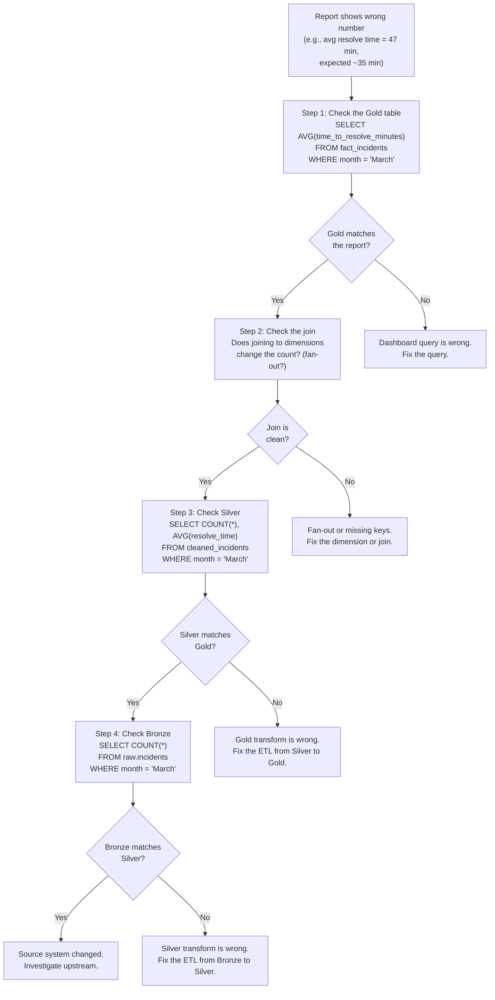
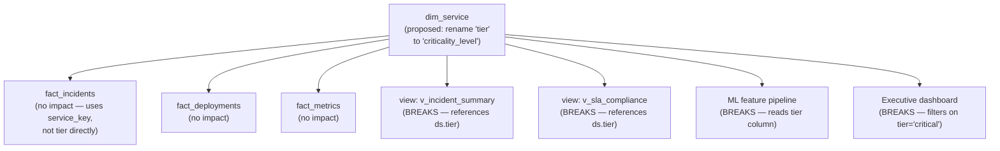

# Data Modeling — Observability and Troubleshooting

**How to detect, diagnose, and fix the five most common data modeling problems in production.**

---

## The Five Common Modeling Problems

Every data modeling bug falls into one of five categories. Each has a specific symptom, a specific detection query, and a specific fix. Learn these five and you can diagnose any data quality issue in a star schema.

| Problem | Symptom | Root Cause |
|:---|:---|:---|
| Fan-out join | Row count is higher than expected. Aggregates are inflated. | A join introduced a many-to-many relationship where one-to-many was expected. |
| Missing dimension keys | NULLs or -1 values in fact table foreign keys. Rows disappear from INNER JOIN queries. | Dimension table does not have a matching row for the fact's natural key. |
| Duplicate facts | The same event is counted twice. Totals are inflated. | ETL loaded the same source row more than once, or a reprocessed batch was appended instead of replaced. |
| Stale dimensions | Reports show outdated attribute values. An engineer who moved teams still shows under the old team. | SCD Type 2 process did not run, or the source system update was not detected. |
| Grain violations | Aggregates produce wrong numbers. Daily and hourly data mixed in one table. | Rows at different granularities coexist in the same fact table. |

---

## Problem 1: Fan-Out Joins

**What happens:** A query that should return 500 rows returns 1,500 because a join multiplied the rows.

**The analogy:** You have a list of 500 calls. You join it to a table of agent skills (3 skills per agent). Now every call appears 3 times — once for each skill. Your `COUNT(*)` is 1,500 and your `SUM(revenue)` is tripled.

### Detection

```sql
-- Check: does joining fact to dimension change the row count?
SELECT 'fact_only' AS source, COUNT(*) AS rows
FROM prod_diagnostics.fact_incidents

UNION ALL

SELECT 'fact_joined_service', COUNT(*)
FROM prod_diagnostics.fact_incidents AS f
JOIN prod_diagnostics.dim_service AS ds ON f.service_key = ds.service_key

UNION ALL

SELECT 'fact_joined_engineer', COUNT(*)
FROM prod_diagnostics.fact_incidents AS f
JOIN prod_diagnostics.dim_engineer AS de ON f.assignee_key = de.engineer_key;
```

**Expected:** All three counts are identical. If `fact_joined_engineer` is higher, the join to `dim_engineer` is fanning out — likely because `dim_engineer` has multiple current rows for the same engineer (SCD Type 2 bug where `is_current` was not set correctly).

### Diagnosis

```sql
-- Find the dimension rows causing fan-out
SELECT de.engineer_email, COUNT(*) AS version_count
FROM prod_diagnostics.dim_engineer AS de
WHERE de.is_current = TRUE
GROUP BY de.engineer_email
HAVING COUNT(*) > 1;
```

If this returns results, multiple rows are marked as `is_current = TRUE` for the same engineer. The SCD load has a bug.

### Fix

Fix the dimension data (expire the duplicate current rows), then fix the SCD load process to ensure only one row per natural key has `is_current = TRUE`.

```sql
-- Emergency fix: dedup the dimension (keep the row with the latest effective_date)
UPDATE prod_diagnostics.dim_engineer
SET is_current = FALSE
WHERE engineer_key IN (
    SELECT engineer_key FROM (
        SELECT
            engineer_key,
            ROW_NUMBER() OVER (
                PARTITION BY engineer_email
                ORDER BY effective_date DESC
            ) AS rn
        FROM prod_diagnostics.dim_engineer
        WHERE is_current = TRUE
    )
    WHERE rn > 1
);
```

---

## Problem 2: Missing Dimension Keys

**What happens:** Fact rows have `service_key = -1` (unknown member) or NULL foreign keys. INNER JOIN queries silently drop these rows. Totals do not match the source system.

### Detection

```sql
-- Count unknown members per foreign key column
SELECT
    'service_key' AS fk_column,
    COUNTIF(service_key = -1) AS unknown_count,
    COUNT(*) AS total_rows,
    ROUND(COUNTIF(service_key = -1) / COUNT(*) * 100, 2) AS unknown_pct
FROM prod_diagnostics.fact_incidents

UNION ALL

SELECT
    'severity_key',
    COUNTIF(severity_key = -1),
    COUNT(*),
    ROUND(COUNTIF(severity_key = -1) / COUNT(*) * 100, 2)
FROM prod_diagnostics.fact_incidents

UNION ALL

SELECT
    'assignee_key',
    COUNTIF(assignee_key = -1),
    COUNT(*),
    ROUND(COUNTIF(assignee_key = -1) / COUNT(*) * 100, 2)
FROM prod_diagnostics.fact_incidents;
```

**Acceptable threshold:** Under 1% unknown members is normal (edge cases, timing issues). Over 5% indicates a systemic problem — the dimension load is not covering all source values.

### Diagnosis

```sql
-- What are the unresolved natural keys?
SELECT DISTINCT i.service_name
FROM raw.incidents AS i
LEFT JOIN prod_diagnostics.dim_service AS ds
    ON i.service_name = ds.service_name AND ds.is_current = TRUE
WHERE ds.service_key IS NULL;
```

This shows the source system values that have no match in the dimension. Common causes: new services deployed but not registered, naming inconsistencies (`payment-api` vs `Payment-API`), services from a different environment (staging data mixed with production).

### Fix

Add the missing values to the dimension table. Then re-run the fact load (or update the -1 keys to the correct surrogate keys).

---

## Problem 3: Duplicate Facts

**What happens:** The same incident appears twice in `fact_incidents`. Total incident count is inflated. Average resolution time may shift (if duplicates have different computed values).

### Detection

```sql
-- Check for duplicate source IDs (degenerate dimensions)
SELECT incident_id, COUNT(*) AS occurrence_count
FROM prod_diagnostics.fact_incidents
GROUP BY incident_id
HAVING COUNT(*) > 1
ORDER BY occurrence_count DESC
LIMIT 20;
```

### Diagnosis

If duplicates exist, check why:

| Cause | Detection |
|:---|:---|
| ETL ran twice (reprocessed a batch) | Check pipeline logs for double runs. Check `load_timestamp` if you track it. |
| Source system sends duplicates | Check Bronze: `SELECT incident_id, COUNT(*) FROM raw.incidents GROUP BY incident_id HAVING COUNT(*) > 1` |
| Incremental load overlap | The incremental window overlaps with the previous load. Date filter is `>=` instead of `>`. |

### Fix

```sql
-- Dedup fact table (keep the first occurrence based on load order)
CREATE OR REPLACE TABLE prod_diagnostics.fact_incidents AS
SELECT * FROM (
    SELECT
        *,
        ROW_NUMBER() OVER (PARTITION BY incident_id ORDER BY incident_key) AS rn
    FROM prod_diagnostics.fact_incidents
)
WHERE rn = 1;
```

Then fix the root cause — add dedup logic to the ETL, fix the incremental window, or dedup at the Bronze/Silver layer.

**Prevention:** Add a `MERGE` statement or `INSERT ... WHERE NOT EXISTS` pattern to the load process. Never use bare `INSERT INTO` for incremental loads.

---

## Problem 4: Stale Dimensions

**What happens:** An engineer transferred to a new team last week, but `dim_engineer` still shows the old team. Historical reports are correct (they use the old version), but current reports are wrong.

### Detection

```sql
-- Compare current dimension values against source
SELECT
    ds.service_name,
    ds.team AS dim_team,
    src.team AS source_team,
    ds.tier AS dim_tier,
    src.tier AS source_tier
FROM prod_diagnostics.dim_service AS ds
JOIN raw.service_registry AS src ON ds.service_name = src.service_name
WHERE ds.is_current = TRUE
AND (ds.team != src.team OR ds.tier != src.tier);
```

If this returns rows, the dimension is stale — the source has changed but the SCD process did not update the dimension.

### Diagnosis

| Cause | How to Confirm |
|:---|:---|
| SCD pipeline did not run | Check the pipeline scheduler (Airflow, Cloud Composer). Look for failed or skipped runs. |
| SCD logic has a bug | Run the SCD process manually on a test dataset. Check if it detects changes correctly. |
| Source system update was delayed | Check the source system's last update timestamp. The dimension load may have run before the source was updated. |

### Fix

Run the SCD process manually to catch up. Then fix the scheduling or ordering issue to prevent recurrence.

---

## Problem 5: Grain Violations

**What happens:** A fact table that should have one row per incident contains rows at different granularities — some rows represent individual incidents, others represent daily summaries. Aggregations produce nonsensical results.

### Detection

```sql
-- Check grain consistency: each incident_id should appear exactly once
SELECT
    incident_id,
    COUNT(*) AS row_count,
    COUNT(DISTINCT date_key) AS distinct_dates
FROM prod_diagnostics.fact_incidents
GROUP BY incident_id
HAVING COUNT(*) > 1;

-- If distinct_dates > 1 for the same incident_id, something is wrong —
-- the same incident is appearing across multiple dates (grain violation or
-- the incident spans midnight and was split incorrectly).
```

**Another symptom:** The table contains rows where some measure columns are NULL because they do not apply at that grain. If `time_to_resolve_minutes` is NULL for 30% of rows, those rows may be at a different grain (metric snapshots mixed with incidents).

### Fix

Separate the grains into different tables. A fact table must have exactly one grain. Mixed grains make every aggregate ambiguous.

---

## The Drill-Down Debugging Method

When a report shows a wrong number, work backward from the consumption layer to the source. This systematic approach avoids random guessing.



**Step-by-step:**

1. **Check the Gold table.** Run the simplest possible query against the fact table. Does it match the report? If not, the dashboard query is wrong (wrong filter, wrong join, wrong aggregation).

2. **Check the join.** Add one dimension join at a time. Does the row count change? If yes, a fan-out or missing key issue exists.

3. **Check Silver.** Run the equivalent query against the cleaned/Silver table. Does it match Gold? If not, the Gold transform (the ETL from Silver to Gold) has a bug — bad join, wrong surrogate key assignment, dropped rows.

4. **Check Bronze.** Compare Bronze row counts to Silver. If Bronze has more rows, Silver is dropping rows (dedup too aggressive, filter too strict). If Bronze has fewer rows, Silver is creating rows (bad join in the cleaning step).

5. **Check the source.** If Bronze matches Silver matches Gold and the number is still wrong, the source system itself changed — new data format, missing records, or a schema change upstream.

---

## Row Count Reconciliation

The simplest and most effective data quality check: compare row counts across layers.

```sql
-- Row count reconciliation across Bronze → Silver → Gold
SELECT 'bronze_incidents' AS layer, COUNT(*) AS rows FROM raw.incidents
UNION ALL
SELECT 'silver_incidents', COUNT(*) FROM staging.cleaned_incidents
UNION ALL
SELECT 'gold_fact_incidents', COUNT(*) FROM prod_diagnostics.fact_incidents
UNION ALL
SELECT 'gold_unique_incident_ids', COUNT(DISTINCT incident_id) FROM prod_diagnostics.fact_incidents;
```

**Expected relationships:**

| Comparison | Expected | If Not |
|:---|:---|:---|
| Bronze >= Silver | Silver removes duplicates and invalid rows | Silver is creating rows (bad join or exploding arrays) |
| Silver = Gold (unique incident_ids) | One-to-one mapping from cleaned incidents to fact rows | Gold load is dropping rows (failed dimension lookups with INNER JOIN) or creating duplicates |
| Gold rows = Gold unique incident_ids | No duplicate facts | Duplicate load — dedup needed |

**Automate this:** Run reconciliation after every pipeline run. If any comparison fails the expected relationship, alert and halt downstream processing. A wrong number that propagates to a dashboard is harder to fix than a pipeline that stops and waits for investigation.

---

## Impact Analysis

**Impact analysis** answers: "If I change this dimension table, what breaks?"

Before making any schema change, trace its downstream dependencies:



**Steps for impact analysis:**

1. **Query the warehouse metadata** to find all views, procedures, and scheduled queries that reference the table and column.
2. **Check dbt lineage** (if using dbt) — `dbt ls --select +dim_service+` shows everything upstream and downstream.
3. **Search the codebase** for the column name in Python scripts, Airflow DAGs, and notebook SQL.
4. **Check BI tools** — Looker LookML files, Tableau calculated fields, Power BI measures that reference the column.
5. **Notify all consumers** before making the change. Use the data contract process.

---

## Model Testing

### dbt Tests

dbt provides built-in tests that run against the model after every build:

```yaml
# schema.yml
models:
  - name: fact_incidents
    columns:
      - name: incident_key
        tests:
          - unique
          - not_null
      - name: service_key
        tests:
          - not_null
          - relationships:
              to: ref('dim_service')
              field: service_key
      - name: time_to_resolve_minutes
        tests:
          - not_null:
              where: "root_cause_category != 'unresolved'"
```

| Test | What It Catches |
|:---|:---|
| `unique` | Duplicate facts (grain violation) |
| `not_null` | Missing required values |
| `relationships` | Orphan foreign keys (no matching dimension row) |
| `accepted_values` | Unexpected values in categorical columns |

### Custom SQL Tests

```sql
-- Custom test: no incidents with negative resolution time
SELECT COUNT(*) AS negative_resolve_count
FROM prod_diagnostics.fact_incidents
WHERE time_to_resolve_minutes < 0;
-- Expected: 0. If > 0, the timestamp subtraction is wrong (detected_at > resolved_at).

-- Custom test: all current-year dates have matching dim_date rows
SELECT COUNT(*) AS missing_date_count
FROM prod_diagnostics.fact_incidents AS f
LEFT JOIN prod_diagnostics.dim_date AS dd ON f.date_key = dd.date_key
WHERE dd.date_key IS NULL;
-- Expected: 0. If > 0, dim_date does not cover the full date range.

-- Custom test: fact row count is within expected range
-- (guards against both empty loads and exploded loads)
SELECT
    CASE
        WHEN COUNT(*) = 0 THEN 'FAIL: empty table'
        WHEN COUNT(*) > 1000000 THEN 'FAIL: unexpectedly large'
        ELSE 'PASS'
    END AS result
FROM prod_diagnostics.fact_incidents;
```

### Automated Validation Pipeline

| Stage | Check | Failure Action |
|:---|:---|:---|
| Post-dimension-load | Orphan detection, SCD integrity (one current row per natural key) | Halt fact load |
| Post-fact-load | Grain validation, row count reconciliation, NULL foreign key rate | Halt downstream (dashboards, ML) |
| Post-aggregate-build | Aggregate totals match base fact totals | Alert, rebuild aggregate |
| Scheduled (daily) | Freshness check, schema validation, cross-layer reconciliation | Alert on-call data engineer |

---

**Hands-on notebook:** [Data Modeling on Colab](https://colab.research.google.com/github/sunilmogadati/systems-in-production/blob/main/implementation/notebooks/Data_Modeling.ipynb)

**Deep dive on star schema:** [Star Schema Design](../star-schema/)

---

### Quick Links — All Chapters

| Chapter | Title |
|:---|:---|
| [01](01_Why.md) | Why This Matters |
| [02](02_Concepts.md) | Concepts and Mental Models |
| [03](03_Hello_World.md) | Hello World |
| [04](04_How_It_Works.md) | How It Works |
| [05](05_Building_It.md) | Building It |
| [06](06_Production_Patterns.md) | Production Patterns |
| [07](07_System_Design.md) | System Design |
| [08](08_Quality_Security_Governance.md) | Quality, Security, Governance |
| [09](09_Observability_Troubleshooting.md) | Observability and Troubleshooting |
| [10](10_Decision_Guide.md) | Decision Guide |
