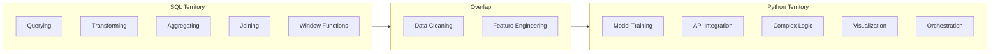
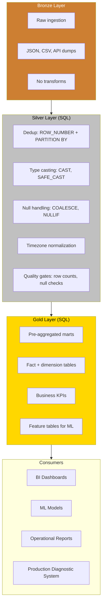

# SQL - Why It Still Matters

**Series:** SQL for Production Systems (1 of 10)
**Notebook:** [Advanced SQL on Colab](https://colab.research.google.com/github/sunilmogadati/systems-in-production/blob/main/implementation/notebooks/Advanced_SQL.ipynb)

---

## The Story

A machine learning (ML) engineer needs to build a feature table for a churn prediction model. The raw data lives in a warehouse: 18 months of call records, orders, payments, and customer interactions across six source tables. Fifty million rows.

She could pull everything into Python, join DataFrames in pandas, compute rolling averages and lag features in memory. She has done it before. It took 45 minutes to run and crashed twice on memory errors.

Instead, she writes 40 lines of SQL (Structured Query Language). Window functions compute rolling averages. Common Table Expressions (CTEs) stage the joins. A final `CREATE TABLE` materializes the feature table directly in the warehouse. The query runs in 90 seconds. The warehouse optimizer parallelized everything automatically.

This is not a hypothetical. This is how production feature engineering works at scale.

---

## 50 Years Old and Still the Default

SQL was invented in 1974 at IBM. It became an ANSI (American National Standards Institute) standard in 1986. Every major data system since then speaks it:

| System Type | Examples | SQL Support |
|---|---|---|
| **Relational databases** | PostgreSQL, MySQL, SQL Server, Oracle | Native SQL |
| **Cloud data warehouses** | BigQuery (Google), Redshift (AWS), Snowflake | SQL as primary interface |
| **Data lakes** | Spark SQL, Trino, Athena, Databricks | SQL on files (Parquet, Delta, Iceberg) |
| **Streaming** | ksqlDB, Flink SQL, Materialize | SQL on event streams |
| **Analytics tools** | Looker, Tableau, Metabase, dbt (data build tool) | Generate and execute SQL |
| **Feature stores** | Feast, Tecton, Databricks Feature Store | SQL for feature definitions |

No other data language has this reach. Python is powerful, but it does not run natively inside BigQuery. PySpark is scalable, but under the hood, Spark SQL is doing the optimization. Every analytics tool, every Business Intelligence (BI) dashboard, every dbt model -- SQL.

**If you learn one data language, learn SQL. If you learn two, learn SQL and Python.**

---

## SQL vs Python for Data Work

This is not an either/or decision. They serve different purposes in a production system.

| Task | Best Tool | Why |
|---|---|---|
| Query structured data | **SQL** | Runs inside the database engine, close to the data |
| Join multiple tables | **SQL** | The query optimizer handles join order and algorithm selection |
| Aggregate and group | **SQL** | `GROUP BY` with `HAVING` -- 2 lines. Pandas equivalent is more verbose and runs on one machine |
| Window functions (ranking, running totals, lag/lead) | **SQL** | Built-in, optimized, declarative |
| Deduplication | **SQL** | `ROW_NUMBER() OVER (PARTITION BY ...)` -- one expression |
| Data quality checks | **SQL** | `COUNT(*)`, null checks, uniqueness checks -- fast, in-database |
| Train ML models | **Python** | scikit-learn, PyTorch, TensorFlow -- no SQL equivalent |
| Call APIs | **Python** | HTTP requests, authentication, pagination -- imperative logic |
| Complex conditional logic | **Python** | Loops, branching, error handling -- SQL is declarative, not procedural |
| Build dashboards | **Python** (or BI tool) | Plotly, Streamlit, or Tableau/Looker which generate SQL underneath |
| Orchestrate pipelines | **Python** | Airflow, Dagster, Prefect -- Python for the DAG (Directed Acyclic Graph), SQL for the transforms |

**The production pattern:** Python orchestrates the pipeline. SQL does the heavy data work inside the warehouse. Python picks up the results for ML and application logic.

---

## Where SQL Fits in the Production System

In a Bronze-Silver-Gold data pipeline, SQL is the primary language for transforms at the Silver and Gold layers:

### SQL's Role at Each Layer

**Bronze to Silver** (cleaning and conforming):
- Deduplicate records using window functions
- Cast string columns to proper types (timestamps, integers, decimals)
- Normalize timezones from source-specific to UTC (Coordinated Universal Time)
- Handle nulls with `COALESCE` and `NULLIF`
- Apply quality gates: assert row counts, check for unexpected nulls, verify uniqueness

**Silver to Gold** (business modeling):
- Build fact and dimension tables (star schema)
- Pre-aggregate metrics that analysts query daily
- Compute derived columns: conversion rates, rolling averages, rankings
- Create feature tables that ML pipelines consume

**Gold to Consumers** (serving):
- BI tools query Gold tables directly with SQL
- ML pipelines read feature tables via SQL or DataFrame APIs
- Operational reports run scheduled SQL queries
- The Production Diagnostic System queries incident and health data from Gold marts

---

## Why Not Just Use Python for Everything?

Three reasons:

**1. Pushdown.** When you write SQL against BigQuery, the query runs on Google's distributed compute infrastructure. Thousands of slots process your data in parallel. When you write pandas, the data must travel to your machine and fit in memory. For 50 million rows, SQL finishes in seconds. Pandas may not finish at all.

**2. Optimization.** SQL is declarative -- you say WHAT you want, not HOW to get it. The query planner decides the execution strategy: which index to use, which join algorithm, which order to process tables. This optimizer has decades of engineering behind it. Your hand-written Python loop does not have an optimizer.

**3. Collaboration.** Every data analyst, data engineer, analytics engineer, and data scientist reads SQL. It is the lingua franca of data teams. A dbt model in SQL is readable by everyone on the team. A Python transform requires Python knowledge.

---

## What This Playbook Covers

This is not a beginner SQL tutorial. You will not find `SELECT * FROM employees` examples here.

This playbook covers SQL for building production systems:

| Chapter | What You Learn |
|---|---|
| 01 (this chapter) | Why SQL still matters in production |
| 02 | Core concepts: joins, window functions, CTEs, NULL handling, execution order |
| 03 | Hello World: 5 real queries against call center data |
| 04 | How SQL executes: query planner, indexes, join algorithms, EXPLAIN plans |
| 05 | Building data transforms: Silver/Gold patterns, dedup, MERGE, quality gates |

By the end, you will write the SQL that powers data pipelines, feeds ML models, and builds the analytical layer of a production system.

---

## Quick Links: SQL Chapter Series

| Chapter | Title |
|---|---|
| **01** | [Why It Still Matters](01_Why.md) |
| 02 | [Concepts](02_Concepts.md) |
| 03 | [Hello World](03_Hello_World.md) |
| 04 | [How It Works](04_How_It_Works.md) |
| 05 | [Building It](05_Building_It.md) |
| 06 | Production Patterns (coming soon) |
| 07 | System Design (coming soon) |
| 08 | Quality, Security, and Governance (coming soon) |
| 09 | Observability and Troubleshooting (coming soon) |
| 10 | Decision Guide (coming soon) |
